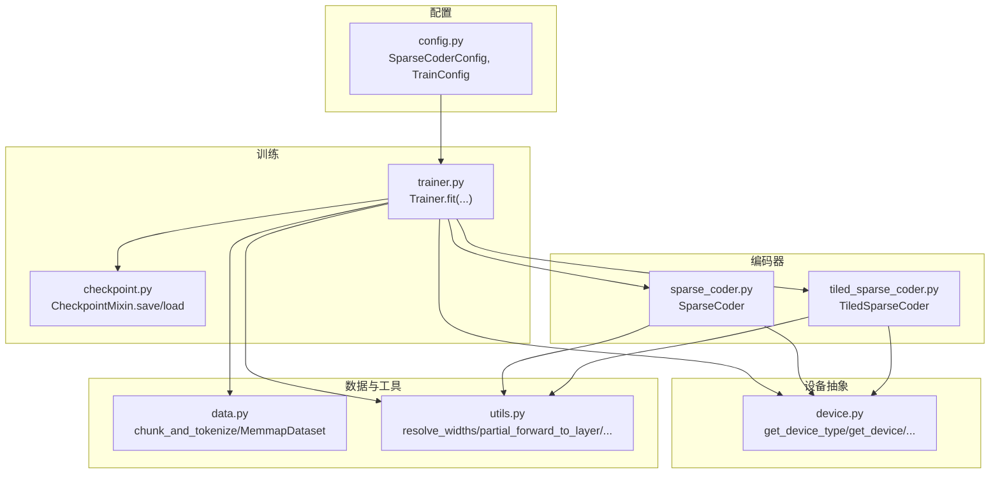
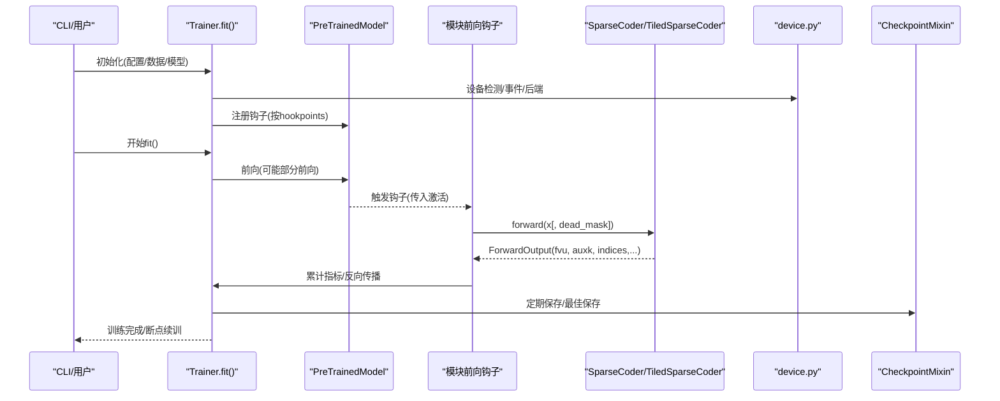
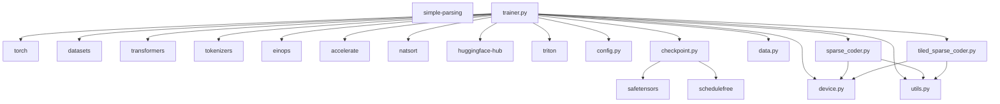

# API 参考

<cite>
**本文引用的文件**
- [sparsify/__init__.py](file://sparsify/__init__.py)
- [sparsify/device.py](file://sparsify/device.py)
- [sparsify/config.py](file://sparsify/config.py)
- [sparsify/trainer.py](file://sparsify/trainer.py)
- [sparsify/checkpoint.py](file://sparsify/checkpoint.py)
- [sparsify/sparse_coder.py](file://sparsify/sparse_coder.py)
- [sparsify/tiled_sparse_coder.py](file://sparsify/tiled_sparse_coder.py)
- [sparsify/data.py](file://sparsify/data.py)
- [sparsify/utils.py](file://sparsify/utils.py)
- [pyproject.toml](file://pyproject.toml)
- [tests/ascend/test_device_api.py](file://tests/ascend/test_device_api.py)
- [tests/test_encode.py](file://tests/test_encode.py)
- [tests/test_decode.py](file://tests/test_decode.py)
- [README.md](file://README.md)
</cite>

## 目录
1. [简介](#简介)
2. [项目结构](#项目结构)
3. [核心组件](#核心组件)
4. [架构总览](#架构总览)
5. [详细组件分析](#详细组件分析)
6. [依赖分析](#依赖分析)
7. [性能考量](#性能考量)
8. [故障排查指南](#故障排查指南)
9. [结论](#结论)
10. [附录](#附录)

## 简介
本文件为 Sparsify 项目的完整 API 参考，覆盖以下方面：
- 公共接口、类定义与方法签名
- SAE 训练 API（配置、训练器、检查点）
- 设备抽象 API（跨 CUDA/NPU 的统一设备层）
- 数据与工具 API（数据集、宽度解析、部分前向等）
- 参数类型、返回值、异常处理与使用示例
- 版本兼容性、废弃策略与迁移指南
- 性能优化建议与常见陷阱

## 项目结构
Sparsify 是围绕 Transformer 模块输入激活进行稀疏自编码器（SAE）训练的工具链，主要模块如下：
- 配置：定义训练与编码器配置的数据类
- 训练器：基于前向钩子的训练循环与分布式支持
- 编码器：标准与分块（Tiled）两种 SAE 实现
- 设备抽象：统一 CUDA/NPU/CPUs 的设备检测与操作
- 数据与工具：数据预处理、内存映射、宽度解析、部分前向等
- 检查点：保存/加载 SAE 与训练状态

图表来源
- [sparsify/config.py:1-149](file://sparsify/config.py#L1-L149)
- [sparsify/trainer.py:1-760](file://sparsify/trainer.py#L1-L760)
- [sparsify/checkpoint.py:1-302](file://sparsify/checkpoint.py#L1-L302)
- [sparsify/sparse_coder.py:1-269](file://sparsify/sparse_coder.py#L1-L269)
- [sparsify/tiled_sparse_coder.py:1-342](file://sparsify/tiled_sparse_coder.py#L1-L342)
- [sparsify/device.py:1-118](file://sparsify/device.py#L1-L118)
- [sparsify/data.py:1-158](file://sparsify/data.py#L1-L158)
- [sparsify/utils.py:1-227](file://sparsify/utils.py#L1-L227)

章节来源
- [sparsify/__init__.py:1-16](file://sparsify/__init__.py#L1-L16)
- [README.md:71-103](file://README.md#L71-L103)

## 核心组件
- 公共导出：通过包级导出暴露 SAE、配置与训练器等核心对象
- 版本信息：包版本与项目版本在不同位置维护，需注意一致性

章节来源
- [sparsify/__init__.py:1-16](file://sparsify/__init__.py#L1-L16)
- [pyproject.toml:29-29](file://pyproject.toml#L29-L29)

## 架构总览
Sparsify 的训练流程以“模型前向钩子”为核心，从指定模块捕获激活，经 SAE 编码/解码计算损失，再通过优化器更新参数；同时支持分布式、混合精度、梯度累积、微批、Tile 分块、Hadamard 预处理等高级特性。

图表来源
- [sparsify/trainer.py:162-728](file://sparsify/trainer.py#L162-L728)
- [sparsify/sparse_coder.py:188-239](file://sparsify/sparse_coder.py#L188-L239)
- [sparsify/tiled_sparse_coder.py:102-140](file://sparsify/tiled_sparse_coder.py#L102-L140)
- [sparsify/device.py:34-98](file://sparsify/device.py#L34-L98)
- [sparsify/checkpoint.py:199-302](file://sparsify/checkpoint.py#L199-L302)

## 详细组件分析

### 设备抽象 API（device.py）
用于屏蔽 CUDA 与 Ascend NPU 的差异，提供统一的设备选择、bf16 支持检测、事件与分布式后端等能力。

- 主要函数
  - get_device_type() -> str：返回 "cuda"、"npu" 或 "cpu"
  - get_device(rank: int = 0) -> torch.device：返回具体设备
  - get_device_string(rank: int = 0) -> str：返回设备字符串
  - is_accelerator_available() -> bool：是否可用加速器
  - is_bf16_supported() -> bool：当前平台是否支持 bf16
  - set_device(rank: int) -> None：设置当前设备
  - synchronize() -> None：同步当前设备
  - create_event(enable_timing: bool = True) -> Any：创建计时事件
  - get_dist_backend() -> str：返回分布式后端名称
  - device_autocast(func) -> 装饰器：自动 bf16 autocast

- 使用场景
  - 在 SAE 前向中使用装饰器以获得混合精度加速
  - 在 CUDA/NPU 上分别创建事件进行计时
  - 在分布式训练中根据平台选择后端

- 异常与边界
  - 当设备不可用时，事件创建可能返回 None
  - bf16 支持在 NPU 默认为 True，CUDA 由底层能力决定

章节来源
- [sparsify/device.py:34-118](file://sparsify/device.py#L34-L118)
- [tests/ascend/test_device_api.py:1-70](file://tests/ascend/test_device_api.py#L1-L70)

### 配置 API（config.py）
定义训练与编码器的核心配置数据结构，支持序列化与校验。

- 类型与字段
  - SparseCoderConfig
    - expansion_factor: int（默认 32）
    - normalize_decoder: bool（默认 True）
    - num_latents: int（默认 0，表示使用 expansion_factor）
    - k: int（默认 32）
    - 别名：SaeConfig = SparseCoderConfig
  - TrainConfig
    - sae: SparseCoderConfig
    - batch_size: int（默认 32）
    - grad_acc_steps: int（默认 1）
    - micro_acc_steps: int（默认 1）
    - max_tokens: int | None（默认 None）
    - lr: float | None（默认 None）
    - auxk_alpha: float（默认 0.0）
    - dead_feature_threshold: int（默认 10_000_000）
    - exceed_alphas: list[float]（默认 [0.05, 0.10, 0.25, 0.50]）
    - elbow_threshold_path: str | None（默认 None）
    - hookpoints: list[str]（默认 []）
    - init_seeds: list[int]（默认 [0]）
    - layers: list[int]（默认 []）
    - layer_stride: int（默认 1）
    - num_tiles: int（默认 1）
    - global_topk: bool（默认 False）
    - input_mixing: bool（默认 False）
    - use_hadamard: bool（默认 False）
    - hadamard_block_size: int（默认 128）
    - hadamard_seed: int（默认 0）
    - hadamard_use_perm: bool（默认 True）
    - compile_model: bool（默认 False）
    - save_every: int（默认 1000）
    - save_best: bool（默认 False）
    - save_dir: str（默认 "checkpoints"）
    - log_to_wandb: bool（默认 True）
    - run_name: str | None（默认 None）
    - wandb_project: str | None（默认 None）
    - wandb_log_frequency: int（默认 1）
    - finetune: str | None（默认 None）

- 校验逻辑
  - layers 与 layer_stride 不能同时指定
  - 至少一个随机种子
  - exceed_alphas 必须为正
  - elbow_threshold_path 文件存在性
  - compile_model 仅在 CUDA 生效
  - hadamard_block_size 必须为正的 2 的幂

- 使用示例路径
  - [训练配置示例:38-52](file://README.md#L38-L52)
  - [配置参考文档](file://docs/training/config-reference.md)

章节来源
- [sparsify/config.py:7-149](file://sparsify/config.py#L7-L149)

### 训练器 API（trainer.py）
- Trainer.fit()
  - 功能：驱动一次完整的训练循环，包括钩子注册、前向/反向、指标统计、分布式聚合、检查点保存与日志记录
  - 关键行为
    - 解析 hookpoints（支持范围模式展开与通配符匹配）
    - 初始化 SAE（普通或分块），可选 DDP 包装
    - 梯度累积与微批处理
    - 死特征检测与统计
    - 超阈值比例（exceed）评估
    - 计时与指标聚合（仅在需要时）
    - 断点续训与目标 token 达成后的提前退出
  - 返回：无（副作用为保存检查点与更新内部状态）

- 辅助方法
  - maybe_all_reduce(x, op="mean") -> Tensor：分布式归约
  - maybe_all_cat(x) -> Tensor：分布式拼接
  - save()/save_best(avg_loss)/load_state(path)：检查点管理

- 异常与边界
  - 当未指定 layers 且未提供 hookpoints 时，会自动选择全部层
  - 若启用 compile_model，非 CUDA 平台会自动降级
  - 当达到 max_tokens 时立即保存并退出

章节来源
- [sparsify/trainer.py:39-759](file://sparsify/trainer.py#L39-L759)

### 检查点 API（checkpoint.py）
- 工具函数
  - is_tiled_checkpoint(path) -> bool：判断是否为分块检查点
  - get_checkpoint_num_tiles(path) -> int：读取检查点中的 num_tiles
  - load_sae_checkpoint(sae, path, device) -> None：加载单个 SAE（含分块与普通）
- CheckpointMixin
  - save()：保存训练器与 SAE 状态
  - save_best(avg_loss)：保存最佳 SAE
  - load_state(path)：加载训练器状态与优化器状态
  - _load_elbow_thresholds(path)：加载并匹配肘部阈值
  - _checkpoint(saes, path, rank_zero, save_training_state=True)：内部保存实现

- 异常与边界
  - 分块与非分块之间的不匹配会抛出 TypeError/ValueError
  - 未找到匹配的肘部阈值会发出警告但不影响训练

章节来源
- [sparsify/checkpoint.py:22-302](file://sparsify/checkpoint.py#L22-L302)

### 编码器 API（sparse_coder.py）
- ForwardOutput（命名元组）
  - sae_out: Tensor
  - latent_acts: Tensor
  - latent_indices: Tensor
  - fvu: Tensor
  - auxk_loss: Tensor

- SparseCoder
  - 构造：d_in: int, cfg: SparseCoderConfig, device, dtype, decoder: bool
  - 类方法
    - load_many(name, local=False, layers=None, device, decoder=True, pattern=None) -> dict[str, SparseCoder]
    - load_from_hub(name, hookpoint=None, device, decoder=True) -> SparseCoder
    - load_from_disk(path, device, decoder=True) -> SparseCoder
  - 实例方法
    - save_to_disk(path)
    - device/dtype 属性
    - encode(x: Tensor) -> EncoderOutput
    - decode(top_acts: Tensor, top_indices: Tensor) -> Tensor
    - forward(x: Tensor, y: Tensor|None=None, *, dead_mask: Tensor|None=None) -> ForwardOutput
    - set_decoder_norm_to_unit_norm()
    - remove_gradient_parallel_to_decoder_directions()

- 使用场景
  - 自编码（y=None，默认）
  - 辅助死特征恢复（auxk_loss）
  - 单独保存/加载权重与配置

章节来源
- [sparsify/sparse_coder.py:20-269](file://sparsify/sparse_coder.py#L20-L269)

### 分块编码器 API（tiled_sparse_coder.py）
- TiledSparseCoder
  - 构造：d_in: int, cfg: SparseCoderConfig, num_tiles: int, device, dtype, global_topk: bool=False, input_mixing: bool=False
  - 属性：num_latents, device, dtype, W_dec, b_dec
  - 方法
    - set_b_dec_data(value: Tensor)
    - forward(x: Tensor, y: Tensor|None=None, *, dead_mask: Tensor|None=None) -> ForwardOutput
    - set_decoder_norm_to_unit_norm()
    - remove_gradient_parallel_to_decoder_directions()
    - save_to_disk(path)
    - load_from_disk(path, device, decoder=True) -> TiledSparseCoder

- 特性
  - 将输入沿隐藏维切分为 num_tiles 份，每份独立训练 SAE
  - 支持全局 top-k（global_topk）与输入混洗（input_mixing）
  - 保存时包含分块配置与每个子 SAE 的权重

章节来源
- [sparsify/tiled_sparse_coder.py:17-342](file://sparsify/tiled_sparse_coder.py#L17-L342)

### 数据与工具 API（data.py, utils.py）
- data.py
  - chunk_and_tokenize(...)
    - 输入：Dataset/DatasetDict、tokenizer、参数
    - 输出：格式化的 Dataset
  - get_columns_all_equal(dataset) -> list[str]
  - MemmapDataset：基于内存映射的 torch.utils.data.Dataset

- utils.py
  - resolve_widths(model, module_names, dim=-1, hook_mode="output") -> dict[str, int]
  - get_max_layer_index(hookpoints, layers_name) -> int | None
  - partial_forward_to_layer(model, input_ids, max_layer_idx) -> None
  - set_submodule(model, submodule_path, new_submodule)
  - decoder_impl：根据设备选择融合解码实现（CUDA/NPU 使用 fused_decode，否则 eager_decode）
  - handle_arg_string / simple_parse_args_string：参数解析辅助

章节来源
- [sparsify/data.py:16-158](file://sparsify/data.py#L16-L158)
- [sparsify/utils.py:20-227](file://sparsify/utils.py#L20-L227)

## 依赖分析
- 运行时依赖（来自 pyproject.toml）
  - torch、accelerate、datasets、transformers、tokenizers、einops、safetensors、simple-parsing、schedulefree、natsort、huggingface-hub、triton 等
- 内部耦合
  - Trainer 依赖 Config、CheckpointMixin、Device、Data、Utils、SparseCoder/TiledSparseCoder
  - SparseCoder/TiledSparseCoder 依赖 Device、Utils、Fused 编码/解码实现
  - CheckpointMixin 依赖 Safetensors 与 ScheduleFree 包装器

图表来源
- [pyproject.toml:12-28](file://pyproject.toml#L12-L28)
- [sparsify/trainer.py:21-34](file://sparsify/trainer.py#L21-L34)
- [sparsify/checkpoint.py:12-17](file://sparsify/checkpoint.py#L12-L17)

章节来源
- [pyproject.toml:12-28](file://pyproject.toml#L12-L28)

## 性能考量
- 混合精度与 bf16
  - device_autocast 装饰器在 SAE 前向中自动启用 bf16（若平台支持）
  - fused_decode 在 CUDA/NPU 上提供更优性能，避免 CPU 回退
- 计时与事件
  - create_event 与 synchronize 用于精确测量前向与指标耗时
- 分布式与归约
  - maybe_all_reduce 与批量归约减少通信开销
- 梯度累积与微批
  - grad_acc_steps 与 micro_acc_steps 提升吞吐与显存利用
- 编码器融合
  - fused_encoder/fused_decode 在 CUDA/NPU 上显著降低内核启动与数据搬运成本
- 编译优化
  - compile_model 使用 torch.compile 对层进行融合，减少小算子开销（仅 CUDA）

章节来源
- [sparsify/device.py:101-118](file://sparsify/device.py#L101-L118)
- [sparsify/utils.py:185-197](file://sparsify/utils.py#L185-L197)
- [tests/test_encode.py:10-61](file://tests/test_encode.py#L10-L61)
- [tests/test_decode.py:16-85](file://tests/test_decode.py#L16-L85)

## 故障排查指南
- 设备相关
  - 现象：事件创建返回 None 或计时不生效
  - 排查：确认 is_accelerator_available() 与 get_device_type() 返回预期
  - 参考：[tests/ascend/test_device_api.py:50-70](file://tests/ascend/test_device_api.py#L50-L70)
- 检查点不兼容
  - 症状：从分块/非分块检查点恢复时报错
  - 处理：确保 num_tiles 一致，或在加载前检查 is_tiled_checkpoint
  - 参考：[sparsify/checkpoint.py:44-73](file://sparsify/checkpoint.py#L44-L73)
- 配置校验失败
  - 症状：初始化 Trainer 抛出 ValueError
  - 处理：检查 layers 与 layer_stride、init_seeds、hadamard_block_size 等约束
  - 参考：[sparsify/config.py:124-149](file://sparsify/config.py#L124-L149)
- 指标异常
  - 症状：FVU 或 exceed 指标异常
  - 处理：确认输入混洗与 Hadamard 预处理对 FVU 计算的影响（见 TiledSparseCoder）
  - 参考：[sparsify/tiled_sparse_coder.py:122-140](file://sparsify/tiled_sparse_coder.py#L122-L140)
- 梯度 NaN/Inf
  - 症状：梯度出现非有限值
  - 处理：检查学习率、normalize_decoder、dead_mask 与 auxk_alpha 设置
  - 参考：[sparsify/sparse_coder.py:208-229](file://sparsify/sparse_coder.py#L208-L229)

章节来源
- [tests/ascend/test_device_api.py:1-70](file://tests/ascend/test_device_api.py#L1-L70)
- [sparsify/checkpoint.py:44-73](file://sparsify/checkpoint.py#L44-L73)
- [sparsify/config.py:124-149](file://sparsify/config.py#L124-L149)
- [sparsify/tiled_sparse_coder.py:122-140](file://sparsify/tiled_sparse_coder.py#L122-L140)
- [sparsify/sparse_coder.py:208-229](file://sparsify/sparse_coder.py#L208-L229)

## 结论
本 API 参考系统梳理了 Sparsify 的核心接口与实现细节，涵盖配置、训练、设备抽象、数据与工具、检查点等模块。遵循本文档可确保正确使用各 API，并在性能与稳定性之间取得平衡。如需进一步了解 CLI 使用与导出流程，请参阅项目 README 与相关文档链接。

## 附录

### 版本兼容性与废弃策略
- 版本来源
  - 包版本：pyproject.toml 中的 project.version
  - 包内版本：sparsify/__init__.py 中的 __version__
- 兼容性建议
  - 以 README 与 docs 中的最新说明为准；当文档与代码冲突时，以代码为准
  - 旧版功能（如 Ascend 主平台）不再作为默认路径，新功能优先保证 CUDA 兼容性
- 迁移指南
  - 将 SAE 类别名 Sae/SaeConfig 与 SparseCoder/SparseCoderConfig 统一使用后者
  - 将 Trainer 的旧别名 SaeTrainer 替换为 Trainer
  - 配置项 compile_model 仅在 CUDA 生效，其他平台自动降级

章节来源
- [pyproject.toml:29-29](file://pyproject.toml#L29-L29)
- [sparsify/__init__.py:1-16](file://sparsify/__init__.py#L1-L16)
- [README.md:115-116](file://README.md#L115-L116)

### 使用示例与场景
- 最小化训练示例（CLI）
  - 参考：[README.md:38-52](file://README.md#L38-L52)
- 程序化加载 SAE
  - 从 Hub 加载：[README.md:119-125](file://README.md#L119-L125)
  - 从磁盘加载：[README.md:127-133](file://README.md#L127-L133)
- 编码器性能对比测试
  - 参考：[tests/test_encode.py:10-61](file://tests/test_encode.py#L10-L61)
  - 解码器性能与梯度一致性测试：[tests/test_decode.py:16-85](file://tests/test_decode.py#L16-L85)