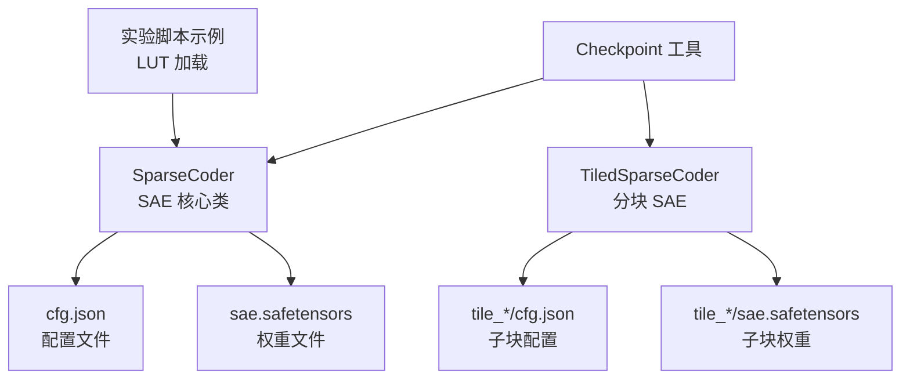
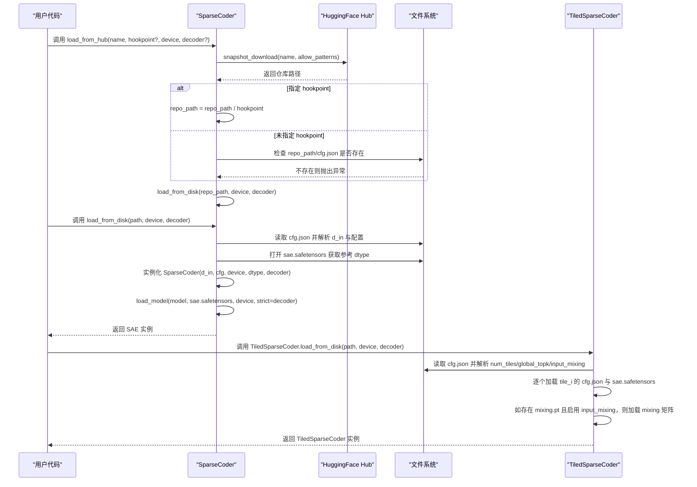
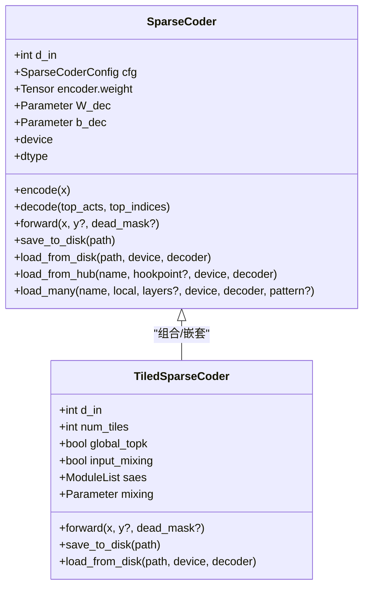
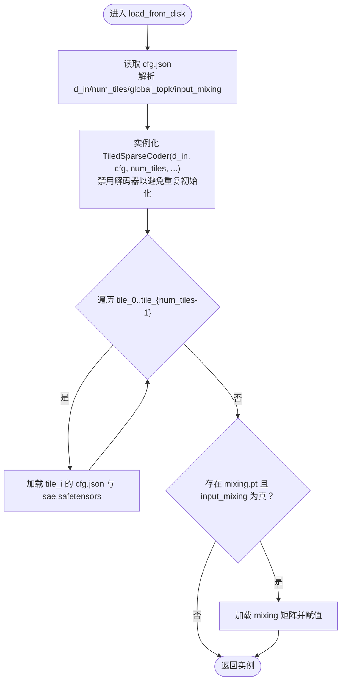
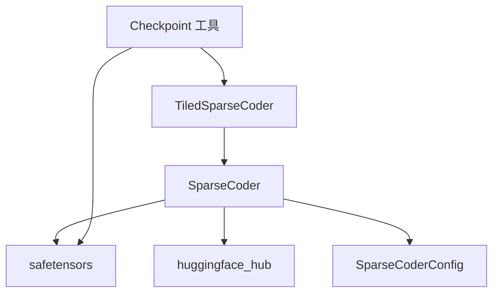

# SAE 加载 API

<cite>
**本文引用的文件**
- [sparsify/sparse_coder.py](file://sparsify/sparse_coder.py)
- [sparsify/tiled_sparse_coder.py](file://sparsify/tiled_sparse_coder.py)
- [sparsify/config.py](file://sparsify/config.py)
- [sparsify/checkpoint.py](file://sparsify/checkpoint.py)
- [experiments/cg_coefficients/eval.py](file://experiments/cg_coefficients/eval.py)
- [tests/test_tiled_sparse_coder.py](file://tests/test_tiled_sparse_coder.py)
</cite>

## 目录
1. [简介](#简介)
2. [项目结构](#项目结构)
3. [核心组件](#核心组件)
4. [架构总览](#架构总览)
5. [详细组件分析](#详细组件分析)
6. [依赖关系分析](#依赖关系分析)
7. [性能考虑](#性能考虑)
8. [故障排除指南](#故障排除指南)
9. [结论](#结论)
10. [附录](#附录)

## 简介
本文件系统性地阐述 SAE（稀疏自动编码器）加载 API，聚焦于 SparseCoder 类及其别名 Sae 的静态工厂方法与状态管理能力。内容覆盖以下方面：
- 静态工厂方法：load_from_disk、load_from_hub、load_many、load_from_hub 的参数、行为与错误处理
- 文件格式与目录结构要求：cfg.json、sae.safetensors 的约定
- 设备迁移与权重加载：如何在 CPU/GPU 上加载并保持张量类型一致
- 性能优化建议与常见问题排查
- 与 TiledSparseCoder 的协同加载流程

## 项目结构
围绕 SAE 加载的核心代码位于以下模块：
- sparsify/sparse_coder.py：定义 SparseCoder/Sae 及其加载/保存逻辑
- sparsify/tiled_sparse_coder.py：定义 TiledSparseCoder，并实现分块 SAE 的加载/保存
- sparsify/config.py：定义 SparseCoderConfig 等配置类
- sparsify/checkpoint.py：提供检查点工具，含加载/保存 SAE 的通用逻辑
- experiments/cg_coefficients/eval.py：展示从 LUT 文件加载 SAE 的示例
- tests/test_tiled_sparse_coder.py：验证 TiledSparseCoder 的保存/加载流程

**图示来源**
- [sparsify/sparse_coder.py:121-152](file://sparsify/sparse_coder.py#L121-L152)
- [sparsify/tiled_sparse_coder.py:278-341](file://sparsify/tiled_sparse_coder.py#L278-L341)
- [sparsify/checkpoint.py:44-72](file://sparsify/checkpoint.py#L44-L72)
- [experiments/cg_coefficients/eval.py:66-81](file://experiments/cg_coefficients/eval.py#L66-L81)

**章节来源**
- [sparsify/sparse_coder.py:36-166](file://sparsify/sparse_coder.py#L36-L166)
- [sparsify/tiled_sparse_coder.py:17-341](file://sparsify/tiled_sparse_coder.py#L17-L341)
- [sparsify/config.py:7-25](file://sparsify/config.py#L7-L25)
- [sparsify/checkpoint.py:1-302](file://sparsify/checkpoint.py#L1-L302)
- [experiments/cg_coefficients/eval.py:48-81](file://experiments/cg_coefficients/eval.py#L48-L81)
- [tests/test_tiled_sparse_coder.py:117-144](file://tests/test_tiled_sparse_coder.py#L117-L144)

## 核心组件
- SparseCoder（别名 Sae）：SAE 主体，提供多种静态工厂方法用于加载与批量加载
- TiledSparseCoder：将输入按维度切分为多个块，每个块独立训练一个 SAE，支持全局 top-k 与输入混合
- SparseCoderConfig：SAE 架构配置（扩展因子、k、归一化等）
- Checkpoint 工具：统一的检查点加载/保存接口，兼容常规与分块 SAE

关键职责与关系：
- SparseCoder 负责单体 SAE 的加载/保存，依赖 cfg.json 与 sae.safetensors
- TiledSparseCoder 在保存时拆分子块并在加载时重建，支持 mixing 矩阵
- Checkpoint 工具根据 cfg.json 中的 num_tiles 判断是否为分块检查点，并进行相应加载

**章节来源**
- [sparsify/sparse_coder.py:36-166](file://sparsify/sparse_coder.py#L36-L166)
- [sparsify/tiled_sparse_coder.py:17-341](file://sparsify/tiled_sparse_coder.py#L17-L341)
- [sparsify/config.py:7-25](file://sparsify/config.py#L7-L25)
- [sparsify/checkpoint.py:44-72](file://sparsify/checkpoint.py#L44-L72)

## 架构总览
下图展示了 SAE 加载的整体流程，涵盖本地磁盘、Hub 下载与分块加载：

**图示来源**
- [sparsify/sparse_coder.py:97-152](file://sparsify/sparse_coder.py#L97-L152)
- [sparsify/tiled_sparse_coder.py:305-341](file://sparsify/tiled_sparse_coder.py#L305-L341)

## 详细组件分析

### SparseCoder 加载 API
- load_from_hub
  - 功能：从 HuggingFace Hub 下载仓库，按需限定 hookpoint 子目录，随后委托给 load_from_disk
  - 参数要点：
    - name：仓库名称
    - hookpoint：可选，限定到具体 hookpoint 目录
    - device：目标设备字符串或 torch.device
    - decoder：是否加载解码器权重
  - 错误处理：若未指定 hookpoint 且根目录无 cfg.json，抛出 FileNotFoundError
  - 返回：SparseCoder 实例

- load_from_disk
  - 功能：从本地路径加载 SAE
  - 步骤：
    1) 读取 cfg.json，提取 d_in 与配置字典，构造 SparseCoderConfig
    2) 通过 safetensors 安全打开 sae.safetensors，推断参考 dtype
    3) 实例化 SparseCoder(d_in, cfg, device, dtype, decoder)
    4) 使用 load_model 将权重加载至模型，strict=decoder 控制解码器严格匹配
  - 返回：SparseCoder 实例

- load_many
  - 功能：批量加载多个 hookpoint 的 SAE
  - 支持本地路径与 Hub 两种模式，可通过 layers 或 pattern 过滤
  - 返回：字典，键为 hookpoint 名称，值为对应的 SparseCoder 实例

- save_to_disk
  - 功能：保存当前 SAE 至磁盘，生成 cfg.json 与 sae.safetensors

- 属性与状态
  - device、dtype：返回底层线性层所在设备与数据类型
  - forward/encode/decode：前向、编码与解码流程，支持 AuxK 辅助损失

**图示来源**
- [sparsify/sparse_coder.py:36-166](file://sparsify/sparse_coder.py#L36-L166)
- [sparsify/tiled_sparse_coder.py:17-341](file://sparsify/tiled_sparse_coder.py#L17-L341)

**章节来源**
- [sparsify/sparse_coder.py:63-166](file://sparsify/sparse_coder.py#L63-L166)
- [sparsify/sparse_coder.py:97-152](file://sparsify/sparse_coder.py#L97-L152)

### TiledSparseCoder 加载 API
- load_from_disk
  - 读取 cfg.json，解析 d_in、num_tiles、global_topk、input_mixing 等字段
  - 逐个加载 tile_i 的 cfg.json 与 sae.safetensors
  - 若存在 mixing.pt 且 input_mixing 为真，则加载 mixing 矩阵
  - 返回重建后的 TiledSparseCoder 实例

- save_to_disk
  - 保存顶层 cfg.json（包含分块信息），逐个保存各 tile 的 cfg.json 与 sae.safetensors
  - 若启用 input_mixing，额外保存 mixing.pt

**图示来源**
- [sparsify/tiled_sparse_coder.py:305-341](file://sparsify/tiled_sparse_coder.py#L305-L341)

**章节来源**
- [sparsify/tiled_sparse_coder.py:278-341](file://sparsify/tiled_sparse_coder.py#L278-L341)

### 配置与数据结构
- SparseCoderConfig
  - 关键字段：expansion_factor、normalize_decoder、num_latents、k
  - 作为 SAE 架构的蓝图，由 cfg.json 反序列化得到

- Checkpoint 工具
  - is_tiled_checkpoint/get_checkpoint_num_tiles：判断是否为分块检查点
  - load_sae_checkpoint：根据当前模型类型与检查点类型执行对应加载逻辑
  - save：统一保存 SAE 与训练状态

**章节来源**
- [sparsify/config.py:7-25](file://sparsify/config.py#L7-L25)
- [sparsify/checkpoint.py:22-72](file://sparsify/checkpoint.py#L22-L72)

### 示例：从 LUT 文件加载 SAE
实验脚本展示了从 LUT 文件加载 SAE 的方式，便于与导出流程衔接：
- 读取 .lut.safetensors 中的张量（如 encoder_weight、decoder_weight 等）
- 从元数据中推断 k 值（若未显式提供）
- 构造 SparseCoder 并将权重复制到模型参数

该示例体现了 SAE 权重加载的另一种路径，与标准的 cfg.json/sae.safetensors 方式互补。

**章节来源**
- [experiments/cg_coefficients/eval.py:48-81](file://experiments/cg_coefficients/eval.py#L48-L81)

## 依赖关系分析
- SparseCoder 依赖：
  - huggingface_hub.snapshot_download：下载 Hub 仓库
  - safetensors.safe_open/load_model：安全读取与加载权重
  - 自定义配置类与工具模块（fused_encoder、decoder_impl、device_autocast）

- TiledSparseCoder 依赖：
  - 组合 SparseCoder 实例，复用其加载/保存逻辑
  - 保存/加载 mixing 矩阵（可选）

- Checkpoint 工具依赖：
  - safetensors.torch.load_model：统一权重加载
  - torch.distributed：分布式训练状态保存/恢复

**图示来源**
- [sparsify/sparse_coder.py:1-17](file://sparsify/sparse_coder.py#L1-L17)
- [sparsify/tiled_sparse_coder.py:11-14](file://sparsify/tiled_sparse_coder.py#L11-L14)
- [sparsify/checkpoint.py:12-17](file://sparsify/checkpoint.py#L12-L17)

**章节来源**
- [sparsify/sparse_coder.py:1-17](file://sparsify/sparse_coder.py#L1-L17)
- [sparsify/tiled_sparse_coder.py:11-14](file://sparsify/tiled_sparse_coder.py#L11-L14)
- [sparsify/checkpoint.py:12-17](file://sparsify/checkpoint.py#L12-L17)

## 性能考虑
- 设备迁移与 dtype 推断
  - load_from_disk 会先从 safetensors 中读取任意张量的 dtype，作为后续实例化的参考类型，确保权重与模型类型一致，减少类型转换开销
- 自动精度与加速
  - SparseCoder.forward 包裹 device_autocast，利用 bf16/混合精度提升吞吐
- 分块 SAE 的优势
  - TiledSparseCoder 将输入分块，降低单块内存占用；global_topk 可减少循环解码的开销
- I/O 与缓存
  - Hub 下载采用 snapshot_download，建议在首次下载后复用本地缓存，避免重复网络请求

**章节来源**
- [sparsify/sparse_coder.py:137-151](file://sparsify/sparse_coder.py#L137-L151)
- [sparsify/sparse_coder.py:187-189](file://sparsify/sparse_coder.py#L187-L189)
- [sparsify/tiled_sparse_coder.py:204-253](file://sparsify/tiled_sparse_coder.py#L204-L253)

## 故障排除指南
- 从 Hub 加载时报错“未找到配置文件”
  - 现象：未指定 hookpoint 且仓库根目录无 cfg.json
  - 处理：明确传入 hookpoint，或在本地准备 cfg.json
  - 参考：[sparsify/sparse_coder.py:115-117](file://sparsify/sparse_coder.py#L115-L117)
- 从磁盘加载失败（文件缺失）
  - 现象：缺少 cfg.json 或 sae.safetensors
  - 处理：确认目录结构完整；使用 save_to_disk 重新生成
  - 参考：[sparsify/sparse_coder.py:127-152](file://sparsify/sparse_coder.py#L127-L152)
- 分块 SAE 与常规 SAE 混淆
  - 现象：尝试用常规 SAE 加载分块检查点，或反之
  - 处理：使用 is_tiled_checkpoint 或 get_checkpoint_num_tiles 判断；必要时使用 load_sae_checkpoint
  - 参考：[sparsify/checkpoint.py:22-72](file://sparsify/checkpoint.py#L22-L72)
- LUT 文件加载异常
  - 现象：.lut.safetensors 缺失或元数据不完整
  - 处理：检查文件是否存在；若 k 未指定，从 metadata.json 推断
  - 参考：[experiments/cg_coefficients/eval.py:55-81](file://experiments/cg_coefficients/eval.py#L55-L81)
- 单元测试验证
  - 可参考 TiledSparseCoder 的保存/加载测试，确保流程正确
  - 参考：[tests/test_tiled_sparse_coder.py:117-144](file://tests/test_tiled_sparse_coder.py#L117-L144)

**章节来源**
- [sparsify/sparse_coder.py:115-117](file://sparsify/sparse_coder.py#L115-L117)
- [sparsify/sparse_coder.py:127-152](file://sparsify/sparse_coder.py#L127-L152)
- [sparsify/checkpoint.py:22-72](file://sparsify/checkpoint.py#L22-L72)
- [experiments/cg_coefficients/eval.py:55-81](file://experiments/cg_coefficients/eval.py#L55-L81)
- [tests/test_tiled_sparse_coder.py:117-144](file://tests/test_tiled_sparse_coder.py#L117-L144)

## 结论
SAE 加载 API 提供了从本地磁盘、HuggingFace Hub 以及分块 SAE 的完整加载路径。通过 cfg.json 与 sae.safetensors 的约定，结合 Safetensors 的安全加载与 dtype 推断，能够在 CPU/GPU 上高效完成权重加载与设备迁移。配合 Checkpoint 工具与实验脚本示例，用户可以稳定地在训练、评估与导出链路中复用这些加载能力。

## 附录

### 文件格式与目录结构
- 单体 SAE（SparseCoder）
  - cfg.json：包含 d_in 与 SparseCoderConfig 字段
  - sae.safetensors：包含 encoder/decoder/bias 等权重张量
- 分块 SAE（TiledSparseCoder）
  - cfg.json：包含 d_in、num_tiles、k_per_tile、global_topk、input_mixing 等
  - tile_*/cfg.json：每个子块的配置
  - tile_*/sae.safetensors：每个子块的权重
  - mixing.pt：可选，仅当 input_mixing 为真时存在

**章节来源**
- [sparsify/sparse_coder.py:154-166](file://sparsify/sparse_coder.py#L154-L166)
- [sparsify/tiled_sparse_coder.py:278-304](file://sparsify/tiled_sparse_coder.py#L278-L304)