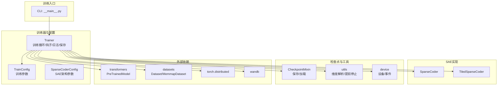
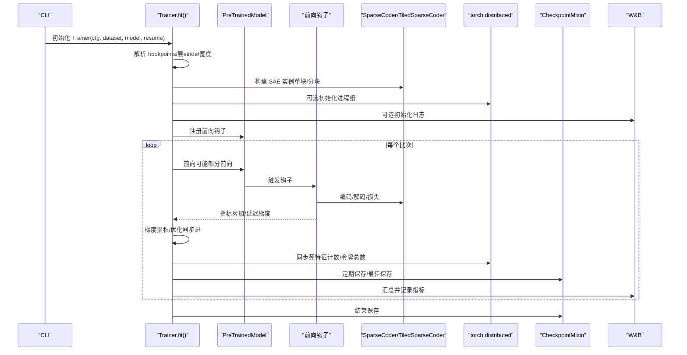
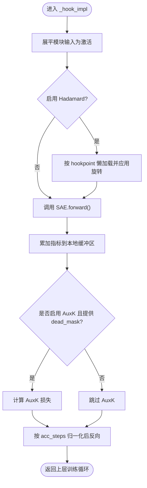
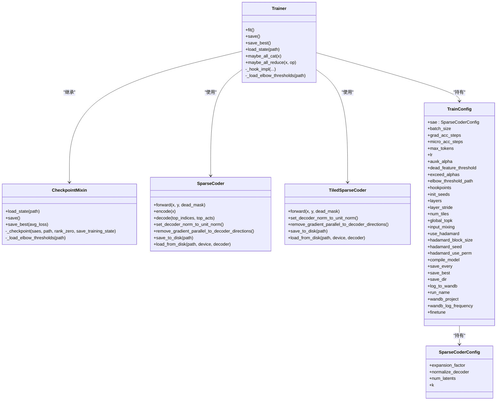

# 核心训练 API

<cite>
**本文引用的文件列表**
- [sparsify/trainer.py](file://sparsify/trainer.py)
- [sparsify/checkpoint.py](file://sparsify/checkpoint.py)
- [sparsify/config.py](file://sparsify/config.py)
- [sparsify/__main__.py](file://sparsify/__main__.py)
- [sparsify/sparse_coder.py](file://sparsify/sparse_coder.py)
- [sparsify/tiled_sparse_coder.py](file://sparsify/tiled_sparse_coder.py)
- [sparsify/utils.py](file://sparsify/utils.py)
- [docs/training/quickstart.md](file://docs/training/quickstart.md)
- [docs/training/config-reference.md](file://docs/training/config-reference.md)
- [docs/training/qwen3-guide.md](file://docs/training/qwen3-guide.md)
- [scripts/first_time_train/Qwen3-0.6B/script.sh](file://scripts/first_time_train/Qwen3-0.6B/script.sh)
- [scripts/tiling_train/script.sh](file://scripts/tiling_train/script.sh)
</cite>

## 目录
1. [简介](#简介)
2. [项目结构](#项目结构)
3. [核心组件](#核心组件)
4. [架构总览](#架构总览)
5. [详细组件分析](#详细组件分析)
6. [依赖关系分析](#依赖关系分析)
7. [性能考量](#性能考量)
8. [故障排查指南](#故障排查指南)
9. [结论](#结论)
10. [附录](#附录)

## 简介
本文件面向使用 Sparsify 的核心训练 API，聚焦于 SaeTrainer（即 Trainer）类的接口与行为，涵盖训练循环控制、钩子注册、检查点管理、分布式训练、回调与进度监控、异常处理以及性能优化建议。文档同时提供标准训练与分布式训练的实践路径，并给出常见问题的解决方案。

## 项目结构
Sparsify 的训练 API 主要由以下模块构成：
- 训练器与配置：Trainer、TrainConfig、SparseCoderConfig
- 检查点工具：CheckpointMixin 及其辅助函数
- SAE 实现：SparseCoder、TiledSparseCoder
- 工具与设备：utils、device
- CLI 入口：__main__.py
- 文档与脚本：quickstart、config-reference、qwen3-guide、示例脚本

图表来源
- [sparsify/__main__.py:131-206](file://sparsify/__main__.py#L131-L206)
- [sparsify/trainer.py:39-759](file://sparsify/trainer.py#L39-L759)
- [sparsify/checkpoint.py:101-302](file://sparsify/checkpoint.py#L101-L302)
- [sparsify/sparse_coder.py:36-269](file://sparsify/sparse_coder.py#L36-L269)
- [sparsify/tiled_sparse_coder.py:17-342](file://sparsify/tiled_sparse_coder.py#L17-L342)
- [sparsify/utils.py:20-227](file://sparsify/utils.py#L20-L227)

章节来源
- [sparsify/trainer.py:39-759](file://sparsify/trainer.py#L39-L759)
- [sparsify/config.py:28-149](file://sparsify/config.py#L28-L149)
- [sparsify/__main__.py:131-206](file://sparsify/__main__.py#L131-L206)

## 核心组件
- Trainer（SaeTrainer）：封装训练循环、钩子注册、指标聚合、分布式同步、检查点保存与恢复、日志与可视化。
- CheckpointMixin：提供保存/加载训练状态、SAE 权重、优化器状态、Hadamard 旋转状态等能力。
- SparseCoder / TiledSparseCoder：SAE 编码器/解码器实现，支持单元归一化、辅助损失、融合解码器、分块并行等。
- TrainConfig / SparseCoderConfig：训练与 SAE 架构的参数集合，含范围展开、校验规则、默认值等。
- utils：维度解析、部分前向、异常中断等工具；device：事件与设备抽象。

章节来源
- [sparsify/trainer.py:39-759](file://sparsify/trainer.py#L39-L759)
- [sparsify/checkpoint.py:101-302](file://sparsify/checkpoint.py#L101-L302)
- [sparsify/sparse_coder.py:36-269](file://sparsify/sparse_coder.py#L36-L269)
- [sparsify/tiled_sparse_coder.py:17-342](file://sparsify/tiled_sparse_coder.py#L17-L342)
- [sparsify/config.py:28-149](file://sparsify/config.py#L28-L149)
- [sparsify/utils.py:20-227](file://sparsify/utils.py#L20-L227)

## 架构总览
Trainer 在 fit() 中完成以下关键流程：
- 初始化与设备选择、分布式进程组建立
- 构建 Hookpoint 列表（支持范围展开与层步长）
- 初始化 SAE（单块或分块 Tiled）
- 注册前向钩子，按批执行模型前向，触发 SAE 编码/解码与损失计算
- 梯度累积与优化器步进
- 死特征计数与全局同步
- 定期保存检查点与最佳模型
- 日志与可视化（W&B）

图表来源
- [sparsify/trainer.py:162-729](file://sparsify/trainer.py#L162-L729)
- [sparsify/__main__.py:131-206](file://sparsify/__main__.py#L131-L206)
- [sparsify/checkpoint.py:149-302](file://sparsify/checkpoint.py#L149-L302)

## 详细组件分析

### Trainer 类（SaeTrainer）
- 初始化参数
  - cfg: TrainConfig（训练配置）
  - dataset: HfDataset 或 MemmapDataset（数据集）
  - model: PreTrainedModel（目标模型）
  - resume_from: 可选，从指定目录恢复
- 关键属性
  - cfg、saes（字典，键为 hookpoint 或带种子后缀）、optimizers、global_step、total_tokens、num_tokens_since_fired、elbow_thresholds、best_loss、hadamard_rotations
- 训练方法
  - fit(): 主训练循环，包含钩子注册、指标聚合、分布式同步、保存与日志
  - maybe_all_cat / maybe_all_reduce: 跨进程聚合/归约
- 状态管理
  - save()/save_best(): 保存完整状态或最佳状态
  - load_state(): 从磁盘恢复训练状态
- 钩子与前向
  - _hook_impl: 将模块输入展平为激活，可选 Hadamard 旋转，调用 SAE 前向，累加指标，反向传播
  - partial_forward_to_layer: 仅运行到最大层以节省计算
- 性能与优化
  - torch.compile 对 Transformer 层进行内核融合（CUDA）
  - 延迟指标事件与批量 all_reduce 减少通信开销
  - 使用 fused 解码器与 bf16 自动混合精度

章节来源
- [sparsify/trainer.py:39-759](file://sparsify/trainer.py#L39-L759)
- [sparsify/utils.py:113-154](file://sparsify/utils.py#L113-L154)

### CheckpointMixin 与检查点工具
- 加载/保存
  - load_state(): 恢复 global_step、total_tokens、死特征计数、最佳损失、优化器状态、SAE 权重、Hadamard 状态
  - save()/save_best(): 保存 SAE 权重、优化器状态、配置、训练状态、Hadamard 状态
  - load_sae_checkpoint(): 支持常规与分块两种格式的 SAE 权重加载
- 超参与模式
  - expand_range_pattern(): 展开范围语法如 layers.[1-10].xxx
  - _load_elbow_thresholds(): 从 JSON 加载阈值并匹配 hookpoint
- 分块/并行
  - is_tiled_checkpoint()/get_checkpoint_num_tiles(): 判定/读取分块配置
  - 多进程下通过屏障保证一致性

章节来源
- [sparsify/checkpoint.py:101-302](file://sparsify/checkpoint.py#L101-L302)

### SparseCoder 与 TiledSparseCoder
- SparseCoder
  - 编码器：线性层 + 偏置
  - 解码器：可选，W_dec 与 b_dec；支持单位范数归一化
  - 前向：encode/decode，计算 FVU 与可选 AuxK 死特征损失
  - 辅助方法：设置单位范数、移除与解码方向平行的梯度
- TiledSparseCoder
  - 将输入按隐藏维分块，每块独立训练 SAE，支持全局 top-k 与输入混洗
  - 输入混洗：学习 T×T 混合矩阵，解码后逆变换回原空间重新计算 FVU
  - 保存/加载：顶层 cfg.json 记录分块信息，各 tile 子目录保存权重

章节来源
- [sparsify/sparse_coder.py:36-269](file://sparsify/sparse_coder.py#L36-L269)
- [sparsify/tiled_sparse_coder.py:17-342](file://sparsify/tiled_sparse_coder.py#L17-L342)

### 训练循环控制与钩子注册
- 钩子注册
  - 在 name_to_module 上注册前向钩子，将模块输入展平为激活
  - 可选应用 Hadamard 旋转（按需懒加载），并在需要时反旋转以计算 exceed 指标
- 梯度累积与优化器步进
  - 每 acc_steps 执行一次优化器步进与梯度清零
  - 可选在 DDP 下使用 no_sync 减少通信
- 死特征检测
  - num_tokens_since_fired 计数器，每步累加，命中位置清零
  - 跨进程 MIN 归约，确保任何 GPU 的命中都会传播到其他副本
- 指标聚合
  - avg_fvu、avg_auxk_loss、avg_exceed（按 alpha 分级）延迟到日志频率统一 all_reduce

图表来源
- [sparsify/trainer.py:347-480](file://sparsify/trainer.py#L347-L480)

章节来源
- [sparsify/trainer.py:347-653](file://sparsify/trainer.py#L347-L653)

### 分布式训练与进程组
- 进程组初始化
  - 通过环境变量 LOCAL_RANK 判断 DDP，初始化进程组并设置设备
  - rank 0 输出世界大小信息
- 数据分片
  - 训练前裁剪样本数量，使其能整除世界大小，再按 rank 分片
- 同步策略
  - 训练中使用 all_reduce/ all_gather_into_tensor 聚合指标与计数
  - 通过 maybe_all_reduce 统一求和/平均/最大
- 保存一致性
  - 仅 rank 0 保存，其余进程等待屏障

章节来源
- [sparsify/__main__.py:134-169](file://sparsify/__main__.py#L134-L169)
- [sparsify/trainer.py:294-332](file://sparsify/trainer.py#L294-L332)
- [sparsify/checkpoint.py:246-302](file://sparsify/checkpoint.py#L246-L302)

### 日志与可视化（W&B）
- 初始化
  - rank 0 初始化 W&B，失败自动降级关闭日志
  - 通过广播同步日志开关，保证所有进程一致
- 指标记录
  - 按频率批量 all_reduce 指标，记录 forward_time、metrics_time、dead_pct、fvu、auxk、exceed_alpha_X
- 进度条
  - 使用 tqdm，仅 rank 0 显示

章节来源
- [sparsify/trainer.py:186-227](file://sparsify/trainer.py#L186-L227)
- [sparsify/trainer.py:654-720](file://sparsify/trainer.py#L654-L720)

### 异常处理与健壮性
- 导入异常
  - W&B 未安装或初始化失败时自动降级
- 断言与校验
  - TrainConfig.__post_init__ 中对参数组合与数值范围进行校验
  - expand_range_pattern 对范围语法进行安全展开
- 提前停止
  - partial_forward_to_layer 使用异常中断避免多余层计算
- 设备与精度
  - compile_model 仅在 CUDA 生效
  - 设置 float32 matmul 精度以提升性能

章节来源
- [sparsify/trainer.py:186-227](file://sparsify/trainer.py#L186-L227)
- [sparsify/config.py:124-149](file://sparsify/config.py#L124-L149)
- [sparsify/utils.py:108-154](file://sparsify/utils.py#L108-L154)

## 依赖关系分析

图表来源
- [sparsify/trainer.py:39-759](file://sparsify/trainer.py#L39-L759)
- [sparsify/checkpoint.py:101-302](file://sparsify/checkpoint.py#L101-L302)
- [sparsify/sparse_coder.py:36-269](file://sparsify/sparse_coder.py#L36-L269)
- [sparsify/tiled_sparse_coder.py:17-342](file://sparsify/tiled_sparse_coder.py#L17-L342)
- [sparsify/config.py:28-149](file://sparsify/config.py#L28-L149)

## 性能考量
- 计算与内存
  - 使用 fused 解码器与设备自动混合精度，减少内核启动与类型转换开销
  - 编译 Transformer 层以融合小算子，降低 kernel launch 开销（仅 CUDA）
- 通信与同步
  - 延迟指标事件与批量 all_reduce，避免每 hookpoint 每 microbatch 的频繁归约
  - 使用 no_sync 在 DDP 下减少梯度同步次数
- 指标与阈值
  - 使用 Hadamard 旋转时，延迟计算 exceed 指标并批量归约
  - 通过 elbow 阈值文件进行误差阈值评估，避免重复扫描
- 计数与死特征
  - 采用“增量计数 + 归约最小值”的方式替代 per-forward scatter，避免 AI_CPU 回退

章节来源
- [sparsify/trainer.py:294-332](file://sparsify/trainer.py#L294-L332)
- [sparsify/trainer.py:575-653](file://sparsify/trainer.py#L575-L653)
- [sparsify/utils.py:187-196](file://sparsify/utils.py#L187-L196)

## 故障排查指南
- 无法导入 W&B
  - 现象：初始化失败或自动降级
  - 处理：确认安装或禁用日志；检查网络与代理
  - 参考：[sparsify/trainer.py:186-227](file://sparsify/trainer.py#L186-L227)
- 分布式训练卡住
  - 现象：进程阻塞
  - 处理：确保数据长度能被世界大小整除；使用分片与屏障
  - 参考：[sparsify/__main__.py:161-169](file://sparsify/__main__.py#L161-L169)
- 参数冲突
  - 现象：layers 与 layer_stride 同时指定、init_seeds 为空、hadamard_block_size 非 2 的幂
  - 处理：遵循校验规则，修正配置
  - 参考：[sparsify/config.py:124-149](file://sparsify/config.py#L124-L149)
- 恢复/微调失败
  - 现象：分块与非分块不匹配、路径不存在
  - 处理：检查 num_tiles 一致性；确认 checkpoint 路径存在
  - 参考：[sparsify/checkpoint.py:44-73](file://sparsify/checkpoint.py#L44-L73)
- 训练早停
  - 现象：达到 max_tokens 自动保存并退出
  - 处理：调整预算或继续恢复
  - 参考：[sparsify/trainer.py:629-642](file://sparsify/trainer.py#L629-L642)

章节来源
- [sparsify/trainer.py:186-227](file://sparsify/trainer.py#L186-L227)
- [sparsify/__main__.py:161-169](file://sparsify/__main__.py#L161-L169)
- [sparsify/config.py:124-149](file://sparsify/config.py#L124-L149)
- [sparsify/checkpoint.py:44-73](file://sparsify/checkpoint.py#L44-L73)
- [sparsify/trainer.py:629-642](file://sparsify/trainer.py#L629-L642)

## 结论
Trainer 提供了高度集成的 SAE 训练体验：灵活的钩子注册、高效的分布式同步、完善的检查点管理、可观测的指标与日志。通过 SparseCoder 与 TiledSparseCoder 的组合，既能满足单块高效训练，也能支持分块并行与全局 top-k 等高级模式。配合 CLI 与脚本，用户可以快速完成从训练到导出的完整工作流。

## 附录

### 如何进行标准训练（单机多卡）
- 使用 CLI 启动，传入模型与数据集路径、hookpoints、batch_size、grad_acc_steps 等参数
- 示例脚本参考：[scripts/first_time_train/Qwen3-0.6B/script.sh:11-47](file://scripts/first_time_train/Qwen3-0.6B/script.sh#L11-L47)

章节来源
- [scripts/first_time_train/Qwen3-0.6B/script.sh:11-47](file://scripts/first_time_train/Qwen3-0.6B/script.sh#L11-L47)
- [docs/training/quickstart.md:19-41](file://docs/training/quickstart.md#L19-L41)

### 如何进行分布式训练（DDP）
- 通过 torchrun 启动，设置 nproc_per_node 与 master_port
- 训练前会自动分片数据并进行屏障同步
- 示例脚本参考：[scripts/first_time_train/Qwen3-0.6B/script.sh:11-47](file://scripts/first_time_train/Qwen3-0.6B/script.sh#L11-L47)

章节来源
- [sparsify/__main__.py:134-169](file://sparsify/__main__.py#L134-L169)
- [scripts/first_time_train/Qwen3-0.6B/script.sh:11-47](file://scripts/first_time_train/Qwen3-0.6B/script.sh#L11-L47)

### 如何进行分块并行训练（Tiling）
- 设置 num_tiles > 1，可选开启 global_topk 与 input_mixing
- 注意 d_in 与 sae.k 必须能被 num_tiles 整除
- 示例脚本参考：[scripts/tiling_train/script.sh:47-85](file://scripts/tiling_train/script.sh#L47-L85)

章节来源
- [sparsify/tiled_sparse_coder.py:37-43](file://sparsify/tiled_sparse_coder.py#L37-L43)
- [scripts/tiling_train/script.sh:47-85](file://scripts/tiling_train/script.sh#L47-L85)

### 配置参考与命名约定
- 训练参数：batch_size、grad_acc_steps、micro_acc_steps、max_tokens、lr、auxk_alpha、dead_feature_threshold、exceed_alphas、elbow_threshold_path、hookpoints、init_seeds、layers、layer_stride、num_tiles、global_topk、input_mixing、use_hadamard、hadamard_block_size、hadamard_seed、hadamard_use_perm、compile_model、save_every、save_best、save_dir、log_to_wandb、run_name、wandb_project、wandb_log_frequency、finetune
- SAE 参数：expansion_factor、normalize_decoder、num_latents、k
- 参考文档：[docs/training/config-reference.md:55-170](file://docs/training/config-reference.md#L55-L170)

章节来源
- [docs/training/config-reference.md:55-170](file://docs/training/config-reference.md#L55-L170)
- [sparsify/config.py:28-149](file://sparsify/config.py#L28-L149)

### 常见问题与建议
- 何时使用 Hadamard 旋转
  - 当需要在旋转后的空间中稳定训练时启用；注意与 exceed 指标配合使用时的反旋转
- 如何选择 k 与 expansion_factor
  - 从较小值开始，逐步提高，结合 FVU 与 dead feature 比例观察
- 如何生成并使用 elbow 阈值
  - 使用 compute_elbow_thresholds.py 生成阈值文件，训练时通过 elbow_threshold_path 指定
- 如何导出 LUT
  - 使用 convert_sae_to_lut.py，确保 hookpoints 与阈值目录匹配

章节来源
- [docs/training/quickstart.md:80-125](file://docs/training/quickstart.md#L80-L125)
- [docs/training/qwen3-guide.md:17-78](file://docs/training/qwen3-guide.md#L17-L78)