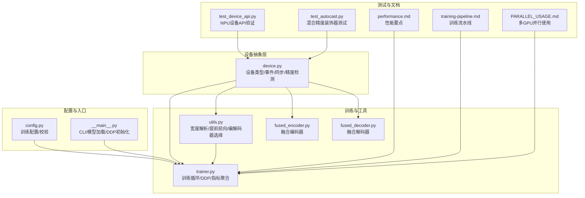
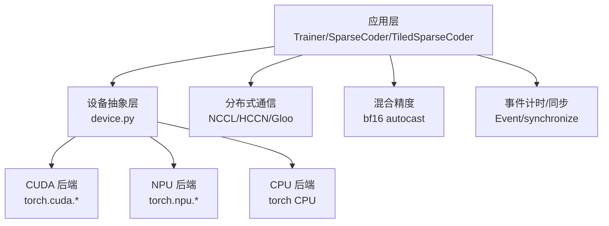
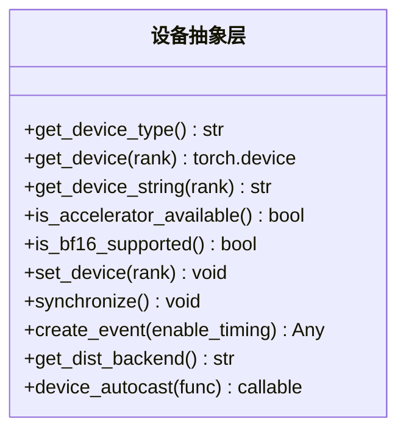
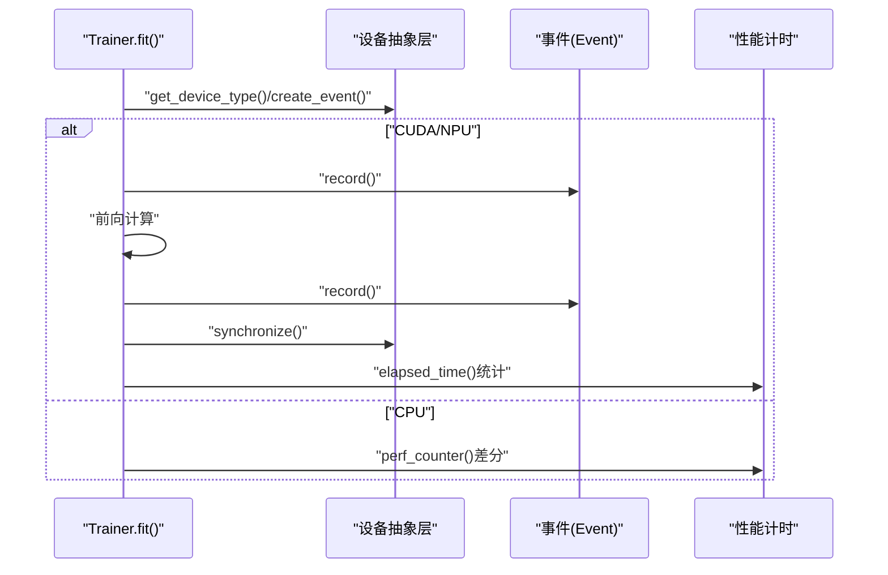
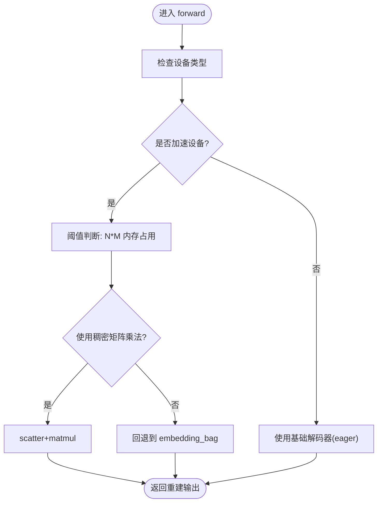
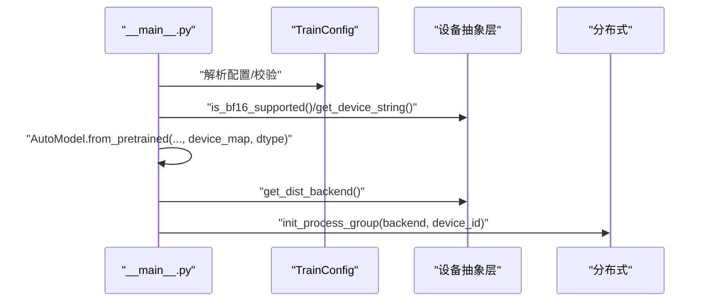
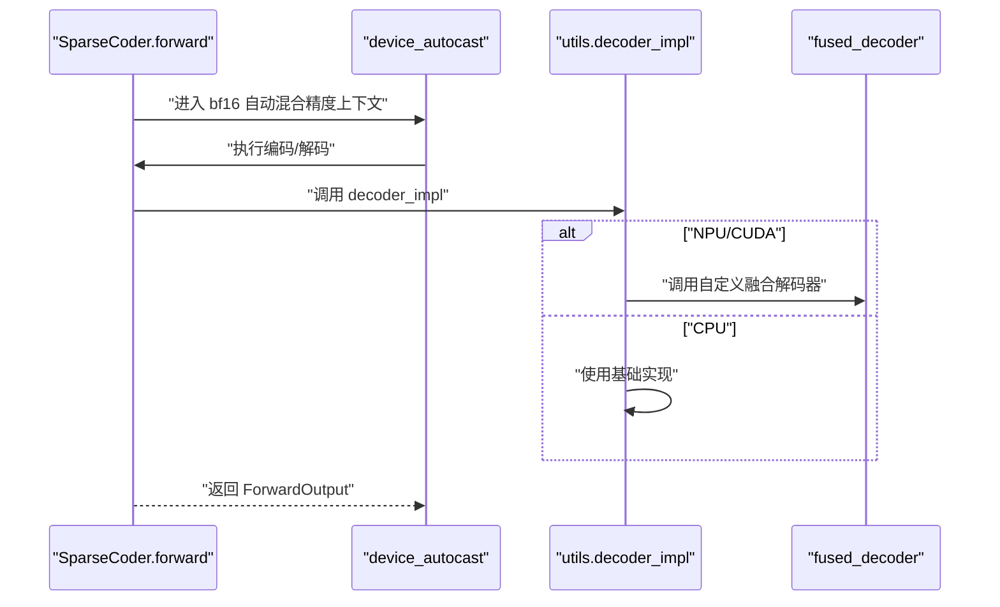
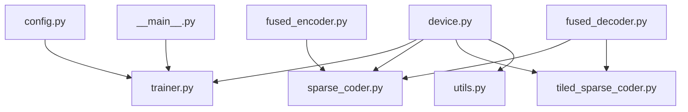

# 设备抽象 API

<cite>
**本文档引用的文件**
- [device.py](file://sparsify/device.py)
- [trainer.py](file://sparsify/trainer.py)
- [utils.py](file://sparsify/utils.py)
- [config.py](file://sparsify/config.py)
- [sparse_coder.py](file://sparsify/sparse_coder.py)
- [tiled_sparse_coder.py](file://sparsify/tiled_sparse_coder.py)
- [fused_encoder.py](file://sparsify/fused_encoder.py)
- [fused_decoder.py](file://sparsify/fused_decoder.py)
- [__main__.py](file://sparsify/__main__.py)
- [test_device_api.py](file://tests/ascend/test_device_api.py)
- [test_autocast.py](file://tests/ascend/test_autocast.py)
- [performance.md](file://docs/architecture/performance.md)
- [training-pipeline.md](file://docs/architecture/training-pipeline.md)
- [PARALLEL_USAGE.md](file://scripts/PARALLEL_USAGE.md)
</cite>

## 目录
1. [简介](#简介)
2. [项目结构](#项目结构)
3. [核心组件](#核心组件)
4. [架构总览](#架构总览)
5. [详细组件分析](#详细组件分析)
6. [依赖关系分析](#依赖关系分析)
7. [性能考虑](#性能考虑)
8. [故障排除指南](#故障排除指南)
9. [结论](#结论)
10. [附录](#附录)

## 简介
本文件系统化阐述 Sparsify 项目的设备抽象 API，重点覆盖：
- 设备管理接口与统一抽象层设计
- CUDA/NPU 兼容性支持与分布式后端选择
- 设备选择机制与自动精度检测
- 设备检测方法、性能优化策略
- 多 GPU 训练、混合精度训练与设备迁移实践
- 设备内存管理、张量操作与性能监控
- 兼容性检查、错误处理与调优建议

该抽象层通过统一的设备 API 屏蔽底层 CUDA 与 Ascend NPU 差异，确保上层模块无需直接调用 `torch.cuda.*` 或 `torch.npu.*`，从而实现跨平台一致的训练体验。

## 项目结构
围绕设备抽象 API 的关键文件组织如下：
- 设备抽象层：`sparsify/device.py`
- 训练主流程：`sparsify/trainer.py`
- 工具与编解码器：`sparsify/utils.py`、`sparsify/fused_encoder.py`、`sparsify/fused_decoder.py`
- 配置与模型加载：`sparsify/config.py`、`sparsify/__main__.py`
- 单元测试：`tests/ascend/test_device_api.py`、`tests/ascend/test_autocast.py`
- 架构文档：`docs/architecture/performance.md`、`docs/architecture/training-pipeline.md`
- 并行脚本：`scripts/PARALLEL_USAGE.md`

**图表来源**
- [device.py:1-118](file://sparsify/device.py#L1-L118)
- [trainer.py:1-760](file://sparsify/trainer.py#L1-L760)
- [utils.py:1-227](file://sparsify/utils.py#L1-L227)
- [fused_encoder.py:1-107](file://sparsify/fused_encoder.py#L1-L107)
- [fused_decoder.py:1-107](file://sparsify/fused_decoder.py#L1-L107)
- [config.py:1-149](file://sparsify/config.py#L1-L149)
- [__main__.py:1-211](file://sparsify/__main__.py#L1-L211)
- [test_device_api.py:1-70](file://tests/ascend/test_device_api.py#L1-L70)
- [test_autocast.py:1-46](file://tests/ascend/test_autocast.py#L1-L46)
- [performance.md:1-75](file://docs/architecture/performance.md#L1-L75)
- [training-pipeline.md:1-167](file://docs/architecture/training-pipeline.md#L1-L167)
- [PARALLEL_USAGE.md:1-166](file://scripts/PARALLEL_USAGE.md#L1-L166)

**章节来源**
- [device.py:1-118](file://sparsify/device.py#L1-L118)
- [trainer.py:1-760](file://sparsify/trainer.py#L1-L760)
- [utils.py:1-227](file://sparsify/utils.py#L1-L227)
- [config.py:1-149](file://sparsify/config.py#L1-L149)
- [__main__.py:1-211](file://sparsify/__main__.py#L1-L211)
- [performance.md:1-75](file://docs/architecture/performance.md#L1-L75)
- [training-pipeline.md:1-167](file://docs/architecture/training-pipeline.md#L1-L167)
- [PARALLEL_USAGE.md:1-166](file://scripts/PARALLEL_USAGE.md#L1-L166)

## 核心组件
- 设备抽象层（device.py）：提供统一的设备类型判断、设备字符串生成、bf16 支持检测、设备设置、同步、事件创建以及分布式后端选择；并提供设备无关的混合精度装饰器。
- 训练器（trainer.py）：在训练循环中使用设备抽象 API 进行事件计时、梯度累积边界同步、分布式通信与指标聚合；支持 DDP 包装 SAE、死特征追踪与保存恢复。
- 工具与编解码器（utils.py、fused_encoder.py、fused_decoder.py）：根据设备类型动态选择融合解码器实现；提供提前停止的 Transformer 前向、输入维度解析等。
- 配置与入口（config.py、__main__.py）：训练配置校验（如编译开关仅在 CUDA 生效）、模型加载时按设备字符串放置权重、DDP 初始化与后端选择。

**章节来源**
- [device.py:34-118](file://sparsify/device.py#L34-L118)
- [trainer.py:24-288](file://sparsify/trainer.py#L24-L288)
- [utils.py:185-197](file://sparsify/utils.py#L185-L197)
- [fused_encoder.py:1-107](file://sparsify/fused_encoder.py#L1-L107)
- [fused_decoder.py:1-107](file://sparsify/fused_decoder.py#L1-L107)
- [config.py:138-142](file://sparsify/config.py#L138-L142)
- [__main__.py:17-24](file://sparsify/__main__.py#L17-L24)

## 架构总览
设备抽象层作为横切关注点，贯穿模型加载、训练循环、分布式通信与性能监控等环节。其设计原则是“对上屏蔽差异，对下适配实现”，确保同一套 API 在 CUDA 与 NPU 上行为一致。

**图表来源**
- [device.py:18-98](file://sparsify/device.py#L18-L98)
- [trainer.py:24-288](file://sparsify/trainer.py#L24-L288)
- [__main__.py:138-145](file://sparsify/__main__.py#L138-L145)

## 详细组件分析

### 设备抽象层（device.py）
- 设备检测与类型判定：通过导入 torch_npu 并检测可用性，优先识别 NPU，否则回退到 CUDA，最后为 CPU。
- 统一设备接口：提供 get_device_type、get_device、get_device_string、set_device、synchronize、create_event、get_dist_backend。
- 精度支持检测：is_bf16_supported 根据平台返回支持状态。
- 混合精度装饰器：device_autocast 将 @torch.autocast("cuda"/"npu", dtype=torch.bfloat16, ...) 抽象为运行时检测，保证跨平台一致性。

**图表来源**
- [device.py:34-118](file://sparsify/device.py#L34-L118)

**章节来源**
- [device.py:18-118](file://sparsify/device.py#L18-L118)

### 训练器（trainer.py）中的设备使用
- 训练循环中使用 device 类型进行条件化事件计时与同步，避免在 CPU 上创建事件。
- 在 DDP 模式下，使用设备抽象层提供的分布式后端名称初始化进程组，并以设备字符串设置 device_id。
- 训练步边界（梯度累积）进行同步，减少跨设备同步次数，提升吞吐。
- 指标聚合采用 all_reduce，结合设备类型进行平均或求和。

**图表来源**
- [trainer.py:282-288](file://sparsify/trainer.py#L282-L288)
- [trainer.py:530-567](file://sparsify/trainer.py#L530-L567)
- [device.py:83-98](file://sparsify/device.py#L83-L98)

**章节来源**
- [trainer.py:282-288](file://sparsify/trainer.py#L282-L288)
- [trainer.py:530-567](file://sparsify/trainer.py#L530-L567)
- [trainer.py:668-689](file://sparsify/trainer.py#L668-L689)

### 工具与编解码器（utils.py、fused_encoder.py、fused_decoder.py）
- 编解码器选择：根据设备类型（npu/cuda）动态选择融合解码器实现，否则回退到基础实现，避免 NPU 后端的 CPU 回落路径。
- 提前前向：当钩子点位于中间层时，通过 partial_forward_to_layer 提前终止，减少无效计算。
- 融合算子：FusedEncoder/FusedDecoder 在内存阈值内使用 scatter-plus-matmul 替代向量化索引路径，降低 kernel launch 开销并提升吞吐。

**图表来源**
- [utils.py:185-197](file://sparsify/utils.py#L185-L197)
- [fused_encoder.py:18-38](file://sparsify/fused_encoder.py#L18-L38)
- [fused_decoder.py:24-53](file://sparsify/fused_decoder.py#L24-L53)

**章节来源**
- [utils.py:185-197](file://sparsify/utils.py#L185-L197)
- [fused_encoder.py:18-91](file://sparsify/fused_encoder.py#L18-L91)
- [fused_decoder.py:24-106](file://sparsify/fused_decoder.py#L24-L106)

### 配置与入口（config.py、__main__.py）
- 配置校验：compile_model 仅在 CUDA 生态启用，避免非 CUDA 平台的编译失败。
- 模型加载：根据设备字符串将模型权重放置到指定设备，同时按 bf16 支持情况选择 dtype。
- DDP 初始化：根据设备类型选择分布式后端（CUDA=NCCL，NPU=HCCL，CPU=Gloo），并设置 device_id。

**图表来源**
- [config.py:138-142](file://sparsify/config.py#L138-L142)
- [__main__.py:84-92](file://sparsify/__main__.py#L84-L92)
- [__main__.py:138-145](file://sparsify/__main__.py#L138-L145)
- [device.py:92-98](file://sparsify/device.py#L92-L98)

**章节来源**
- [config.py:138-142](file://sparsify/config.py#L138-L142)
- [__main__.py:84-92](file://sparsify/__main__.py#L84-L92)
- [__main__.py:138-145](file://sparsify/__main__.py#L138-L145)

### SAE 模块中的设备使用
- SparseCoder/TiledSparseCoder 在 forward 中使用 device_autocast 装饰器，确保在支持 bf16 的平台上自动进入混合精度路径。
- 解码阶段调用 decoder_impl，由 utils 动态选择融合实现，减少 NPU 上的 CPU 回落。

**图表来源**
- [sparse_coder.py:187-239](file://sparsify/sparse_coder.py#L187-L239)
- [tiled_sparse_coder.py:102-140](file://sparsify/tiled_sparse_coder.py#L102-L140)
- [utils.py:185-197](file://sparsify/utils.py#L185-L197)
- [fused_decoder.py:93-106](file://sparsify/fused_decoder.py#L93-L106)

**章节来源**
- [sparse_coder.py:187-239](file://sparsify/sparse_coder.py#L187-L239)
- [tiled_sparse_coder.py:102-140](file://sparsify/tiled_sparse_coder.py#L102-L140)
- [utils.py:185-197](file://sparsify/utils.py#L185-L197)

## 依赖关系分析
- 设备抽象层被训练器、SAE 模块、工具函数广泛依赖，形成稳定的横切层。
- 分布式后端选择与设备类型强耦合，确保 NCCL/HCCL/Gloo 的正确使用。
- 混合精度装饰器与设备类型检测共同决定 bf16 是否启用。

**图表来源**
- [device.py:1-118](file://sparsify/device.py#L1-L118)
- [trainer.py:1-760](file://sparsify/trainer.py#L1-L760)
- [sparse_coder.py:1-269](file://sparsify/sparse_coder.py#L1-L269)
- [tiled_sparse_coder.py:1-342](file://sparsify/tiled_sparse_coder.py#L1-L342)
- [utils.py:1-227](file://sparsify/utils.py#L1-L227)
- [fused_encoder.py:1-107](file://sparsify/fused_encoder.py#L1-L107)
- [fused_decoder.py:1-107](file://sparsify/fused_decoder.py#L1-L107)
- [config.py:1-149](file://sparsify/config.py#L1-L149)
- [__main__.py:1-211](file://sparsify/__main__.py#L1-L211)

**章节来源**
- [device.py:1-118](file://sparsify/device.py#L1-L118)
- [trainer.py:1-760](file://sparsify/trainer.py#L1-L760)
- [sparse_coder.py:1-269](file://sparsify/sparse_coder.py#L1-L269)
- [tiled_sparse_coder.py:1-342](file://sparsify/tiled_sparse_coder.py#L1-L342)
- [utils.py:1-227](file://sparsify/utils.py#L1-L227)
- [fused_encoder.py:1-107](file://sparsify/fused_encoder.py#L1-L107)
- [fused_decoder.py:1-107](file://sparsify/fused_decoder.py#L1-L107)
- [config.py:1-149](file://sparsify/config.py#L1-L149)
- [__main__.py:1-211](file://sparsify/__main__.py#L1-L211)

## 性能考虑
- 混合精度：device_autocast 在支持的平台上默认启用 bf16，显著提升吞吐。
- 融合算子：FusedEncoder/FusedDecoder 在内存阈值内使用 scatter-plus-matmul，避免向量化索引的高开销。
- 提前前向：当钩子点位于中间层时，通过 partial_forward_to_layer 减少无效计算。
- 编译优化：compile_model 仅在 CUDA 生态启用，减少 kernel launch 开销。
- 计时与同步：在需要时才创建事件并进行同步，避免不必要的 CPU-GPU 同步。
- 分布式通信：在 DDP 模式下批量归约指标，减少通信次数。

**章节来源**
- [performance.md:7-34](file://docs/architecture/performance.md#L7-L34)
- [performance.md:54-71](file://docs/architecture/performance.md#L54-L71)
- [trainer.py:294-333](file://sparsify/trainer.py#L294-L333)
- [trainer.py:530-567](file://sparsify/trainer.py#L530-L567)
- [utils.py:113-154](file://sparsify/utils.py#L113-L154)
- [fused_encoder.py:18-91](file://sparsify/fused_encoder.py#L18-L91)
- [fused_decoder.py:24-106](file://sparsify/fused_decoder.py#L24-L106)

## 故障排除指南
- 设备不可用：确认 torch.cuda.is_available() 与 torch.npu 可用性，必要时回退到 CPU。
- 分布式后端错误：确保 get_dist_backend() 返回正确的后端名称（CUDA=NCCL，NPU=HCCL，CPU=Gloo）。
- 混合精度异常：device_autocast 会根据 is_bf16_supported() 控制 bf16 启用，若平台不支持则降级。
- 事件计时问题：在 CPU 上 create_event 返回 None，需在训练逻辑中做条件化处理。
- DDP 数据分片：在多进程环境下，确保数据分片整除世界规模，避免死锁。

**章节来源**
- [device.py:53-98](file://sparsify/device.py#L53-L98)
- [trainer.py:168-169](file://sparsify/trainer.py#L168-L169)
- [trainer.py:161-168](file://sparsify/trainer.py#L161-L168)
- [test_device_api.py:55-66](file://tests/ascend/test_device_api.py#L55-L66)
- [test_autocast.py:8-46](file://tests/ascend/test_autocast.py#L8-L46)

## 结论
设备抽象 API 通过统一的接口屏蔽了 CUDA 与 NPU 的差异，配合融合算子、混合精度与提前前向等优化手段，在保证可移植性的同时实现了高性能训练。建议在 CUDA 平台上启用编译与混合精度，在 NPU 平台上优先使用融合解码器以避免 CPU 回落。

## 附录

### 多 GPU 训练与设备迁移示例（路径指引）
- 多 GPU 训练入口与 DDP 初始化：  
  [__main__.py:138-145](file://sparsify/__main__.py#L138-L145)
- 训练器 DDP 包装与同步边界：  
  [trainer.py:501-514](file://sparsify/trainer.py#L501-L514)
- 训练步边界同步与指标聚合：  
  [trainer.py:575-584](file://sparsify/trainer.py#L575-L584)
- 分布式 all_reduce 指标批处理：  
  [trainer.py:294-333](file://sparsify/trainer.py#L294-L333)

### 混合精度训练示例（路径指引）
- 设备无关的 bf16 装饰器：  
  [device.py:101-118](file://sparsify/device.py#L101-L118)
- SAE 前向使用混合精度：  
  [sparse_coder.py:187-189](file://sparsify/sparse_coder.py#L187-L189)
- Tiled SAE 前向使用混合精度：  
  [tiled_sparse_coder.py:102-104](file://sparsify/tiled_sparse_coder.py#L102-L104)

### 设备内存管理与张量操作示例（路径指引）
- 融合解码器内存阈值与稠密矩阵乘法路径：  
  [fused_decoder.py:24-53](file://sparsify/fused_decoder.py#L24-L53)
- 融合编码器内存阈值与反向路径：  
  [fused_encoder.py:18-91](file://sparsify/fused_encoder.py#L18-L91)
- 提前停止的 Transformer 前向：  
  [utils.py:113-154](file://sparsify/utils.py#L113-L154)

### 性能监控与计时示例（路径指引）
- 训练步计时与事件记录：  
  [trainer.py:530-567](file://sparsify/trainer.py#L530-L567)
- 指标延迟事件收集与批处理 all_reduce：  
  [trainer.py:430-476](file://sparsify/trainer.py#L430-L476)
  [trainer.py:668-689](file://sparsify/trainer.py#L668-L689)

### 兼容性检查与错误处理示例（路径指引）
- NPU 设备 API 行为验证：  
  [test_device_api.py:18-70](file://tests/ascend/test_device_api.py#L18-L70)
- 混合精度装饰器行为验证：  
  [test_autocast.py:8-46](file://tests/ascend/test_autocast.py#L8-L46)
- 配置校验（编译开关仅 CUDA 生效）：  
  [config.py:138-142](file://sparsify/config.py#L138-L142)

### 并行使用与多 GPU 调度（路径指引）
- 并行运行两个 Sweep 脚本（8 卡并行）：  
  [PARALLEL_USAGE.md:23-51](file://scripts/PARALLEL_USAGE.md#L23-L51)
- 监控 GPU 使用与日志查看：  
  [PARALLEL_USAGE.md:70-78](file://scripts/PARALLEL_USAGE.md#L70-L78)
  [PARALLEL_USAGE.md:157-166](file://scripts/PARALLEL_USAGE.md#L157-L166)