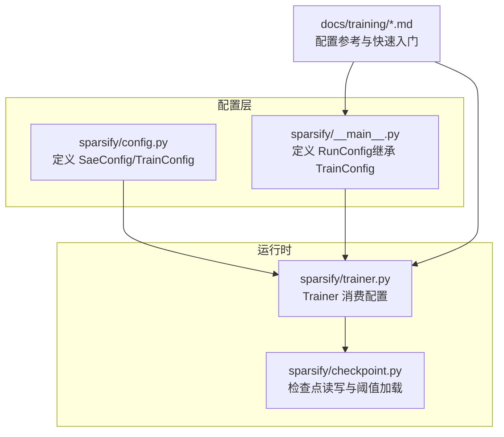
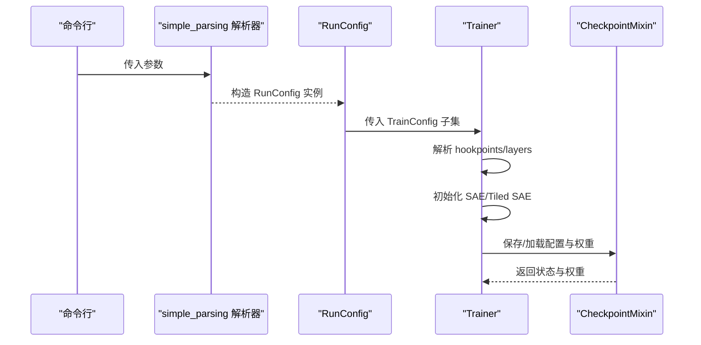
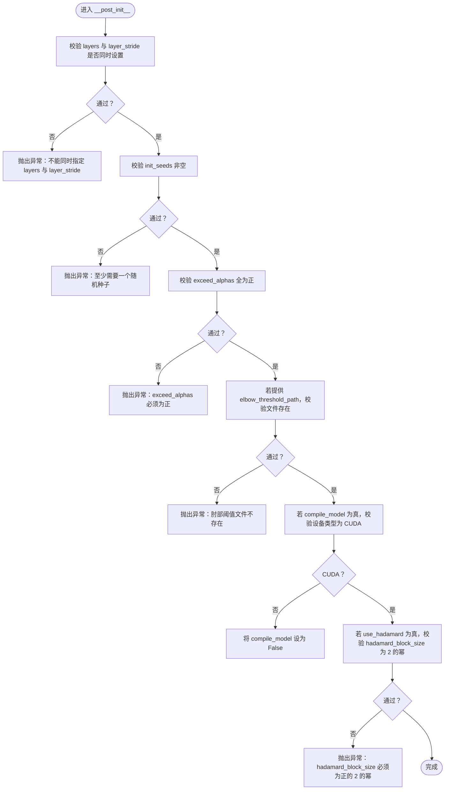
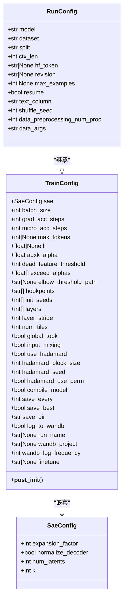

# 配置 API

<cite>
**本文引用的文件**
- [sparsify/config.py](file://sparsify/config.py)
- [sparsify/__main__.py](file://sparsify/__main__.py)
- [sparsify/trainer.py](file://sparsify/trainer.py)
- [sparsify/checkpoint.py](file://sparsify/checkpoint.py)
- [docs/training/config-reference.md](file://docs/training/config-reference.md)
- [docs/training/quickstart.md](file://docs/training/quickstart.md)
- [scripts/first_time_train/Qwen3-0.6B/script.sh](file://scripts/first_time_train/Qwen3-0.6B/script.sh)
- [compute_elbow_thresholds.py](file://compute_elbow_thresholds.py)
- [thresholds/Qwen3-0.6B/thresholds_o.json](file://thresholds/Qwen3-0.6B/thresholds_o.json)
</cite>

## 目录
1. [简介](#简介)
2. [项目结构](#项目结构)
3. [核心组件](#核心组件)
4. [架构总览](#架构总览)
5. [详细组件分析](#详细组件分析)
6. [依赖关系分析](#依赖关系分析)
7. [性能考量](#性能考量)
8. [故障排查指南](#故障排查指南)
9. [结论](#结论)
10. [附录](#附录)

## 简介
本文件系统性梳理配置 API，聚焦以下三类配置对象：
- SaeConfig（别名：SparseCoderConfig）：稀疏编码器（SAE）的架构参数
- TrainConfig（训练配置）：训练循环、日志、数据集与运行时参数
- RunConfig（运行配置）：在 TrainConfig 基础上扩展模型与数据集等运行参数

文档将从属性定义、默认值、取值范围、验证规则、相互依赖关系入手，结合 YAML/JSON 示例与程序化配置思路，解释继承机制、优先级与动态修改策略，并给出最佳实践、常见错误与调试技巧。

## 项目结构
配置 API 的核心位于 sparsify/config.py，命令行入口与运行参数在 sparsify/__main__.py 中定义，训练器在 sparsify/trainer.py 中消费配置；配置参考与快速入门见 docs/training/config-reference.md 与 docs/training/quickstart.md；脚本与阈值文件展示了配置的实际使用与输出格式。

图表来源
- [sparsify/config.py:1-149](file://sparsify/config.py#L1-L149)
- [sparsify/__main__.py:31-80](file://sparsify/__main__.py#L31-L80)
- [sparsify/trainer.py:39-161](file://sparsify/trainer.py#L39-L161)
- [sparsify/checkpoint.py:101-197](file://sparsify/checkpoint.py#L101-L197)
- [docs/training/config-reference.md:1-193](file://docs/training/config-reference.md#L1-L193)

章节来源
- [sparsify/config.py:1-149](file://sparsify/config.py#L1-L149)
- [sparsify/__main__.py:31-80](file://sparsify/__main__.py#L31-L80)
- [docs/training/config-reference.md:1-193](file://docs/training/config-reference.md#L1-L193)

## 核心组件
本节对三个配置类进行逐项解析，涵盖属性、默认值、取值范围、验证规则与相互依赖。

- SaeConfig（别名：SparseCoderConfig）
  - expansion_factor：整型，缺省 32，作为输入维度的倍数决定潜在维度大小
  - normalize_decoder：布尔，缺省 True，训练时对解码器权重做单位范数归一化
  - num_latents：整型，缺省 0，若为 0 则按 expansion_factor 推导；否则显式指定潜在数
  - k：整型，缺省 32，每样本非零特征数量（全局预算）

- TrainConfig
  - sae：嵌套配置对象，类型为 SaeConfig
  - batch_size：整型，缺省 32，序列维度的批大小
  - grad_acc_steps：整型，缺省 1，梯度累积步数
  - micro_acc_steps：整型，缺省 1，微批切分以提升吞吐
  - max_tokens：整型或 None，缺省 None，累计达到该令牌数则停止训练
  - lr：浮点或 None，缺省 None，若为 None 则按潜在数缩放自动选择
  - auxk_alpha：浮点，缺省 0.0，辅助损失（死元抑制）权重
  - dead_feature_threshold：整型，缺省 10_000_000，特征被认为“死亡”的令牌数阈值
  - exceed_alphas：列表[float]，缺省 [0.05, 0.10, 0.25, 0.50]，用于超额指标计算的系数集合
  - elbow_threshold_path：字符串或 None，缺省 None，预计算的肘部阈值 JSON 文件路径
  - hookpoints：列表[str]，缺省 []，要训练的模块钩子点列表
  - init_seeds：列表[int]，缺省 [0]，初始化随机种子列表（多种子可并行训练多个 SAE）
  - layers：列表[int]，缺省 []，当未指定 hookpoints 时，按层索引推断
  - layer_stride：整型，缺省 1，层采样步长
  - num_tiles：整型，缺省 1，输入激活分块数量（>1 时启用平铺训练）
  - global_topk：布尔，缺省 False，跨块全局 top-k 选择
  - input_mixing：布尔，缺省 False，启用块间混合矩阵
  - use_hadamard：布尔，缺省 False，对激活施加分块对角 Hadamard 旋转
  - hadamard_block_size：整型，缺省 128，必须为正的 2 的幂
  - hadamard_seed：整型，缺省 0，旋转随机种子
  - hadamard_use_perm：布尔，缺省 True，是否在变换前应用随机置换
  - compile_model：布尔，缺省 False，仅 CUDA 下生效，编译 Transformer 层以融合小算子
  - save_every：整型，缺省 1000，优化器步保存间隔
  - save_best：布尔，缺省 False，按钩子点保存最优检查点
  - save_dir：字符串，缺省 "checkpoints"，保存根目录
  - log_to_wandb：布尔，缺省 True，启用 Weights & Biases 日志
  - run_name：字符串或 None，缺省 None，运行名前缀
  - wandb_project：字符串或 None，缺省 None，W&B 项目名（可从环境变量获取）
  - wandb_log_frequency：整型，缺省 1，日志频率
  - finetune：字符串或 None，缺省 None，从预训练检查点树微调 SAE 权重

- RunConfig（继承 TrainConfig）
  - model：字符串，位置参数，缺省 HuggingFaceTB/SmolLM2-135M，训练模型名称或本地路径
  - dataset：字符串，位置参数，缺省 EleutherAI/SmolLM2-135M-10B，数据集名称或本地路径
  - split：字符串，缺省 "train"，数据集划分
  - ctx_len：整型，缺省 2048，上下文长度
  - hf_token：字符串或 None，缺省 None，访问受限模型的 Hugging Face 令牌
  - revision：字符串或 None，缺省 None，模型修订版本
  - max_examples：整型或 None，缺省 None，数据集上限
  - resume：布尔，缺省 False，从现有检查点树恢复
  - text_column：字符串，缺省 "text"，未分词数据的文本列名
  - shuffle_seed：整型，缺省 42，数据集打乱随机种子
  - data_preprocessing_num_proc：整型，默认 CPU 数的一半，数据预处理并行进程数
  - data_args：字符串，缺省 ""，传给 load_dataset() 的额外参数（键值对形式）

章节来源
- [sparsify/config.py:7-26](file://sparsify/config.py#L7-L26)
- [sparsify/config.py:28-149](file://sparsify/config.py#L28-L149)
- [sparsify/__main__.py:31-80](file://sparsify/__main__.py#L31-L80)
- [docs/training/config-reference.md:38-170](file://docs/training/config-reference.md#L38-L170)

## 架构总览
配置在运行时的流转如下：命令行解析生成 RunConfig（继承 TrainConfig），Trainer 从 RunConfig 中提取训练配置并驱动训练流程；检查点模块负责保存/加载配置与权重；阈值文件用于超额指标评估。

图表来源
- [sparsify/__main__.py:150-206](file://sparsify/__main__.py#L150-L206)
- [sparsify/trainer.py:39-161](file://sparsify/trainer.py#L39-L161)
- [sparsify/checkpoint.py:149-197](file://sparsify/checkpoint.py#L149-L197)

## 详细组件分析

### SaeConfig（稀疏编码器配置）
- 作用与默认值
  - expansion_factor：默认 32，决定潜在维度 d_latent = d_in × expansion_factor（当 num_latents 为 0 时）
  - normalize_decoder：默认 True，训练中对解码器权重做单位范数约束
  - num_latents：默认 0，表示由 expansion_factor 推导；也可显式设置
  - k：默认 32，全局非零特征数（平铺模式下按块均分）

- 取值范围与约束
  - expansion_factor 必须为正整数
  - num_latents 必须为非负整数（0 表示自动推导）
  - k 必须为正整数，且在平铺模式下需能被 num_tiles 整除

- 相互依赖关系
  - 当 num_latents 为 0 时，由 expansion_factor 推导潜在维度
  - 在平铺模式（num_tiles > 1）下，k 需满足可整除性，TiledSparseCoder 将 k 分配到各 tile

- 验证与行为
  - 训练器在初始化阶段会根据 hook 点宽度与配置构建 SAE 或 TiledSparseCoder
  - 若启用解码器归一化，会在必要时更新权重范数

章节来源
- [sparsify/config.py:7-26](file://sparsify/config.py#L7-L26)
- [sparsify/trainer.py:90-115](file://sparsify/trainer.py#L90-L115)
- [docs/training/config-reference.md:38-54](file://docs/training/config-reference.md#L38-L54)

### TrainConfig（训练配置）
- 作用与默认值
  - 控制训练循环、日志、数据集与运行时参数，包含 SAE 参数嵌套字段 sae

- 关键参数与约束
  - layers 与 layer_stride：二者不可同时指定
  - init_seeds：必须非空
  - exceed_alphas：必须全部为正
  - elbow_threshold_path：若提供，文件必须存在
  - hadamard_block_size：必须为正的 2 的幂
  - compile_model：仅 CUDA 生效，非 CUDA 时会被静默禁用

- 相互依赖关系
  - hookpoints 与 layers：二选一；未指定时按模型层数推断
  - num_tiles 与 k：需满足整除条件；global_topk/input_mixing 仅在 num_tiles > 1 时生效
  - lr：若为 None，按潜在数缩放自动选择

- 验证流程（__post_init__）

图表来源
- [sparsify/config.py:124-149](file://sparsify/config.py#L124-L149)

章节来源
- [sparsify/config.py:28-149](file://sparsify/config.py#L28-L149)
- [sparsify/trainer.py:39-161](file://sparsify/trainer.py#L39-L161)
- [docs/training/config-reference.md:160-169](file://docs/training/config-reference.md#L160-L169)

### RunConfig（运行配置）
- 作用与默认值
  - 在 TrainConfig 基础上增加模型与数据集等运行参数，作为命令行入口的完整参数集

- 与 TrainConfig 的关系
  - RunConfig 继承 TrainConfig，因此 CLI 表面为两者的并集

- 与训练器的集成
  - Trainer 从 RunConfig 中提取训练配置，解析 hookpoints 与层列表，初始化 SAE/Tiled SAE，并建立优化器与日志

章节来源
- [sparsify/__main__.py:31-80](file://sparsify/__main__.py#L31-L80)
- [sparsify/__main__.py:150-206](file://sparsify/__main__.py#L150-L206)
- [sparsify/trainer.py:39-161](file://sparsify/trainer.py#L39-L161)

## 依赖关系分析
- 继承与组合
  - SaeConfig 作为 TrainConfig 的嵌套字段，控制 SAE 架构
  - RunConfig 继承 TrainConfig，承载运行期参数
- 运行时依赖
  - Trainer 依赖 RunConfig/TrainConfig 解析 hookpoints 与层列表，构建 SAE/Tiled SAE
  - 检查点模块依赖配置中的 num_tiles、global_topk、input_mixing 等字段判断保存/加载格式
  - 阈值文件依赖配置中的 elbow_threshold_path 与 hookpoints 进行匹配

图表来源
- [sparsify/config.py:7-26](file://sparsify/config.py#L7-L26)
- [sparsify/config.py:28-149](file://sparsify/config.py#L28-L149)
- [sparsify/__main__.py:31-80](file://sparsify/__main__.py#L31-L80)

章节来源
- [sparsify/config.py:7-26](file://sparsify/config.py#L7-L26)
- [sparsify/config.py:28-149](file://sparsify/config.py#L28-L149)
- [sparsify/__main__.py:31-80](file://sparsify/__main__.py#L31-L80)

## 性能考量
- 梯度与微批
  - grad_acc_steps 与 micro_acc_steps 共同决定有效损失尺度与日志归一化
- 平铺训练
  - num_tiles > 1 时，k 需能被 num_tiles 整除；global_topk 与 input_mixing 提升跨块一致性与表达能力
- 编译优化
  - compile_model 仅在 CUDA 生效，可减少小算子内核启动开销
- Hadamard 旋转
  - use_hadamard 与 hadamard_block_size 影响旋转与超额指标计算的代价与收益

章节来源
- [docs/training/config-reference.md:138-159](file://docs/training/config-reference.md#L138-L159)
- [sparsify/config.py:124-149](file://sparsify/config.py#L124-L149)
- [sparsify/trainer.py:360-383](file://sparsify/trainer.py#L360-L383)

## 故障排查指南
- 常见验证错误
  - 同时设置 layers 与 layer_stride：违反互斥规则
  - init_seeds 为空：必须至少提供一个种子
  - exceed_alphas 含非正数：必须全部为正
  - elbow_threshold_path 指定但文件不存在：请确认路径与权限
  - hadamard_block_size 非正或非 2 的幂：请修正为合法值
  - compile_model 在非 CUDA 设备上被静默禁用：请切换至 CUDA 或关闭该选项

- 恢复与微调
  - resume：尝试从 save_dir/run_name 或通配匹配最近运行名恢复
  - finetune：从已有检查点树初始化 SAE 权重，不恢复优化器状态

- 阈值文件匹配
  - elbow_threshold_path 对应的 JSON 文件中，键名需与 hookpoints 匹配或可通过层号与组件名启发式匹配

章节来源
- [sparsify/config.py:124-149](file://sparsify/config.py#L124-L149)
- [sparsify/__main__.py:173-196](file://sparsify/__main__.py#L173-L196)
- [sparsify/checkpoint.py:104-147](file://sparsify/checkpoint.py#L104-L147)

## 结论
配置 API 通过清晰的嵌套与继承设计，将 SAE 架构参数与训练运行参数分离，既便于程序化管理，也支持命令行灵活覆盖。遵循验证规则与依赖约束，结合检查点与阈值文件，可实现稳定高效的训练与导出流程。

## 附录

### 配置文件格式与示例
- YAML/JSON 输出
  - 训练配置序列化为 config.json，包含顶层训练参数与 per-SAE 的 cfg.json
  - 阈值文件采用 JSON，键为 hookpoint 名称，值包含 elbow_p 与 elbow_value
- 示例文件
  - 阈值 JSON 示例：参见 thresholds/Qwen3-0.6B/thresholds_o.json
  - 训练脚本示例：参见 scripts/first_time_train/Qwen3-0.6B/script.sh

章节来源
- [docs/training/config-reference.md:171-193](file://docs/training/config-reference.md#L171-L193)
- [thresholds/Qwen3-0.6B/thresholds_o.json:1-114](file://thresholds/Qwen3-0.6B/thresholds_o.json#L1-L114)
- [scripts/first_time_train/Qwen3-0.6B/script.sh:1-124](file://scripts/first_time_train/Qwen3-0.6B/script.sh#L1-L124)

### 程序化配置思路
- 构建 SaeConfig：设置 expansion_factor、normalize_decoder、num_latents、k
- 构建 TrainConfig：填充 sae 与训练参数（batch_size、grad_acc_steps、micro_acc_steps、max_tokens、lr、auxk_alpha、dead_feature_threshold、exceed_alphas、elbow_threshold_path、hookpoints、init_seeds、layers、layer_stride、num_tiles、global_topk、input_mixing、use_hadamard、hadamard_block_size、hadamard_seed、hadamard_use_perm、compile_model、save_every、save_best、save_dir、log_to_wandb、run_name、wandb_project、wandb_log_frequency、finetune）
- 构建 RunConfig：补充 model、dataset、split、ctx_len、hf_token、revision、max_examples、resume、text_column、shuffle_seed、data_preprocessing_num_proc、data_args
- 通过 simple_parsing 解析器将命令行参数映射到 RunConfig，再交由 Trainer 使用

章节来源
- [sparsify/config.py:7-26](file://sparsify/config.py#L7-L26)
- [sparsify/config.py:28-149](file://sparsify/config.py#L28-L149)
- [sparsify/__main__.py:31-80](file://sparsify/__main__.py#L31-L80)
- [docs/training/quickstart.md:15-40](file://docs/training/quickstart.md#L15-L40)