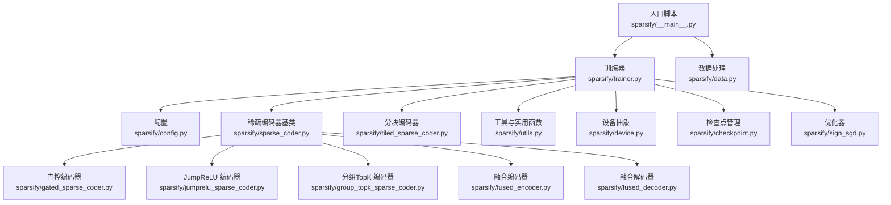
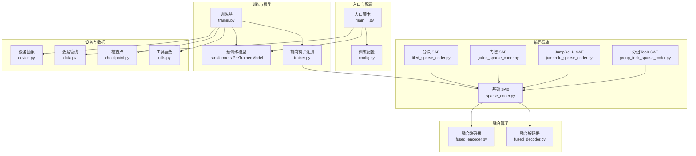
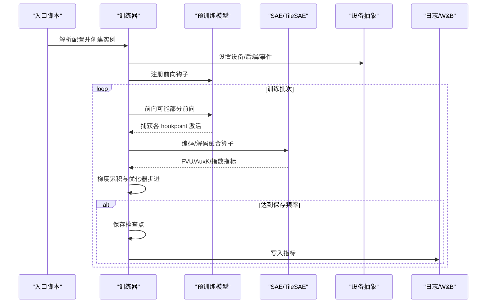
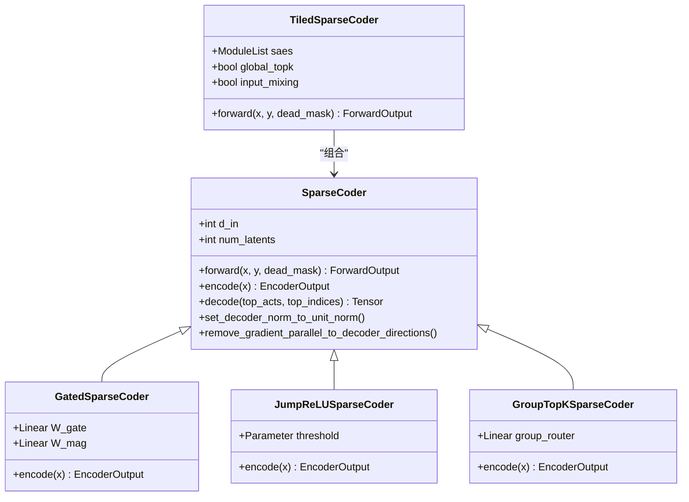
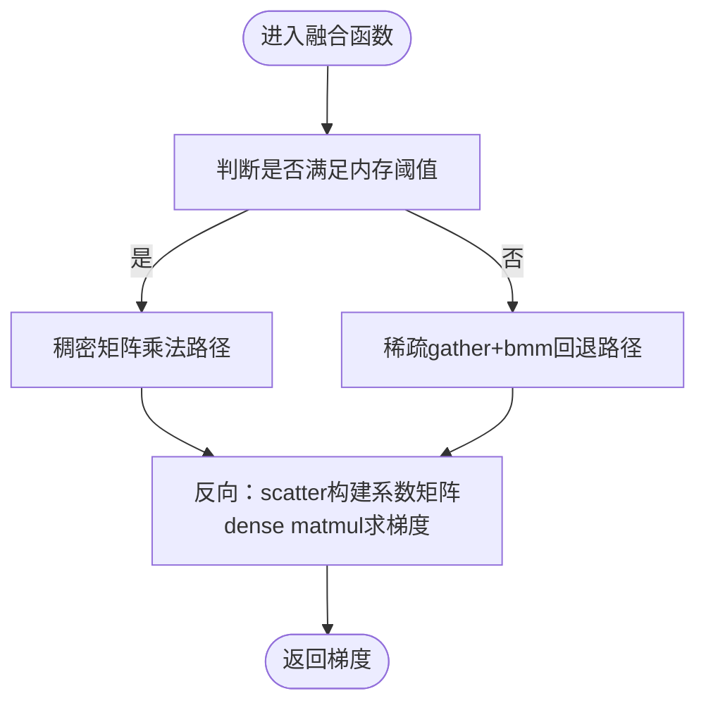
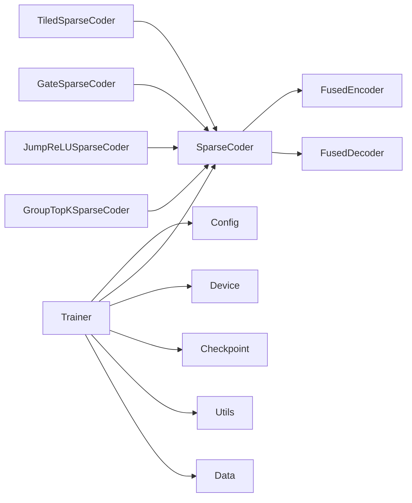

# 核心组件

<cite>
**本文档引用的文件**
- [sparsify/__main__.py](file://sparsify/__main__.py)
- [sparsify/trainer.py](file://sparsify/trainer.py)
- [sparsify/config.py](file://sparsify/config.py)
- [sparsify/sparse_coder.py](file://sparsify/sparse_coder.py)
- [sparsify/gated_sparse_coder.py](file://sparsify/gated_sparse_coder.py)
- [sparsify/group_topk_sparse_coder.py](file://sparsify/group_topk_sparse_coder.py)
- [sparsify/jumprelu_sparse_coder.py](file://sparsify/jumprelu_sparse_coder.py)
- [sparsify/tiled_sparse_coder.py](file://sparsify/tiled_sparse_coder.py)
- [sparsify/fused_encoder.py](file://sparsify/fused_encoder.py)
- [sparsify/fused_decoder.py](file://sparsify/fused_decoder.py)
- [sparsify/utils.py](file://sparsify/utils.py)
- [sparsify/device.py](file://sparsify/device.py)
- [sparsify/checkpoint.py](file://sparsify/checkpoint.py)
- [sparsify/data.py](file://sparsify/data.py)
- [sparsify/sign_sgd.py](file://sparsify/sign_sgd.py)
</cite>

## 目录
1. [简介](#简介)
2. [项目结构](#项目结构)
3. [核心组件](#核心组件)
4. [架构总览](#架构总览)
5. [详细组件分析](#详细组件分析)
6. [依赖关系分析](#依赖关系分析)
7. [性能考量](#性能考量)
8. [故障排除指南](#故障排除指南)
9. [结论](#结论)

## 简介
本项目围绕稀疏自动编码器（Sparse Autoencoders, SAE）在大语言模型中的训练与推理展开，支持多种编码架构（Top-K、门控、JumpReLU、分组Top-K）、分块训练（Tiling）、Hadamard旋转、以及针对 Ascend NPU 的优化实现。核心目标是通过高效的数据流、设备抽象与分布式训练能力，在多类硬件平台上稳定地训练和评估 SAE。

## 项目结构
项目采用按功能模块划分的组织方式：
- 训练入口与配置：入口脚本负责参数解析、数据加载、分布式初始化与训练调度；训练配置定义了超参、日志、保存策略等。
- 模型与编码器：提供标准 SAE 与多种变体（门控、JumpReLU、分组Top-K），并包含融合前向/反向的编码器与解码器实现。
- 设备与分布式：统一设备类型检测、bf16 自动混合精度、事件计时、分布式后端选择与同步。
- 数据与检查点：数据预处理（分块与分词）、内存映射数据集、检查点保存/加载与断点续训。
- 工具与实用函数：层名解析、部分前向、解码器实现选择（NPU/CUDA 使用融合实现，CPU 回退到原生实现）。

图表来源
- [sparsify/__main__.py:1-211](file://sparsify/__main__.py#L1-L211)
- [sparsify/trainer.py:1-865](file://sparsify/trainer.py#L1-L865)
- [sparsify/config.py:1-220](file://sparsify/config.py#L1-L220)
- [sparsify/sparse_coder.py:1-307](file://sparsify/sparse_coder.py#L1-L307)
- [sparsify/gated_sparse_coder.py:1-77](file://sparsify/gated_sparse_coder.py#L1-L77)
- [sparsify/jumprelu_sparse_coder.py:1-69](file://sparsify/jumprelu_sparse_coder.py#L1-L69)
- [sparsify/group_topk_sparse_coder.py:1-84](file://sparsify/group_topk_sparse_coder.py#L1-L84)
- [sparsify/tiled_sparse_coder.py:1-342](file://sparsify/tiled_sparse_coder.py#L1-L342)
- [sparsify/fused_encoder.py:1-107](file://sparsify/fused_encoder.py#L1-L107)
- [sparsify/fused_decoder.py:1-107](file://sparsify/fused_decoder.py#L1-L107)
- [sparsify/utils.py:1-227](file://sparsify/utils.py#L1-L227)
- [sparsify/device.py:1-118](file://sparsify/device.py#L1-L118)
- [sparsify/checkpoint.py:1-302](file://sparsify/checkpoint.py#L1-L302)
- [sparsify/data.py:1-158](file://sparsify/data.py#L1-L158)
- [sparsify/sign_sgd.py:1-24](file://sparsify/sign_sgd.py#L1-L24)

章节来源
- [sparsify/__main__.py:1-211](file://sparsify/__main__.py#L1-L211)
- [sparsify/trainer.py:1-865](file://sparsify/trainer.py#L1-L865)
- [sparsify/config.py:1-220](file://sparsify/config.py#L1-L220)

## 核心组件
- 训练入口与生命周期管理：负责参数解析、模型与数据加载、分布式初始化、断点续训路径选择、训练循环启动。
- 训练器（Trainer）：构建 SAE、注册前向钩子、执行前向/反向、聚合指标、梯度累积、保存检查点、日志记录（W&B/本地 JSONL）。
- 配置系统（TrainConfig/SparseCoderConfig）：集中定义训练与编码器超参、验证约束、默认值与校验逻辑。
- 稀疏编码器家族：标准 Top-K、门控（独立门与幅度分支）、JumpReLU（可学习阈值+STE）、分组Top-K（路由器硬路由）。
- 分块编码器（TiledSparseCoder）：将输入按维度切分为多个块，每个块独立训练 SAE，并支持全局Top-K与输入混洗。
- 融合算子（FusedEncoder/FusedDecoder）：自定义 Autograd Function，针对 NPU/CUDA 提供高性能前向/反向实现，避免 CPU 回退。
- 设备抽象（device.py）：统一 CUDA/NPU/CPUs 的设备检测、bf16 支持、事件计时、分布式后端选择。
- 数据管线（data.py）：分块与分词、内存映射数据集、并行化处理。
- 检查点（checkpoint.py）：断点续训、权重加载/保存、Hadamard 旋转状态、跨进程同步。
- 工具函数（utils.py）：层名解析、部分前向、解码器实现选择、参数字符串解析。

章节来源
- [sparsify/trainer.py:40-865](file://sparsify/trainer.py#L40-L865)
- [sparsify/config.py:7-220](file://sparsify/config.py#L7-L220)
- [sparsify/sparse_coder.py:36-307](file://sparsify/sparse_coder.py#L36-L307)
- [sparsify/tiled_sparse_coder.py:17-342](file://sparsify/tiled_sparse_coder.py#L17-L342)
- [sparsify/fused_encoder.py:21-107](file://sparsify/fused_encoder.py#L21-L107)
- [sparsify/fused_decoder.py:27-107](file://sparsify/fused_decoder.py#L27-L107)
- [sparsify/device.py:34-118](file://sparsify/device.py#L34-L118)
- [sparsify/data.py:16-158](file://sparsify/data.py#L16-L158)
- [sparsify/checkpoint.py:44-302](file://sparsify/checkpoint.py#L44-L302)
- [sparsify/utils.py:20-227](file://sparsify/utils.py#L20-L227)

## 架构总览
下图展示了从入口到训练器、编码器、设备与数据的交互关系，以及关键优化点（融合算子、分块训练、Hadamard 旋转、断点续训）。

图表来源
- [sparsify/__main__.py:81-211](file://sparsify/__main__.py#L81-L211)
- [sparsify/trainer.py:179-865](file://sparsify/trainer.py#L179-L865)
- [sparsify/config.py:46-220](file://sparsify/config.py#L46-L220)
- [sparsify/sparse_coder.py:36-307](file://sparsify/sparse_coder.py#L36-L307)
- [sparsify/tiled_sparse_coder.py:17-342](file://sparsify/tiled_sparse_coder.py#L17-L342)
- [sparsify/fused_encoder.py:21-107](file://sparsify/fused_encoder.py#L21-L107)
- [sparsify/fused_decoder.py:27-107](file://sparsify/fused_decoder.py#L27-L107)
- [sparsify/device.py:34-118](file://sparsify/device.py#L34-L118)
- [sparsify/data.py:16-158](file://sparsify/data.py#L16-L158)
- [sparsify/checkpoint.py:44-302](file://sparsify/checkpoint.py#L44-L302)
- [sparsify/utils.py:20-227](file://sparsify/utils.py#L20-L227)

## 详细组件分析

### 训练器（Trainer）
- 职责：初始化 SAE、注册钩子、执行前向/反向、指标聚合、梯度累积与优化器步进、保存检查点、日志记录。
- 关键流程：
  - 层选择与宽度解析：根据 hookpoints 或层索引列表解析输入维度，支持步幅与范围模式。
  - SAE 初始化：支持单/多随机种子、分块模式（num_tiles>1）与不同架构（Top-K/Gated/JumpReLU/GroupTopK）。
  - 前向钩子：在指定模块输出处捕获激活，可选 Hadamard 旋转、残差 SAE（Level 1）减去重建项、融合解码器计算 FVU 与辅助损失。
  - 梯度累积与优化：按 grad_acc_steps 与 micro_acc_steps 累积，使用 ScheduleFree 包装的优化器（Adam/SignSGD/Muon）。
  - 指标与日志：支持 W&B 与本地 JSONL，含前向时间、指标时间、死特征比例、Exceed 指标（基于肘部阈值）。
  - 断点续训：保存/加载 SAE 权重、优化器状态、训练步数、最佳损失、Hadamard 旋转状态。
- 性能优化：
  - 延迟指标事件与批量 all_reduce，减少通信开销。
  - 死特征计数使用一次性归约替代 per-forward scatter，避免 NPU 上的 AI_CPU 回退。
  - 可选 torch.compile 编译层以融合小算子，降低内核启动开销。

图表来源
- [sparsify/trainer.py:179-865](file://sparsify/trainer.py#L179-L865)
- [sparsify/device.py:75-118](file://sparsify/device.py#L75-L118)
- [sparsify/checkpoint.py:199-302](file://sparsify/checkpoint.py#L199-L302)

章节来源
- [sparsify/trainer.py:40-865](file://sparsify/trainer.py#L40-L865)
- [sparsify/checkpoint.py:149-302](file://sparsify/checkpoint.py#L149-L302)

### 稀疏编码器家族
- 基础 SAE（Top-K）：线性编码器+共享解码器，支持辅助损失（AuxK）与单位范数解码器。
- 门控 SAE：独立门分支（sigmoid→Top-K）与幅度分支（ReLU），最终输出为两者乘积，共享解码器。
- JumpReLU SAE：每隐单元有可学习阈值，前向硬掩码，反向用 Sigmoid 近似（STE），固定K输出。
- 分组Top-K SAE：路由器对组评分并选择 top-g 组，随后在被选组集合上进行全局Top-K，当前版本为硬路由。
- 分块 SAE：将输入沿隐藏维切分为 T 块，每块独立训练 SAE；支持全局Top-K与输入混洗矩阵，提升跨块信息流动。

图表来源
- [sparsify/sparse_coder.py:36-307](file://sparsify/sparse_coder.py#L36-L307)
- [sparsify/gated_sparse_coder.py:12-77](file://sparsify/gated_sparse_coder.py#L12-L77)
- [sparsify/jumprelu_sparse_coder.py:12-69](file://sparsify/jumprelu_sparse_coder.py#L12-L69)
- [sparsify/group_topk_sparse_coder.py:12-84](file://sparsify/group_topk_sparse_coder.py#L12-L84)
- [sparsify/tiled_sparse_coder.py:17-342](file://sparsify/tiled_sparse_coder.py#L17-L342)

章节来源
- [sparsify/sparse_coder.py:36-307](file://sparsify/sparse_coder.py#L36-L307)
- [sparsify/gated_sparse_coder.py:12-77](file://sparsify/gated_sparse_coder.py#L12-L77)
- [sparsify/jumprelu_sparse_coder.py:12-69](file://sparsify/jumprelu_sparse_coder.py#L12-L69)
- [sparsify/group_topk_sparse_coder.py:12-84](file://sparsify/group_topk_sparse_coder.py#L12-L84)
- [sparsify/tiled_sparse_coder.py:17-342](file://sparsify/tiled_sparse_coder.py#L17-L342)

### 融合算子（FusedEncoder/FusedDecoder）
- 融合编码器：ReLU 线性→Top-K 的自定义 Autograd Function，根据内存阈值选择稠密矩阵乘或稀疏 gather+bmm，避免 NPU/CPU 回退。
- 融合解码器：embedding_bag 替换为自定义 Function，前向稠密 matmul，反向同样采用稠密路径，确保 Ascend NPU 兼容。

图表来源
- [sparsify/fused_encoder.py:21-107](file://sparsify/fused_encoder.py#L21-L107)
- [sparsify/fused_decoder.py:27-107](file://sparsify/fused_decoder.py#L27-L107)

章节来源
- [sparsify/fused_encoder.py:21-107](file://sparsify/fused_encoder.py#L21-L107)
- [sparsify/fused_decoder.py:27-107](file://sparsify/fused_decoder.py#L27-L107)

### 设备抽象与分布式
- 平台检测：自动识别 CUDA/NPU/CPUs，bf16 支持判定，事件计时与同步封装。
- 分布式后端：CUDA 使用 nccl，NPU 使用 hccl，CPU 使用 gloo。
- 自动混合精度装饰器：在运行时根据设备类型启用 bf16 autocast，加速稀疏前向。

章节来源
- [sparsify/device.py:34-118](file://sparsify/device.py#L34-L118)

### 数据与检查点
- 数据管线：分块与分词、并行处理、内存映射数据集（适合大规模语料）。
- 检查点：支持常规与分块 SAE 的加载/保存，断点续训、Hadamard 旋转状态、跨进程同步。

章节来源
- [sparsify/data.py:16-158](file://sparsify/data.py#L16-L158)
- [sparsify/checkpoint.py:44-302](file://sparsify/checkpoint.py#L44-L302)

## 依赖关系分析
- 组件耦合：
  - Trainer 依赖 Config、SparseCoder 家族、FusedEncoder/Decoder、Device、Checkpoint、Utils、Data。
  - 各 SAE 变体均继承自 SparseCoder，共享解码接口与保存格式。
  - TiledSparseCoder 组合多个 SparseCoder 实例，提供全局Top-K与输入混洗。
- 外部依赖：
  - Transformers、Datasets、Accelerate、ScheduleFree、safetensors、einops、natsort 等。
- 循环依赖：未发现直接循环导入；工具函数按需引入，避免强耦合。

图表来源
- [sparsify/trainer.py:21-35](file://sparsify/trainer.py#L21-L35)
- [sparsify/sparse_coder.py:14-17](file://sparsify/sparse_coder.py#L14-L17)
- [sparsify/tiled_sparse_coder.py:11-14](file://sparsify/tiled_sparse_coder.py#L11-L14)
- [sparsify/gated_sparse_coder.py:7-9](file://sparsify/gated_sparse_coder.py#L7-L9)
- [sparsify/jumprelu_sparse_coder.py:7-9](file://sparsify/jumprelu_sparse_coder.py#L7-L9)
- [sparsify/group_topk_sparse_coder.py:7-9](file://sparsify/group_topk_sparse_coder.py#L7-L9)

章节来源
- [sparsify/trainer.py:21-35](file://sparsify/trainer.py#L21-L35)
- [sparsify/sparse_coder.py:14-17](file://sparsify/sparse_coder.py#L14-L17)
- [sparsify/tiled_sparse_coder.py:11-14](file://sparsify/tiled_sparse_coder.py#L11-L14)

## 性能考量
- 稀疏前向/反向融合：通过自定义 Autograd Function 将 scatter 与 matmul 合并，显著降低 NPU/CUDA 小算子开销。
- 死特征检测优化：使用一次性 all_reduce 与整型计数器，避免 per-forward scatter 导致的 AI_CPU 回退。
- 梯度累积与微批：支持 micro_acc_steps 将大批次拆分为更小的微批，平衡显存与吞吐。
- 编译优化：可选 torch.compile 编译 Transformer 层，融合 elementwise/layernorm 等小算子。
- 日志与计时：仅在需要时开启计时事件，批量 all_reduce 减少通信次数。

## 故障排除指南
- 无法找到检查点：确认 run_name 或模式匹配是否存在；断点续训要求保存目录存在且命名规范一致。
- 分块 SAE 不兼容：从非分块/分块数量不一致的检查点恢复会触发异常，需确保 num_tiles 一致。
- Elbow 阈值未生效：检查 elbow_threshold_path 是否存在，且 hookpoint 名称能被正确匹配。
- 设备不支持 bf16：在 CUDA 上可通过特性检测启用，在 NPU 上默认支持；必要时降级为自动类型。
- 梯度累积导致显存不足：适当增大 micro_acc_steps 或减小 batch_size；或关闭编译优化以减少额外内存占用。
- 残差 SAE 未生效：确认 residual_from 路径存在且对应 hookpoint 的 Level 1 SAE 已冻结。

章节来源
- [sparsify/checkpoint.py:44-73](file://sparsify/checkpoint.py#L44-L73)
- [sparsify/trainer.py:104-147](file://sparsify/trainer.py#L104-L147)
- [sparsify/device.py:58-64](file://sparsify/device.py#L58-L64)
- [sparsify/config.py:176-177](file://sparsify/config.py#L176-L177)

## 结论
本项目通过清晰的模块划分与设备抽象，实现了在 CUDA/NPU/CPU 上均可运行的稀疏自动编码器训练框架。其核心优势在于：
- 多样化的编码架构适配不同研究需求；
- 融合算子与分块训练有效提升性能并降低内存压力；
- 完善的断点续训与日志体系便于大规模实验管理；
- 对 Ascend NPU 的深度优化确保了在国产芯片上的稳定与高效。