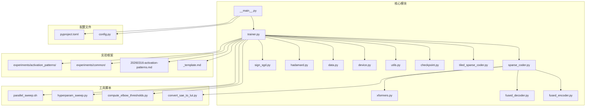
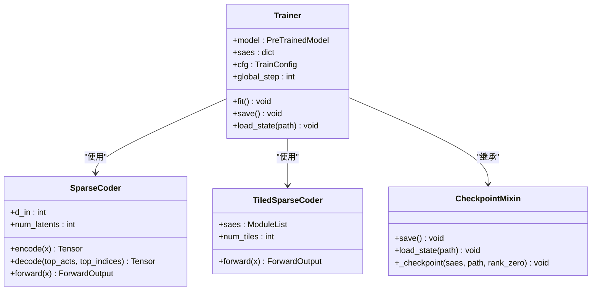
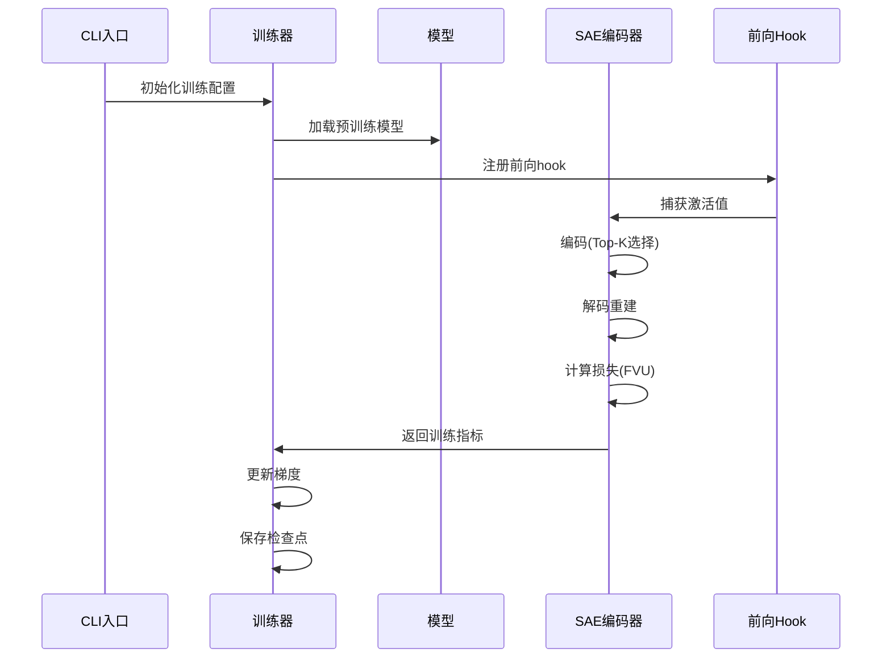
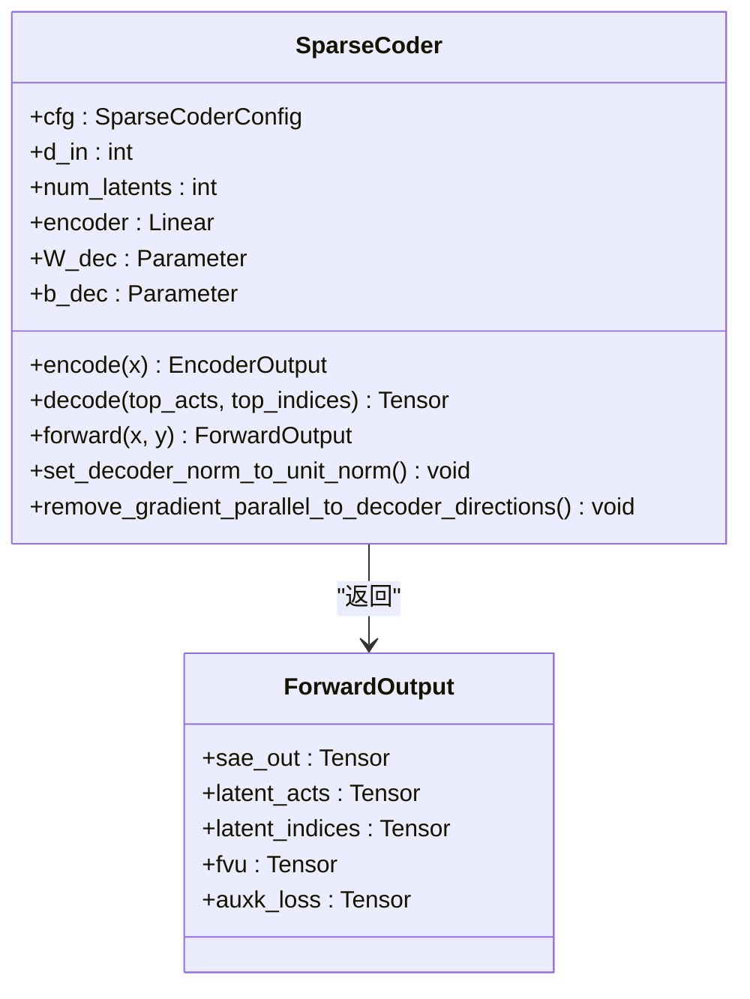
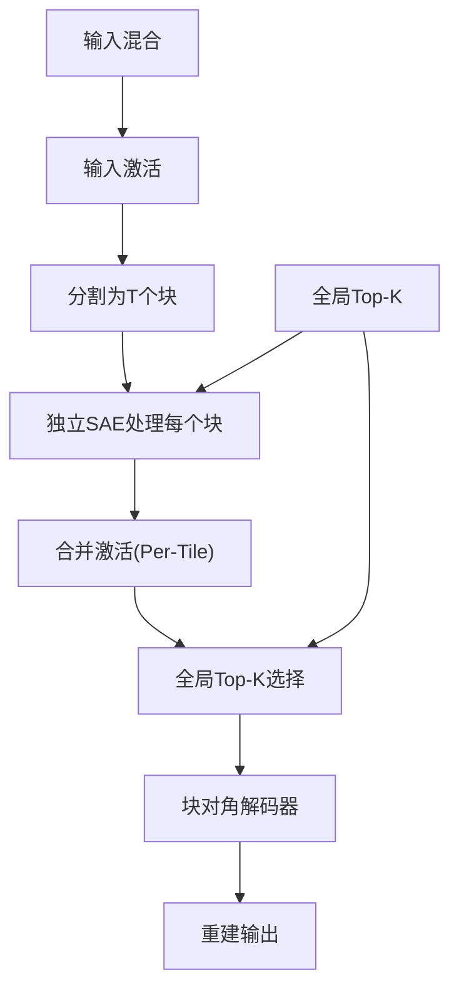
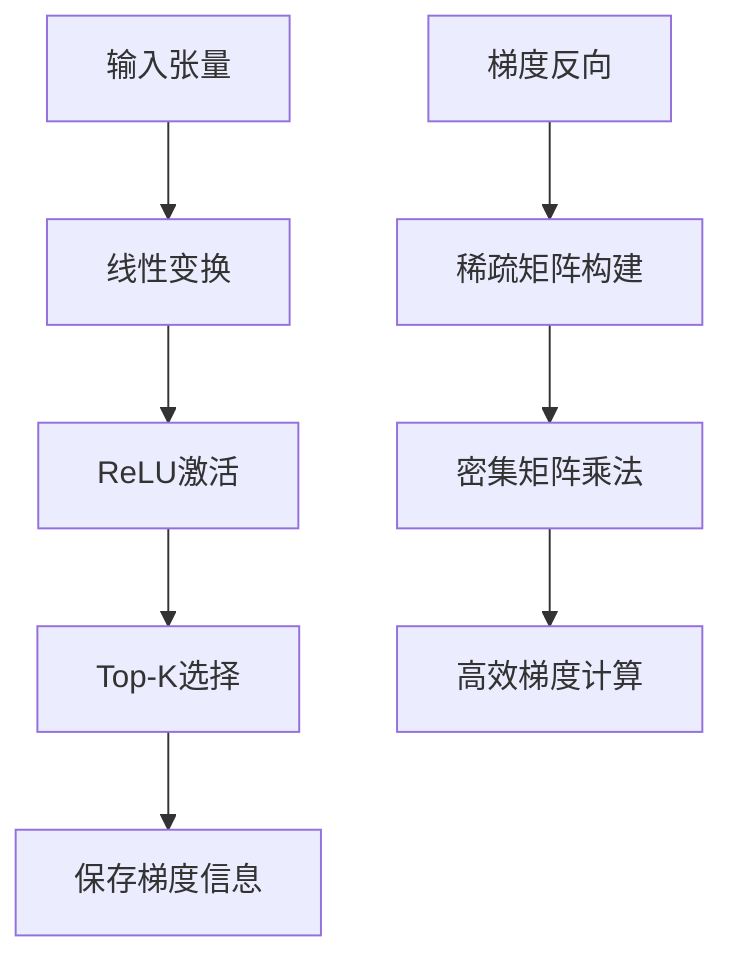
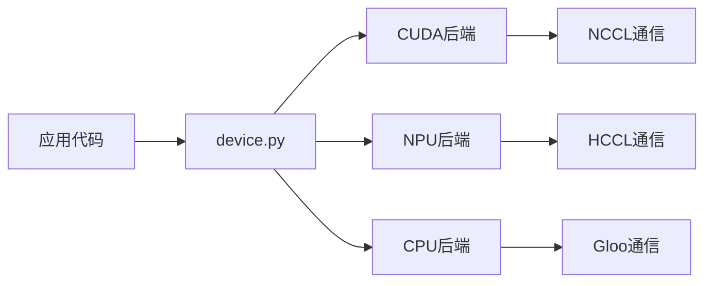
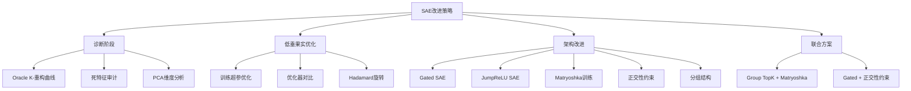
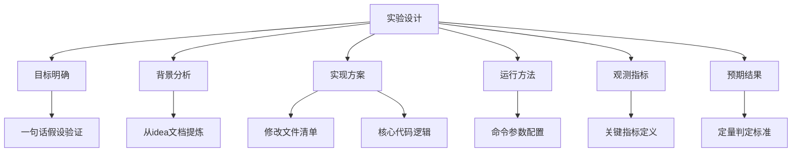
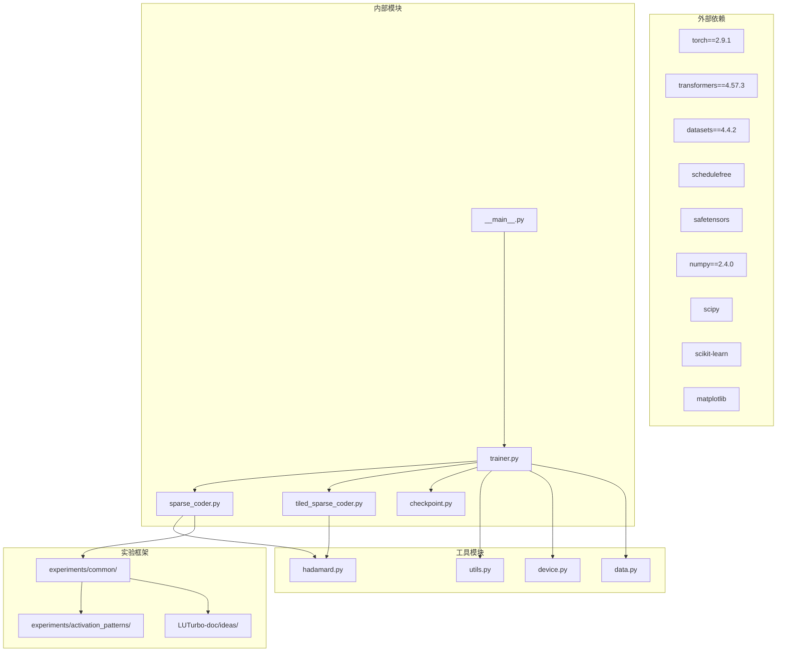

# 开发者指南

<cite>
**本文档引用的文件**
- [README.md](file://README.md)
- [__main__.py](file://sparsify/__main__.py)
- [config.py](file://sparsify/config.py)
- [trainer.py](file://sparsify/trainer.py)
- [sparse_coder.py](file://sparsify/sparse_coder.py)
- [tiled_sparse_coder.py](file://sparsify/tiled_sparse_coder.py)
- [fused_encoder.py](file://sparsify/fused_encoder.py)
- [fused_decoder.py](file://sparsify/fused_decoder.py)
- [utils.py](file://sparsify/utils.py)
- [device.py](file://sparsify/device.py)
- [data.py](file://sparsify/data.py)
- [checkpoint.py](file://sparsify/checkpoint.py)
- [sign_sgd.py](file://sparsify/sign_sgd.py)
- [hadamard.py](file://sparsify/hadamard.py)
- [xformers.py](file://sparsify/xformers.py)
- [pyproject.toml](file://pyproject.toml)
- [sae-improvement.md](file://LUTurbo-doc/ideas/sae-improvement.md)
- [hyperparam_sweep.py](file://scripts/hyperparam_sweep.py)
- [parallel_sweep.sh](file://scripts/parallel_sweep.sh)
- [_template.md](file://LUTurbo-doc/experiments/_template.md)
- [20260316-activation-patterns.md](file://LUTurbo-doc/experiments/20260316-activation-patterns.md)
- [data.py](file://experiments/common/data.py)
- [sae_utils.py](file://experiments/common/sae_utils.py)
- [hotset/run.py](file://experiments/activation_patterns/hotset/run.py)
- [seed_expand/run.py](file://experiments/activation_patterns/seed_expand/run.py)
- [sublibrary/run.py](file://experiments/activation_patterns/sublibrary/run.py)
- [incremental/run.py](file://experiments/activation_patterns/incremental/run.py)
</cite>

## 目录
1. [简介](#简介)
2. [项目结构](#项目结构)
3. [核心组件](#核心组件)
4. [架构概览](#架构概览)
5. [详细组件分析](#详细组件分析)
6. [统一的SAE改进策略](#统一的sae改进策略)
7. [实验框架与方法论](#实验框架与方法论)
8. [依赖关系分析](#依赖关系分析)
9. [性能考虑](#性能考虑)
10. [故障排除指南](#故障排除指南)
11. [结论](#结论)

## 简介

Sparsify 是 LUTurbo 的稀疏自编码器（SAE）训练与导出模块。该项目专注于在 Transformer 模块输入上训练 SAE，生成阈值统计，以及将训练好的 SAE 检查点导出为 LUT 友好的产物。

### 主要功能
- 通过前向 hook 捕获 Transformer 激活值并训练 SAE
- 为选定的 hookpoint 和层保存 SAE 检查点
- 计算 LUTurbo 补偿逻辑使用的肘部阈值统计信息
- 将训练好的 SAE 检查点导出为 LUT 友好的产物

### 技术特性
- 支持 NVIDIA CUDA 和 Ascend NPU 设备
- 实现了高效的分块 SAE 变体
- 提供了融合的编码器和解码器实现
- 支持分布式训练和检查点管理
- **新增**：统一的SAE改进策略框架和实验方法论

**章节来源**
- [README.md:1-154](file://README.md#L1-L154)

## 项目结构

**图表来源**
- [__main__.py:1-211](file://sparsify/__main__.py#L1-L211)
- [trainer.py:1-760](file://sparsify/trainer.py#L1-L760)
- [config.py:1-149](file://sparsify/config.py#L1-L149)
- [hyperparam_sweep.py:1-273](file://scripts/hyperparam_sweep.py#L1-L273)
- [parallel_sweep.sh:1-215](file://scripts/parallel_sweep.sh#L1-L215)

### 核心目录组织

项目采用模块化的目录结构，主要包含以下核心组件：

1. **sparsify/** - 主要源代码目录
   - `__main__.py` - CLI 入口点
   - `trainer.py` - 训练器核心逻辑
   - `sparse_coder.py` - 标准 SAE 实现
   - `tiled_sparse_coder.py` - 分块 SAE 实现
   - `fused_encoder.py` - 融合编码器
   - `fused_decoder.py` - 融合解码器
   - `utils.py` - 工具函数集合
   - `device.py` - 设备抽象层
   - `data.py` - 数据处理工具
   - `checkpoint.py` - 检查点管理
   - `hadamard.py` - Hadamard 变换
   - `sign_sgd.py` - SignSGD 优化器
   - `xformers.py` - Triton 实现的嵌入袋

2. **scripts/** - 实验和脚本工具
   - `hyperparam_sweep.py` - 超参数扫描脚本
   - `parallel_sweep.sh` - 并行超参数扫描脚本

3. **experiments/** - 实验框架和分析工具
   - `common/` - 实验通用工具和数据处理
   - `activation_patterns/` - 激活模式分析实验
   - 各算子类型的专门实验脚本

4. **LUTurbo-doc/** - 文档和方法论
   - `ideas/` - SAE改进想法和策略
   - `experiments/` - 实验模板和规范

**章节来源**
- [README.md:71-94](file://README.md#L71-L94)

## 核心组件

### 训练器 (Trainer)

训练器是整个系统的核心组件，负责协调 SAE 训练过程。它实现了以下关键功能：

- **Hook 管理**: 自动发现和注册模型中的 hookpoint
- **分布式训练**: 支持多 GPU 和多进程训练
- **检查点管理**: 自动保存和恢复训练状态
- **指标监控**: 实时计算和记录训练指标

**图表来源**
- [trainer.py:39-760](file://sparsify/trainer.py#L39-L760)
- [sparse_coder.py:36-269](file://sparsify/sparse_coder.py#L36-L269)
- [tiled_sparse_coder.py:17-342](file://sparsify/tiled_sparse_coder.py#L17-L342)

### 配置系统

配置系统提供了灵活的参数管理机制：

- **SparseCoderConfig**: SAE 架构配置
- **TrainConfig**: 训练配置，包含超参数和训练设置
- **自动验证**: 运行时参数验证和约束检查

**章节来源**
- [config.py:7-149](file://sparsify/config.py#L7-L149)

## 架构概览

**图表来源**
- [__main__.py:131-211](file://sparsify/__main__.py#L131-L211)
- [trainer.py:162-729](file://sparsify/trainer.py#L162-L729)

### 数据流架构

系统采用流水线式的训练架构：

1. **数据准备**: 从 HuggingFace 数据集或内存映射文件加载
2. **模型前向**: 通过注册的 hook 捕获中间激活
3. **SAE 处理**: 对激活进行稀疏编码和解码
4. **损失计算**: 基于重构误差计算 FVU 指标
5. **梯度更新**: 通过 SignSGD 优化器更新参数

**章节来源**
- [__main__.py:81-129](file://sparsify/__main__.py#L81-L129)
- [trainer.py:347-488](file://sparsify/trainer.py#L347-L488)

## 详细组件分析

### 稀疏自编码器 (SparseCoder)

SparseCoder 实现了标准的稀疏自编码器架构：

**图表来源**
- [sparse_coder.py:36-269](file://sparsify/sparse_coder.py#L36-L269)

#### 关键特性

1. **Top-K 稀疏性**: 通过 ReLU + top-k 选择实现稀疏激活
2. **融合实现**: 自定义 autograd 函数优化内存使用
3. **辅助损失**: 支持 AuxK 死特征恢复机制
4. **设备适配**: 自动混合精度支持

**章节来源**
- [sparse_coder.py:176-239](file://sparsify/sparse_coder.py#L176-L239)

### 分块稀疏自编码器 (TiledSparseCoder)

TiledSparseCoder 实现了分块训练策略：

**图表来源**
- [tiled_sparse_coder.py:17-342](file://sparsify/tiled_sparse_coder.py#L17-L342)

#### 分块策略优势

1. **内存效率**: 将大维度分解为小块处理
2. **并行性**: 各块可以独立训练和推理
3. **灵活性**: 支持输入混合和全局 Top-K 两种模式
4. **扩展性**: 可以根据硬件能力调整块数量

**章节来源**
- [tiled_sparse_coder.py:172-253](file://sparsify/tiled_sparse_coder.py#L172-L253)

### 融合实现

系统实现了多个融合版本以优化性能：

#### 融合编码器 (FusedEncoder)

**图表来源**
- [fused_encoder.py:21-107](file://sparsify/fused_encoder.py#L21-L107)

#### 融合解码器 (FusedDecoder)

针对 NPU 兼容性的特殊实现，避免了 AI_VECTOR_CORE 到 AI_CORE 的转换：

**章节来源**
- [fused_encoder.py:18-107](file://sparsify/fused_encoder.py#L18-L107)
- [fused_decoder.py:1-107](file://sparsify/fused_decoder.py#L1-L107)

### 设备抽象层

统一的设备管理接口支持多种硬件平台：

**图表来源**
- [device.py:1-118](file://sparsify/device.py#L1-L118)

**章节来源**
- [device.py:34-118](file://sparsify/device.py#L34-L118)

## 统一的SAE改进策略

### 策略框架概述

基于 LUTurbo-doc/ideas/sae-improvement.md，项目建立了统一的SAE改进策略框架：

**图表来源**
- [sae-improvement.md:37-475](file://LUTurbo-doc/ideas/sae-improvement.md#L37-L475)

### 诊断阶段 (Phase 0)

诊断阶段通过三个低成本实验确定改进方向：

#### Oracle K-重构曲线
- **目的**: 分离"字典质量"和"选择质量"两个因素
- **方法**: 固定解码器字典，测试不同K值的重构效果
- **关键指标**: encoder vs oracle vs optimal vs pca 四条曲线

#### 死特征审计
- **目的**: 检查当前训练是否浪费了字典容量
- **方法**: 统计基向量激活频率，确认auxk_alpha设置
- **预期**: 低垂果实修复（调高auxk_alpha）

#### PCA维度分析
- **目的**: 判断K=32的理论下界
- **方法**: 对各层各算子做PCA，记录累积解释方差比例
- **解读**: PCA是线性重构的最优基，决定K的硬天花板

**章节来源**
- [sae-improvement.md:41-93](file://LUTurbo-doc/ideas/sae-improvement.md#L41-L93)

### 低垂果实优化 (Phase 1)

在不改变架构的前提下，通过超参数优化获得显著改进：

#### 训练超参优化
- **auxk_alpha sweep**: {0, 1/64, 1/32, 1/16}
- **优化器对比**: signum vs adam vs muon
- **Hadamard on/off**: 激活分布均匀性测试

#### K值探索
- **K sweep**: {32, 64, 96, 128} × 最优超参
- **目标**: 确定当前架构下的K-FVU基线

**章节来源**
- [sae-improvement.md:98-247](file://LUTurbo-doc/ideas/sae-improvement.md#L98-L247)

### 架构改进 (Phase 2)

需要代码修改的架构层面改进：

#### Gated SAE
- **原理**: 将编码器分为gate和magnitude两个独立网络
- **优势**: 选择/系数解耦，训练更专注
- **实现**: 修改sparse_coder.py的编码器部分

#### JumpReLU SAE
- **原理**: 每特征独立的可学习阈值
- **挑战**: K随输入变化，需要train-deploy折中
- **解决方案**: 硬上界或统计控制

#### Matryoshka训练
- **原理**: 同时优化多个K值的重构质量
- **优势**: 强制学习重要性排序，优雅降级
- **实现**: 修改损失函数

#### 正交性约束
- **原理**: 鼓励解码器基向量正交
- **优势**: 每个基向量独立贡献，降低K需求
- **实现**: 在训练循环中加正则损失

**章节来源**
- [sae-improvement.md:122-247](file://LUTurbo-doc/ideas/sae-improvement.md#L122-L247)

### 分组结构改进 (Goal B)

引入分组结构以降低选择开销：

#### Group TopK
- **原理**: 两级选择：组级路由器 + 组内TopK
- **收益**: 选择开销从O(h×N)降到O(h×N/G)
- **实现**: 独立路由器R∈R^(G×h)

#### 共激活正则化
- **原理**: 额外加正则项鼓励分组
- **实现**: L_group = -Σ_同组(i,j) CoAct(i,j) + Σ_跨组(i,j) max(CoAct(i,j), 0)

#### 分块对角编码器
- **原理**: 约束编码器为分块对角
- **实现**: E = block_diag(E_1, ..., E_G)

**章节来源**
- [sae-improvement.md:266-317](file://LUTurbo-doc/ideas/sae-improvement.md#L266-L317)

## 实验框架与方法论

### 实验模板标准化

基于LUTurbo-doc/experiments/_template.md建立标准化实验流程：

**图表来源**
- [_template.md:1-42](file://LUTurbo-doc/experiments/_template.md#L1-L42)

### 激活模式分析实验

基于LUTurbo-doc/experiments/20260316-activation-patterns.md的统一分析框架：

#### Oracle基准线A：增量选择 (C1e)
- **方法**: 保留前一token选择结果，oracle替换m个位置
- **变体**: topK、topL、union2
- **关键指标**: replacement_count分布、new_mass_ratio

#### Oracle基准线B：热集选择 (C1h)
- **方法**: 固定全局热集H，测试每个token命中情况
- **参数**: |H| = N×1%、5%、10%、20%
- **关键指标**: per_token_recall、hot_value_ratio

#### Oracle基准线C：条件子库 (A2b/C1c)
- **方法**: 离线聚类构建子库，oracle路由到正确簇
- **参数**: G = 8、16、32、64
- **关键指标**: sublibrary_size vs recall曲线

#### Oracle基准线D：种子扩展 (C1i)
- **方法**: 从强激活种子出发，PMI近邻扩展
- **参数**: s = 4、8、16、32，n = 8、16、32、64
- **关键指标**: candidate_size_vs_recall曲线

**章节来源**
- [20260316-activation-patterns.md:18-387](file://LUTurbo-doc/experiments/20260316-activation-patterns.md#L18-L387)

### 实验工具链

#### 实验通用工具
- **数据收集**: experiments/common/data.py
  - `collect_raw_activations()`: 多hookpoint同时捕获
  - `encode_activations()`: 通过SAE编码
  - `load_dataset_auto()`: 自动数据集加载

- **SAE工具**: experiments/common/sae_utils.py
  - `load_sae_from_lut()`: 从LUT加载SAE
  - `encode_topk()`: Top-K编码
  - `get_layer_hookpoints()`: 层hookpoint映射

#### 专用分析脚本
- **热集分析**: experiments/activation_patterns/hotset/run.py
- **种子扩展**: experiments/activation_patterns/seed_expand/run.py  
- **子库分析**: experiments/activation_patterns/sublibrary/run.py
- **增量分析**: experiments/activation_patterns/incremental/run.py

**章节来源**
- [data.py:44-156](file://experiments/common/data.py#L44-L156)
- [sae_utils.py:15-124](file://experiments/common/sae_utils.py#L15-L124)

### 超参数扫描框架

#### Python脚本 (hyperparam_sweep.py)
- **批量实验**: 自动构建参数组合
- **分布式训练**: 支持多GPU并行
- **结果管理**: 自动命名和日志记录

#### Shell脚本 (parallel_sweep.sh)
- **GPU资源管理**: 8卡环境下的并行调度
- **实验编排**: 自动启动和监控
- **结果汇总**: 完成/失败统计

**章节来源**
- [hyperparam_sweep.py:23-273](file://scripts/hyperparam_sweep.py#L23-L273)
- [parallel_sweep.sh:8-215](file://scripts/parallel_sweep.sh#L8-L215)

## 依赖关系分析

**图表来源**
- [pyproject.toml:12-28](file://pyproject.toml#L12-L28)
- [__main__.py:15-26](file://sparsify/__main__.py#L15-L26)

### 关键依赖关系

1. **PyTorch 生态系统**: 核心深度学习框架和相关库
2. **Transformers 库**: 模型加载和预处理
3. **Datasets 库**: 数据集管理和处理
4. **Safetensors**: 安全的权重存储格式
5. **ScheduleFree**: 优化器包装器
6. **科学计算库**: scipy、numpy用于实验分析
7. **机器学习库**: scikit-learn用于聚类分析
8. **可视化库**: matplotlib用于结果展示

**章节来源**
- [pyproject.toml:1-131](file://pyproject.toml#L1-L131)

## 性能考虑

### 内存优化策略

1. **融合操作**: 编码器和解码器的自定义实现减少内存分配
2. **分块训练**: TiledSparseCoder 将大矩阵分解为小块处理
3. **梯度检查点**: 在内存受限时减少梯度存储
4. **自动混合精度**: 在支持的设备上使用 bfloat16

### 训练效率优化

1. **分布式训练**: 支持多 GPU 并行训练
2. **梯度累积**: 通过 `grad_acc_steps` 和 `micro_acc_steps` 控制
3. **延迟同步**: 使用 `no_sync` 上下文减少通信开销
4. **编译优化**: `compile_model` 选项启用 torch.compile

### 硬件特定优化

1. **NPU 兼容性**: 特殊的解码器实现避免 CPU 回退
2. **CUDA 优化**: 利用 Tensor Cores 和优化的内核
3. **设备感知**: 自动检测和选择最佳实现

### 实验效率优化

1. **并行扫描**: parallel_sweep.sh 支持8卡并行实验
2. **批量处理**: hyperparam_sweep.py 自动管理参数组合
3. **内存管理**: 实验框架采用流式处理避免内存峰值

## 故障排除指南

### 常见问题诊断

#### 训练不收敛
1. **检查学习率设置**: `TrainConfig.lr` 未设置时会自动计算
2. **验证数据质量**: 确保输入数据格式正确
3. **监控 FVU 指标**: 异常的 FVU 值可能指示问题

#### 内存不足错误
1. **启用分块训练**: 设置 `num_tiles > 1`
2. **调整批大小**: 减少 `batch_size` 或增加 `grad_acc_steps`
3. **检查硬件支持**: 确认设备类型和内存容量

#### 分布式训练问题
1. **检查环境变量**: 确保 `LOCAL_RANK` 和 `RANK` 正确设置
2. **验证通信后端**: NCCL/HCCN 的可用性和版本
3. **同步检查点**: 确保所有进程都能访问相同的存储

#### 实验运行问题
1. **GPU资源不足**: parallel_sweep.sh需要8个GPU
2. **数据路径错误**: 确认模型和数据集路径
3. **内存峰值过高**: 使用流式处理避免一次性加载所有层

**章节来源**
- [trainer.py:120-135](file://sparsify/trainer.py#L120-L135)
- [config.py:124-149](file://sparsify/config.py#L124-L149)

### 调试技巧

1. **启用详细日志**: 使用 `logging.basicConfig(level=logging.INFO)`
2. **检查中间结果**: 通过 hook 访问激活值和梯度
3. **验证形状一致性**: 确保输入输出维度匹配
4. **测试单 GPU 训练**: 排除分布式相关问题
5. **实验数据验证**: 使用小批量数据快速验证实验流程

## 结论

Sparsify 提供了一个完整且高效的稀疏自编码器训练框架，具有以下特点：

1. **模块化设计**: 清晰的组件分离便于维护和扩展
2. **性能优化**: 多种优化技术确保高效的训练和推理
3. **硬件兼容**: 支持多种加速器平台
4. **生产就绪**: 完善的检查点管理和分布式训练支持
5. **统一策略**: 基于系统的SAE改进策略框架
6. **实验标准化**: 完整的实验方法论和工具链
7. **可扩展性**: 支持大规模超参数扫描和并行实验

该框架为 LUTurbo 推理链路提供了高质量的 SAE 产物，是现代 Transformer 模型可解释性研究的重要工具。通过统一的SAE改进策略和标准化实验框架，项目能够系统性地推进SAE技术的发展，为后续的架构创新和性能优化奠定了坚实基础。