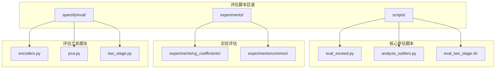
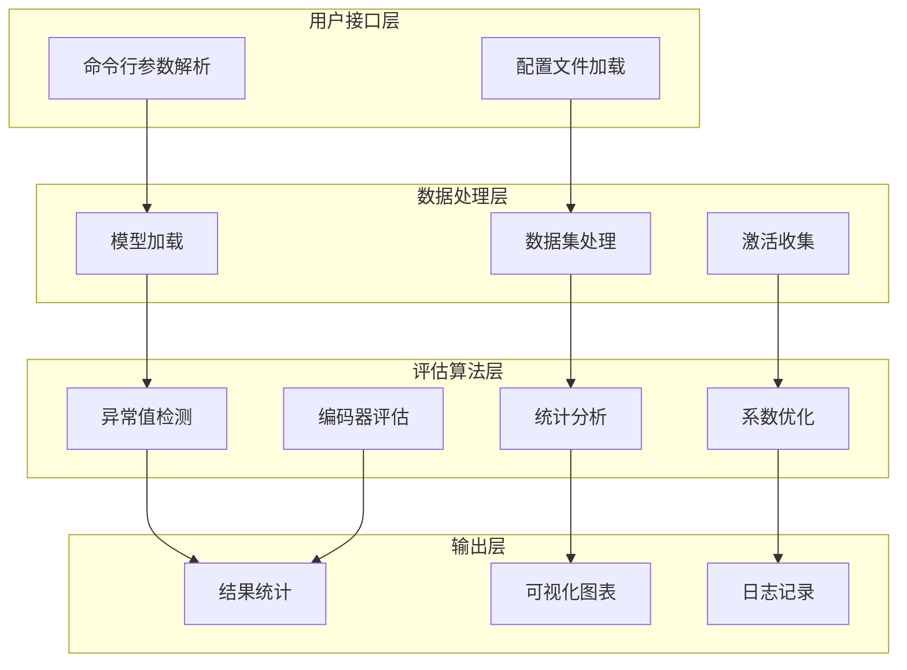
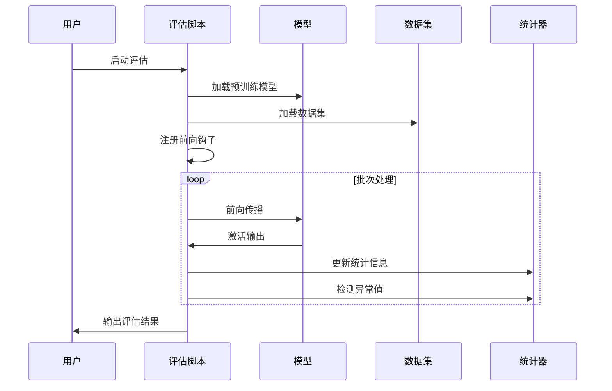
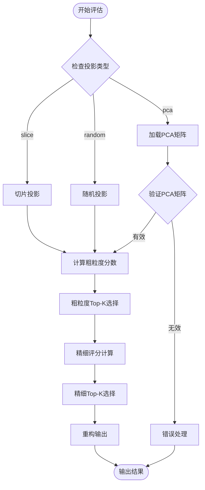
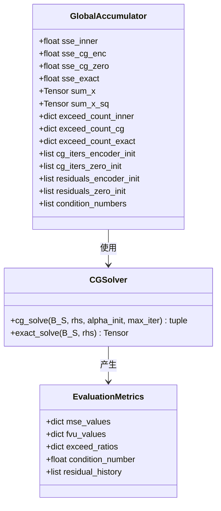
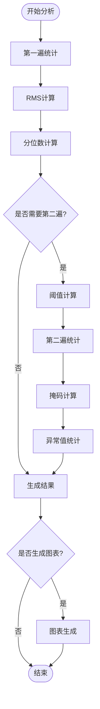
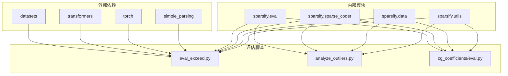

# 评估脚本

<cite>
**本文档中引用的文件**
- [scripts/eval_exceed.py](file://scripts/eval_exceed.py)
- [scripts/eval_two_stage.sh](file://scripts/eval_two_stage.sh)
- [experiments/cg_coefficients/eval.py](file://experiments/cg_coefficients/eval.py)
- [sparsify/eval/__init__.py](file://sparsify/eval/__init__.py)
- [sparsify/eval/encoders.py](file://sparsify/eval/encoders.py)
- [sparsify/eval/pca.py](file://sparsify/eval/pca.py)
- [sparsify/eval/two_stage.py](file://sparsify/eval/two_stage.py)
- [scripts/analyze_outliers.py](file://scripts/analyze_outliers.py)
- [experiments/common/data.py](file://experiments/common/data.py)
- [experiments/common/sae_utils.py](file://experiments/common/sae_utils.py)
- [experiments/cg_coefficients/cg_solver.py](file://experiments/cg_coefficients/cg_solver.py)
- [scripts/hyperparam_sweep.py](file://scripts/hyperparam_sweep.py)
- [scripts/simple_sweep.sh](file://scripts/simple_sweep.sh)
- [scripts/parallel_sweep.sh](file://scripts/parallel_sweep.sh)
- [README.md](file://README.md)
</cite>

## 目录
1. [简介](#简介)
2. [项目结构](#项目结构)
3. [核心组件](#核心组件)
4. [架构概览](#架构概览)
5. [详细组件分析](#详细组件分析)
6. [依赖关系分析](#依赖关系分析)
7. [性能考虑](#性能考虑)
8. [故障排除指南](#故障排除指南)
9. [结论](#结论)

## 简介

评估脚本是 Sparsify 项目中的重要组成部分，用于对训练好的稀疏自编码器（SAE）进行系统性评估和分析。这些脚本提供了多种评估方法，包括异常值检测、两阶段编码器评估、共轭梯度系数优化等，帮助研究人员深入理解 SAE 的性能表现和改进方向。

本评估体系主要包含三个核心功能模块：
- **异常值和统计分析**：通过统计方法识别和分析模型激活中的异常值
- **两阶段编码器评估**：对比不同投影策略的编码效果
- **系数优化评估**：使用共轭梯度方法优化 SAE 系数并评估收敛性能

## 项目结构

评估脚本分布在多个目录中，形成了清晰的功能层次结构：

**图表来源**
- [scripts/eval_exceed.py:1-567](file://scripts/eval_exceed.py#L1-L567)
- [experiments/cg_coefficients/eval.py:1-650](file://experiments/cg_coefficients/eval.py#L1-L650)
- [sparsify/eval/encoders.py:1-71](file://sparsify/eval/encoders.py#L1-L71)

**章节来源**
- [README.md:1-153](file://README.md#L1-L153)

## 核心组件

评估脚本系统由多个相互协作的组件构成，每个组件都有特定的功能和职责：

### 异常值评估组件
- **eval_exceed.py**：主评估脚本，支持多种评估模式和统计指标
- **analyze_outliers.py**：专门的异常值分析工具，提供详细的统计分析

### 编码器评估组件
- **encoders.py**：编码器策略构建器，支持全连接和两阶段编码器
- **two_stage.py**：两阶段编码器实现，包含多种投影策略
- **pca.py**：PCA 投影矩阵加载和选择工具

### 系数优化组件
- **cg_coefficients/eval.py**：共轭梯度系数评估主程序
- **cg_solver.py**：批量共轭梯度求解器实现
- **cg_coefficients/run_eval.sh**：两阶段评估执行脚本

**章节来源**
- [scripts/eval_exceed.py:42-82](file://scripts/eval_exceed.py#L42-L82)
- [sparsify/eval/encoders.py:13-71](file://sparsify/eval/encoders.py#L13-L71)
- [experiments/cg_coefficients/eval.py:21-41](file://experiments/cg_coefficients/eval.py#L21-L41)

## 架构概览

评估脚本系统采用模块化设计，通过清晰的接口和依赖关系实现功能组合：

**图表来源**
- [scripts/eval_exceed.py:260-567](file://scripts/eval_exceed.py#L260-L567)
- [experiments/cg_coefficients/eval.py:398-649](file://experiments/cg_coefficients/eval.py#L398-L649)

## 详细组件分析

### 异常值评估系统

异常值评估系统是评估脚本的核心组件之一，提供了全面的统计分析能力：

#### 主要功能特性
- **多钩子点支持**：同时评估多个模型层的激活情况
- **多种评估模式**：支持全连接和两阶段编码器评估
- **统计指标跟踪**：实时计算均值、最大值、计数等统计信息
- **异常值检测**：基于肘部阈值的异常值识别机制

#### 数据流处理

**图表来源**
- [scripts/eval_exceed.py:374-504](file://scripts/eval_exceed.py#L374-L504)

**章节来源**
- [scripts/eval_exceed.py:84-102](file://scripts/eval_exceed.py#L84-L102)
- [scripts/eval_exceed.py:113-155](file://scripts/eval_exceed.py#L113-L155)

### 两阶段编码器评估

两阶段编码器评估提供了灵活的编码策略比较框架：

#### 编码器策略类型
- **全连接编码器**：直接使用完整编码器进行激活
- **切片投影**：使用输入维度的切片进行投影
- **随机投影**：使用随机正交矩阵进行降维投影
- **PCA 投影**：使用主成分分析进行最优投影

#### 投影矩阵选择

**图表来源**
- [sparsify/eval/two_stage.py:20-132](file://sparsify/eval/two_stage.py#L20-L132)

**章节来源**
- [sparsify/eval/encoders.py:26-71](file://sparsify/eval/encoders.py#L26-L71)
- [sparsify/eval/pca.py:46-80](file://sparsify/eval/pca.py#L46-L80)

### 共轭梯度系数优化评估

系数优化评估系统提供了高级的数学优化能力：

#### 优化算法实现
- **批量共轭梯度求解**：针对 SAE 系数的高效求解算法
- **精确最小二乘解**：作为收敛性的基准参考
- **收敛性诊断**：提供详细的收敛性能指标

#### 评估指标体系

**图表来源**
- [experiments/cg_coefficients/eval.py:86-118](file://experiments/cg_coefficients/eval.py#L86-L118)
- [experiments/cg_coefficients/cg_solver.py:14-141](file://experiments/cg_coefficients/cg_solver.py#L14-L141)

**章节来源**
- [experiments/cg_coefficients/eval.py:120-306](file://experiments/cg_coefficients/eval.py#L120-L306)
- [experiments/cg_coefficients/cg_solver.py:14-109](file://experiments/cg_coefficients/cg_solver.py#L14-L109)

### 异常值分析工具

异常值分析工具提供了深入的数据洞察能力：

#### 统计分析功能
- **维度级统计**：按维度计算 RMS、最大值、分位数
- **异常值检测**：基于阈值的异常值识别
- **分布分析**：令牌级别的异常值分布统计
- **可视化支持**：直方图和散点图生成

#### 多遍分析流程

**图表来源**
- [scripts/analyze_outliers.py:158-353](file://scripts/analyze_outliers.py#L158-L353)

**章节来源**
- [scripts/analyze_outliers.py:75-157](file://scripts/analyze_outliers.py#L75-L157)
- [scripts/analyze_outliers.py:279-489](file://scripts/analyze_outliers.py#L279-L489)

## 依赖关系分析

评估脚本系统具有清晰的模块化依赖关系：

**图表来源**
- [scripts/eval_exceed.py:14-39](file://scripts/eval_exceed.py#L14-L39)
- [experiments/cg_coefficients/eval.py:21-41](file://experiments/cg_coefficients/eval.py#L21-L41)

**章节来源**
- [sparsify/eval/__init__.py:1-2](file://sparsify/eval/__init__.py#L1-L2)
- [sparsify/eval/encoders.py:1-11](file://sparsify/eval/encoders.py#L1-L11)

## 性能考虑

评估脚本系统在设计时充分考虑了性能优化：

### 内存管理
- **批处理优化**：通过合理的批次大小平衡内存使用和吞吐量
- **设备选择**：自动选择最优的计算设备（CUDA > CPU）
- **数据类型优化**：根据硬件能力选择合适的精度（bfloat16, float16, float32）

### 计算效率
- **部分前向传播**：只计算必要的网络层以减少计算开销
- **异步处理**：利用多进程和并行计算提高处理速度
- **缓存机制**：合理使用缓存减少重复计算

### 存储优化
- **增量写入**：评估结果按批次增量写入，避免大内存占用
- **压缩存储**：使用适当的存储格式减少磁盘空间占用
- **清理机制**：及时释放不再使用的中间结果

## 故障排除指南

### 常见问题及解决方案

#### 模型加载问题
- **问题**：模型加载失败或内存不足
- **解决方案**：检查模型路径、调整 `load_in_8bit` 参数、减少批次大小

#### 数据集加载问题
- **问题**：数据集加载异常或格式不匹配
- **解决方案**：验证数据集路径、检查数据格式、确认分词器配置

#### 设备兼容性问题
- **问题**：CUDA 设备不可用或驱动版本不兼容
- **解决方案**：检查 CUDA 安装、更新驱动、调整设备选择策略

#### 内存溢出问题
- **问题**：GPU 内存不足导致程序崩溃
- **解决方案**：降低批次大小、启用混合精度、使用更小的模型

**章节来源**
- [scripts/eval_exceed.py:158-213](file://scripts/eval_exceed.py#L158-L213)
- [scripts/analyze_outliers.py:279-489](file://scripts/analyze_outliers.py#L279-L489)

## 结论

评估脚本系统为 Sparsify 项目提供了全面、灵活的评估能力。通过模块化的架构设计和丰富的评估功能，研究人员可以深入分析 SAE 的性能表现，识别改进机会，并为后续的模型优化提供数据支撑。

该系统的几个关键优势包括：
- **功能完整性**：涵盖从基础统计分析到高级数学优化的全方位评估
- **灵活性**：支持多种评估策略和配置选项
- **可扩展性**：模块化设计便于添加新的评估方法
- **易用性**：提供清晰的接口和详细的文档说明

未来的发展方向可能包括：
- 增加更多评估指标和可视化功能
- 优化大规模数据集的处理性能
- 扩展对不同类型模型的支持
- 提供更智能的自动化评估建议