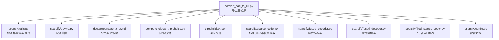
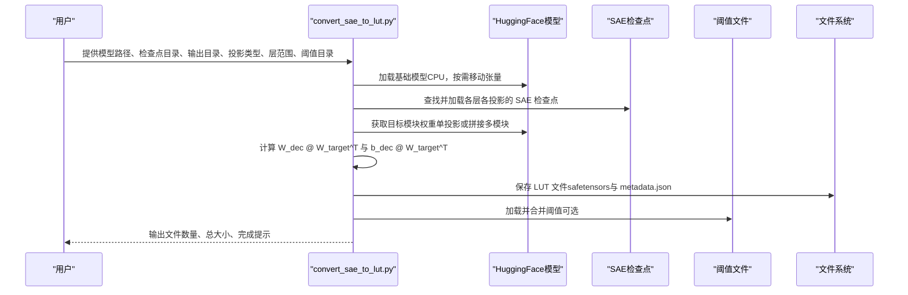
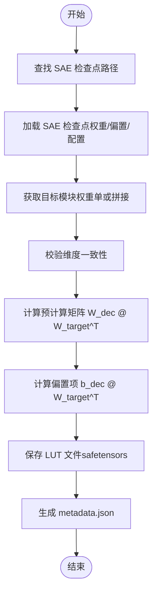
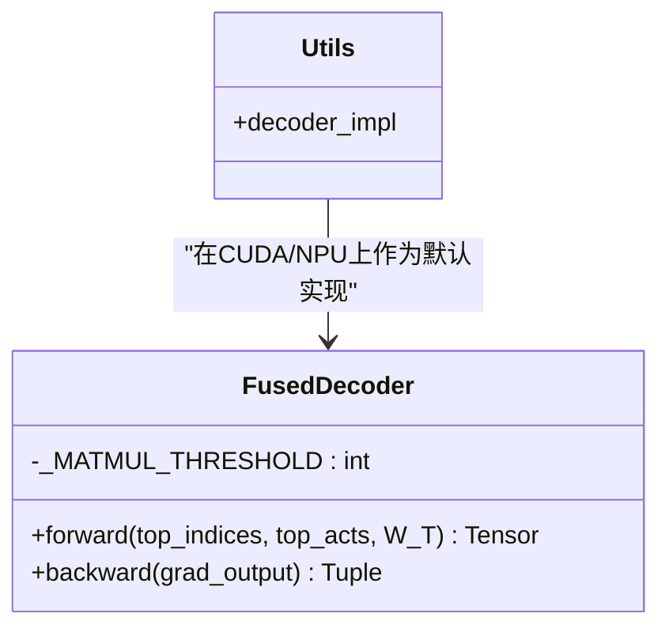
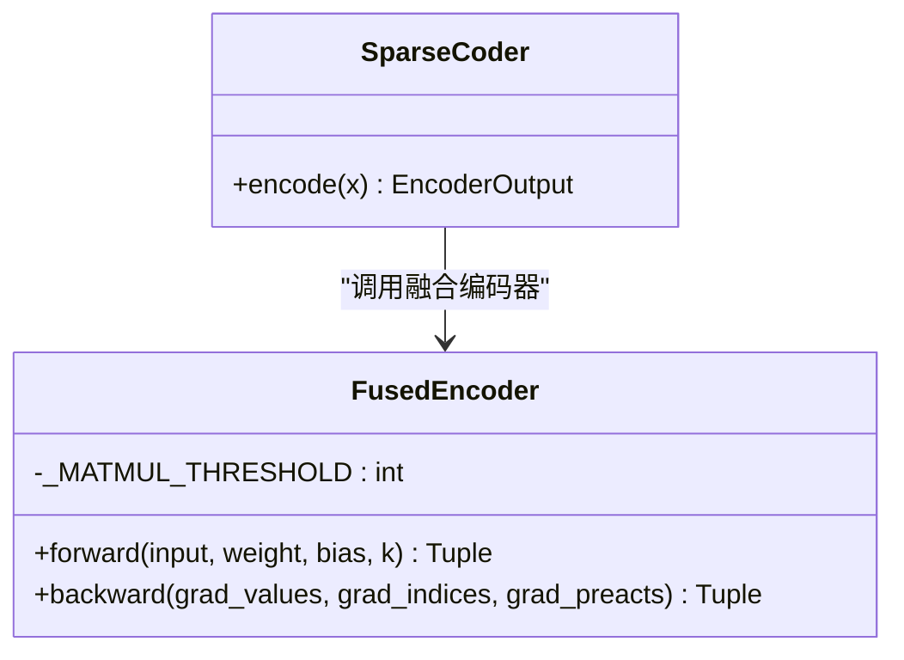
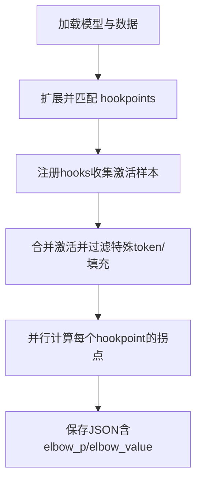
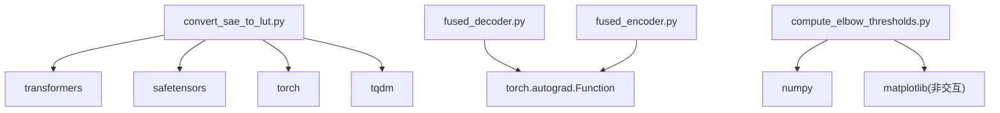

# LUT 导出

<cite>
**本文引用的文件**
- [convert_sae_to_lut.py](file://convert_sae_to_lut.py)
- [sae-to-lut.md](file://docs/export/sae-to-lut.md)
- [fused_encoder.py](file://sparsify/fused_encoder.py)
- [fused_decoder.py](file://sparsify/fused_decoder.py)
- [sparse_coder.py](file://sparsify/sparse_coder.py)
- [tiled_sparse_coder.py](file://sparsify/tiled_sparse_coder.py)
- [utils.py](file://sparsify/utils.py)
- [device.py](file://sparsify/device.py)
- [compute_elbow_thresholds.py](file://compute_elbow_thresholds.py)
- [config.py](file://sparsify/config.py)
- [README.md](file://README.md)
- [pyproject.toml](file://pyproject.toml)
- [thresholds_q.json](file://thresholds/Qwen3-0.6B/thresholds_q.json)
- [thresholds_o.json](file://thresholds/Qwen3-4B/thresholds_o.json)
- [test_decode.py](file://tests/test_decode.py)
- [test_encode.py](file://tests/test_encode.py)
</cite>

## 目录
1. [简介](#简介)
2. [项目结构](#项目结构)
3. [核心组件](#核心组件)
4. [架构总览](#架构总览)
5. [详细组件分析](#详细组件分析)
6. [依赖分析](#依赖分析)
7. [性能考虑](#性能考虑)
8. [故障排除指南](#故障排除指南)
9. [结论](#结论)
10. [附录](#附录)

## 简介
本文件面向 LUT 导出系统，聚焦从训练完成的稀疏自编码器（SAE）到 LUT（查找表）友好格式的转换流程。文档覆盖以下主题：
- 权重矩阵与偏置的预计算：如何将 SAE 解码器权重与目标模型权重进行矩阵乘积预计算，形成 LUT 表项
- 阈值文件生成与使用：通过拐点阈值（elbow thresholds）辅助下游补偿策略
- 资产格式规范：当前仓库约定的 LUT 文件命名、字段与元数据组织方式
- 融合解码器与编码器的设计原理与性能优化：在 CUDA/NPU 上以原生算子替代回退路径，提升吞吐与稳定性
- 导出工具的使用方法、参数配置与输出验证
- 性能基准测试、散粒噪声分析与优化效果评估
- 完整导出工作流程与故障排除指导

## 项目结构
围绕 LUT 导出的关键代码与文档如下：
- 导出脚本：convert_sae_to_lut.py
- 导出文档：docs/export/sae-to-lut.md
- 编码器/解码器融合实现：sparsify/fused_encoder.py、sparsify/fused_decoder.py
- SAE 核心实现：sparsify/sparse_coder.py、sparsify/tiled_sparse_coder.py
- 工具与设备抽象：sparsify/utils.py、sparsify/device.py
- 阈值计算：compute_elbow_thresholds.py
- 配置定义：sparsify/config.py
- 项目说明与安装：README.md、pyproject.toml
- 阈值样例：thresholds/Qwen3-0.6B/thresholds_q.json、thresholds/Qwen3-4B/thresholds_o.json
- 测试用例：tests/test_decode.py、tests/test_encode.py

**图表来源**
- [convert_sae_to_lut.py:604-783](file://convert_sae_to_lut.py#L604-L783)
- [utils.py:185-197](file://sparsify/utils.py#L185-L197)
- [device.py:34-64](file://sparsify/device.py#L34-L64)
- [sae-to-lut.md:1-103](file://docs/export/sae-to-lut.md#L1-L103)
- [compute_elbow_thresholds.py:364-659](file://compute_elbow_thresholds.py#L364-L659)
- [sparse_coder.py:121-152](file://sparsify/sparse_coder.py#L121-L152)
- [fused_encoder.py:21-107](file://sparsify/fused_encoder.py#L21-L107)
- [fused_decoder.py:27-107](file://sparsify/fused_decoder.py#L27-L107)
- [tiled_sparse_coder.py:17-342](file://sparsify/tiled_sparse_coder.py#L17-L342)
- [config.py:7-149](file://sparsify/config.py#L7-L149)

**章节来源**
- [README.md:1-154](file://README.md#L1-L154)
- [pyproject.toml:1-131](file://pyproject.toml#L1-L131)

## 核心组件
- 导出主程序：负责加载基础模型、遍历投影类型与层索引、定位 SAE 检查点、提取目标模型权重、计算预计算矩阵与偏置项、保存 LUT 文件与元数据
- 融合编码器/解码器：在 CUDA/NPU 上以原生算子替代回退路径，显著降低内核启动开销并提升吞吐
- 阈值统计：基于激活分布的 Kneedle 拐点法，输出 elbow_p 与 elbow_value，供下游补偿策略使用
- 设备与自动混合精度：统一设备选择与 bf16 自动混合精度装饰器，确保在不同硬件上的一致行为
- 配置与检查点：SAE 配置、瓦片 SAE 的块对角化与全局 top-k 优化、检查点读写

**章节来源**
- [convert_sae_to_lut.py:419-558](file://convert_sae_to_lut.py#L419-L558)
- [fused_encoder.py:21-107](file://sparsify/fused_encoder.py#L21-L107)
- [fused_decoder.py:27-107](file://sparsify/fused_decoder.py#L27-L107)
- [compute_elbow_thresholds.py:35-96](file://compute_elbow_thresholds.py#L35-L96)
- [utils.py:185-197](file://sparsify/utils.py#L185-L197)
- [config.py:7-149](file://sparsify/config.py#L7-L149)

## 架构总览
下图展示从训练完成的 SAE 到 LUT 输出的端到端流程。

**图表来源**
- [convert_sae_to_lut.py:604-783](file://convert_sae_to_lut.py#L604-L783)
- [sae-to-lut.md:11-84](file://docs/export/sae-to-lut.md#L11-L84)

## 详细组件分析

### 导出主程序（convert_sae_to_lut.py）
- 功能要点
  - 解析层范围与投影类型，支持单投影与融合投影（如 qkv、gate_up）
  - 自动检测可用层索引，兼容嵌套与扁平检查点布局
  - 从 SAE 检查点读取 encoder_weight/bias、decoder_weight/bias 与配置
  - 从基础模型提取目标权重（单模块或拼接多模块），校验维度一致性
  - 计算预计算矩阵与偏置项，支持批处理以控制显存占用
  - 保存 LUT 文件（safetensors）与 metadata.json（版本、模型配置、每层信息、阈值、创建信息）

- 关键流程图（单层处理）

**图表来源**
- [convert_sae_to_lut.py:419-558](file://convert_sae_to_lut.py#L419-L558)
- [convert_sae_to_lut.py:249-308](file://convert_sae_to_lut.py#L249-L308)
- [convert_sae_to_lut.py:310-334](file://convert_sae_to_lut.py#L310-L334)
- [convert_sae_to_lut.py:367-417](file://convert_sae_to_lut.py#L367-L417)

**章节来源**
- [convert_sae_to_lut.py:80-104](file://convert_sae_to_lut.py#L80-L104)
- [convert_sae_to_lut.py:106-151](file://convert_sae_to_lut.py#L106-L151)
- [convert_sae_to_lut.py:153-184](file://convert_sae_to_lut.py#L153-L184)
- [convert_sae_to_lut.py:186-247](file://convert_sae_to_lut.py#L186-L247)
- [convert_sae_to_lut.py:249-308](file://convert_sae_to_lut.py#L249-L308)
- [convert_sae_to_lut.py:310-334](file://convert_sae_to_lut.py#L310-L334)
- [convert_sae_to_lut.py:336-365](file://convert_sae_to_lut.py#L336-L365)
- [convert_sae_to_lut.py:367-417](file://convert_sae_to_lut.py#L367-L417)
- [convert_sae_to_lut.py:419-558](file://convert_sae_to_lut.py#L419-L558)
- [convert_sae_to_lut.py:560-602](file://convert_sae_to_lut.py#L560-L602)
- [convert_sae_to_lut.py:604-783](file://convert_sae_to_lut.py#L604-L783)

### 融合解码器（fused_decoder.py）
- 设计原理
  - 在 CUDA/NPU 上以原生密集矩阵乘法替代 embedding_bag 的回退路径，减少内核切换与数据搬运
  - 前向：构建稀疏系数矩阵后进行稠密矩阵乘法；当 N*M 超过阈值时回退到 embedding_bag
  - 反向：根据内存阈值选择稠密梯度计算或向量化 gather/index_add_ 路径
- 性能优化
  - 阈值控制（默认约 256MB）平衡内存与吞吐
  - bf16 自动混合精度装饰器在支持的设备上启用，提升吞吐

**图表来源**
- [fused_decoder.py:27-107](file://sparsify/fused_decoder.py#L27-L107)
- [utils.py:185-197](file://sparsify/utils.py#L185-L197)

**章节来源**
- [fused_decoder.py:1-18](file://sparsify/fused_decoder.py#L1-L18)
- [fused_decoder.py:27-107](file://sparsify/fused_decoder.py#L27-L107)
- [utils.py:185-197](file://sparsify/utils.py#L185-L197)

### 融合编码器（fused_encoder.py）
- 设计原理
  - 将线性层 + ReLU + top-k 与反向梯度计算融合，使用 scatter-add + 稠密 matmul 替代 gather + bmm
  - 内存阈值控制在 N*M 超限时回退到向量化路径
- 性能优化
  - 显著降低小批量场景下的内核启动开销
  - 保持与标准实现一致的数值与梯度

**图表来源**
- [fused_encoder.py:21-107](file://sparsify/fused_encoder.py#L21-L107)
- [sparse_coder.py:176-180](file://sparsify/sparse_coder.py#L176-L180)

**章节来源**
- [fused_encoder.py:1-18](file://sparsify/fused_encoder.py#L1-L18)
- [fused_encoder.py:21-107](file://sparsify/fused_encoder.py#L21-L107)
- [sparse_coder.py:176-180](file://sparsify/sparse_coder.py#L176-L180)

### 阈值统计（compute_elbow_thresholds.py）
- 功能要点
  - 通过 hooks 捕获模块输入激活，构建绝对值分位数曲线
  - 使用 Kneedle 风格算法寻找“拐点”，输出 elbow_p 与 elbow_value
  - 支持并行计算多个 hookpoint 的拐点，可选保存可视化图
- 输出格式
  - JSON 文件，键为 "layer_i/module_op"，值包含 elbow_p 与 elbow_value

**图表来源**
- [compute_elbow_thresholds.py:364-659](file://compute_elbow_thresholds.py#L364-L659)
- [compute_elbow_thresholds.py:35-96](file://compute_elbow_thresholds.py#L35-L96)

**章节来源**
- [compute_elbow_thresholds.py:1-660](file://compute_elbow_thresholds.py#L1-L660)
- [thresholds_q.json:1-114](file://thresholds/Qwen3-0.6B/thresholds_q.json#L1-L114)
- [thresholds_o.json:1-146](file://thresholds/Qwen3-4B/thresholds_o.json#L1-L146)

### 设备与自动混合精度（device.py、utils.py）
- 设备抽象
  - 统一 CUDA/NPU/CPU 的设备选择、bf16 支持检测、事件与同步封装
- 自动混合精度
  - device_autocast 装饰器在支持的设备上启用 bf16，提升吞吐

**章节来源**
- [device.py:34-118](file://sparsify/device.py#L34-L118)
- [utils.py:101-117](file://sparsify/utils.py#L101-L117)

### 配置与检查点（config.py、sparse_coder.py）
- 配置
  - SparseCoderConfig：expansion_factor、num_latents、k、normalize_decoder 等
  - TrainConfig：训练生命周期、瓦片与全局 top-k、Hadamard 预处理等
- 检查点
  - 支持从磁盘/Hub 加载，读取 cfg.json 与 sae.safetensors

**章节来源**
- [config.py:7-149](file://sparsify/config.py#L7-L149)
- [sparse_coder.py:121-152](file://sparsify/sparse_coder.py#L121-L152)

## 依赖分析
- 导出脚本依赖
  - HuggingFace Transformers：加载基础模型与提取模块权重
  - safetensors：读写检查点与 LUT 文件
  - tqdm：进度条
  - torch：张量运算与设备管理
- 融合实现依赖
  - torch.autograd.Function：自定义前向/反向
  - torch.scatter_add_/gather/index_add_：稀疏系数矩阵构造与梯度累积
- 阈值统计依赖
  - matplotlib（非交互式后端）：可选绘图
  - numpy：分位数与统计计算

**图表来源**
- [convert_sae_to_lut.py:17-30](file://convert_sae_to_lut.py#L17-L30)
- [fused_decoder.py:20-22](file://sparsify/fused_decoder.py#L20-L22)
- [fused_encoder.py:3-5](file://sparsify/fused_encoder.py#L3-L5)
- [compute_elbow_thresholds.py:18-34](file://compute_elbow_thresholds.py#L18-L34)

**章节来源**
- [pyproject.toml:12-28](file://pyproject.toml#L12-L28)

## 性能考虑
- 内存与吞吐权衡
  - 融合算子通过阈值控制在稠密 matmul 与回退路径间切换，避免 OOM 并提升吞吐
  - 导出阶段支持批处理计算预计算矩阵，缓解显存压力
- 自动混合精度
  - 在支持的设备上启用 bf16，显著提升吞吐；测试用例验证了混合精度下的数值稳定性
- 瓦片 SAE（可选）
  - 将隐藏维切分为 T 块，独立训练 SAE 并在全局 top-k 下进行块对角化解码，进一步降低计算与通信开销

**章节来源**
- [fused_decoder.py:24-24](file://sparsify/fused_decoder.py#L24-L24)
- [fused_encoder.py:18-18](file://sparsify/fused_encoder.py#L18-L18)
- [utils.py:101-117](file://sparsify/utils.py#L101-L117)
- [tiled_sparse_coder.py:204-253](file://sparsify/tiled_sparse_coder.py#L204-L253)
- [test_decode.py:58-77](file://tests/test_decode.py#L58-L77)
- [test_encode.py:9-61](file://tests/test_encode.py#L9-L61)

## 故障排除指南
- 检查点未找到
  - 确认检查点目录命名符合 “*-qproj”、“*-oproj”、“*-upproj” 等模式
  - 若采用嵌套布局，确保路径为 best/<checkpoint_name>/<checkpoint_name>/sae.safetensors 或 best/<checkpoint_name>/sae.safetensors
- 维度不匹配
  - SAE 的 decoder_weight 列数需与目标模块权重的列数一致
- 设备与 dtype
  - 确保导出脚本使用的设备与 bf16 支持情况与训练一致
  - 如需更高精度，可调整输出 dtype（float32/bfloat16/float16）
- 阈值文件
  - 阈值文件名需与导出映射一致（如 thresholds_q.json 对应 qproj）
- 性能问题
  - 启用 batch_compute 以降低显存峰值
  - 在 CUDA/NPU 上确认使用融合解码器（默认行为）

**章节来源**
- [convert_sae_to_lut.py:560-602](file://convert_sae_to_lut.py#L560-L602)
- [convert_sae_to_lut.py:498-504](file://convert_sae_to_lut.py#L498-L504)
- [convert_sae_to_lut.py:648-654](file://convert_sae_to_lut.py#L648-L654)
- [sae-to-lut.md:98-103](file://docs/export/sae-to-lut.md#L98-L103)

## 结论
本导出系统将训练完成的 SAE 与目标模型权重进行预计算整合，形成 LUT 友好的资产，配合阈值统计文件，为下游 LUTurbo 推理提供高效、稳定的基础设施。融合编码器/解码器在 CUDA/NPU 上以原生算子替代回退路径，显著提升性能；瓦片 SAE 进一步优化大规模模型的计算与通信。通过严格的参数配置与输出验证流程，可确保导出质量与一致性。

## 附录

### 使用方法与参数说明
- 基本用法
  - 指定基础模型路径、检查点基目录、输出目录
  - 选择投影类型（支持 qproj、oproj、upproj、kproj、vproj、qkv、gate_up）
  - 指定层范围（如 "0-27" 或 "0-5,10"），或自动检测
  - 可选阈值目录与输出 dtype（float16/bfloat16/float32）、设备（自动检测）、批处理开关
- 示例命令
  - 基础：导出融合投影与输出模块
  - 指定阈值与层范围：结合阈值文件与特定层
  - 单投影：仅导出 qproj/oproj/upproj

**章节来源**
- [convert_sae_to_lut.py:604-627](file://convert_sae_to_lut.py#L604-L627)

### 资产格式规范
- LUT 文件
  - 存储字段：encoder_weight、encoder_bias、decoder_weight、decoder_bias、precomputed_products、bias_product
  - 保存格式：safetensors
  - 文件命名：layers.<layer>.<module>.<proj>.lut.safetensors
- 元数据文件（metadata.json）
  - 字段：version、sae_config（num_basis、k_active）、model_config（model_type、num_layers、num_attention_heads、hidden_size）、layers（每层 input_dim/output_dim/file/sae_config）、elbow_thresholds、creation_info（created_at/source_model/script_version）

**章节来源**
- [convert_sae_to_lut.py:310-334](file://convert_sae_to_lut.py#L310-L334)
- [convert_sae_to_lut.py:367-417](file://convert_sae_to_lut.py#L367-L417)
- [sae-to-lut.md:51-66](file://docs/export/sae-to-lut.md#L51-L66)

### 阈值文件格式
- 键：layer_<i>/<module_op>（如 layer_0/self_attn_q_proj）
- 值：elbow_p、elbow_value
- 用途：下游补偿策略与误差评估

**章节来源**
- [thresholds_q.json:1-114](file://thresholds/Qwen3-0.6B/thresholds_q.json#L1-L114)
- [thresholds_o.json:1-146](file://thresholds/Qwen3-4B/thresholds_o.json#L1-L146)

### 性能基准与散粒噪声分析
- 基准测试
  - 可参考测试用例中的时间测量与数值一致性验证，评估融合编码器/解码器在不同规模下的性能
- 散粒噪声
  - 阈值统计可用于估计激活分布的尾部特性，辅助设计补偿策略与误差上限

**章节来源**
- [test_encode.py:22-53](file://tests/test_encode.py#L22-L53)
- [test_decode.py:16-32](file://tests/test_decode.py#L16-L32)
- [compute_elbow_thresholds.py:35-96](file://compute_elbow_thresholds.py#L35-L96)