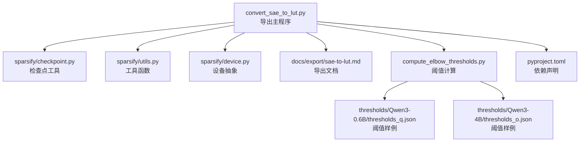
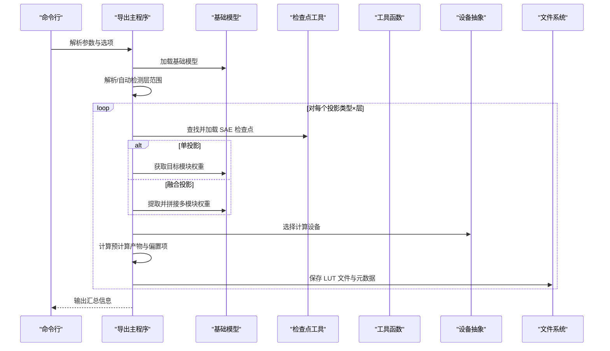
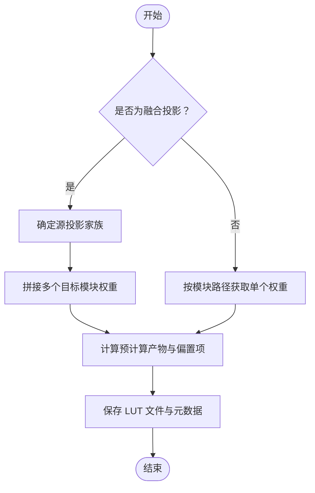
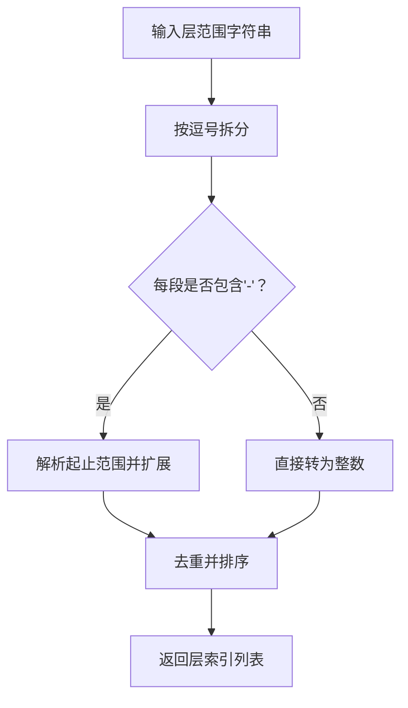
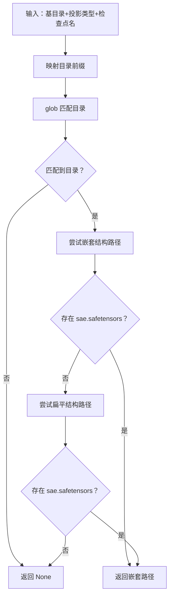
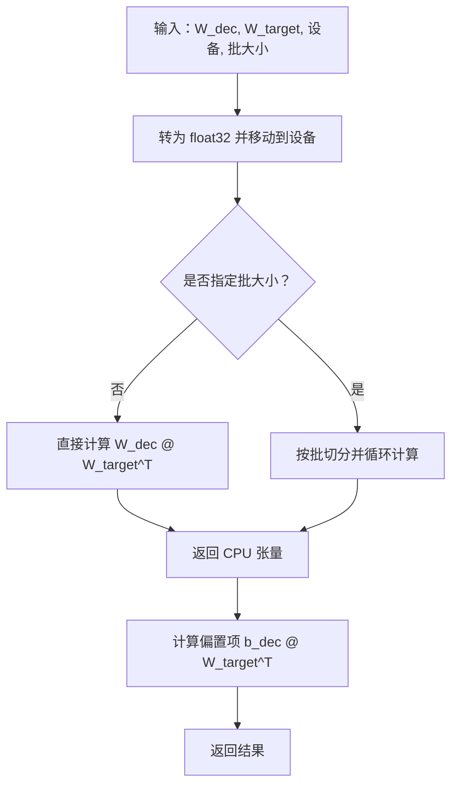
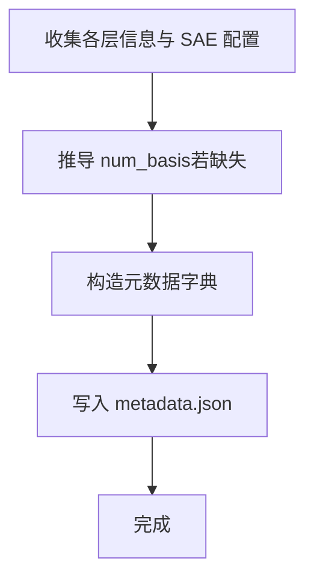
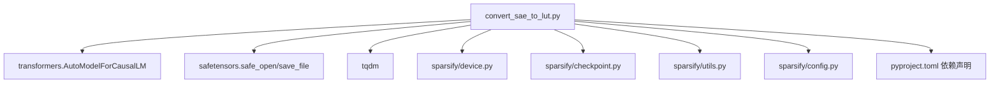

# 导出工作流程

<cite>
**本文引用的文件**
- [convert_sae_to_lut.py](file://convert_sae_to_lut.py)
- [sae-to-lut.md](file://docs/export/sae-to-lut.md)
- [compute_elbow_thresholds.py](file://compute_elbow_thresholds.py)
- [thresholds_q.json](file://thresholds/Qwen3-0.6B/thresholds_q.json)
- [thresholds_o.json](file://thresholds/Qwen3-4B/thresholds_o.json)
- [checkpoint.py](file://sparsify/checkpoint.py)
- [utils.py](file://sparsify/utils.py)
- [device.py](file://sparsify/device.py)
- [config.py](file://sparsify/config.py)
- [pyproject.toml](file://pyproject.toml)
</cite>

## 目录
1. [简介](#简介)
2. [项目结构](#项目结构)
3. [核心组件](#核心组件)
4. [架构总览](#架构总览)
5. [详细组件分析](#详细组件分析)
6. [依赖关系分析](#依赖关系分析)
7. [性能考量](#性能考量)
8. [故障排除指南](#故障排除指南)
9. [结论](#结论)
10. [附录](#附录)

## 简介
本文件面向 LUT 导出工作流程，系统性阐述从训练好的 SAE 检查点到 LUT 文件的完整转换过程。重点覆盖：
- 单投影与融合投影的处理差异（qproj、oproj、upproj、kproj、vproj、qkv、gate_up）
- 层范围解析、检查点路径查找、权重矩阵计算
- 命令行使用示例与参数说明
- 错误处理机制与常见问题排查

该流程旨在将 SAE 解码器权重与目标模型权重预计算组合，形成可直接用于推理的查找表（LUT），以降低在线推理时的计算开销。

## 项目结构
围绕导出脚本的关键文件与职责如下：
- 导出主程序：convert_sae_to_lut.py
- 文档说明：docs/export/sae-to-lut.md
- 阈值计算工具：compute_elbow_thresholds.py
- 阈值样例：thresholds/Qwen3-0.6B/thresholds_q.json、thresholds/Qwen3-4B/thresholds_o.json
- 训练/检查点工具：sparsify/checkpoint.py
- 工具函数：sparsify/utils.py
- 设备抽象：sparsify/device.py
- 配置定义：sparsify/config.py
- 项目依赖：pyproject.toml

图表来源
- [convert_sae_to_lut.py:1-783](file://convert_sae_to_lut.py#L1-L783)
- [checkpoint.py:1-302](file://sparsify/checkpoint.py#L1-L302)
- [utils.py:1-227](file://sparsify/utils.py#L1-L227)
- [device.py:1-118](file://sparsify/device.py#L1-L118)
- [sae-to-lut.md:1-103](file://docs/export/sae-to-lut.md#L1-L103)
- [compute_elbow_thresholds.py:1-660](file://compute_elbow_thresholds.py#L1-L660)
- [thresholds_q.json:1-114](file://thresholds/Qwen3-0.6B/thresholds_q.json#L1-L114)
- [thresholds_o.json:1-146](file://thresholds/Qwen3-4B/thresholds_o.json#L1-L146)
- [pyproject.toml:1-131](file://pyproject.toml#L1-L131)

章节来源
- [convert_sae_to_lut.py:1-783](file://convert_sae_to_lut.py#L1-L783)
- [sae-to-lut.md:1-103](file://docs/export/sae-to-lut.md#L1-L103)

## 核心组件
- 导出主程序：负责解析参数、加载基础模型、扫描/解析层范围、查找并加载 SAE 检查点、提取目标模块权重、计算预计算产物、保存 LUT 文件与元数据。
- 阈值工具：用于生成用于下游补偿的拐点阈值文件，供导出脚本读取并写入元数据。
- 检查点工具：提供 SAE 检查点加载能力（常规与分块），为导出脚本提供兼容性保障。
- 工具函数：提供设备类型判断、张量维度解析、前向截断等辅助能力。
- 设备抽象：统一 CUDA/NPU/CPU 的设备选择与同步，确保导出在可用加速器上高效运行。
- 配置定义：定义训练配置与导出所需的基础参数（如扩展因子、隐状态维等）。

章节来源
- [convert_sae_to_lut.py:604-783](file://convert_sae_to_lut.py#L604-L783)
- [compute_elbow_thresholds.py:364-660](file://compute_elbow_thresholds.py#L364-L660)
- [checkpoint.py:44-73](file://sparsify/checkpoint.py#L44-L73)
- [utils.py:1-227](file://sparsify/utils.py#L1-L227)
- [device.py:1-118](file://sparsify/device.py#L1-L118)
- [config.py:1-149](file://sparsify/config.py#L1-L149)

## 架构总览
下图展示从 SAE 检查点到 LUT 文件的端到端流程，包括单投影与融合投影两种路径。

图表来源
- [convert_sae_to_lut.py:604-783](file://convert_sae_to_lut.py#L604-L783)
- [checkpoint.py:44-73](file://sparsify/checkpoint.py#L44-L73)
- [device.py:34-64](file://sparsify/device.py#L34-L64)

## 详细组件分析

### 单投影与融合投影处理
- 单投影：对每个层独立处理，使用对应模块路径提取权重，如 qproj、oproj、upproj、kproj、vproj。
- 融合投影：以某一投影家族作为“源”，拼接多个目标模块权重，输出单一 LUT 文件，如 qkv（拼接 q/k/v）、gate_up（拼接 gate/up）。

图表来源
- [convert_sae_to_lut.py:419-558](file://convert_sae_to_lut.py#L419-L558)
- [convert_sae_to_lut.py:208-247](file://convert_sae_to_lut.py#L208-L247)

章节来源
- [convert_sae_to_lut.py:41-53](file://convert_sae_to_lut.py#L41-L53)
- [convert_sae_to_lut.py:419-558](file://convert_sae_to_lut.py#L419-L558)
- [convert_sae_to_lut.py:208-247](file://convert_sae_to_lut.py#L208-L247)

### 层范围解析
- 支持“起止-闭区间”与“逗号分隔列表”的混合语法，例如“0-27”、“0-5,10,15”。
- 自动检测：若未显式提供层范围，脚本会根据首个投影类型扫描检查点目录，自动提取可用层索引。

图表来源
- [convert_sae_to_lut.py:80-104](file://convert_sae_to_lut.py#L80-L104)
- [convert_sae_to_lut.py:560-602](file://convert_sae_to_lut.py#L560-L602)

章节来源
- [convert_sae_to_lut.py:80-104](file://convert_sae_to_lut.py#L80-L104)
- [convert_sae_to_lut.py:560-602](file://convert_sae_to_lut.py#L560-L602)

### 检查点路径查找
- 支持两类目录风格：嵌套（best/{checkpoint_name}/{checkpoint_name}/sae.safetensors）与扁平（best/{checkpoint_name}/sae.safetensors）。
- 通过投影类型映射到目录前缀（如“*-qproj”），定位具体检查点目录后进行路径匹配与验证。

图表来源
- [convert_sae_to_lut.py:106-151](file://convert_sae_to_lut.py#L106-L151)

章节来源
- [convert_sae_to_lut.py:106-151](file://convert_sae_to_lut.py#L106-L151)

### 权重矩阵计算
- 预计算产物：W_dec @ W_target^T，其中 W_dec 来自 SAE 检查点，W_target 来自目标模块权重。
- 偏置项：b_dec @ W_target^T。
- 内存优化：支持按批计算，避免一次性占用过多显存。

图表来源
- [convert_sae_to_lut.py:249-285](file://convert_sae_to_lut.py#L249-L285)
- [convert_sae_to_lut.py:287-308](file://convert_sae_to_lut.py#L287-L308)

章节来源
- [convert_sae_to_lut.py:249-285](file://convert_sae_to_lut.py#L249-L285)
- [convert_sae_to_lut.py:287-308](file://convert_sae_to_lut.py#L287-L308)

### 元数据生成与保存
- 元数据包含版本、SAE 配置（num_basis、k_active）、模型配置（层数、注意力头数、隐藏维）、各层信息（输入/输出维度、文件名、模块路径、SAE 配置）以及阈值信息。
- 保存为 metadata.json，便于下游推理阶段读取。

图表来源
- [convert_sae_to_lut.py:367-417](file://convert_sae_to_lut.py#L367-L417)

章节来源
- [convert_sae_to_lut.py:367-417](file://convert_sae_to_lut.py#L367-L417)

### 命令行使用与参数说明
- 必选参数
  - model_path：基础模型路径
  - checkpoint_base_dir：SAE 检查点基目录
- 可选参数
  - output_dir：输出目录，默认 "./lut_output"
  - proj_types：投影类型列表，支持 qproj、oproj、upproj、kproj、vproj、qkv、gate_up，默认 ["qkv", "oproj", "gate_up"]
  - layers：层范围字符串，如 "0-27" 或 "0-5,10"；未提供则自动检测
  - threshold_dir：阈值文件目录（可选）
  - dtype：输出 dtype，支持 float16、bfloat16、float32，默认 bfloat16
  - device：计算设备，默认自动检测可用加速器
  - batch_compute：启用批计算以提升内存效率

章节来源
- [convert_sae_to_lut.py:604-656](file://convert_sae_to_lut.py#L604-L656)

### 阈值文件与补偿
- 阈值由 compute_elbow_thresholds.py 计算并保存为 JSON，键名采用“layer_{i}/{op}”格式。
- 导出脚本按映射表加载对应阈值文件，并写入元数据，用于下游补偿策略。

章节来源
- [compute_elbow_thresholds.py:364-660](file://compute_elbow_thresholds.py#L364-L660)
- [convert_sae_to_lut.py:71-77](file://convert_sae_to_lut.py#L71-L77)
- [thresholds_q.json:1-114](file://thresholds/Qwen3-0.6B/thresholds_q.json#L1-L114)
- [thresholds_o.json:1-146](file://thresholds/Qwen3-4B/thresholds_o.json#L1-L146)

## 依赖关系分析
- 导出脚本依赖于 Transformers 加载基础模型、safetensors 读取检查点、tqdm 进度条、HuggingFace 模型子模块访问。
- 设备抽象层屏蔽 CUDA/NPU/CPU 的差异，确保在不同硬件上一致行为。
- 配置与工具模块为导出提供参数校验与辅助能力。

图表来源
- [convert_sae_to_lut.py:17-29](file://convert_sae_to_lut.py#L17-L29)
- [device.py:1-118](file://sparsify/device.py#L1-L118)
- [checkpoint.py:1-302](file://sparsify/checkpoint.py#L1-L302)
- [utils.py:1-227](file://sparsify/utils.py#L1-L227)
- [config.py:1-149](file://sparsify/config.py#L1-L149)
- [pyproject.toml:12-28](file://pyproject.toml#L12-L28)

章节来源
- [convert_sae_to_lut.py:17-29](file://convert_sae_to_lut.py#L17-L29)
- [pyproject.toml:12-28](file://pyproject.toml#L12-L28)

## 性能考量
- 批计算：当启用批计算时，按批大小切分 SAE 基础维度，减少显存峰值，适合大容量 SAE。
- 设备选择：优先使用可用加速器（CUDA/NPU），在 CPU 上导出会较慢。
- dtype 选择：bfloat16 在支持的硬件上可兼顾精度与存储；float16 可进一步减小体积但需注意数值稳定性。
- I/O 优化：批量保存 LUT 文件，减少磁盘写入次数；元数据集中写入一次。

章节来源
- [convert_sae_to_lut.py:507-516](file://convert_sae_to_lut.py#L507-L516)
- [convert_sae_to_lut.py:700-706](file://convert_sae_to_lut.py#L700-L706)
- [device.py:53-64](file://sparsify/device.py#L53-L64)

## 故障排除指南
- 检查点未找到
  - 现象：打印警告并跳过该层
  - 排查：确认投影类型与检查点命名前缀一致；检查嵌套/扁平目录结构是否存在 sae.safetensors
- 模型权重属性缺失
  - 现象：抛出异常提示模块无 weight 属性
  - 排查：确认模块路径正确且目标模块具备 weight 属性
- 维度不匹配
  - 现象：打印维度不匹配错误
  - 排查：确保 SAE 的 d_in 与目标模块的输入特征数一致
- 计算失败
  - 现象：计算预计算产物或偏置项时报错
  - 排查：检查设备可用性、dtype 设置、批大小设置；必要时禁用批计算
- 自动检测失败
  - 现象：未检测到任何层
  - 排查：确认检查点目录命名符合“*-qproj/oproj/upproj”等约定；检查 best 子目录结构

章节来源
- [convert_sae_to_lut.py:474-478](file://convert_sae_to_lut.py#L474-L478)
- [convert_sae_to_lut.py:494-496](file://convert_sae_to_lut.py#L494-L496)
- [convert_sae_to_lut.py:501-503](file://convert_sae_to_lut.py#L501-L503)
- [convert_sae_to_lut.py:514-516](file://convert_sae_to_lut.py#L514-L516)
- [convert_sae_to_lut.py:681-686](file://convert_sae_to_lut.py#L681-L686)

## 结论
本导出工作流程将训练好的 SAE 与目标模型权重进行预计算组合，生成 LUT 文件与元数据，为下游推理提供高效、稳定的查找表。通过单投影与融合投影的灵活适配、完善的层范围解析与检查点路径查找、以及批计算与设备抽象等优化，能够在不同规模与硬件环境下稳定运行。配合阈值文件，可进一步完善下游补偿策略，提升推理质量。

## 附录
- 常见命令示例
  - 基本使用（融合投影）：python convert_sae_to_lut.py /root/models/Qwen3-0.6B /root/sparsify/checkpoints --output_dir /root/sparsify/lut_tables
  - 指定投影与层范围：python convert_sae_to_lut.py /root/models/Qwen3-0.6B /root/sparsify/checkpoints --output_dir ./lut_output --proj_types qkv gate_up oproj --layers 0-5,10 --threshold_dir /root/sparsify/thresholds/Qwen3-0.6B --dtype bfloat16
  - 单投影导出：python convert_sae_to_lut.py /root/models/Qwen3-0.6B /root/sparsify/checkpoints --output_dir ./lut_output --proj_types qproj oproj upproj --layers 0-27

章节来源
- [convert_sae_to_lut.py:609-627](file://convert_sae_to_lut.py#L609-L627)