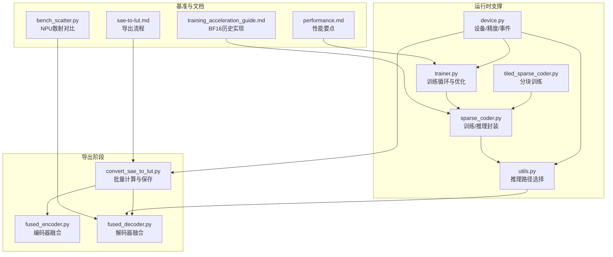
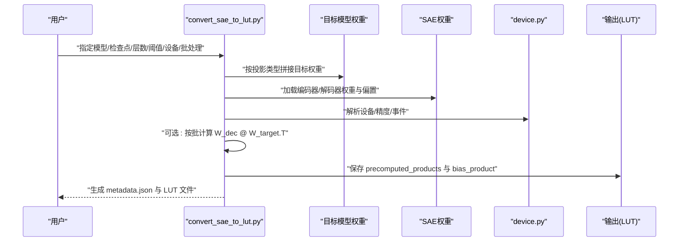
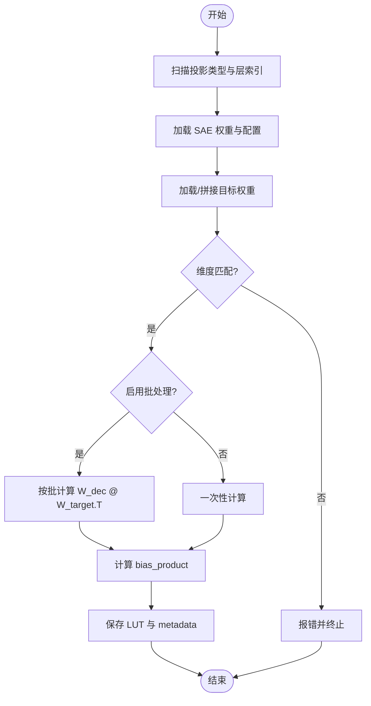
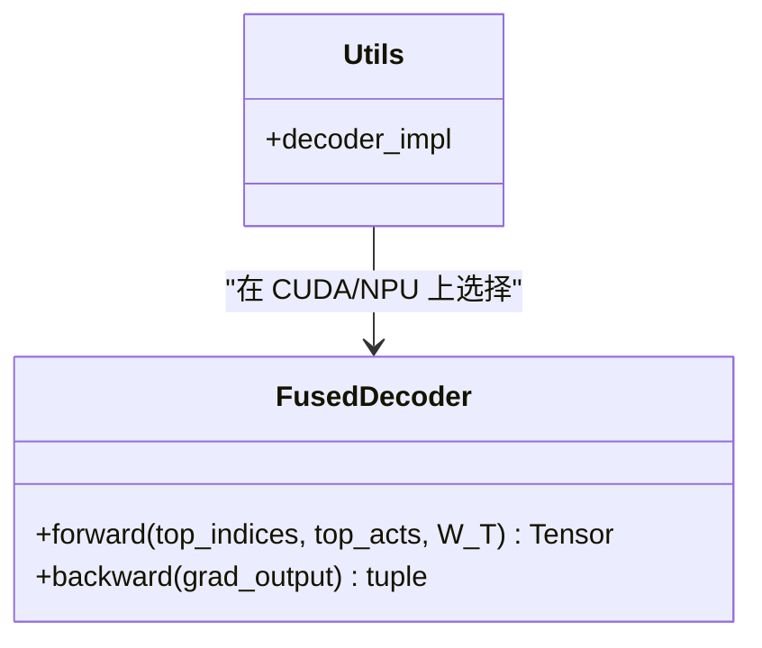
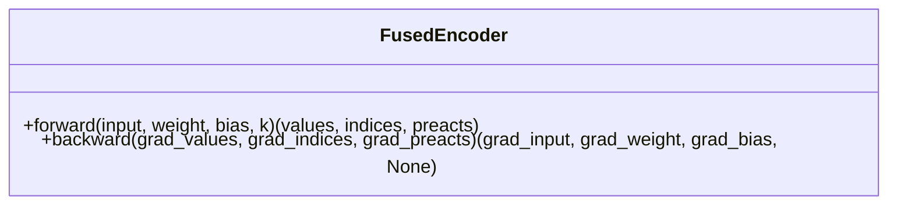
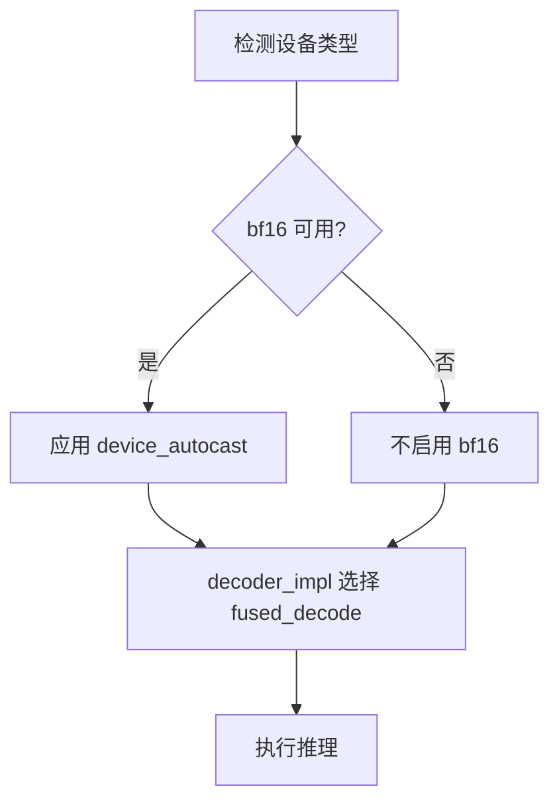
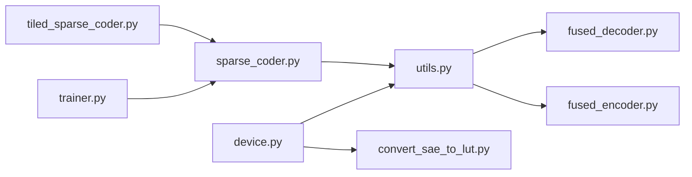

# 性能优化

<cite>
**本文引用的文件**
- [convert_sae_to_lut.py](file://convert_sae_to_lut.py)
- [fused_encoder.py](file://sparsify/fused_encoder.py)
- [fused_decoder.py](file://sparsify/fused_decoder.py)
- [device.py](file://sparsify/device.py)
- [utils.py](file://sparsify/utils.py)
- [sparse_coder.py](file://sparsify/sparse_coder.py)
- [tiled_sparse_coder.py](file://sparsify/tiled_sparse_coder.py)
- [trainer.py](file://sparsify/trainer.py)
- [bench_scatter.py](file://benchmarks/bench_scatter.py)
- [performance.md](file://docs/architecture/performance.md)
- [sae-to-lut.md](file://docs/export/sae-to-lut.md)
- [training_acceleration_guide.md](file://docs/archive/legacy/training_acceleration_guide.md)
</cite>

## 目录
1. [简介](#简介)
2. [项目结构](#项目结构)
3. [核心组件](#核心组件)
4. [架构总览](#架构总览)
5. [详细组件分析](#详细组件分析)
6. [依赖分析](#依赖分析)
7. [性能考量](#性能考量)
8. [故障排查指南](#故障排查指南)
9. [结论](#结论)
10. [附录](#附录)

## 简介
本文件聚焦于 LUT 导出阶段的性能优化，系统阐述批量计算机制与内存管理策略、设备选择与加速器利用（CUDA/NPU）、融合解码器与编码器设计原理、权重矩阵融合以降低在线推理成本，并提供基准测试方法、数据类型影响分析与大模型处理最佳实践。

## 项目结构
围绕 LUT 导出与性能优化的关键模块如下：
- 导出脚本：负责加载 SAE 权重与目标层权重，预计算 W_dec @ W_target.T 并保存为 LUT 文件
- 融合编码器/解码器：在 CUDA/NPU 上提供原生算子路径，避免 CPU 回退
- 设备抽象层：统一 CUDA/NPU 检测、bf16 支持、事件计时与分布式后端
- 推理路径适配：根据设备类型选择 fused_decode 或回退实现
- 训练侧优化：早停前向、编译融合、张量核精度设置、Tile SAE 等
- 基准工具：针对 NPU 的散射替代方案与计时模式验证

图表来源
- [convert_sae_to_lut.py](file://convert_sae_to_lut.py)
- [fused_encoder.py](file://sparsify/fused_encoder.py)
- [fused_decoder.py](file://sparsify/fused_decoder.py)
- [device.py](file://sparsify/device.py)
- [utils.py](file://sparsify/utils.py)
- [sparse_coder.py](file://sparsify/sparse_coder.py)
- [tiled_sparse_coder.py](file://sparsify/tiled_sparse_coder.py)
- [trainer.py](file://sparsify/trainer.py)
- [bench_scatter.py](file://benchmarks/bench_scatter.py)
- [performance.md](file://docs/architecture/performance.md)
- [sae-to-lut.md](file://docs/export/sae-to-lut.md)
- [training_acceleration_guide.md](file://docs/archive/legacy/training_acceleration_guide.md)

章节来源
- [convert_sae_to_lut.py](file://convert_sae_to_lut.py)
- [fused_encoder.py](file://sparsify/fused_encoder.py)
- [fused_decoder.py](file://sparsify/fused_decoder.py)
- [device.py](file://sparsify/device.py)
- [utils.py](file://sparsify/utils.py)
- [sparse_coder.py](file://sparsify/sparse_coder.py)
- [tiled_sparse_coder.py](file://sparsify/tiled_sparse_coder.py)
- [trainer.py](file://sparsify/trainer.py)
- [bench_scatter.py](file://benchmarks/bench_scatter.py)
- [performance.md](file://docs/architecture/performance.md)
- [sae-to-lut.md](file://docs/export/sae-to-lut.md)
- [training_acceleration_guide.md](file://docs/archive/legacy/training_acceleration_guide.md)

## 核心组件
- 批量计算与内存管理
  - 导出脚本提供 batch_compute 参数，按批处理 W_dec @ W_target.T，避免一次性构造超大密集中间矩阵
  - 内存阈值常量用于在稠密散射+矩阵乘与回退路径之间切换，平衡吞吐与显存占用
- 设备选择与加速器利用
  - 自动检测 CUDA/NPU 可用性，统一 bf16 支持、事件计时与分布式后端
  - 推理路径根据设备类型选择 fused_decode 或回退实现
- 融合解码器与编码器
  - 编码器：top-k 与线性层融合，反向采用散射+矩阵乘或回退
  - 解码器：embedding_bag 替换为自定义 autograd，避免 NPU CPU 回退
- 权重矩阵融合
  - 导出阶段预计算 W_dec @ W_target.T，推理时以查表+稀疏选择替代在线矩阵乘
- 基准测试与性能文档
  - 提供 NPU 下散射替代方案与三种计时模式，验证不同实现的端到端性能

章节来源
- [convert_sae_to_lut.py](file://convert_sae_to_lut.py)
- [fused_encoder.py](file://sparsify/fused_encoder.py)
- [fused_decoder.py](file://sparsify/fused_decoder.py)
- [device.py](file://sparsify/device.py)
- [utils.py](file://sparsify/utils.py)
- [bench_scatter.py](file://benchmarks/bench_scatter.py)
- [performance.md](file://docs/architecture/performance.md)

## 架构总览
LUT 导出的端到端流程如下：

图表来源
- [convert_sae_to_lut.py](file://convert_sae_to_lut.py)
- [device.py](file://sparsify/device.py)
- [sae-to-lut.md](file://docs/export/sae-to-lut.md)

## 详细组件分析

### 组件一：导出脚本与批量计算
- 功能要点
  - 支持单投影与融合投影（如 qkv、gate_up），自动扫描可用层
  - 读取 SAE checkpoint 与目标模型权重，校验维度一致性
  - 预计算 W_dec @ W_target.T，支持 batch_compute 逐批处理
  - 保存 LUT 文件（safetensors），包含 encoder/decoder 权重、预计算产物与元信息
- 批处理策略
  - 当 num_latents 较大时，按 batch_size 切片计算，避免 OOM
  - 所有中间张量在设备上计算，最终落盘至 CPU，减少主机端内存压力
- 元数据与阈值
  - 生成 metadata.json，记录模型配置、每层输入/输出维度、k_active、肘部阈值等
  - 支持从阈值目录加载 elbow 阈值，用于下游补偿策略

图表来源
- [convert_sae_to_lut.py](file://convert_sae_to_lut.py)
- [sae-to-lut.md](file://docs/export/sae-to-lut.md)

章节来源
- [convert_sae_to_lut.py](file://convert_sae_to_lut.py)
- [sae-to-lut.md](file://docs/export/sae-to-lut.md)

### 组件二：融合解码器（FusedDecoder）
- 设计原理
  - 将 embedding_bag 替换为自定义 autograd 函数，前向散射+矩阵乘，反向同样采用散射+矩阵乘
  - 通过内存阈值判断是否走稠密路径，否则回退到 gather+bmm 或向量化 index_add_
- NPU 兼容性
  - 避免 aten::_embedding_bag_backward 的 CPU 回退，确保全链路原生算子
- 性能收益
  - 减少跨设备拷贝与回退开销，提升吞吐；在稠密路径下利用 AI_CORE Cube

图表来源
- [fused_decoder.py](file://sparsify/fused_decoder.py)
- [utils.py](file://sparsify/utils.py)

章节来源
- [fused_decoder.py](file://sparsify/fused_decoder.py)
- [utils.py](file://sparsify/utils.py)

### 组件三：融合编码器（FusedEncoder）
- 设计原理
  - 前向：ReLU(Linear) + top-k，保存索引用于反向
  - 反向：根据内存阈值选择散射+矩阵乘或 gather+bmm，梯度共享同一系数矩阵以复用计算
- 性能收益
  - 将 top-k 与线性层融合，减少额外张量与调度开销

图表来源
- [fused_encoder.py](file://sparsify/fused_encoder.py)

章节来源
- [fused_encoder.py](file://sparsify/fused_encoder.py)

### 组件四：设备抽象与自动精度
- 设备检测
  - 自动识别 CUDA/NPU 可用性，返回设备类型字符串与事件对象
- bf16 支持
  - 统一的 device_autocast 装饰器，按平台启用 bf16 autocast
- 推理路径选择
  - 在 CUDA/NPU 上优先使用 fused_decode；CPU 回退到 eager_decode

图表来源
- [device.py](file://sparsify/device.py)
- [utils.py](file://sparsify/utils.py)

章节来源
- [device.py](file://sparsify/device.py)
- [utils.py](file://sparsify/utils.py)

### 组件五：训练侧性能优化（与导出协同）
- 早停前向
  - 若所有 hookpoint 位于模型前部，仅运行到最大层，避免无关层计算
- 编译融合
  - 在 CUDA 上对 Transformer 层单独编译，减少小算子启动开销
- 张量核精度
  - 设置高精度 matmul，提升数值稳定性与吞吐
- Tile SAE
  - 将宽激活切分为多块，分别训练独立 SAE，降低单次计算规模；全局 top-k 模式构建块对角解码器

章节来源
- [trainer.py](file://sparsify/trainer.py)
- [tiled_sparse_coder.py](file://sparsify/tiled_sparse_coder.py)
- [performance.md](file://docs/architecture/performance.md)

### 组件六：基准测试与散射替代
- 目标
  - 对比不同散射实现（scatter_add_、index_put_、gather+mul/sum、gather+bmm）在 NPU 上的端到端性能
- 方法
  - 事件计时、流水线计时、同步计时三种模式，捕捉 CPU 回退导致的延迟
- 结论
  - 在稠密路径下，散射+矩阵乘通常优于回退路径；在稀疏场景下，gather+bmm 可避免构造大密集矩阵

章节来源
- [bench_scatter.py](file://benchmarks/bench_scatter.py)

## 依赖分析
- 导出脚本依赖设备抽象层以确定计算设备与 bf16 支持
- 推理路径依赖设备类型选择 fused_decode 或回退实现
- 融合编码器/解码器在 CUDA/NPU 上提供原生算子，减少回退风险
- 训练侧优化与导出阶段相互配合，前者决定 SAE 结构，后者决定在线推理成本

图表来源
- [device.py](file://sparsify/device.py)
- [utils.py](file://sparsify/utils.py)
- [convert_sae_to_lut.py](file://convert_sae_to_lut.py)
- [fused_decoder.py](file://sparsify/fused_decoder.py)
- [fused_encoder.py](file://sparsify/fused_encoder.py)
- [sparse_coder.py](file://sparsify/sparse_coder.py)
- [tiled_sparse_coder.py](file://sparsify/tiled_sparse_coder.py)
- [trainer.py](file://sparsify/trainer.py)

章节来源
- [device.py](file://sparsify/device.py)
- [utils.py](file://sparsify/utils.py)
- [convert_sae_to_lut.py](file://convert_sae_to_lut.py)
- [fused_decoder.py](file://sparsify/fused_decoder.py)
- [fused_encoder.py](file://sparsify/fused_encoder.py)
- [sparse_coder.py](file://sparsify/sparse_coder.py)
- [tiled_sparse_coder.py](file://sparsify/tiled_sparse_coder.py)
- [trainer.py](file://sparsify/trainer.py)

## 性能考量
- 批量计算参数（batch_compute）
  - 在导出阶段启用批处理，按固定 batch_size 切片计算 W_dec @ W_target.T，显著降低峰值显存占用
  - 适用于大模型与大规模 SAE 的场景
- 内存阈值与路径切换
  - 通过阈值常量控制稠密散射+矩阵乘与回退路径的选择，平衡吞吐与显存
- 设备与精度
  - 在 CUDA/NPU 上启用 bf16 autocast，获得接近半精度的速度与更广动态范围
  - 使用设备事件计时，避免同步开销掩盖的延迟
- 融合算子
  - 编码器/解码器融合减少调度与张量拷贝，NPU 上避免 CPU 回退
- 训练侧优化
  - 早停前向、编译融合、张量核精度设置与 Tile SAE，降低在线推理复杂度

章节来源
- [convert_sae_to_lut.py](file://convert_sae_to_lut.py)
- [fused_encoder.py](file://sparsify/fused_encoder.py)
- [fused_decoder.py](file://sparsify/fused_decoder.py)
- [device.py](file://sparsify/device.py)
- [utils.py](file://sparsify/utils.py)
- [trainer.py](file://sparsify/trainer.py)
- [performance.md](file://docs/architecture/performance.md)

## 故障排查指南
- 导出失败
  - 检查 SAE 与目标权重维度是否一致
  - 确认 checkpoint 目录命名与投影类型匹配
  - 启用 batch_compute 以缓解显存不足
- 推理异常
  - 确认设备类型与 bf16 支持状态
  - 核对 decoder_impl 是否正确选择 fused_decode
- 性能不达预期
  - 在 NPU 上验证是否触发 CPU 回退（可通过事件计时与流水线计时对比）
  - 尝试不同的散射替代方案（gather+bmm 等）

章节来源
- [convert_sae_to_lut.py](file://convert_sae_to_lut.py)
- [bench_scatter.py](file://benchmarks/bench_scatter.py)
- [utils.py](file://sparsify/utils.py)

## 结论
通过在导出阶段进行权重矩阵融合与批量计算、在运行时采用融合编码器/解码器与设备无关的 bf16 自动精度、结合早停前向与编译融合等训练侧优化，LUT 导出与推理在 CUDA/NPU 上实现了高效、稳定的性能表现。建议在大模型场景中优先启用 batch_compute 与 bf16，同时结合基准测试工具持续评估不同实现的端到端性能。

## 附录
- 数据类型影响
  - BF16 在 CUDA/NPU 上通常提供接近 FP16 的速度与更广动态范围，适合混合精度训练与推理
  - FP32 保留更高精度但速度较慢；FP16 在部分硬件上可能不稳定
- 大模型处理最佳实践
  - 使用 batch_compute 控制峰值显存
  - 优先选择稠密路径（满足内存阈值）以减少回退
  - 在 CUDA 上启用编译融合以降低小算子开销
  - 对于超大规模 SAE，考虑 Tile SAE 与全局 top-k 以降低在线复杂度

章节来源
- [performance.md](file://docs/architecture/performance.md)
- [training_acceleration_guide.md](file://docs/archive/legacy/training_acceleration_guide.md)
- [trainer.py](file://sparsify/trainer.py)
- [tiled_sparse_coder.py](file://sparsify/tiled_sparse_coder.py)