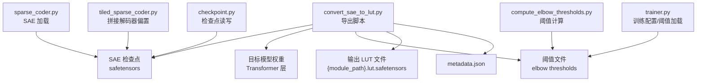
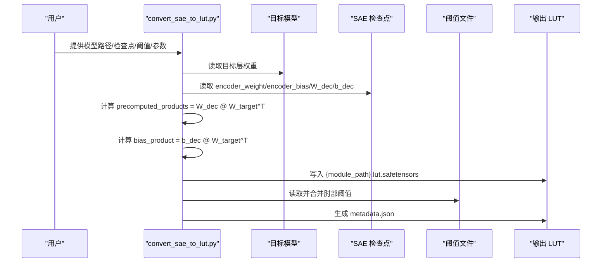
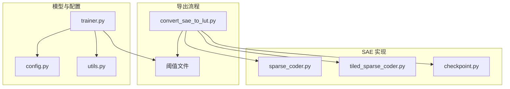

# 格式规范

<cite>
**本文档引用的文件**
- [convert_sae_to_lut.py](file://convert_sae_to_lut.py)
- [sae-to-lut.md](file://docs/export/sae-to-lut.md)
- [lut_format.md](file://docs/archive/legacy/lut_format.md)
- [compute_elbow_thresholds.py](file://compute_elbow_thresholds.py)
- [sparse_coder.py](file://sparsify/sparse_coder.py)
- [tiled_sparse_coder.py](file://sparsify/tiled_sparse_coder.py)
- [trainer.py](file://sparsify/trainer.py)
- [checkpoint.py](file://sparsify/checkpoint.py)
- [config.py](file://sparsify/config.py)
- [utils.py](file://sparsify/utils.py)
- [thresholds_o.json](file://thresholds/Qwen3-8B/thresholds_o.json)
- [thresholds_up.json](file://thresholds/Qwen3-8B/thresholds_up.json)
- [thresholds_q.json](file://thresholds/Qwen3-8B/thresholds_q.json)
</cite>

## 目录
1. [简介](#简介)
2. [项目结构](#项目结构)
3. [核心组件](#核心组件)
4. [架构总览](#架构总览)
5. [详细组件分析](#详细组件分析)
6. [依赖关系分析](#依赖关系分析)
7. [性能考虑](#性能考虑)
8. [故障排查指南](#故障排查指南)
9. [结论](#结论)
10. [附录](#附录)

## 简介
本文件系统化阐述 LUT（查找表）格式规范，涵盖以下方面：
- LUT 文件的内部结构与数据组织方式
- safetensors 格式的使用、张量存储布局与数据类型转换
- precomputed_products 与 bias_product 的计算公式与存储格式
- metadata.json 的结构与字段含义（版本信息、模型配置、层信息、肘部阈值）
- 格式验证方法与兼容性说明

## 项目结构
围绕 LUT 格式的核心代码主要位于以下模块：
- 导出脚本：负责从训练好的 SAE 检查点生成 LUT 文件，并计算预计算产物
- 文档与历史规范：提供当前仓库约定与历史草案参考
- 阈值计算：提供基于激活分布的肘部阈值，供下游补偿策略使用
- SAE 实现：提供编码器/解码器权重与偏置的读取接口
- 训练与检查点：提供配置、训练状态与阈值加载机制

**图表来源**
- [convert_sae_to_lut.py:1-783](file://convert_sae_to_lut.py#L1-783)
- [compute_elbow_thresholds.py:1-660](file://compute_elbow_thresholds.py#L1-660)
- [sparse_coder.py:122-167](file://sparsify/sparse_coder.py#L122-167)
- [tiled_sparse_coder.py:92-101](file://sparsify/tiled_sparse_coder.py#L92-101)
- [trainer.py:104-147](file://sparsify/trainer.py#L104-147)
- [checkpoint.py:44-73](file://sparsify/checkpoint.py#L44-73)

**章节来源**
- [convert_sae_to_lut.py:1-783](file://convert_sae_to_lut.py#L1-783)
- [sae-to-lut.md:1-103](file://docs/export/sae-to-lut.md#L1-103)

## 核心组件
- LUT 导出脚本：解析投影类型、自动发现层、加载 SAE 检查点、提取目标模型权重、计算预计算产物、保存 safetensors 文件与 metadata.json
- 阈值计算工具：基于激活分布的 Kneedle 肘部检测，输出每层/组件的 elbow_p 与 elbow_value
- SAE 实现：提供 encoder_weight、encoder_bias、decoder_weight（W_dec）、decoder_bias（b_dec）的读取接口
- 训练与检查点：提供配置、训练状态、阈值加载与保存机制

**章节来源**
- [convert_sae_to_lut.py:106-184](file://convert_sae_to_lut.py#L106-184)
- [compute_elbow_thresholds.py:35-96](file://compute_elbow_thresholds.py#L35-96)
- [sparse_coder.py:122-167](file://sparsify/sparse_coder.py#L122-167)
- [tiled_sparse_coder.py:92-101](file://sparsify/tiled_sparse_coder.py#L92-101)
- [trainer.py:104-147](file://sparsify/trainer.py#L104-147)
- [checkpoint.py:44-73](file://sparsify/checkpoint.py#L44-73)

## 架构总览
LUT 格式在运行时的计算流程如下：

**图表来源**
- [convert_sae_to_lut.py:419-558](file://convert_sae_to_lut.py#L419-558)
- [convert_sae_to_lut.py:310-334](file://convert_sae_to_lut.py#L310-334)
- [convert_sae_to_lut.py:367-417](file://convert_sae_to_lut.py#L367-417)

## 详细组件分析

### LUT 文件内部结构与数据组织
- 文件命名与组织
  - 单层文件：{module_path}.lut.safetensors，其中 module_path 为模型中对应线性层的路径（如 model.layers.{i}.{module}）
  - 全局元数据：metadata.json，记录版本、SAE 配置、模型配置、各层映射与创建信息
- 张量键与形状
  - encoder_weight: [num_basis, input_dim]
  - encoder_bias: [num_basis]
  - decoder_weight: [num_basis, input_dim]（即 W_dec）
  - decoder_bias: [input_dim]（即 b_dec）
  - precomputed_products: [num_basis, output_dim]（离线预计算）
  - bias_product: [output_dim]（离线预计算）
- 存储格式与数据类型
  - 使用 safetensors 格式，确保安全加载与高性能
  - 输出 dtype 可通过命令行参数选择 float16、bfloat16 或 float32，默认 bfloat16
- 融合投影
  - 对于 qkv、gate_up 等融合投影，使用一个 SAE 基作为源，将多个目标权重沿输出维拼接后统一导出

**章节来源**
- [convert_sae_to_lut.py:310-334](file://convert_sae_to_lut.py#L310-334)
- [convert_sae_to_lut.py:419-558](file://convert_sae_to_lut.py#L419-558)
- [sae-to-lut.md:11-59](file://docs/export/sae-to-lut.md#L11-59)
- [lut_format.md:23-50](file://docs/archive/legacy/lut_format.md#L23-50)

### safetensors 格式使用与张量存储布局
- 加载与保存
  - 使用 safetensors.torch.safe_open 读取张量，使用 save_file 写入
  - 读取时按键名映射到对应张量，确保与导出键一致
- 数据类型转换
  - 计算阶段统一转换为 float32，随后按目标 dtype 下发
  - 默认输出 dtype 为 bfloat16，兼顾精度与带宽
- 设备与内存
  - 计算在设备上执行，结果回传至 CPU 后再保存
  - 支持批处理计算以降低显存占用

**章节来源**
- [convert_sae_to_lut.py:153-184](file://convert_sae_to_lut.py#L153-184)
- [convert_sae_to_lut.py:310-334](file://convert_sae_to_lut.py#L310-334)
- [convert_sae_to_lut.py:249-285](file://convert_sae_to_lut.py#L249-285)

### precomputed_products 与 bias_product 的计算公式与存储
- 计算公式
  - precomputed_products[i, :] = W_dec[i, :] @ W_target
  - bias_product = b_dec @ W_target
- 存储格式
  - 以 float32 形式存储，便于后续推理阶段的混合精度计算
  - 与 encoder_weight/decoder_weight 等张量一同保存在同一批处理的 safetensors 文件中
- 批处理优化
  - 当 num_basis 较大时，采用批处理逐块计算，避免一次性内存不足

**章节来源**
- [convert_sae_to_lut.py:249-285](file://convert_sae_to_lut.py#L249-285)
- [convert_sae_to_lut.py:505-527](file://convert_sae_to_lut.py#L505-527)

### metadata.json 结构与字段含义
- 版本信息
  - version: "1.0"
- SAE 配置
  - sae_config.num_basis: 基向量数量（若未直接给出，可通过 d_in 与 expansion_factor 推导）
  - sae_config.k_active: 推理时 Top-K 激活数
- 模型配置
  - model_config.model_type、model_config.num_layers、model_config.num_attention_heads、model_config.hidden_size
- 层信息
  - layers: 以 module_path 为键，包含 input_dim、output_dim、file（对应 LUT 文件名）
- 肘部阈值
  - elbow_thresholds: 以 layer_{i}/{component} 为键，包含 elbow_p 与 elbow_value
- 创建信息
  - creation_info.created_at、creation_info.source_model、creation_info.script_version

**章节来源**
- [convert_sae_to_lut.py:367-417](file://convert_sae_to_lut.py#L367-417)
- [sae-to-lut.md:51-85](file://docs/export/sae-to-lut.md#L51-85)
- [lut_format.md:52-87](file://docs/archive/legacy/lut_format.md#L52-87)

### 阈值文件与补偿策略
- 阈值文件结构
  - 每个键为 layer_{i}/{component}，值包含 elbow_p 与 elbow_value
- 使用场景
  - 与训练配置中的 exceed_alphas 配合，计算超过 α·elbow_value 的比例，用于监控与动态补偿
- 加载与匹配
  - 训练器支持从 JSON 加载阈值，并尝试多种匹配策略（直接匹配、层号提取、组件名替换）

**章节来源**
- [compute_elbow_thresholds.py:35-96](file://compute_elbow_thresholds.py#L35-96)
- [compute_elbow_thresholds.py:630-647](file://compute_elbow_thresholds.py#L630-647)
- [trainer.py:145-148](file://sparsify/trainer.py#L145-148)
- [checkpoint.py:104-147](file://sparsify/checkpoint.py#L104-147)

### SAE 权重与偏置的读取与拼接
- 单层 SAE
  - 通过 safetensors 读取 encoder_weight、encoder_bias、W_dec、b_dec
- 拼接解码器偏置（TiledSparseCoder）
  - 将多 tile 的 b_dec 按顺序拼接，形成整体 decoder_bias
- 配置一致性
  - 读取 cfg.json 中的 d_in、expansion_factor 等字段，用于推导 num_basis

**章节来源**
- [sparse_coder.py:122-167](file://sparsify/sparse_coder.py#L122-167)
- [tiled_sparse_coder.py:92-101](file://sparsify/tiled_sparse_coder.py#L92-101)
- [checkpoint.py:44-73](file://sparsify/checkpoint.py#L44-73)

## 依赖关系分析

**图表来源**
- [convert_sae_to_lut.py:1-783](file://convert_sae_to_lut.py#L1-783)
- [sparse_coder.py:122-167](file://sparsify/sparse_coder.py#L122-167)
- [tiled_sparse_coder.py:92-101](file://sparsify/tiled_sparse_coder.py#L92-101)
- [checkpoint.py:44-73](file://sparsify/checkpoint.py#L44-73)
- [trainer.py:104-147](file://sparsify/trainer.py#L104-147)
- [config.py:28-149](file://sparsify/config.py#L28-149)
- [utils.py:20-79](file://sparsify/utils.py#L20-79)

**章节来源**
- [convert_sae_to_lut.py:1-783](file://convert_sae_to_lut.py#L1-783)
- [trainer.py:104-147](file://sparsify/trainer.py#L104-147)
- [config.py:28-149](file://sparsify/config.py#L28-149)

## 性能考虑
- 计算精度与带宽
  - 默认输出 dtype 为 bfloat16，兼顾精度与带宽；也可选择 float16/float32
- 内存效率
  - 对于较大的 num_basis，启用批处理计算 precomputed_products，避免显存峰值过高
- 设备选择
  - 在可用加速设备（CUDA/NPU）上进行矩阵乘法，减少 CPU 回传成本
- 推理阶段
  - 将预计算产物与在线稀疏选择结合，显著降低在线 matmul 的计算量

**章节来源**
- [convert_sae_to_lut.py:648-707](file://convert_sae_to_lut.py#L648-707)
- [convert_sae_to_lut.py:249-285](file://convert_sae_to_lut.py#L249-285)

## 故障排查指南
- 检查点路径与命名
  - 确认检查点目录符合预期命名模式（支持嵌套与扁平两种结构），否则无法定位 sae.safetensors
- 维度不匹配
  - 若 SAE 的 d_in 与目标层权重的 in_features 不一致，导出会报错；请核对 SAE 配置与目标层
- 设备与 dtype
  - 确保目标设备可用且 dtype 支持；必要时切换到 CPU 或调整 dtype
- 阈值文件缺失或不匹配
  - 若未提供阈值文件，训练器不会加载；若键名不匹配，阈值不会生效
- 融合投影配置
  - 确保使用正确的投影类型（如 qkv、gate_up），并保证源 SAE 与目标模块集合一致

**章节来源**
- [convert_sae_to_lut.py:106-151](file://convert_sae_to_lut.py#L106-151)
- [convert_sae_to_lut.py:498-504](file://convert_sae_to_lut.py#L498-504)
- [trainer.py:145-148](file://sparsify/trainer.py#L145-148)

## 结论
LUT 格式通过离线预计算与 safetensors 存储，实现了 SAE 解码器与目标模型权重的高效组合。其核心要点包括：
- 明确的文件命名与组织方式
- 严格的张量键与形状约定
- 预计算产物与元数据的协同
- 阈值驱动的动态补偿策略
建议在生产环境中遵循本文档的约定，并在迁移或扩展时保持与现有导出脚本与阈值文件的兼容。

## 附录

### LUT 文件键与含义对照
- encoder_weight: [num_basis, input_dim] —— 编码器权重
- encoder_bias: [num_basis] —— 编码器偏置
- decoder_weight: [num_basis, input_dim] —— 解码器权重 W_dec
- decoder_bias: [input_dim] —— 解码器偏置 b_dec
- precomputed_products: [num_basis, output_dim] —— 预计算产物 W_dec @ W_target^T
- bias_product: [output_dim] —— 偏置产物 b_dec @ W_target^T

**章节来源**
- [convert_sae_to_lut.py:310-334](file://convert_sae_to_lut.py#L310-334)
- [sae-to-lut.md:34-44](file://docs/export/sae-to-lut.md#L34-44)

### 阈值文件示例键与含义
- 键格式：layer_{i}/{component}
- 值字段：elbow_p（拐点分位数）、elbow_value（拐点绝对值）

**章节来源**
- [thresholds_o.json:1-146](file://thresholds/Qwen3-8B/thresholds_o.json#L1-146)
- [thresholds_up.json:1-146](file://thresholds/Qwen3-8B/thresholds_up.json#L1-146)
- [thresholds_q.json:1-146](file://thresholds/Qwen3-8B/thresholds_q.json#L1-146)