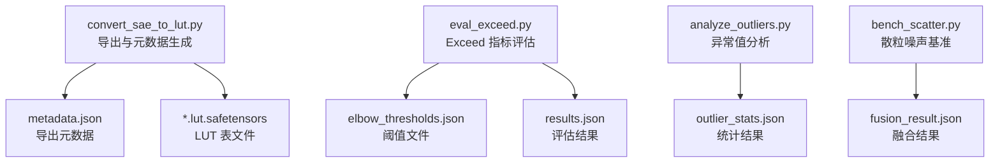
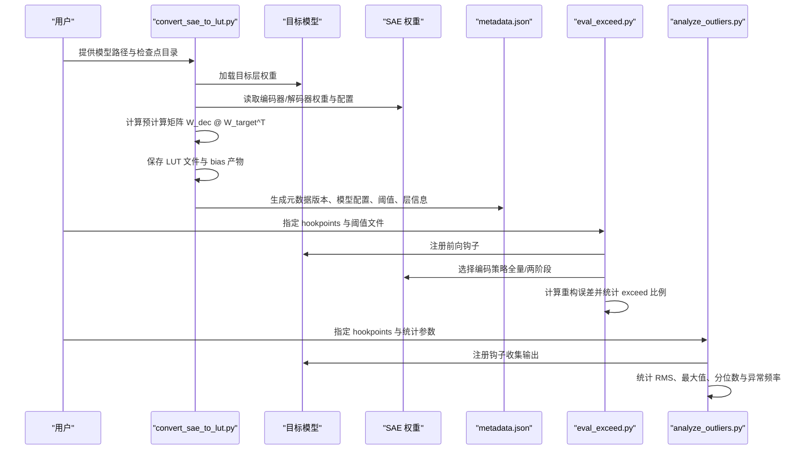
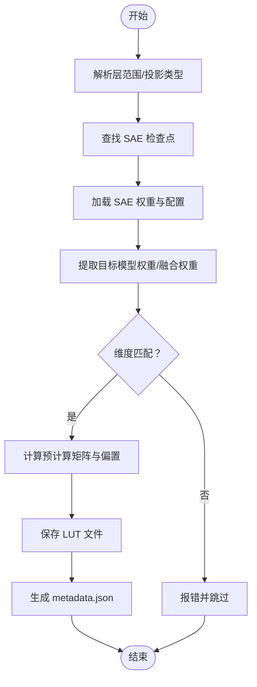
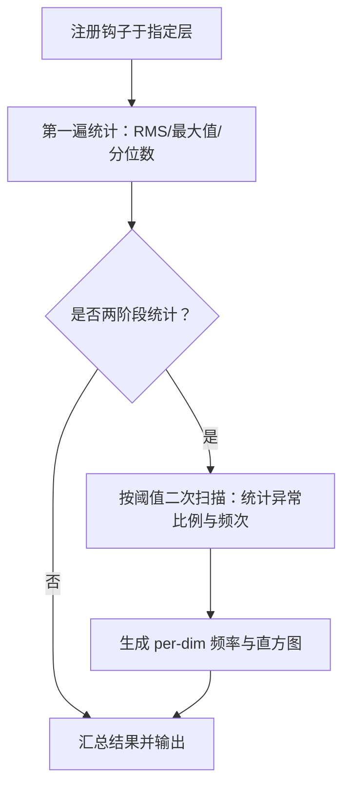
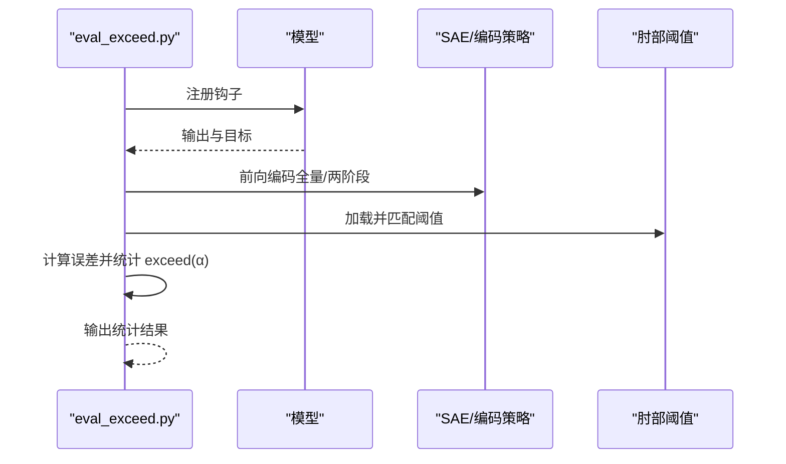
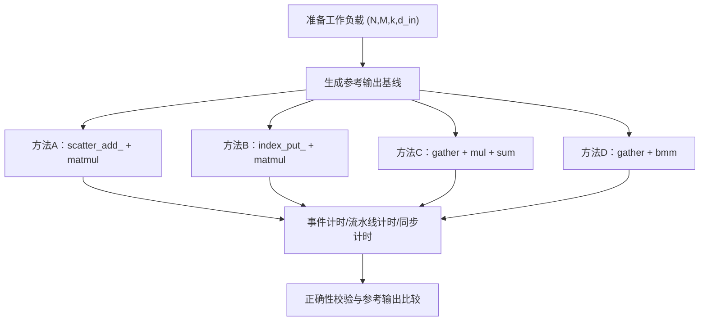
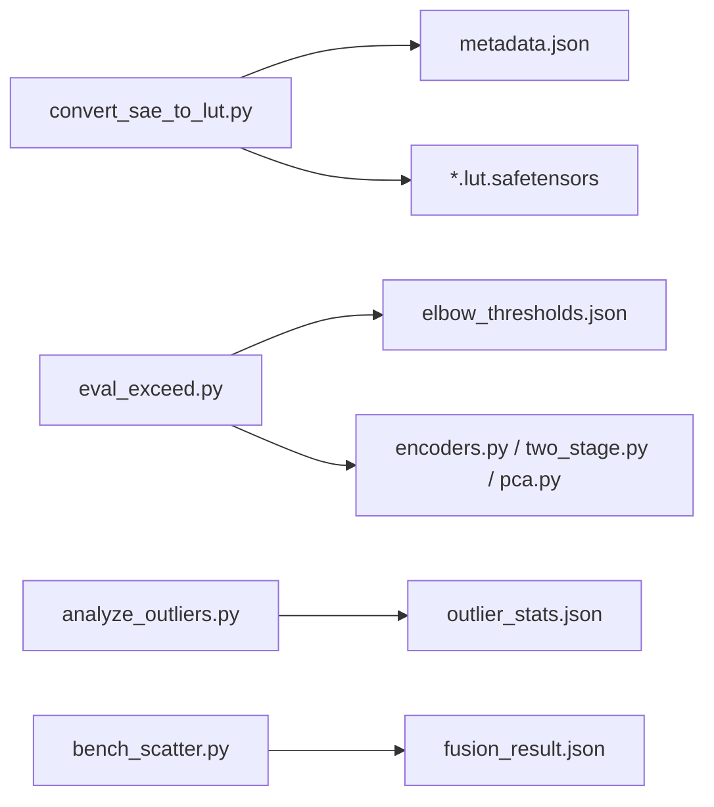

# 验证与测试

<cite>
**本文引用的文件**
- [convert_sae_to_lut.py](file://convert_sae_to_lut.py)
- [analyze_outliers.py](file://scripts/analyze_outliers.py)
- [eval_exceed.py](file://scripts/eval_exceed.py)
- [bench_scatter.py](file://benchmarks/bench_scatter.py)
- [encoders.py](file://sparsify/eval/encoders.py)
- [two_stage.py](file://sparsify/eval/two_stage.py)
- [pca.py](file://sparsify/eval/pca.py)
- [utils.py](file://sparsify/utils.py)
- [thresholds_q.json](file://thresholds/Qwen3-0.6B/thresholds_q.json)
- [outlier_stats.json](file://outlier_stats.json)
- [fusion_result.json](file://fusion_result.json)
</cite>

## 目录
1. [简介](#简介)
2. [项目结构](#项目结构)
3. [核心组件](#核心组件)
4. [架构总览](#架构总览)
5. [详细组件分析](#详细组件分析)
6. [依赖关系分析](#依赖关系分析)
7. [性能考量](#性能考量)
8. [故障排查指南](#故障排查指南)
9. [结论](#结论)
10. [附录](#附录)

## 简介
本文件面向 LUT 导出验证与测试，系统性说明以下内容：
- LUT 导出结果的验证方法：文件完整性检查、元数据一致性校验、数据一致性验证
- 散粒噪声测试（Exceed 指标）的实现原理与评估指标，以及如何通过阈值与统计量进行基准测试
- 异常值分析工具的使用方法与结果解读
- 如何验证 LUT 文件在推理阶段的正确性与性能表现
- 常见问题的诊断方法与解决方案

## 项目结构
围绕验证与测试的关键模块与文件如下：
- LUT 导出与元数据生成：convert_sae_to_lut.py
- 异常值与统计分析：scripts/analyze_outliers.py
- Exceed 指标与阈值评估：scripts/eval_exceed.py
- 性能基准（散粒噪声相关）：benchmarks/bench_scatter.py
- 推理策略与两阶段编码器：sparsify/eval/encoders.py、sparsify/eval/two_stage.py、sparsify/eval/pca.py
- 工具函数与钩子控制：sparsify/utils.py
- 阈值文件与统计结果：thresholds/Qwen3-0.6B/thresholds_q.json、outlier_stats.json、fusion_result.json

**图表来源**
- [convert_sae_to_lut.py](file://convert_sae_to_lut.py)
- [eval_exceed.py](file://scripts/eval_exceed.py)
- [analyze_outliers.py](file://scripts/analyze_outliers.py)
- [bench_scatter.py](file://benchmarks/bench_scatter.py)
- [thresholds_q.json](file://thresholds/Qwen3-0.6B/thresholds_q.json)
- [outlier_stats.json](file://outlier_stats.json)
- [fusion_result.json](file://fusion_result.json)

**章节来源**
- [convert_sae_to_lut.py](file://convert_sae_to_lut.py)
- [eval_exceed.py](file://scripts/eval_exceed.py)
- [analyze_outliers.py](file://scripts/analyze_outliers.py)
- [bench_scatter.py](file://benchmarks/bench_scatter.py)

## 核心组件
- LUT 导出与元数据生成：负责从 SAE 权重与目标模型权重计算预计算矩阵，保存为 LUT 文件，并生成 metadata.json 描述导出信息
- 异常值分析：基于钩子统计输出分布，计算 RMS、最大值、分位数及异常比例等指标
- Exceed 指标评估：结合肘部阈值与重构误差，统计超过阈值的比例，作为散粒噪声的量化指标
- 性能基准：针对散粒噪声场景下的稀疏加法实现进行多模式计时与正确性校验
- 推理策略：支持全量编码与两阶段编码（含 PCA 投影），用于不同场景下的性能与精度权衡

**章节来源**
- [convert_sae_to_lut.py](file://convert_sae_to_lut.py)
- [encoders.py](file://sparsify/eval/encoders.py)
- [two_stage.py](file://sparsify/eval/two_stage.py)
- [pca.py](file://sparsify/eval/pca.py)
- [utils.py](file://sparsify/utils.py)

## 架构总览
下图展示 LUT 导出到推理验证的整体流程与关键交互。

**图表来源**
- [convert_sae_to_lut.py](file://convert_sae_to_lut.py)
- [eval_exceed.py](file://scripts/eval_exceed.py)
- [analyze_outliers.py](file://scripts/analyze_outliers.py)
- [encoders.py](file://sparsify/eval/encoders.py)
- [two_stage.py](file://sparsify/eval/two_stage.py)
- [pca.py](file://sparsify/eval/pca.py)
- [utils.py](file://sparsify/utils.py)

## 详细组件分析

### LUT 导出与元数据生成（convert_sae_to_lut.py）
- 功能要点
  - 解析层范围与投影类型，自动检测可用层
  - 从检查点加载 SAE 权重与配置
  - 从目标模型提取对应层权重，支持单层与融合（如 QKV、Gate/Up）
  - 计算预计算矩阵与偏置项，保存为 safetensors 格式
  - 生成 metadata.json，包含版本、模型配置、层信息、肘部阈值与创建信息
- 关键流程
  - 层处理：find_checkpoint_path → load_sae_checkpoint → get_model_weight 或 get_fused_model_weights → compute_precomputed_products → compute_bias_product → save_lut_file
  - 元数据生成：generate_metadata → 合并各层信息与阈值
- 数据一致性验证建议
  - 对比 W_dec 与 W_target 的输入维度一致性
  - 校验 LUT 文件张量数量与键名是否完整
  - 校验 metadata.json 中的 num_basis、k_active、层信息与实际导出文件一致
- 文件完整性检查
  - 使用 safetensors 校验文件头与张量形状
  - 统计输出目录大小与文件数量，核对预期

**图表来源**
- [convert_sae_to_lut.py](file://convert_sae_to_lut.py)

**章节来源**
- [convert_sae_to_lut.py](file://convert_sae_to_lut.py)

### 异常值分析（scripts/analyze_outliers.py）
- 功能要点
  - 通过钩子在指定层收集输出，支持“输出/输入/转码”三种模式
  - 计算每维 RMS、最大值与分位数，统计异常比例与每 token 异常直方图
  - 支持两阶段统计：先统计再按阈值二次扫描，得到更准确的异常频率
  - 可选绘图输出（直方图、散点图等）
- 结果解读
  - RMS/最大值：衡量激活幅度；异常高可能指示异常值或数值不稳定
  - 分位数：关注极端尾部分布（如 0.995 分位）
  - 异常比例与 per-dim 频率：定位异常活跃的维度
- 使用建议
  - 指定 hookpoints 时尽量覆盖关键投影（如 q_proj/o_proj/up_proj）
  - 使用 stats_use_abs=true 以聚焦绝对幅值
  - two_pass=true 时阈值通常为 k*RMS，k 建议从 2~4 起步

**图表来源**
- [analyze_outliers.py](file://scripts/analyze_outliers.py)

**章节来源**
- [analyze_outliers.py](file://scripts/analyze_outliers.py)
- [outlier_stats.json](file://outlier_stats.json)

### Exceed 指标与阈值评估（scripts/eval_exceed.py）
- 功能要点
  - 从 elbow 阈值文件中按 hookpoint 匹配阈值
  - 在推理过程中计算重构误差 |y - ŷ|，统计超过 α·阈值的比例
  - 支持全量编码与两阶段编码（含 PCA 投影）
  - 可选统计 top-k 活化与潜在维度计数
- 指标定义
  - exceed(α) = Σ I(|y - ŷ| > α·threshold) / 总元素数
  - α 通常取 1.0、2.0、3.0 等，用于评估散粒噪声水平
- 使用建议
  - 阈值文件需与 hookpoints 名称精确匹配或可被模式匹配
  - 优先使用“原始空间”的重构误差，避免旋转/裁剪导致的偏差

**图表来源**
- [eval_exceed.py](file://scripts/eval_exceed.py)
- [encoders.py](file://sparsify/eval/encoders.py)
- [two_stage.py](file://sparsify/eval/two_stage.py)
- [pca.py](file://sparsify/eval/pca.py)
- [utils.py](file://sparsify/utils.py)

**章节来源**
- [eval_exceed.py](file://scripts/eval_exceed.py)
- [encoders.py](file://sparsify/eval/encoders.py)
- [two_stage.py](file://sparsify/eval/two_stage.py)
- [pca.py](file://sparsify/eval/pca.py)
- [utils.py](file://sparsify/utils.py)
- [thresholds_q.json](file://thresholds/Qwen3-0.6B/thresholds_q.json)

### 性能基准（benchmarks/bench_scatter.py）
- 功能要点
  - 对散粒噪声场景下的稀疏加法实现进行对比：scatter_add_、index_put_、gather+乘加、gather+bmm
  - 提供三种计时模式：事件计时（设备端）、流水线计时、同步计时
  - 进行正确性校验（与参考输出的最大差值）
- 使用建议
  - 使用事件计时与流水线计时观察真实端到端性能
  - 同步计时会掩盖 CPU 回退带来的管道停顿，仅适合对比

**图表来源**
- [bench_scatter.py](file://benchmarks/bench_scatter.py)

**章节来源**
- [bench_scatter.py](file://benchmarks/bench_scatter.py)
- [fusion_result.json](file://fusion_result.json)

## 依赖关系分析
- LUT 导出依赖目标模型权重与 SAE 检查点，输出 LUT 文件与元数据
- Exceed 评估依赖 elbow 阈值文件与编码策略（全量/两阶段）
- 异常值分析依赖钩子机制与统计模块
- 性能基准独立于推理流程，但与散粒噪声实现相关

**图表来源**
- [convert_sae_to_lut.py](file://convert_sae_to_lut.py)
- [eval_exceed.py](file://scripts/eval_exceed.py)
- [analyze_outliers.py](file://scripts/analyze_outliers.py)
- [bench_scatter.py](file://benchmarks/bench_scatter.py)
- [encoders.py](file://sparsify/eval/encoders.py)
- [two_stage.py](file://sparsify/eval/two_stage.py)
- [pca.py](file://sparsify/eval/pca.py)
- [thresholds_q.json](file://thresholds/Qwen3-0.6B/thresholds_q.json)
- [outlier_stats.json](file://outlier_stats.json)
- [fusion_result.json](file://fusion_result.json)

**章节来源**
- [convert_sae_to_lut.py](file://convert_sae_to_lut.py)
- [eval_exceed.py](file://scripts/eval_exceed.py)
- [analyze_outliers.py](file://scripts/analyze_outliers.py)
- [bench_scatter.py](file://benchmarks/bench_scatter.py)
- [encoders.py](file://sparsify/eval/encoders.py)
- [two_stage.py](file://sparsify/eval/two_stage.py)
- [pca.py](file://sparsify/eval/pca.py)

## 性能考量
- 内存与计算
  - 预计算矩阵尺寸约为 num_latents × d_out，建议根据显存选择合适的 batch_size 或 dtype
  - 两阶段编码器通过低秩投影减少粗筛成本，适合大 K 场景
- 计时模式
  - 事件计时与流水线计时更能反映真实端到端性能，避免同步开销掩盖的瓶颈
- 散粒噪声实现
  - 优先采用无密集中间矩阵的 gather+乘加/bmm 实现，减少内存占用与带宽压力

[本节为通用指导，无需特定文件来源]

## 故障排查指南
- LUT 导出失败
  - 检查 SAE 检查点是否存在且包含 cfg.json 与 sae.safetensors
  - 校验目标模型权重维度与 SAE decoder 权重输入维度一致
  - 确认输出 dtype 与设备设置合理
- 元数据不一致
  - 核对 metadata.json 中的 num_basis、k_active、层信息与实际导出文件匹配
  - 阈值文件路径与名称需与导出脚本一致
- Exceed 指标异常
  - 确认 elbow 阈值文件中 hookpoint 名称与模型一致
  - 若使用 Hadamard 旋转或裁剪，需在原始空间计算误差
- 异常值分析结果异常
  - 检查 hook_mode 是否为“输出”，避免输入/输出混淆
  - 适当提高样本量与分位数，确保统计稳定性
- 性能基准差异
  - 使用事件计时与流水线计时对比不同实现
  - 关注 CPU 回退导致的管道停顿

**章节来源**
- [convert_sae_to_lut.py](file://convert_sae_to_lut.py)
- [eval_exceed.py](file://scripts/eval_exceed.py)
- [analyze_outliers.py](file://scripts/analyze_outliers.py)
- [bench_scatter.py](file://benchmarks/bench_scatter.py)

## 结论
通过 LUT 导出、元数据校验、异常值分析与 Exceed 指标评估，可以系统地验证导出质量与推理表现。结合性能基准与两阶段编码策略，可在精度与效率之间取得平衡。建议在实验流程中严格遵循全局统计、精确基线与阈值匹配的原则，确保结果可复现、可解释。

[本节为总结，无需特定文件来源]

## 附录
- 常用命令与参数
  - LUT 导出：指定模型路径、检查点目录、输出目录、投影类型、层范围、阈值目录、dtype、设备与批处理开关
  - 异常值分析：指定检查点、模型、数据集、hookpoints、hook_mode、统计参数与输出路径
  - Exceed 评估：指定检查点、模型、数据集、hookpoints、exceed_alpha 列表、肘部阈值路径与输出路径
  - 性能基准：直接运行基准脚本，自动对比多种实现与计时模式

[本节为概览，无需特定文件来源]