# SAE 改进系统

<cite>
**本文档引用的文件**
- [README.md](file://README.md)
- [sparsify/__main__.py](file://sparsify/__main__.py)
- [sparsify/config.py](file://sparsify/config.py)
- [sparsify/trainer.py](file://sparsify/trainer.py)
- [sparsify/sparse_coder.py](file://sparsify/sparse_coder.py)
- [sparsify/gated_sparse_coder.py](file://sparsify/gated_sparse_coder.py)
- [sparsify/jumprelu_sparse_coder.py](file://sparsify/jumprelu_sparse_coder.py)
- [sparsify/group_topk_sparse_coder.py](file://sparsify/group_topk_sparse_coder.py)
- [sparsify/metrics_logger.py](file://sparsify/metrics_logger.py)
- [sparsify/tiled_sparse_coder.py](file://sparsify/tiled_sparse_coder.py)
- [sparsify/fused_encoder.py](file://sparsify/fused_encoder.py)
- [sparsify/fused_decoder.py](file://sparsify/fused_decoder.py)
- [sparsify/checkpoint.py](file://sparsify/checkpoint.py)
- [sparsify/utils.py](file://sparsify/utils.py)
- [sparsify/device.py](file://sparsify/device.py)
- [compute_elbow_thresholds.py](file://compute_elbow_thresholds.py)
- [scripts/README.md](file://scripts/README.md)
- [docs/training/quickstart.md](file://docs/training/quickstart.md)
- [pyproject.toml](file://pyproject.toml)
</cite>

## 更新摘要
**所做更改**
- 新增了三种新型SAE架构变体的详细说明：GatedSparseCoder、JumpReLUSparseCoder、GroupTopKSparseCoder
- 引入了MetricsLogger组件，提供结构化的训练指标记录功能
- 更新了训练框架架构，涵盖Phase 2完整训练流程
- 扩展了配置系统以支持新的架构变体和训练参数

## 目录
1. [简介](#简介)
2. [项目结构](#项目结构)
3. [核心组件](#核心组件)
4. [架构概览](#架构概览)
5. [详细组件分析](#详细组件分析)
6. [新架构变体详解](#新架构变体详解)
7. [MetricsLogger组件](#metricslogger组件)
8. [依赖关系分析](#依赖关系分析)
9. [性能考虑](#性能考虑)
10. [故障排除指南](#故障排除指南)
11. [结论](#结论)
12. [附录](#附录)

## 简介

SAE 改进系统是一个基于稀疏自编码器（SAE）的训练与导出系统，专门用于在 Transformer 模型的激活值上进行稀疏编码，为 LUTurbo 推理引擎提供优化支持。该系统的核心目标是在 NVIDIA/CUDA 平台上高效训练 SAE，生成阈值统计信息，并将训练好的检查点导出为 LUT 友好的格式。

系统采用模块化设计，支持多种训练模式，包括标准 SAE、分块 SAE（Tiled SAE）、门控 SAE（Gated SAE）、跳跃 ReLU SAE（JumpReLU SAE）以及组 Top-K SAE（Group Top-K SAE）。通过前向钩子机制捕获 Transformer 激活值，实现了对特定层和模块的精确控制。

**更新** 新增了三种先进的 SAE 架构变体和结构化指标记录功能，进一步增强了系统的灵活性和可扩展性。

## 项目结构

项目采用清晰的模块化组织结构，主要分为以下几个核心部分：

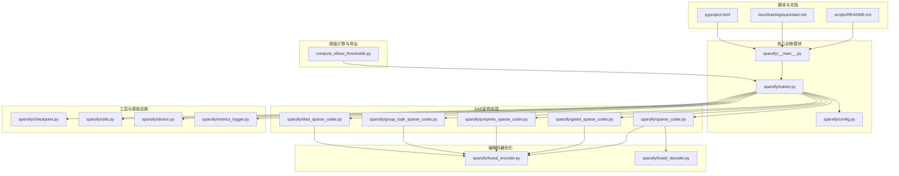

**图表来源**
- [sparsify/__main__.py:1-211](file://sparsify/__main__.py#L1-211)
- [sparsify/trainer.py:1-865](file://sparsify/trainer.py#L1-865)
- [sparsify/config.py:1-220](file://sparsify/config.py#L1-220)

**章节来源**
- [README.md:1-153](file://README.md#L1-L153)
- [pyproject.toml:1-131](file://pyproject.toml#L1-L131)

## 核心组件

### 训练入口与配置管理

系统的核心入口位于 `sparsify/__main__.py`，提供了完整的命令行接口和训练流程控制。配置管理通过 `sparsify/config.py` 实现，支持灵活的参数设置和验证。

关键特性包括：
- **多GPU分布式训练支持**：通过 PyTorch DDP 实现
- **动态配置解析**：支持复杂的数据集和模型参数
- **检查点管理**：完整的训练状态保存和恢复机制
- **架构选择**：支持多种 SAE 架构变体的选择和配置

### SAE架构实现

系统提供四种主要的 SAE 实现方式：

1. **标准稀疏自编码器**：实现基础的稀疏编码和解码功能
2. **门控稀疏自编码器**：独立的门控分支和幅度分支
3. **跳跃 ReLU 稀疏自编码器**：具有可学习阈值的固定 K 变体
4. **组 Top-K 稀疏自编码器**：独立的组路由器和全局 Top-K 选择
5. **分块稀疏自编码器**：支持将输入激活分割为多个块，每块独立训练

### 性能优化组件

- **融合编解码器**：针对 NPU/CUDA 平台优化的自定义 Autograd 函数
- **设备抽象层**：统一的 CUDA/NPU/CPU 设备管理
- **内存优化**：通过阈值判断避免大规模矩阵乘法
- **指标记录**：结构化的训练指标记录和分析

**更新** 新增了三种高级架构变体和结构化指标记录功能。

**章节来源**
- [sparsify/__main__.py:131-211](file://sparsify/__main__.py#L131-L211)
- [sparsify/config.py:7-220](file://sparsify/config.py#L7-L220)
- [sparsify/sparse_coder.py:36-307](file://sparsify/sparse_coder.py#L36-L307)

## 架构概览

系统采用分层架构设计，从底层的设备抽象到顶层的训练控制器，形成了清晰的职责分离：

```mermaid
graph TD
subgraph "用户接口层"
UI[命令行界面]
API[程序化接口]
end
subgraph "配置管理层"
CFG[配置解析器]
VAL[参数验证器]
ARCH[架构工厂]
end
subgraph "训练控制层"
TRAINER[训练器]
HOOK[前向钩子]
OPT[优化器]
METRICS[指标记录器]
end
subgraph "SAE实现层"
BASE[基础SparseCoder]
GATED[GatedSparseCoder]
JUMP[JumperReLUSparseCoder]
GROUP[GroupTopKSparseCoder]
TILED[TiledSparseCoder]
END
subgraph "编解码器层"
FUSE[FusedEncoder]
DEC[FusedDecoder]
end
subgraph "基础设施层"
DEV[设备抽象]
CKPT[检查点管理]
UTIL[工具函数]
end
UI --> CFG
API --> CFG
CFG --> VAL
VAL --> ARCH
ARCH --> TRAINER
TRAINER --> HOOK
TRAINER --> OPT
TRAINER --> METRICS
HOOK --> BASE
HOOK --> GATED
HOOK --> JUMP
HOOK --> GROUP
HOOK --> TILED
BASE --> FUSE
GATED --> FUSE
JUMP --> FUSE
GROUP --> FUSE
TILED --> FUSE
FUSE --> DEC
TRAINER --> DEV
TRAINER --> CKPT
TRAINER --> UTIL
```

**图表来源**
- [sparsify/trainer.py:39-865](file://sparsify/trainer.py#L39-L865)
- [sparsify/sparse_coder.py:289-307](file://sparsify/sparse_coder.py#L289-L307)
- [sparsify/gated_sparse_coder.py:12-77](file://sparsify/gated_sparse_coder.py#L12-L77)
- [sparsify/jumprelu_sparse_coder.py:12-69](file://sparsify/jumprelu_sparse_coder.py#L12-L69)
- [sparsify/group_topk_sparse_coder.py:12-84](file://sparsify/group_topk_sparse_coder.py#L12-L84)

## 详细组件分析

### 训练器组件分析

训练器是系统的核心组件，负责协调整个训练过程。其设计体现了高度的模块化和可扩展性。

#### 训练器类结构

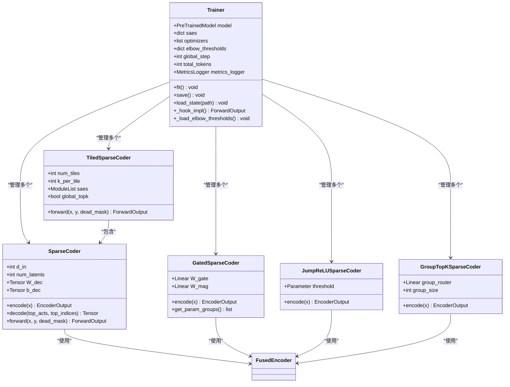

**图表来源**
- [sparsify/trainer.py:40-865](file://sparsify/trainer.py#L40-L865)
- [sparsify/sparse_coder.py:36-307](file://sparsify/sparse_coder.py#L36-L307)
- [sparsify/gated_sparse_coder.py:12-77](file://sparsify/gated_sparse_coder.py#L12-L77)
- [sparsify/jumprelu_sparse_coder.py:12-69](file://sparsify/jumprelu_sparse_coder.py#L12-L69)
- [sparsify/group_topk_sparse_coder.py:12-84](file://sparsify/group_topk_sparse_coder.py#L12-L84)
- [sparsify/tiled_sparse_coder.py:17-342](file://sparsify/tiled_sparse_coder.py#L17-L342)

#### 训练流程时序图

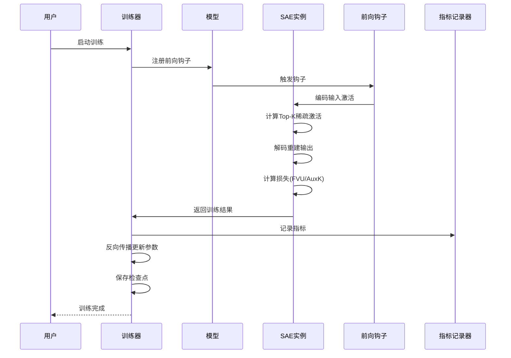

**图表来源**
- [sparsify/trainer.py:179-865](file://sparsify/trainer.py#L179-L865)
- [sparsify/sparse_coder.py:198-261](file://sparsify/sparse_coder.py#L198-L261)

**章节来源**
- [sparsify/trainer.py:162-865](file://sparsify/trainer.py#L162-L865)

### SAE编码器组件分析

编码器组件实现了高效的 Top-K 选择机制，通过自定义 Autograd 函数优化了梯度计算过程。

#### 编码器算法流程

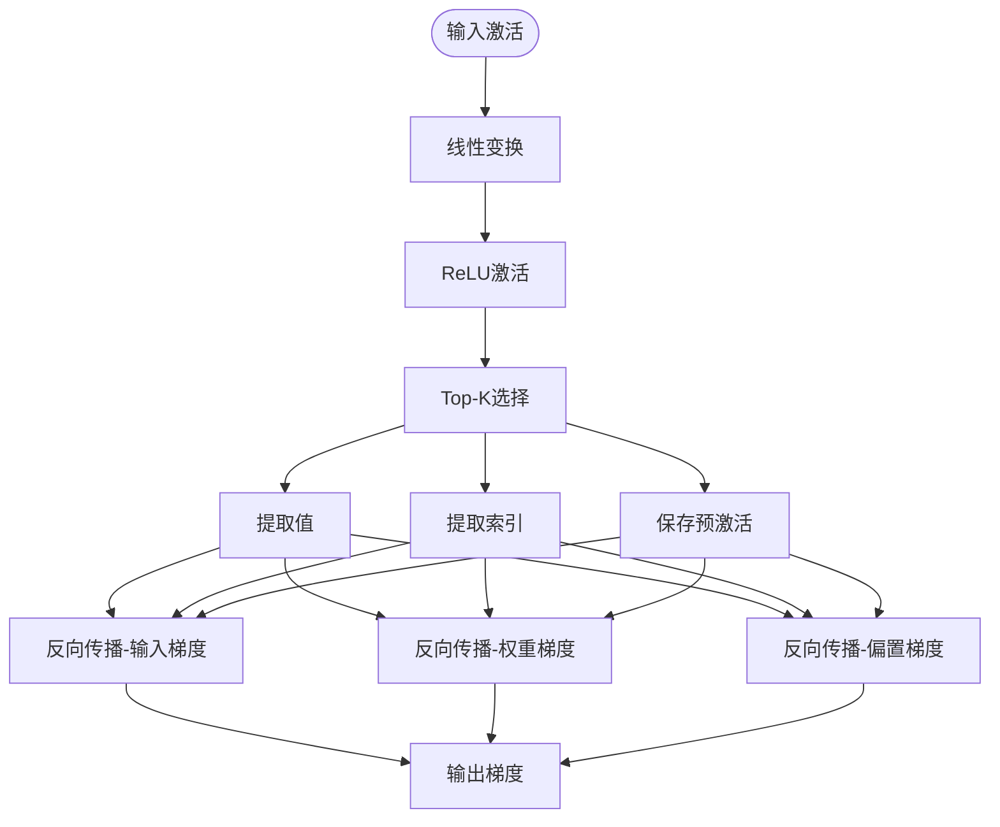

**图表来源**
- [sparsify/fused_encoder.py:21-107](file://sparsify/fused_encoder.py#L21-L107)

#### 编码器性能优化

编码器采用了智能的内存管理策略，根据矩阵大小自动选择最优的计算路径：

- **内存充足时**：使用密集矩阵乘法，避免散列操作
- **内存受限时**：回退到传统的 gather+bmm 方法
- **阈值判断**：基于 `_MATMUL_THRESHOLD = 256MB` 进行决策

**章节来源**
- [sparsify/fused_encoder.py:18-107](file://sparsify/fused_encoder.py#L18-L107)

### 分块SAE组件分析

分块 SAE 是系统的重要创新，通过将输入激活分割为多个独立的块，实现了更好的并行性和可扩展性。

#### 分块架构设计

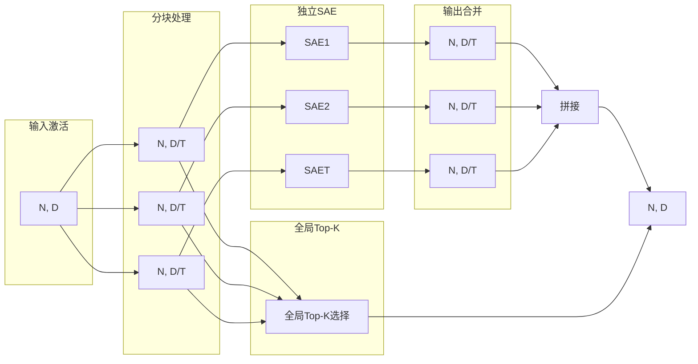

**图表来源**
- [sparsify/tiled_sparse_coder.py:17-342](file://sparsify/tiled_sparse_coder.py#L17-L342)

#### 分块策略对比

系统提供了两种主要的分块策略：

1. **独立Top-K策略**：每个块独立选择 Top-K 激活
2. **全局Top-K策略**：所有块共享相同的激活预算

**章节来源**
- [sparsify/tiled_sparse_coder.py:172-253](file://sparsify/tiled_sparse_coder.py#L172-L253)

### 阈值计算组件分析

阈值计算组件负责分析模型激活值的分布，为后续的 LUT 导出提供关键的统计信息。

#### 阈值计算流程

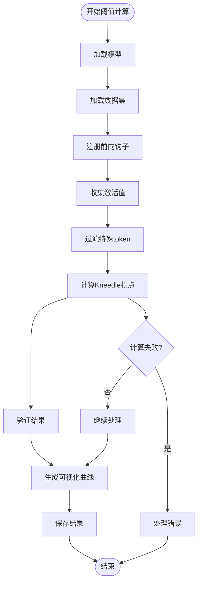

**图表来源**
- [compute_elbow_thresholds.py:35-95](file://compute_elbow_thresholds.py#L35-L95)
- [compute_elbow_thresholds.py:172-200](file://compute_elbow_thresholds.py#L172-L200)

**章节来源**
- [compute_elbow_thresholds.py:364-660](file://compute_elbow_thresholds.py#L364-L660)

## 新架构变体详解

### 门控稀疏自编码器（GatedSparseCoder）

门控 SAE 将编码过程分解为两个独立的分支：门控分支用于选择激活，幅度分支用于计算系数。这种设计实现了更精细的稀疏控制。

#### 门控架构设计

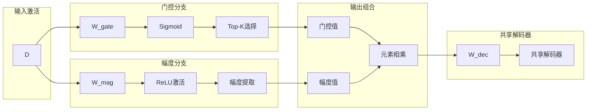

**图表来源**
- [sparsify/gated_sparse_coder.py:12-77](file://sparsify/gated_sparse_coder.py#L12-L77)

#### 门控算法流程

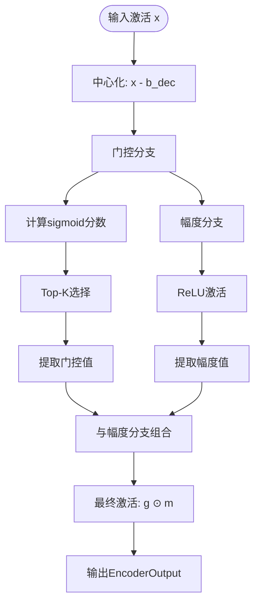

**图表来源**
- [sparsify/gated_sparse_coder.py:56-72](file://sparsify/gated_sparse_coder.py#L56-L72)

#### 门控特性

- **独立分支**：门控和幅度使用完全独立的线性投影
- **连续选择**：门控分数使用 sigmoid 输出，提供连续的选择概率
- **离散激活**：最终激活通过门控值和幅度值的逐元素乘法得到
- **共享解码器**：解码器权重与幅度分支共享，保持一致性

**章节来源**
- [sparsify/gated_sparse_coder.py:12-77](file://sparsify/gated_sparse_coder.py#L12-L77)

### 跳跃 ReLU 稀疏自编码器（JumpReLUSparseCoder）

跳跃 ReLU SAE 引入了每个特征的可学习阈值，通过阶梯函数实现稀疏激活。该变体使用直通估计器（STE）在反向传播中保持梯度流动。

#### 跳跃 ReLU 架构设计

```mermaid
graph LR
subgraph "输入激活"
X[D]
end
subgraph "预激活计算"
P1[线性层]
P2[ReLU激活]
end
subgraph "阈值比较"
T1[可学习阈值 θ]
T2[比较运算 H(pre - θ)]
end
subgraph "直通估计器"
S1[Sigmoid近似]
S2[STE: hard + (soft - soft.detach())]
end
subgraph "激活输出"
A1[硬掩码]
A2[软掩码]
A3[最终激活]
end
X --> P1
P1 --> P2
P2 --> T1
P2 --> T2
T1 --> S1
T2 --> S2
S1 --> S2
P2 --> A1
S2 --> A2
A1 --> A3
A2 --> A3
```

**图表来源**
- [sparsify/jumprelu_sparse_coder.py:12-69](file://sparsify/jumprelu_sparse_coder.py#L12-L69)

#### 跳跃 ReLU 算法流程

```mermaid
flowchart TD
Start([输入激活 x]) --> Center[中心化: x - b_dec]
Center --> Linear[线性变换]
Linear --> ReLUAct[ReLU激活: relu(pre)]
Linear --> Threshold[阈值比较: H(pre - θ)]
Threshold --> HardMask[硬掩码: pre > θ]
HardMask --> STE[直通估计器]
STE --> SoftMask[Sigmoid近似: σ((pre - θ)/bandwidth)]
SoftMask --> Mask[掩码: hard + (soft - soft.detach())]
Mask --> Training{训练模式?}
Training --> |是| UseSoft[使用软掩码]
Training --> |否| UseHard[使用硬掩码]
UseSoft --> FinalAct[最终激活: relu(pre) * mask]
UseHard --> FinalAct
FinalAct --> TopK[固定K选择]
TopK --> Output[输出EncoderOutput]
```

**图表来源**
- [sparsify/jumprelu_sparse_coder.py:44-68](file://sparsify/jumprelu_sparse_coder.py#L44-L68)

#### 跳跃 ReLU 特性

- **可学习阈值**：每个潜在特征都有独立的可学习阈值参数
- **直通估计器**：使用 STE 在反向传播中保持梯度
- **固定 K 变体**：输出形状固定，兼容标准解码接口
- **近似硬掩码**：前向使用硬掩码，反向通过软掩码近似

**章节来源**
- [sparsify/jumprelu_sparse_coder.py:12-69](file://sparsify/jumprelu_sparse_coder.py#L12-L69)

### 组 Top-K 稀疏自编码器（GroupTopKSparseCoder）

组 Top-K SAE 通过独立的路由器选择组，然后在选定组的潜在空间内执行全局 Top-K 选择。该变体实现了结构化的稀疏模式。

#### 组 Top-K 架构设计

```mermaid
graph LR
subgraph "输入激活"
X[D]
end
subgraph "预激活计算"
PA[ReLU预激活]
end
subgraph "组路由器"
GR[独立路由器 R ∈ R^{G×d_in}]
GS[评分组]
GT[选择top-g组]
end
subgraph "组掩码构建"
GM[组掩码]
LM[潜在掩码]
end
subgraph "全局Top-K"
GTopK[全局Top-K within选中组]
end
X --> PA
PA --> GR
GR --> GS
GS --> GT
GT --> GM
GM --> LM
PA --> LM
LM --> GTopK
GTopK --> Output[输出EncoderOutput]
```

**图表来源**
- [sparsify/group_topk_sparse_coder.py:12-84](file://sparsify/group_topk_sparse_coder.py#L12-L84)

#### 组 Top-K 算法流程

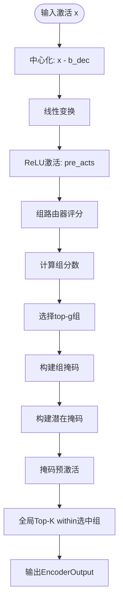

**图表来源**
- [sparsify/group_topk_sparse_coder.py:55-83](file://sparsify/group_topk_sparse_coder.py#L55-L83)

#### 组 Top-K 特性

- **独立路由器**：独立的组路由器权重，评分所有组
- **硬路由选择**：当前版本使用不可微的硬选择
- **全局选择**：在选中组内执行全局 Top-K 选择
- **结构化稀疏**：实现按组的结构化稀疏模式

**章节来源**
- [sparsify/group_topk_sparse_coder.py:12-84](file://sparsify/group_topk_sparse_coder.py#L12-L84)

## MetricsLogger组件

MetricsLogger 是系统中新引入的结构化指标记录组件，提供了标准化的训练指标记录和分析功能。

### 指标记录架构

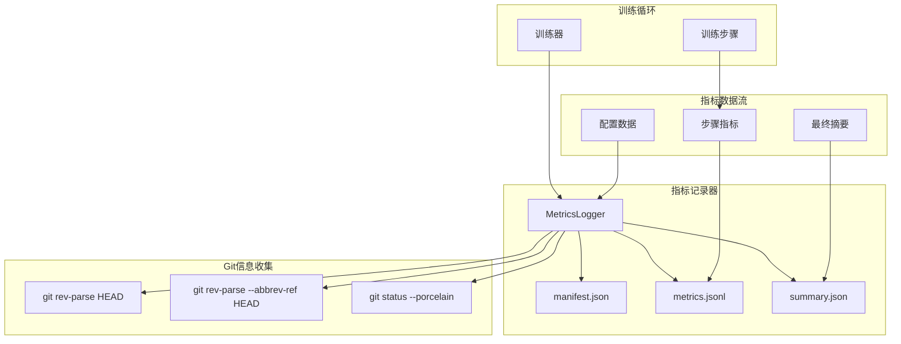

**图表来源**
- [sparsify/metrics_logger.py:10-81](file://sparsify/metrics_logger.py#L10-L81)

### 文件结构和内容

MetricsLogger 生成三个关键文件来记录训练过程：

1. **manifest.json** - 运行标识信息
   - 创建时间戳
   - Git 提交信息（提交哈希、分支、是否脏）
   - 运行元数据（模型、数据集、架构等）

2. **metrics.jsonl** - 步骤级指标记录
   - 每行一个 JSON 对象
   - 包含步骤编号、总令牌数、时间戳
   - 可变的指标字段

3. **summary.json** - 最终训练摘要
   - 训练结束时写入
   - 包含最终指标和统计信息

### 指标记录流程

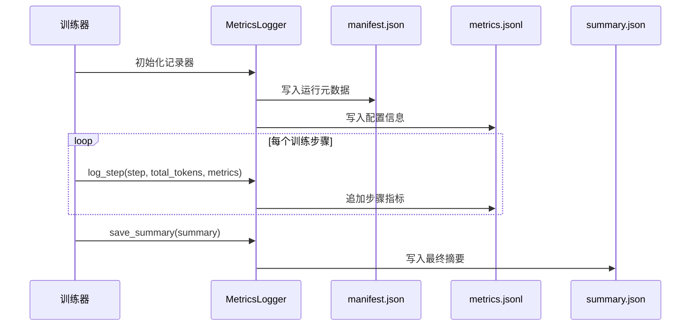

**图表来源**
- [sparsify/metrics_logger.py:58-81](file://sparsify/metrics_logger.py#L58-L81)

### 指标记录特性

- **结构化格式**：使用 JSONL 格式便于机器读取和分析
- **Git 集成**：自动收集运行时的 Git 信息
- **增量记录**：步骤级指标实时写入，支持断点续训
- **最终汇总**：训练结束时生成完整的摘要报告

**章节来源**
- [sparsify/metrics_logger.py:10-81](file://sparsify/metrics_logger.py#L10-L81)

## 依赖关系分析

系统采用模块化设计，各组件之间的依赖关系清晰明确：

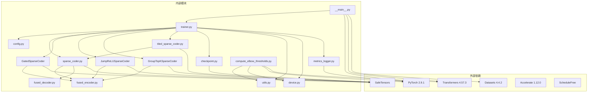

**图表来源**
- [pyproject.toml:12-28](file://pyproject.toml#L12-L28)
- [sparsify/__main__.py:9-26](file://sparsify/__main__.py#L9-L26)

**章节来源**
- [pyproject.toml:1-131](file://pyproject.toml#L1-L131)

## 性能考虑

系统在多个层面进行了性能优化，确保在大规模训练场景下的高效运行：

### 内存优化策略

1. **动态阈值判断**：根据矩阵大小自动选择最优计算路径
2. **延迟梯度计算**：避免不必要的张量复制和内存分配
3. **混合精度训练**：在支持的平台上自动启用 bfloat16
4. **结构化稀疏**：新架构变体提供更高效的稀疏表示

### 训练效率优化

1. **批量处理**：通过梯度累积和微批处理提高 GPU 利用率
2. **分布式训练**：支持多GPU并行训练
3. **检查点管理**：智能的检查点保存策略，平衡性能和可靠性
4. **指标记录优化**：异步指标记录减少训练阻塞

### 设备兼容性

系统通过设备抽象层实现了对不同硬件平台的统一支持：
- **CUDA**：完整的原生支持，最高性能
- **NPU**：通过自定义 Autograd 函数优化后端兼容性
- **CPU**：基本功能支持，适合调试和小规模实验

### 新架构性能特性

1. **门控 SAE**：双分支设计可能增加计算开销但提供更好的稀疏控制
2. **跳跃 ReLU**：阈值学习可能影响收敛速度但提供更灵活的激活模式
3. **组 Top-K**：路由器开销较小但提供结构化的稀疏模式
4. **指标记录**：异步写入减少对训练性能的影响

## 故障排除指南

### 常见问题及解决方案

#### 训练相关问题

**问题1：CUDA OOM（显存不足）**
- **原因**：批量大小过大或模型参数过多
- **解决方案**：减小 batch_size 或增加 grad_acc_steps

**问题2：训练速度缓慢**
- **原因**：缺少梯度累积或未启用编译优化
- **解决方案**：增加 grad_acc_steps 或启用 compile_model

**问题3：新架构训练不稳定**
- **原因**：学习率或初始化参数不当
- **解决方案**：调整学习率或使用不同的初始化策略

#### 检查点相关问题

**问题4：检查点加载失败**
- **原因**：检查点格式不兼容或文件损坏
- **解决方案**：重新训练或检查文件完整性

**问题5：分布式训练同步问题**
- **原因**：进程间通信异常或设备ID配置错误
- **解决方案**：检查环境变量和网络连接

#### 性能相关问题

**问题6：NPU后端性能不佳**
- **原因**：未正确配置设备或缺少必要的驱动
- **解决方案**：确认 torch_npu 安装和设备可用性

**问题7：指标记录性能影响**
- **原因**：磁盘写入阻塞训练进程
- **解决方案**：调整日志频率或使用更快的存储

**章节来源**
- [sparsify/trainer.py:139-161](file://sparsify/trainer.py#L139-L161)
- [sparsify/checkpoint.py:44-73](file://sparsify/checkpoint.py#L44-L73)

## 结论

SAE 改进系统提供了一个完整、高效且可扩展的稀疏自编码器训练框架。系统的主要优势包括：

1. **模块化设计**：清晰的组件分离和职责划分
2. **多架构支持**：支持标准、门控、跳跃 ReLU 和组 Top-K 多种架构
3. **性能优化**：多层面的性能优化策略
4. **平台兼容**：统一的设备抽象层支持多种硬件
5. **结构化记录**：引入 MetricsLogger 提供完整的训练指标分析
6. **易用性**：简洁的命令行接口和丰富的配置选项

系统特别适合在 NVIDIA/CUDA 平台上进行大规模 SAE 训练，为 LUTurbo 推理引擎提供了高质量的稀疏编码支持。通过合理的参数配置和硬件资源规划，用户可以在保证训练质量的同时获得最佳的训练效率。

**更新** 新增的三种架构变体和结构化指标记录功能进一步增强了系统的灵活性、可扩展性和实用性，为 Phase 2 训练框架提供了完整的支持。

## 附录

### 快速开始指南

```bash
# 安装依赖
pip install -e .[dev]

# 基本训练示例
python -m sparsify Qwen/Qwen3-0.6B HuggingFaceFW/fineweb \
  --data_args "name=sample-10BT" \
  --text_column text \
  --hookpoints "layers.[7,14].self_attn.o_proj" \
  --batch_size 1 \
  --grad_acc_steps 8 \
  --ctx_len 2048 \
  --sae.expansion_factor 8 \
  --sae.k 128 \
  --save_dir checkpoints \
  --run_name qwen3-oproj-demo

# 使用门控架构
python -m sparsify ... --sae.architecture gated

# 使用跳跃 ReLU 架构
python -m sparsify ... --sae.architecture jumprelu

# 使用组 Top-K 架构
python -m sparsify ... --sae.architecture group_topk --sae.num_groups 8 --sae.active_groups 4
```

### 超参数调优建议

1. **探索阶段**：使用粗粒度的超参数网格进行快速扫描
2. **优化阶段**：在发现的最优区域进行细粒度搜索
3. **验证阶段**：使用更大的训练规模验证最终配置
4. **架构选择**：根据任务需求选择合适的 SAE 架构变体

### 平台支持矩阵

| 功能 | CUDA | NPU | CPU |
|------|------|-----|-----|
| 标准训练 | ✅ 完全支持 | ✅ 基本支持 | ✅ 基本支持 |
| 门控训练 | ✅ 完全支持 | ✅ 基本支持 | ✅ 基本支持 |
| 跳跃 ReLU | ✅ 完全支持 | ✅ 基本支持 | ✅ 基本支持 |
| 组 Top-K | ✅ 完全支持 | ✅ 基本支持 | ✅ 基本支持 |
| 分块训练 | ✅ 完全支持 | ✅ 基本支持 | ✅ 基本支持 |
| 指标记录 | ✅ 完全支持 | ✅ 完全支持 | ✅ 完全支持 |
| 混合精度 | ✅ 自动启用 | ✅ 自动启用 | ❌ 不支持 |
| 分布式训练 | ✅ 完全支持 | ✅ 完全支持 | ❌ 不支持 |

### 新架构选择指南

- **门控 SAE**：需要精细的稀疏控制和更好的特征选择能力
- **跳跃 ReLU**：需要灵活的激活阈值和自适应稀疏模式
- **组 Top-K**：需要结构化的稀疏模式和组级别的控制
- **标准 SAE**：通用场景下的最佳选择，性能稳定可靠