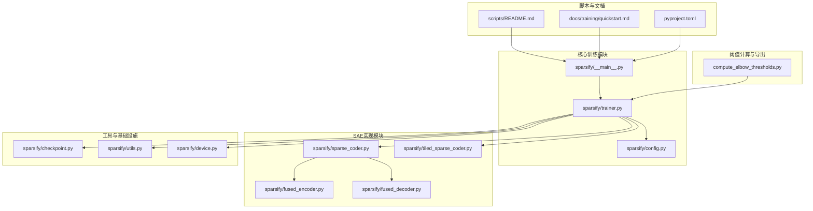
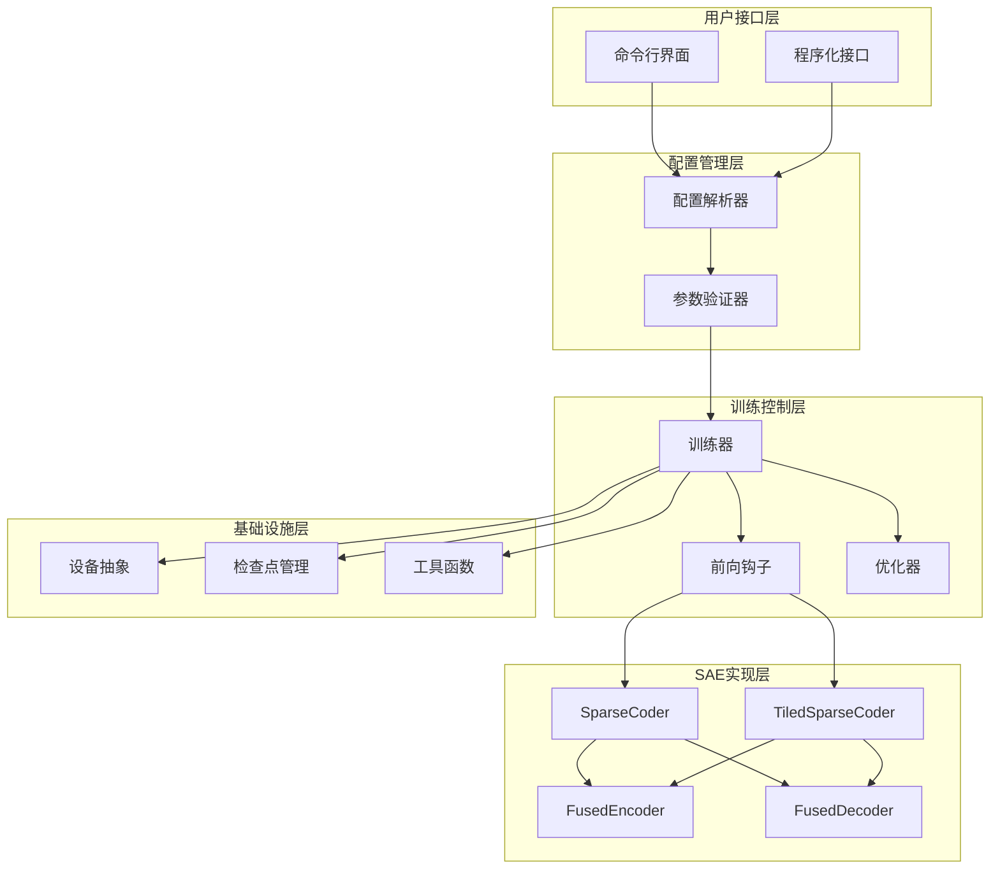
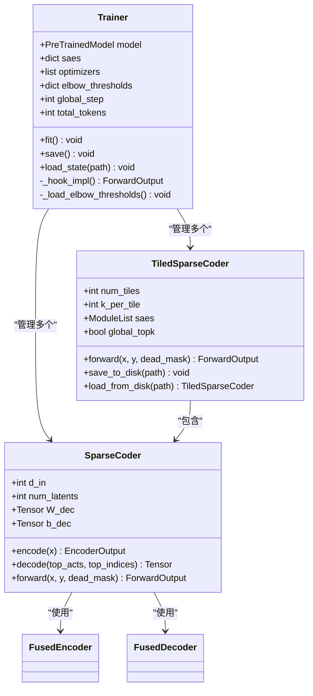
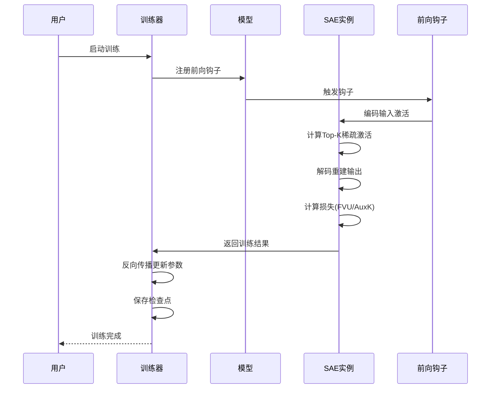
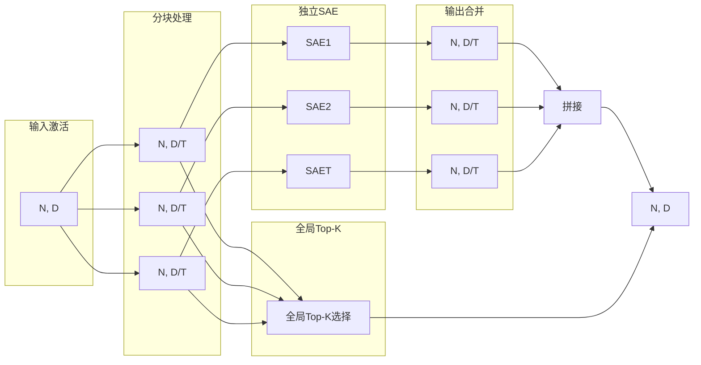
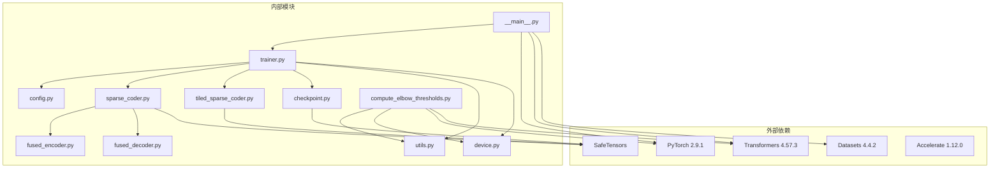

# Sae Improvement System

<cite>
**本文档引用的文件**
- [README.md](file://README.md)
- [sparsify/__main__.py](file://sparsify/__main__.py)
- [sparsify/config.py](file://sparsify/config.py)
- [sparsify/trainer.py](file://sparsify/trainer.py)
- [sparsify/sparse_coder.py](file://sparsify/sparse_coder.py)
- [sparsify/tiled_sparse_coder.py](file://sparsify/tiled_sparse_coder.py)
- [sparsify/fused_encoder.py](file://sparsify/fused_encoder.py)
- [sparsify/fused_decoder.py](file://sparsify/fused_decoder.py)
- [sparsify/checkpoint.py](file://sparsify/checkpoint.py)
- [sparsify/utils.py](file://sparsify/utils.py)
- [sparsify/device.py](file://sparsify/device.py)
- [compute_elbow_thresholds.py](file://compute_elbow_thresholds.py)
- [scripts/README.md](file://scripts/README.md)
- [docs/training/quickstart.md](file://docs/training/quickstart.md)
- [pyproject.toml](file://pyproject.toml)
</cite>

## 目录
1. [简介](#简介)
2. [项目结构](#项目结构)
3. [核心组件](#核心组件)
4. [架构概览](#架构概览)
5. [详细组件分析](#详细组件分析)
6. [依赖关系分析](#依赖关系分析)
7. [性能考虑](#性能考虑)
8. [故障排除指南](#故障排除指南)
9. [结论](#结论)
10. [附录](#附录)

## 简介

Sae Improvement System 是一个基于稀疏自编码器（SAE）的训练与导出系统，专门用于在 Transformer 模型的激活值上进行稀疏编码，为 LUTurbo 推理引擎提供优化支持。该系统的核心目标是在 NVIDIA/CUDA 平台上高效训练 SAE，生成阈值统计信息，并将训练好的检查点导出为 LUT 友好的格式。

系统采用模块化设计，支持多种训练模式，包括标准 SAE、分块 SAE（Tiled SAE）以及带有 Hadamard 预处理的变体。通过前向钩子机制捕获 Transformer 激活值，实现了对特定层和模块的精确控制。

## 项目结构

项目采用清晰的模块化组织结构，主要分为以下几个核心部分：



**图表来源**
- [sparsify/__main__.py:1-211](file://sparsify/__main__.py#L1-211)
- [sparsify/trainer.py:1-760](file://sparsify/trainer.py#L1-760)
- [sparsify/config.py:1-149](file://sparsify/config.py#L1-149)

**章节来源**
- [README.md:1-153](file://README.md#L1-L153)
- [pyproject.toml:1-131](file://pyproject.toml#L1-L131)

## 核心组件

### 训练入口与配置管理

系统的核心入口位于 `sparsify/__main__.py`，提供了完整的命令行接口和训练流程控制。配置管理通过 `sparsify/config.py` 实现，支持灵活的参数设置和验证。

关键特性包括：
- **多GPU分布式训练支持**：通过 PyTorch DDP 实现
- **动态配置解析**：支持复杂的数据集和模型参数
- **检查点管理**：完整的训练状态保存和恢复机制

### SAE架构实现

系统提供两种主要的 SAE 实现方式：

1. **标准稀疏自编码器**：实现基础的稀疏编码和解码功能
2. **分块稀疏自编码器**：支持将输入激活分割为多个块，每块独立训练

### 性能优化组件

- **融合编解码器**：针对 NPU/CUDA 平台优化的自定义 Autograd 函数
- **设备抽象层**：统一的 CUDA/NPU/CPU 设备管理
- **内存优化**：通过阈值判断避免大规模矩阵乘法

**章节来源**
- [sparsify/__main__.py:131-211](file://sparsify/__main__.py#L131-L211)
- [sparsify/config.py:7-149](file://sparsify/config.py#L7-L149)
- [sparsify/sparse_coder.py:36-269](file://sparsify/sparse_coder.py#L36-L269)

## 架构概览

系统采用分层架构设计，从底层的设备抽象到顶层的训练控制器，形成了清晰的职责分离：



**图表来源**
- [sparsify/trainer.py:39-760](file://sparsify/trainer.py#L39-L760)
- [sparsify/sparse_coder.py:36-269](file://sparsify/sparse_coder.py#L36-L269)
- [sparsify/tiled_sparse_coder.py:17-342](file://sparsify/tiled_sparse_coder.py#L17-L342)

## 详细组件分析

### 训练器组件分析

训练器是系统的核心组件，负责协调整个训练过程。其设计体现了高度的模块化和可扩展性。

#### 训练器类结构



**图表来源**
- [sparsify/trainer.py:39-760](file://sparsify/trainer.py#L39-L760)
- [sparsify/sparse_coder.py:36-269](file://sparsify/sparse_coder.py#L36-L269)
- [sparsify/tiled_sparse_coder.py:17-342](file://sparsify/tiled_sparse_coder.py#L17-L342)

#### 训练流程时序图



**图表来源**
- [sparsify/trainer.py:481-574](file://sparsify/trainer.py#L481-L574)
- [sparsify/sparse_coder.py:188-239](file://sparsify/sparse_coder.py#L188-L239)

**章节来源**
- [sparsify/trainer.py:162-727](file://sparsify/trainer.py#L162-L727)

### SAE编码器组件分析

编码器组件实现了高效的 Top-K 选择机制，通过自定义 Autograd 函数优化了梯度计算过程。

#### 编码器算法流程


**图表来源**
- [sparsify/fused_encoder.py:21-107](file://sparsify/fused_encoder.py#L21-L107)

#### 编码器性能优化

编码器采用了智能的内存管理策略，根据矩阵大小自动选择最优的计算路径：

- **内存充足时**：使用密集矩阵乘法，避免散列操作
- **内存受限时**：回退到传统的 gather+bmm 方法
- **阈值判断**：基于 `_MATMUL_THRESHOLD = 256MB` 进行决策

**章节来源**
- [sparsify/fused_encoder.py:18-107](file://sparsify/fused_encoder.py#L18-L107)

### 分块SAE组件分析

分块 SAE 是系统的重要创新，通过将输入激活分割为多个独立的块，实现了更好的并行性和可扩展性。

#### 分块架构设计



**图表来源**
- [sparsify/tiled_sparse_coder.py:17-342](file://sparsify/tiled_sparse_coder.py#L17-L342)

#### 分块策略对比

系统提供了两种主要的分块策略：

1. **独立Top-K策略**：每个块独立选择 Top-K 激活
2. **全局Top-K策略**：所有块共享相同的激活预算

**章节来源**
- [sparsify/tiled_sparse_coder.py:172-253](file://sparsify/tiled_sparse_coder.py#L172-L253)

### 阈值计算组件分析

阈值计算组件负责分析模型激活值的分布，为后续的 LUT 导出提供关键的统计信息。

#### 阈值计算流程


**图表来源**
- [compute_elbow_thresholds.py:35-95](file://compute_elbow_thresholds.py#L35-L95)
- [compute_elbow_thresholds.py:172-200](file://compute_elbow_thresholds.py#L172-L200)

**章节来源**
- [compute_elbow_thresholds.py:364-660](file://compute_elbow_thresholds.py#L364-L660)

## 依赖关系分析

系统采用模块化设计，各组件之间的依赖关系清晰明确：



**图表来源**
- [pyproject.toml:12-28](file://pyproject.toml#L12-L28)
- [sparsify/__main__.py:9-26](file://sparsify/__main__.py#L9-L26)

**章节来源**
- [pyproject.toml:1-131](file://pyproject.toml#L1-L131)

## 性能考虑

系统在多个层面进行了性能优化，确保在大规模训练场景下的高效运行：

### 内存优化策略

1. **动态阈值判断**：根据矩阵大小自动选择最优计算路径
2. **延迟梯度计算**：避免不必要的张量复制和内存分配
3. **混合精度训练**：在支持的平台上自动启用 bfloat16

### 训练效率优化

1. **批量处理**：通过梯度累积和微批处理提高 GPU 利用率
2. **分布式训练**：支持多GPU并行训练
3. **检查点管理**：智能的检查点保存策略，平衡性能和可靠性

### 设备兼容性

系统通过设备抽象层实现了对不同硬件平台的统一支持：
- **CUDA**：完整的原生支持，最高性能
- **NPU**：通过自定义 Autograd 函数优化后端兼容性
- **CPU**：基本功能支持，适合调试和小规模实验

## 故障排除指南

### 常见问题及解决方案

#### 训练相关问题

**问题1：CUDA OOM（显存不足）**
- **原因**：批量大小过大或模型参数过多
- **解决方案**：减小 batch_size 或增加 grad_acc_steps

**问题2：训练速度缓慢**
- **原因**：缺少梯度累积或未启用编译优化
- **解决方案**：增加 grad_acc_steps 或启用 compile_model

#### 检查点相关问题

**问题3：检查点加载失败**
- **原因**：检查点格式不兼容或文件损坏
- **解决方案**：重新训练或检查文件完整性

**问题4：分布式训练同步问题**
- **原因**：进程间通信异常或设备ID配置错误
- **解决方案**：检查环境变量和网络连接

#### 性能相关问题

**问题5：NPU后端性能不佳**
- **原因**：未正确配置设备或缺少必要的驱动
- **解决方案**：确认 torch_npu 安装和设备可用性

**章节来源**
- [sparsify/trainer.py:139-161](file://sparsify/trainer.py#L139-L161)
- [sparsify/checkpoint.py:44-73](file://sparsify/checkpoint.py#L44-L73)

## 结论

Sae Improvement System 提供了一个完整、高效且可扩展的稀疏自编码器训练框架。系统的主要优势包括：

1. **模块化设计**：清晰的组件分离和职责划分
2. **性能优化**：多层面的性能优化策略
3. **平台兼容**：统一的设备抽象层支持多种硬件
4. **易用性**：简洁的命令行接口和丰富的配置选项

系统特别适合在 NVIDIA/CUDA 平台上进行大规模 SAE 训练，为 LUTurbo 推理引擎提供了高质量的稀疏编码支持。通过合理的参数配置和硬件资源规划，用户可以在保证训练质量的同时获得最佳的训练效率。

## 附录

### 快速开始指南

```bash
# 安装依赖
pip install -e .[dev]

# 基本训练示例
python -m sparsify Qwen/Qwen3-0.6B HuggingFaceFW/fineweb \
  --data_args "name=sample-10BT" \
  --text_column text \
  --hookpoints "layers.[7,14].self_attn.o_proj" \
  --batch_size 1 \
  --grad_acc_steps 8 \
  --ctx_len 2048 \
  --sae.expansion_factor 8 \
  --sae.k 128 \
  --save_dir checkpoints \
  --run_name qwen3-oproj-demo
```

### 超参数调优建议

1. **探索阶段**：使用粗粒度的超参数网格进行快速扫描
2. **优化阶段**：在发现的最优区域进行细粒度搜索
3. **验证阶段**：使用更大的训练规模验证最终配置

### 平台支持矩阵

| 功能 | CUDA | NPU | CPU |
|------|------|-----|-----|
| 标准训练 | ✅ 完全支持 | ✅ 基本支持 | ✅ 基本支持 |
| 分块训练 | ✅ 完全支持 | ✅ 基本支持 | ✅ 基本支持 |
| 混合精度 | ✅ 自动启用 | ✅ 自动启用 | ❌ 不支持 |
| 分布式训练 | ✅ 完全支持 | ✅ 完全支持 | ❌ 不支持 |