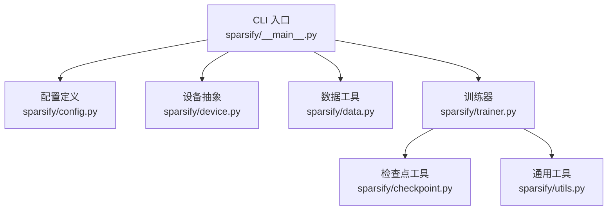
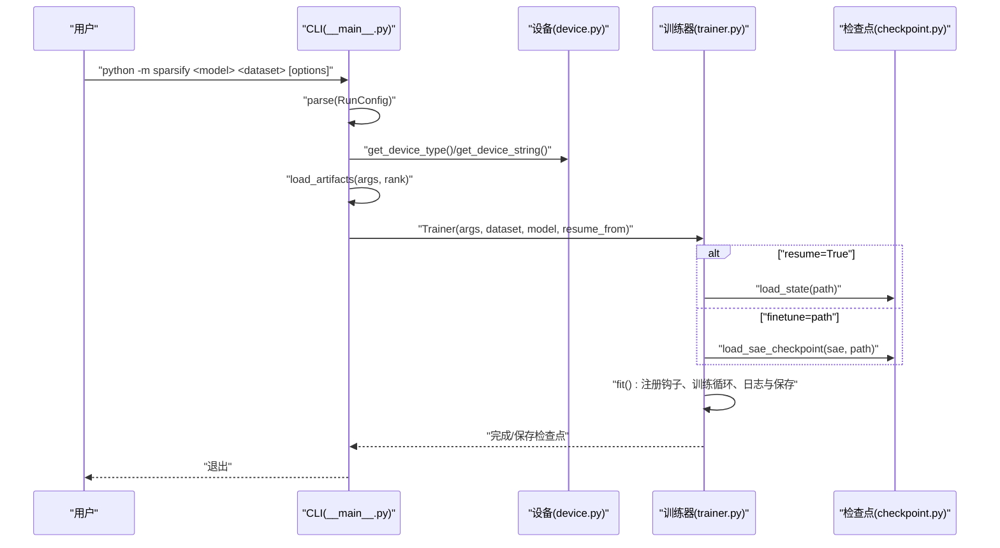
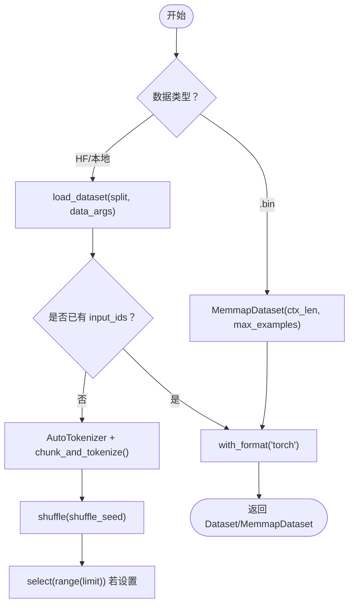
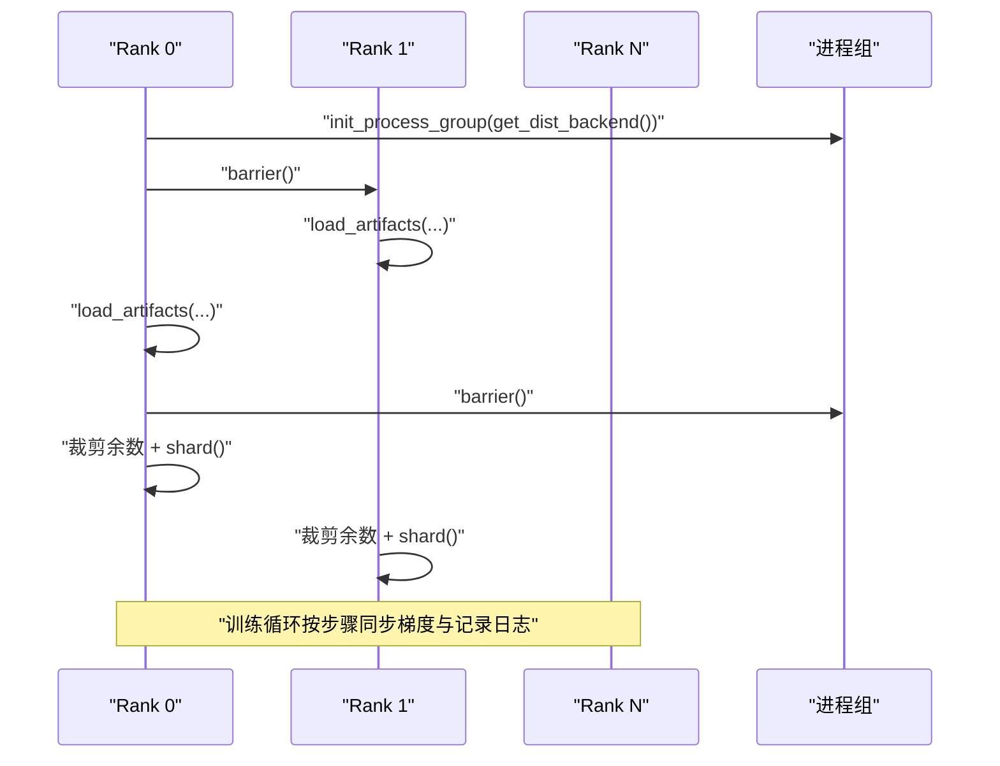
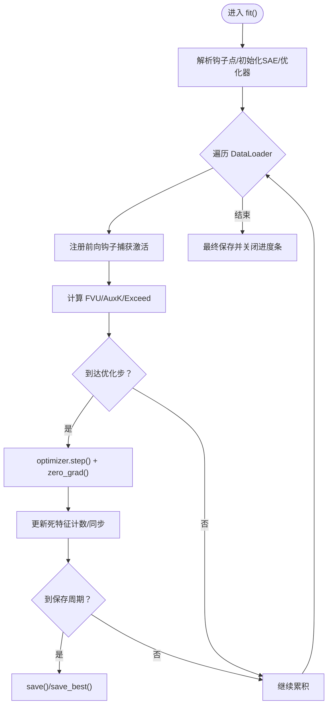
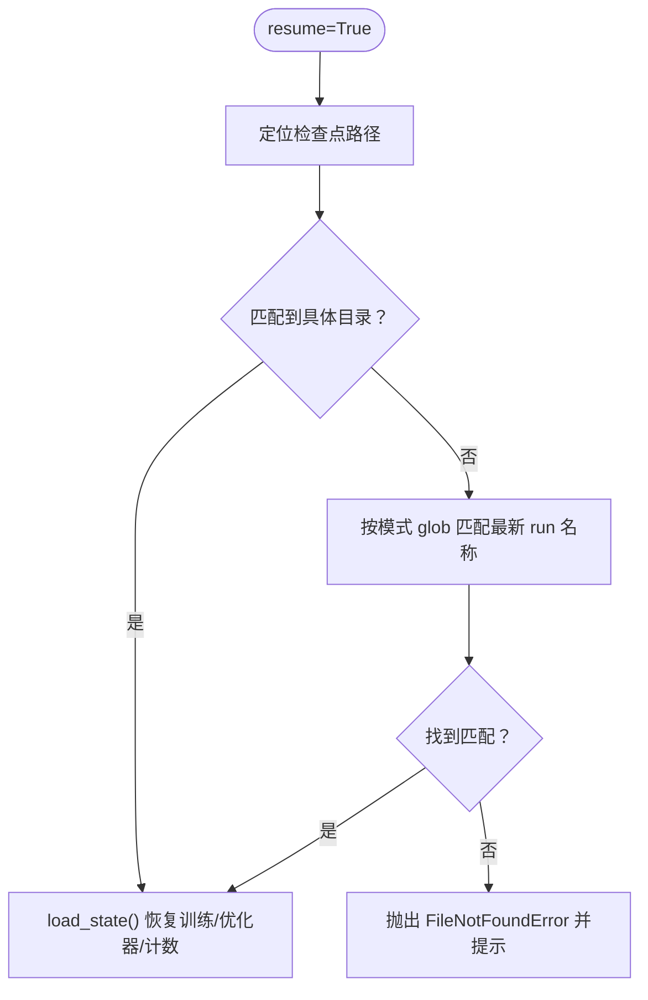
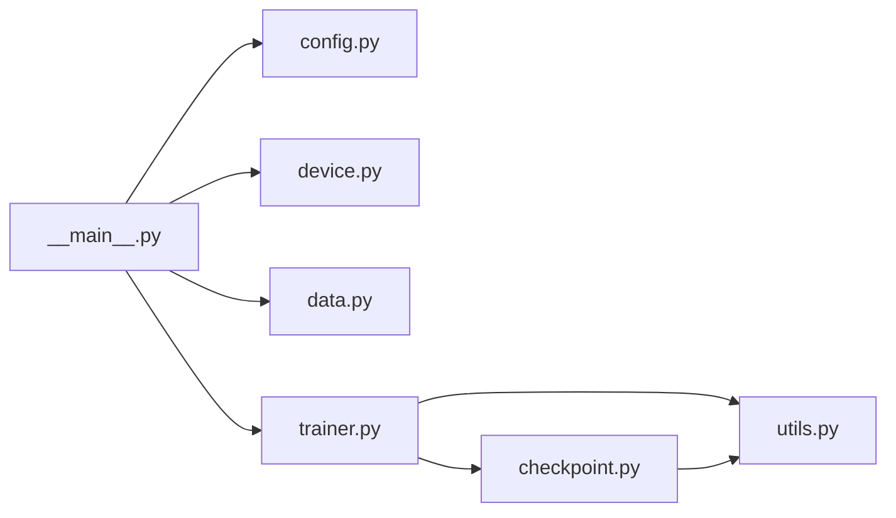

# 主 CLI 接口

<cite>
**本文引用的文件**
- [sparsify/__main__.py](file://sparsify/__main__.py)
- [sparsify/config.py](file://sparsify/config.py)
- [sparsify/trainer.py](file://sparsify/trainer.py)
- [sparsify/checkpoint.py](file://sparsify/checkpoint.py)
- [sparsify/data.py](file://sparsify/data.py)
- [sparsify/device.py](file://sparsify/device.py)
- [sparsify/utils.py](file://sparsify/utils.py)
- [docs/training/config-reference.md](file://docs/training/config-reference.md)
- [docs/training/quickstart.md](file://docs/training/quickstart.md)
- [scripts/first_time_train/Qwen3-0.6B/script.sh](file://scripts/first_time_train/Qwen3-0.6B/script.sh)
- [scripts/first_time_train/Qwen3-4B/script.sh](file://scripts/first_time_train/Qwen3-4B/script.sh)
- [scripts/first_time_train/Qwen3-8B/script.sh](file://scripts/first_time_train/Qwen3-8B/script.sh)
- [README.md](file://README.md)
</cite>

## 目录
1. [简介](#简介)
2. [项目结构](#项目结构)
3. [核心组件](#核心组件)
4. [架构总览](#架构总览)
5. [详细组件分析](#详细组件分析)
6. [依赖关系分析](#依赖关系分析)
7. [性能考虑](#性能考虑)
8. [故障排查指南](#故障排查指南)
9. [结论](#结论)
10. [附录](#附录)

## 简介
本文件面向使用主 CLI 接口进行训练的用户，系统性说明 python -m sparsify 命令的完整用法与最佳实践。内容覆盖：
- 命令行参数、位置参数与选项的含义与默认值
- 模型名称、数据集路径、上下文长度等关键参数的配置方法
- 单机训练、分布式训练（DDP）与检查点恢复/微调的典型场景
- 参数验证规则、错误处理机制与常见问题排查

## 项目结构
主 CLI 入口位于 sparsify/__main__.py，其通过 RunConfig 继承 TrainConfig，统一暴露训练与 SAE 架构参数；Trainer 负责训练循环与日志保存；CheckpointMixin 提供检查点加载/保存能力；device.py 抽象设备后端；data.py 提供分词与内存映射数据集工具；utils.py 提供解析字符串参数、宽度解析等辅助。

图表来源
- [sparsify/__main__.py:1-211](file://sparsify/__main__.py#L1-L211)
- [sparsify/config.py:1-149](file://sparsify/config.py#L1-L149)
- [sparsify/trainer.py:1-760](file://sparsify/trainer.py#L1-L760)
- [sparsify/checkpoint.py:1-302](file://sparsify/checkpoint.py#L1-L302)
- [sparsify/data.py:1-158](file://sparsify/data.py#L1-L158)
- [sparsify/device.py:1-118](file://sparsify/device.py#L1-L118)
- [sparsify/utils.py:1-227](file://sparsify/utils.py#L1-L227)

章节来源
- [sparsify/__main__.py:1-211](file://sparsify/__main__.py#L1-L211)
- [sparsify/config.py:1-149](file://sparsify/config.py#L1-L149)
- [sparsify/trainer.py:1-760](file://sparsify/trainer.py#L1-L760)
- [sparsify/checkpoint.py:1-302](file://sparsify/checkpoint.py#L1-L302)
- [sparsify/data.py:1-158](file://sparsify/data.py#L1-L158)
- [sparsify/device.py:1-118](file://sparsify/device.py#L1-L118)
- [sparsify/utils.py:1-227](file://sparsify/utils.py#L1-L227)

## 核心组件
- RunConfig（CLI 配置）
  - 位置参数：model（模型名称或本地路径）、dataset（数据集名称/路径）
  - 关键运行参数：ctx_len（上下文长度）、split（数据集切分）、hf_token（HF 访问令牌）、revision（模型版本）、max_examples（最大样本数）、text_column（文本列名）、shuffle_seed（打乱种子）、data_preprocessing_num_proc（预处理并行度）、data_args（传递给 load_dataset 的额外参数）
  - 恢复与微调：resume（从检查点恢复）、finetune（从已有权重微调）
- TrainConfig（训练配置）
  - SAE 架构：sae.expansion_factor、sae.normalize_decoder、sae.num_latents、sae.k
  - 训练循环：batch_size、grad_acc_steps、micro_acc_steps、max_tokens、lr、auxk_alpha、dead_feature_threshold
  - 钩子选择：hookpoints、layers、layer_stride、init_seeds
  - 分块与旋转：num_tiles、global_topk、input_mixing、use_hadamard、hadamard_block_size、hadamard_seed、hadamard_use_perm
  - 编译与日志：compile_model、save_every、save_best、save_dir、log_to_wandb、run_name、wandb_project、wandb_log_frequency、finetune
- Trainer（训练器）
  - 解析钩子点、初始化 SAE、构建优化器、执行前向钩子、累积指标、梯度同步与保存
- CheckpointMixin（检查点）
  - 加载/保存训练状态、优化器状态、SAE 权重、Hadamard 状态、最佳检查点

章节来源
- [sparsify/__main__.py:31-80](file://sparsify/__main__.py#L31-L80)
- [sparsify/config.py:28-149](file://sparsify/config.py#L28-L149)
- [sparsify/trainer.py:39-161](file://sparsify/trainer.py#L39-L161)
- [sparsify/checkpoint.py:101-302](file://sparsify/checkpoint.py#L101-L302)

## 架构总览
下图展示了从 CLI 到训练器的关键交互流程，包括参数解析、模型与数据加载、分布式初始化、钩子注册与训练循环。

图表来源
- [sparsify/__main__.py:131-207](file://sparsify/__main__.py#L131-L207)
- [sparsify/trainer.py:162-729](file://sparsify/trainer.py#L162-L729)
- [sparsify/checkpoint.py:149-245](file://sparsify/checkpoint.py#L149-L245)
- [sparsify/device.py:34-98](file://sparsify/device.py#L34-L98)

## 详细组件分析

### CLI 参数与默认值
- 位置参数
  - model：默认为 HuggingFaceTB/SmolLM2-135M
  - dataset：默认为 EleutherAI/SmolLM2-10B
- 运行参数
  - split：默认 "train"
  - ctx_len：默认 2048
  - hf_token：默认 None
  - revision：默认 None
  - max_examples：默认 None
  - resume：默认 False
  - text_column：默认 "text"
  - shuffle_seed：默认 42
  - data_preprocessing_num_proc：默认 CPU 核数的一半
  - data_args：默认空字符串，支持 "k=v,arg=w" 形式传参
- 训练参数（继承自 TrainConfig）
  - 批大小、梯度累积、微批次、最大 token 数、学习率、AuxK 权重、死特征阈值等
  - 钩子点、层索引、层步长、随机种子列表
  - 分块 SAE、全局 top-k、输入混洗、Hadamard 旋转、编译模型、保存频率、W&B 日志、运行名、保存目录、微调路径等

章节来源
- [sparsify/__main__.py:31-80](file://sparsify/__main__.py#L31-L80)
- [sparsify/config.py:28-149](file://sparsify/config.py#L28-L149)
- [docs/training/config-reference.md:12-170](file://docs/training/config-reference.md#L12-L170)

### 数据加载与预处理
- 支持三类数据源
  - HuggingFace 数据集：自动分词与切块，列名由 text_column 指定
  - 本地 load_from_disk 数据集：尝试直接加载
  - 内存映射 .bin 文件：按 ctx_len 读取
- 预处理并行度与打乱、上限样本数、格式转换

图表来源
- [sparsify/__main__.py:81-128](file://sparsify/__main__.py#L81-L128)
- [sparsify/data.py:16-101](file://sparsify/data.py#L16-L101)

章节来源
- [sparsify/__main__.py:81-128](file://sparsify/__main__.py#L81-L128)
- [sparsify/data.py:16-101](file://sparsify/data.py#L16-L101)

### 分布式训练（DDP）
- 通过环境变量 LOCAL_RANK 检测 DDP，初始化进程组，设置设备后端（NCCL/HCCL/Gloo）
- rank 0 加载模型与数据后，其他 rank 等待屏障；随后对数据做余数裁剪与分片，保证各 rank 示例数一致
- 训练循环中按 grad_acc_steps 同步梯度，按 save_every 保存，按 wandb_log_frequency 记录日志

图表来源
- [sparsify/__main__.py:134-169](file://sparsify/__main__.py#L134-L169)
- [sparsify/device.py:92-98](file://sparsify/device.py#L92-L98)

章节来源
- [sparsify/__main__.py:134-169](file://sparsify/__main__.py#L134-L169)
- [sparsify/device.py:92-98](file://sparsify/device.py#L92-L98)

### 训练循环与钩子
- Trainer 在 fit() 中注册模块输入钩子，捕获激活并计算损失与指标
- 支持 Hadamard 旋转、Exceed 指标（需 elbow 阈值）、死特征检测、编译模型（CUDA）
- 按 save_every 保存常规检查点，按 save_best 保存每钩子最佳检查点

图表来源
- [sparsify/trainer.py:162-729](file://sparsify/trainer.py#L162-L729)

章节来源
- [sparsify/trainer.py:162-729](file://sparsify/trainer.py#L162-L729)

### 检查点恢复与微调
- 恢复（resume=True）
  - 优先匹配 save_dir/run_name 或 run_name_dp*_bs*_ga*_ef*_k*_* 最新目录
  - 不存在则报错并提示指定完整路径
- 微调（finetune=path）
  - 从已有检查点树加载 SAE 权重，不恢复训练状态
- 加载/保存细节
  - 顶层 config.json、state.pt、optimizer_*.pt、rank_0_state.pt
  - 每个钩子点目录包含 cfg.json 与 sae.safetensors
  - tiled 模式下每个 tile 存储独立权重

图表来源
- [sparsify/__main__.py:173-195](file://sparsify/__main__.py#L173-L195)
- [sparsify/checkpoint.py:149-197](file://sparsify/checkpoint.py#L149-L197)

章节来源
- [sparsify/__main__.py:173-195](file://sparsify/__main__.py#L173-L195)
- [sparsify/checkpoint.py:149-197](file://sparsify/checkpoint.py#L149-L197)

### 参数验证规则与错误处理
- TrainConfig.__post_init__ 强制校验
  - 不能同时指定 layers 与 layer_stride
  - init_seeds 必须非空
  - exceed_alphas 必须全为正
  - elbow_threshold_path 存在性
  - hadamard_block_size 必须为正的 2 的幂
  - compile_model 在非 CUDA 设备上自动禁用
- __main__.py 中的异常
  - 数据集加载失败时回退到 load_from_disk
  - 恢复找不到匹配检查点时抛出 FileNotFoundError 并给出提示
- 设备与后端
  - 自动检测 CUDA/NPU/CPu，选择对应后端与 bf16 支持

章节来源
- [sparsify/config.py:124-149](file://sparsify/config.py#L124-L149)
- [sparsify/__main__.py:99-106](file://sparsify/__main__.py#L99-L106)
- [sparsify/__main__.py:191-195](file://sparsify/__main__.py#L191-L195)
- [sparsify/device.py:34-64](file://sparsify/device.py#L34-L64)

## 依赖关系分析
- CLI 依赖配置与设备抽象，间接依赖数据与训练器
- Trainer 依赖 CheckpointMixin、设备与工具函数
- CheckpointMixin 依赖 safetensors 与调度器包装器
- 数据工具依赖 datasets 与 transformers

图表来源
- [sparsify/__main__.py:15-26](file://sparsify/__main__.py#L15-L26)
- [sparsify/trainer.py:21-34](file://sparsify/trainer.py#L21-L34)
- [sparsify/checkpoint.py:3-17](file://sparsify/checkpoint.py#L3-L17)

章节来源
- [sparsify/__main__.py:15-26](file://sparsify/__main__.py#L15-L26)
- [sparsify/trainer.py:21-34](file://sparsify/trainer.py#L21-L34)
- [sparsify/checkpoint.py:3-17](file://sparsify/checkpoint.py#L3-L17)

## 性能考虑
- CUDA 上可启用 compile_model 以融合小算子，减少内核启动开销
- 使用 memmap 数据集可显著降低内存占用
- 合理设置 batch_size、grad_acc_steps、micro_acc_steps 以平衡显存与吞吐
- 使用 W&B 日志时注意网络与磁盘 IO 对性能的影响
- 在多卡场景下，确保数据余数被裁剪并按 rank 分片，避免死锁

## 故障排查指南
- 恢复失败：确认 save_dir/run_name 或 run_name 模式是否存在匹配目录；若无，提供完整路径
- 数据集加载异常：检查 data_args 语法与数据集可用性；必要时改用 load_from_disk
- 梯度不同步或死锁：确保 DDP 下已按世界规模裁剪余数并分片
- CUDA/NPU 不兼容：compile_model 仅在 CUDA 生效；bf16 支持因平台而异
- 检查点格式不匹配：tiled 与非 tiled 混用会触发类型/维度错误

章节来源
- [sparsify/__main__.py:191-195](file://sparsify/__main__.py#L191-L195)
- [sparsify/__main__.py:99-106](file://sparsify/__main__.py#L99-L106)
- [sparsify/trainer.py:603-615](file://sparsify/trainer.py#L603-L615)
- [sparsify/config.py:138-149](file://sparsify/config.py#L138-L149)
- [sparsify/device.py:58-64](file://sparsify/device.py#L58-L64)

## 结论
主 CLI 接口提供了从模型与数据加载、分布式训练到检查点管理的完整链路。通过合理配置 RunConfig/TrainConfig 参数，用户可以高效地在单机或多卡环境下开展 SAE 训练，并结合阈值统计与导出流程完成端到端工作流。

## 附录

### 常见命令示例
- 单机最小示例
  - 参考：[README.md:36-52](file://README.md#L36-L52)
- 多钩子范围训练（Qwen3）
  - 参考：[scripts/first_time_train/Qwen3-0.6B/script.sh:11-47](file://scripts/first_time_train/Qwen3-0.6B/script.sh#L11-L47)
- 分布式训练（torchrun）
  - 参考：[scripts/first_time_train/Qwen3-4B/script.sh:11-47](file://scripts/first_time_train/Qwen3-4B/script.sh#L11-L47)
- 恢复与微调
  - 参考：[docs/training/quickstart.md:60-78](file://docs/training/quickstart.md#L60-L78)

### 参数速查表
- 模型与数据
  - model、dataset、split、ctx_len、hf_token、revision、max_examples、text_column、shuffle_seed、data_preprocessing_num_proc、data_args
- 训练与 SAE
  - batch_size、grad_acc_steps、micro_acc_steps、max_tokens、lr、auxk_alpha、dead_feature_threshold、sae.expansion_factor、sae.normalize_decoder、sae.num_latents、sae.k
- 钩子与分块
  - hookpoints、layers、layer_stride、init_seeds、num_tiles、global_topk、input_mixing
- 旋转与编译
  - use_hadamard、hadamard_block_size、hadamard_seed、hadamard_use_perm、compile_model
- 日志与保存
  - log_to_wandb、run_name、wandb_project、wandb_log_frequency、save_dir、save_every、save_best、finetune
- 恢复与微调
  - resume、finetune

章节来源
- [docs/training/config-reference.md:12-170](file://docs/training/config-reference.md#L12-L170)
- [README.md:36-52](file://README.md#L36-L52)
- [docs/training/quickstart.md:60-78](file://docs/training/quickstart.md#L60-L78)