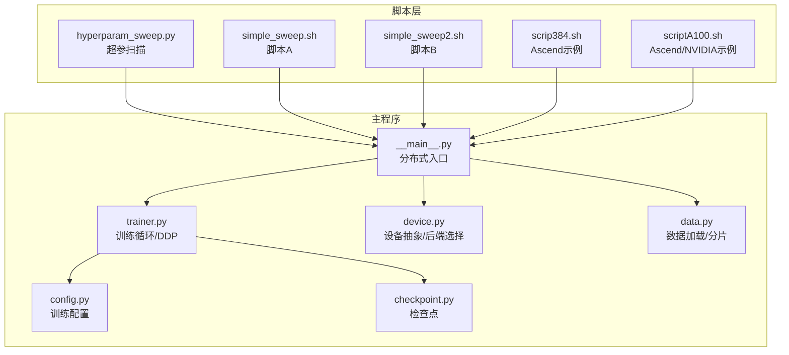
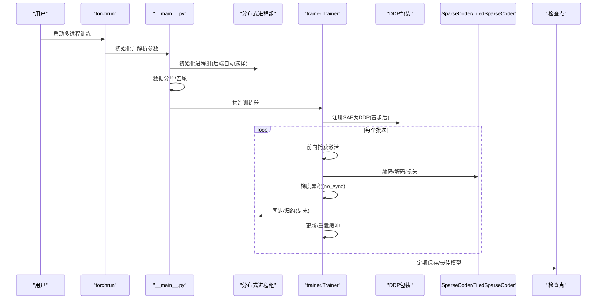
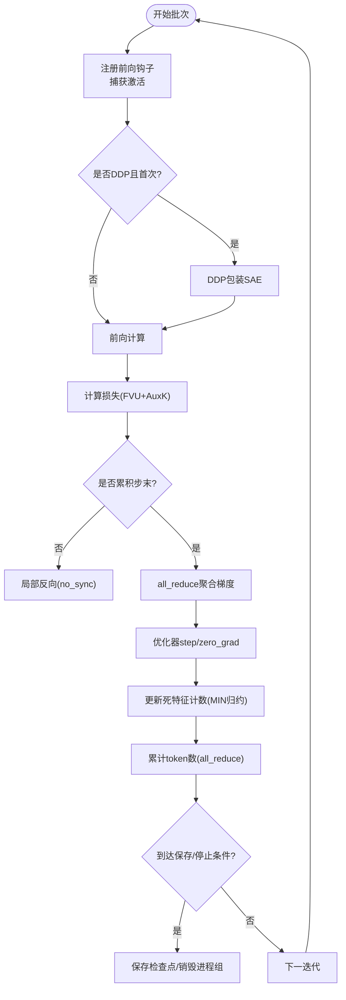
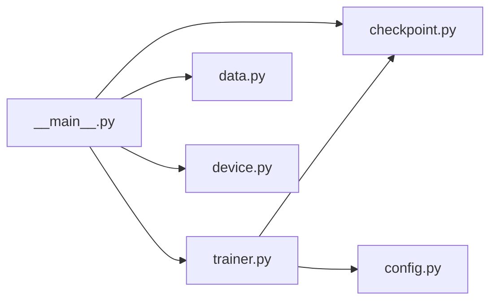

# 分布式训练脚本

<cite>
**本文档引用的文件**
- [PARALLEL_USAGE.md](file://scripts/PARALLEL_USAGE.md)
- [README.md](file://scripts/README.md)
- [hyperparam_sweep.py](file://scripts/hyperparam_sweep.py)
- [simple_sweep.sh](file://scripts/simple_sweep.sh)
- [simple_sweep2.sh](file://scripts/simple_sweep2.sh)
- [scrip384.sh](file://scripts/ascend/scrip384.sh)
- [scriptA100.sh](file://scripts/ascend/scriptA100.sh)
- [trainer.py](file://sparsify/trainer.py)
- [device.py](file://sparsify/device.py)
- [config.py](file://sparsify/config.py)
- [checkpoint.py](file://sparsify/checkpoint.py)
- [__main__.py](file://sparsify/__main__.py)
- [data.py](file://sparsify/data.py)
- [qwen3-guide.md](file://docs/training/qwen3-guide.md)
</cite>

## 目录
1. [简介](#简介)
2. [项目结构](#项目结构)
3. [核心组件](#核心组件)
4. [架构总览](#架构总览)
5. [详细组件分析](#详细组件分析)
6. [依赖关系分析](#依赖关系分析)
7. [性能考虑](#性能考虑)
8. [故障排除指南](#故障排除指南)
9. [结论](#结论)
10. [附录](#附录)

## 简介
本指南面向需要在多 GPU、多节点环境下进行大规模稀疏自编码器（SAE）训练的研究者与工程师。文档系统性阐述了分布式训练的使用方法、参数配置、通信协议、负载均衡策略，并覆盖 NVIDIA GPU 与 Ascend NPU 的支持情况。同时提供集群部署建议、网络配置要求、性能优化技巧、内存管理策略以及故障恢复机制，帮助用户在不同硬件环境中稳定高效地运行大规模训练任务。

## 项目结构
该仓库围绕“分布式训练脚本”提供了两类入口：
- Python 超参扫描脚本：支持灵活配置、错误处理、Dry-run、断点续跑等特性，适合批量实验与自动化。
- Shell 超参扫描脚本：无需额外 Python 依赖，便于快速理解与修改，适合探索性实验。
- 主训练入口：通过 torchrun 启动 DDP，自动适配 CUDA/NCCL 或 NPU/HCCN，负责数据分片、模型前向钩子、梯度累积、分布式同步与检查点保存。

**图表来源**
- [hyperparam_sweep.py:1-273](file://scripts/hyperparam_sweep.py#L1-L273)
- [simple_sweep.sh:1-133](file://scripts/simple_sweep.sh#L1-L133)
- [simple_sweep2.sh:1-133](file://scripts/simple_sweep2.sh#L1-L133)
- [scrip384.sh:1-36](file://scripts/ascend/scrip384.sh#L1-L36)
- [scriptA100.sh:1-62](file://scripts/ascend/scriptA100.sh#L1-L62)
- [__main__.py:131-211](file://sparsify/__main__.py#L131-L211)
- [trainer.py:162-760](file://sparsify/trainer.py#L162-L760)
- [device.py:1-118](file://sparsify/device.py#L1-L118)
- [config.py:1-149](file://sparsify/config.py#L1-L149)
- [checkpoint.py:1-302](file://sparsify/checkpoint.py#L1-L302)
- [data.py:1-158](file://sparsify/data.py#L1-L158)

**章节来源**
- [PARALLEL_USAGE.md:1-166](file://scripts/PARALLEL_USAGE.md#L1-L166)
- [README.md:1-299](file://scripts/README.md#L1-L299)

## 核心组件
- 分布式入口与初始化
  - 通过 torchrun 启动，自动检测设备类型并初始化进程组；在多进程时对数据进行分片，保证可整除性以避免死锁。
- 训练循环与 DDP 包装
  - 在捕获激活的前向钩子中按需包装 SAE 为 DDP，支持 no_sync 以降低同步开销；实现梯度累积、指标聚合与分布式 all_reduce。
- 设备抽象与后端选择
  - 自动识别 CUDA/NCCL 或 NPU/HCCN，统一事件、同步、bf16 支持与 autocast。
- 配置系统
  - 通过数据类定义训练参数，含 SAE 架构、梯度累积、日志频率、保存策略、Hadamard 旋转、编译优化等。
- 检查点与恢复
  - 支持常规与分块（Tiled）两种检查点格式，跨进程保存/加载训练状态与优化器状态，支持最佳模型保存。
- 数据加载与分片
  - 支持 HF Dataset 与内存映射二进制数据集，自动分片与去尾处理，保证各进程批大小一致。

**章节来源**
- [__main__.py:131-211](file://sparsify/__main__.py#L131-L211)
- [trainer.py:162-760](file://sparsify/trainer.py#L162-L760)
- [device.py:1-118](file://sparsify/device.py#L1-L118)
- [config.py:1-149](file://sparsify/config.py#L1-L149)
- [checkpoint.py:1-302](file://sparsify/checkpoint.py#L1-L302)
- [data.py:1-158](file://sparsify/data.py#L1-L158)

## 架构总览
分布式训练采用“主进程引导 + 多进程 DDP”的模式：
- 主进程解析命令行参数，加载模型与数据，初始化分布式后对数据进行分片。
- 子进程各自注册前向钩子，捕获目标模块输入作为 SAE 特征激活，按配置进行编码/解码与损失计算。
- 梯度在累积步末尾统一同步，更新参数并定期保存检查点。

**图表来源**
- [__main__.py:131-211](file://sparsify/__main__.py#L131-L211)
- [trainer.py:162-760](file://sparsify/trainer.py#L162-L760)
- [checkpoint.py:199-302](file://sparsify/checkpoint.py#L199-L302)

## 详细组件分析

### 分布式入口与参数传递
- torchrun 参数
  - nproc_per_node：每节点 GPU 数量
  - master_port：主节点端口（脚本内自动递增以避免冲突）
  - -m sparsify：以模块方式启动主程序
- 主程序参数解析
  - 模型路径、数据集路径、切分、上下文长度、最大样本数、文本列名、随机种子、数据预处理并行度、Hook 点、Hook 模式、初始化种子、批大小、梯度累积步数、微批步数、损失函数、优化器、学习率、辅助损失权重、死特征阈值、保存频率、保存最佳、保存目录、W&B 日志开关与项目名、日志频率、肘部阈值路径、最大 token 数、超额指标系数列表、编译模型、断点续训/微调等。

**章节来源**
- [hyperparam_sweep.py:93-125](file://scripts/hyperparam_sweep.py#L93-L125)
- [__main__.py:31-80](file://sparsify/__main__.py#L31-L80)
- [__main__.py:150-211](file://sparsify/__main__.py#L150-L211)

### 训练循环与 DDP 同步
- 前向钩子
  - 捕获目标模块输入，可选进行 Hadamard 旋转；按需初始化解码器偏置；在 no_sync 上下文中执行局部反向。
- 梯度累积与同步
  - 每 acc_steps 执行一次 all_reduce，随后 step/zero_grad；使用 MIN 归约同步死特征计数，避免昂贵的散列操作。
- 指标聚合与日志
  - 每 log_frequency 步进行 scalar 映射的批量 all_reduce，统一记录 FVU、AuxK、超额指标与耗时统计。
- 检查点保存
  - rank 0 保存 SAE 权重、优化器状态、训练状态、配置与 Hadamard 状态；多进程 barrier 保证一致性。

**图表来源**
- [trainer.py:347-650](file://sparsify/trainer.py#L347-L650)
- [trainer.py:654-722](file://sparsify/trainer.py#L654-L722)

**章节来源**
- [trainer.py:162-760](file://sparsify/trainer.py#L162-L760)

### 设备抽象与后端选择
- 设备类型检测
  - 优先检测 NPU 可用性，否则回退至 CUDA，最后为 CPU。
- 后端名称
  - NPU 使用 "hccl"，CUDA 使用 "nccl"，否则 "gloo"。
- bf16 支持
  - NPU 默认支持，CUDA 通过能力检测；autocast 动态选择设备与 dtype。
- 事件与同步
  - 统一 Event/同步接口，支持 CUDA/NPU/CPU。

**章节来源**
- [device.py:1-118](file://sparsify/device.py#L1-L118)

### 配置系统与参数说明
- 训练配置
  - 批大小、梯度累积步数、微批步数、最大 token 数、学习率、AuxK 权重、死特征阈值、Hook 点、层索引、层步幅、Tile 数、全局 Top-K、输入混合、Hadamard 旋转、模型编译、保存频率、保存最佳、W&B 日志、运行名、项目名、finetune 路径等。
- SAE 配置
  - expansion_factor、k、decoder 归一化、num_latents 等。

**章节来源**
- [config.py:28-149](file://sparsify/config.py#L28-L149)

### 检查点与恢复
- 格式兼容
  - 支持常规与分块（Tiled）两种检查点；在 resume/finetune 时校验 num_tiles 一致性。
- 保存内容
  - SAE 权重（safetensors）、优化器状态、训练状态、配置、Hadamard 状态（可选）。
- 加载策略
  - 按 rank 读取对应状态，合并最佳损失字典，必要时扩展为 per-SAE 字典。

**章节来源**
- [checkpoint.py:1-302](file://sparsify/checkpoint.py#L1-L302)

### 数据加载与分片
- 数据源
  - 支持 HF Dataset 与内存映射二进制数据集；若未分词则进行分词与块化。
- 分片策略
  - 对数据集按世界规模整除取尾，再按 rank 进行分片，确保各进程批大小一致。

**章节来源**
- [data.py:16-158](file://sparsify/data.py#L16-L158)
- [__main__.py:161-169](file://sparsify/__main__.py#L161-L169)

### Ascend NPU 支持与示例
- 命令示例
  - 提供 Ascend 与混合平台的训练命令，包含 Hook 点、k 值、批大小、梯度累积、上下文长度、肘部阈值路径等。
- 性能与分析
  - 提供 msprof/NSYS 等工具的性能分析命令，便于定位瓶颈。

**章节来源**
- [scrip384.sh:1-36](file://scripts/ascend/scrip384.sh#L1-L36)
- [scriptA100.sh:1-62](file://scripts/ascend/scriptA100.sh#L1-L62)

## 依赖关系分析
- 组件耦合
  - __main__.py 与 trainer.py 强耦合：前者负责分布式初始化与数据分片，后者负责训练循环与 DDP 同步。
  - device.py 为底层抽象，被 __main__.py 与 trainer.py 间接依赖。
  - checkpoint.py 与 trainer.py 双向协作：保存/加载由 trainer 调用，但涉及具体格式细节。
  - data.py 与 __main__.py：数据加载与分片逻辑在主入口实现。
- 外部依赖
  - torch.distributed、transformers、datasets、schedulefree、safetensors 等。

**图表来源**
- [__main__.py:131-211](file://sparsify/__main__.py#L131-L211)
- [trainer.py:162-760](file://sparsify/trainer.py#L162-L760)
- [checkpoint.py:1-302](file://sparsify/checkpoint.py#L1-L302)
- [data.py:1-158](file://sparsify/data.py#L1-L158)
- [device.py:1-118](file://sparsify/device.py#L1-L118)
- [config.py:1-149](file://sparsify/config.py#L1-L149)

**章节来源**
- [__main__.py:131-211](file://sparsify/__main__.py#L131-L211)
- [trainer.py:162-760](file://sparsify/trainer.py#L162-L760)
- [checkpoint.py:1-302](file://sparsify/checkpoint.py#L1-L302)
- [data.py:1-158](file://sparsify/data.py#L1-L158)
- [device.py:1-118](file://sparsify/device.py#L1-L118)
- [config.py:1-149](file://sparsify/config.py#L1-L149)

## 性能考虑
- 梯度累积与微批
  - 通过 grad_acc_steps 与 micro_acc_steps 控制内存占用与吞吐平衡；建议在显存紧张时优先增大 micro_acc_steps。
- 编译优化
  - compile_model 使用 torch.compile 编译 Transformer 层，融合小算子，降低核启动开销；仅在 CUDA 上启用。
- 指标聚合与同步
  - 批量 all_reduce 减少同步次数；仅在日志步进行耗时测量，避免频繁同步影响吞吐。
- 数据预处理并行
  - data_preprocessing_num_proc 增大可提升数据准备速度，注意与 CPU/IO 资源匹配。
- 设备 bf16
  - 在支持的设备上启用 autocast bf16，提高吞吐并降低显存占用。
- 内存管理
  - 避免 OOM：减小 batch_size、增大 grad_acc_steps、使用 micro_acc_steps、关闭 compile_model 或降低 ctx_len。
- 网络与拓扑
  - 多机多卡时优先使用 NVLink/PCIe 高带宽互联；确保端口未被占用，必要时调整 master_port。

[本节为通用指导，无需特定文件来源]

## 故障排除指南
- 端口冲突
  - 现象：torch.distributed 初始化失败。
  - 解决：在脚本中递增 master_port；或在命令行指定不同端口。
- CUDA OOM
  - 现象：显存不足导致训练中断。
  - 解决：减小 batch_size，增大 grad_acc_steps；必要时降低 ctx_len 或禁用 compile_model。
- 数据分片不整除
  - 现象：多进程时死锁或报错。
  - 解决：主入口已做去尾与分片，确保数据长度能被 world_size 整除。
- 恢复与断点续训
  - 现象：训练意外中断。
  - 解决：使用 --resume 自动查找最近检查点；或指定完整路径；注意 num_tiles 一致性。
- W&B 日志异常
  - 现象：wandb.init 失败或跳过。
  - 解决：安装 wandb；确认项目与实体环境变量；脚本会自动屏蔽其他 rank 的打印。
- Ascend 性能差异
  - 现象：NPU 性能显著低于 A100。
  - 解决：使用 msprof/NSYS 分析；调整 Hook 点、k 值与批大小；确认驱动与工具链版本。

**章节来源**
- [README.md:273-299](file://scripts/README.md#L273-L299)
- [PARALLEL_USAGE.md:137-166](file://scripts/PARALLEL_USAGE.md#L137-L166)
- [__main__.py:161-169](file://sparsify/__main__.py#L161-L169)
- [checkpoint.py:149-198](file://sparsify/checkpoint.py#L149-L198)

## 结论
本指南梳理了基于 torchrun 的分布式训练流水线，涵盖参数配置、通信后端选择、负载均衡与同步策略、检查点恢复、Ascend NPU 支持与性能分析。结合脚本层的超参扫描与主训练入口的 DDP 实现，用户可在 NVIDIA GPU 与 Ascend NPU 上稳定开展大规模 SAE 训练，并通过合理的内存与网络策略获得良好吞吐与稳定性。

[本节为总结，无需特定文件来源]

## 附录

### 多 GPU 与多节点使用方法
- 单机多卡
  - 使用 torchrun --nproc_per_node=N 启动；N 为 GPU 数；确保每卡显存充足。
- 多机多卡
  - 设置多台机器的 master_addr/master_port，保证网络连通；每机 --nproc_per_node=N。
- 并行超参扫描
  - 使用脚本层的并行运行方式（双终端/后台/屏幕会话）或 Python 超参扫描脚本；注意端口递增避免冲突。

**章节来源**
- [PARALLEL_USAGE.md:21-68](file://scripts/PARALLEL_USAGE.md#L21-L68)
- [README.md:15-45](file://scripts/README.md#L15-L45)

### 参数设置与通信协议
- 关键参数
  - 批大小、梯度累积步数、微批步数、上下文长度、Hook 点、k、expansion_factor、日志频率、保存频率、W&B 项目名、肘部阈值路径等。
- 通信协议
  - CUDA 使用 NCCL，NPU 使用 HCCL；自动选择后端，确保驱动与框架版本匹配。

**章节来源**
- [config.py:28-149](file://sparsify/config.py#L28-L149)
- [device.py:92-98](file://sparsify/device.py#L92-L98)

### 负载均衡策略
- 数据分片
  - 按世界规模整除取尾并分片，保证各进程样本数一致。
- 梯度同步
  - 每 acc_steps 同步一次，减少同步频次；使用 no_sync 降低等待。
- 指标聚合
  - 每 log_frequency 步批量 all_reduce，避免逐项同步。

**章节来源**
- [__main__.py:161-169](file://sparsify/__main__.py#L161-L169)
- [trainer.py:294-333](file://sparsify/trainer.py#L294-L333)

### 不同硬件环境下的配置示例
- NVIDIA A100/A10
  - 使用 NCCL 后端；可启用 bf16 autocast；适当增大批大小与梯度累积步数。
- Ascend 910 系列
  - 使用 HCCL 后端；默认支持 bf16；性能略低于同等规格 A100，建议配合 msprof/NSYS 分析。
- Qwen3 系列模型
  - 推荐 Hook 点：self_attn.o_proj、self_attn.q_proj、mlp.up_proj；从较小 expansion_factor 与 k 开始，逐步调优。

**章节来源**
- [scrip384.sh:1-36](file://scripts/ascend/scrip384.sh#L1-L36)
- [scriptA100.sh:1-62](file://scripts/ascend/scriptA100.sh#L1-L62)
- [qwen3-guide.md:17-78](file://docs/training/qwen3-guide.md#L17-L78)

### 集群部署指南与网络配置
- 网络要求
  - master_port 可访问；确保跨节点防火墙放行；NVLink/PCIe 高带宽互联更佳。
- 环境准备
  - 安装 CUDA/NCCL 或 Ascend 驱动与工具链；确保 Python 依赖齐全；W&B 可选。
- 资源分配
  - 每卡分配独立日志与检查点目录；合理设置数据预处理并行度。

[本节为通用指导，无需特定文件来源]

### 调试方法
- 日志与可视化
  - 使用 W&B 实时监控指标；本地日志文件记录命令与结果。
- 性能剖析
  - NVIDIA：NSYS/NCCL traces；Ascend：msprof；关注通信与内核热点。
- 恢复与重试
  - 利用检查点自动恢复；在脚本层支持 continue-on-error 与 Dry-run。

**章节来源**
- [README.md:116-144](file://scripts/README.md#L116-L144)
- [scriptA100.sh:32-61](file://scripts/ascend/scriptA100.sh#L32-L61)