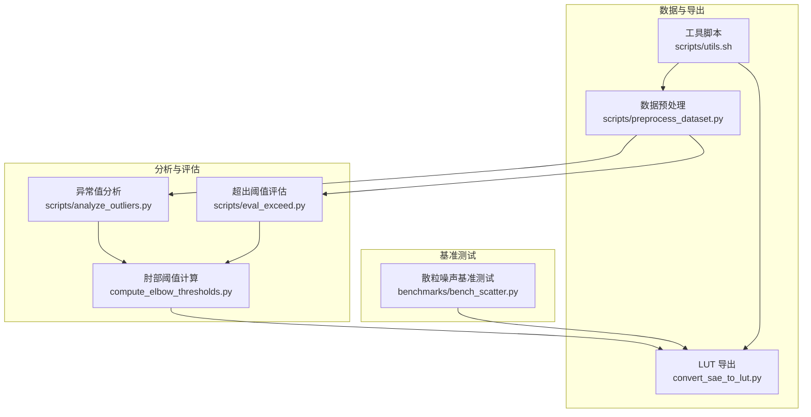
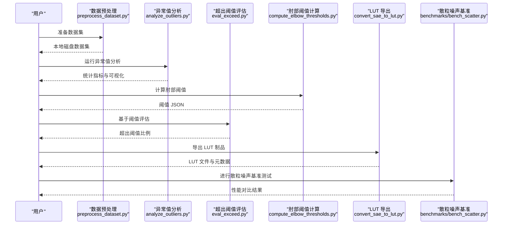
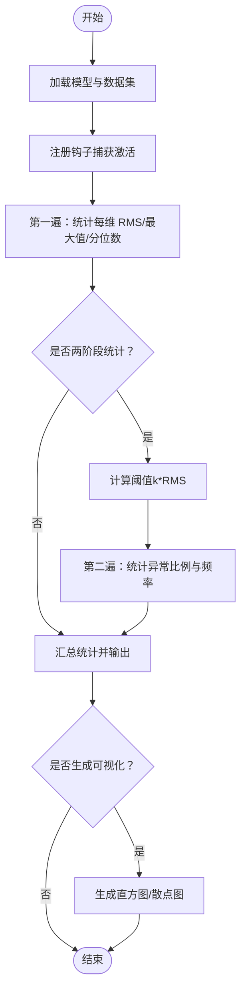
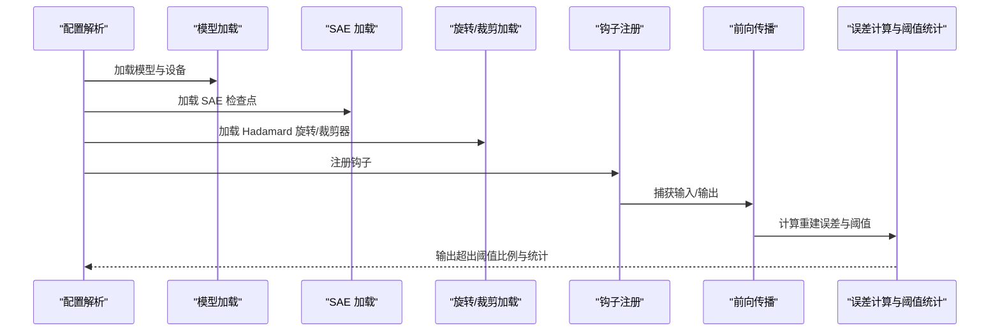
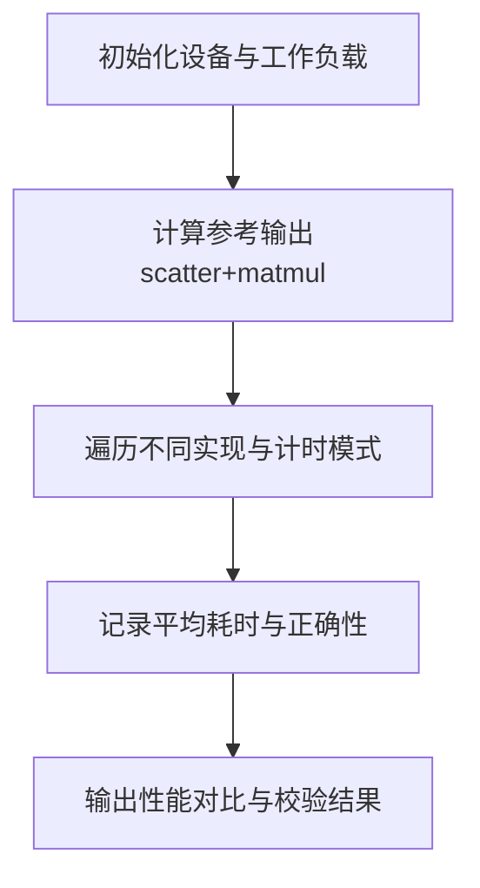
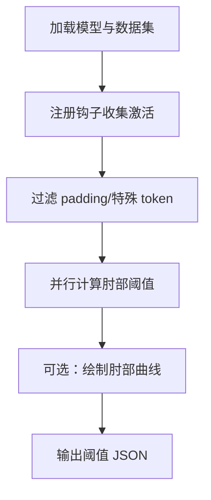
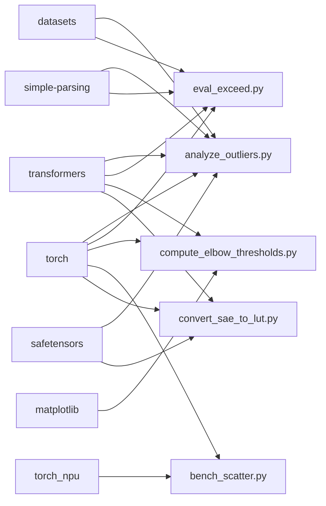

# 分析与基准测试脚本

<cite>
**本文引用的文件**
- [scripts/analyze_outliers.py](file://scripts/analyze_outliers.py)
- [scripts/eval_exceed.py](file://scripts/eval_exceed.py)
- [benchmarks/bench_scatter.py](file://benchmarks/bench_scatter.py)
- [compute_elbow_thresholds.py](file://compute_elbow_thresholds.py)
- [scripts/preprocess_dataset.py](file://scripts/preprocess_dataset.py)
- [convert_sae_to_lut.py](file://convert_sae_to_lut.py)
- [scripts/utils.sh](file://scripts/utils.sh)
- [pyproject.toml](file://pyproject.toml)
- [README.md](file://README.md)
- [docs/architecture/performance.md](file://docs/architecture/performance.md)
</cite>

## 目录
1. [简介](#简介)
2. [项目结构](#项目结构)
3. [核心组件](#核心组件)
4. [架构总览](#架构总览)
5. [详细组件分析](#详细组件分析)
6. [依赖分析](#依赖分析)
7. [性能考虑](#性能考虑)
8. [故障排查指南](#故障排查指南)
9. [结论](#结论)
10. [附录](#附录)

## 简介
本指南面向使用 Sparsify 仓库中的分析与基准测试脚本的用户，系统讲解以下工具链的使用方法与最佳实践：
- 异常值分析脚本：用于统计激活值分布、计算 RMS/最大值/分位数等指标，并可生成可视化图表；支持两阶段统计与异常检测。
- 散粒噪声基准测试脚本：针对 NPU 设备上的 scatter_add 替代实现进行多模式性能对比，涵盖事件计时、流水线计时与同步计时。
- 超出阈值评估脚本：基于肘部阈值与 SAE 激活重建误差，计算“超出阈值”的比例，用于质量评估与异常检测。
- 性能基准测试：结合上述脚本与阈值计算、LUT 导出流程，形成从数据预处理到推理加速制品的完整性能分析闭环。

## 项目结构
该仓库围绕“训练 SAE → 计算阈值 → 导出 LUT → 基准测试”这一主干流程组织，分析与基准测试相关的关键脚本如下：
- 异常值分析：scripts/analyze_outliers.py
- 超出阈值评估：scripts/eval_exceed.py
- 散粒噪声基准测试：benchmarks/bench_scatter.py
- 阈值计算：compute_elbow_thresholds.py
- 数据预处理：scripts/preprocess_dataset.py
- LUT 导出：convert_sae_to_lut.py
- 工具脚本：scripts/utils.sh
- 依赖与安装：pyproject.toml

**图示来源**
- [scripts/analyze_outliers.py](file://scripts/analyze_outliers.py)
- [scripts/eval_exceed.py](file://scripts/eval_exceed.py)
- [compute_elbow_thresholds.py](file://compute_elbow_thresholds.py)
- [benchmarks/bench_scatter.py](file://benchmarks/bench_scatter.py)
- [scripts/preprocess_dataset.py](file://scripts/preprocess_dataset.py)
- [convert_sae_to_lut.py](file://convert_sae_to_lut.py)
- [scripts/utils.sh](file://scripts/utils.sh)

**章节来源**
- [README.md](file://README.md)
- [pyproject.toml](file://pyproject.toml)

## 核心组件
- 异常值分析脚本：统计激活值的 RMS、最大值、分位数，支持按维度输出与直方图/散点图可视化；可进行两阶段统计以估计异常比例。
- 超出阈值评估脚本：基于 SAE 重建误差与肘部阈值，计算不同 alpha 下的“超出阈值”比例，辅助质量评估与异常检测。
- 散粒噪声基准测试：比较多种 scatter_add 替代实现的性能，提供设备侧事件计时、流水线计时与同步计时三种模式。
- 阈值计算：使用 Kneedle 算法从激活分布中提取肘部阈值，支持并行处理与可视化。
- 数据预处理：将原始数据集切分为固定上下文长度并保存为本地磁盘格式，便于大规模训练与评估。
- LUT 导出：将 SAE 检查点转换为 LUT 格式，预计算矩阵乘积以提升推理效率。

**章节来源**
- [scripts/analyze_outliers.py](file://scripts/analyze_outliers.py)
- [scripts/eval_exceed.py](file://scripts/eval_exceed.py)
- [benchmarks/bench_scatter.py](file://benchmarks/bench_scatter.py)
- [compute_elbow_thresholds.py](file://compute_elbow_thresholds.py)
- [scripts/preprocess_dataset.py](file://scripts/preprocess_dataset.py)
- [convert_sae_to_lut.py](file://convert_sae_to_lut.py)

## 架构总览
下图展示从数据到评估再到导出的整体流程，以及各脚本之间的调用关系与数据流向。

**图示来源**
- [scripts/preprocess_dataset.py](file://scripts/preprocess_dataset.py)
- [scripts/analyze_outliers.py](file://scripts/analyze_outliers.py)
- [scripts/eval_exceed.py](file://scripts/eval_exceed.py)
- [compute_elbow_thresholds.py](file://compute_elbow_thresholds.py)
- [convert_sae_to_lut.py](file://convert_sae_to_lut.py)
- [benchmarks/bench_scatter.py](file://benchmarks/bench_scatter.py)

## 详细组件分析

### 异常值分析脚本（analyze_outliers.py）
- 功能概述
  - 捕获指定钩入点的激活值，计算每维 RMS、最大值与分位数统计。
  - 可选两阶段统计：先统计分位数阈值，再统计异常比例与每 token 异常分布直方图。
  - 支持按维度输出与可视化（直方图、散点图），并可保存结果 JSON。
- 关键算法与统计
  - 运行时统计类：维护每批样本的平方和、最大值与采样集合，最终计算每维 RMS 与分位数。
  - 异常掩码统计类：统计异常计数、总计数、每 token 最大异常数与每 token 异常直方图。
  - 两阶段流程：第一遍统计分位数阈值，第二遍根据阈值统计异常比例与频率。
- 可视化输出
  - 生成每钩入点的 RMS/最大值直方图、RMS 与最大值散点图、分位数直方图、异常频率直方图与每 token 异常直方图。
- 使用要点
  - 钩入点列表与模式（输出/输入/转码）需与训练配置一致。
  - 可开启 Hadamard 旋转以改善激活结构，但会增加额外计算。
  - 可控制采样数量与最大 token 样本数，平衡精度与内存占用。

**图示来源**
- [scripts/analyze_outliers.py](file://scripts/analyze_outliers.py)

**章节来源**
- [scripts/analyze_outliers.py](file://scripts/analyze_outliers.py)

### 超出阈值评估脚本（eval_exceed.py）
- 功能概述
  - 基于 SAE 重建误差与肘部阈值，计算不同 alpha 下的“超出阈值”比例，用于评估重建质量与异常检测能力。
  - 支持单阶段与两阶段编码策略，支持 PCA 投影与随机投影。
  - 可跟踪 top-k 激活统计与潜在单元计数，便于进一步分析。
- 关键流程
  - 加载 SAE 检查点与可选的 Hadamard 旋转与异常裁剪器。
  - 注册钩子捕获输入/输出，应用旋转与裁剪。
  - 计算重建误差并按阈值统计超出比例。
- 结果解读
  - alpha 越大，阈值越高，超出比例越低；可用于权衡质量与鲁棒性。
  - 可结合 top-k 激活统计与潜在单元计数，评估编码器稀疏性与稳定性。

**图示来源**
- [scripts/eval_exceed.py](file://scripts/eval_exceed.py)

**章节来源**
- [scripts/eval_exceed.py](file://scripts/eval_exceed.py)

### 散粒噪声基准测试（bench_scatter.py）
- 功能概述
  - 对比多种 scatter_add 替代实现（scatter+matmul、index_put+matmul、gather+mul+sum、gather+bmm）在 NPU 上的性能。
  - 提供三种计时模式：设备事件计时、流水线计时、同步计时，以捕捉不同场景下的性能差异。
- 测试工作负载
  - 小/中/大三档规模，覆盖不同 N×M×k×d_in 组合，便于评估不同规模下的性能表现。
- 结果解读
  - 事件计时反映设备侧真实耗时，流水线计时体现流水线效率，同步计时则掩盖 CPU 回退导致的延迟。
  - 选择合适的替代方案可显著降低 CPU 回退带来的性能损失。

**图示来源**
- [benchmarks/bench_scatter.py](file://benchmarks/bench_scatter.py)

**章节来源**
- [benchmarks/bench_scatter.py](file://benchmarks/bench_scatter.py)

### 阈值计算（compute_elbow_thresholds.py）
- 功能概述
  - 使用 Kneedle 算法从激活分布中提取肘部阈值，支持并行处理与可视化。
  - 自动匹配钩入点名称，支持范围模式与自然排序。
- 关键步骤
  - 收集激活值（可过滤 padding 与特殊 token）。
  - 并行计算每个钩入点的肘部阈值。
  - 可选保存可视化曲线。
- 结果使用
  - 生成的阈值 JSON 可被超出阈值评估脚本加载，用于计算不同 alpha 下的超出比例。

**图示来源**
- [compute_elbow_thresholds.py](file://compute_elbow_thresholds.py)

**章节来源**
- [compute_elbow_thresholds.py](file://compute_elbow_thresholds.py)

### 数据预处理（preprocess_dataset.py）
- 功能概述
  - 将原始数据集切分为固定上下文长度并保存为本地磁盘格式，便于大规模训练与评估。
- 使用建议
  - 合理设置 ctx_len 与 num_proc，平衡吞吐与内存占用。
  - 预处理完成后可直接用于训练或评估脚本。

**章节来源**
- [scripts/preprocess_dataset.py](file://scripts/preprocess_dataset.py)

### LUT 导出（convert_sae_to_lut.py）
- 功能概述
  - 将 SAE 检查点转换为 LUT 格式，预计算矩阵乘积以提升推理效率。
  - 支持单投影与融合投影（如 QKV、Gate/Up），自动检测层数并生成元数据。
- 使用建议
  - 指定输出 dtype（float16/bfloat16/float32）以平衡精度与内存。
  - 可启用批量计算以降低内存峰值。

**章节来源**
- [convert_sae_to_lut.py](file://convert_sae_to_lut.py)

## 依赖分析
- Python 依赖与版本
  - 核心依赖：torch、transformers、datasets、simple-parsing、safetensors 等。
  - 可选依赖：matplotlib、pillow、ml_dtypes 等，用于可视化与数据类型支持。
- 环境要求
  - CUDA/NPU：推荐优先使用 CUDA，NPU 保留兼容性路径。
  - BF16 支持：现代 CUDA/NPU 默认启用 BF16 自动类型提升。
- 脚本间依赖
  - analyze_outliers.py 与 eval_exceed.py 共享模型加载与钩子注册逻辑。
  - compute_elbow_thresholds.py 与 eval_exceed.py 共享阈值加载与匹配逻辑。
  - convert_sae_to_lut.py 依赖 SAE 检查点与阈值文件。

**图示来源**
- [pyproject.toml](file://pyproject.toml)
- [scripts/analyze_outliers.py](file://scripts/analyze_outliers.py)
- [scripts/eval_exceed.py](file://scripts/eval_exceed.py)
- [compute_elbow_thresholds.py](file://compute_elbow_thresholds.py)
- [benchmarks/bench_scatter.py](file://benchmarks/bench_scatter.py)
- [convert_sae_to_lut.py](file://convert_sae_to_lut.py)

**章节来源**
- [pyproject.toml](file://pyproject.toml)

## 性能考虑
- CUDA 优先：CUDA 是当前开发的主要运行时，推荐默认在 CUDA 上进行性能调试与基准测试。
- BF16 自动类型提升：在支持的后端上默认启用，有助于减少显存占用并提升吞吐。
- 编译优化：在 CUDA 上可启用 torch.compile 以减少内核启动开销。
- 部分前向：当所有钩入点位于最终层之前时，可提前停止前向传播，避免无关层的计算。
- Hadamard 预处理：可改善激活结构与异常行为，但会增加钩子路径的额外计算，需权衡精度与性能。
- 散粒噪声优化：在 NPU 上应避免 CPU 回退，选择合适的替代实现可显著降低延迟。

**章节来源**
- [docs/architecture/performance.md](file://docs/architecture/performance.md)

## 故障排查指南
- Matplotlib 缺失
  - 现象：生成可视化时报错或跳过绘图。
  - 处理：安装可选依赖 matplotlib 或关闭绘图功能。
- 数据集加载失败
  - 现象：HuggingFace 数据集加载异常或磁盘数据集不存在。
  - 处理：确认数据集路径与格式，必要时先运行数据预处理脚本。
- 阈值文件缺失
  - 现象：超出阈值评估无法加载肘部阈值。
  - 处理：先运行阈值计算脚本生成阈值 JSON。
- 维度不匹配
  - 现象：LUT 导出时报错提示 SAE d_in 与目标权重维度不一致。
  - 处理：确认 SAE 检查点与目标模型一致，或调整投影类型。
- NPU 事件计时不可用
  - 现象：NPU 事件计时接口不可用或报错。
  - 处理：回退到流水线计时或同步计时模式。

**章节来源**
- [scripts/analyze_outliers.py](file://scripts/analyze_outliers.py)
- [scripts/eval_exceed.py](file://scripts/eval_exceed.py)
- [compute_elbow_thresholds.py](file://compute_elbow_thresholds.py)
- [convert_sae_to_lut.py](file://convert_sae_to_lut.py)
- [benchmarks/bench_scatter.py](file://benchmarks/bench_scatter.py)

## 结论
通过本指南，您可以在 Sparsify 仓库中高效使用异常值分析、超出阈值评估、散粒噪声基准测试与阈值计算/导出流程，构建从数据预处理到推理加速制品的完整性能分析闭环。建议优先在 CUDA 上进行性能调试，结合 BF16 自动类型提升与部分前向优化，获得最佳效果。遇到问题时，可依据故障排查指南逐项定位并解决。

## 附录
- 快速开始命令示例（参考仓库 README）
  - 训练 SAE 示例：见 README 中的最小示例命令。
  - 端到端工作流：训练 → 计算阈值 → 导出 LUT。
- 工具脚本（scripts/utils.sh）
  - 提供数据预处理与 LUT 导出的示例命令，便于一键执行。

**章节来源**
- [README.md](file://README.md)
- [scripts/utils.sh](file://scripts/utils.sh)