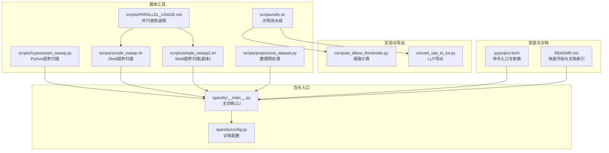
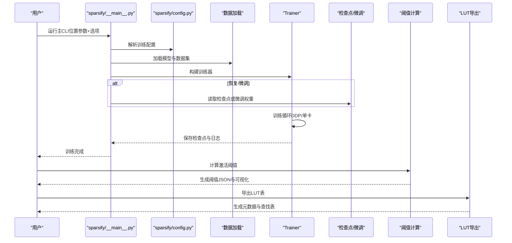
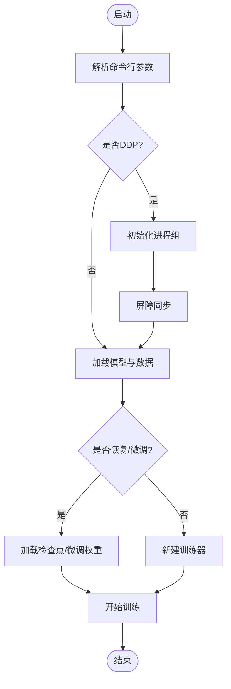
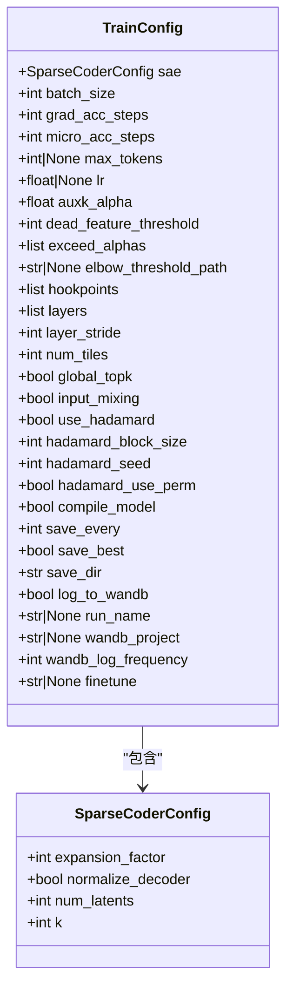
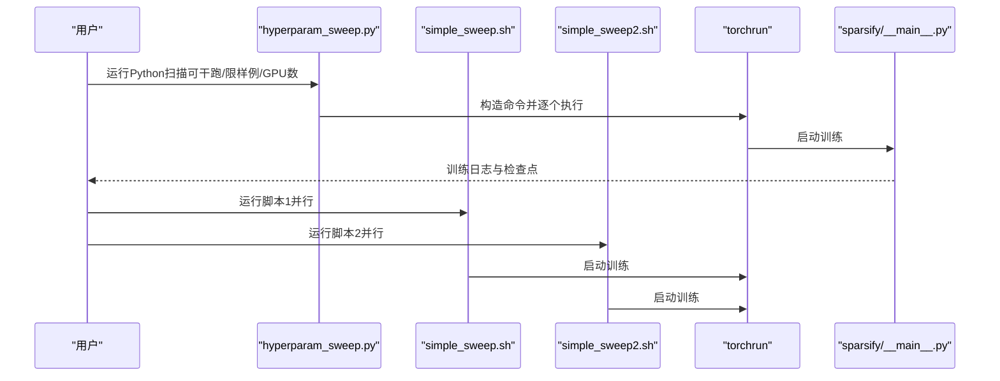
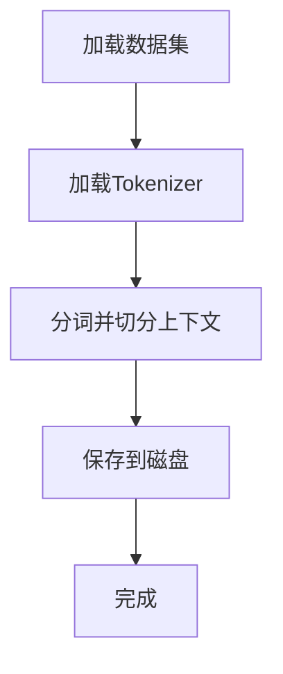
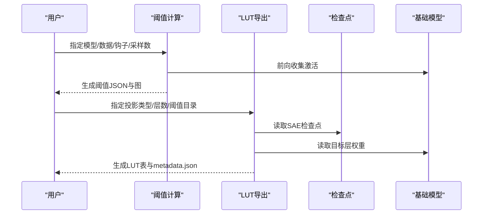
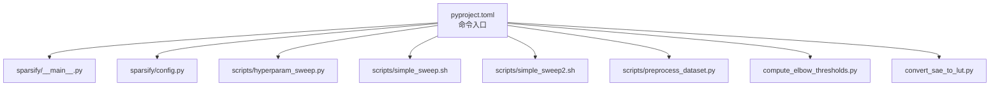

# 命令行工具

<cite>
**本文引用的文件**
- [sparsify/__main__.py](file://sparsify/__main__.py)
- [sparsify/config.py](file://sparsify/config.py)
- [scripts/README.md](file://scripts/README.md)
- [scripts/hyperparam_sweep.py](file://scripts/hyperparam_sweep.py)
- [scripts/simple_sweep.sh](file://scripts/simple_sweep.sh)
- [scripts/simple_sweep2.sh](file://scripts/simple_sweep2.sh)
- [scripts/preprocess_dataset.py](file://scripts/preprocess_dataset.py)
- [scripts/utils.sh](file://scripts/utils.sh)
- [scripts/PARALLEL_USAGE.md](file://scripts/PARALLEL_USAGE.md)
- [compute_elbow_thresholds.py](file://compute_elbow_thresholds.py)
- [convert_sae_to_lut.py](file://convert_sae_to_lut.py)
- [pyproject.toml](file://pyproject.toml)
- [README.md](file://README.md)
</cite>

## 目录
1. [简介](#简介)
2. [项目结构](#项目结构)
3. [核心组件](#核心组件)
4. [架构总览](#架构总览)
5. [详细组件分析](#详细组件分析)
6. [依赖分析](#依赖分析)
7. [性能考虑](#性能考虑)
8. [故障排除指南](#故障排除指南)
9. [结论](#结论)
10. [附录](#附录)

## 简介
本文件面向使用者与工程师，系统化梳理本仓库提供的命令行工具与脚本，覆盖以下方面：
- 主 CLI 接口：训练脚本的完整命令、参数与选项说明
- 数据预处理脚本：如何将原始数据集切分与分词并保存
- 超参数扫描脚本：Python 与 Shell 两种实现，支持并行与恢复
- 分布式训练：DDP 与 torchrun 的使用要点与端口配置
- 性能分析与实验管理：阈值计算、LUT 导出、日志与可视化
- 使用案例、最佳实践与常见问题排查

## 项目结构
仓库采用“包内 CLI + 多脚本工具”的组织方式：
- 包入口：sparsify/__main__.py 提供主训练 CLI
- 配置层：sparsify/config.py 定义训练配置结构
- 脚本工具：scripts/ 下提供超参数扫描、数据预处理、并行使用说明等
- 实验与导出：compute_elbow_thresholds.py 与 convert_sae_to_lut.py 分别负责阈值计算与 LUT 导出
- 安装与入口：pyproject.toml 将 sparsify 注册为命令行入口

**图表来源**
- [sparsify/__main__.py:131-207](file://sparsify/__main__.py#L131-L207)
- [sparsify/config.py:28-149](file://sparsify/config.py#L28-L149)
- [scripts/hyperparam_sweep.py:160-273](file://scripts/hyperparam_sweep.py#L160-L273)
- [scripts/simple_sweep.sh:1-133](file://scripts/simple_sweep.sh#L1-L133)
- [scripts/simple_sweep2.sh:1-133](file://scripts/simple_sweep2.sh#L1-L133)
- [scripts/preprocess_dataset.py:23-62](file://scripts/preprocess_dataset.py#L23-L62)
- [scripts/utils.sh:1-17](file://scripts/utils.sh#L1-L17)
- [scripts/PARALLEL_USAGE.md:1-166](file://scripts/PARALLEL_USAGE.md#L1-L166)
- [compute_elbow_thresholds.py:364-659](file://compute_elbow_thresholds.py#L364-L659)
- [convert_sae_to_lut.py:604-782](file://convert_sae_to_lut.py#L604-L782)
- [pyproject.toml:44-45](file://pyproject.toml#L44-L45)
- [README.md:36-68](file://README.md#L36-L68)

**章节来源**
- [README.md:36-68](file://README.md#L36-L68)
- [pyproject.toml:44-45](file://pyproject.toml#L44-L45)

## 核心组件
- 主 CLI（sparsify/__main__.py）
  - 通过 simple-parsing 解析命令行参数，构建 RunConfig/TrainConfig
  - 自动加载模型与数据集，支持 memmap 与 HuggingFace 两种数据源
  - 支持 DDP 分布式训练，自动分片数据并同步
  - 支持从检查点恢复训练或微调已有 SAE
- 训练配置（sparsify/config.py）
  - 定义 SAE 架构参数（expansion_factor、k 等）、训练超参（batch_size、grad_acc_steps 等）、日志与保存策略
  - 提供校验逻辑（如 hadamard_block_size 必须为 2 的幂）
- 超参数扫描脚本
  - Python 版：可干跑、失败继续、GPU 数量与端口自动递增
  - Shell 版：两套脚本并行执行不同参数网格
- 数据预处理脚本
  - 将原始数据集切分为固定上下文长度的 token 序列，并保存为本地磁盘格式
- 阈值计算与 LUT 导出
  - 计算激活分布拐点阈值，生成 JSON；将 SAE 检查点转换为 LUT 表，便于下游推理

**章节来源**
- [sparsify/__main__.py:31-128](file://sparsify/__main__.py#L31-L128)
- [sparsify/config.py:7-149](file://sparsify/config.py#L7-L149)
- [scripts/hyperparam_sweep.py:160-273](file://scripts/hyperparam_sweep.py#L160-L273)
- [scripts/simple_sweep.sh:1-133](file://scripts/simple_sweep.sh#L1-L133)
- [scripts/simple_sweep2.sh:1-133](file://scripts/simple_sweep2.sh#L1-L133)
- [scripts/preprocess_dataset.py:23-62](file://scripts/preprocess_dataset.py#L23-L62)
- [compute_elbow_thresholds.py:364-659](file://compute_elbow_thresholds.py#L364-L659)
- [convert_sae_to_lut.py:604-782](file://convert_sae_to_lut.py#L604-L782)

## 架构总览
下图展示从 CLI 到训练、再到导出的整体流程。

**图表来源**
- [sparsify/__main__.py:131-207](file://sparsify/__main__.py#L131-L207)
- [sparsify/config.py:28-149](file://sparsify/config.py#L28-L149)
- [compute_elbow_thresholds.py:364-659](file://compute_elbow_thresholds.py#L364-L659)
- [convert_sae_to_lut.py:604-782](file://convert_sae_to_lut.py#L604-L782)

## 详细组件分析

### 主 CLI 接口（sparsify/__main__.py）
- 位置参数
  - model：模型名称或路径（必填）
  - dataset：数据集名称、路径或 .bin 文件（必填）
- 常用选项
  - --split：数据集划分（默认 train）
  - --ctx_len：上下文长度（默认 2048）
  - --hf_token：Hugging Face 访问令牌（可选）
  - --revision：模型版本（可选）
  - --max_examples：限制样本数量（可选）
  - --resume：从最近检查点恢复（可选）
  - --text_column：文本字段名（默认 text）
  - --shuffle_seed：打乱数据的随机种子（默认 42）
  - --data_preprocessing_num_proc：数据预处理并行进程数（默认 CPU 核数的一半）
  - --data_args：传递给 datasets.load_dataset 的参数字符串（如 "name=sample-10BT"）
  - --finetune：从指定目录微调已有 SAE（可选）
- 分布式训练
  - 通过 LOCAL_RANK 环境变量识别 DDP；torchrun 启动时设置 nproc_per_node 与 master_port
  - 自动对齐世界大小，按 GPU 数量分片数据，避免死锁
- 检查点恢复
  - 支持按 run_name 或通配模式查找最近检查点，找不到则报错并提示修正

**图表来源**
- [sparsify/__main__.py:131-207](file://sparsify/__main__.py#L131-L207)

**章节来源**
- [sparsify/__main__.py:31-128](file://sparsify/__main__.py#L31-L128)
- [sparsify/__main__.py:131-207](file://sparsify/__main__.py#L131-L207)

### 训练配置（sparsify/config.py）
- SparseCoderConfig（SAE 架构）
  - expansion_factor：扩展倍数
  - k：稀疏度（激活的特征数）
  - normalize_decoder：解码器权重归一化
  - num_latents：若为 0 则由 expansion_factor 决定
- TrainConfig（训练与日志）
  - batch_size、grad_acc_steps、micro_acc_steps
  - max_tokens：训练停止上限
  - lr：学习率（None 时自动选择）
  - auxk_alpha：辅助损失权重
  - dead_feature_threshold：死特征阈值
  - exceed_alphas：异常指标评估列表
  - elbow_threshold_path：阈值文件路径
  - hookpoints、layers、layer_stride：钩子与层选择
  - num_tiles、global_topk、input_mixing：分块训练相关
  - use_hadamard、hadamard_block_size、hadamard_seed、hadamard_use_perm：Hadamard 预处理
  - compile_model：torch.compile 编译
  - save_every、save_best、save_dir、log_to_wandb、run_name、wandb_project、wandb_log_frequency
  - finetune：微调路径

**图表来源**
- [sparsify/config.py:7-149](file://sparsify/config.py#L7-L149)

**章节来源**
- [sparsify/config.py:7-149](file://sparsify/config.py#L7-L149)

### 超参数扫描脚本（Python 与 Shell）
- Python 脚本（推荐）
  - 支持干跑（--dry-run）、失败继续（--continue-on-error）、限制样本（--max-examples）、指定 GPU 数（--gpus）
  - 自动递增 master_port 避免冲突
  - 生成 sweep 名称与命令，逐个执行并汇总结果
- Shell 脚本（简单）
  - 提供两套脚本（simple_sweep.sh 与 simple_sweep2.sh），分别扫描不同参数网格
  - 默认每实验 100M tokens，支持日志记录与交互式继续
- 并行使用
  - 两套脚本分别使用不同 master_port，可在同一机器上并行运行
  - 可通过 CUDA_VISIBLE_DEVICES 指定不同 GPU 集合

**图表来源**
- [scripts/hyperparam_sweep.py:160-273](file://scripts/hyperparam_sweep.py#L160-L273)
- [scripts/simple_sweep.sh:1-133](file://scripts/simple_sweep.sh#L1-L133)
- [scripts/simple_sweep2.sh:1-133](file://scripts/simple_sweep2.sh#L1-L133)

**章节来源**
- [scripts/README.md:1-299](file://scripts/README.md#L1-L299)
- [scripts/hyperparam_sweep.py:160-273](file://scripts/hyperparam_sweep.py#L160-L273)
- [scripts/simple_sweep.sh:1-133](file://scripts/simple_sweep.sh#L1-L133)
- [scripts/simple_sweep2.sh:1-133](file://scripts/simple_sweep2.sh#L1-L133)
- [scripts/PARALLEL_USAGE.md:1-166](file://scripts/PARALLEL_USAGE.md#L1-L166)

### 数据预处理脚本（scripts/preprocess_dataset.py）
- 功能：加载数据集、分词、切分为固定上下文长度、保存为本地磁盘格式
- 关键参数
  - --model：Tokenizer 来源
  - --dataset：原始数据集路径
  - --output：输出路径
  - --split：默认 train
  - --ctx_len：默认 2048
  - --text_column：默认 text
  - --num_proc：默认 CPU 核数的一半

**图表来源**
- [scripts/preprocess_dataset.py:35-62](file://scripts/preprocess_dataset.py#L35-L62)

**章节来源**
- [scripts/preprocess_dataset.py:23-62](file://scripts/preprocess_dataset.py#L23-L62)

### 阈值计算与 LUT 导出
- 阈值计算（compute_elbow_thresholds.py）
  - 收集模型激活，使用 kneedle 算法计算拐点，输出 JSON 与可选可视化图
  - 支持多进程并行计算多个钩子点
- LUT 导出（convert_sae_to_lut.py）
  - 将 SAE 检查点与目标层权重矩阵预乘，生成查找表（.lut.safetensors）与元数据
  - 支持单投影与融合投影（如 qkv、gate_up）

**图表来源**
- [compute_elbow_thresholds.py:364-659](file://compute_elbow_thresholds.py#L364-L659)
- [convert_sae_to_lut.py:604-782](file://convert_sae_to_lut.py#L604-L782)

**章节来源**
- [compute_elbow_thresholds.py:364-659](file://compute_elbow_thresholds.py#L364-L659)
- [convert_sae_to_lut.py:604-782](file://convert_sae_to_lut.py#L604-L782)

## 依赖分析
- 安装入口
  - pyproject.toml 将 sparsify 注册为命令行入口，可通过 pip 安装
- 运行时依赖
  - 主要依赖包括 torch、transformers、datasets、simple-parsing 等
- 文档与示例
  - README.md 提供最小示例与端到端工作流指引

**图表来源**
- [pyproject.toml:44-45](file://pyproject.toml#L44-L45)
- [sparsify/__main__.py:1-211](file://sparsify/__main__.py#L1-L211)
- [sparsify/config.py:1-149](file://sparsify/config.py#L1-L149)
- [scripts/hyperparam_sweep.py:1-273](file://scripts/hyperparam_sweep.py#L1-L273)
- [scripts/simple_sweep.sh:1-133](file://scripts/simple_sweep.sh#L1-L133)
- [scripts/simple_sweep2.sh:1-133](file://scripts/simple_sweep2.sh#L1-L133)
- [scripts/preprocess_dataset.py:1-62](file://scripts/preprocess_dataset.py#L1-L62)
- [compute_elbow_thresholds.py:1-660](file://compute_elbow_thresholds.py#L1-L660)
- [convert_sae_to_lut.py:1-783](file://convert_sae_to_lut.py#L1-L783)

**章节来源**
- [pyproject.toml:1-131](file://pyproject.toml#L1-L131)
- [README.md:24-35](file://README.md#L24-L35)

## 性能考虑
- 数据预处理
  - 增加 --data_preprocessing_num_proc 可提升分词速度
  - 对于大型数据集，优先使用本地磁盘格式（.bin）以减少 I/O
- 分布式训练
  - 使用 torchrun 的 --nproc_per_node 指定 GPU 数
  - 确保 master_port 不冲突，必要时使用 --master_port 参数
- 训练稳定性
  - 当显存不足时，降低 batch_size 或增大 grad_acc_steps
  - 合理设置 max_tokens，避免过长训练导致资源浪费
- 导出与阈值
  - LUT 导出可启用批量计算以节省内存
  - 阈值计算支持多进程并行，加速大规模钩子点处理

[本节为通用建议，无需特定文件引用]

## 故障排除指南
- CUDA 显存不足
  - 减少 batch_size 或增大 grad_acc_steps
  - 参考：[scripts/README.md:273-299](file://scripts/README.md#L273-L299)
- 端口冲突
  - Python 脚本会自动递增端口；若仍冲突，修改起始端口
  - 参考：[scripts/README.md:284-290](file://scripts/README.md#L284-L290)，[scripts/PARALLEL_USAGE.md:139-143](file://scripts/PARALLEL_USAGE.md#L139-L143)
- 数据加载慢
  - 增加 data_preprocessing_num_proc
  - 参考：[scripts/README.md:292-298](file://scripts/README.md#L292-L298)
- 恢复训练找不到检查点
  - 确认 run_name 或检查点路径正确；脚本会尝试通配模式匹配
  - 参考：[sparsify/__main__.py:173-196](file://sparsify/__main__.py#L173-L196)
- Shell 脚本中断后继续
  - 手动编辑脚本数组，移除已完成的配置项
  - 参考：[scripts/README.md:189-209](file://scripts/README.md#L189-L209)，[scripts/PARALLEL_USAGE.md:137-166](file://scripts/PARALLEL_USAGE.md#L137-L166)

**章节来源**
- [scripts/README.md:189-299](file://scripts/README.md#L189-L299)
- [scripts/PARALLEL_USAGE.md:137-166](file://scripts/PARALLEL_USAGE.md#L137-L166)
- [sparsify/__main__.py:173-196](file://sparsify/__main__.py#L173-L196)

## 结论
本仓库提供了从训练、阈值计算到 LUT 导出的完整命令行工具链。通过主 CLI 与脚本工具的组合，用户可以高效地进行超参数扫描、分布式训练、阈值统计与模型导出。建议结合 README 的快速开始与文档索引，按需选择 Python 或 Shell 脚本，并根据硬件条件调整并行度与批大小。

[本节为总结性内容，无需特定文件引用]

## 附录

### 使用案例与最佳实践
- 快速开始（最小示例）
  - 参考：[README.md:36-53](file://README.md#L36-L53)
- 端到端工作流
  - 训练 SAE → 计算阈值 → 导出 LUT
  - 参考：[README.md:61-69](file://README.md#L61-L69)
- 超参数扫描策略
  - 探索阶段：粗粒度网格（如 expansion_factor ∈ [4,8,16]，k ∈ [16,32,64]）
  - 细化阶段：固定最优 expansion_factor，缩小 k 搜索区间
  - 参考：[scripts/README.md:78-115](file://scripts/README.md#L78-L115)
- 并行扫描
  - 使用两套 Shell 脚本分别扫描不同参数网格，避免资源争用
  - 参考：[scripts/PARALLEL_USAGE.md:21-68](file://scripts/PARALLEL_USAGE.md#L21-L68)

**章节来源**
- [README.md:36-69](file://README.md#L36-L69)
- [scripts/README.md:78-115](file://scripts/README.md#L78-L115)
- [scripts/PARALLEL_USAGE.md:21-68](file://scripts/PARALLEL_USAGE.md#L21-L68)