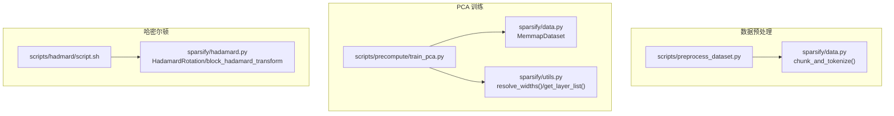
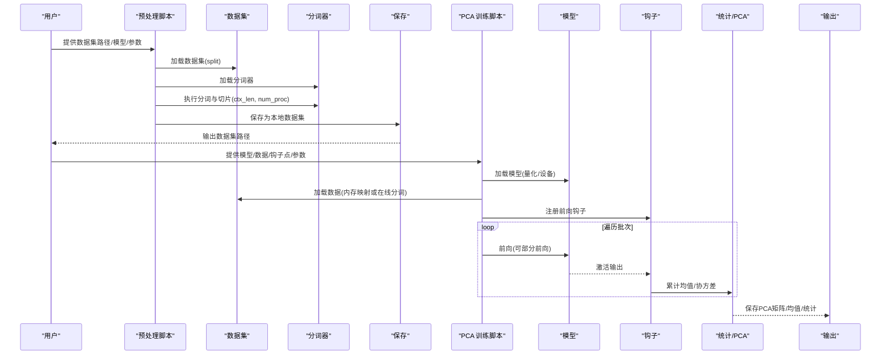
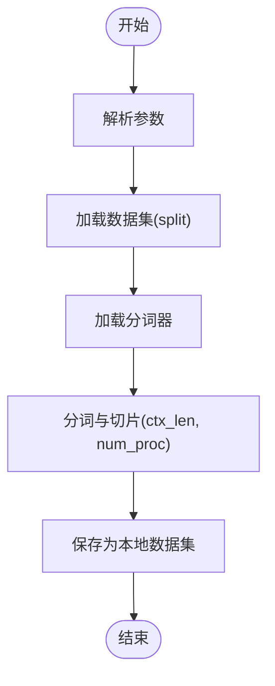
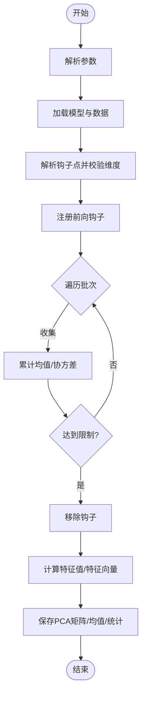
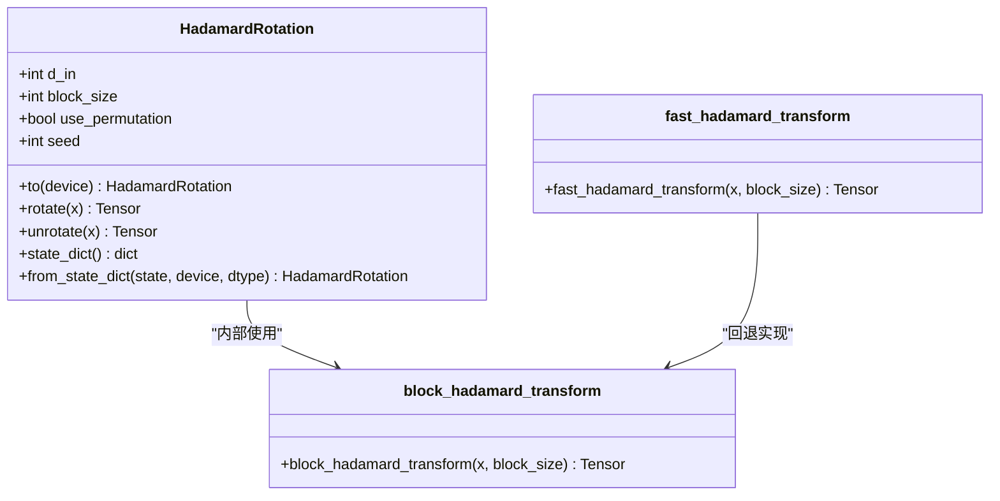
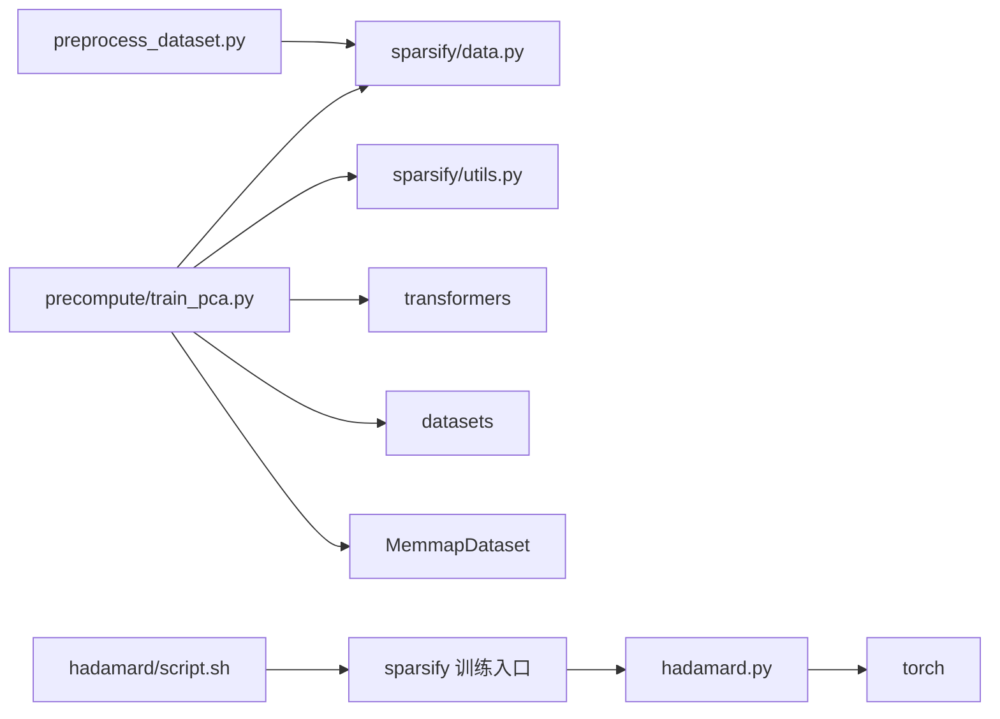

# 数据预处理脚本

<cite>
**本文引用的文件**
- [scripts/preprocess_dataset.py](file://scripts/preprocess_dataset.py)
- [sparsify/data.py](file://sparsify/data.py)
- [scripts/precompute/train_pca.py](file://scripts/precompute/train_pca.py)
- [sparsify/hadamard.py](file://sparsify/hadamard.py)
- [scripts/hadmard/script.sh](file://scripts/hadmard/script.sh)
- [scripts/PARALLEL_USAGE.md](file://scripts/PARALLEL_USAGE.md)
- [README.md](file://README.md)
- [docs/training/quickstart.md](file://docs/training/quickstart.md)
- [docs/training/config-reference.md](file://docs/training/config-reference.md)
</cite>

## 目录
1. [简介](#简介)
2. [项目结构](#项目结构)
3. [核心组件](#核心组件)
4. [架构总览](#架构总览)
5. [详细组件分析](#详细组件分析)
6. [依赖分析](#依赖分析)
7. [性能考虑](#性能考虑)
8. [故障排查指南](#故障排查指南)
9. [结论](#结论)
10. [附录](#附录)

## 简介
本文件面向使用 Sparsify 项目的工程师与研究者，系统化讲解三类数据预处理脚本的使用方法与最佳实践：
- 数据集预处理脚本：负责将原始文本数据清洗、分词、切片为固定上下文长度，并保存为可直接训练的数据集。
- PCA 训练脚本：用于从模型激活中收集样本，计算协方差矩阵并进行主成分分析，得到降维投影矩阵与均值，便于后续两阶段训练或特征工程。
- 哈密尔顿脚本：提供基于块对角 Hadamard 变换的激活预处理能力，帮助改善重建质量与能量分布。

文档同时覆盖数据格式要求、内存使用优化、并行处理选项、常见问题与性能优化建议，确保用户能够高效、稳定地准备训练数据。

## 项目结构
与数据预处理相关的核心文件与位置如下：
- 数据集预处理入口：scripts/preprocess_dataset.py
- 核心分词与切片函数：sparsify/data.py
- PCA 训练入口与实现：scripts/precompute/train_pca.py
- 哈密尔顿变换实现：sparsify/hadamard.py
- 哈密尔顿训练示例脚本：scripts/hadmard/script.sh
- 并行运行指南：scripts/PARALLEL_USAGE.md
- 项目总体说明与训练快速入门：README.md、docs/training/quickstart.md、docs/training/config-reference.md

图表来源
- [scripts/preprocess_dataset.py:1-62](file://scripts/preprocess_dataset.py#L1-L62)
- [sparsify/data.py:16-101](file://sparsify/data.py#L16-L101)
- [scripts/precompute/train_pca.py:99-145](file://scripts/precompute/train_pca.py#L99-L145)
- [sparsify/utils.py:20-79](file://sparsify/utils.py#L20-L79)
- [sparsify/hadamard.py:66-188](file://sparsify/hadamard.py#L66-L188)
- [scripts/hadmard/script.sh:1-39](file://scripts/hadmard/script.sh#L1-L39)

章节来源
- [scripts/preprocess_dataset.py:1-62](file://scripts/preprocess_dataset.py#L1-L62)
- [sparsify/data.py:16-101](file://sparsify/data.py#L16-L101)
- [scripts/precompute/train_pca.py:99-145](file://scripts/precompute/train_pca.py#L99-L145)
- [sparsify/utils.py:20-79](file://sparsify/utils.py#L20-L79)
- [sparsify/hadamard.py:66-188](file://sparsify/hadamard.py#L66-L188)
- [scripts/hadmard/script.sh:1-39](file://scripts/hadmard/script.sh#L1-L39)

## 核心组件
- 数据集预处理脚本
  - 功能：加载数据集、加载分词器、执行 GPT 风格的拼接与切片、保存为本地磁盘数据集。
  - 关键参数：模型名（分词器来源）、数据集路径、输出路径、划分、上下文长度、文本列名、并行进程数。
  - 关键流程：解析参数 → 加载数据集 → 加载分词器 → 分词与切片 → 保存数据集。
- PCA 训练脚本
  - 功能：加载模型与数据，注册前向钩子收集激活，按 token 屏蔽策略过滤，累计均值与协方差，计算特征值与特征向量，保存 PCA 矩阵、均值与统计信息。
  - 关键参数：模型、数据集、钩子点、上下文长度、批大小、最大样本数/令牌数、钩子模式、低维维度、输出路径、是否部分前向、量化/设备选择等。
  - 关键流程：解析参数 → 加载模型与数据 → 解析钩子点 → 注册钩子 → 数据遍历 → 收集统计 → 计算 PCA → 保存结果。
- 哈密尔顿脚本
  - 功能：提供块对角 Hadamard 变换的实现与使用示例，支持随机置换与缓存加速，可用于激活预处理以改善重建质量。
  - 关键参数：输入维度、块大小（必须为 2 的幂）、随机种子、是否使用置换、设备与数据类型。
  - 关键流程：初始化旋转器 → 构造块对角 Hadamard 矩阵 → 应用旋转/逆旋转 → 序列化状态。

章节来源
- [scripts/preprocess_dataset.py:23-57](file://scripts/preprocess_dataset.py#L23-L57)
- [sparsify/data.py:16-101](file://sparsify/data.py#L16-L101)
- [scripts/precompute/train_pca.py:31-63](file://scripts/precompute/train_pca.py#L31-L63)
- [scripts/precompute/train_pca.py:168-331](file://scripts/precompute/train_pca.py#L168-L331)
- [sparsify/hadamard.py:66-188](file://sparsify/hadamard.py#L66-L188)

## 架构总览
下图展示了从原始文本到训练数据、再到 PCA 训练与哈密尔顿预处理的整体流程。

图表来源
- [scripts/preprocess_dataset.py:35-57](file://scripts/preprocess_dataset.py#L35-L57)
- [scripts/precompute/train_pca.py:99-145](file://scripts/precompute/train_pca.py#L99-L145)
- [scripts/precompute/train_pca.py:168-276](file://scripts/precompute/train_pca.py#L168-L276)

## 详细组件分析

### 数据集预处理脚本
- 输入输出
  - 输入：原始数据集路径、分词器来源、上下文长度、并行进程数、文本列名等。
  - 输出：本地磁盘数据集（包含 input_ids 等列）。
- 处理流程
  - 参数解析与默认值设置。
  - 加载数据集与分词器。
  - 调用分词与切片函数，生成固定长度的 token 片段。
  - 保存数据集至指定路径。
- 关键实现要点
  - 使用 GPT 风格的“拼接+溢出切片”策略，保证每条样本恰好为 ctx_len 长度。
  - 支持多进程并行分词，提升吞吐。
  - 自动启用进度条与日志级别，便于监控。
- 常见参数说明
  - split：数据划分，默认 train。
  - ctx_len：上下文长度，默认 2048。
  - text_column：未分词数据的文本列名，默认 "text"。
  - num_proc：分词并行进程数，默认 CPU 核数的一半。
- 使用建议
  - 对超大语料建议先进行抽样或分片，避免一次性加载导致内存压力。
  - 若数据集已分词，可直接传入包含 input_ids 的数据集，跳过分词步骤。

图表来源
- [scripts/preprocess_dataset.py:35-57](file://scripts/preprocess_dataset.py#L35-L57)
- [sparsify/data.py:16-101](file://sparsify/data.py#L16-L101)

章节来源
- [scripts/preprocess_dataset.py:23-57](file://scripts/preprocess_dataset.py#L23-L57)
- [sparsify/data.py:16-101](file://sparsify/data.py#L16-L101)

### PCA 训练脚本
- 输入输出
  - 输入：模型、数据集、钩子点列表、上下文长度、批大小、最大样本/令牌数、钩子模式、低维维度、输出路径、是否部分前向、量化/设备等。
  - 输出：每个钩子点对应的 PCA 矩阵、均值、统计信息（解释方差比、总方差、令牌数）。
- 处理流程
  - 解析参数与加载模型/数据。
  - 解析并校验钩子点维度，确保 low_dim 不超过宽度。
  - 注册钩子收集激活，按 token 屏蔽策略过滤无效 token。
  - 在部分前向模式下仅运行到最大层，减少计算。
  - 累计均值与协方差，计算特征值与特征向量，截取 top-k 维。
  - 保存单个或多个钩子点的结果。
- 关键实现要点
  - 支持三种钩子模式：输出、输入、转码；转码模式保留输入/输出各自通道。
  - 使用 torch.float64 精度累积，避免数值不稳定。
  - 支持内存映射数据集（.bin）与在线分词两种数据源。
  - 支持按批上限与令牌上限双重停止条件。
- 常见参数说明
  - hookpoints：支持通配符与范围展开，如 layers.[7,14].self_attn.o_proj。
  - hook_mode：output/input/transcode。
  - low_dim：目标低维维度。
  - max_tokens/max_batches：令牌/批次数限制。
  - partial_forward：是否仅运行到最大层以节省计算。
  - exclude_tokens：需要排除的 token（如 pad/eos）。
  - data_preprocessing_num_proc：数据预处理并行度。
- 结果解释
  - explained_variance_ratio：前 low_dim 维解释的方差占比。
  - total_variance：总方差。
  - num_tokens：实际收集的令牌数。

图表来源
- [scripts/precompute/train_pca.py:168-331](file://scripts/precompute/train_pca.py#L168-L331)
- [sparsify/utils.py:20-79](file://sparsify/utils.py#L20-L79)

章节来源
- [scripts/precompute/train_pca.py:31-63](file://scripts/precompute/train_pca.py#L31-L63)
- [scripts/precompute/train_pca.py:99-145](file://scripts/precompute/train_pca.py#L99-L145)
- [scripts/precompute/train_pca.py:168-331](file://scripts/precompute/train_pca.py#L168-L331)
- [sparsify/utils.py:20-79](file://sparsify/utils.py#L20-L79)

### 哈密尔顿脚本
- 作用与使用场景
  - 通过块对角 Hadamard 变换与可选的随机置换，将高维激活空间的能量更均匀地分布在各维度，有助于提升重建质量与稀疏编码效果。
  - 适合在两阶段训练或特征工程中作为预处理步骤。
- 关键参数
  - d_in：输入维度。
  - block_size：块大小（必须为 2 的幂）。
  - use_permutation：是否在 Hadamard 之前应用随机置换。
  - seed：置换随机种子。
  - device/dtype：张量所在设备与数据类型。
- 使用方式
  - 可直接调用 HadamardRotation 类进行旋转/逆旋转。
  - 也可使用 fast_hadamard_transform，在 CUDA 设备上优先使用 fast-hadamard-transform 库加速。
- 示例脚本
  - scripts/hadmard/script.sh 展示了如何在训练中启用哈密尔顿预处理，包括块大小与种子等参数。

图表来源
- [sparsify/hadamard.py:66-188](file://sparsify/hadamard.py#L66-L188)
- [sparsify/hadamard.py:236-259](file://sparsify/hadamard.py#L236-L259)

章节来源
- [sparsify/hadamard.py:66-188](file://sparsify/hadamard.py#L66-L188)
- [sparsify/hadamard.py:236-259](file://sparsify/hadamard.py#L236-L259)
- [scripts/hadmard/script.sh:1-39](file://scripts/hadmard/script.sh#L1-L39)

## 依赖分析
- 数据集预处理
  - 依赖 datasets、transformers 的 AutoTokenizer 与 Dataset。
  - 依赖 sparsify.data 的 chunk_and_tokenize。
- PCA 训练
  - 依赖 transformers 的 AutoModel/AutoTokenizer。
  - 依赖 sparsify.data 的 MemmapDataset 与 chunk_and_tokenize。
  - 依赖 sparsify.utils 的 resolve_widths/get_layer_list/partial_forward_to_layer。
- 哈密尔顿
  - 依赖 torch 张量运算与可选的 fast-hadamard-transform 库。

图表来源
- [scripts/preprocess_dataset.py:11-16](file://scripts/preprocess_dataset.py#L11-L16)
- [sparsify/data.py:16-101](file://sparsify/data.py#L16-L101)
- [scripts/precompute/train_pca.py:19-28](file://scripts/precompute/train_pca.py#L19-L28)
- [sparsify/utils.py:20-79](file://sparsify/utils.py#L20-L79)
- [sparsify/hadamard.py:14-124](file://sparsify/hadamard.py#L14-L124)
- [scripts/hadmard/script.sh:1-39](file://scripts/hadmard/script.sh#L1-L39)

章节来源
- [scripts/preprocess_dataset.py:11-16](file://scripts/preprocess_dataset.py#L11-L16)
- [scripts/precompute/train_pca.py:19-28](file://scripts/precompute/train_pca.py#L19-L28)
- [sparsify/utils.py:20-79](file://sparsify/utils.py#L20-L79)
- [sparsify/hadamard.py:14-124](file://sparsify/hadamard.py#L14-L124)

## 性能考虑
- 并行处理
  - 数据预处理：num_proc 控制分词并行度，建议设为 CPU 核数的一半，避免 IO 与 CPU 竞争。
  - PCA 训练：batch_size 与 num_proc 影响吞吐；若显存紧张，适当降低 batch_size 或开启 partial_forward 以减少前向计算。
  - 并行运行多个 Sweep 实验：可参考 scripts/PARALLEL_USAGE.md 的多终端/后台/屏幕会话方式，合理分配 GPU。
- 内存优化
  - 使用 MemmapDataset 加载 .bin 文件，避免将整个数据集加载到内存。
  - 在 PCA 训练中使用 torch.float64 精度累积，但最终保存为 float32，平衡精度与存储。
  - 通过 max_tokens 与 max_batches 控制内存占用与训练时长。
- 设备与量化
  - PCA 训练支持 bf16/float16/自动类型选择，优先使用支持 bf16 的设备以获得更好性能。
  - 可通过 load_in_8bit 降低显存占用，但会牺牲部分精度。
- I/O 与缓存
  - 数据集分词时启用缓存文件，避免重复计算。
  - 保存数据集时使用多进程保存，提升写入速度。

章节来源
- [scripts/preprocess_dataset.py:32](file://scripts/preprocess_dataset.py#L32)
- [scripts/precompute/train_pca.py:59-62](file://scripts/precompute/train_pca.py#L59-L62)
- [scripts/precompute/train_pca.py:121-144](file://scripts/precompute/train_pca.py#L121-L144)
- [scripts/PARALLEL_USAGE.md:21-78](file://scripts/PARALLEL_USAGE.md#L21-L78)

## 故障排查指南
- 数据集预处理
  - 未找到足够的数据形成完整批次：调整返回最终批次或提供更多数据。
    - 参考错误抛出位置与提示。
  - 文本列名不匹配：确认 text_column 与数据集中列名一致。
- PCA 训练
  - 钩子点未匹配：检查模式语法与模型结构一致性。
  - 低维维度超过通道宽度：调整 low_dim 或选择其他钩子点。
  - 令牌数不足：增加 max_tokens 或扩大数据集。
  - 设备不支持 bf16：切换到自动类型或关闭 bf16。
  - CUDA 内存不足：降低 batch_size、使用 partial_forward、或改用 8 卡顺序运行。
- 哈密尔顿
  - 块大小非 2 的幂：修改为合法值。
  - 设备不支持 fast-hadamard-transform：脚本会自动回退到纯 PyTorch 实现。
- 并行运行
  - 端口冲突：修改 MASTER_PORT。
  - GPU 显存不足：改为 8 卡顺序运行或减少批大小。

章节来源
- [sparsify/data.py:80-87](file://sparsify/data.py#L80-L87)
- [scripts/precompute/train_pca.py:174-185](file://scripts/precompute/train_pca.py#L174-L185)
- [scripts/precompute/train_pca.py:282-283](file://scripts/precompute/train_pca.py#L282-L283)
- [sparsify/hadamard.py:26](file://sparsify/hadamard.py#L26)
- [scripts/PARALLEL_USAGE.md:139-155](file://scripts/PARALLEL_USAGE.md#L139-L155)

## 结论
通过上述三类脚本，用户可以完成从原始文本到训练数据、再到 PCA 与哈密尔顿预处理的完整数据管线。建议在生产环境中结合并行与内存优化策略，合理配置参数以获得最佳性能与稳定性。PCA 与哈密尔顿均可显著提升重建质量与稀疏编码效果，应根据具体任务与资源约束进行选择与调优。

## 附录
- 数据格式要求
  - 未分词数据：包含文本列（默认 "text"），脚本会自动分词并切片。
  - 已分词数据：包含 input_ids 列，脚本会跳过分词步骤。
  - 内存映射数据：.bin 文件，使用 MemmapDataset 加载。
- 常用命令参考
  - 数据预处理：参考 scripts/preprocess_dataset.py 的参数与流程。
  - PCA 训练：参考 scripts/precompute/train_pca.py 的参数与流程。
  - 哈密尔顿训练：参考 scripts/hadmard/script.sh 的示例。
- 相关文档
  - 项目总体说明与训练快速入门：README.md、docs/training/quickstart.md、docs/training/config-reference.md。

章节来源
- [README.md:36-52](file://README.md#L36-L52)
- [docs/training/quickstart.md:15-41](file://docs/training/quickstart.md#L15-L41)
- [docs/training/config-reference.md:12-36](file://docs/training/config-reference.md#L12-L36)