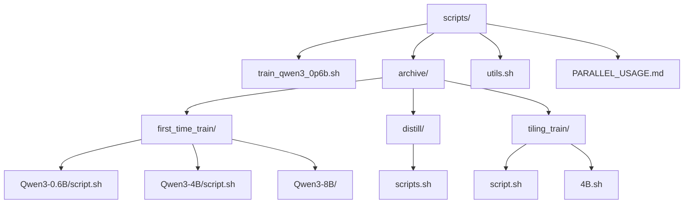
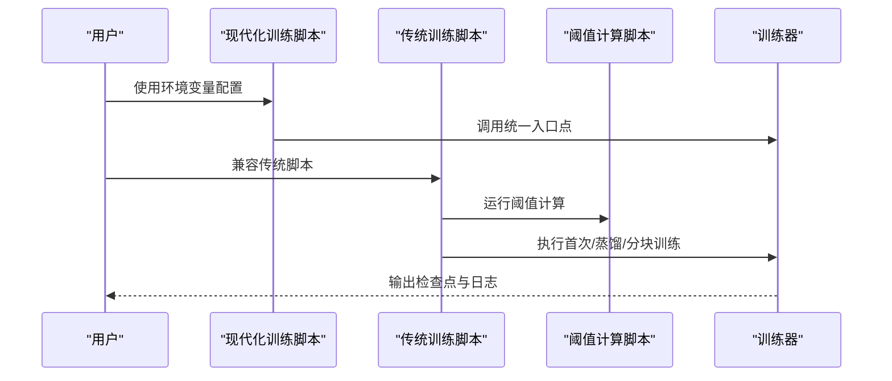
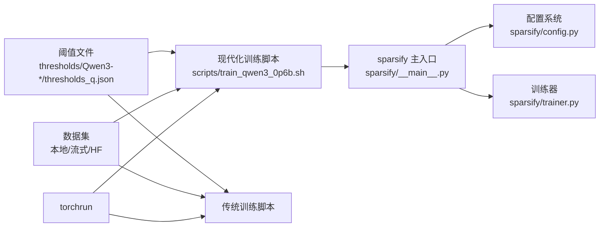

# 训练脚本模板

<cite>
**本文引用的文件**
- [scripts/train_qwen3_0p6b.sh](file://scripts/train_qwen3_0p6b.sh)
- [scripts/archive/first_time_train/Qwen3-0.6B/script.sh](file://scripts/archive/first_time_train/Qwen3-0.6B/script.sh)
- [scripts/archive/first_time_train/Qwen3-4B/script.sh](file://scripts/archive/first_time_train/Qwen3-4B/script.sh)
- [scripts/archive/first_time_train/Qwen3-8B/script.sh](file://scripts/archive/first_time_train/Qwen3-8B/script.sh)
- [scripts/archive/first_time_train/Qwen3-8B/run.sh](file://scripts/archive/first_time_train/Qwen3-8B/run.sh)
- [scripts/archive/first_time_train/Qwen3-8B/run_q.sh](file://scripts/archive/first_time_train/Qwen3-8B/run_q.sh)
- [scripts/archive/first_time_train/Qwen3-8B/run_up.sh](file://scripts/archive/first_time_train/Qwen3-8B/run_up.sh)
- [scripts/archive/distill/scripts.sh](file://scripts/archive/distill/scripts.sh)
- [scripts/archive/tiling_train/script.sh](file://scripts/archive/tiling_train/script.sh)
- [scripts/archive/tiling_train/4B.sh](file://scripts/archive/tiling_train/4B.sh)
- [scripts/utils.sh](file://scripts/utils.sh)
- [scripts/PARALLEL_USAGE.md](file://scripts/PARALLEL_USAGE.md)
- [compute_elbow_thresholds.py](file://compute_elbow_thresholds.py)
- [sparsify/__main__.py](file://sparsify/__main__.py)
- [sparsify/config.py](file://sparsify/config.py)
- [sparsify/trainer.py](file://sparsify/trainer.py)
- [thresholds/Qwen3-0.6B/thresholds_q.json](file://thresholds/Qwen3-0.6B/thresholds_q.json)
- [thresholds/Qwen3-4B/thresholds_q.json](file://thresholds/Qwen3-4B/thresholds_q.json)
- [thresholds/Qwen3-8B/thresholds_q.json](file://thresholds/Qwen3-8B/thresholds_q.json)
</cite>

## 更新摘要
**变更内容**
- 新增现代化 Qwen3-0.6B 训练脚本 `scripts/train_qwen3_0p6b.sh`，提供环境变量配置和高级训练功能
- 更新训练架构说明，反映新的分布式训练入口点
- 增强环境变量配置指南和参数定制化说明
- 完善性能优化和故障排查指南

## 目录
1. [简介](#简介)
2. [项目结构](#项目结构)
3. [核心组件](#核心组件)
4. [架构总览](#架构总览)
5. [详细组件分析](#详细组件分析)
6. [依赖分析](#依赖分析)
7. [性能考虑](#性能考虑)
8. [故障排查指南](#故障排查指南)
9. [结论](#结论)
10. [附录](#附录)

## 简介
本指南面向需要在不同规模模型（Qwen3-0.6B、Qwen3-4B、Qwen3-8B）上进行首次训练、蒸馏训练与分块训练的用户。内容涵盖：
- 不同规模模型的训练脚本模板与使用方法
- 分块训练脚本与蒸馏训练脚本的配置与执行流程
- 关键参数说明、资源需求估算与执行时间预估
- 脚本定制化修改指南、环境变量配置与日志分析方法
- 帮助用户根据自身硬件条件选择合适脚本并成功运行

**更新** 新增现代化训练脚本模板，提供更好的环境变量配置和高级训练功能

## 项目结构
训练脚本主要位于 scripts 目录下，按功能分为四类：
- 现代化训练脚本：基于新架构的统一入口点，支持环境变量配置
- 归档训练脚本：传统脚本模板，保留历史实现
- 蒸馏训练脚本：基于已有检查点进行低秩蒸馏
- 分块训练脚本：以较小显存占用进行训练或低秩训练



**图表来源**
- [scripts/train_qwen3_0p6b.sh:1-98](file://scripts/train_qwen3_0p6b.sh#L1-L98)
- [scripts/archive/first_time_train/Qwen3-0.6B/script.sh:1-124](file://scripts/archive/first_time_train/Qwen3-0.6B/script.sh#L1-L124)
- [scripts/archive/distill/scripts.sh:1-86](file://scripts/archive/distill/scripts.sh#L1-L86)
- [scripts/archive/tiling_train/script.sh:1-85](file://scripts/archive/tiling_train/script.sh#L1-L85)

**章节来源**
- [scripts/train_qwen3_0p6b.sh:1-98](file://scripts/train_qwen3_0p6b.sh#L1-L98)
- [scripts/archive/first_time_train/Qwen3-0.6B/script.sh:1-124](file://scripts/archive/first_time_train/Qwen3-0.6B/script.sh#L1-L124)
- [scripts/archive/distill/scripts.sh:1-86](file://scripts/archive/distill/scripts.sh#L1-L86)
- [scripts/archive/tiling_train/script.sh:1-85](file://scripts/archive/tiling_train/script.sh#L1-L85)

## 核心组件
- **现代化训练脚本**：基于 `scripts/train_qwen3_0p6b.sh`，提供统一的分布式训练入口点，支持丰富的环境变量配置和高级功能
- **归档训练脚本模板**：分别覆盖 Qwen3-0.6B、Qwen3-4B、Qwen3-8B 的完整训练流程，包含阈值计算、多 hookpoint 训练与参数配置
- **蒸馏训练脚本**：从已有检查点加载，冻结解码器或设置低秩约束，进行蒸馏训练
- **分块训练脚本**：通过减少每卡进程数或降低 k 值，适配更小显存的设备
- **阈值计算工具**：对指定 hookpoint 的激活分布进行拐点检测，输出阈值文件供训练脚本使用
- **并行运行指南**：提供多进程并行、端口管理与监控方法

**更新** 新增现代化训练脚本作为主要入口点，提供更好的配置灵活性

**章节来源**
- [scripts/train_qwen3_0p6b.sh:1-98](file://scripts/train_qwen3_0p6b.sh#L1-L98)
- [scripts/archive/first_time_train/Qwen3-0.6B/script.sh:1-124](file://scripts/archive/first_time_train/Qwen3-0.6B/script.sh#L1-L124)
- [scripts/archive/distill/scripts.sh:1-86](file://scripts/archive/distill/scripts.sh#L1-L86)
- [scripts/archive/tiling_train/script.sh:1-85](file://scripts/archive/tiling_train/script.sh#L1-L85)

## 架构总览
训练脚本整体流程如下：现代化脚本提供统一入口点，支持环境变量配置和高级功能；传统脚本保持兼容性；阈值计算工具生成各层 hookpoint 的阈值文件；随后启动多轮训练，分别覆盖注意力 q 投影、输出投影与 MLP up 投影等模块；对于大规模模型可采用分块或蒸馏策略以适应显存限制。



**图表来源**
- [scripts/train_qwen3_0p6b.sh:41-98](file://scripts/train_qwen3_0p6b.sh#L41-L98)
- [scripts/archive/first_time_train/Qwen3-0.6B/script.sh:1-124](file://scripts/archive/first_time_train/Qwen3-0.6B/script.sh#L1-L124)
- [compute_elbow_thresholds.py:1-660](file://compute_elbow_thresholds.py#L1-L660)

## 详细组件分析

### 现代化 Qwen3-0.6B 训练脚本
- **功能概述**：提供统一的分布式训练入口点，支持丰富的环境变量配置，内置性能分析和编译功能
- **关键特性**：
  - 环境变量驱动的配置系统（NPROC_PER_NODE、MASTER_PORT、MODEL_PATH 等）
  - 内置性能分析支持（nsys profile）
  - 模型编译优化（torch.compile）
  - 标准化的参数传递给训练器
- **环境变量配置**：
  - 分布式参数：NPROC_PER_NODE（默认2）、MASTER_PORT（默认29501）
  - 路径配置：MODEL_PATH（默认 $HOME/models/Qwen3-0.6B）、DATASET_PATH、ELBOW_THRESHOLD_PATH
  - 运行配置：WANDB_PROJECT（默认 qwen3-0.6B-0311）、SAVE_DIR、RUN_NAME
  - 性能选项：PROFILE（默认0）、COMPILE_MODEL（默认0）
- **执行流程**：
  - 解析环境变量并构建命令数组
  - 条件性启用性能分析和模型编译
  - 通过 torchrun 调用 sparsify 主入口

**更新** 新增现代化脚本作为推荐入口点，提供更好的配置灵活性和功能完整性

**章节来源**
- [scripts/train_qwen3_0p6b.sh:1-98](file://scripts/train_qwen3_0p6b.sh#L1-L98)

### Qwen3-0.6B 首次训练脚本模板
- **功能概述**：对 q 投影、o 投影与 up 投影三个模块分别进行训练，使用相同的阈值文件路径，控制上下文长度、批大小与梯度累积步数
- **关键参数要点**：
  - hookpoints：按层范围指定，区分 q/o/up 三种投影
  - ctx_len：上下文长度
  - batch_size、grad_acc_steps、micro_acc_steps：控制吞吐与显存占用
  - optimizer、lr、auxk_alpha：优化器与稀疏正则系数
  - save_every、save_best、max_tokens：检查点与训练时长控制
  - exceed_alphas：异常比例超参集合
- **资源与时间估算**：
  - 显存：单机8卡（NVIDIA A100/H100）可满足
  - 时间：单轮约1-2小时（取决于数据规模与硬件），三轮合计约3-6小时
- **执行建议**：
  - 首次运行前先生成阈值文件
  - 如显存紧张，可降低 batch_size 或增加 grad_acc_steps

**章节来源**
- [scripts/archive/first_time_train/Qwen3-0.6B/script.sh:1-124](file://scripts/archive/first_time_train/Qwen3-0.6B/script.sh#L1-L124)

### Qwen3-4B 首次训练脚本模板
- **功能概述**：同样覆盖 q 投影与 up 投影两类模块，但针对更大模型调整了阈值文件与部分超参
- **关键参数要点**：
  - elbow_threshold_path 指向 Qwen3-4B 对应阈值文件
  - exceed_alphas 集合与 0.6B 略有差异
  - 其他训练参数与 0.6B 类似
- **资源与时间估算**：
  - 显存：单机8卡通常可承载
  - 时间：约3-6小时（三轮）

**章节来源**
- [scripts/archive/first_time_train/Qwen3-4B/script.sh:1-124](file://scripts/archive/first_time_train/Qwen3-4B/script.sh#L1-L124)

### Qwen3-8B 首次训练脚本模板
- **功能概述**：提供两种组织方式：
  - 单脚本全量训练（script.sh）
  - 分阶段分层训练（run.sh → run_q.sh / run_up.sh）
- **关键参数要点**：
  - run_q.sh：按层分段训练 q 投影，使用不同的 hookpoints 与端口
  - run_up.sh：按层分段训练 up 投影
  - save_every 设为较大值以减少写入压力
  - elbow_threshold_path 指向 Qwen3-8B 对应阈值文件
- **资源与时间估算**：
  - 显存：单机8卡较稳妥
  - 时间：约6-12小时（视分段策略而定）

**章节来源**
- [scripts/archive/first_time_train/Qwen3-8B/script.sh:1-124](file://scripts/archive/first_time_train/Qwen3-8B/script.sh#L1-L124)
- [scripts/archive/first_time_train/Qwen3-8B/run.sh:1-5](file://scripts/archive/first_time_train/Qwen3-8B/run.sh#L1-L5)
- [scripts/archive/first_time_train/Qwen3-8B/run_q.sh:1-46](file://scripts/archive/first_time_train/Qwen3-8B/run_q.sh#L1-L46)
- [scripts/archive/first_time_train/Qwen3-8B/run_up.sh:1-46](file://scripts/archive/first_time_train/Qwen3-8B/run_up.sh#L1-L46)

### 蒸馏训练脚本模板
- **功能概述**：从已有检查点加载，冻结解码器或设置编码器秩，进行低秩蒸馏，降低训练成本
- **关键参数要点**：
  - distill_from：指定已训练好的检查点目录
  - encoder_rank：编码器秩
  - freeze_decoder：是否冻结解码器
  - distill_lambda_decode / distill_lambda_acts：蒸馏损失权重
  - 其余训练参数与常规训练一致
- **资源与时间估算**：
  - 显存：单机2卡或1卡可运行
  - 时间：约2-4小时（取决于数据规模）

**章节来源**
- [scripts/archive/distill/scripts.sh:1-86](file://scripts/archive/distill/scripts.sh#L1-L86)

### 分块训练脚本模板
- **功能概述**：通过减少每节点进程数或降低 k 值，使训练可在更小显存设备上完成
- **关键参数要点**：
  - nproc_per_node：每节点进程数（如1或2）
  - num_tiles：分块数量（低秩训练场景）
  - 其余参数与常规训练一致
- **资源与时间估算**：
  - 显存：单卡或双卡可运行
  - 时间：约2-4小时（取决于数据规模）

**章节来源**
- [scripts/archive/tiling_train/script.sh:1-85](file://scripts/archive/tiling_train/script.sh#L1-L85)
- [scripts/archive/tiling_train/4B.sh:1-36](file://scripts/archive/tiling_train/4B.sh#L1-L36)

### 阈值计算工具与阈值文件
- **功能概述**：对指定 hookpoint 的激活分布进行拐点检测，输出阈值文件，供训练脚本使用
- **关键参数要点**：
  - hookpoints：支持范围语法
  - num_tokens：采样 token 数
  - max_percentile：拐点检测上限分位
  - output：输出阈值文件路径
- **阈值文件格式**：
  - 每个层的 elbow_p 与 elbow_value，用于后续 alpha 计算

**章节来源**
- [compute_elbow_thresholds.py:1-660](file://compute_elbow_thresholds.py#L1-L660)
- [thresholds/Qwen3-0.6B/thresholds_q.json:1-114](file://thresholds/Qwen3-0.6B/thresholds_q.json#L1-L114)
- [thresholds/Qwen3-4B/thresholds_q.json:1-146](file://thresholds/Qwen3-4B/thresholds_q.json#L1-L146)
- [thresholds/Qwen3-8B/thresholds_q.json:1-146](file://thresholds/Qwen3-8B/thresholds_q.json#L1-L146)

### 并行运行指南
- **功能概述**：提供多进程并行、端口管理与监控方法，加速超参搜索与实验
- **关键要点**：
  - master_port：避免端口冲突
  - CUDA_VISIBLE_DEVICES：绑定 GPU
  - 并行方式：终端并行、后台运行、screen/tmux
- **预计时间**：
  - 顺序运行：约30小时（20实验）
  - 并行运行：约15小时（节省50%）

**章节来源**
- [scripts/PARALLEL_USAGE.md:1-166](file://scripts/PARALLEL_USAGE.md#L1-L166)

## 依赖分析
- **现代化脚本依赖**：直接调用 sparsify 主入口，支持完整的训练配置
- **传统脚本依赖**：阈值文件、数据集、分布式框架 torchrun
- **训练器依赖**：配置系统、分布式框架、优化器库
- **阈值文件依赖**：不同规模模型对应不同阈值文件



**图表来源**
- [scripts/train_qwen3_0p6b.sh:41-98](file://scripts/train_qwen3_0p6b.sh#L41-L98)
- [sparsify/__main__.py:131-211](file://sparsify/__main__.py#L131-L211)
- [sparsify/config.py:1-242](file://sparsify/config.py#L1-L242)
- [sparsify/trainer.py:1-200](file://sparsify/trainer.py#L1-L200)

**章节来源**
- [scripts/train_qwen3_0p6b.sh:1-98](file://scripts/train_qwen3_0p6b.sh#L1-L98)
- [sparsify/__main__.py:131-211](file://sparsify/__main__.py#L131-L211)
- [sparsify/config.py:1-242](file://sparsify/config.py#L1-L242)
- [sparsify/trainer.py:1-200](file://sparsify/trainer.py#L1-L200)

## 性能考虑
- **显存优化**
  - 降低 batch_size 或提高 grad_acc_steps
  - 减少 nproc_per_node 或启用分块训练
  - 使用冻结解码器或降低 encoder_rank
- **吞吐优化**
  - 提高 data_preprocessing_num_proc
  - 合理设置 ctx_len 与 max_examples
- **训练稳定性**
  - 适当降低学习率或调整 auxk_alpha
  - 使用阈值文件指导异常比例超参（exceed_alphas）
- **现代化脚本优化**
  - 启用模型编译（COMPILE_MODEL=1）提升内核融合效率
  - 使用性能分析（PROFILE=1）识别瓶颈
  - 合理配置分布式进程数优化通信开销

**更新** 新增现代化脚本的性能优化建议

## 故障排查指南
- **端口冲突**
  - 修改脚本中的 master_port（参考并行指南）
- **GPU 内存不足**
  - 降低 batch_size、grad_acc_steps 或 nproc_per_node
  - 切换至分块训练或蒸馏训练
- **阈值计算失败**
  - 检查 hookpoints 是否匹配模型结构
  - 调整 num_tokens 与 max_percentile
- **现代化脚本问题**
  - 检查环境变量配置是否正确
  - 验证路径权限和可用性
  - 使用 PROFILE 模式进行性能分析
- **日志分析**
  - 关注 wandb 日志与本地日志文件
  - 结合 exceed_alphas 与 loss 曲线判断收敛情况

**更新** 新增现代化脚本特有的故障排查方法

**章节来源**
- [scripts/PARALLEL_USAGE.md:137-166](file://scripts/PARALLEL_USAGE.md#L137-L166)
- [scripts/train_qwen3_0p6b.sh:81-95](file://scripts/train_qwen3_0p6b.sh#L81-L95)
- [compute_elbow_thresholds.py:70-95](file://compute_elbow_thresholds.py#L70-L95)

## 结论
通过本指南，用户可根据自身硬件条件选择合适的训练脚本模板，并结合阈值计算、并行运行与性能调优策略，高效完成 Qwen3 系列模型的首次训练、蒸馏训练与分块训练。现代化脚本提供了更好的配置灵活性和功能完整性，建议优先使用 `scripts/train_qwen3_0p6b.sh` 作为主要入口点，同时保留传统脚本以确保兼容性。

**更新** 强调现代化脚本的优势和推荐使用策略

## 附录

### 参数速查表（关键参数）
- **环境变量配置**：NPROC_PER_NODE、MASTER_PORT、MODEL_PATH、DATASET_PATH、ELBOW_THRESHOLD_PATH、WANDB_PROJECT、SAVE_DIR、RUN_NAME
- **性能选项**：PROFILE、PROFILE_OUTPUT、COMPILE_MODEL
- **训练参数**：ARCHITECTURE、EXPANSION_FACTOR、K、HOOKPOINTS、BATCH_SIZE、GRAD_ACC_STEPS、MICRO_ACC_STEPS、LR、MAX_TOKENS
- **传统参数**：hookpoints、ctx_len、batch_size、grad_acc_steps、micro_acc_steps、optimizer、lr、auxk_alpha、save_every、save_best、max_tokens、exceed_alphas
- **蒸馏参数**：distill_from、encoder_rank、freeze_decoder、distill_lambda_decode、distill_lambda_acts
- **分块参数**：num_tiles、num_proc

**更新** 新增现代化脚本的环境变量配置参数

**章节来源**
- [scripts/train_qwen3_0p6b.sh:6-39](file://scripts/train_qwen3_0p6b.sh#L6-L39)
- [scripts/archive/first_time_train/Qwen3-0.6B/script.sh:1-124](file://scripts/archive/first_time_train/Qwen3-0.6B/script.sh#L1-L124)
- [scripts/archive/distill/scripts.sh:1-86](file://scripts/archive/distill/scripts.sh#L1-L86)
- [scripts/archive/tiling_train/script.sh:1-85](file://scripts/archive/tiling_train/script.sh#L1-L85)

### 环境变量与工具链
- **CUDA_VISIBLE_DEVICES**：绑定 GPU
- **master_port**：torchrun 主端口
- **数据集路径**：本地路径或 HuggingFace 数据集名称
- **阈值文件路径**：按模型规模对应目录
- **现代化脚本特有**：PROFILE、COMPILE_MODEL、WANDB_PROJECT、SAVE_DIR

**更新** 新增现代化脚本的环境变量配置

**章节来源**
- [scripts/PARALLEL_USAGE.md:21-78](file://scripts/PARALLEL_USAGE.md#L21-L78)
- [scripts/train_qwen3_0p6b.sh:6-15](file://scripts/train_qwen3_0p6b.sh#L6-L15)
- [scripts/utils.sh:1-17](file://scripts/utils.sh#L1-L17)

### 现代化脚本使用示例
```bash
# 基础使用
export MODEL_PATH=/path/to/Qwen3-0.6B
export DATASET_PATH=/path/to/dataset
export ELBOW_THRESHOLD_PATH=/path/to/thresholds_q.json
./scripts/train_qwen3_0p6b.sh

# 启用性能分析
export PROFILE=1
export PROFILE_OUTPUT=logs/profile
./scripts/train_qwen3_0p6b.sh

# 启用模型编译
export COMPILE_MODEL=1
./scripts/train_qwen3_0p6b.sh
```

**更新** 新增现代化脚本的具体使用示例