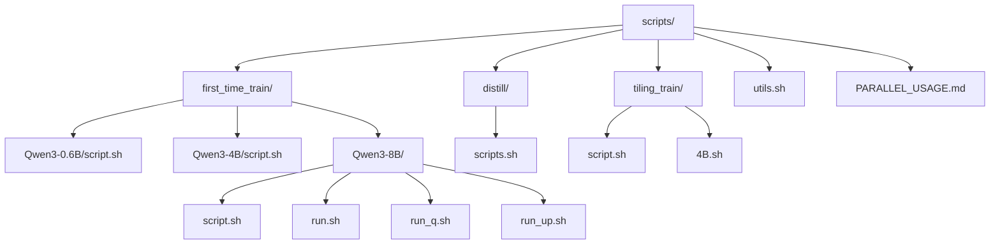
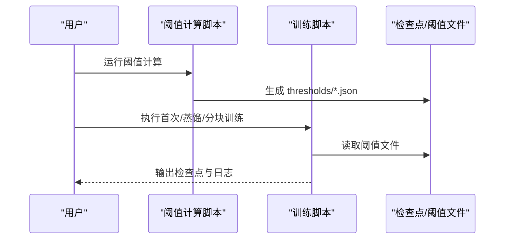
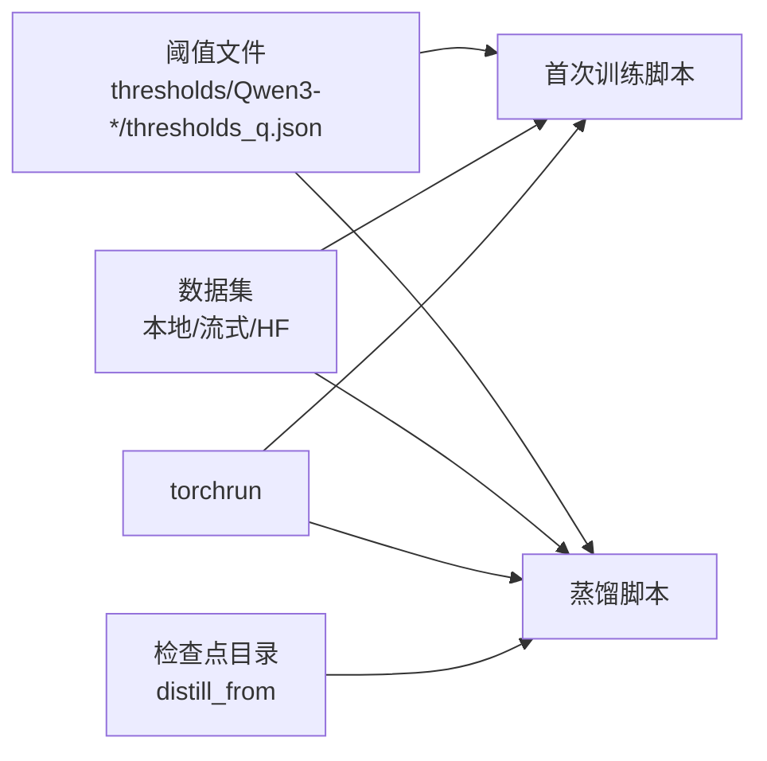

# 训练脚本模板

<cite>
**本文引用的文件**
- [scripts/first_time_train/Qwen3-0.6B/script.sh](file://scripts/first_time_train/Qwen3-0.6B/script.sh)
- [scripts/first_time_train/Qwen3-4B/script.sh](file://scripts/first_time_train/Qwen3-4B/script.sh)
- [scripts/first_time_train/Qwen3-8B/script.sh](file://scripts/first_time_train/Qwen3-8B/script.sh)
- [scripts/first_time_train/Qwen3-8B/run.sh](file://scripts/first_time_train/Qwen3-8B/run.sh)
- [scripts/first_time_train/Qwen3-8B/run_q.sh](file://scripts/first_time_train/Qwen3-8B/run_q.sh)
- [scripts/first_time_train/Qwen3-8B/run_up.sh](file://scripts/first_time_train/Qwen3-8B/run_up.sh)
- [scripts/distill/scripts.sh](file://scripts/distill/scripts.sh)
- [scripts/tiling_train/script.sh](file://scripts/tiling_train/script.sh)
- [scripts/tiling_train/4B.sh](file://scripts/tiling_train/4B.sh)
- [scripts/utils.sh](file://scripts/utils.sh)
- [scripts/PARALLEL_USAGE.md](file://scripts/PARALLEL_USAGE.md)
- [compute_elbow_thresholds.py](file://compute_elbow_thresholds.py)
- [thresholds/Qwen3-0.6B/thresholds_q.json](file://thresholds/Qwen3-0.6B/thresholds_q.json)
- [thresholds/Qwen3-4B/thresholds_q.json](file://thresholds/Qwen3-4B/thresholds_q.json)
- [thresholds/Qwen3-8B/thresholds_q.json](file://thresholds/Qwen3-8B/thresholds_q.json)
</cite>

## 目录
1. [简介](#简介)
2. [项目结构](#项目结构)
3. [核心组件](#核心组件)
4. [架构总览](#架构总览)
5. [详细组件分析](#详细组件分析)
6. [依赖分析](#依赖分析)
7. [性能考虑](#性能考虑)
8. [故障排查指南](#故障排查指南)
9. [结论](#结论)
10. [附录](#附录)

## 简介
本指南面向需要在不同规模模型（Qwen3-0.6B、Qwen3-4B、Qwen3-8B）上进行首次训练、蒸馏训练与分块训练的用户。内容涵盖：
- 不同规模模型的训练脚本模板与使用方法
- 分块训练脚本与蒸馏训练脚本的配置与执行流程
- 关键参数说明、资源需求估算与执行时间预估
- 脚本定制化修改指南、环境变量配置与日志分析方法
- 帮助用户根据自身硬件条件选择合适脚本并成功运行

## 项目结构
训练脚本主要位于 scripts 目录下，按功能分为三类：
- 首次训练脚本：针对不同规模模型的完整训练流程
- 蒸馏训练脚本：基于已有检查点进行低秩蒸馏
- 分块训练脚本：以较小显存占用进行训练或低秩训练

**图表来源**
- [scripts/first_time_train/Qwen3-0.6B/script.sh:1-124](file://scripts/first_time_train/Qwen3-0.6B/script.sh#L1-L124)
- [scripts/first_time_train/Qwen3-4B/script.sh:1-124](file://scripts/first_time_train/Qwen3-4B/script.sh#L1-L124)
- [scripts/first_time_train/Qwen3-8B/script.sh:1-124](file://scripts/first_time_train/Qwen3-8B/script.sh#L1-L124)
- [scripts/first_time_train/Qwen3-8B/run.sh:1-5](file://scripts/first_time_train/Qwen3-8B/run.sh#L1-L5)
- [scripts/first_time_train/Qwen3-8B/run_q.sh:1-46](file://scripts/first_time_train/Qwen3-8B/run_q.sh#L1-L46)
- [scripts/first_time_train/Qwen3-8B/run_up.sh:1-46](file://scripts/first_time_train/Qwen3-8B/run_up.sh#L1-L46)
- [scripts/distill/scripts.sh:1-86](file://scripts/distill/scripts.sh#L1-L86)
- [scripts/tiling_train/script.sh:1-85](file://scripts/tiling_train/script.sh#L1-L85)
- [scripts/tiling_train/4B.sh:1-36](file://scripts/tiling_train/4B.sh#L1-L36)
- [scripts/utils.sh:1-17](file://scripts/utils.sh#L1-L17)
- [scripts/PARALLEL_USAGE.md:1-166](file://scripts/PARALLEL_USAGE.md#L1-L166)

**章节来源**
- [scripts/first_time_train/Qwen3-0.6B/script.sh:1-124](file://scripts/first_time_train/Qwen3-0.6B/script.sh#L1-L124)
- [scripts/first_time_train/Qwen3-4B/script.sh:1-124](file://scripts/first_time_train/Qwen3-4B/script.sh#L1-L124)
- [scripts/first_time_train/Qwen3-8B/script.sh:1-124](file://scripts/first_time_train/Qwen3-8B/script.sh#L1-L124)
- [scripts/first_time_train/Qwen3-8B/run.sh:1-5](file://scripts/first_time_train/Qwen3-8B/run.sh#L1-L5)
- [scripts/first_time_train/Qwen3-8B/run_q.sh:1-46](file://scripts/first_time_train/Qwen3-8B/run_q.sh#L1-L46)
- [scripts/first_time_train/Qwen3-8B/run_up.sh:1-46](file://scripts/first_time_train/Qwen3-8B/run_up.sh#L1-L46)
- [scripts/distill/scripts.sh:1-86](file://scripts/distill/scripts.sh#L1-L86)
- [scripts/tiling_train/script.sh:1-85](file://scripts/tiling_train/script.sh#L1-L85)
- [scripts/tiling_train/4B.sh:1-36](file://scripts/tiling_train/4B.sh#L1-L36)
- [scripts/utils.sh:1-17](file://scripts/utils.sh#L1-L17)
- [scripts/PARALLEL_USAGE.md:1-166](file://scripts/PARALLEL_USAGE.md#L1-L166)

## 核心组件
- 首次训练脚本模板：分别覆盖 Qwen3-0.6B、Qwen3-4B、Qwen3-8B 的完整训练流程，包含阈值计算、多 hookpoint 训练与参数配置。
- 蒸馏训练脚本：从已有检查点加载，冻结解码器或设置低秩约束，进行蒸馏训练。
- 分块训练脚本：通过减少每卡进程数或降低 k 值，适配更小显存的设备。
- 阈值计算工具：对指定 hookpoint 的激活分布进行拐点检测，输出阈值文件供训练脚本使用。
- 并行运行指南：提供多进程并行、端口管理与监控方法。

**章节来源**
- [scripts/first_time_train/Qwen3-0.6B/script.sh:1-124](file://scripts/first_time_train/Qwen3-0.6B/script.sh#L1-L124)
- [scripts/first_time_train/Qwen3-4B/script.sh:1-124](file://scripts/first_time_train/Qwen3-4B/script.sh#L1-L124)
- [scripts/first_time_train/Qwen3-8B/script.sh:1-124](file://scripts/first_time_train/Qwen3-8B/script.sh#L1-L124)
- [scripts/distill/scripts.sh:1-86](file://scripts/distill/scripts.sh#L1-L86)
- [scripts/tiling_train/script.sh:1-85](file://scripts/tiling_train/script.sh#L1-L85)
- [compute_elbow_thresholds.py:1-660](file://compute_elbow_thresholds.py#L1-L660)
- [scripts/PARALLEL_USAGE.md:1-166](file://scripts/PARALLEL_USAGE.md#L1-L166)

## 架构总览
训练脚本整体流程如下：先运行阈值计算，生成各层 hookpoint 的阈值文件；随后启动多轮训练，分别覆盖注意力 q 投影、输出投影与 MLP up 投影等模块；对于大规模模型可采用分块或蒸馏策略以适应显存限制。

**图表来源**
- [compute_elbow_thresholds.py:364-656](file://compute_elbow_thresholds.py#L364-L656)
- [scripts/first_time_train/Qwen3-0.6B/script.sh:1-124](file://scripts/first_time_train/Qwen3-0.6B/script.sh#L1-L124)
- [scripts/distill/scripts.sh:1-86](file://scripts/distill/scripts.sh#L1-L86)
- [scripts/tiling_train/script.sh:1-85](file://scripts/tiling_train/script.sh#L1-L85)

## 详细组件分析

### Qwen3-0.6B 首次训练脚本模板
- 功能概述：对 q 投影、o 投影与 up 投影三个模块分别进行训练，使用相同的阈值文件路径，控制上下文长度、批大小与梯度累积步数。
- 关键参数要点：
  - hookpoints：按层范围指定，区分 q/o/up 三种投影
  - ctx_len：上下文长度
  - batch_size、grad_acc_steps、micro_acc_steps：控制吞吐与显存占用
  - optimizer、lr、auxk_alpha：优化器与稀疏正则系数
  - save_every、save_best、max_tokens：检查点与训练时长控制
  - exceed_alphas：异常比例超参集合
- 资源与时间估算：
  - 显存：单机8卡（NVIDIA A100/H100）可满足
  - 时间：单轮约1-2小时（取决于数据规模与硬件），三轮合计约3-6小时
- 执行建议：
  - 首次运行前先生成阈值文件
  - 如显存紧张，可降低 batch_size 或增加 grad_acc_steps

**章节来源**
- [scripts/first_time_train/Qwen3-0.6B/script.sh:1-124](file://scripts/first_time_train/Qwen3-0.6B/script.sh#L1-L124)

### Qwen3-4B 首次训练脚本模板
- 功能概述：同样覆盖 q 投影与 up 投影两类模块，但针对更大模型调整了阈值文件与部分超参。
- 关键参数要点：
  - elbow_threshold_path 指向 Qwen3-4B 对应阈值文件
  - exceed_alphas 集合与 0.6B 略有差异
  - 其他训练参数与 0.6B 类似
- 资源与时间估算：
  - 显存：单机8卡通常可承载
  - 时间：约3-6小时（三轮）

**章节来源**
- [scripts/first_time_train/Qwen3-4B/script.sh:1-124](file://scripts/first_time_train/Qwen3-4B/script.sh#L1-L124)

### Qwen3-8B 首次训练脚本模板
- 功能概述：提供两种组织方式：
  - 单脚本全量训练（script.sh）
  - 分阶段分层训练（run.sh → run_q.sh / run_up.sh）
- 关键参数要点：
  - run_q.sh：按层分段训练 q 投影，使用不同的 hookpoints 与端口
  - run_up.sh：按层分段训练 up 投影
  - save_every 设为较大值以减少写入压力
  - elbow_threshold_path 指向 Qwen3-8B 对应阈值文件
- 资源与时间估算：
  - 显存：单机8卡较稳妥
  - 时间：约6-12小时（视分段策略而定）

**章节来源**
- [scripts/first_time_train/Qwen3-8B/script.sh:1-124](file://scripts/first_time_train/Qwen3-8B/script.sh#L1-L124)
- [scripts/first_time_train/Qwen3-8B/run.sh:1-5](file://scripts/first_time_train/Qwen3-8B/run.sh#L1-L5)
- [scripts/first_time_train/Qwen3-8B/run_q.sh:1-46](file://scripts/first_time_train/Qwen3-8B/run_q.sh#L1-L46)
- [scripts/first_time_train/Qwen3-8B/run_up.sh:1-46](file://scripts/first_time_train/Qwen3-8B/run_up.sh#L1-L46)

### 蒸馏训练脚本模板
- 功能概述：从已有检查点加载，冻结解码器或设置编码器秩，进行低秩蒸馏，降低训练成本。
- 关键参数要点：
  - distill_from：指定已训练好的检查点目录
  - encoder_rank：编码器秩
  - freeze_decoder：是否冻结解码器
  - distill_lambda_decode / distill_lambda_acts：蒸馏损失权重
  - 其余训练参数与常规训练一致
- 资源与时间估算：
  - 显存：单机2卡或1卡可运行
  - 时间：约2-4小时（取决于数据规模）

**章节来源**
- [scripts/distill/scripts.sh:1-86](file://scripts/distill/scripts.sh#L1-L86)

### 分块训练脚本模板
- 功能概述：通过减少每节点进程数或降低 k 值，使训练可在更小显存设备上完成。
- 关键参数要点：
  - nproc_per_node：每节点进程数（如1或2）
  - num_tiles：分块数量（低秩训练场景）
  - 其余参数与常规训练一致
- 资源与时间估算：
  - 显存：单卡或双卡可运行
  - 时间：约2-4小时（取决于数据规模）

**章节来源**
- [scripts/tiling_train/script.sh:1-85](file://scripts/tiling_train/script.sh#L1-L85)
- [scripts/tiling_train/4B.sh:1-36](file://scripts/tiling_train/4B.sh#L1-L36)

### 阈值计算工具与阈值文件
- 功能概述：对指定 hookpoint 的激活分布进行拐点检测，输出阈值文件，供训练脚本使用。
- 关键参数要点：
  - hookpoints：支持范围语法
  - num_tokens：采样 token 数
  - max_percentile：拐点检测上限分位
  - output：输出阈值文件路径
- 阈值文件格式：
  - 每个层的 elbow_p 与 elbow_value，用于后续 alpha 计算

**章节来源**
- [compute_elbow_thresholds.py:1-660](file://compute_elbow_thresholds.py#L1-L660)
- [thresholds/Qwen3-0.6B/thresholds_q.json:1-114](file://thresholds/Qwen3-0.6B/thresholds_q.json#L1-L114)
- [thresholds/Qwen3-4B/thresholds_q.json:1-146](file://thresholds/Qwen3-4B/thresholds_q.json#L1-L146)
- [thresholds/Qwen3-8B/thresholds_q.json:1-146](file://thresholds/Qwen3-8B/thresholds_q.json#L1-L146)

### 并行运行指南
- 功能概述：提供多进程并行、端口管理与监控方法，加速超参搜索与实验。
- 关键要点：
  - master_port：避免端口冲突
  - CUDA_VISIBLE_DEVICES：绑定 GPU
  - 并行方式：终端并行、后台运行、screen/tmux
- 预计时间：
  - 顺序运行：约30小时（20实验）
  - 并行运行：约15小时（节省50%）

**章节来源**
- [scripts/PARALLEL_USAGE.md:1-166](file://scripts/PARALLEL_USAGE.md#L1-L166)

## 依赖分析
- 训练脚本依赖阈值文件：不同规模模型对应不同阈值文件
- 训练脚本依赖数据集：支持本地路径与 HuggingFace 流式数据集
- 训练脚本依赖分布式框架：torchrun 多进程训练
- 蒸馏脚本依赖已有检查点：distill_from 指定的目录

**图表来源**
- [scripts/first_time_train/Qwen3-0.6B/script.sh:1-124](file://scripts/first_time_train/Qwen3-0.6B/script.sh#L1-L124)
- [scripts/first_time_train/Qwen3-4B/script.sh:1-124](file://scripts/first_time_train/Qwen3-4B/script.sh#L1-L124)
- [scripts/first_time_train/Qwen3-8B/script.sh:1-124](file://scripts/first_time_train/Qwen3-8B/script.sh#L1-L124)
- [scripts/distill/scripts.sh:1-86](file://scripts/distill/scripts.sh#L1-L86)
- [compute_elbow_thresholds.py:364-656](file://compute_elbow_thresholds.py#L364-L656)

**章节来源**
- [scripts/first_time_train/Qwen3-0.6B/script.sh:1-124](file://scripts/first_time_train/Qwen3-0.6B/script.sh#L1-L124)
- [scripts/first_time_train/Qwen3-4B/script.sh:1-124](file://scripts/first_time_train/Qwen3-4B/script.sh#L1-L124)
- [scripts/first_time_train/Qwen3-8B/script.sh:1-124](file://scripts/first_time_train/Qwen3-8B/script.sh#L1-L124)
- [scripts/distill/scripts.sh:1-86](file://scripts/distill/scripts.sh#L1-L86)
- [compute_elbow_thresholds.py:364-656](file://compute_elbow_thresholds.py#L364-L656)

## 性能考虑
- 显存优化
  - 降低 batch_size 或提高 grad_acc_steps
  - 减少 nproc_per_node 或启用分块训练
  - 使用冻结解码器或降低 encoder_rank
- 吞吐优化
  - 提高 data_preprocessing_num_proc
  - 合理设置 ctx_len 与 max_examples
- 训练稳定性
  - 适当降低学习率或调整 auxk_alpha
  - 使用阈值文件指导异常比例超参（exceed_alphas）

[本节为通用建议，无需特定文件来源]

## 故障排查指南
- 端口冲突
  - 修改脚本中的 master_port（参考并行指南）
- GPU 内存不足
  - 降低 batch_size、grad_acc_steps 或 nproc_per_node
  - 切换至分块训练或蒸馏训练
- 阈值计算失败
  - 检查 hookpoints 是否匹配模型结构
  - 调整 num_tokens 与 max_percentile
- 日志分析
  - 关注 wandb 日志与本地日志文件
  - 结合 exceed_alphas 与 loss 曲线判断收敛情况

**章节来源**
- [scripts/PARALLEL_USAGE.md:137-166](file://scripts/PARALLEL_USAGE.md#L137-L166)
- [compute_elbow_thresholds.py:70-95](file://compute_elbow_thresholds.py#L70-L95)

## 结论
通过本指南，用户可根据自身硬件条件选择合适的训练脚本模板，并结合阈值计算、并行运行与性能调优策略，高效完成 Qwen3 系列模型的首次训练、蒸馏训练与分块训练。建议优先完成阈值计算与小规模预实验，再逐步扩大规模与复杂度。

[本节为总结性内容，无需特定文件来源]

## 附录

### 参数速查表（关键参数）
- hookpoints：指定要训练的层与模块（支持范围语法）
- ctx_len：上下文长度
- batch_size：每卡批大小
- grad_acc_steps：梯度累积步数
- micro_acc_steps：微累积步数
- optimizer/lr：优化器与学习率
- auxk_alpha：稀疏正则系数
- save_every/save_best：检查点保存策略
- max_tokens：最大 token 数
- exceed_alphas：异常比例超参集合
- distill_from/encoder_rank/freeze_decoder：蒸馏相关参数
- num_tiles：分块数量

**章节来源**
- [scripts/first_time_train/Qwen3-0.6B/script.sh:1-124](file://scripts/first_time_train/Qwen3-0.6B/script.sh#L1-L124)
- [scripts/first_time_train/Qwen3-4B/script.sh:1-124](file://scripts/first_time_train/Qwen3-4B/script.sh#L1-L124)
- [scripts/first_time_train/Qwen3-8B/script.sh:1-124](file://scripts/first_time_train/Qwen3-8B/script.sh#L1-L124)
- [scripts/distill/scripts.sh:1-86](file://scripts/distill/scripts.sh#L1-L86)
- [scripts/tiling_train/script.sh:1-85](file://scripts/tiling_train/script.sh#L1-L85)

### 环境变量与工具链
- CUDA_VISIBLE_DEVICES：绑定 GPU
- master_port：torchrun 主端口
- 数据集路径：本地路径或 HuggingFace 数据集名称
- 阈值文件路径：按模型规模对应目录

**章节来源**
- [scripts/PARALLEL_USAGE.md:21-78](file://scripts/PARALLEL_USAGE.md#L21-L78)
- [scripts/utils.sh:1-17](file://scripts/utils.sh#L1-L17)