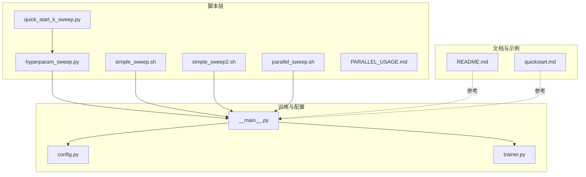
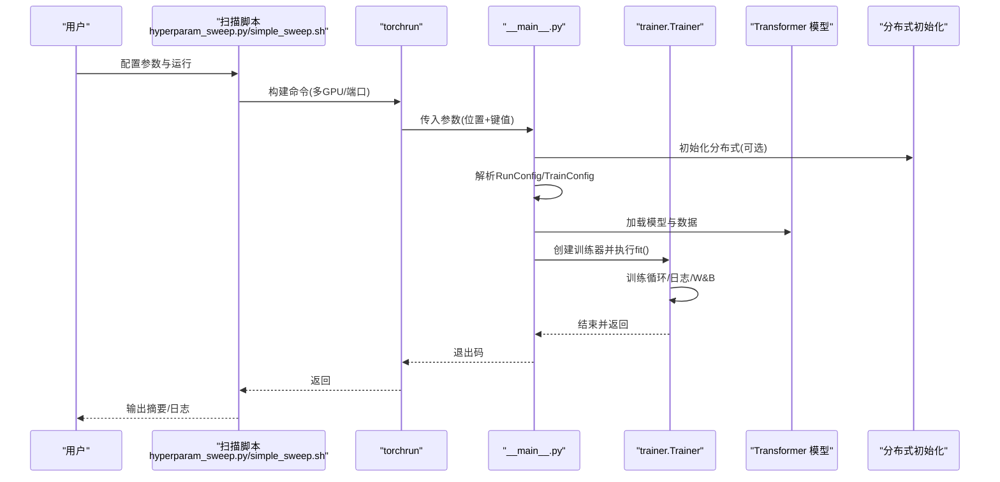
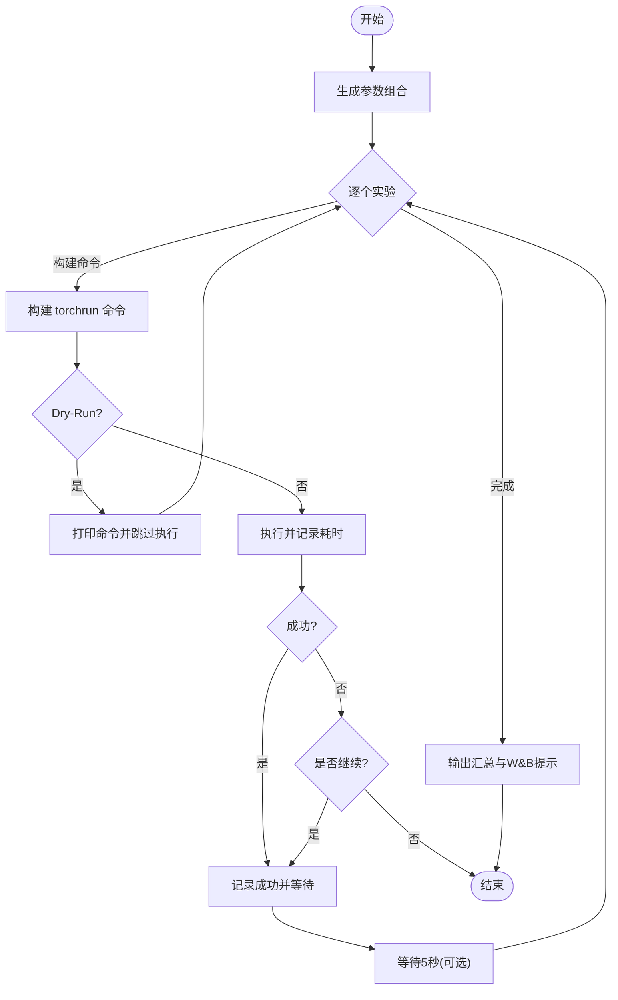
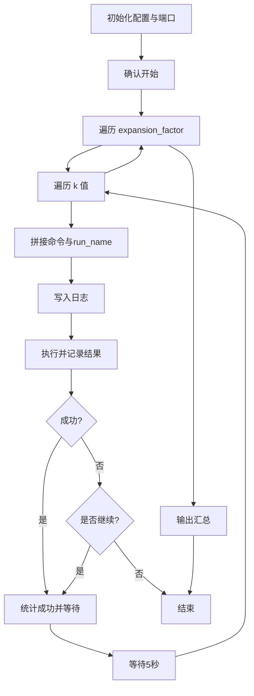
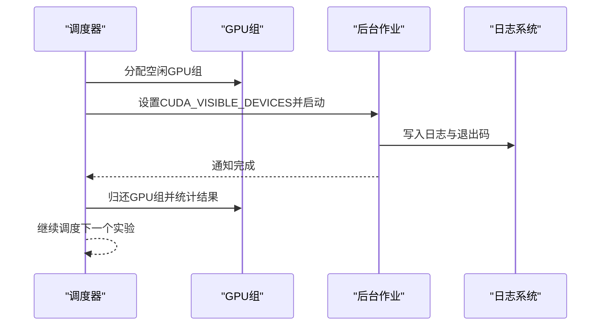
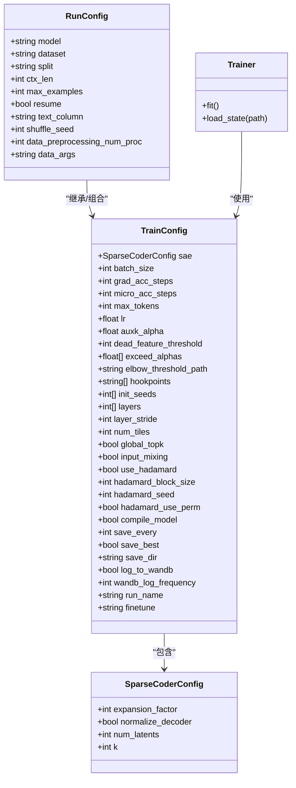
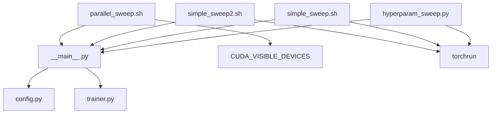

# 超参数调优脚本

<cite>
**本文引用的文件**
- [hyperparam_sweep.py](file://scripts/hyperparam_sweep.py)
- [simple_sweep.sh](file://scripts/simple_sweep.sh)
- [simple_sweep2.sh](file://scripts/simple_sweep2.sh)
- [parallel_sweep.sh](file://scripts/parallel_sweep.sh)
- [quick_start_k_sweep.py](file://scripts/quick_start_k_sweep.py)
- [PARALLEL_USAGE.md](file://scripts/PARALLEL_USAGE.md)
- [__main__.py](file://sparsify/__main__.py)
- [config.py](file://sparsify/config.py)
- [trainer.py](file://sparsify/trainer.py)
- [README.md](file://README.md)
- [quickstart.md](file://docs/training/quickstart.md)
</cite>

## 目录
1. [简介](#简介)
2. [项目结构](#项目结构)
3. [核心组件](#核心组件)
4. [架构总览](#架构总览)
5. [详细组件分析](#详细组件分析)
6. [依赖分析](#依赖分析)
7. [性能考虑](#性能考虑)
8. [故障排查指南](#故障排查指南)
9. [结论](#结论)
10. [附录](#附录)

## 简介
本文件面向使用 Sparsify 进行稀疏自编码器（SAE）训练与导出的工程师与研究者，系统化讲解超参数调优脚本的使用方法与最佳实践。内容覆盖：
- 简单扫描脚本的使用与参数范围设置（学习率、稀疏度等关键超参数）
- 高级扫描脚本的功能（并行调优、网格搜索、随机搜索策略）
- 并行扫描脚本的分布式执行配置与资源管理
- 自动化调优流程、实验管理与结果比较工具
- 实验设计原则、结果分析方法与性能优化建议

## 项目结构
围绕超参数调优的核心脚本与训练入口如下：
- 脚本层
  - scripts/hyperparam_sweep.py：基于 Python 的网格搜索脚本，支持分布式多 GPU 执行与 Dry-Run 预览
  - scripts/simple_sweep.sh：基础 Bash 网格搜索脚本
  - scripts/simple_sweep2.sh：基础 Bash 网格搜索脚本（第二组参数组合）
  - scripts/parallel_sweep.sh：并行扫描脚本，按 GPU 组并发调度
  - scripts/quick_start_k_sweep.py：快速启动脚本，基于已有发现进行精细搜索
  - scripts/PARALLEL_USAGE.md：并行运行说明与推荐配置
- 训练与配置层
  - sparsify/__main__.py：CLI 入口与参数解析
  - sparsify/config.py：训练与稀疏编码器配置定义
  - sparsify/trainer.py：训练器实现与分布式初始化
- 文档与示例
  - README.md：项目概览与主要功能
  - docs/training/quickstart.md：训练快速入门与参数说明

**图表来源**
- [hyperparam_sweep.py:1-273](file://scripts/hyperparam_sweep.py#L1-L273)
- [simple_sweep.sh:1-133](file://scripts/simple_sweep.sh#L1-L133)
- [simple_sweep2.sh:1-133](file://scripts/simple_sweep2.sh#L1-L133)
- [parallel_sweep.sh:1-215](file://scripts/parallel_sweep.sh#L1-L215)
- [quick_start_k_sweep.py:1-48](file://scripts/quick_start_k_sweep.py#L1-L48)
- [PARALLEL_USAGE.md:1-166](file://scripts/PARALLEL_USAGE.md#L1-L166)
- [__main__.py:1-211](file://sparsify/__main__.py#L1-L211)
- [config.py:1-149](file://sparsify/config.py#L1-L149)
- [trainer.py:1-200](file://sparsify/trainer.py#L1-L200)
- [README.md:1-154](file://README.md#L1-L154)
- [quickstart.md:1-153](file://docs/training/quickstart.md#L1-L153)

**章节来源**
- [README.md:1-154](file://README.md#L1-L154)
- [quickstart.md:1-153](file://docs/training/quickstart.md#L1-L153)

## 核心组件
- 网格搜索脚本（Python）
  - 支持通过 BASE_CONFIG 与 SWEEP_PARAMS 控制基础配置与待扫参数
  - 自动构建 torchrun 命令，支持分布式多 GPU 与端口递增避免冲突
  - 提供 Dry-Run、继续失败、限制样本数等实用选项
- 简单扫描脚本（Bash）
  - 两套 Bash 脚本分别定义不同的 expansion_factor 与 k 组合
  - 统一日志记录与成功/失败统计
- 并行扫描脚本（Bash）
  - 基于 GPU 组（如 0-3、4-7）并发调度，自动等待槽位释放
  - 通过 CUDA_VISIBLE_DEVICES 精确绑定 GPU
- 快速启动脚本（Python）
  - 复用主扫描脚本配置，针对特定发现（如 k≈32）进行精细搜索
- 训练入口与配置
  - CLI 参数解析与分布式初始化
  - 训练配置（含 expansion_factor、k、优化器、日志等）定义

**章节来源**
- [hyperparam_sweep.py:19-82](file://scripts/hyperparam_sweep.py#L19-L82)
- [simple_sweep.sh:7-50](file://scripts/simple_sweep.sh#L7-L50)
- [simple_sweep2.sh:7-50](file://scripts/simple_sweep2.sh#L7-L50)
- [parallel_sweep.sh:8-52](file://scripts/parallel_sweep.sh#L8-L52)
- [quick_start_k_sweep.py:9-26](file://scripts/quick_start_k_sweep.py#L9-L26)
- [__main__.py:31-80](file://sparsify/__main__.py#L31-L80)
- [config.py:7-68](file://sparsify/config.py#L7-L68)

## 架构总览
下图展示从脚本到训练器的调用链路与关键参数传递：

**图表来源**
- [hyperparam_sweep.py:93-125](file://scripts/hyperparam_sweep.py#L93-L125)
- [simple_sweep.sh:18-50](file://scripts/simple_sweep.sh#L18-L50)
- [__main__.py:131-206](file://sparsify/__main__.py#L131-L206)
- [trainer.py:162-200](file://sparsify/trainer.py#L162-L200)

## 详细组件分析

### 组件A：Python 网格搜索脚本（hyperparam_sweep.py）
- 功能要点
  - 基于 itertools.product 生成参数组合，支持 expansion_factor 与 k 的网格搜索
  - 自动构建 torchrun 命令，包含 nproc_per_node、master_port、run_name 等
  - 支持 Dry-Run 预览、失败后继续或停止、样本数覆盖、端口递增
  - 输出可视化提示，便于在 W&B 中对比运行
- 关键参数与范围
  - expansion_factor：用于控制稀疏编码器维度（扩展因子）
  - k：稀疏度（每步非零特征数）
  - 其他常用超参数：batch_size、grad_acc_steps、lr、auxk_alpha、dead_feature_threshold、max_tokens、log_to_wandb 等
- 分布式与资源
  - 每次实验递增 master_port，避免端口冲突
  - 通过 --nproc_per_node 指定 GPU 数量
- 使用建议
  - 先使用 --dry-run 验证命令
  - 在大规模扫描前，先用较小 max_tokens 快速验证流程
  - 成功后开启 --continue-on-error 以提高吞吐

**图表来源**
- [hyperparam_sweep.py:160-268](file://scripts/hyperparam_sweep.py#L160-L268)

**章节来源**
- [hyperparam_sweep.py:19-82](file://scripts/hyperparam_sweep.py#L19-L82)
- [hyperparam_sweep.py:85-125](file://scripts/hyperparam_sweep.py#L85-L125)
- [hyperparam_sweep.py:128-158](file://scripts/hyperparam_sweep.py#L128-L158)
- [hyperparam_sweep.py:160-268](file://scripts/hyperparam_sweep.py#L160-L268)

### 组件B：Bash 简单扫描脚本（simple_sweep.sh / simple_sweep2.sh）
- 功能要点
  - 定义 EXPANSION_FACTORS 与 K_VALUES，生成笛卡尔积组合
  - 统一 BASE_CMD，拼接 expansion_factor 与 k，并生成 run_name
  - 日志文件记录命令与结果，支持失败后交互继续
- 并行运行
  - 两脚本分别使用不同 master_port，可在 8 卡机上并行运行
  - 支持终端、后台、screen/tmux 等多种运行方式
- 使用建议
  - 根据硬件调整 NUM_GPUS 与 MASTER_PORT
  - 若显存不足，可减少每组 GPU 或改为顺序运行

**图表来源**
- [simple_sweep.sh:52-132](file://scripts/simple_sweep.sh#L52-L132)
- [simple_sweep2.sh:52-132](file://scripts/simple_sweep2.sh#L52-L132)

**章节来源**
- [simple_sweep.sh:7-50](file://scripts/simple_sweep.sh#L7-L50)
- [simple_sweep.sh:52-132](file://scripts/simple_sweep.sh#L52-L132)
- [simple_sweep2.sh:7-50](file://scripts/simple_sweep2.sh#L7-L50)
- [simple_sweep2.sh:52-132](file://scripts/simple_sweep2.sh#L52-L132)
- [PARALLEL_USAGE.md:21-78](file://scripts/PARALLEL_USAGE.md#L21-L78)

### 组件C：并行扫描脚本（parallel_sweep.sh）
- 功能要点
  - 基于 GPU 组（如 "0,1,2,3"）并发调度，最多同时运行 GPU_GROUPS 数量的实验
  - 通过 CUDA_VISIBLE_DEVICES 精确绑定 GPU，避免资源抢占
  - 自动检测作业完成并回收 GPU 组，支持端口递增
- 资源管理
  - GPU_GROUP_SIZE 与 GPU_GROUPS 可按实际设备调整
  - 日志目录 logs/ 下保存每个 run_name 的日志与退出码
- 使用建议
  - 确保 GPU 组划分与硬件拓扑匹配
  - 适当增大实验间隔（sleep）以降低资源抖动

**图表来源**
- [parallel_sweep.sh:88-153](file://scripts/parallel_sweep.sh#L88-L153)
- [parallel_sweep.sh:155-203](file://scripts/parallel_sweep.sh#L155-L203)

**章节来源**
- [parallel_sweep.sh:8-52](file://scripts/parallel_sweep.sh#L8-L52)
- [parallel_sweep.sh:88-153](file://scripts/parallel_sweep.sh#L88-L153)
- [parallel_sweep.sh:155-203](file://scripts/parallel_sweep.sh#L155-L203)

### 组件D：快速启动脚本（quick_start_k_sweep.py）
- 功能要点
  - 复用主扫描脚本的 BASE_CONFIG 与 SWEEP_PARAMS
  - 针对已发现的较优区域（如 k≈32）进行精细搜索
  - 可快速切换 max_tokens 进行快速测试
- 使用建议
  - 在确定 expansion_factor 后，固定该参数，仅对 k 进行细粒度搜索
  - 利用 --dry-run 预览组合数量与预计耗时

**章节来源**
- [quick_start_k_sweep.py:9-26](file://scripts/quick_start_k_sweep.py#L9-L26)
- [quick_start_k_sweep.py:27-47](file://scripts/quick_start_k_sweep.py#L27-L47)

### 组件E：训练入口与配置（__main__.py / config.py / trainer.py）
- 训练入口
  - 通过 simple_parsing 解析 RunConfig/TrainConfig，支持位置参数与键值参数
  - 支持 DDP 初始化与分布式训练
- 配置定义
  - SparseCoderConfig：expansion_factor、normalize_decoder、num_latents、k
  - TrainConfig：batch_size、grad_acc_steps、micro_acc_steps、max_tokens、lr、auxk_alpha、dead_feature_threshold、hookpoints、init_seeds、layers、layer_stride、num_tiles、global_topk、input_mixing、use_hadamard、hadamard_block_size、hadamard_seed、hadamard_use_perm、compile_model、save_every、save_best、save_dir、log_to_wandb、wandb_log_frequency、finetune 等
- 训练器
  - Trainer 初始化 SAE、优化器（SignSGD + ScheduleFreeWrapperReference）、分布式分片数据集
  - 自动生成 run_name，包含 dp、bs、ga、ef、k 等关键信息，便于后续比较

**图表来源**
- [__main__.py:31-80](file://sparsify/__main__.py#L31-L80)
- [config.py:7-68](file://sparsify/config.py#L7-L68)
- [config.py:28-149](file://sparsify/config.py#L28-L149)
- [trainer.py:39-161](file://sparsify/trainer.py#L39-L161)

**章节来源**
- [__main__.py:131-206](file://sparsify/__main__.py#L131-L206)
- [config.py:7-68](file://sparsify/config.py#L7-L68)
- [config.py:28-149](file://sparsify/config.py#L28-L149)
- [trainer.py:162-200](file://sparsify/trainer.py#L162-L200)

## 依赖分析
- 脚本到训练器的依赖
  - hyperparam_sweep.py 与 simple_sweep*.sh/parallel_sweep.sh 最终均通过 torchrun 调用 python -m sparsify
  - __main__.py 解析参数并创建 Trainer，trainer.py 实际执行训练循环
- 配置依赖
  - config.py 中的 SparseCoderConfig 与 TrainConfig 决定 expansion_factor、k、优化器、日志等行为
- 并行与资源依赖
  - parallel_sweep.sh 依赖 CUDA_VISIBLE_DEVICES 与 GPU 组划分
  - hyperparam_sweep.py 依赖 torchrun 与分布式端口

**图表来源**
- [hyperparam_sweep.py:93-125](file://scripts/hyperparam_sweep.py#L93-L125)
- [simple_sweep.sh:18-50](file://scripts/simple_sweep.sh#L18-L50)
- [simple_sweep2.sh:18-50](file://scripts/simple_sweep2.sh#L18-L50)
- [parallel_sweep.sh:104-108](file://scripts/parallel_sweep.sh#L104-L108)
- [__main__.py:131-206](file://sparsify/__main__.py#L131-L206)
- [config.py:7-68](file://sparsify/config.py#L7-L68)
- [trainer.py:162-200](file://sparsify/trainer.py#L162-L200)

**章节来源**
- [hyperparam_sweep.py:93-125](file://scripts/hyperparam_sweep.py#L93-L125)
- [simple_sweep.sh:18-50](file://scripts/simple_sweep.sh#L18-L50)
- [simple_sweep2.sh:18-50](file://scripts/simple_sweep2.sh#L18-L50)
- [parallel_sweep.sh:104-108](file://scripts/parallel_sweep.sh#L104-L108)
- [__main__.py:131-206](file://sparsify/__main__.py#L131-L206)

## 性能考虑
- 并行策略
  - Bash 并行脚本适合 8 卡以上环境；若显存不足，优先减少每组 GPU 数或改为顺序运行
  - Python 网格脚本支持 Dry-Run 与失败继续，有助于在大规模扫描中提高稳定性
- 资源分配
  - 合理设置 batch_size、grad_acc_steps 与 micro_acc_steps，平衡吞吐与显存占用
  - expansion_factor 与 k 的组合直接影响模型规模与计算复杂度，应结合硬件能力选择
- 日志与监控
  - 使用 log_to_wandb 与 wandb_log_frequency 记录指标，便于后续比较
  - 并行脚本输出日志文件，便于问题定位与重放

[本节为通用建议，无需具体文件分析]

## 故障排查指南
- 端口冲突
  - 现象：分布式初始化失败或报端口占用
  - 处理：修改 MASTER_PORT 或在并行脚本中为不同组分配不同端口
- GPU 绑定错误
  - 现象：CUDA_VISIBLE_DEVICES 设置不当导致无法使用指定 GPU
  - 处理：核对 GPU 组划分与 CUDA_VISIBLE_DEVICES，确保与硬件拓扑一致
- 显存不足
  - 现象：OOM 或训练中断
  - 处理：减小 batch_size、grad_acc_steps，或减少每组 GPU 数
- 训练中断
  - 现象：键盘中断或子进程异常退出
  - 处理：使用 --continue-on-error 继续后续实验；检查日志文件定位失败原因

**章节来源**
- [PARALLEL_USAGE.md:139-155](file://scripts/PARALLEL_USAGE.md#L139-L155)
- [simple_sweep.sh:110-117](file://scripts/simple_sweep.sh#L110-L117)
- [simple_sweep2.sh:110-117](file://scripts/simple_sweep2.sh#L110-L117)
- [hyperparam_sweep.py:155-157](file://scripts/hyperparam_sweep.py#L155-L157)

## 结论
通过本套脚本与配置体系，用户可以高效地进行 SAE 超参数扫描与并行优化。建议遵循“先小后大、先串后并、先稳后快”的策略：先用小规模与 Dry-Run 验证流程，再逐步扩大参数范围与并行度；在稳定的基础上引入并行与更广的搜索空间，最终形成可复用的自动化调优流水线。

[本节为总结性内容，无需具体文件分析]

## 附录

### A. 关键超参数与搜索范围建议
- expansion_factor（扩展因子）
  - 建议范围：4、8、16、20、24（视显存与任务复杂度调整）
  - 影响：决定稀疏编码器维度，影响模型容量与计算成本
- k（稀疏度）
  - 建议范围：8、16、24、32、40、48、64（按任务需求细化）
  - 影响：控制每步非零特征数，影响重建质量与死特征比例
- 优化器与学习率
  - 默认使用 SignSGD + ScheduleFreeWrapperReference，学习率可由配置自动推导
- 死特征阈值与辅助损失
  - dead_feature_threshold：特征死亡阈值
  - auxk_alpha：辅助损失权重，用于恢复死特征
- 日志与保存
  - log_to_wandb：启用 W&B 记录
  - save_every/save_best：定期保存与最佳模型保存

**章节来源**
- [config.py:11-21](file://sparsify/config.py#L11-L21)
- [config.py:44-51](file://sparsify/config.py#L44-L51)
- [config.py:114-119](file://sparsify/config.py#L114-L119)
- [trainer.py:119-135](file://sparsify/trainer.py#L119-L135)

### B. 实验设计与结果分析
- 实验设计原则
  - 固定重要参数，仅变化单一变量（如固定 expansion_factor，仅变 k）
  - 使用 run_name 包含 ef 与 k，便于后续比较
- 结果分析方法
  - 在 W&B 中筛选 run_name 前缀为 sweep_ 的实验，使用“比较”功能横向对比指标
  - 对比 FVU、死特征比例、收敛速度等关键指标
- 自动化流程建议
  - 使用 quick_start_k_sweep.py 基于已有发现进行精细搜索
  - 通过 parallel_sweep.sh 实现并行加速，缩短总实验时间

**章节来源**
- [trainer.py:171-184](file://sparsify/trainer.py#L171-L184)
- [quick_start_k_sweep.py:27-47](file://scripts/quick_start_k_sweep.py#L27-L47)
- [PARALLEL_USAGE.md:128-135](file://scripts/PARALLEL_USAGE.md#L128-L135)