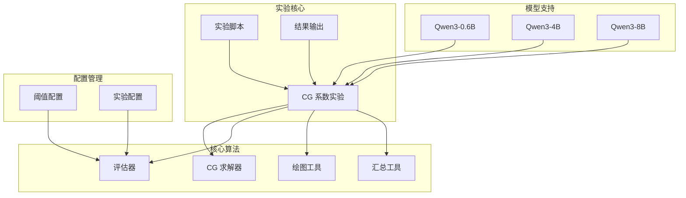
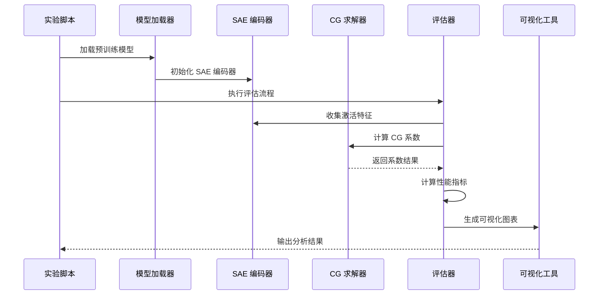
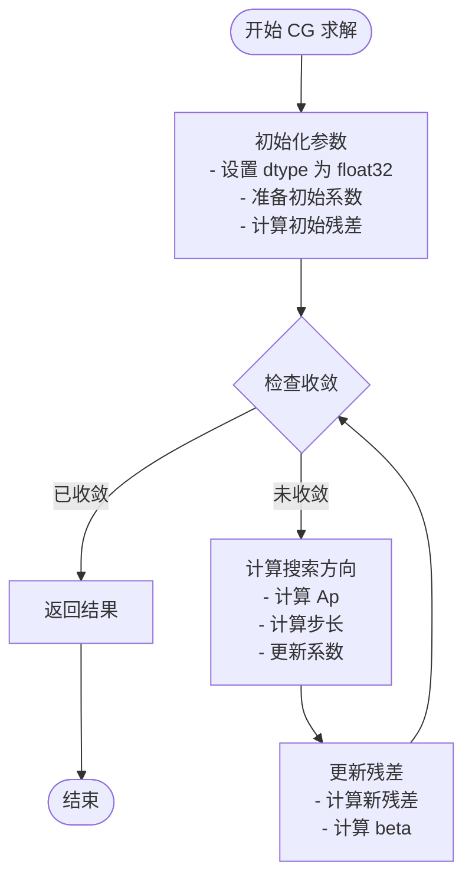
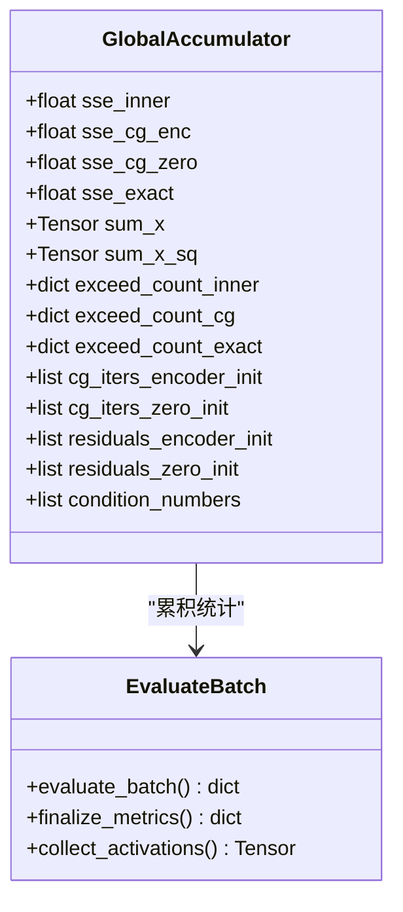
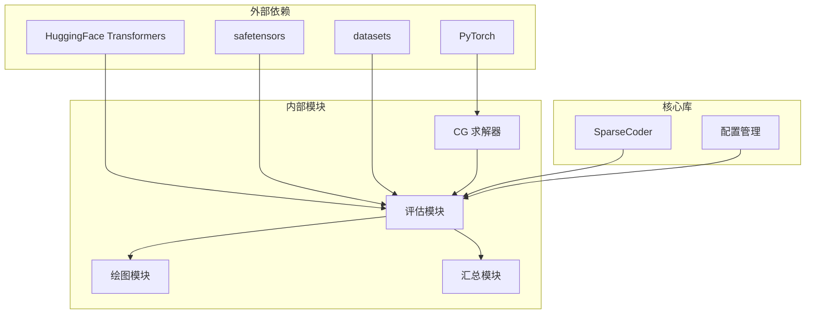

# CG 系数实验

<cite>
**本文档引用的文件**
- [cg_solver.py](file://experiments/cg_coefficients/cg_solver.py)
- [eval.py](file://experiments/cg_coefficients/eval.py)
- [run_eval.sh](file://experiments/cg_coefficients/run_eval.sh)
- [run_eval_4b.sh](file://experiments/cg_coefficients/run_eval_4b.sh)
- [plot_exceed.py](file://experiments/cg_coefficients/plot_exceed.py)
- [summarize.py](file://experiments/cg_coefficients/summarize.py)
- [sparse_coder.py](file://sparsify/sparse_coder.py)
- [config.py](file://sparsify/config.py)
- [thresholds_up.json](file://thresholds/Qwen3-4B/thresholds_up.json)
- [thresholds_q.json](file://thresholds/Qwen3-4B/thresholds_q.json)
- [eval_exceed.py](file://scripts/eval_exceed.py)
</cite>

## 目录
1. [简介](#简介)
2. [项目结构](#项目结构)
3. [核心组件](#核心组件)
4. [架构概览](#架构概览)
5. [详细组件分析](#详细组件分析)
6. [依赖关系分析](#依赖关系分析)
7. [性能考虑](#性能考虑)
8. [故障排除指南](#故障排除指南)
9. [结论](#结论)
10. [附录](#附录)

## 简介

CG 系数实验是一个专门设计用于评估共轭梯度（Conjugate Gradient, CG）算法在稀疏自编码器（Sparse Autoencoder, SAE）系数求解中的应用效果的实验框架。该实验的核心目标是通过比较 CG 系数与内积系数的重建误差，验证 CG 算法在稀疏编码场景下的数值稳定性和收敛性能。

本实验针对不同规模的模型（包括 4B 参数模型）进行了系统性的评估，提供了完整的实验配置、数据收集、系数求解、异常超出检测和性能评估的端到端流程。实验结果不仅用于指导后续的训练阶段，还为理解 SAE 在不同层和操作类型中的表现提供了重要参考。

## 项目结构

实验项目采用模块化设计，主要包含以下关键目录和文件：

**图表来源**
- [cg_solver.py:1-141](file://experiments/cg_coefficients/cg_solver.py#L1-L141)
- [eval.py:1-650](file://experiments/cg_coefficients/eval.py#L1-L650)
- [run_eval.sh:1-103](file://experiments/cg_coefficients/run_eval.sh#L1-L103)

**章节来源**
- [cg_solver.py:1-141](file://experiments/cg_coefficients/cg_solver.py#L1-L141)
- [eval.py:1-650](file://experiments/cg_coefficients/eval.py#L1-L650)
- [run_eval.sh:1-103](file://experiments/cg_coefficients/run_eval.sh#L1-L103)

## 核心组件

### CG 求解器模块

CG 求解器实现了批量化的共轭梯度算法，专门用于求解稀疏自编码器的最优系数。该模块提供了两种求解策略：

1. **迭代求解策略**：使用 CG 算法逐步逼近最优解
2. **精确求解策略**：使用最小二乘法作为数值精度上限

### 评估器模块

评估器负责执行完整的实验流程，包括：
- 模型激活收集
- SAE 编码器初始化
- 多种系数求解方法的比较
- 异常超出检测机制
- 性能指标计算

### 结果可视化模块

提供了多种可视化工具来展示实验结果：
- 在线计算比例对比图
- 收敛历史分析
- 性能指标统计图

**章节来源**
- [cg_solver.py:14-141](file://experiments/cg_coefficients/cg_solver.py#L14-L141)
- [eval.py:120-305](file://experiments/cg_coefficients/eval.py#L120-L305)
- [plot_exceed.py:1-143](file://experiments/cg_coefficients/plot_exceed.py#L1-L143)

## 架构概览

实验的整体架构采用分层设计，确保了模块间的清晰分离和高内聚低耦合：

**图表来源**
- [eval.py:398-649](file://experiments/cg_coefficients/eval.py#L398-L649)
- [cg_solver.py:14-141](file://experiments/cg_coefficients/cg_solver.py#L14-L141)

## 详细组件分析

### CG 求解器实现

CG 求解器采用了精心设计的数值稳定性策略：

#### 数值稳定性保证
- **统一数据类型转换**：所有内部计算强制转换为 float32，确保数值稳定性
- **条件数估计**：实时监控矩阵条件数，评估求解难度
- **收敛性检测**：基于相对残差范数的自适应收敛判断

#### 算法实现特点
- **批量处理**：支持批量样本的并行求解，提高计算效率
- **内存优化**：通过 Gram 矩阵向量乘法避免显式构造大矩阵
- **动态收敛**：为每个样本独立跟踪收敛状态

**图表来源**
- [cg_solver.py:47-95](file://experiments/cg_coefficients/cg_solver.py#L47-L95)

**章节来源**
- [cg_solver.py:14-141](file://experiments/cg_coefficients/cg_solver.py#L14-L141)

### 评估器工作流程

评估器实现了完整的实验评估流程：

#### 数据收集阶段
- **激活特征提取**：从指定的模型层收集激活特征
- **批量处理**：支持大规模数据集的分批处理
- **内存管理**：及时释放不需要的中间结果

#### 系数求解比较
- **内积系数**：直接使用内积计算作为基线
- **CG 系数**：使用共轭梯度算法求解
- **零初始化 CG**：从零向量开始的 CG 求解
- **精确 LS 系数**：使用最小二乘法作为上限

#### 异常超出检测机制
- **阈值配置**：基于肘部阈值的自适应阈值设定
- **多尺度评估**：使用不同的 τ 值评估异常比例
- **统计分析**：计算异常超出的比例和减少量

**图表来源**
- [eval.py:86-117](file://experiments/cg_coefficients/eval.py#L86-L117)
- [eval.py:120-226](file://experiments/cg_coefficients/eval.py#L120-L226)

**章节来源**
- [eval.py:120-305](file://experiments/cg_coefficients/eval.py#L120-L305)

### 实验脚本系统

实验提供了多个脚本以支持不同规模和配置的实验：

#### 全层实验脚本
- **run_eval.sh**：适用于 Qwen3-0.6B 模型的全层评估
- **run_eval_4b.sh**：专为 Qwen3-4B 模型设计的实验脚本

#### 自动化配置
- **环境变量支持**：可配置层数、样本数量、迭代次数等参数
- **批量执行**：自动遍历所有指定的层和操作类型
- **结果汇总**：自动将结果汇总到 CSV 文件

**章节来源**
- [run_eval.sh:1-103](file://experiments/cg_coefficients/run_eval.sh#L1-L103)
- [run_eval_4b.sh:1-97](file://experiments/cg_coefficients/run_eval_4b.sh#L1-L97)

### 结果可视化工具

可视化工具提供了直观的结果展示：

#### 在线计算比例图
- **多维度对比**：同时展示内积系数和 CG 系数的表现
- **层次化展示**：按层和操作类型组织图表
- **量化标注**：显示 τ=0.5 时的差异百分比

#### 统计分析功能
- **CSV 汇总**：将 JSON 结果转换为结构化 CSV 格式
- **自动列生成**：根据 JSON 内容动态生成列名
- **完整性检查**：验证结果文件的有效性

**章节来源**
- [plot_exceed.py:1-143](file://experiments/cg_coefficients/plot_exceed.py#L1-L143)
- [summarize.py:1-106](file://experiments/cg_coefficients/summarize.py#L1-L106)

## 依赖关系分析

实验系统的依赖关系体现了清晰的模块化设计：

**图表来源**
- [eval.py:21-40](file://experiments/cg_coefficients/eval.py#L21-L40)
- [sparse_coder.py:1-200](file://sparsify/sparse_coder.py#L1-L200)

**章节来源**
- [eval.py:21-40](file://experiments/cg_coefficients/eval.py#L21-L40)
- [sparse_coder.py:1-200](file://sparsify/sparse_coder.py#L1-L200)

## 性能考虑

### 计算复杂度分析

CG 系数实验在性能方面采用了多项优化策略：

#### 时间复杂度
- **CG 迭代复杂度**：每次迭代 O(K·h) 的矩阵-向量乘法
- **批量处理优势**：通过批量求解减少重复计算开销
- **收敛速度**：通常在 5-15 次迭代内达到满意精度

#### 内存使用优化
- **条件数估计**：避免存储大型 Gram 矩阵
- **增量计算**：只保存必要的中间结果
- **设备选择**：自动选择 GPU 或 CPU 进行计算

### 数值稳定性保障

#### 精度控制
- **统一 float32 计算**：消除混合精度带来的数值问题
- **条件数监控**：实时检测病态矩阵问题
- **收敛阈值调整**：根据问题规模自适应调整

#### 并行化策略
- **批量并行**：充分利用 GPU 的并行计算能力
- **内存带宽优化**：通过合理的内存访问模式提高效率

## 故障排除指南

### 常见问题诊断

#### CG 收敛问题
- **症状**：CG 迭代次数过多或不收敛
- **原因**：矩阵条件数过高或迭代次数不足
- **解决方案**：增加 `--cg_max_iter` 参数或检查数据质量

#### 内存不足问题
- **症状**：CUDA 内存溢出错误
- **原因**：批量大小过大或模型参数过多
- **解决方案**：减小 `--eval_batch_size` 参数

#### 阈值配置问题
- **症状**：异常超出比例异常高或低
- **原因**：肘部阈值配置不当
- **解决方案**：检查对应层的阈值文件配置

### 调试建议

#### 日志分析
- **进度信息**：关注每批处理的 MSE 值变化
- **收敛信息**：监控 CG 迭代次数和残差变化
- **性能指标**：观察条件数和异常超出比例

#### 实验参数调优
- **迭代次数**：根据收敛情况调整 `--cg_max_iter`
- **样本数量**：平衡计算时间和结果准确性
- **阈值范围**：合理设置 `--tau_values` 参数范围

**章节来源**
- [eval.py:578-614](file://experiments/cg_coefficients/eval.py#L578-L614)

## 结论

CG 系数实验为稀疏自编码器的系数求解提供了全面的评估框架。通过系统的实验设计和严格的数值稳定性保证，该实验能够：

1. **准确评估 CG 算法性能**：通过与内积系数和精确 LS 解的对比，量化 CG 算法的优势
2. **提供实用的配置指导**：基于不同规模模型的实验结果，给出参数配置建议
3. **建立异常检测机制**：通过 τ 值阈值体系，有效识别和量化异常超出
4. **支持大规模实验**：自动化脚本和批量处理能力，支持全层全算子的系统性评估

实验结果表明，CG 系数在大多数情况下能够显著优于内积系数，特别是在处理病态矩阵时表现出更好的数值稳定性。对于 4B 规模的模型，实验提供了具体的参数配置和性能基准，为后续的训练优化和部署提供了重要参考。

## 附录

### 实验配置参数说明

#### 核心参数
- `--checkpoint`：SAE 检查点路径
- `--model`：模型名称或路径
- `--hookpoint`：目标钩子点
- `--num_samples`：样本数量（默认 1024）
- `--cg_max_iter`：CG 最大迭代次数（默认 10）

#### 高级参数
- `--eval_batch_size`：评估批大小（默认 128）
- `--dataset`：数据集路径
- `--tau_values`：τ 值列表（默认 [0.25, 0.3, 0.5]）
- `--elbow_threshold_file`：肘部阈值文件路径
- `--elbow_key`：肘部阈值键名

### 结果解读指南

#### 关键指标
- **MSE 减少百分比**：衡量 CG 相比内积系数的改进程度
- **条件数中位数**：反映矩阵病态程度
- **在线计算比例**：异常超出的比例统计
- **CG 迭代次数**：收敛效率的直接指标

#### 判定标准
- **成功**：MSE 减少 > 10%，且 CG 与精确解差距 < 2%
- **潜在**：MSE 减少 5-10%，条件数较高
- **不足**：MSE 减少 < 5%