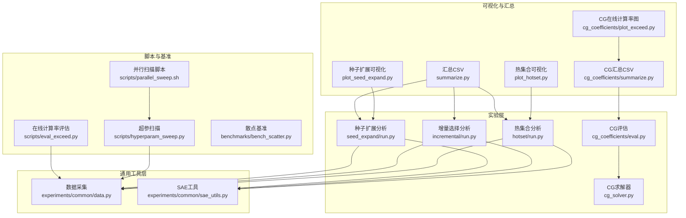
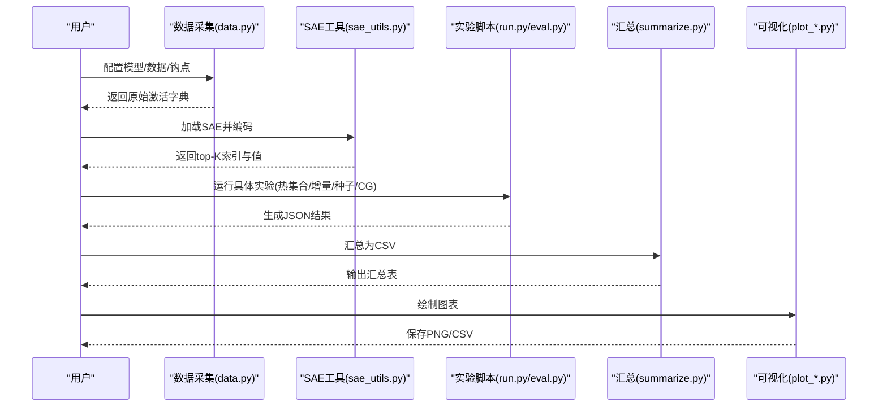
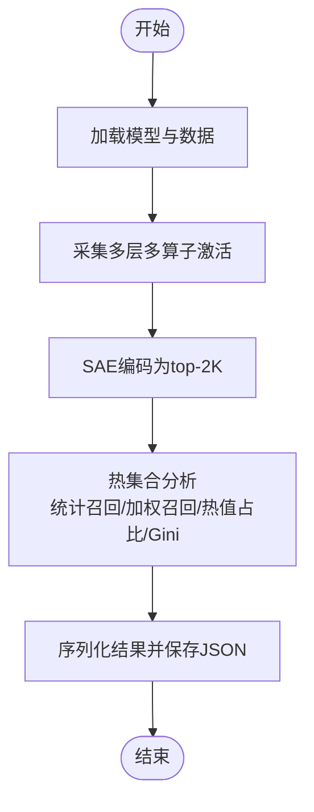
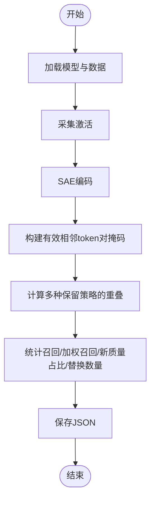
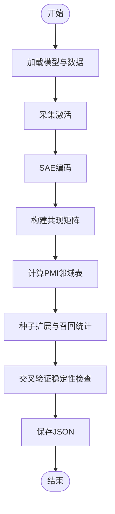
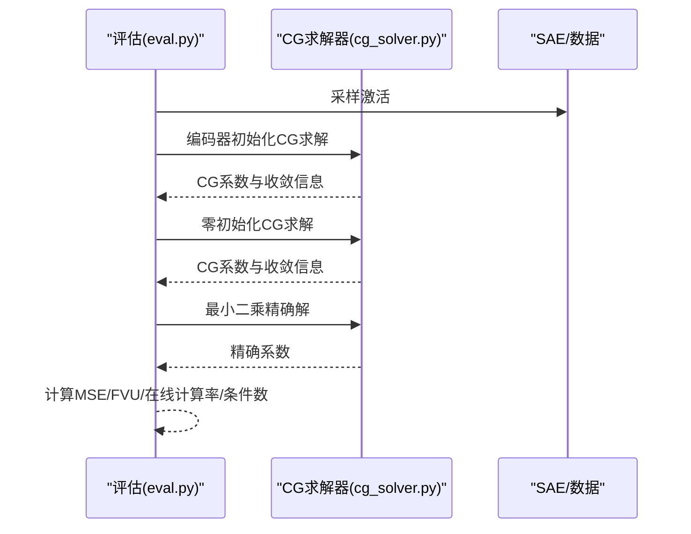
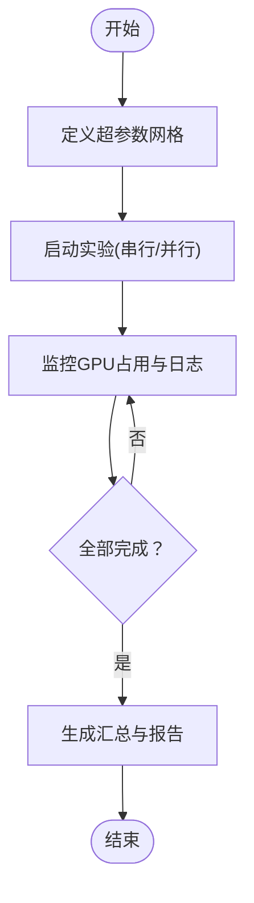
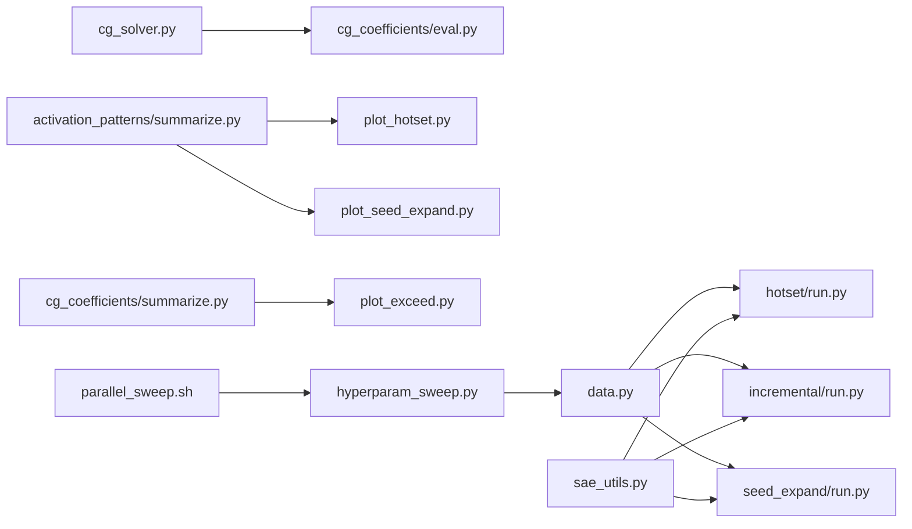

# 实验与分析

<cite>
**本文引用的文件**
- [experiments/activation_patterns/hotset/run.py](file://experiments/activation_patterns/hotset/run.py)
- [experiments/activation_patterns/incremental/run.py](file://experiments/activation_patterns/incremental/run.py)
- [experiments/activation_patterns/seed_expand/run.py](file://experiments/activation_patterns/seed_expand/run.py)
- [experiments/activation_patterns/plot_hotset.py](file://experiments/activation_patterns/plot_hotset.py)
- [experiments/activation_patterns/plot_seed_expand.py](file://experiments/activation_patterns/plot_seed_expand.py)
- [experiments/activation_patterns/summarize.py](file://experiments/activation_patterns/summarize.py)
- [experiments/common/data.py](file://experiments/common/data.py)
- [experiments/common/sae_utils.py](file://experiments/common/sae_utils.py)
- [experiments/cg_coefficients/cg_solver.py](file://experiments/cg_coefficients/cg_solver.py)
- [experiments/cg_coefficients/eval.py](file://experiments/cg_coefficients/eval.py)
- [experiments/cg_coefficients/plot_exceed.py](file://experiments/cg_coefficients/plot_exceed.py)
- [experiments/cg_coefficients/summarize.py](file://experiments/cg_coefficients/summarize.py)
- [scripts/hyperparam_sweep.py](file://scripts/hyperparam_sweep.py)
- [scripts/parallel_sweep.sh](file://scripts/parallel_sweep.sh)
- [scripts/eval_exceed.py](file://scripts/eval_exceed.py)
- [benchmarks/bench_scatter.py](file://benchmarks/bench_scatter.py)
- [LUTurbo-doc/research-log.md](file://LUTurbo-doc/research-log.md)
- [LUTurbo-doc/ideas/activation-patterns.md](file://LUTurbo-doc/ideas/activation-patterns.md)
- [LUTurbo-doc/experiments/20260316-activation-patterns.md](file://LUTurbo-doc/experiments/20260316-activation-patterns.md)
</cite>

## 目录
1. [引言](#引言)
2. [项目结构](#项目结构)
3. [核心组件](#核心组件)
4. [架构总览](#架构总览)
5. [详细组件分析](#详细组件分析)
6. [依赖关系分析](#依赖关系分析)
7. [性能考量](#性能考量)
8. [故障排查指南](#故障排查指南)
9. [结论](#结论)
10. [附录](#附录)

## 引言
本文件系统化梳理了激活模式实验、热集合分析、增量训练与种子扩展实验、CG系数实验、超参数调优与性能基准测试的完整工作流，涵盖实验设计、执行方法、结果解读、统计分析、可视化与报告生成，并总结研究日志与实验管理最佳实践。目标是帮助研究人员快速复现实验、理解指标含义、优化实验流程并产出可比较的科学结论。

## 项目结构
该仓库围绕“实验与分析”形成清晰的分层组织：
- experiments：各类实验脚本与分析工具（激活模式、CG系数、可视化与汇总）
- experiments/common：跨实验共享的数据加载、SAE编码与钩点映射
- scripts：超参数扫描、并行调度与评估工具
- results：实验结果JSON与中间产物
- benchmarks：性能基准脚本
- LUTurbo-doc：研究日志、想法与实验记录

**图表来源**
- [experiments/activation_patterns/hotset/run.py:160-297](file://experiments/activation_patterns/hotset/run.py#L160-L297)
- [experiments/activation_patterns/incremental/run.py:367-506](file://experiments/activation_patterns/incremental/run.py#L367-L506)
- [experiments/activation_patterns/seed_expand/run.py:476-600](file://experiments/activation_patterns/seed_expand/run.py#L476-L600)
- [experiments/common/data.py:44-156](file://experiments/common/data.py#L44-L156)
- [experiments/common/sae_utils.py:15-102](file://experiments/common/sae_utils.py#L15-L102)
- [experiments/cg_coefficients/cg_solver.py:14-108](file://experiments/cg_coefficients/cg_solver.py#L14-L108)
- [experiments/cg_coefficients/eval.py:398-646](file://experiments/cg_coefficients/eval.py#L398-L646)
- [experiments/activation_patterns/plot_hotset.py:228-246](file://experiments/activation_patterns/plot_hotset.py#L228-L246)
- [experiments/activation_patterns/plot_seed_expand.py:376-395](file://experiments/activation_patterns/plot_seed_expand.py#L376-L395)
- [experiments/activation_patterns/summarize.py:290-339](file://experiments/activation_patterns/summarize.py#L290-L339)
- [experiments/cg_coefficients/summarize.py:64-101](file://experiments/cg_coefficients/summarize.py#L64-L101)
- [experiments/cg_coefficients/plot_exceed.py:32-139](file://experiments/cg_coefficients/plot_exceed.py#L32-L139)
- [scripts/hyperparam_sweep.py:160-273](file://scripts/hyperparam_sweep.py#L160-L273)
- [scripts/parallel_sweep.sh:1-215](file://scripts/parallel_sweep.sh#L1-L215)
- [scripts/eval_exceed.py:266-573](file://scripts/eval_exceed.py#L266-L573)
- [benchmarks/bench_scatter.py](file://benchmarks/bench_scatter.py)

**章节来源**
- [experiments/activation_patterns/hotset/run.py:1-301](file://experiments/activation_patterns/hotset/run.py#L1-L301)
- [experiments/activation_patterns/incremental/run.py:1-510](file://experiments/activation_patterns/incremental/run.py#L1-L510)
- [experiments/activation_patterns/seed_expand/run.py:1-604](file://experiments/activation_patterns/seed_expand/run.py#L1-L604)
- [experiments/common/data.py:1-271](file://experiments/common/data.py#L1-L271)
- [experiments/common/sae_utils.py:1-124](file://experiments/common/sae_utils.py#L1-L124)
- [experiments/cg_coefficients/cg_solver.py:1-141](file://experiments/cg_coefficients/cg_solver.py#L1-L141)
- [experiments/cg_coefficients/eval.py:1-650](file://experiments/cg_coefficients/eval.py#L1-L650)
- [experiments/activation_patterns/plot_hotset.py:1-250](file://experiments/activation_patterns/plot_hotset.py#L1-L250)
- [experiments/activation_patterns/plot_seed_expand.py:1-399](file://experiments/activation_patterns/plot_seed_expand.py#L1-L399)
- [experiments/activation_patterns/summarize.py:1-343](file://experiments/activation_patterns/summarize.py#L1-L343)
- [experiments/cg_coefficients/summarize.py:1-106](file://experiments/cg_coefficients/summarize.py#L1-L106)
- [experiments/cg_coefficients/plot_exceed.py:1-143](file://experiments/cg_coefficients/plot_exceed.py#L1-L143)
- [scripts/hyperparam_sweep.py:1-273](file://scripts/hyperparam_sweep.py#L1-L273)
- [scripts/parallel_sweep.sh:1-215](file://scripts/parallel_sweep.sh#L1-L215)
- [scripts/eval_exceed.py:1-573](file://scripts/eval_exceed.py#L1-L573)
- [benchmarks/bench_scatter.py](file://benchmarks/bench_scatter.py)

## 核心组件
- 数据采集与编码管线：统一从模型钩点采集激活、通过SAE编码为top-K稀疏表示，支持多层多算子组合。
- 激活模式分析：热集合、增量选择、种子扩展三类上界基线，评估候选集规模与召回质量。
- CG系数评估：对比内积系数、CG迭代求解与最小二乘精确解，给出MSE/FVU、收敛迭代次数与条件数等指标。
- 可视化与汇总：将JSON结果转为图表与CSV，便于横向比较与报告生成。
- 超参数扫描：批量运行不同扩展因子与K值，支持串行与并行两种方式。
- 在线计算率评估：基于肘部阈值计算超过比例，衡量重建误差分布。

**章节来源**
- [experiments/common/data.py:44-156](file://experiments/common/data.py#L44-L156)
- [experiments/common/sae_utils.py:15-102](file://experiments/common/sae_utils.py#L15-L102)
- [experiments/activation_patterns/hotset/run.py:33-119](file://experiments/activation_patterns/hotset/run.py#L33-L119)
- [experiments/activation_patterns/incremental/run.py:225-312](file://experiments/activation_patterns/incremental/run.py#L225-L312)
- [experiments/activation_patterns/seed_expand/run.py:245-425](file://experiments/activation_patterns/seed_expand/run.py#L245-L425)
- [experiments/cg_coefficients/eval.py:120-305](file://experiments/cg_coefficients/eval.py#L120-L305)
- [experiments/cg_coefficients/cg_solver.py:14-108](file://experiments/cg_coefficients/cg_solver.py#L14-L108)
- [experiments/activation_patterns/plot_hotset.py:47-226](file://experiments/activation_patterns/plot_hotset.py#L47-L226)
- [experiments/activation_patterns/plot_seed_expand.py:61-374](file://experiments/activation_patterns/plot_seed_expand.py#L61-L374)
- [experiments/activation_patterns/summarize.py:22-287](file://experiments/activation_patterns/summarize.py#L22-L287)
- [experiments/cg_coefficients/summarize.py:15-61](file://experiments/cg_coefficients/summarize.py#L15-L61)
- [scripts/hyperparam_sweep.py:160-273](file://scripts/hyperparam_sweep.py#L160-L273)
- [scripts/parallel_sweep.sh:88-215](file://scripts/parallel_sweep.sh#L88-L215)
- [scripts/eval_exceed.py:266-573](file://scripts/eval_exceed.py#L266-L573)

## 架构总览
下图展示从数据到分析再到可视化的端到端流程，以及关键模块间的依赖关系。

**图表来源**
- [experiments/common/data.py:44-156](file://experiments/common/data.py#L44-L156)
- [experiments/common/sae_utils.py:15-102](file://experiments/common/sae_utils.py#L15-L102)
- [experiments/activation_patterns/hotset/run.py:210-266](file://experiments/activation_patterns/hotset/run.py#L210-L266)
- [experiments/activation_patterns/incremental/run.py:417-474](file://experiments/activation_patterns/incremental/run.py#L417-L474)
- [experiments/activation_patterns/seed_expand/run.py:523-569](file://experiments/activation_patterns/seed_expand/run.py#L523-L569)
- [experiments/cg_coefficients/eval.py:398-646](file://experiments/cg_coefficients/eval.py#L398-L646)
- [experiments/activation_patterns/summarize.py:290-339](file://experiments/activation_patterns/summarize.py#L290-L339)
- [experiments/cg_coefficients/summarize.py:64-101](file://experiments/cg_coefficients/summarize.py#L64-L101)
- [experiments/activation_patterns/plot_hotset.py:228-246](file://experiments/activation_patterns/plot_hotset.py#L228-L246)
- [experiments/activation_patterns/plot_seed_expand.py:376-395](file://experiments/activation_patterns/plot_seed_expand.py#L376-L395)

## 详细组件分析

### 激活模式实验：热集合分析
- 设计思路：固定全局“热集合”（按激活频率排序的前H个基向量），评估其覆盖每个token真实top-K的比例；同时计算价值加权召回与热值占比。
- 关键函数与流程：
  - 分析函数：统计热集合大小、召回均值/P10/P50/P90、加权召回、热值占比、残余搜索空间等。
  - Gini系数：衡量基向量使用不均衡程度。
  - 结果序列化：将数值转换为可JSON序列化类型并写入文件。
- 结果解读要点：
  - H越大，未命中概率越低；但候选集也越大，需权衡。
  - Gini越高，集中度越高，热集合效果越好。
  - 加权召回更关注大幅值贡献，有助于评估重建质量。

**图表来源**
- [experiments/activation_patterns/hotset/run.py:160-297](file://experiments/activation_patterns/hotset/run.py#L160-L297)
- [experiments/common/data.py:44-156](file://experiments/common/data.py#L44-L156)
- [experiments/common/sae_utils.py:19-102](file://experiments/common/sae_utils.py#L19-L102)

**章节来源**
- [experiments/activation_patterns/hotset/run.py:33-119](file://experiments/activation_patterns/hotset/run.py#L33-L119)
- [experiments/activation_patterns/hotset/run.py:133-158](file://experiments/activation_patterns/hotset/run.py#L133-L158)
- [experiments/activation_patterns/hotset/run.py:268-297](file://experiments/activation_patterns/hotset/run.py#L268-L297)

### 激活模式实验：增量选择分析
- 设计思路：模拟相邻token对的选择一致性，保留前一时刻的top-K，再以oracle替换m个位置，评估不同预算策略的召回与新质量占比。
- 关键函数与流程：
  - 批处理重叠计算：分块构建稠密指示矩阵，避免Python循环。
  - 变体对比：topK、topL_1.5、topL_2.0、union2四种保留策略。
  - 统计指标：不同m下的召回、加权召回、新质量占比、替换数量分布与突发性（长run长度）。
- 结果解读要点：
  - m越大，召回越高但新质量占比下降；存在预算-召回权衡。
  - union2在连续序列中表现稳健，适合跨时间一致性场景。

**图表来源**
- [experiments/activation_patterns/incremental/run.py:225-312](file://experiments/activation_patterns/incremental/run.py#L225-L312)
- [experiments/activation_patterns/incremental/run.py:367-506](file://experiments/activation_patterns/incremental/run.py#L367-L506)

**章节来源**
- [experiments/activation_patterns/incremental/run.py:225-312](file://experiments/activation_patterns/incremental/run.py#L225-L312)
- [experiments/activation_patterns/incremental/run.py:315-366](file://experiments/activation_patterns/incremental/run.py#L315-L366)
- [experiments/activation_patterns/incremental/run.py:476-506](file://experiments/activation_patterns/incremental/run.py#L476-L506)

### 激活模式实验：种子扩展分析
- 设计思路：以少量“种子”激活为起点，利用共现PMI邻域表扩展候选集，评估不同种子规模与邻居数对召回的影响；并测试“热集合作为种子”的组合效果。
- 关键函数与流程：
  - 共现矩阵构建：支持GPU加速的分块矩阵乘法。
  - PMI邻域抽取：按正PMI取top邻居，构建邻接表。
  - 种子扩展与召回：支持CPU/GPU路径，向量化统计候选规模与召回。
  - 交叉验证：用半数据训练邻域表，另一半测试稳定性。
- 结果解读要点：
  - 邻居数越多，召回越高但候选规模增大；需控制在合理范围内。
  - 热集合作为种子能显著降低实际种子数，同时保持较高召回。
  - 交叉验证gap小说明邻域表稳定可靠。

**图表来源**
- [experiments/activation_patterns/seed_expand/run.py:245-425](file://experiments/activation_patterns/seed_expand/run.py#L245-L425)
- [experiments/activation_patterns/seed_expand/run.py:476-600](file://experiments/activation_patterns/seed_expand/run.py#L476-L600)

**章节来源**
- [experiments/activation_patterns/seed_expand/run.py:36-74](file://experiments/activation_patterns/seed_expand/run.py#L36-L74)
- [experiments/activation_patterns/seed_expand/run.py:76-131](file://experiments/activation_patterns/seed_expand/run.py#L76-L131)
- [experiments/activation_patterns/seed_expand/run.py:133-243](file://experiments/activation_patterns/seed_expand/run.py#L133-L243)
- [experiments/activation_patterns/seed_expand/run.py:382-425](file://experiments/activation_patterns/seed_expand/run.py#L382-L425)
- [experiments/activation_patterns/seed_expand/run.py:571-600](file://experiments/activation_patterns/seed_expand/run.py#L571-L600)

### CG系数实验：求解器与评估
- CG求解器：批式共轭梯度，支持零初始化与编码器初始化，记录残差历史与收敛迭代数。
- 评估流程：对比内积系数、CG（编码器/零初始化）、最小二乘精确解，计算MSE/FVU、在线计算率（超过阈值比例）与条件数。
- 结果解读要点：
  - CG与精确解差距小，说明CG已充分收敛。
  - 条件数高时，CG仍有提升空间；接近正交基时提升有限。
  - 在线计算率下降表明CG在误差分布上更优。

**图表来源**
- [experiments/cg_coefficients/eval.py:120-305](file://experiments/cg_coefficients/eval.py#L120-L305)
- [experiments/cg_coefficients/cg_solver.py:14-108](file://experiments/cg_coefficients/cg_solver.py#L14-L108)

**章节来源**
- [experiments/cg_coefficients/eval.py:120-305](file://experiments/cg_coefficients/eval.py#L120-L305)
- [experiments/cg_coefficients/eval.py:398-646](file://experiments/cg_coefficients/eval.py#L398-L646)
- [experiments/cg_coefficients/cg_solver.py:14-108](file://experiments/cg_coefficients/cg_solver.py#L14-L108)

### 超参数调优与并行扫描
- 串行扫描：脚本定义超参数网格，逐项运行并记录成功/失败。
- 并行扫描：脚本将实验分配到多个GPU组，自动等待空闲槽位，最大化资源利用率。
- 使用建议：
  - 先用串行扫描验证流程，再用并行加速。
  - 注意端口冲突与日志目录权限。

**图表来源**
- [scripts/hyperparam_sweep.py:160-273](file://scripts/hyperparam_sweep.py#L160-L273)
- [scripts/parallel_sweep.sh:88-215](file://scripts/parallel_sweep.sh#L88-L215)

**章节来源**
- [scripts/hyperparam_sweep.py:160-273](file://scripts/hyperparam_sweep.py#L160-L273)
- [scripts/parallel_sweep.sh:1-215](file://scripts/parallel_sweep.sh#L1-L215)

### 在线计算率评估
- 功能：在推理阶段计算超过阈值的比例，阈值由肘部阈值文件按钩点匹配确定。
- 流程：注册钩子捕获输入/输出，应用哈达玛旋转与异常值裁剪（如存在），在原始空间计算误差绝对值并统计比例。
- 应用：衡量重建误差分布，辅助选择合适的损失与阈值策略。

**章节来源**
- [scripts/eval_exceed.py:266-573](file://scripts/eval_exceed.py#L266-L573)

### 可视化与报告生成
- 热集合可视化：按层与算子绘制召回曲线、Gini热力图、加权vs非加权召回对比。
- 种子扩展可视化：热力图（s×n）、邻居数递增召回曲线、候选比例vs召回、交叉验证对比。
- CG在线计算率：按层与算子绘制不同τ的在线计算率曲线。
- 汇总CSV：将多实验结果合并为统一表格，便于横向比较。

**章节来源**
- [experiments/activation_patterns/plot_hotset.py:47-226](file://experiments/activation_patterns/plot_hotset.py#L47-L226)
- [experiments/activation_patterns/plot_seed_expand.py:61-374](file://experiments/activation_patterns/plot_seed_expand.py#L61-L374)
- [experiments/cg_coefficients/plot_exceed.py:32-139](file://experiments/cg_coefficients/plot_exceed.py#L32-L139)
- [experiments/activation_patterns/summarize.py:22-287](file://experiments/activation_patterns/summarize.py#L22-L287)
- [experiments/cg_coefficients/summarize.py:15-61](file://experiments/cg_coefficients/summarize.py#L15-L61)

## 依赖关系分析
- 实验脚本依赖通用数据采集与SAE工具，保证跨实验一致性。
- CG评估依赖CG求解器，提供数值稳定性保障。
- 可视化与汇总脚本独立于实验逻辑，便于扩展新的指标与图表。
- 超参数扫描脚本与并行脚本解耦，支持灵活调度。

**图表来源**
- [experiments/common/data.py:44-156](file://experiments/common/data.py#L44-L156)
- [experiments/common/sae_utils.py:15-102](file://experiments/common/sae_utils.py#L15-L102)
- [experiments/activation_patterns/hotset/run.py:210-266](file://experiments/activation_patterns/hotset/run.py#L210-L266)
- [experiments/activation_patterns/incremental/run.py:417-474](file://experiments/activation_patterns/incremental/run.py#L417-L474)
- [experiments/activation_patterns/seed_expand/run.py:523-569](file://experiments/activation_patterns/seed_expand/run.py#L523-L569)
- [experiments/cg_coefficients/cg_solver.py:14-108](file://experiments/cg_coefficients/cg_solver.py#L14-L108)
- [experiments/cg_coefficients/eval.py:398-646](file://experiments/cg_coefficients/eval.py#L398-L646)
- [experiments/activation_patterns/summarize.py:290-339](file://experiments/activation_patterns/summarize.py#L290-L339)
- [experiments/activation_patterns/plot_hotset.py:228-246](file://experiments/activation_patterns/plot_hotset.py#L228-L246)
- [experiments/activation_patterns/plot_seed_expand.py:376-395](file://experiments/activation_patterns/plot_seed_expand.py#L376-L395)
- [experiments/cg_coefficients/summarize.py:64-101](file://experiments/cg_coefficients/summarize.py#L64-L101)
- [experiments/cg_coefficients/plot_exceed.py:32-139](file://experiments/cg_coefficients/plot_exceed.py#L32-L139)
- [scripts/hyperparam_sweep.py:160-273](file://scripts/hyperparam_sweep.py#L160-L273)
- [scripts/parallel_sweep.sh:88-215](file://scripts/parallel_sweep.sh#L88-L215)

**章节来源**
- [experiments/common/data.py:44-156](file://experiments/common/data.py#L44-L156)
- [experiments/common/sae_utils.py:15-102](file://experiments/common/sae_utils.py#L15-L102)
- [experiments/cg_coefficients/cg_solver.py:14-108](file://experiments/cg_coefficients/cg_solver.py#L14-L108)
- [experiments/activation_patterns/summarize.py:290-339](file://experiments/activation_patterns/summarize.py#L290-L339)
- [experiments/cg_coefficients/summarize.py:64-101](file://experiments/cg_coefficients/summarize.py#L64-L101)

## 性能考量
- 内存与显存：
  - 多层多算子同时采集会放大内存压力，建议分批或限制样本数。
  - SAE编码采用分块处理，及时释放中间变量，必要时清空缓存。
- 计算效率：
  - 增量与种子扩展中的重叠计算采用分块稠密指示，减少Python循环开销。
  - CG求解器内部使用float32以提升数值稳定性。
- 并行与资源：
  - 并行扫描脚本自动分配GPU组，注意端口递增避免冲突。
  - 日志与检查点目录需具备写权限。

[本节为通用指导，无需特定文件引用]

## 故障排查指南
- 设备选择与CUDA可用性：脚本自动检测CUDA，否则回退CPU；若显存不足，降低批大小或样本数。
- LUT文件缺失：确保LUT目录包含对应层的.safetensors文件与元数据。
- 数据格式问题：本地Arrow/Parquet与HF Hub数据加载路径需正确配置。
- CG收敛性：若CG与精确解差距较大，适当增加最大迭代次数。
- 可视化失败：确认输出目录存在且有写权限；检查JSON字段是否完整。

**章节来源**
- [experiments/activation_patterns/hotset/run.py:178-186](file://experiments/activation_patterns/hotset/run.py#L178-L186)
- [experiments/activation_patterns/seed_expand/run.py:494-499](file://experiments/activation_patterns/seed_expand/run.py#L494-L499)
- [experiments/cg_coefficients/eval.py:522-534](file://experiments/cg_coefficients/eval.py#L522-L534)
- [experiments/cg_coefficients/eval.py:588-614](file://experiments/cg_coefficients/eval.py#L588-L614)

## 结论
本实验体系提供了从数据采集、SAE编码、激活模式分析到CG系数评估与可视化的一体化流程。通过热集合、增量选择与种子扩展三类上界基线，可以系统评估候选集规模与召回质量；CG评估则从数值与统计角度验证求解策略的有效性。结合超参数扫描与并行调度，能够高效探索模型与算法的性能边界。建议在实验过程中持续记录研究日志、收集想法与复现实验，以形成可追溯、可复现的研究闭环。

[本节为总结性内容，无需特定文件引用]

## 附录
- 实验管理最佳实践：
  - 使用统一的钩点命名与LUT映射，确保跨实验一致性。
  - 将结果保存为JSON并生成CSV汇总，便于后续分析。
  - 可视化图表应标注图例、标题与坐标轴说明，便于报告使用。
  - 研究日志与实验记录应同步更新，记录参数、设备、版本与结论。
- 常用命令参考：
  - 激活模式实验：分别运行热集合、增量与种子扩展脚本，并生成可视化与汇总。
  - CG评估：指定LUT或检查点、钩点与样本数，运行评估脚本并查看结果。
  - 超参数扫描：使用串行或并行脚本遍历扩展因子与K值，监控日志与检查点。

**章节来源**
- [LUTurbo-doc/research-log.md](file://LUTurbo-doc/research-log.md)
- [LUTurbo-doc/ideas/activation-patterns.md](file://LUTurbo-doc/ideas/activation-patterns.md)
- [LUTurbo-doc/experiments/20260316-activation-patterns.md](file://LUTurbo-doc/experiments/20260316-activation-patterns.md)