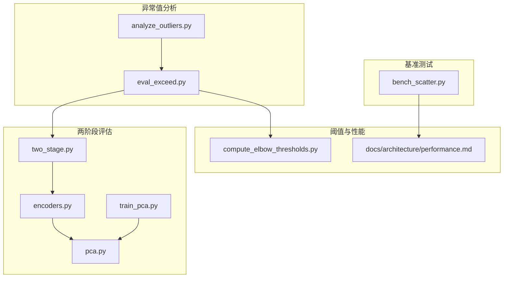
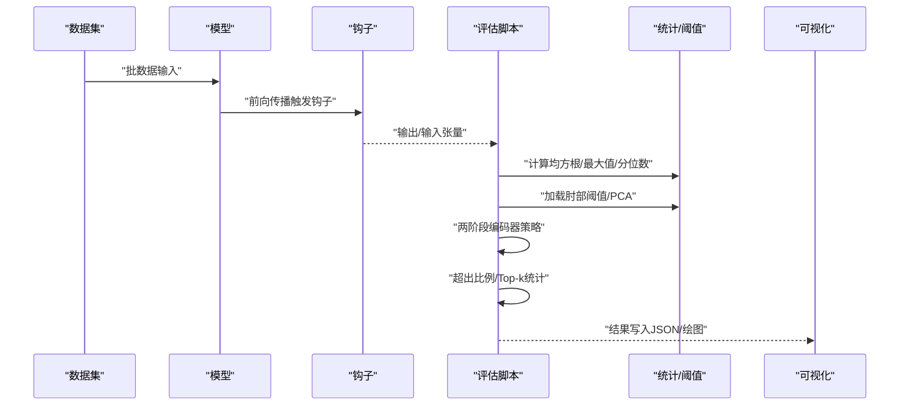
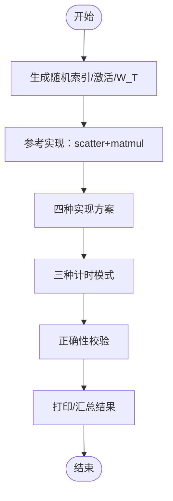
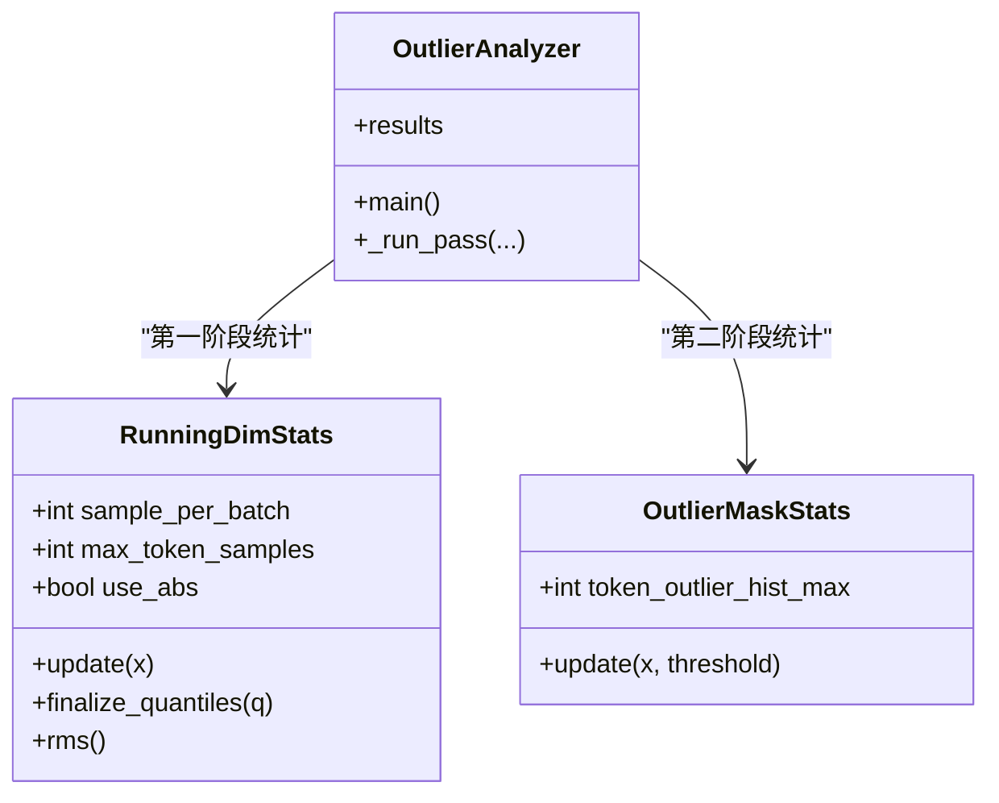
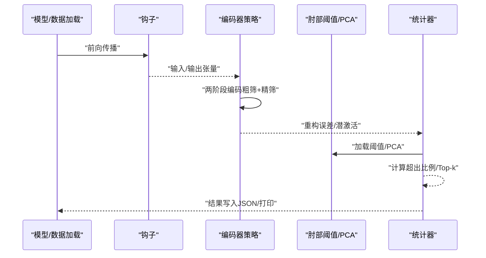
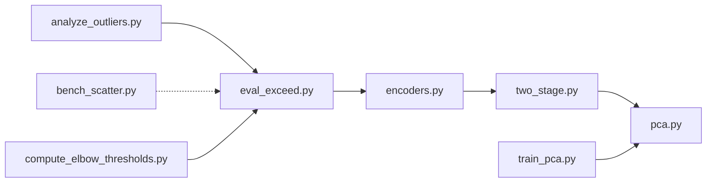

# 性能基准测试

<cite>
**本文引用的文件**   
- [bench_scatter.py](file://benchmarks/bench_scatter.py)
- [analyze_outliers.py](file://scripts/analyze_outliers.py)
- [eval_exceed.py](file://scripts/eval_exceed.py)
- [two_stage.py](file://sparsify/eval/two_stage.py)
- [encoders.py](file://sparsify/eval/encoders.py)
- [pca.py](file://sparsify/eval/pca.py)
- [train_pca.py](file://scripts/precompute/train_pca.py)
- [compute_elbow_thresholds.py](file://compute_elbow_thresholds.py)
- [performance.md](file://docs/architecture/performance.md)
- [README.md](file://README.md)
</cite>

## 目录
1. [引言](#引言)
2. [项目结构](#项目结构)
3. [核心组件](#核心组件)
4. [架构总览](#架构总览)
5. [详细组件分析](#详细组件分析)
6. [依赖分析](#依赖分析)
7. [性能考量](#性能考量)
8. [故障排查指南](#故障排查指南)
9. [结论](#结论)
10. [附录](#附录)

## 引言
本文件系统化阐述本仓库中的性能基准测试体系，重点覆盖散粒噪声（bench_scatter）测试的设计原理与实现方法；异常值分析工具的使用与结果解读；两阶段评估流程的实施步骤与评估指标；以及性能基准测试的标准化流程与质量控制方法。文档同时提供测试环境配置、数据准备与结果分析的详细指南，并解释基准测试结果如何支撑模型性能评估与优化决策。

## 项目结构
本仓库围绕“训练—阈值—导出—评估”的闭环组织，性能基准测试相关的关键位置如下：
- 基准测试入口：bench_scatter.py 提供散粒噪声场景下的多实现对比与三种计时模式
- 异常值分析：analyze_outliers.py 提供两阶段统计与异常值频率分析
- 两阶段评估：eval_exceed.py 结合两阶段编码器策略进行超出阈值比例等指标评估
- 两阶段编码器实现：two_stage.py、encoders.py、pca.py
- PCA预计算：train_pca.py
- 阈值计算：compute_elbow_thresholds.py
- 性能要点文档：performance.md

**图表来源**
- [bench_scatter.py:1-176](file://benchmarks/bench_scatter.py#L1-L176)
- [analyze_outliers.py:1-489](file://scripts/analyze_outliers.py#L1-L489)
- [eval_exceed.py:1-573](file://scripts/eval_exceed.py#L1-L573)
- [two_stage.py:1-153](file://sparsify/eval/two_stage.py#L1-L153)
- [encoders.py:1-72](file://sparsify/eval/encoders.py#L1-L72)
- [pca.py:1-80](file://sparsify/eval/pca.py#L1-L80)
- [train_pca.py:1-335](file://scripts/precompute/train_pca.py#L1-L335)
- [compute_elbow_thresholds.py:1-660](file://compute_elbow_thresholds.py#L1-L660)
- [performance.md:1-75](file://docs/architecture/performance.md#L1-L75)

**章节来源**
- [README.md:1-154](file://README.md#L1-L154)

## 核心组件
- 散粒噪声基准（bench_scatter）：对比多种 scatter/gather/matmul 实现，提供设备事件计时、流水线计时与同步计时三种模式，覆盖真实世界中的 CPU 回退与队列延迟影响
- 异常值分析（analyze_outliers）：两阶段统计（均方根、最大值、分位数）与异常值掩码统计，支持直方图与散点图可视化
- 两阶段评估（eval_exceed）：结合两阶段编码器策略与肘部阈值，计算超出比例等指标，支持 Hadamard 旋转与异常裁剪
- 两阶段编码器（two_stage/encoders/pca）：低维投影（slice/random/pca）、粗筛+精筛、重构误差与超出统计
- PCA预计算（train_pca）：按钩点收集激活，计算协方差矩阵与主成分，输出投影矩阵与均值
- 阈值计算（compute_elbow_thresholds）：Kneedle拐点法计算激活分布的肘部值，支持可视化与并行处理
- 性能要点（performance）：BF16 自动类型、融合编解码、部分前向、torch.compile、分块SAE权衡、Hadamard旋转

**章节来源**
- [bench_scatter.py:1-176](file://benchmarks/bench_scatter.py#L1-L176)
- [analyze_outliers.py:1-489](file://scripts/analyze_outliers.py#L1-L489)
- [eval_exceed.py:1-573](file://scripts/eval_exceed.py#L1-L573)
- [two_stage.py:1-153](file://sparsify/eval/two_stage.py#L1-L153)
- [encoders.py:1-72](file://sparsify/eval/encoders.py#L1-L72)
- [pca.py:1-80](file://sparsify/eval/pca.py#L1-L80)
- [train_pca.py:1-335](file://scripts/precompute/train_pca.py#L1-L335)
- [compute_elbow_thresholds.py:1-660](file://compute_elbow_thresholds.py#L1-L660)
- [performance.md:1-75](file://docs/architecture/performance.md#L1-L75)

## 架构总览
下图展示从数据与模型到性能评估的整体流程，涵盖基准测试、异常值分析与两阶段评估的关键节点。

**图表来源**
- [eval_exceed.py:266-573](file://scripts/eval_exceed.py#L266-L573)
- [analyze_outliers.py:279-489](file://scripts/analyze_outliers.py#L279-L489)
- [encoders.py:35-72](file://sparsify/eval/encoders.py#L35-L72)
- [pca.py:26-80](file://sparsify/eval/pca.py#L26-L80)
- [compute_elbow_thresholds.py:364-659](file://compute_elbow_thresholds.py#L364-L659)

## 详细组件分析

### 散粒噪声基准测试（bench_scatter）
- 设计目标：在 NPU/AI_CPU 回退与流水线排队场景下，比较不同 scatter/gather/matmul 实现的性能差异
- 方法概览：
  - 实现对比：scatter_add_、index_put_、gather+mul+sum、gather+bmm
  - 计时模式：
    - 设备事件计时：NPU 事件记录，捕捉设备侧真实耗时
    - 流水线计时：批量排队后统一同步，反映队列延迟
    - 同步计时：每轮迭代后同步，掩盖 CPU 回退导致的停顿
  - 工作负载：小/中/大三档尺寸，覆盖不同内存与吞吐压力
- 关键流程与数据流：

**图表来源**
- [bench_scatter.py:19-176](file://benchmarks/bench_scatter.py#L19-L176)

- 实现要点与注意事项
  - 事件计时与流水线计时能暴露 CPU 回退造成的隐藏延迟，同步计时会掩盖该现象
  - 通过参考输出校验各实现数值一致性
  - 工作负载矩阵包含 N、M、k、d_in，便于跨规模对比

**章节来源**
- [bench_scatter.py:1-176](file://benchmarks/bench_scatter.py#L1-L176)

### 异常值分析工具（analyze_outliers）
- 功能概述：两阶段统计与异常值频率分析
  - 第一阶段：按维度累积均方根、最大值、分位数样本，支持绝对值统计
  - 第二阶段（可选）：基于 k·RMS 阈值统计异常值数量与频率直方图
  - 可视化：维度 RMS/MAX 分布直方图、RMS vs MAX 散点图、分位数分布、每 token 异常计数直方图
- 关键类与流程

**图表来源**
- [analyze_outliers.py:75-156](file://scripts/analyze_outliers.py#L75-L156)
- [analyze_outliers.py:158-352](file://scripts/analyze_outliers.py#L158-L352)
- [analyze_outliers.py:279-489](file://scripts/analyze_outliers.py#L279-L489)

- 结果解读
  - RMS/Max/Quantile 摘要：均值、最大值、分位数摘要，辅助识别异常峰值
  - 异常比率与每 token 最大异常数：衡量异常值整体占比与极端情况
  - Top-k 维度：按 RMS、Max、分位数与异常频率排序，定位高风险通道
  - 可视化：直方图与散点图帮助直观判断分布形态与异常集中区域

**章节来源**
- [analyze_outliers.py:1-489](file://scripts/analyze_outliers.py#L1-L489)

### 两阶段评估流程（eval_exceed + two_stage）
- 流程概述：在钩子处采集输入/输出，应用两阶段编码器策略，结合肘部阈值计算超出比例与 Top-k 统计
- 两阶段策略
  - 全量策略：直接调用 SAE 编码器
  - 两阶段策略：低维投影（slice/random/pca），先粗筛再精筛，减少全局 Top-k 成本
- 关键流程

**图表来源**
- [eval_exceed.py:266-573](file://scripts/eval_exceed.py#L266-L573)
- [encoders.py:35-72](file://sparsify/eval/encoders.py#L35-L72)
- [two_stage.py:21-153](file://sparsify/eval/two_stage.py#L21-L153)
- [pca.py:26-80](file://sparsify/eval/pca.py#L26-L80)

- 评估指标
  - 超出比例：对误差幅度超过 α·肘部阈值的比例进行统计
  - Top-k 激活统计：均值、最大值、计数，反映稀疏性与激活强度
  - 可选：潜激活计数直方图（用于后续导出）

**章节来源**
- [eval_exceed.py:1-573](file://scripts/eval_exceed.py#L1-L573)
- [two_stage.py:1-153](file://sparsify/eval/two_stage.py#L1-L153)
- [encoders.py:1-72](file://sparsify/eval/encoders.py#L1-L72)
- [pca.py:1-80](file://sparsify/eval/pca.py#L1-L80)

### PCA 预计算（train_pca）
- 目标：为两阶段评估提供投影矩阵与均值，提升低维近似质量
- 流程：按钩点收集输入激活，计算协方差矩阵的特征向量，截取前 low_dim 个方向
- 输出：单钩点或多钩点的 PCA 矩阵与均值，支持保存为单文件或多文件

**章节来源**
- [train_pca.py:1-335](file://scripts/precompute/train_pca.py#L1-L335)
- [pca.py:1-80](file://sparsify/eval/pca.py#L1-L80)

### 阈值计算（compute_elbow_thresholds）
- 方法：Kneedle 拐点法，基于激活绝对值的分位数曲线寻找显著偏离点
- 输出：每个钩点的 elbow_p 与 elbow_value，可配合不同 α 得到阈值
- 可视化：保存拐点曲线图，标注拐点与统计信息

**章节来源**
- [compute_elbow_thresholds.py:1-660](file://compute_elbow_thresholds.py#L1-L660)

## 依赖分析
- 组件耦合
  - eval_exceed 依赖 encoders 选择策略（full/two_stage），two_stage 依赖 pca 选择矩阵
  - analyze_outliers 与 eval_exceed 均依赖钩子与模型前向，但前者侧重统计，后者侧重评估指标
  - bench_scatter 独立于训练产物，仅依赖 torch_npu 与随机构造的张量
- 外部依赖
  - torch、torch_npu、transformers、datasets、matplotlib（可选）
  - simple_parsing、natsort 等工具库

**图表来源**
- [eval_exceed.py:1-573](file://scripts/eval_exceed.py#L1-L573)
- [encoders.py:1-72](file://sparsify/eval/encoders.py#L1-L72)
- [two_stage.py:1-153](file://sparsify/eval/two_stage.py#L1-L153)
- [pca.py:1-80](file://sparsify/eval/pca.py#L1-L80)
- [analyze_outliers.py:1-489](file://scripts/analyze_outliers.py#L1-L489)
- [bench_scatter.py:1-176](file://benchmarks/bench_scatter.py#L1-L176)
- [train_pca.py:1-335](file://scripts/precompute/train_pca.py#L1-L335)
- [compute_elbow_thresholds.py:1-660](file://compute_elbow_thresholds.py#L1-L660)

**章节来源**
- [eval_exceed.py:1-573](file://scripts/eval_exceed.py#L1-L573)
- [encoders.py:1-72](file://sparsify/eval/encoders.py#L1-L72)
- [two_stage.py:1-153](file://sparsify/eval/two_stage.py#L1-L153)
- [pca.py:1-80](file://sparsify/eval/pca.py#L1-L80)
- [analyze_outliers.py:1-489](file://scripts/analyze_outliers.py#L1-L489)
- [bench_scatter.py:1-176](file://benchmarks/bench_scatter.py#L1-L176)
- [train_pca.py:1-335](file://scripts/precompute/train_pca.py#L1-L335)
- [compute_elbow_thresholds.py:1-660](file://compute_elbow_thresholds.py#L1-L660)

## 性能考量
- 自动精度与融合路径
  - BF16 自动类型包装关键前向路径，NPU/CUDA 均可受益
  - 融合编解码优先使用 scatter+matmul，内存阈值内优先，否则回退更省内存的逻辑
- 计算图与编译
  - torch.compile 在 CUDA 上降低内核启动开销，NPU 不启用
- 分块与结构化分解
  - TiledSparseCoder 将宽激活分解为小块，降低单次操作复杂度，但引入额外开销与全局 Top-k 的块对角结构
- Hadamard 预处理
  - 改善激活结构与异常行为，但增加钩子路径开销，需权衡准确率与性能

**章节来源**
- [performance.md:1-75](file://docs/architecture/performance.md#L1-L75)

## 故障排查指南
- bench_scatter
  - 若同步计时显著低于事件/流水线计时，可能隐藏了 CPU 回退导致的延迟，应优先参考事件/流水线计时
  - 如出现数值不一致，检查 check_correctness 的阈值与输入形状
- analyze_outliers
  - 若异常比率异常偏高，检查是否开启绝对值统计、采样数量与分位数设置
  - 可视化缺失：确认已安装 matplotlib 或关闭绘图
- eval_exceed + two_stage
  - 两阶段策略需确保 PCA 矩阵与均值路径正确加载
  - 超出比例为零：检查阈值是否过小或数据未去特殊 token
- train_pca
  - 低维超过宽度时报错，需调整 low_dim 或检查钩点宽度解析
- compute_elbow_thresholds
  - 拐点检测失败：增大 max_percentile 或检查数据分布是否存在明显拐点

**章节来源**
- [bench_scatter.py:1-176](file://benchmarks/bench_scatter.py#L1-L176)
- [analyze_outliers.py:1-489](file://scripts/analyze_outliers.py#L1-L489)
- [eval_exceed.py:1-573](file://scripts/eval_exceed.py#L1-L573)
- [two_stage.py:1-153](file://sparsify/eval/two_stage.py#L1-L153)
- [train_pca.py:1-335](file://scripts/precompute/train_pca.py#L1-L335)
- [compute_elbow_thresholds.py:1-660](file://compute_elbow_thresholds.py#L1-L660)

## 结论
本基准测试体系通过散粒噪声基准、异常值分析与两阶段评估，形成从实现对比、统计洞察到指标评估的完整闭环。标准化流程与质量控制方法确保结果可复现、可解释，并为模型性能评估与优化决策提供可靠依据。建议在 CUDA 上优先开展基准与性能调试，NPU 作为兼容性验证路径。

## 附录

### 标准化流程与质量控制
- 环境与依赖
  - 确认 torch、torch_npu、transformers、datasets、simple_parsing、natsort、matplotlib（可选）版本
  - CUDA 优先，必要时在 NPU 上验证兼容性
- 数据准备
  - bench_scatter：使用随机张量构造，固定设备与 dtype
  - analyze_outliers/eval_exceed：准备已分词或自动分词的数据集，设置上下文长度与批大小
  - compute_elbow_thresholds：准备足够 token 数量，过滤特殊 token
  - train_pca：按钩点收集输入激活，计算并保存 PCA 矩阵与均值
- 基准测试执行
  - bench_scatter：运行脚本，记录三种计时模式与正确性校验
  - analyze_outliers：两阶段统计，生成 JSON 与可视化
  - eval_exceed：加载 SAE/PCA/阈值，运行两阶段策略，输出超出比例与 Top-k 统计
- 质量控制
  - 多次重复与不同工作负载对比，关注稳定性与可复现性
  - 对比事件/流水线/同步计时，识别隐藏延迟
  - 检查阈值与 PCA 的加载路径与维度一致性
  - 可视化辅助诊断异常分布与极端值

**章节来源**
- [bench_scatter.py:1-176](file://benchmarks/bench_scatter.py#L1-L176)
- [analyze_outliers.py:1-489](file://scripts/analyze_outliers.py#L1-L489)
- [eval_exceed.py:1-573](file://scripts/eval_exceed.py#L1-L573)
- [two_stage.py:1-153](file://sparsify/eval/two_stage.py#L1-L153)
- [encoders.py:1-72](file://sparsify/eval/encoders.py#L1-L72)
- [pca.py:1-80](file://sparsify/eval/pca.py#L1-L80)
- [train_pca.py:1-335](file://scripts/precompute/train_pca.py#L1-L335)
- [compute_elbow_thresholds.py:1-660](file://compute_elbow_thresholds.py#L1-L660)
- [performance.md:1-75](file://docs/architecture/performance.md#L1-L75)