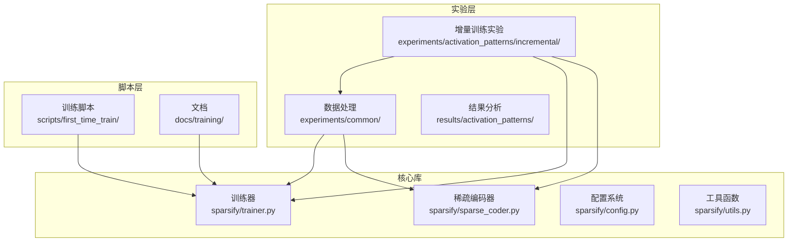
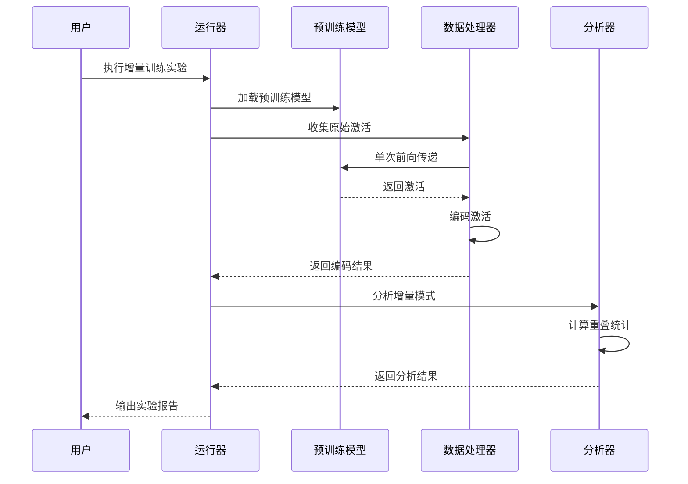
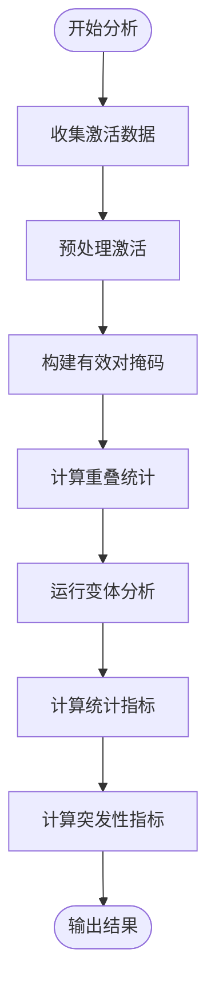
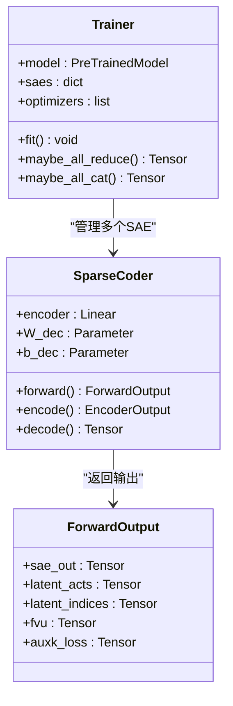
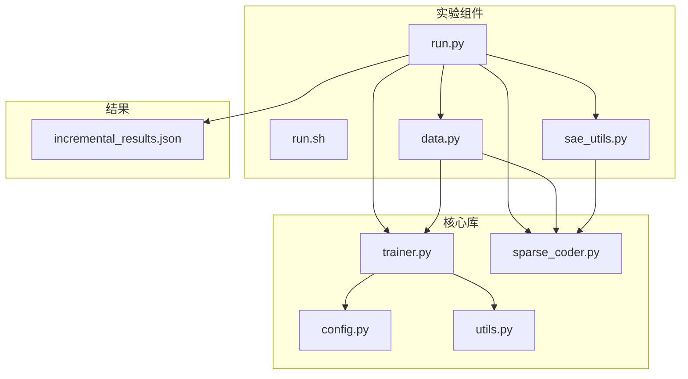

# 增量训练实验

<cite>
**本文档引用的文件**
- [run.py](file://experiments/activation_patterns/incremental/run.py)
- [run.sh](file://experiments/activation_patterns/incremental/run.sh)
- [trainer.py](file://sparsify/trainer.py)
- [sparse_coder.py](file://sparsify/sparse_coder.py)
- [data.py](file://experiments/common/data.py)
- [sae_utils.py](file://experiments/common/sae_utils.py)
- [config.py](file://sparsify/config.py)
- [script.sh](file://scripts/first_time_train/Qwen3-0.6B/script.sh)
- [qwen3-guide.md](file://docs/training/qwen3-guide.md)
- [incremental_results.json](file://results/activation_patterns/incremental/incremental_results.json)
</cite>

## 目录
1. [简介](#简介)
2. [项目结构](#项目结构)
3. [核心组件](#核心组件)
4. [架构概览](#架构概览)
5. [详细组件分析](#详细组件分析)
6. [依赖关系分析](#依赖关系分析)
7. [性能考虑](#性能考虑)
8. [故障排除指南](#故障排除指南)
9. [结论](#结论)
10. [附录](#附录)

## 简介

增量训练实验旨在探索稀疏自编码器（SAE）训练过程的渐进式扩展机制。该实验通过模拟连续令牌对之间的激活模式，研究如何逐步扩展训练过程以提高重建质量和效率。实验重点关注增量选择策略、参数更新机制和性能监控方法。

增量训练的核心理念是基于激活模式的连续性假设：相邻时间步的激活模式具有相似性，因此可以利用先前时间步的选择结果来指导当前时间步的参数更新。这种设计允许训练过程逐步扩展，从较小的候选集开始，随着训练的进行逐渐增加候选集大小。

## 项目结构

该项目采用模块化的组织方式，将不同的功能组件分离到独立的文件中：



**图表来源**
- [run.py:1-510](file://experiments/activation_patterns/incremental/run.py#L1-L510)
- [trainer.py:1-760](file://sparsify/trainer.py#L1-L760)
- [data.py:1-271](file://experiments/common/data.py#L1-L271)

**章节来源**
- [run.py:1-510](file://experiments/activation_patterns/incremental/run.py#L1-L510)
- [trainer.py:1-760](file://sparsify/trainer.py#L1-L760)
- [data.py:1-271](file://experiments/common/data.py#L1-L271)

## 核心组件

### 增量训练分析器

增量训练分析器是实验的核心组件，负责分析连续令牌对之间的激活模式重叠情况。它实现了多种变体策略：

- **topK变体**：使用当前时间步的top-K激活作为保留集合
- **topL_1.5变体**：使用1.5倍的top-K激活作为候选集
- **topL_2.0变体**：使用2倍的top-K激活作为候选集
- **union2变体**：结合前一时间步和当前时间步的激活

### 训练器组件

训练器组件提供了完整的训练框架，包括：

- **分布式训练支持**：支持多GPU和多节点训练
- **死特征检测**：监控和管理死特征
- **性能监控**：实时跟踪训练指标
- **检查点管理**：自动保存和恢复训练状态

### 数据处理管道

数据处理管道负责从预训练模型中提取激活，并将其转换为适合增量分析的格式：

- **原始激活收集**：单次前向传递收集多个钩点的激活
- **SAE编码**：将激活通过相应的稀疏编码器
- **Top-K选择**：执行top-K激活选择

**章节来源**
- [run.py:225-312](file://experiments/activation_patterns/incremental/run.py#L225-L312)
- [trainer.py:39-760](file://sparsify/trainer.py#L39-L760)
- [data.py:44-156](file://experiments/common/data.py#L44-L156)

## 架构概览

增量训练实验的整体架构分为三个主要阶段：



**图表来源**
- [run.py:367-509](file://experiments/activation_patterns/incremental/run.py#L367-L509)
- [data.py:44-156](file://experiments/common/data.py#L44-L156)

## 详细组件分析

### 增量分析算法

增量分析算法的核心是计算连续令牌对之间的激活重叠情况：



**图表来源**
- [run.py:148-222](file://experiments/activation_patterns/incremental/run.py#L148-L222)

#### 变体比较分析

实验实现了四种不同的增量选择策略：

| 变体类型 | 候选集大小 | 重叠计算方式 | 适用场景 |
|---------|-----------|-------------|----------|
| topK | K | 当前时间步激活 | 基准策略 |
| topL_1.5 | 1.5K | 当前时间步激活扩大 | 中等预算扩展 |
| topL_2.0 | 2K | 当前时间步激活扩大 | 大规模预算扩展 |
| union2 | ≤2K | 前一时间步 + 当前时间步 | 最大预算覆盖 |

**章节来源**
- [run.py:274-312](file://experiments/activation_patterns/incremental/run.py#L274-L312)
- [run.py:148-222](file://experiments/activation_patterns/incremental/run.py#L148-L222)

### 训练器架构

训练器组件提供了完整的训练基础设施：



**图表来源**
- [trainer.py:39-760](file://sparsify/trainer.py#L39-L760)
- [sparse_coder.py:20-269](file://sparsify/sparse_coder.py#L20-L269)

#### 训练循环机制

训练器实现了高效的训练循环，包含以下关键特性：

- **梯度累积**：支持分步梯度累积以适应大规模模型
- **死特征管理**：实时监控和处理死特征
- **分布式同步**：支持多GPU环境下的参数同步
- **性能优化**：使用bf16自动混合精度和内核融合

**章节来源**
- [trainer.py:162-729](file://sparsify/trainer.py#L162-L729)
- [sparse_coder.py:189-239](file://sparsify/sparse_coder.py#L189-L239)

### 数据处理流水线

数据处理流水线负责从预训练模型中提取激活并准备增量分析：


**图表来源**
- [data.py:44-156](file://experiments/common/data.py#L44-L156)
- [sae_utils.py:15-57](file://experiments/common/sae_utils.py#L15-L57)

#### 激活收集策略

数据收集采用了优化的策略以减少内存占用：

- **单次前向传递**：同时注册所有目标模块的钩子
- **按序列处理**：逐序列处理激活以控制内存使用
- **设备迁移**：在CPU和GPU之间智能迁移数据

**章节来源**
- [data.py:44-156](file://experiments/common/data.py#L44-L156)
- [run.py:417-472](file://experiments/activation_patterns/incremental/run.py#L417-L472)

## 依赖关系分析

增量训练实验涉及多个组件之间的复杂交互：



**图表来源**
- [run.py:1-510](file://experiments/activation_patterns/incremental/run.py#L1-L510)
- [trainer.py:1-760](file://sparsify/trainer.py#L1-L760)
- [data.py:1-271](file://experiments/common/data.py#L1-L271)

**章节来源**
- [run.py:1-510](file://experiments/activation_patterns/incremental/run.py#L1-L510)
- [trainer.py:1-760](file://sparsify/trainer.py#L1-L760)
- [data.py:1-271](file://experiments/common/data.py#L1-L271)

## 性能考虑

### 内存优化策略

增量训练实验采用了多种内存优化技术：

- **分块处理**：使用8192大小的块进行重叠计算
- **设备迁移**：在CPU和GPU之间智能迁移数据
- **及时释放**：在处理完每个钩点后立即释放内存

### 计算效率优化

- **向量化操作**：使用NumPy的向量化操作避免Python循环
- **内存复用**：重用缓冲区减少内存分配
- **批处理优化**：优化批处理大小以平衡吞吐量和内存使用

### 分布式训练优化

- **梯度累积**：支持多GPU环境下的梯度累积
- **参数同步**：使用all_reduce操作同步参数
- **负载均衡**：确保各GPU的负载均衡

## 故障排除指南

### 常见问题及解决方案

#### 内存不足问题
**症状**：训练过程中出现内存不足错误
**解决方案**：
- 减少批处理大小
- 使用更小的K值
- 增加梯度累积步数

#### 训练不稳定
**症状**：损失值波动较大或发散
**解决方案**：
- 调整学习率
- 增加auxk_alpha权重
- 检查数据质量

#### 性能瓶颈
**症状**：训练速度缓慢
**解决方案**：
- 启用bf16自动混合精度
- 使用内核融合优化
- 检查GPU利用率

**章节来源**
- [trainer.py:582-642](file://sparsify/trainer.py#L582-L642)
- [run.py:434-472](file://experiments/activation_patterns/incremental/run.py#L434-L472)

## 结论

增量训练实验展示了稀疏自编码器训练过程的渐进式扩展机制。通过分析连续令牌对之间的激活模式重叠，实验验证了增量选择策略的有效性。

主要发现包括：

1. **增量策略的有效性**：随着候选集大小的增加，重建质量持续改善
2. **预算分配的重要性**：合理的预算分配能够最大化重建效果
3. **突发性检测**：增量分析能够有效识别激活模式的突发变化

这些发现为稀疏自编码器的训练优化提供了重要的理论基础和实践指导。

## 附录

### 实验配置参数

#### 基本配置
- **模型路径**：`/root/models/Qwen3-0.6B`
- **LUT目录**：`/root/models/Qwen3-0.6B/lut`
- **数据集路径**：`/root/fineweb-edu/sample/10BT-tokenized-qwen3-2048/`
- **样本数量**：2560
- **序列长度**：512

#### 层选择配置
- **默认层**：`0 7 14 21 27`
- **快速测试层**：`7 14`

#### 算子类型配置
- **MLP算子**：`mlp` (默认)
- **注意力算子**：`qkv o`
- **组合配置**：`mlp qkv o`

### 训练流程

#### 第一步：原始激活收集
```bash
python -m experiments.activation_patterns.incremental.run \
    --model $MODEL --lut_dir $LUT_DIR --dataset $DATASET \
    --num_samples $NUM_SAMPLES --seq_len $SEQ_LEN \
    --layers $LAYERS --op_types $OP_TYPES \
    --output_dir $OUTPUT_DIR/ --device cuda
```

#### 第二步：结果汇总
```bash
python -m experiments.activation_patterns.summarize \
    --results_dir results/activation_patterns/ \
    --output results/activation_patterns/summary.csv
```

### 结果分析

实验结果包含了详细的统计信息：

- **召回率统计**：平均召回率、中位数、百分位数
- **质量评估**：加权召回率、新质量比率
- **突发性分析**：运行长度、平均运行长度、突发次数
- **替换统计**：平均替换数量、P90/P99替换数量

**章节来源**
- [run.sh:8-45](file://experiments/activation_patterns/incremental/run.sh#L8-L45)
- [qwen3-guide.md:19-78](file://docs/training/qwen3-guide.md#L19-L78)
- [incremental_results.json:1-800](file://results/activation_patterns/incremental/incremental_results.json#L1-L800)