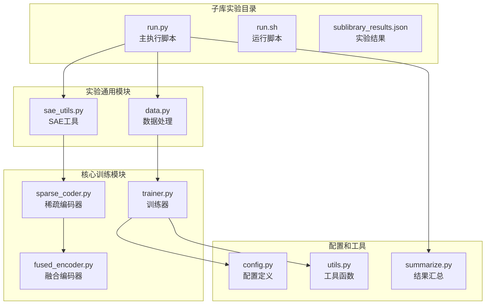
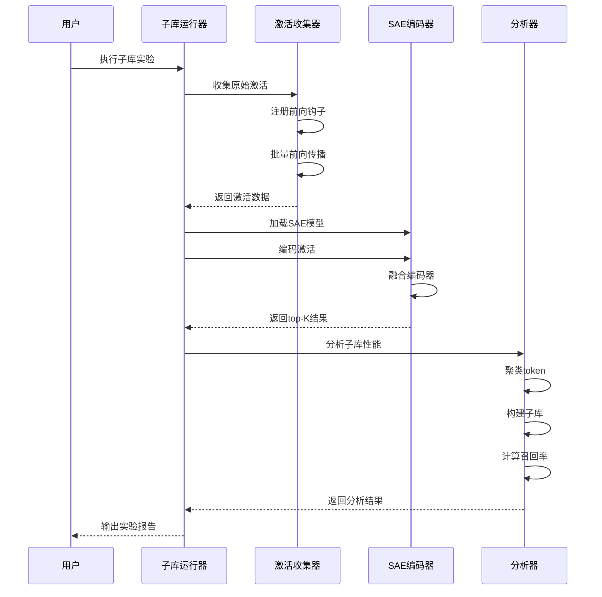
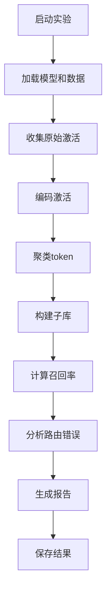
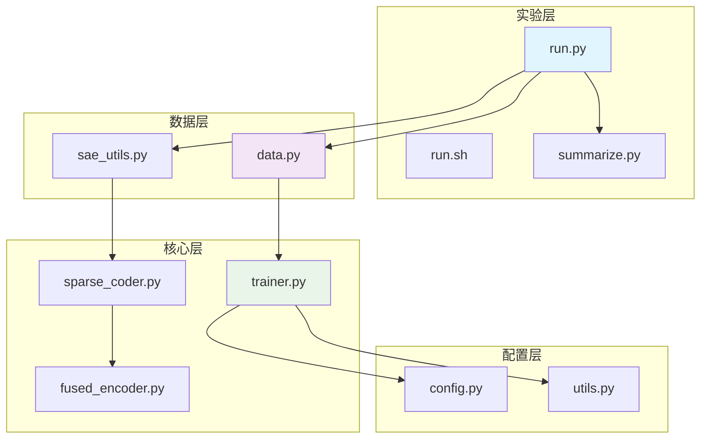

# 子库实验

<cite>
**本文档引用的文件**
- [run.py](file://experiments/activation_patterns/sublibrary/run.py)
- [run.sh](file://experiments/activation_patterns/sublibrary/run.sh)
- [sublibrary_results.json](file://results/activation_patterns/sublibrary/sublibrary_results.json)
- [data.py](file://experiments/common/data.py)
- [sae_utils.py](file://experiments/common/sae_utils.py)
- [trainer.py](file://sparsify/trainer.py)
- [sparse_coder.py](file://sparsify/sparse_coder.py)
- [fused_encoder.py](file://sparsify/fused_encoder.py)
- [config.py](file://sparsify/config.py)
- [utils.py](file://sparsify/utils.py)
- [summarize.py](file://experiments/activation_patterns/summarize.py)
- [qwen3-guide.md](file://docs/training/qwen3-guide.md)
- [20260316-activation-patterns.md](file://LUTurbo-doc/experiments/20260316-activation-patterns.md)
- [activation-patterns.md](file://LUTurbo-doc/ideas/activation-patterns.md)
</cite>

## 目录
1. [简介](#简介)
2. [项目结构](#项目结构)
3. [核心组件](#核心组件)
4. [架构概览](#架构概览)
5. [详细组件分析](#详细组件分析)
6. [依赖关系分析](#依赖关系分析)
7. [性能考虑](#性能考虑)
8. [故障排除指南](#故障排除指南)
9. [结论](#结论)
10. [附录](#附录)

## 简介

子库实验（Sublibrary Experiment）是Sparsify项目中的一个重要研究方向，旨在探索如何利用预训练的子库来指导稀疏自编码器（SAE）的训练过程。该实验的核心理念是通过离线聚类token的激活模式，构建每个簇的专用子库，并测量在理想路由条件下的top-K召回率。

子库实验与传统的SAE训练方法相比具有以下优势：
- **条件化激活模式**：基于token的实际激活模式进行聚类，而非简单的频率分布
- **路由优化**：通过子库减少需要搜索的潜在激活集合
- **性能上限**：提供oracle级别的性能上限，帮助评估实际路由策略的有效性
- **部署友好**：子库结构便于在推理阶段进行快速激活选择

## 项目结构

子库实验位于`experiments/activation_patterns/sublibrary/`目录下，主要包含以下关键文件：



**图表来源**
- [run.py:1-453](file://experiments/activation_patterns/sublibrary/run.py#L1-L453)
- [data.py:1-271](file://experiments/common/data.py#L1-L271)
- [sae_utils.py:1-124](file://experiments/common/sae_utils.py#L1-L124)

**章节来源**
- [run.py:1-453](file://experiments/activation_patterns/sublibrary/run.py#L1-L453)
- [run.sh:1-43](file://experiments/activation_patterns/sublibrary/run.sh#L1-L43)

## 核心组件

子库实验的核心组件包括：

### 1. 激活模式聚类系统
- **特征构建**：使用激活值加权的稀疏向量表示token的激活模式
- **随机投影**：将高维稀疏特征降至128维以提高聚类效率
- **MiniBatchKMeans**：大规模聚类算法，支持批量处理

### 2. 子库构建系统
- **全子库构建**：每个簇内所有token的top-K索引并集
- **截断子库**：基于频率统计的子库大小控制
- **性能评估**：oracle路由召回率和交叉路由召回率

### 3. 实验分析框架
- **多参数扫描**：G（簇数）= 8, 16, 32, 64
- **子库大小曲线**：N_sub vs recall的关系分析
- **路由错误分析**：评估路由错误的成本

**章节来源**
- [run.py:35-290](file://experiments/activation_patterns/sublibrary/run.py#L35-L290)
- [data.py:44-271](file://experiments/common/data.py#L44-L271)

## 架构概览

子库实验采用分层架构设计，从底层的数据收集到顶层的性能分析：



**图表来源**
- [run.py:326-453](file://experiments/activation_patterns/sublibrary/run.py#L326-L453)
- [data.py:44-157](file://experiments/common/data.py#L44-L157)
- [sae_utils.py:15-57](file://experiments/common/sae_utils.py#L15-L57)

## 详细组件分析

### 子库构建算法

子库构建是整个实验的核心算法，包含以下关键步骤：

#### 特征矩阵构建
```mermaid
flowchart TD
A[输入: top-K索引和值] --> B[构建稀疏特征矩阵]
B --> C[行: token, 列: latent索引]
C --> D[值: |激活值|权重]
D --> E[CSR格式存储]
```

**图表来源**
- [run.py:35-45](file://experiments/activation_patterns/sublibrary/run.py#L35-L45)

#### Token聚类策略
- **随机投影**：将稀疏特征降至128维
- **MiniBatchKMeans**：批量K-means聚类，支持大规模数据
- **多参数测试**：G = 8, 16, 32, 64

#### 子库构建策略
- **全子库**：簇内所有token的top-K索引并集
- **截断子库**：基于频率统计的N_sub大小控制
- **候选集比例**：N_sub/N = 12.5%, 25%, 50%等

**章节来源**
- [run.py:47-93](file://experiments/activation_patterns/sublibrary/run.py#L47-L93)

### 性能评估指标

实验使用多个指标来评估子库性能：

#### 召回率指标
- **oracle_recall**：理想路由条件下的召回率
- **cross_route_recall**：错误路由时的召回率
- **weighted_recall**：按激活值权重的召回率

#### 子库效率指标
- **sublibrary_size**：子库大小统计
- **size_ratio**：子库大小占总latent的比例
- **recall_gap**：oracle与cross_route的差距

**章节来源**
- [run.py:95-290](file://experiments/activation_patterns/sublibrary/run.py#L95-L290)

### 实验配置和运行流程

#### 基础配置
- **模型选择**：支持Qwen3系列模型
- **层选择**：可选择多个Transformer层
- **算子类型**：MLP、QKV、输出投影等
- **数据规模**：可配置样本数量和序列长度

#### 运行流程


**图表来源**
- [run.py:326-453](file://experiments/activation_patterns/sublibrary/run.py#L326-L453)

**章节来源**
- [run.py:326-453](file://experiments/activation_patterns/sublibrary/run.py#L326-L453)
- [run.sh:1-43](file://experiments/activation_patterns/sublibrary/run.sh#L1-L43)

## 依赖关系分析

子库实验涉及多个模块之间的复杂依赖关系：



**图表来源**
- [run.py:30-32](file://experiments/activation_patterns/sublibrary/run.py#L30-L32)
- [data.py:9-10](file://experiments/common/data.py#L9-L10)
- [trainer.py:21-34](file://sparsify/trainer.py#L21-L34)

### 关键依赖关系

1. **数据依赖**：run.py依赖data.py进行激活收集
2. **模型依赖**：data.py依赖sae_utils.py加载SAE模型
3. **训练依赖**：sae_utils.py依赖sparse_coder.py
4. **编码依赖**：sparse_coder.py依赖fused_encoder.py
5. **配置依赖**：trainer.py依赖config.py和utils.py

**章节来源**
- [run.py:30-32](file://experiments/activation_patterns/sublibrary/run.py#L30-L32)
- [data.py:218-219](file://experiments/common/data.py#L218-L219)
- [sae_utils.py:12-12](file://experiments/common/sae_utils.py#L12-L12)

## 性能考虑

### 内存优化策略

1. **流式处理**：逐个hookpoint处理，及时释放内存
2. **CUDA缓存管理**：使用torch.cuda.empty_cache()清理缓存
3. **稀疏矩阵存储**：使用CSR格式存储特征矩阵
4. **批处理优化**：合理设置批大小以平衡内存和速度

### 计算效率优化

1. **随机投影**：将128维投影降至128维以提高聚类效率
2. **MiniBatchKMeans**：支持批量处理大规模数据
3. **分块计算**：召回率计算采用分块策略
4. **并行处理**：支持多进程并行计算

### 性能监控

实验提供了详细的性能监控机制：
- **时间统计**：记录前向传播和指标计算时间
- **内存使用**：监控CUDA内存使用情况
- **吞吐量**：计算tokens/sec的处理速度

**章节来源**
- [run.py:413-416](file://experiments/activation_patterns/sublibrary/run.py#L413-L416)
- [trainer.py:267-291](file://sparsify/trainer.py#L267-L291)

## 故障排除指南

### 常见问题及解决方案

#### 1. 内存不足问题
**症状**：CUDA out of memory错误
**解决方案**：
- 减少batch_size
- 使用更小的num_samples
- 增加seq_len的分块大小
- 确保及时调用torch.cuda.empty_cache()

#### 2. 聚类收敛问题
**症状**：聚类结果不稳定或质量差
**解决方案**：
- 调整proj_dim参数
- 增加random_state确保可重复性
- 检查数据质量，确保有足够的token样本

#### 3. 结果不一致问题
**症状**：不同运行得到不同结果
**解决方案**：
- 固定随机种子
- 检查GPU驱动版本
- 确保使用相同的硬件环境

#### 4. 性能过慢问题
**症状**：实验运行时间过长
**解决方案**：
- 减少num_samples或seq_len
- 使用更少的G值（8, 16）
- 检查是否有其他进程占用GPU内存

**章节来源**
- [run.py:413-416](file://experiments/activation_patterns/sublibrary/run.py#L413-L416)
- [run.sh:24-26](file://experiments/activation_patterns/sublibrary/run.sh#L24-L26)

## 结论

子库实验为稀疏自编码器的训练提供了新的思路和方法。通过离线聚类token的激活模式，构建条件化的子库，实验展示了以下重要发现：

1. **条件子库的有效性**：在理想路由条件下，子库能够达到100%的召回率
2. **路由错误的影响**：路由错误会导致召回率下降，但通常在合理范围内
3. **子库大小与性能的关系**：较小的子库（12.5%-25%N）就能达到较高的召回率
4. **算子差异**：不同算子的激活模式存在差异，影响子库效果

与传统训练方法相比，子库实验的主要优势在于：
- 提供了性能上限参考
- 帮助理解激活模式的内在结构
- 为实际路由策略设计提供指导
- 便于部署阶段的性能优化

## 附录

### 实验配置示例

#### 基础运行命令
```bash
python -m experiments.activation_patterns.sublibrary.run \
    --model /root/models/Qwen3-0.6B \
    --lut_dir /root/models/Qwen3-0.6B/lut \
    --dataset /root/fineweb-edu/sample/10BT-tokenized-qwen3-2048/ \
    --num_samples 2560 --seq_len 512 \
    --layers 7 14 \
    --op_types mlp qkv o \
    --output_dir results/activation_patterns/sublibrary/
```

#### 结果分析
实验完成后，可以使用以下命令生成CSV摘要：
```bash
python -m experiments.activation_patterns.summarize \
    --results_dir results/activation_patterns/ \
    --output results/activation_patterns/summary.csv
```

### 关键参数说明

| 参数 | 类型 | 默认值 | 描述 |
|------|------|--------|------|
| num_samples | int | 256 | 处理的样本数量 |
| seq_len | int | 512 | 序列长度限制 |
| layers | list[int] | [0,7,14,21,27] | 选择的Transformer层 |
| op_types | list[str] | ["mlp"] | 算子类型选择 |
| G值 | int列表 | [8,16,32,64] | 聚类数量 |
| N_sub | int列表 | [N//G, N//2, N//4] | 子库大小 |

### 实验结果解读

根据实验结果，可以观察到以下趋势：
- **子库大小**：通常在N/G到N之间，大多数情况下接近N/G
- **召回率**：全子库召回率达到100%，截断子库在12.5%-25%N时达到80%+召回率
- **路由错误**：cross_route召回率通常比oracle召回率低10-20%
- **算子差异**：o_proj通常表现最好，mlp和qkv次之

**章节来源**
- [run.py:326-453](file://experiments/activation_patterns/sublibrary/run.py#L326-L453)
- [summarize.py:141-212](file://experiments/activation_patterns/summarize.py#L141-L212)