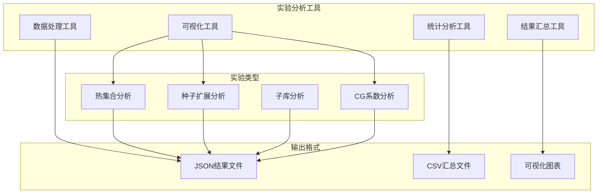
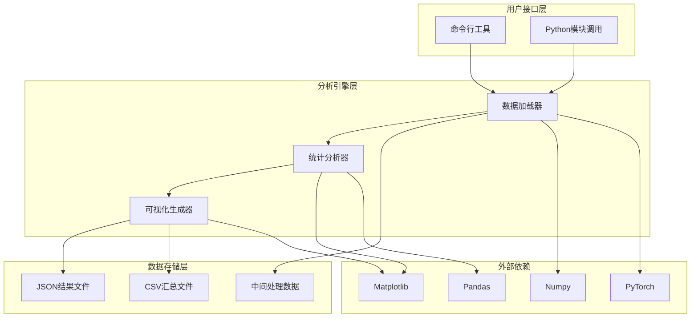
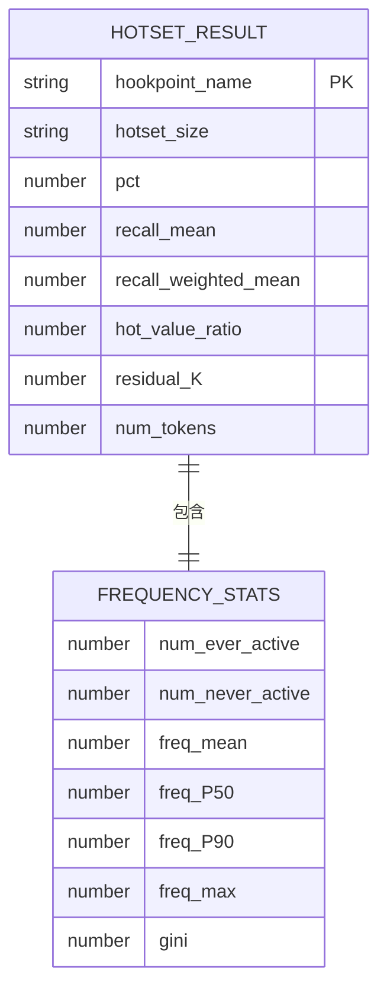
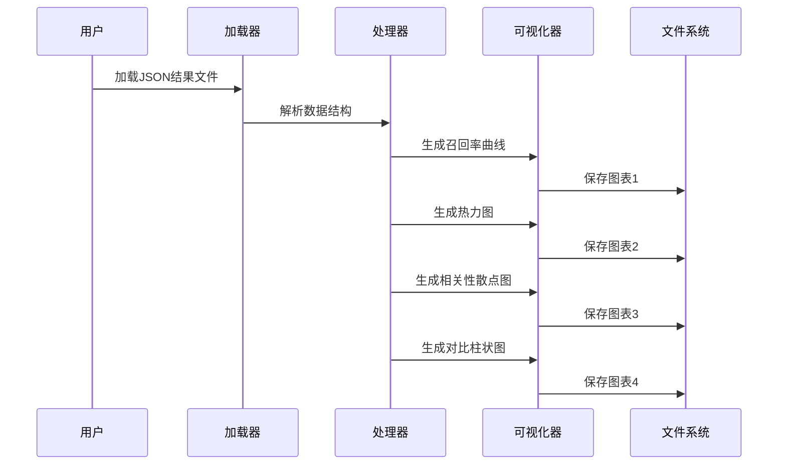
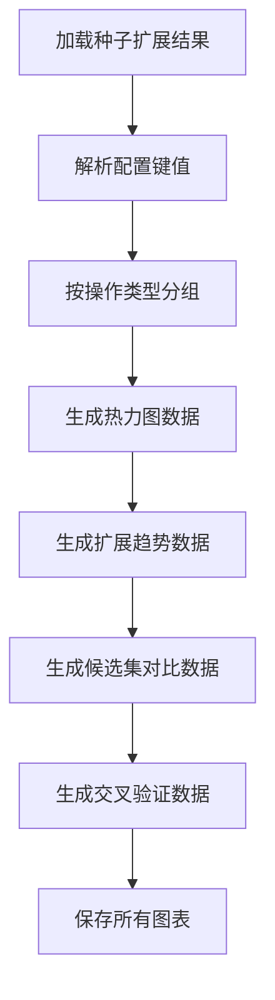
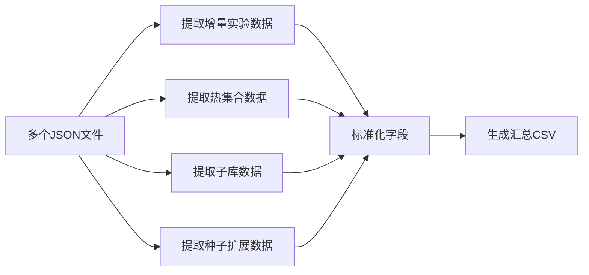
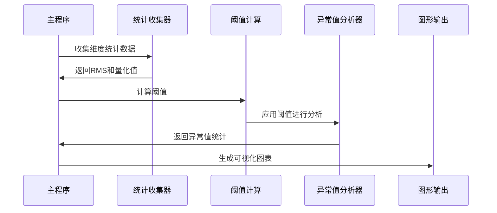
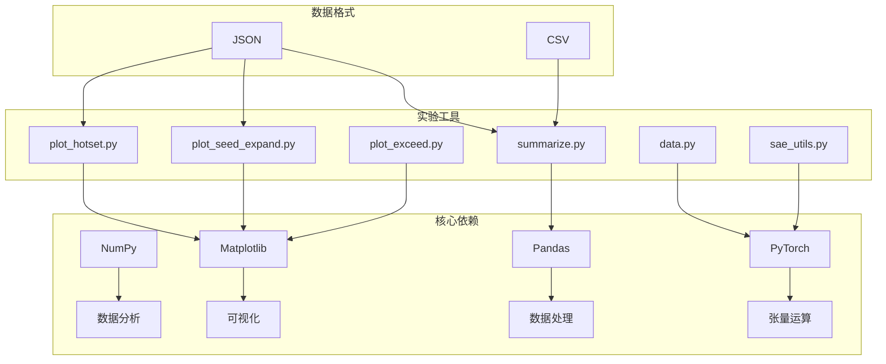

# 实验分析工具

<cite>
**本文档引用的文件**
- [plot_hotset.py](file://experiments/activation_patterns/plot_hotset.py)
- [plot_seed_expand.py](file://experiments/activation_patterns/plot_seed_expand.py)
- [summarize.py](file://experiments/activation_patterns/summarize.py)
- [data.py](file://experiments/common/data.py)
- [sae_utils.py](file://experiments/common/sae_utils.py)
- [hotset_results.json](file://results/activation_patterns/hotset/hotset_results.json)
- [seed_expand_results.json](file://results/activation_patterns/seed_expand/seed_expand_results.json)
- [summary.csv](file://results/activation_patterns/summary.csv)
- [plot_exceed.py](file://experiments/cg_coefficients/plot_exceed.py)
- [analyze_outliers.py](file://scripts/analyze_outliers.py)
</cite>

## 目录
1. [简介](#简介)
2. [项目结构](#项目结构)
3. [核心组件](#核心组件)
4. [架构概览](#架构概览)
5. [详细组件分析](#详细组件分析)
6. [依赖关系分析](#依赖关系分析)
7. [性能考虑](#性能考虑)
8. [故障排除指南](#故障排除指南)
9. [结论](#结论)

## 简介

本项目提供了完整的实验分析工具集，专门用于分析和可视化大规模语言模型激活模式实验结果。该工具集包含多种可视化图表生成器、数据汇总工具和统计分析功能，能够帮助研究人员深入理解模型的激活行为和性能表现。

主要功能包括：
- **热集合分析**：分析不同热集合大小对召回率的影响
- **种子扩展趋势**：研究种子扩展算法的性能表现
- **统计指标计算**：提供全面的统计分析和可视化
- **数据汇总管理**：将多源实验结果整合为统一格式
- **性能评估**：支持交叉验证和性能比较分析

## 项目结构

项目采用模块化设计，主要分为以下几个核心部分：

**图表来源**
- [plot_hotset.py:1-250](file://experiments/activation_patterns/plot_hotset.py#L1-L250)
- [plot_seed_expand.py:1-399](file://experiments/activation_patterns/plot_seed_expand.py#L1-L399)
- [summarize.py:1-343](file://experiments/activation_patterns/summarize.py#L1-L343)

**章节来源**
- [plot_hotset.py:1-250](file://experiments/activation_patterns/plot_hotset.py#L1-L250)
- [plot_seed_expand.py:1-399](file://experiments/activation_patterns/plot_seed_expand.py#L1-L399)
- [summarize.py:1-343](file://experiments/activation_patterns/summarize.py#L1-L343)

## 核心组件

### 可视化分析组件

系统提供了四种主要的可视化分析工具，每种工具都针对特定的实验场景：

#### 热集合分析可视化工具
- **功能**：分析不同热集合大小对模型召回率的影响
- **输出图表**：热力图、召回率曲线、相关性散点图
- **适用场景**：评估模型激活模式的集中程度

#### 种子扩展分析可视化工具  
- **功能**：研究种子扩展算法在不同参数配置下的性能表现
- **输出图表**：热力图、扩展趋势图、候选集vs召回率图
- **适用场景**：优化种子扩展算法参数

#### CG系数分析工具
- **功能**：比较内积方法与共轭梯度法的在线计算比例
- **输出图表**：在线计算比例对比图
- **适用场景**：算法性能基准测试

#### 异常值分析工具
- **功能**：识别和分析模型激活中的异常值
- **输出图表**：直方图、散点图、频率分布图
- **适用场景**：模型异常检测和质量评估

**章节来源**
- [plot_hotset.py:1-250](file://experiments/activation_patterns/plot_hotset.py#L1-L250)
- [plot_seed_expand.py:1-399](file://experiments/activation_patterns/plot_seed_expand.py#L1-L399)
- [plot_exceed.py:1-143](file://experiments/cg_coefficients/plot_exceed.py#L1-L143)
- [analyze_outliers.py:1-489](file://scripts/analyze_outliers.py#L1-L489)

### 数据处理组件

#### 实验数据加载器
负责从不同格式的数据源加载实验结果，支持JSON和CSV格式的自动识别和解析。

#### SAE工具集
提供稀疏自编码器(SAE)相关的实用函数，包括权重加载、编码器解码器操作等。

#### 统计分析工具
实现多种统计分析功能，包括量化分析、异常值检测、频率统计等。

**章节来源**
- [data.py:1-271](file://experiments/common/data.py#L1-L271)
- [sae_utils.py:1-124](file://experiments/common/sae_utils.py#L1-L124)

## 架构概览

系统采用分层架构设计，确保了良好的模块化和可扩展性：

**图表来源**
- [data.py:1-271](file://experiments/common/data.py#L1-L271)
- [plot_hotset.py:1-250](file://experiments/activation_patterns/plot_hotset.py#L1-L250)
- [plot_seed_expand.py:1-399](file://experiments/activation_patterns/plot_seed_expand.py#L1-L399)

## 详细组件分析

### 热集合分析工具

#### 数据结构设计

热集合分析工具处理的JSON数据结构具有层次化的组织方式：

**图表来源**
- [hotset_results.json:1-800](file://results/activation_patterns/hotset/hotset_results.json#L1-L800)

#### 可视化流程

热集合分析工具通过四个主要图表展示实验结果：

**图表来源**
- [plot_hotset.py:228-250](file://experiments/activation_patterns/plot_hotset.py#L228-L250)

**章节来源**
- [plot_hotset.py:1-250](file://experiments/activation_patterns/plot_hotset.py#L1-L250)
- [hotset_results.json:1-800](file://results/activation_patterns/hotset/hotset_results.json#L1-L800)

### 种子扩展分析工具

#### 参数配置系统

种子扩展分析支持复杂的参数配置，主要包括：

- **种子数量(s)**：初始种子集合的大小
- **邻居数量(n)**：每个种子扩展时考虑的邻居数量
- **热集合大小(H)**：热集合占总维度的比例

#### 数据处理流程

**图表来源**
- [plot_seed_expand.py:50-399](file://experiments/activation_patterns/plot_seed_expand.py#L50-L399)

**章节来源**
- [plot_seed_expand.py:1-399](file://experiments/activation_patterns/plot_seed_expand.py#L1-L399)
- [seed_expand_results.json:1-800](file://results/activation_patterns/seed_expand/seed_expand_results.json#L1-L800)

### 结果汇总工具

#### 数据转换流程

汇总工具将分散的实验结果转换为统一的CSV格式：

**图表来源**
- [summarize.py:22-343](file://experiments/activation_patterns/summarize.py#L22-L343)

**章节来源**
- [summarize.py:1-343](file://experiments/activation_patterns/summarize.py#L1-L343)
- [summary.csv:1-362](file://results/activation_patterns/summary.csv#L1-L362)

### 异常值分析工具

#### 统计分析流程

异常值分析工具实现了两阶段的分析流程：

**图表来源**
- [analyze_outliers.py:279-489](file://scripts/analyze_outliers.py#L279-L489)

**章节来源**
- [analyze_outliers.py:1-489](file://scripts/analyze_outliers.py#L1-L489)

## 依赖关系分析

系统依赖关系清晰，主要依赖包括：

**图表来源**
- [plot_hotset.py:15-25](file://experiments/activation_patterns/plot_hotset.py#L15-L25)
- [plot_seed_expand.py:16-23](file://experiments/activation_patterns/plot_seed_expand.py#L16-L23)
- [summarize.py:9-12](file://experiments/activation_patterns/summarize.py#L9-L12)

**章节来源**
- [plot_hotset.py:1-250](file://experiments/activation_patterns/plot_hotset.py#L1-L250)
- [plot_seed_expand.py:1-399](file://experiments/activation_patterns/plot_seed_expand.py#L1-L399)
- [summarize.py:1-343](file://experiments/activation_patterns/summarize.py#L1-L343)

## 性能考虑

### 内存优化策略

1. **分批处理**：实验数据采用分批处理方式，避免内存溢出
2. **延迟加载**：大型数组采用延迟加载机制
3. **数据类型优化**：使用适当的数据类型减少内存占用

### 计算效率优化

1. **向量化操作**：充分利用NumPy的向量化特性
2. **GPU加速**：PyTorch张量操作支持GPU加速
3. **缓存机制**：中间结果进行缓存以避免重复计算

### 扩展性设计

1. **模块化架构**：各组件独立设计，便于功能扩展
2. **配置驱动**：通过配置文件控制分析参数
3. **插件机制**：支持新的可视化图表类型

## 故障排除指南

### 常见问题及解决方案

#### 数据加载失败
- **症状**：无法读取JSON或CSV文件
- **原因**：文件路径错误或权限问题
- **解决**：检查文件路径和文件权限

#### 可视化图表缺失
- **症状**：生成的图表不完整或空白
- **原因**：matplotlib安装问题或后端配置错误
- **解决**：重新安装matplotlib并设置合适的后端

#### 内存不足错误
- **症状**：分析过程中出现内存溢出
- **原因**：处理的数据量过大
- **解决**：增加系统内存或调整批处理大小

#### 统计结果异常
- **症状**：统计结果与预期不符
- **原因**：数据预处理步骤错误
- **解决**：检查数据清洗和预处理逻辑

**章节来源**
- [plot_hotset.py:228-250](file://experiments/activation_patterns/plot_hotset.py#L228-L250)
- [plot_seed_expand.py:376-399](file://experiments/activation_patterns/plot_seed_expand.py#L376-L399)
- [summarize.py:290-343](file://experiments/activation_patterns/summarize.py#L290-L343)

## 结论

本实验分析工具集提供了完整的实验结果分析和可视化解决方案。通过模块化设计和清晰的架构，用户可以轻松地分析不同类型的实验结果，生成高质量的可视化图表，并进行深入的统计分析。

主要优势包括：
- **全面的分析能力**：支持多种实验类型的分析需求
- **灵活的可视化选项**：提供丰富的图表类型选择
- **高效的数据处理**：优化的算法确保快速的结果生成
- **易于使用的接口**：简洁的命令行和API接口

这些工具为研究人员提供了强大的实验分析能力，有助于深入理解模型的行为特征和性能表现，为后续的模型优化和改进提供重要参考。