# 激活模式实验

<cite>
**本文档引用的文件**
- [experiments/activation_patterns/hotset/run.py](file://experiments/activation_patterns/hotset/run.py)
- [experiments/activation_patterns/incremental/run.py](file://experiments/activation_patterns/incremental/run.py)
- [experiments/activation_patterns/seed_expand/run.py](file://experiments/activation_patterns/seed_expand/run.py)
- [experiments/activation_patterns/sublibrary/run.py](file://experiments/activation_patterns/sublibrary/run.py)
- [experiments/activation_patterns/plot_hotset.py](file://experiments/activation_patterns/plot_hotset.py)
- [experiments/activation_patterns/plot_seed_expand.py](file://experiments/activation_patterns/plot_seed_expand.py)
- [experiments/activation_patterns/summarize.py](file://experiments/activation_patterns/summarize.py)
- [experiments/common/data.py](file://experiments/common/data.py)
- [experiments/common/sae_utils.py](file://experiments/common/sae_utils.py)
- [results/activation_patterns/hotset/hotset_results.json](file://results/activation_patterns/hotset/hotset_results.json)
- [results/activation_patterns/incremental/incremental_results.json](file://results/activation_patterns/incremental/incremental_results.json)
- [results/activation_patterns/seed_expand/seed_expand_results.json](file://results/activation_patterns/seed_expand/seed_expand_results.json)
- [results/activation_patterns/sublibrary/sublibrary_results.json](file://results/activation_patterns/sublibrary/sublibrary_results.json)
</cite>

## 目录
1. [简介](#简介)
2. [项目结构](#项目结构)
3. [核心组件](#核心组件)
4. [架构概览](#架构概览)
5. [详细组件分析](#详细组件分析)
6. [依赖关系分析](#依赖关系分析)
7. [性能考虑](#性能考虑)
8. [故障排除指南](#故障排除指南)
9. [结论](#结论)
10. [附录](#附录)

## 简介

激活模式实验是针对稀疏自编码器（Sparse Autoencoder, SAE）激活模式进行系统性研究的重要实验框架。该实验通过四种不同的激活模式设计，深入分析了SAE在不同激活策略下的性能表现和优化潜力。

本实验框架主要包含四种激活模式：

- **热集合（Hotset）选择模式**：评估固定全局"热集合"（最频繁激活的基础向量）覆盖每个token真实top-K选择的效果
- **增量（Incremental）选择模式**：模拟连续token对（t, t+1）之间的保留先前token选择并oracle替换m个位置的过程
- **种子扩展（Seed Expansion）模式**：基于强top-K激活作为种子，利用共激活邻域表进行候选集扩展
- **子库（Sublibrary）条件模式**：通过聚类token激活模式，构建每个簇的子库并测量路由召回率

这些实验设计旨在为SAE的激活策略优化提供理论基础和实践指导，帮助研究人员理解不同激活模式对模型性能的影响机制。

## 项目结构

激活模式实验采用模块化设计，每个激活模式都有独立的实验脚本和可视化工具：

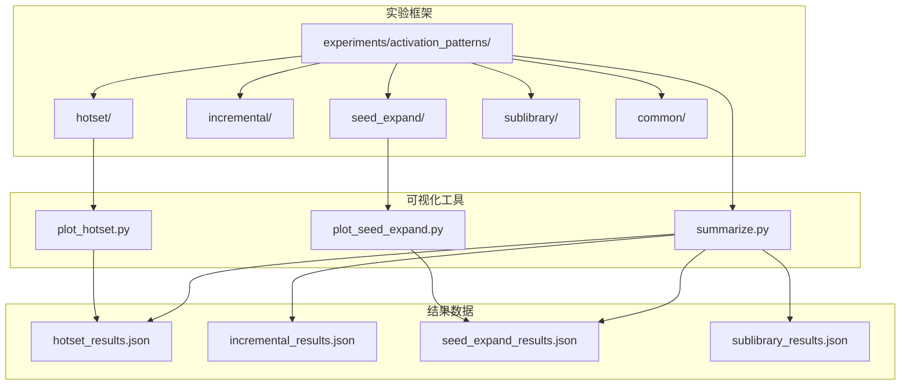

**图表来源**
- [experiments/activation_patterns/hotset/run.py:1-301](file://experiments/activation_patterns/hotset/run.py#L1-L301)
- [experiments/activation_patterns/incremental/run.py:1-510](file://experiments/activation_patterns/incremental/run.py#L1-L510)
- [experiments/activation_patterns/seed_expand/run.py:1-604](file://experiments/activation_patterns/seed_expand/run.py#L1-L604)
- [experiments/activation_patterns/sublibrary/run.py:1-453](file://experiments/activation_patterns/sublibrary/run.py#L1-L453)

**章节来源**
- [experiments/activation_patterns/hotset/run.py:1-301](file://experiments/activation_patterns/hotset/run.py#L1-L301)
- [experiments/activation_patterns/incremental/run.py:1-510](file://experiments/activation_patterns/incremental/run.py#L1-L510)
- [experiments/activation_patterns/seed_expand/run.py:1-604](file://experiments/activation_patterns/seed_expand/run.py#L1-L604)
- [experiments/activation_patterns/sublibrary/run.py:1-453](file://experiments/activation_patterns/sublibrary/run.py#L1-L453)

## 核心组件

### 实验通用框架

实验框架采用统一的数据收集和编码流程，确保不同激活模式实验的一致性和可比性：

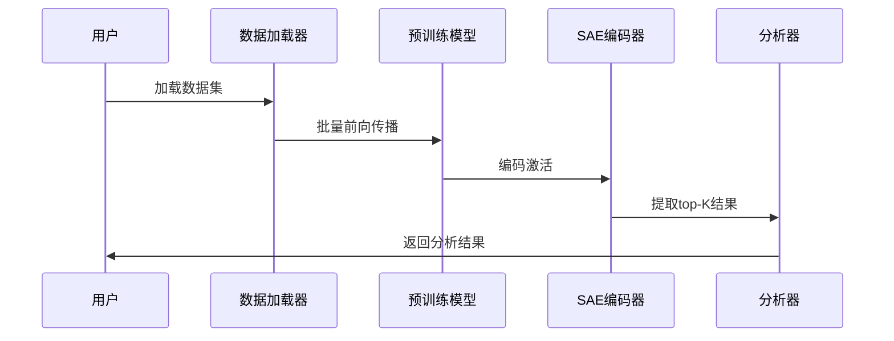

**图表来源**
- [experiments/common/data.py:44-156](file://experiments/common/data.py#L44-L156)
- [experiments/common/data.py:189-270](file://experiments/common/data.py#L189-L270)

### SAE工具模块

SAE工具模块提供了标准化的SAE加载和编码功能：

- **SAE加载**：从LUT文件中加载预训练的SAE模型
- **Top-K编码**：计算输入激活的top-K最大值及其索引
- **Hook点映射**：将模型模块名称映射到对应的LUT层名称

**章节来源**
- [experiments/common/sae_utils.py:15-57](file://experiments/common/sae_utils.py#L15-L57)
- [experiments/common/sae_utils.py:105-124](file://experiments/common/sae_utils.py#L105-L124)

## 架构概览

激活模式实验的整体架构采用分层设计，从底层的数据处理到上层的分析可视化：

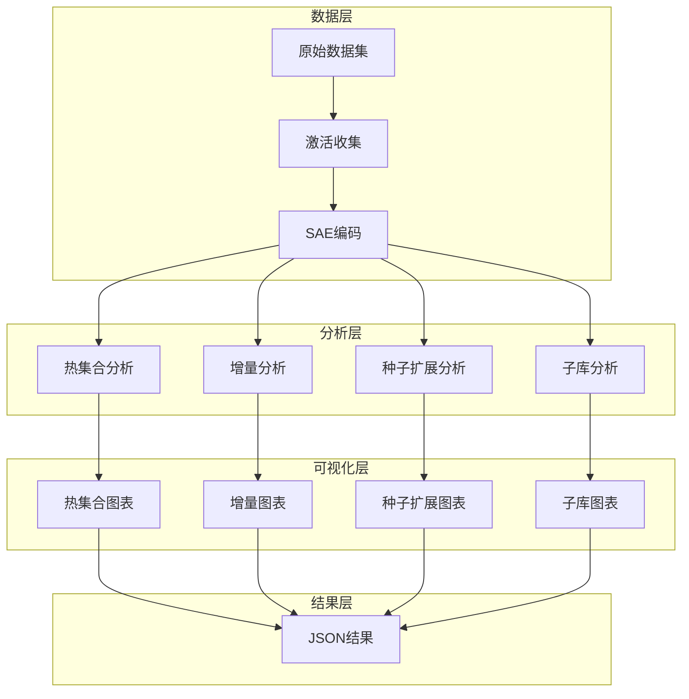

**图表来源**
- [experiments/common/data.py:44-156](file://experiments/common/data.py#L44-L156)
- [experiments/activation_patterns/hotset/run.py:210-264](file://experiments/activation_patterns/hotset/run.py#L210-L264)
- [experiments/activation_patterns/incremental/run.py:417-472](file://experiments/activation_patterns/incremental/run.py#L417-L472)

## 详细组件分析

### 热集合（Hotset）激活模式

热集合模式通过分析基础向量的激活频率分布，评估固定热集合对token激活的覆盖效果。

#### 设计原理

热集合模式的核心思想是识别在训练数据中出现频率最高的基础向量，并评估这些向量是否能够有效覆盖每个token的真实激活模式：

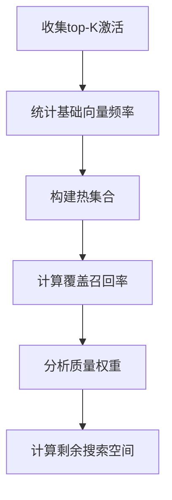

**图表来源**
- [experiments/activation_patterns/hotset/run.py:33-119](file://experiments/activation_patterns/hotset/run.py#L33-L119)

#### 实现方法

热集合分析的核心算法包括：

1. **频率统计**：计算每个基础向量在整个数据集中的激活次数
2. **热集合构建**：根据预设比例（1%、5%、10%、20%）构建热集合
3. **召回率计算**：评估热集合对每个token真实top-K的覆盖程度
4. **质量加权**：考虑激活值的绝对值进行加权召回率计算

#### 训练流程

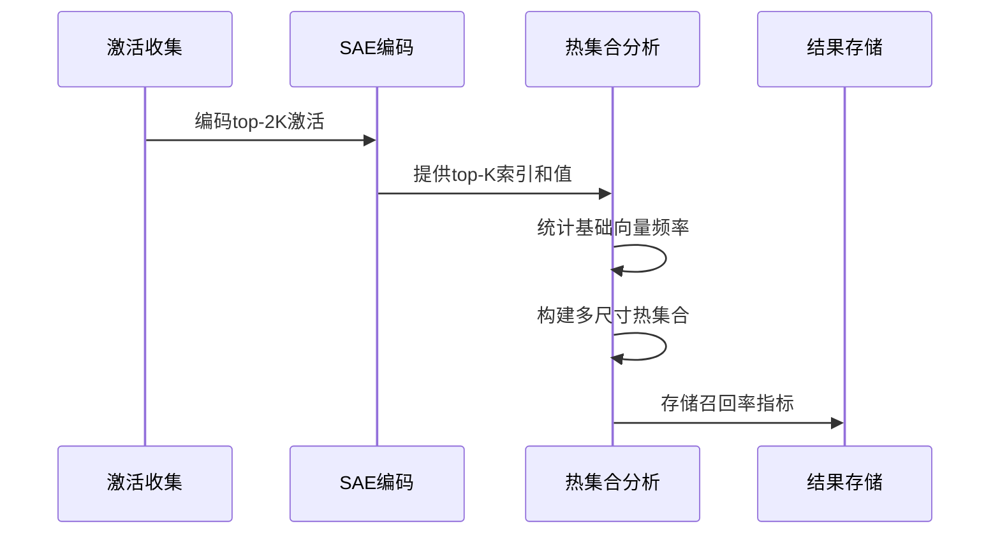

**图表来源**
- [experiments/activation_patterns/hotset/run.py:210-264](file://experiments/activation_patterns/hotset/run.py#L210-L264)

#### 参数配置

热集合实验的关键参数：

- **热集合大小比例**：1%、5%、10%、20%的N（总基础向量数）
- **top-K值**：SAE的激活稀疏度参数
- **样本数量**：默认256个序列，序列长度512
- **层选择**：默认第0、7、14、21、27层

#### 结果分析

热集合分析输出多个统计指标：

- **未加权召回率**：直接计算热集合覆盖比例
- **加权召回率**：按激活值绝对值加权的覆盖比例
- **热值比率**：来自热集合的激活质量占总激活质量的比例
- **剩余搜索空间**：热集合无法覆盖的候选空间大小

**章节来源**
- [experiments/activation_patterns/hotset/run.py:33-119](file://experiments/activation_patterns/hotset/run.py#L33-L119)
- [experiments/activation_patterns/hotset/run.py:160-297](file://experiments/activation_patterns/hotset/run.py#L160-L297)

### 增量（Incremental）激活模式

增量模式模拟连续token之间的激活一致性，评估保留先前token激活并逐步替换新位置的效果。

#### 设计原理

增量模式基于这样一个假设：相邻token的激活模式具有时间连续性，可以通过保留先前token的激活来减少新token的激活搜索：

```mermaid
flowchart TD
A[token t] --> B[保留top-K(t)]
A --> C[计算需要替换的位置数]
B --> D[oracle替换m个位置]
C --> D
D --> E[计算新token的激活]
```

**图表来源**
- [experiments/activation_patterns/incremental/run.py:225-312](file://experiments/activation_patterns/incremental/run.py#L225-L312)

#### 实现方法

增量分析采用高效的向量化操作：

1. **配对分析**：为每个序列中的连续token对(t, t+1)建立分析对
2. **重叠计算**：计算保留集合与下一个token激活的重叠程度
3. **替换策略**：通过oracle排序确定需要替换的具体位置
4. **统计分析**：计算不同替换预算下的召回率和质量损失

#### 训练流程

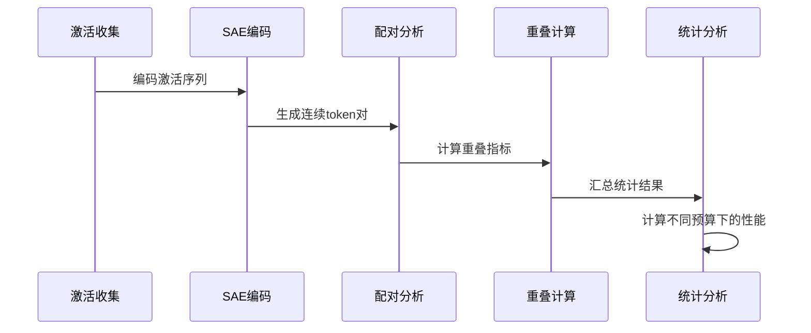

**图表来源**
- [experiments/activation_patterns/incremental/run.py:417-472](file://experiments/activation_patterns/incremental/run.py#L417-L472)

#### 参数配置

增量实验的关键参数：

- **替换预算**：m=0, 4, 8, 16, 32, 64, K（总候选数）
- **变体比较**：topK、topL_1.5、topL_2.0、union2四种策略
- **序列边界处理**：正确处理序列结束边界，避免跨序列分析

#### 结果分析

增量分析输出丰富的性能指标：

- **召回率统计**：不同预算下的平均、分位数召回率
- **质量保持**：新质量比率（new_mass_ratio）衡量激活质量损失
- **替换统计**：实际替换位置数的分布统计
- **突发性分析**：K/4阈值下的替换突发性检测

**章节来源**
- [experiments/activation_patterns/incremental/run.py:225-312](file://experiments/activation_patterns/incremental/run.py#L225-L312)
- [experiments/activation_patterns/incremental/run.py:367-506](file://experiments/activation_patterns/incremental/run.py#L367-L506)

### 种子扩展（Seed Expansion）激活模式

种子扩展模式基于共激活邻域分析，通过强激活作为种子进行候选集扩展。

#### 设计原理

种子扩展模式利用基础向量间的共激活关系，构建邻域网络来扩展初始种子：

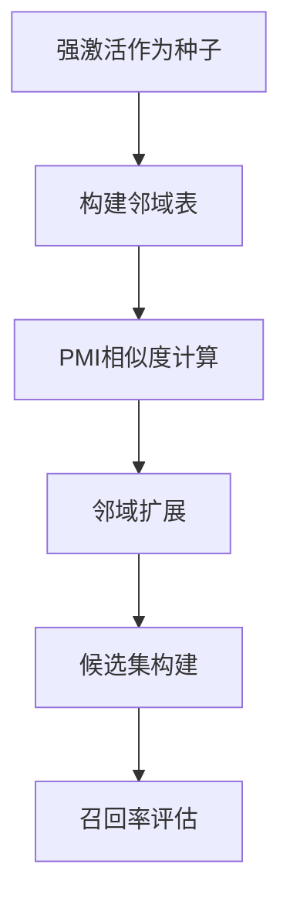

**图表来源**
- [experiments/activation_patterns/seed_expand/run.py:245-425](file://experiments/activation_patterns/seed_expand/run.py#L245-L425)

#### 实现方法

种子扩展采用高效的矩阵运算：

1. **共现矩阵构建**：计算基础向量间的共现频率
2. **PMI计算**：基于共现频率计算点互信息（PMI）
3. **邻域提取**：为每个基础向量提取正PMI邻居
4. **扩展评估**：评估不同种子大小和邻域数量的效果

#### 训练流程

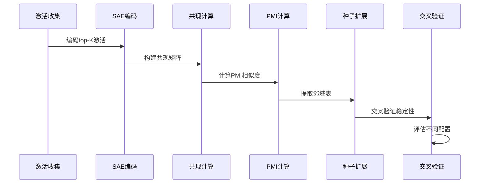

**图表来源**
- [experiments/activation_patterns/seed_expand/run.py:523-567](file://experiments/activation_patterns/seed_expand/run.py#L523-L567)

#### 参数配置

种子扩展实验的关键参数：

- **种子大小**：s=4, 8, 16, 32（初始强激活数量）
- **邻域数量**：n=8, 16, 32, 64（每个种子的邻居数）
- **热集合组合**：H=20%N的热集合作为种子
- **GPU加速**：支持CUDA设备加速大规模矩阵运算

#### 结果分析

种子扩展分析输出多维度性能指标：

- **候选集大小**：扩展后候选集的平均大小和分布
- **召回率对比**：不同配置下的召回率性能
- **稳定性评估**：全表vs训练表的召回率差异
- **效率分析**：候选集大小与召回率的关系

**章节来源**
- [experiments/activation_patterns/seed_expand/run.py:245-425](file://experiments/activation_patterns/seed_expand/run.py#L245-L425)
- [experiments/activation_patterns/seed_expand/run.py:476-604](file://experiments/activation_patterns/seed_expand/run.py#L476-L604)

### 子库（Sublibrary）激活模式

子库模式通过聚类token激活模式，为每个簇构建专门的子库。

#### 设计原理

子库模式基于激活模式的聚类思想，将具有相似激活特征的token分组：

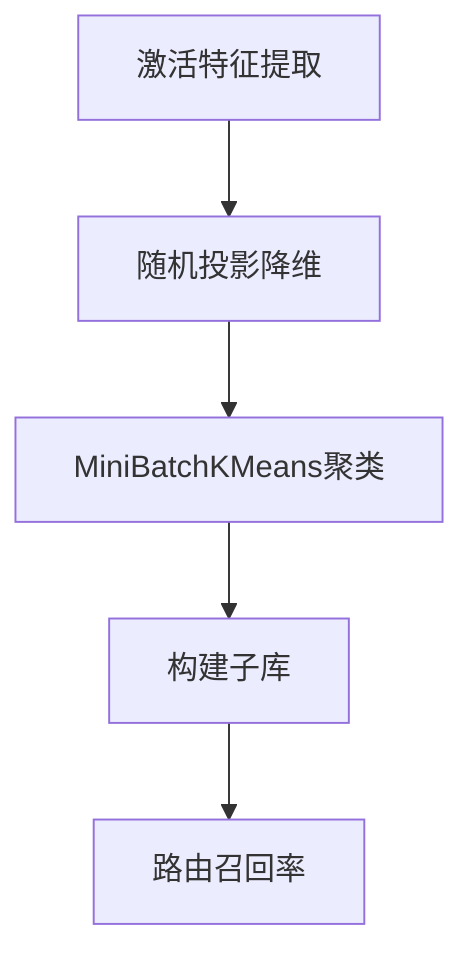

**图表来源**
- [experiments/activation_patterns/sublibrary/run.py:126-290](file://experiments/activation_patterns/sublibrary/run.py#L126-L290)

#### 实现方法

子库分析采用机器学习聚类技术：

1. **特征表示**：将每个token的top-K激活转换为稀疏特征向量
2. **降维投影**：使用随机投影将高维特征降至128维
3. **聚类分析**：应用MiniBatchKMeans进行大规模聚类
4. **子库构建**：为每个簇构建激活向量的并集

#### 训练流程

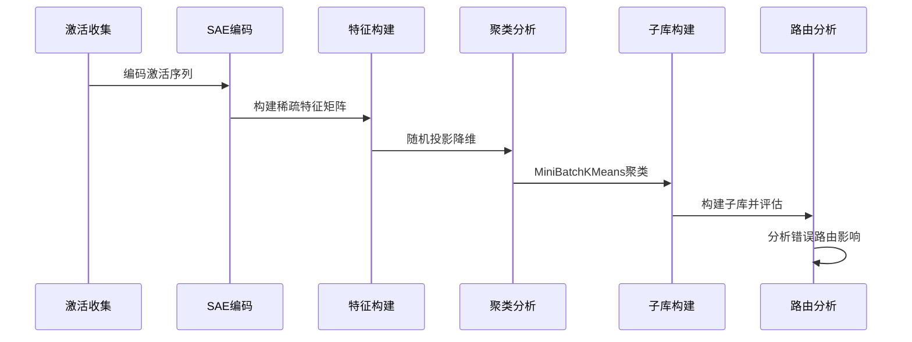

**图表来源**
- [experiments/activation_patterns/sublibrary/run.py:35-93](file://experiments/activation_patterns/sublibrary/run.py#L35-L93)

#### 参数配置

子库实验的关键参数：

- **聚类数量**：G=8, 16, 32, 64（不同簇数）
- **投影维度**：128维随机投影
- **子库大小**：N_sub=N/G、N/2等不同配置
- **批量大小**：4096用于大规模KMeans训练

#### 结果分析

子库分析输出全面的聚类和路由指标：

- **聚类统计**：簇大小分布和统计特性
- **子库规模**：不同配置下子库的平均规模和占比
- **路由性能**：正确路由vs错误路由的召回率对比
- **性能差距**：路由性能与全库性能的差距分析

**章节来源**
- [experiments/activation_patterns/sublibrary/run.py:126-290](file://experiments/activation_patterns/sublibrary/run.py#L126-L290)
- [experiments/activation_patterns/sublibrary/run.py:326-453](file://experiments/activation_patterns/sublibrary/run.py#L326-L453)

## 依赖关系分析

激活模式实验的依赖关系体现了清晰的模块化设计：

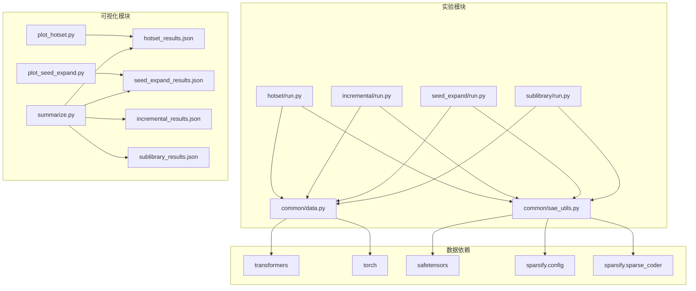

**图表来源**
- [experiments/activation_patterns/hotset/run.py:16-31](file://experiments/activation_patterns/hotset/run.py#L16-L31)
- [experiments/activation_patterns/incremental/run.py:16-31](file://experiments/activation_patterns/incremental/run.py#L16-L31)
- [experiments/activation_patterns/seed_expand/run.py:19-34](file://experiments/activation_patterns/seed_expand/run.py#L19-L34)
- [experiments/activation_patterns/sublibrary/run.py:17-33](file://experiments/activation_patterns/sublibrary/run.py#L17-L33)

**章节来源**
- [experiments/common/data.py:1-271](file://experiments/common/data.py#L1-L271)
- [experiments/common/sae_utils.py:1-124](file://experiments/common/sae_utils.py#L1-L124)

## 性能考虑

### 内存优化策略

激活模式实验在内存管理方面采用了多种优化策略：

1. **流式处理**：逐层处理hookpoint，及时释放中间结果
2. **GPU加速**：在可用时使用CUDA设备进行大规模矩阵运算
3. **分块处理**：对大型矩阵运算采用分块策略避免内存溢出
4. **及时清理**：使用torch.cuda.empty_cache()及时释放显存

### 计算复杂度分析

- **热集合模式**：O(T×K)的时间复杂度，其中T为token总数，K为top-K大小
- **增量模式**：O(T×K×P)的复杂度，P为配对数量，需要高效的向量化操作
- **种子扩展模式**：O(N²×T/K)的复杂度，主要受限于共现矩阵计算
- **子库模式**：O(T×K×G)的复杂度，受聚类算法影响

### 并行处理

实验框架支持多进程并行处理：

- **hookpoint并行**：不同hookpoint可以并行处理
- **GPU并行**：支持多GPU环境下的并行计算
- **批处理优化**：合理设置batch_size平衡内存和速度

## 故障排除指南

### 常见问题及解决方案

#### 内存不足问题

**症状**：运行过程中出现内存溢出或CUDA Out of Memory错误

**解决方案**：
1. 减少batch_size参数
2. 降低num_samples或seq_len
3. 使用更小的top-K值
4. 及时调用torch.cuda.empty_cache()

#### 数据加载问题

**症状**：数据集加载失败或格式不匹配

**解决方案**：
1. 确认数据路径正确性
2. 检查数据格式（Arrow、Parquet或HuggingFace Hub）
3. 验证tokenizer配置正确
4. 确保序列长度不超过模型限制

#### SAE模型加载问题

**症状**：SAE模型文件找不到或加载失败

**解决方案**：
1. 确认LUT目录结构完整
2. 检查metadata.json文件存在性
3. 验证safetensors文件完整性
4. 确认设备兼容性

**章节来源**
- [experiments/activation_patterns/hotset/run.py:178-186](file://experiments/activation_patterns/hotset/run.py#L178-L186)
- [experiments/activation_patterns/incremental/run.py:385-393](file://experiments/activation_patterns/incremental/run.py#L385-L393)

## 结论

激活模式实验为稀疏自编码器的激活策略优化提供了全面的理论框架和实践指导。通过四种不同激活模式的系统性分析，我们获得了以下重要发现：

1. **热集合模式**揭示了基础向量激活的集中性特征，为SAE的稀疏度设计提供了参考标准
2. **增量模式**证明了激活的时间连续性，在实际应用中可以有效减少计算开销
3. **种子扩展模式**展示了共激活邻域的有效性，为激活预测提供了新的思路
4. **子库模式**验证了激活模式聚类的可行性，为条件激活策略奠定了基础

这些实验结果不仅加深了我们对SAE激活机制的理解，也为后续的模型优化和部署提供了重要的指导原则。未来的研究方向包括结合多种激活模式的优势，开发更加智能和高效的激活策略。

## 附录

### 实验脚本使用指南

#### 热集合实验

```bash
python -m experiments.activation_patterns.hotset.run \
    --model /root/models/Qwen3-0.6B \
    --lut_dir /root/models/Qwen3-0.6B/lut \
    --dataset /root/fineweb-edu/sample/10BT-tokenized-qwen3-2048/ \
    --num_samples 256 --seq_len 512 \
    --layers 0 7 14 21 27 \
    --output_dir results/activation_patterns/hotset/
```

#### 增量实验

```bash
python -m experiments.activation_patterns.incremental.run \
    --model /root/models/Qwen3-0.6B \
    --lut_dir /root/models/Qwen3-0.6B/lut \
    --dataset /root/fineweb-edu/sample/10BT-tokenized-qwen3-2048/ \
    --num_samples 256 --seq_len 512 \
    --layers 0 7 14 21 27 \
    --output_dir results/activation_patterns/incremental/
```

#### 种子扩展实验

```bash
python -m experiments.activation_patterns.seed_expand.run \
    --model /root/models/Qwen3-0.6B \
    --lut_dir /root/models/Qwen3-0.6B/lut \
    --dataset /root/fineweb-edu/sample/10BT-tokenized-qwen3-2048/ \
    --num_samples 256 --seq_len 512 \
    --layers 0 7 14 21 27 \
    --output_dir results/activation_patterns/seed_expand/
```

#### 子库实验

```bash
python -m experiments.activation_patterns.sublibrary.run \
    --model /root/models/Qwen3-0.6B \
    --lut_dir /root/models/Qwen3-0.6B/lut \
    --dataset /root/fineweb-edu/sample/10BT-tokenized-qwen3-2048/ \
    --num_samples 256 --seq_len 512 \
    --layers 0 7 14 21 27 \
    --output_dir results/activation_patterns/sublibrary/
```

### 参数调优建议

#### 热集合模式调优

- **热集合大小**：从1%开始，逐步增加到20%，观察召回率饱和点
- **top-K值**：根据具体任务调整，通常在64-256范围内
- **样本数量**：至少128个序列，确保统计显著性

#### 增量模式调优

- **替换预算**：优先测试m=K/4、K/2、K等关键值
- **策略比较**：重点比较topK、topL_1.5、union2策略的性价比
- **序列长度**：根据任务需求调整seq_len参数

#### 种子扩展模式调优

- **种子大小**：s=8-32范围内的种子通常效果最佳
- **邻域数量**：n=16-64范围内的邻域数量表现稳定
- **热集合组合**：H=15%-25%的热集合作为种子效果良好

#### 子库模式调优

- **聚类数量**：G=16-32的簇数通常平衡了性能和复杂度
- **子库大小**：N_sub≈N/G的配置通常效果最佳
- **投影维度**：128维投影在精度和效率间取得良好平衡

### 结果可视化

实验框架提供了完整的可视化工具：

```bash
# 热集合结果可视化
python experiments/activation_patterns/plot_hotset.py \
    --results results/activation_patterns/hotset/hotset_results.json \
    --output results/activation_patterns/hotset/

# 种子扩展结果可视化
python experiments/activation_patterns/plot_seed_expand.py \
    --results results/activation_patterns/seed_expand/seed_expand_results.json \
    --output results/activation_patterns/seed_expand/
```

这些可视化工具生成多种图表，包括召回率曲线、热力图、散点图等，为结果分析提供了直观的视觉支持。