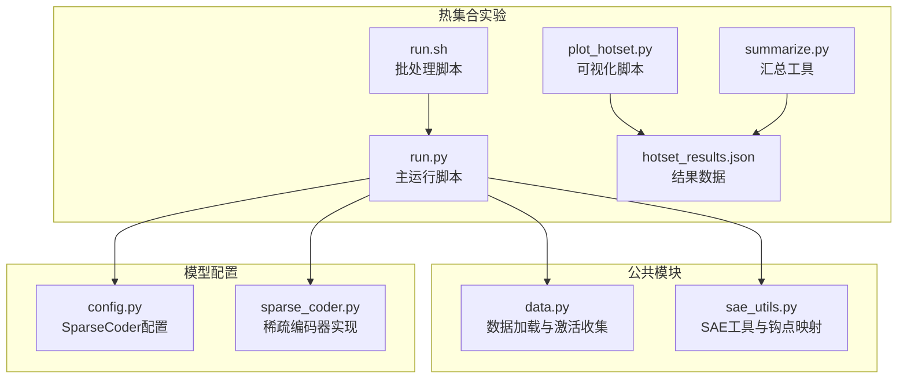
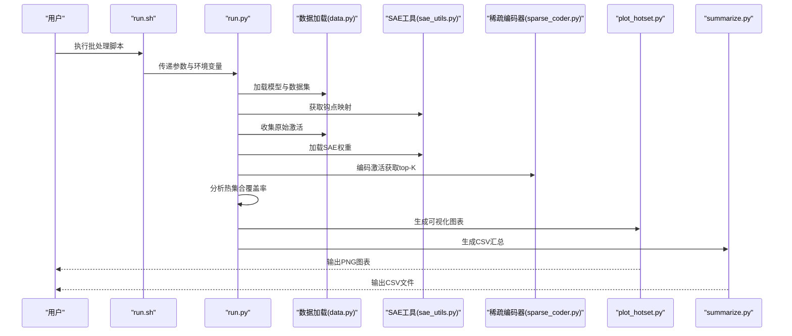
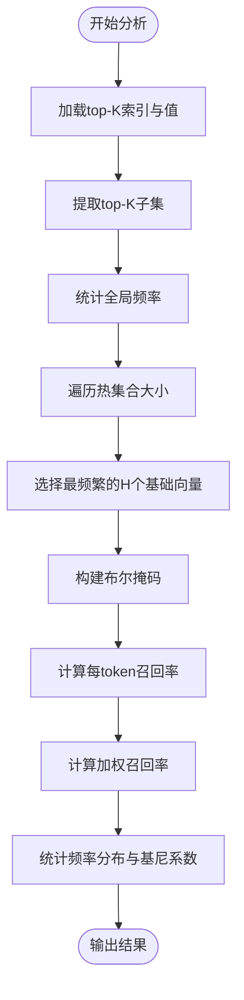
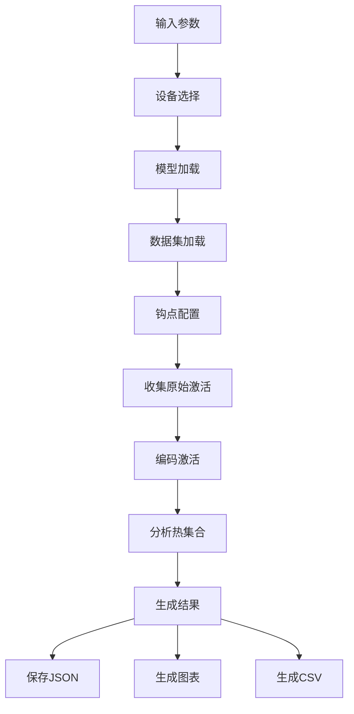
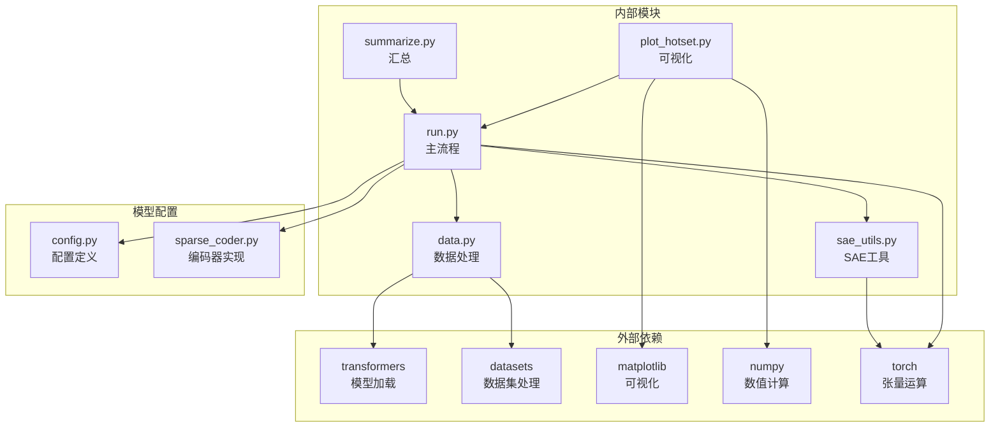

# 热集合实验

<cite>
**本文引用的文件**
- [run.py](file://experiments/activation_patterns/hotset/run.py)
- [run.sh](file://experiments/activation_patterns/hotset/run.sh)
- [plot_hotset.py](file://experiments/activation_patterns/plot_hotset.py)
- [hotset_results.json](file://results/activation_patterns/hotset/hotset_results.json)
- [summarize.py](file://experiments/activation_patterns/summarize.py)
- [data.py](file://experiments/common/data.py)
- [sae_utils.py](file://experiments/common/sae_utils.py)
- [config.py](file://sparsify/config.py)
- [sparse_coder.py](file://sparsify/sparse_coder.py)
</cite>

## 目录
1. [简介](#简介)
2. [项目结构](#项目结构)
3. [核心组件](#核心组件)
4. [架构概览](#架构概览)
5. [详细组件分析](#详细组件分析)
6. [依赖分析](#依赖分析)
7. [性能考虑](#性能考虑)
8. [故障排除指南](#故障排除指南)
9. [结论](#结论)
10. [附录](#附录)

## 简介
本文件详细阐述热集合(hotset)实验的设计与实现，解释固定全局"热集合"(最频繁激活的基础向量)如何覆盖每个token的真实top-K选择，并提供完整的实验流程、指标定义、可视化分析及结果解读指南。热集合实验的核心目标是评估在给定SAE top-K设置下，通过固定全局热集合能否有效覆盖真实激活分布，从而为稀疏编码器的选择策略提供理论基线。

## 项目结构
热集合实验位于实验目录的激活模式子模块中，包含运行脚本、可视化脚本、结果数据和汇总工具：
- 运行脚本：负责收集激活、编码、分析热集合覆盖率
- 可视化脚本：生成召回率曲线、基尼系数热力图等图表
- 结果数据：保存每层每算子在不同热集合大小下的指标
- 汇总工具：将多实验结果合并为CSV便于进一步分析

**图表来源**
- [run.py:160-296](file://experiments/activation_patterns/hotset/run.py#L160-L296)
- [plot_hotset.py:228-246](file://experiments/activation_patterns/plot_hotset.py#L228-L246)
- [data.py:44-156](file://experiments/common/data.py#L44-L156)
- [sae_utils.py:15-124](file://experiments/common/sae_utils.py#L15-L124)
- [config.py:7-26](file://sparsify/config.py#L7-L26)
- [sparse_coder.py:36-200](file://sparsify/sparse_coder.py#L36-L200)

**章节来源**
- [run.py:1-301](file://experiments/activation_patterns/hotset/run.py#L1-L301)
- [run.sh:1-45](file://experiments/activation_patterns/hotset/run.sh#L1-L45)
- [plot_hotset.py:1-250](file://experiments/activation_patterns/plot_hotset.py#L1-L250)
- [summarize.py:1-343](file://experiments/activation_patterns/summarize.py#L1-L343)

## 核心组件
热集合实验由以下核心组件构成：

### 主运行脚本 (run.py)
- 负责解析命令行参数、加载模型与数据集
- 收集多层多算子的原始激活
- 逐钩点编码并通过SAE获取top-K索引与值
- 执行热集合分析并生成综合结果

### 可视化脚本 (plot_hotset.py)
- 生成四类图表：按层和算子的召回率曲线、基尼系数热力图、召回率与基尼系数散点图、加权与未加权召回率对比
- 将JSON结果转换为直观的可视化输出

### 结果数据 (hotset_results.json)
- 存储每层每算子在不同热集合大小(1%、5%、10%、20%)下的指标
- 包含频率统计、召回率均值与分位数、加权召回率、热值占比、残余搜索空间等

### 汇总工具 (summarize.py)
- 将多个实验结果合并为统一的CSV格式，便于批量分析
- 提供标准化字段，支持跨实验比较

**章节来源**
- [run.py:160-296](file://experiments/activation_patterns/hotset/run.py#L160-L296)
- [plot_hotset.py:228-246](file://experiments/activation_patterns/plot_hotset.py#L228-L246)
- [hotset_results.json:1-1141](file://results/activation_patterns/hotset/hotset_results.json#L1-L1141)
- [summarize.py:91-138](file://experiments/activation_patterns/summarize.py#L91-L138)

## 架构概览
热集合实验采用流水线式架构，从数据采集到结果可视化的完整流程如下：

**图表来源**
- [run.sh:33-44](file://experiments/activation_patterns/hotset/run.sh#L33-L44)
- [run.py:160-296](file://experiments/activation_patterns/hotset/run.py#L160-L296)
- [data.py:44-156](file://experiments/common/data.py#L44-L156)
- [sae_utils.py:15-124](file://experiments/common/sae_utils.py#L15-L124)
- [sparse_coder.py:176-200](file://sparsify/sparse_coder.py#L176-L200)
- [plot_hotset.py:228-246](file://experiments/activation_patterns/plot_hotset.py#L228-L246)
- [summarize.py:290-342](file://experiments/activation_patterns/summarize.py#L290-L342)

## 详细组件分析

### 热集合分析算法
热集合分析的核心算法通过以下步骤实现：

**图表来源**
- [run.py:33-119](file://experiments/activation_patterns/hotset/run.py#L33-L119)

#### 关键指标定义
- **每token召回率**: 真实top-K中被热集合覆盖的比例
- **加权召回率**: 基于激活幅度的加权平均召回率
- **热值占比**: 热集合贡献的激活质量占总质量的比例
- **残余搜索空间**: N - H_size
- **残余K**: K - 平均命中数

#### 基尼系数计算
基尼系数用于衡量基础向量使用不平等性：
- 0 表示完全平等使用
- 1 表示完全集中在少数向量上
- 实验结果显示大多数层的基尼系数在0.3-0.9之间，表明存在显著的使用不平等

**章节来源**
- [run.py:33-131](file://experiments/activation_patterns/hotset/run.py#L33-L131)

### 数据流与处理逻辑
热集合实验的数据流遵循严格的处理顺序：

**图表来源**
- [run.py:160-296](file://experiments/activation_patterns/hotset/run.py#L160-L296)
- [data.py:44-156](file://experiments/common/data.py#L44-L156)
- [sae_utils.py:71-102](file://experiments/common/sae_utils.py#L71-L102)

**章节来源**
- [run.py:160-296](file://experiments/activation_patterns/hotset/run.py#L160-L296)
- [data.py:44-156](file://experiments/common/data.py#L44-L156)
- [sae_utils.py:71-102](file://experiments/common/sae_utils.py#L71-L102)

### 可视化组件分析
可视化脚本提供四种关键图表：

#### 召回率曲线图
- X轴：热集合大小百分比(1%、5%、10%、20%)
- Y轴：召回率
- 按算子类型分组显示不同层的表现

#### 基尼系数热力图
- X轴：算子类型(M、Q、O)
- Y轴：层数
- 颜色深浅表示基尼系数高低

#### 召回率vs基尼系数散点图
- X轴：基尼系数
- Y轴：20%热集合召回率
- 点颜色表示算子类型，标注层数

#### 加权vs未加权召回率对比
- 柱状图对比相同热集合大小下的加权与未加权召回率
- 显示激活幅度对覆盖率的重要影响

**章节来源**
- [plot_hotset.py:47-225](file://experiments/activation_patterns/plot_hotset.py#L47-L225)

## 依赖分析
热集合实验的依赖关系清晰且模块化：

**图表来源**
- [run.py:16-30](file://experiments/activation_patterns/hotset/run.py#L16-L30)
- [data.py:12-41](file://experiments/common/data.py#L12-L41)
- [plot_hotset.py:15-21](file://experiments/activation_patterns/plot_hotset.py#L15-L21)
- [summarize.py:9-12](file://experiments/activation_patterns/summarize.py#L9-L12)
- [config.py:7-26](file://sparsify/config.py#L7-L26)
- [sparse_coder.py:14-17](file://sparsify/sparse_coder.py#L14-L17)

**章节来源**
- [run.py:16-30](file://experiments/activation_patterns/hotset/run.py#L16-L30)
- [data.py:12-41](file://experiments/common/data.py#L12-L41)
- [plot_hotset.py:15-21](file://experiments/activation_patterns/plot_hotset.py#L15-L21)
- [summarize.py:9-12](file://experiments/activation_patterns/summarize.py#L9-L12)

## 性能考虑
热集合实验在性能方面有以下特点：

### 内存管理
- 使用逐钩点编码策略，避免同时加载所有SAE到内存
- 在编码完成后立即释放中间数据，控制峰值内存占用
- GPU显存不足时自动降级到CPU执行

### 计算效率
- 向量化操作替代循环，提高频率统计和掩码构建效率
- 使用top-k选择优化，减少不必要的排序开销
- 批处理数据加载，提升I/O吞吐量

### 可扩展性
- 支持多层多算子并行分析
- 参数化配置允许灵活调整样本数量和序列长度
- 结果数据结构设计便于后续分析和可视化

## 故障排除指南
常见问题及解决方案：

### 设备相关问题
- **GPU不可用**: 自动降级到CPU，但会显著增加运行时间
- **显存不足**: 减少批处理大小或样本数量
- **设备类型不匹配**: 确保模型和数据在同一设备上

### 数据加载问题
- **数据集路径错误**: 检查路径是否存在，支持Arrow和Parquet格式
- **模型权重缺失**: 确认LUT目录包含完整的SAE权重文件
- **钩点名称不匹配**: 验证模型架构与钩点映射配置

### 结果异常
- **召回率为0**: 检查SAE是否正确加载，确认top-K设置合理
- **基尼系数异常**: 验证频率统计逻辑，检查数据预处理
- **内存溢出**: 减少样本数量或增加批处理大小

**章节来源**
- [run.py:178-186](file://experiments/activation_patterns/hotset/run.py#L178-L186)
- [data.py:12-41](file://experiments/common/data.py#L12-L41)
- [sae_utils.py:15-57](file://experiments/common/sae_utils.py#L15-L57)

## 结论
热集合实验为理解SAE激活分布提供了重要的理论基线。实验结果显示：

1. **热集合有效性**: 随着热集合大小增加，召回率呈上升趋势，表明固定全局热集合能够有效覆盖大部分真实激活
2. **使用不平等性**: 基尼系数普遍较高，说明基础向量使用存在显著不平等，少数向量承担了大部分激活责任
3. **加权重要性**: 加权召回率通常低于未加权召回率，强调激活幅度在覆盖率评估中的关键作用
4. **层间差异**: 不同层和算子的热集合表现存在明显差异，反映了模型内部结构的复杂性

这些发现为稀疏编码器的优化和选择策略提供了重要参考。

## 附录

### 实验参数配置
- **模型路径**: 指向预训练语言模型的本地路径
- **LUT目录**: 包含SAE权重文件的目录
- **数据集路径**: 预分词的数据集路径
- **样本数量**: 默认2560，可根据资源调整
- **序列长度**: 默认512，可根据模型限制调整
- **层选择**: 默认选择5层，可调整为全部28层
- **算子类型**: 支持MLP、QKV、O三种算子组合

### 结果解读指南
- **召回率曲线**: 斜率越陡表示热集合效果越好
- **基尼系数**: 数值越高表示使用越不均衡，热集合可能更有效
- **加权vs未加权**: 差异越大表示激活幅度对覆盖率影响越重要
- **层间比较**: 观察不同层的热集合表现差异

### 可视化输出
- **召回率曲线图**: recall_by_layer_op.png
- **基尼系数热力图**: gini_heatmap.png  
- **相关性散点图**: recall_vs_gini.png
- **对比柱状图**: weighted_vs_unweighted.png