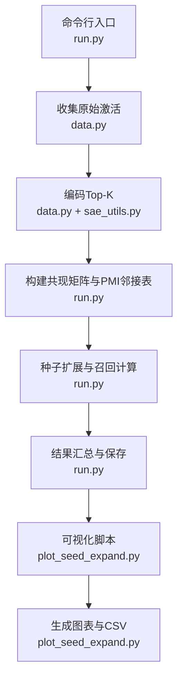
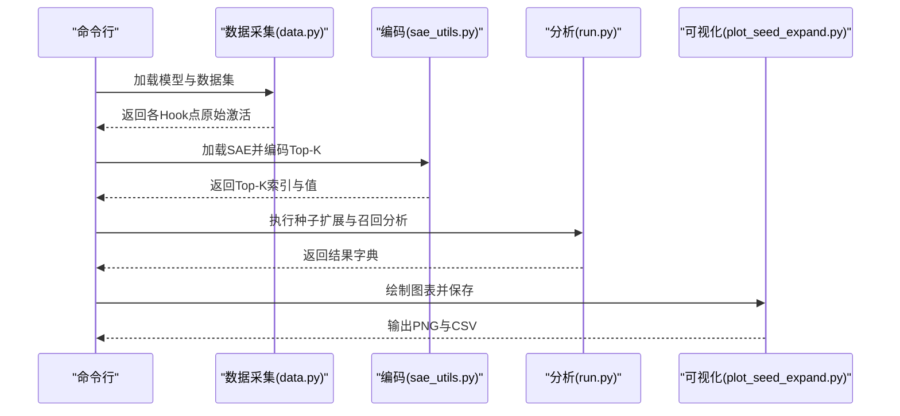
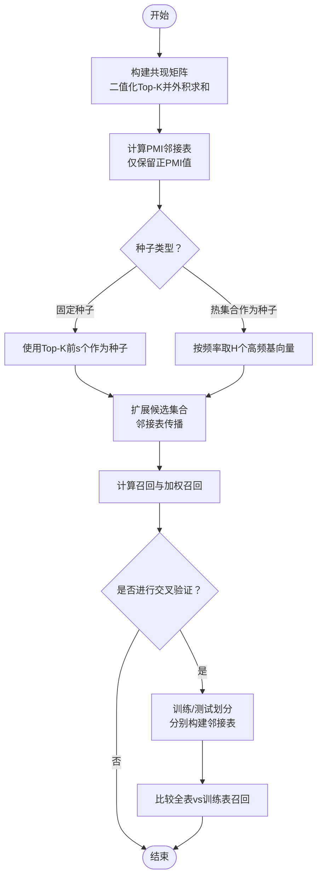
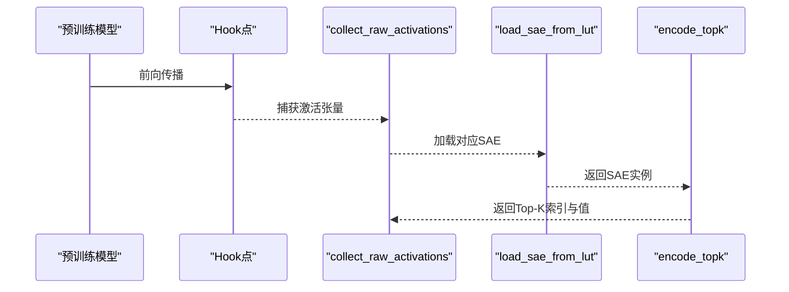
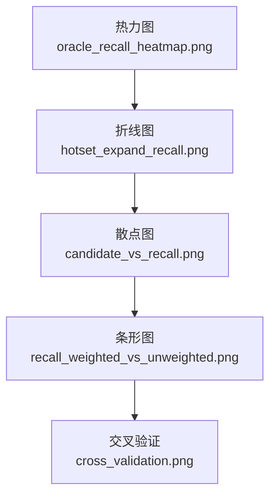
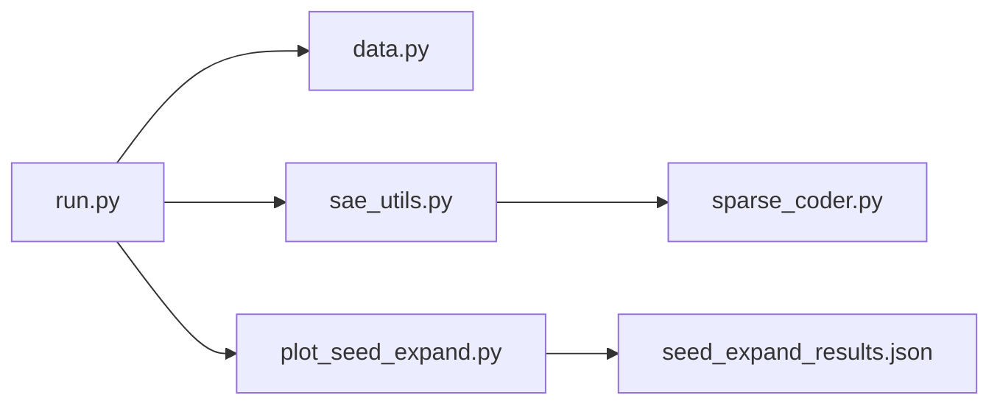

# 种子扩展实验

<cite>
**本文引用的文件列表**
- [run.py](file://experiments/activation_patterns/seed_expand/run.py)
- [run.sh](file://experiments/activation_patterns/seed_expand/run.sh)
- [plot_seed_expand.py](file://experiments/activation_patterns/plot_seed_expand.py)
- [seed_expand_results.json](file://results/activation_patterns/seed_expand/seed_expand_results.json)
- [data.py](file://experiments/common/data.py)
- [sae_utils.py](file://experiments/common/sae_utils.py)
- [sparse_coder.py](file://sparsify/sparse_coder.py)
- [README.md](file://README.md)
- [hotset/run.py](file://experiments/activation_patterns/hotset/run.py)
- [incremental/run.py](file://experiments/activation_patterns/incremental/run.py)
- [sublibrary/run.py](file://experiments/activation_patterns/sublibrary/run.py)
</cite>

## 目录
1. [简介](#简介)
2. [项目结构](#项目结构)
3. [核心组件](#核心组件)
4. [架构概览](#架构概览)
5. [详细组件分析](#详细组件分析)
6. [依赖分析](#依赖分析)
7. [性能考量](#性能考量)
8. [故障排查指南](#故障排查指南)
9. [结论](#结论)
10. [附录](#附录)

## 简介
本实验围绕“种子扩展”机制展开，目标是从初始种子集合出发，逐步扩展激活集合，以逼近真实Top-K激活。该机制基于共现统计与PMI邻接表，衡量在不同种子规模与邻居数量下的召回表现，同时评估候选集合大小与加权召回之间的权衡。实验还提供热集合作为对照（C1h上界），并与增量选择（C1e上界）、条件子库（C1c/A2b上界）等其他激活模式进行对比，帮助理解稀疏自编码器在不同激活模式下的性能差异与收敛特性。

## 项目结构
种子扩展实验位于 experiments/activation_patterns/seed_expand 目录，配套有可视化脚本与结果文件。整体流程分为三步：
- 收集原始激活（来自多个Hook点）
- 编码为Top-K索引与值
- 基于PMI邻接表进行种子扩展与召回分析

图示来源
- [run.py:476-604](file://experiments/activation_patterns/seed_expand/run.py#L476-L604)
- [data.py:44-156](file://experiments/common/data.py#L44-L156)
- [sae_utils.py:15-124](file://experiments/common/sae_utils.py#L15-L124)
- [plot_seed_expand.py:376-399](file://experiments/activation_patterns/plot_seed_expand.py#L376-L399)

章节来源
- [run.py:1-604](file://experiments/activation_patterns/seed_expand/run.py#L1-L604)
- [run.sh:1-43](file://experiments/activation_patterns/seed_expand/run.sh#L1-L43)
- [README.md:1-154](file://README.md#L1-L154)

## 核心组件
- 种子扩展分析主函数：负责构建共现矩阵、计算PMI邻接表、执行种子扩展与召回统计，并进行交叉验证稳定性评估。
- 可视化脚本：生成热力图、折线图、散点图与柱状图，直观展示不同配置下的召回与候选比例关系。
- 结果文件：包含每层、每算子的召回均值、分位数、候选比例、加权召回等指标，便于横向比较。

章节来源
- [run.py:245-425](file://experiments/activation_patterns/seed_expand/run.py#L245-L425)
- [plot_seed_expand.py:61-394](file://experiments/activation_patterns/plot_seed_expand.py#L61-L394)
- [seed_expand_results.json:1-1855](file://results/activation_patterns/seed_expand/seed_expand_results.json#L1-L1855)

## 架构概览
种子扩展实验采用“数据采集—编码—分析—可视化”的流水线式架构。数据采集阶段通过Hook点收集多层Transformer的激活；编码阶段利用SAE将激活映射为Top-K索引与值；分析阶段基于PMI邻接表进行种子扩展与召回度量；最后由可视化脚本生成图表并输出CSV。

图示来源
- [run.py:523-567](file://experiments/activation_patterns/seed_expand/run.py#L523-L567)
- [data.py:44-156](file://experiments/common/data.py#L44-L156)
- [sae_utils.py:19-271](file://experiments/common/sae_utils.py#L19-L271)
- [plot_seed_expand.py:376-399](file://experiments/activation_patterns/plot_seed_expand.py#L376-L399)

## 详细组件分析

### 种子扩展算法与实现
- 共现矩阵构建：对每个Token的Top-K索引进行二值化后做外积求和，得到(N,N)共现矩阵，并将对角清零。
- PMI邻接表：基于共现矩阵与频率向量计算PMI，仅保留正PMI值，按行提取每个基向量的Top-N邻接。
- 种子扩展与召回：以种子集合为起点，通过邻接表扩展候选集合，统计命中真实Top-K的比例与加权比例；支持GPU加速的scatter/gather操作。
- 热集合作为种子：先统计全局频率，选取高频H个基向量作为种子，再进行扩展与召回。
- 交叉验证：将数据集随机分为两半，分别构建邻接表，评估全表与训练表在测试集上的召回差异。

图示来源
- [run.py:36-131](file://experiments/activation_patterns/seed_expand/run.py#L36-L131)
- [run.py:133-242](file://experiments/activation_patterns/seed_expand/run.py#L133-L242)
- [run.py:245-425](file://experiments/activation_patterns/seed_expand/run.py#L245-L425)

章节来源
- [run.py:36-131](file://experiments/activation_patterns/seed_expand/run.py#L36-L131)
- [run.py:133-242](file://experiments/activation_patterns/seed_expand/run.py#L133-L242)
- [run.py:245-425](file://experiments/activation_patterns/seed_expand/run.py#L245-L425)

### 数据采集与编码
- 数据采集：通过Hook注册在多个Transformer层的指定模块上，一次性前向遍历所有样本，收集激活张量与序列边界。
- 编码：加载对应LUT中的SAE，对每个序列分块编码，返回Top-K索引与值，以及序列边界、K与N等元信息。

图示来源
- [data.py:44-156](file://experiments/common/data.py#L44-L156)
- [sae_utils.py:15-124](file://experiments/common/sae_utils.py#L15-L124)

章节来源
- [data.py:44-156](file://experiments/common/data.py#L44-L156)
- [sae_utils.py:15-124](file://experiments/common/sae_utils.py#L15-L124)

### 可视化与结果解读
- 热力图：展示不同种子规模与邻居数量组合下的召回热力图，便于观察s与n的交互效应。
- 折线图：热集合作为种子时，召回随邻居数量的变化趋势，标注P10区间与加权召回。
- 散点图：统一展示Oracle种子与热集合作为种子的候选比例与召回关系，便于对比。
- 条形图：加权召回与未加权召回的对比，标注候选比例。
- 交叉验证：比较全邻接表与训练邻接表在相同配置下的召回差异，评估稳定性。

图示来源
- [plot_seed_expand.py:61-394](file://experiments/activation_patterns/plot_seed_expand.py#L61-L394)

章节来源
- [plot_seed_expand.py:61-394](file://experiments/activation_patterns/plot_seed_expand.py#L61-L394)

### 与其他激活模式的对比
- 热集合作为种子（C1h上界）：固定全局高频基向量作为种子，无需邻接表，直接计算召回与加权召回，体现“静态热点”的上限。
- 增量选择（C1e上界）：模拟相邻Token间的增量更新，保留上一时刻的部分激活并oracle替换缺失部分，评估时间连续性下的性能。
- 条件子库（C1c/A2b上界）：按Token激活模式聚类，构建每类子库，评估路由召回与跨路由召回差距。

章节来源
- [hotset/run.py:33-119](file://experiments/activation_patterns/hotset/run.py#L33-L119)
- [incremental/run.py:225-312](file://experiments/activation_patterns/incremental/run.py#L225-L312)
- [sublibrary/run.py:126-290](file://experiments/activation_patterns/sublibrary/run.py#L126-L290)

## 依赖分析
- 实验脚本依赖于公共数据与SAE工具模块，用于加载模型、数据集、Hook点与SAE。
- SAE实现提供Top-K编码能力，是种子扩展分析的基础。
- 结果文件与可视化脚本共同构成实验闭环，便于复现实验与结果解读。

图示来源
- [run.py:19-33](file://experiments/activation_patterns/seed_expand/run.py#L19-L33)
- [data.py:12-41](file://experiments/common/data.py#L12-L41)
- [sae_utils.py:15-124](file://experiments/common/sae_utils.py#L15-L124)
- [sparse_coder.py:1-269](file://sparsify/sparse_coder.py#L1-L269)
- [plot_seed_expand.py:44-48](file://experiments/activation_patterns/plot_seed_expand.py#L44-L48)
- [seed_expand_results.json:1-10](file://results/activation_patterns/seed_expand/seed_expand_results.json#L1-L10)

章节来源
- [run.py:19-33](file://experiments/activation_patterns/seed_expand/run.py#L19-L33)
- [data.py:12-41](file://experiments/common/data.py#L12-L41)
- [sae_utils.py:15-124](file://experiments/common/sae_utils.py#L15-L124)
- [sparse_coder.py:1-269](file://sparsify/sparse_coder.py#L1-L269)
- [plot_seed_expand.py:44-48](file://experiments/activation_patterns/plot_seed_expand.py#L44-L48)
- [seed_expand_results.json:1-10](file://results/activation_patterns/seed_expand/seed_expand_results.json#L1-L10)

## 性能考量
- GPU加速：共现矩阵构建与邻接表计算、扩展与召回统计均支持CUDA设备，显著提升大规模N下的运算效率。
- 内存管理：采用分块处理与显存清理，避免内存峰值过高；在CPU路径下同样采用分块指示器减少峰值内存占用。
- 复杂度分析：共现矩阵构建为O(T·K·N)，PMI邻接表为O(N^2)，扩展与召回为O(T·s·n)（s为种子数，n为邻居数），整体受N与T影响较大。

章节来源
- [run.py:36-74](file://experiments/activation_patterns/seed_expand/run.py#L36-L74)
- [run.py:133-242](file://experiments/activation_patterns/seed_expand/run.py#L133-L242)
- [run.py:280-298](file://experiments/activation_patterns/seed_expand/run.py#L280-L298)

## 故障排查指南
- 设备与CUDA：若CUDA不可用，脚本会自动回退至CPU路径；确保显存充足或适当减小批大小与分块大小。
- 数据集格式：支持Arrow、Parquet与HuggingFace数据集，确保路径正确且字段包含input_ids。
- SAE加载：确认LUT目录存在对应层的.safetensors文件与metadata.json，否则可能无法解析K值。
- 内存不足：适当降低num_samples、seq_len或batch_size；或在编码阶段减小top_mul以减少Top-K数量。
- 结果为空：检查Hook点是否正确、模型是否成功加载、数据是否截断过长。

章节来源
- [run.py:494-499](file://experiments/activation_patterns/seed_expand/run.py#L494-L499)
- [data.py:12-41](file://experiments/common/data.py#L12-L41)
- [sae_utils.py:15-57](file://experiments/common/sae_utils.py#L15-L57)

## 结论
种子扩展实验通过PMI邻接表与不同种子策略，系统评估了在不同候选规模与邻居数量下的召回表现与收敛特性。热集合作为种子在候选比例较低时即可达到较高召回，而Oracle种子则展示了邻接表在捕捉共现关系方面的潜力。结合增量选择与条件子库等其他上界，可以更全面地理解稀疏自编码器在不同激活模式下的性能边界与优化方向。

## 附录

### 实验脚本使用指南
- 运行脚本：设置模型、LUT目录、数据集路径、层数与算子类型，执行run.py生成结果。
- 可视化脚本：传入结果JSON与输出目录，生成多种图表并保存PNG与CSV。
- 快速测试：run.sh中提供了快速测试的配置示例，便于快速验证环境与参数。

章节来源
- [run.py:476-604](file://experiments/activation_patterns/seed_expand/run.py#L476-L604)
- [run.sh:1-43](file://experiments/activation_patterns/seed_expand/run.sh#L1-L43)
- [plot_seed_expand.py:376-399](file://experiments/activation_patterns/plot_seed_expand.py#L376-L399)

### 参数调优建议
- 种子规模s：从较小的s开始（如4、8），逐步增大以观察候选比例与召回的平衡。
- 邻居数量n：从较小的n开始（如8、16），逐步增大以观察召回饱和点。
- 热集比例H：通常取0.1–0.2之间，兼顾候选比例与召回。
- 设备选择：优先使用CUDA，若显存不足，可降低num_samples或seq_len。
- 分块大小：根据设备显存调整chunk_size，避免OOM。

章节来源
- [run.py:267-271](file://experiments/activation_patterns/seed_expand/run.py#L267-L271)
- [run.py:329-381](file://experiments/activation_patterns/seed_expand/run.py#L329-L381)
- [run.py:382-425](file://experiments/activation_patterns/seed_expand/run.py#L382-L425)

### 结果可视化方法
- 热力图：查看不同s与n组合下的召回分布，识别高召回区域。
- 折线图：观察热集合作为种子时召回随n变化的趋势，辅助确定最优n。
- 散点图：统一比较Oracle种子与热集合作为种子的候选比例与召回关系。
- 条形图：对比加权与未加权召回，评估质量权重的重要性。
- 交叉验证：评估邻接表稳定性，指导邻接表构建策略。

章节来源
- [plot_seed_expand.py:61-394](file://experiments/activation_patterns/plot_seed_expand.py#L61-L394)
- [seed_expand_results.json:1-1855](file://results/activation_patterns/seed_expand/seed_expand_results.json#L1-L1855)