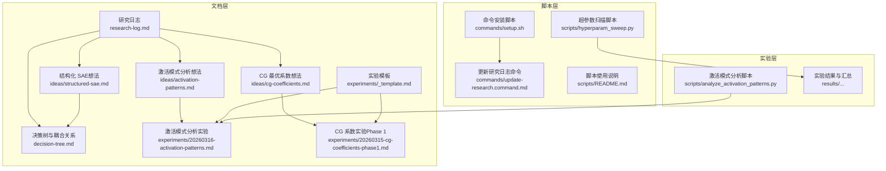
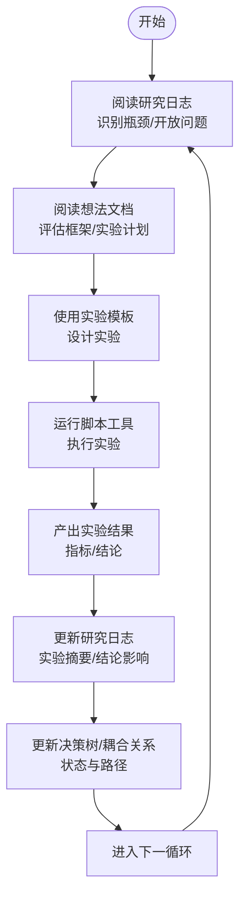
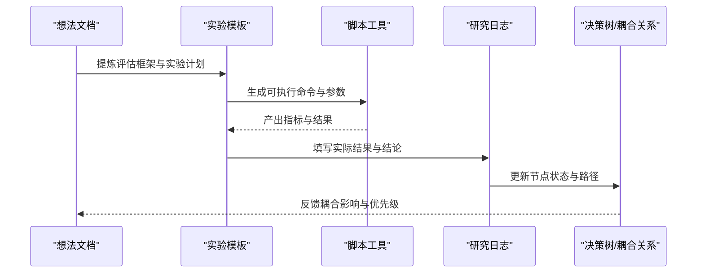
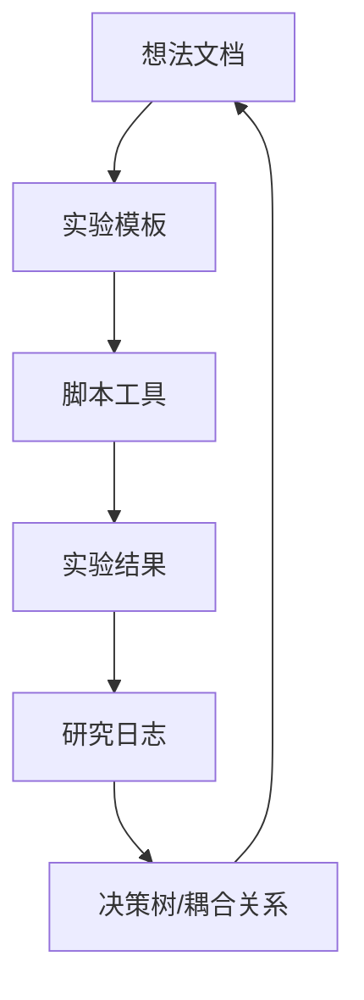

# 研究日志与想法收集

<cite>
**本文引用的文件**
- [LUTurbo 文档：研究日志](LUTurbo-doc/research-log.md)
- [LUTurbo 文档：实验模板](LUTurbo-doc/experiments/_template.md)
- [LUTurbo 文档：激活模式分析（想法）](LUTurbo-doc/ideas/activation-patterns.md)
- [LUTurbo 文档：CG 最优系数（想法）](LUTurbo-doc/ideas/cg-coefficients.md)
- [LUTurbo 文档：结构化 SAE（想法）](LUTurbo-doc/ideas/structured-sae.md)
- [LUTurbo 文档：决策树与耦合关系](LUTurbo-doc/decision-tree.md)
- [LUTurbo 文档：激活模式分析实验](LUTurbo-doc/experiments/20260316-activation-patterns.md)
- [LUTurbo 文档：CG 系数实验（Phase 1）](LUTurbo-doc/experiments/20260315-cg-coefficients-phase1.md)
- [研究命令：setup 安装脚本](LUTurbo-doc/commands/setup.sh)
- [研究命令：更新研究日志命令](LUTurbo-doc/commands/update-research.command.md)
- [脚本：超参数扫描](scripts/hyperparam_sweep.py)
- [脚本：README](scripts/README.md)
- [Sparsify 文档：README](docs/README.md)
</cite>

## 目录
1. [简介](#简介)
2. [项目结构](#项目结构)
3. [核心组件](#核心组件)
4. [架构总览](#架构总览)
5. [详细组件分析](#详细组件分析)
6. [依赖关系分析](#依赖关系分析)
7. [性能考量](#性能考量)
8. [故障排查指南](#故障排查指南)
9. [结论](#结论)
10. [附录](#附录)

## 简介
本文件面向 LUTurbo 项目的研究与实验管理，系统化梳理“研究日志”“想法收集”“实验记录”的组织方式与标准格式，并提供研究命令工具的使用与环境配置指南。文档强调从“想法到可执行实验”的转化流程，以及研究进展跟踪、问题记录与解决方案整理的最佳实践，帮助团队在 CPU 低延迟推理目标下高效推进方案设计与验证。

## 项目结构
围绕研究与实验管理，项目采用“文档 + 脚本 + 实验产物”的分层组织：
- 文档层：研究日志、想法文档、实验模板、决策树与耦合关系矩阵
- 脚本层：超参数扫描、激活模式分析、命令安装与更新
- 实验层：实验记录、结果与结论沉淀

图表来源
- [LUTurbo 文档：研究日志](LUTurbo-doc/research-log.md)
- [LUTurbo 文档：决策树与耦合关系](LUTurbo-doc/decision-tree.md)
- [LUTurbo 文档：激活模式分析（想法）](LUTurbo-doc/ideas/activation-patterns.md)
- [LUTurbo 文档：CG 最优系数（想法）](LUTurbo-doc/ideas/cg-coefficients.md)
- [LUTurbo 文档：结构化 SAE（想法）](LUTurbo-doc/ideas/structured-sae.md)
- [LUTurbo 文档：激活模式分析实验](LUTurbo-doc/experiments/20260316-activation-patterns.md)
- [LUTurbo 文档：CG 系数实验（Phase 1）](LUTurbo-doc/experiments/20260315-cg-coefficients-phase1.md)
- [研究命令：setup 安装脚本](LUTurbo-doc/commands/setup.sh)
- [研究命令：更新研究日志命令](LUTurbo-doc/commands/update-research.command.md)
- [脚本：超参数扫描](scripts/hyperparam_sweep.py)
- [脚本：README](scripts/README.md)

章节来源
- [LUTurbo 文档：研究日志](LUTurbo-doc/research-log.md)
- [LUTurbo 文档：实验模板](LUTurbo-doc/experiments/_template.md)
- [LUTurbo 文档：激活模式分析（想法）](LUTurbo-doc/ideas/activation-patterns.md)
- [LUTurbo 文档：CG 最优系数（想法）](LUTurbo-doc/ideas/cg-coefficients.md)
- [LUTurbo 文档：结构化 SAE（想法）](LUTurbo-doc/ideas/structured-sae.md)
- [LUTurbo 文档：决策树与耦合关系](LUTurbo-doc/decision-tree.md)
- [LUTurbo 文档：激活模式分析实验](LUTurbo-doc/experiments/20260316-activation-patterns.md)
- [LUTurbo 文档：CG 系数实验（Phase 1）](LUTurbo-doc/experiments/20260315-cg-coefficients-phase1.md)
- [研究命令：setup 安装脚本](LUTurbo-doc/commands/setup.sh)
- [研究命令：更新研究日志命令](LUTurbo-doc/commands/update-research.command.md)
- [脚本：超参数扫描](scripts/hyperparam_sweep.py)
- [脚本：README](scripts/README.md)

## 核心组件
- 研究日志：记录项目目标、当前方案、核心瓶颈、已探索方案、开放问题与实验记录，提供“按时间倒序”的实验摘要。
- 想法收集：以“想法文档”形式沉淀候选方案的背景、方法论、评估框架与实验计划，支撑从“想法”到“实验”的转化。
- 实验记录：以“实验模板”规范记录目标、背景、实现方案、运行方法、观测指标、预期/实际结果与结论影响。
- 决策树与耦合关系：以树形结构与耦合矩阵明确各决策点的可选方案、状态与相互影响，指导实验设计与结果解读。
- 命令工具：提供研究命令安装与更新脚本，便于在本地环境中统一接入研究文档与命令。
- 脚本工具：提供超参数扫描、激活模式分析等自动化脚本，支撑快速实验与结果汇总。

章节来源
- [LUTurbo 文档：研究日志](LUTurbo-doc/research-log.md)
- [LUTurbo 文档：实验模板](LUTurbo-doc/experiments/_template.md)
- [LUTurbo 文档：激活模式分析（想法）](LUTurbo-doc/ideas/activation-patterns.md)
- [LUTurbo 文档：CG 最优系数（想法）](LUTurbo-doc/ideas/cg-coefficients.md)
- [LUTurbo 文档：结构化 SAE（想法）](LUTurbo-doc/ideas/structured-sae.md)
- [LUTurbo 文档：决策树与耦合关系](LUTurbo-doc/decision-tree.md)
- [研究命令：setup 安装脚本](LUTurbo-doc/commands/setup.sh)
- [研究命令：更新研究日志命令](LUTurbo-doc/commands/update-research.command.md)
- [脚本：超参数扫描](scripts/hyperparam_sweep.py)
- [脚本：README](scripts/README.md)

## 架构总览
研究与实验管理的总体流程如下：
- 从“研究日志”识别瓶颈与开放问题
- 以“想法文档”提出候选方案与评估框架
- 用“实验模板”设计可执行实验
- 通过“脚本工具”执行实验并产出结果
- 在“研究日志”中沉淀实验记录与结论
- 用“决策树与耦合关系”更新状态与路径

图表来源
- [LUTurbo 文档：研究日志](LUTurbo-doc/research-log.md)
- [LUTurbo 文档：实验模板](LUTurbo-doc/experiments/_template.md)
- [LUTurbo 文档：激活模式分析（想法）](LUTurbo-doc/ideas/activation-patterns.md)
- [LUTurbo 文档：CG 最优系数（想法）](LUTurbo-doc/ideas/cg-coefficients.md)
- [LUTurbo 文档：结构化 SAE（想法）](LUTurbo-doc/ideas/structured-sae.md)
- [LUTurbo 文档：决策树与耦合关系](LUTurbo-doc/decision-tree.md)
- [脚本：超参数扫描](scripts/hyperparam_sweep.py)

## 详细组件分析

### 研究日志：记录格式与更新频率
- 记录格式
  - 项目概述：目标、核心思路、关键假设、论文标题
  - 当前方案：基向量分解、SAE 构建、在线补偿、完整推理 Pipeline、关键参数与约束
  - 核心瓶颈：基向量选择开销、SAE 重构精度
  - 已探索方案：ANNS 加速、直接使用 SAE 编码器、其他方向
  - 开放问题与探索方向：针对瓶颈的若干问题清单
  - 实验记录：按时间倒序，包含日期、方法、结果、结论
- 更新频率
  - 建议在每次实验完成后及时更新“实验记录”，并在“开放问题与探索方向”中补充新发现
  - 每轮迭代结束后回顾“核心瓶颈”与“已探索方案”，调整优先级与实验计划

章节来源
- [LUTurbo 文档：研究日志](LUTurbo-doc/research-log.md)

### 想法收集系统：组织结构与分类方法
- 组织结构
  - 以“想法文档”为单位，围绕单一主题（如“激活模式分析”“CG 最优系数”“结构化 SAE”）展开
  - 每个想法文档包含：核心想法、分析维度与 Oracle 基线、统一评估框架、数据采集注意事项、与其他方向的关系、补充分析、实验计划
- 分类方法
  - 以“决策树节点”为分类依据，如 C1（选择算法）、C2（系数）、B（基向量库）、D（精度保证）
  - 通过“耦合关系矩阵”明确各方向之间的相互影响与杠杆路径

章节来源
- [LUTurbo 文档：激活模式分析（想法）](LUTurbo-doc/ideas/activation-patterns.md)
- [LUTurbo 文档：CG 最优系数（想法）](LUTurbo-doc/ideas/cg-coefficients.md)
- [LUTurbo 文档：结构化 SAE（想法）](LUTurbo-doc/ideas/structured-sae.md)
- [LUTurbo 文档：决策树与耦合关系](LUTurbo-doc/decision-tree.md)

### 实验记录：标准格式与关键信息要素
- 标准格式
  - 目标：一句话说明本次实验要验证的假设
  - 背景：从相关想法文档中提炼与本次实验直接相关的上下文
  - 实现方案：需要修改的文件、核心代码逻辑、关键实现细节
  - 运行方法：具体命令、参数配置、数据集选择
  - 观测指标：列出需要记录的指标及其含义
  - 预期结果：成功/失败的判定标准（定量）
  - 实际结果：实验完成后填写
  - 结论与影响：对决策树节点状态的影响、下一步建议
- 关键信息要素
  - 指标阈值与判定标准（如 recall、new-mass ratio、replacement_count_P90/P99、cross-validation gap 等）
  - 层间对比与算子差异（如 o_proj 与 mlp/qkv 的差异）
  - decode/prefill 阶段的区分与 proxy 说明

章节来源
- [LUTurbo 文档：实验模板](LUTurbo-doc/experiments/_template.md)
- [LUTurbo 文档：激活模式分析实验](LUTurbo-doc/experiments/20260316-activation-patterns.md)
- [LUTurbo 文档：CG 系数实验（Phase 1）](LUTurbo-doc/experiments/20260315-cg-coefficients-phase1.md)

### 从想法到可执行实验的转化流程

图表来源
- [LUTurbo 文档：激活模式分析（想法）](LUTurbo-doc/ideas/activation-patterns.md)
- [LUTurbo 文档：实验模板](LUTurbo-doc/experiments/_template.md)
- [脚本：超参数扫描](scripts/hyperparam_sweep.py)
- [LUTurbo 文档：研究日志](LUTurbo-doc/research-log.md)
- [LUTurbo 文档：决策树与耦合关系](LUTurbo-doc/decision-tree.md)

### 研究命令工具：使用指南与环境配置
- 命令安装
  - 使用安装脚本将命令文档符号链接到本地命令目录，便于统一接入与管理
- 环境配置
  - 确保项目根目录可执行安装脚本
  - 在本地环境中安装必要的依赖（如 Python、WandB、PyTorch 等）
- 常用命令
  - 更新研究日志命令：通过命令文档触发更新流程
  - 超参数扫描：使用脚本进行 SAE 超参数网格搜索，支持干跑、失败继续、GPU 数量等选项

章节来源
- [研究命令：setup 安装脚本](LUTurbo-doc/commands/setup.sh)
- [研究命令：更新研究日志命令](LUTurbo-doc/commands/update-research.command.md)
- [脚本：README](scripts/README.md)

## 依赖关系分析
- 文档与脚本的耦合
  - 想法文档与实验模板共同指导脚本工具的使用与结果解读
  - 决策树与耦合关系矩阵为实验设计提供约束与优先级
- 实验与结果的闭环
  - 实验产出指标与结论反馈到研究日志与决策树，推动下一轮迭代

图表来源
- [LUTurbo 文档：激活模式分析（想法）](LUTurbo-doc/ideas/activation-patterns.md)
- [LUTurbo 文档：实验模板](LUTurbo-doc/experiments/_template.md)
- [脚本：超参数扫描](scripts/hyperparam_sweep.py)
- [LUTurbo 文档：研究日志](LUTurbo-doc/research-log.md)
- [LUTurbo 文档：决策树与耦合关系](LUTurbo-doc/decision-tree.md)

## 性能考量
- 选择开销与访存量
  - 在 memory-bound 假设下，选择步骤的访存量必须低于原始 matmul 的访存量预算，否则无法获得性能提升
  - 通过“统一评估框架”（候选集大小 vs recall）量化不同方案的性价比
- 系数计算与补偿
  - CG 系数在当前 SAE 上有稳定精度收益，但额外在线计算可能抵消 p 的微小降低
  - 结构化 SAE 通过引入分组约束，有望同时降低 C1 选择开销与 D 精度保证成本
- 实验效率
  - 使用脚本工具进行网格搜索与批量实验，结合 WandB 实时监控与对比，缩短迭代周期

[本节为一般性讨论，不直接分析具体文件]

## 故障排查指南
- CUDA OOM
  - 通过减少 batch size 或增加 gradient accumulation 步数缓解
- 端口冲突
  - 脚本会自动递增端口，若仍有冲突，可调整起始端口
- 数据加载慢
  - 增加数据预处理进程数以提升吞吐
- 实验中断与恢复
  - Python 脚本支持失败后继续；Shell 脚本提供交互式继续选项
  - 可手动编辑参数配置，移除已完成的组合

章节来源
- [脚本：README](scripts/README.md)

## 结论
通过规范化的研究日志、想法收集、实验记录与命令工具，LUTurbo 项目能够系统化推进从“问题识别”到“实验验证”的闭环。建议持续：
- 在每次实验后更新研究日志与决策树
- 以“统一评估框架”衡量不同方案的性价比
- 优先验证高杠杆路径（如结构化 SAE、条件分解），并用脚本工具加速迭代

[本节为总结性内容，不直接分析具体文件]

## 附录
- 相关文档与脚本的快速定位
  - 研究日志与想法：[研究日志](LUTurbo-doc/research-log.md)、[激活模式分析（想法）](LUTurbo-doc/ideas/activation-patterns.md)、[CG 最优系数（想法）](LUTurbo-doc/ideas/cg-coefficients.md)、[结构化 SAE（想法）](LUTurbo-doc/ideas/structured-sae.md)
  - 实验模板与记录：[实验模板](LUTurbo-doc/experiments/_template.md)、[激活模式分析实验](LUTurbo-doc/experiments/20260316-activation-patterns.md)、[CG 系数实验（Phase 1）](LUTurbo-doc/experiments/20260315-cg-coefficients-phase1.md)
  - 命令与脚本：[命令安装脚本](LUTurbo-doc/commands/setup.sh)、[更新研究日志命令](LUTurbo-doc/commands/update-research.command.md)、[超参数扫描脚本](scripts/hyperparam_sweep.py)、[脚本使用说明](scripts/README.md)

[本节为附录性内容，不直接分析具体文件]