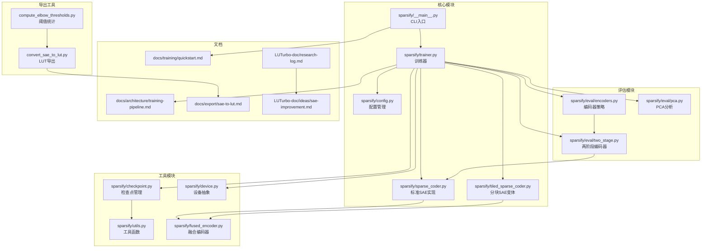
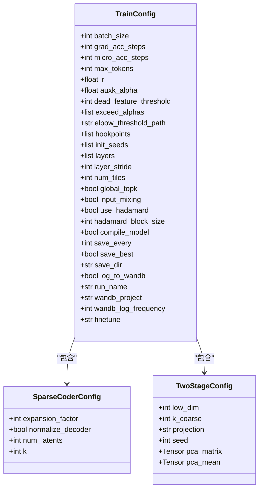
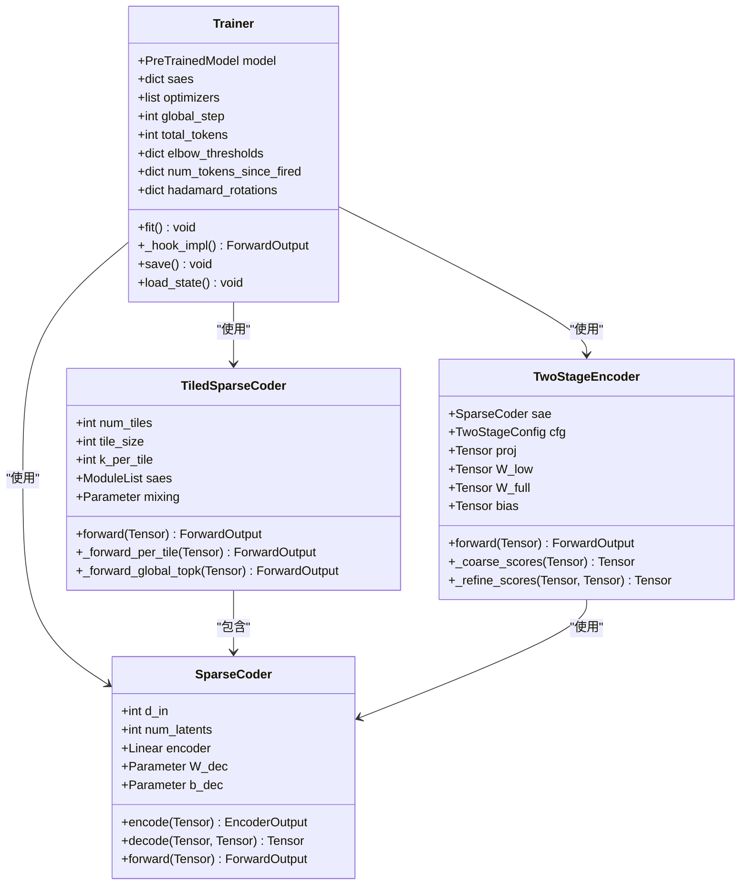
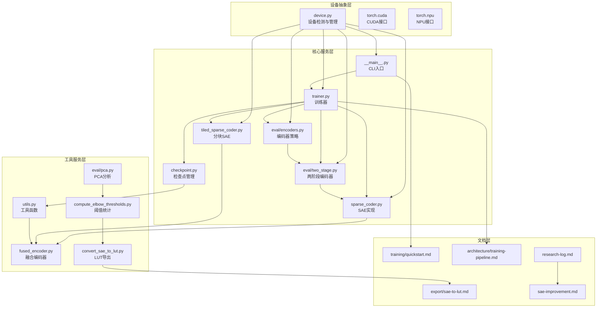
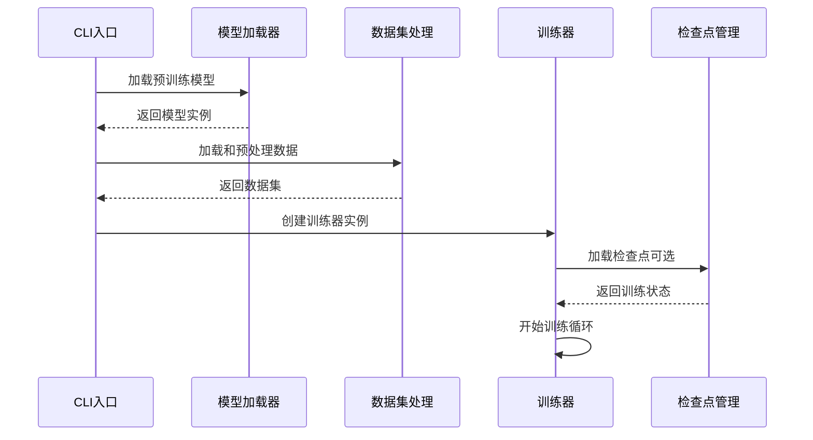
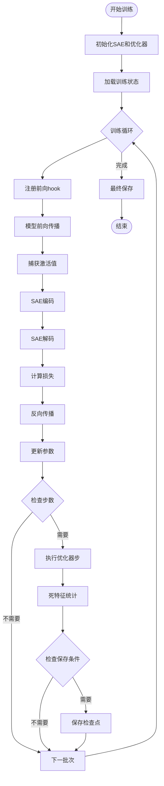
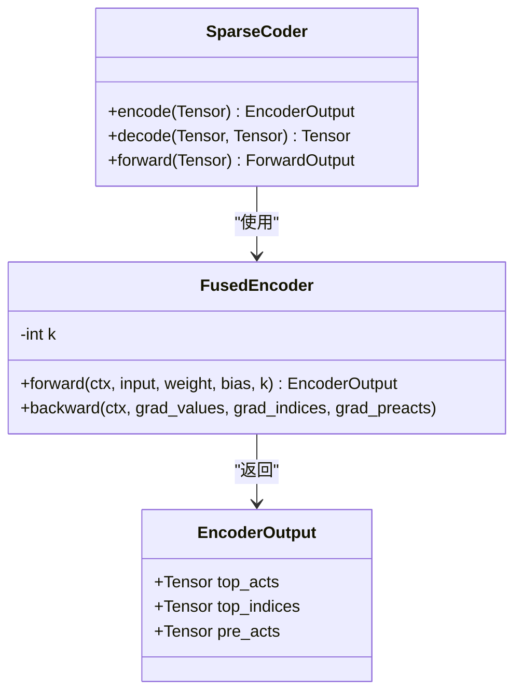
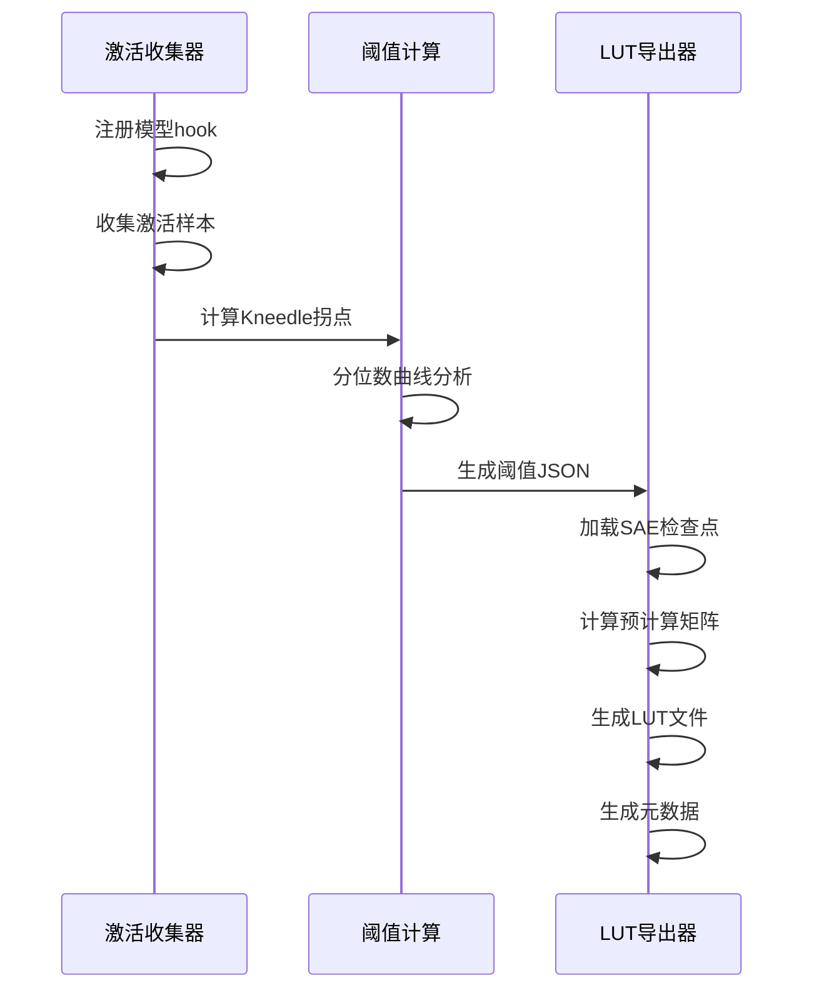
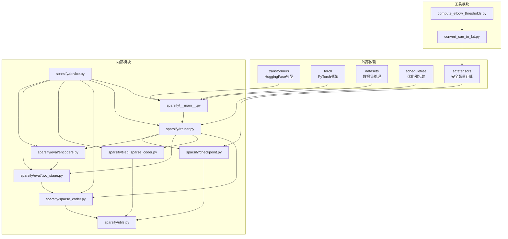

# SAE改进统一系统

<cite>
**本文档引用的文件**
- [README.md](file://README.md)
- [sparsify/__main__.py](file://sparsify/__main__.py)
- [sparsify/config.py](file://sparsify/config.py)
- [sparsify/trainer.py](file://sparsify/trainer.py)
- [sparsify/sparse_coder.py](file://sparsify/sparse_coder.py)
- [sparsify/tiled_sparse_coder.py](file://sparsify/tiled_sparse_coder.py)
- [sparsify/fused_encoder.py](file://sparsify/fused_encoder.py)
- [sparsify/checkpoint.py](file://sparsify/checkpoint.py)
- [sparsify/utils.py](file://sparsify/utils.py)
- [sparsify/device.py](file://sparsify/device.py)
- [sparsify/eval/two_stage.py](file://sparsify/eval/two_stage.py)
- [sparsify/eval/encoders.py](file://sparsify/eval/encoders.py)
- [compute_elbow_thresholds.py](file://compute_elbow_thresholds.py)
- [convert_sae_to_lut.py](file://convert_sae_to_lut.py)
- [docs/training/quickstart.md](file://docs/training/quickstart.md)
- [docs/architecture/training-pipeline.md](file://docs/architecture/training-pipeline.md)
- [docs/export/sae-to-lut.md](file://docs/export/sae-to-lut.md)
- [LUTurbo-doc/research-log.md](file://LUTurbo-doc/research-log.md)
- [LUTurbo-doc/ideas/sae-improvement.md](file://LUTurbo-doc/ideas/sae-improvement.md)
</cite>

## 目录
1. [简介](#简介)
2. [项目结构](#项目结构)
3. [核心组件](#核心组件)
4. [架构概览](#架构概览)
5. [详细组件分析](#详细组件分析)
6. [依赖关系分析](#依赖关系分析)
7. [性能考虑](#性能考虑)
8. [故障排除指南](#故障排除指南)
9. [结论](#结论)

## 简介

SAE改进统一系统是LUTurbo的稀疏自编码器（SAE）训练与导出模块，专门负责在Transformer模块输入上训练SAE、生成阈值统计，并导出面向LUT的产物供下游LUTurbo推理使用。

### 主要特性

- **在线训练**：通过前向hook实时捕获Transformer激活值并训练SAE
- **多平台支持**：NVIDIA/CUDA作为主运行平台，Ascend/NPU保留兼容性路径
- **灵活配置**：支持Top-K稀疏激活、AuxK死特征恢复、分块SAE等高级功能
- **完整工作流**：从训练到导出的端到端解决方案
- **两阶段编码器**：支持两阶段选择算法，提升激活选择效率

### 项目定位

- **主要平台**：NVIDIA/CUDA（推荐）
- **兼容平台**：Ascend/NPU（历史参考）
- **功能范围**：专注于SAE训练与LUT导出，不包含完整的LUTurbo推理运行时

## 项目结构



**图表来源**
- [sparsify/__main__.py:1-211](file://sparsify/__main__.py#L1-L211)
- [sparsify/trainer.py:1-760](file://sparsify/trainer.py#L1-L760)
- [sparsify/config.py:1-149](file://sparsify/config.py#L1-L149)
- [sparsify/eval/two_stage.py:1-132](file://sparsify/eval/two_stage.py#L1-L132)
- [sparsify/eval/encoders.py:1-71](file://sparsify/eval/encoders.py#L1-L71)

**章节来源**
- [README.md:1-153](file://README.md#L1-L153)
- [sparsify/__main__.py:71-79](file://sparsify/__main__.py#L71-L79)

## 核心组件

### 训练配置系统

系统采用统一的配置管理机制，支持多种训练参数的灵活配置：



**图表来源**
- [sparsify/config.py:28-149](file://sparsify/config.py#L28-L149)
- [sparsify/eval/two_stage.py:10-17](file://sparsify/eval/two_stage.py#L10-L17)

### 训练器架构

训练器采用模块化设计，支持多种SAE变体和高级功能：



**图表来源**
- [sparsify/trainer.py:39-760](file://sparsify/trainer.py#L39-L760)
- [sparsify/sparse_coder.py:36-269](file://sparsify/sparse_coder.py#L36-L269)
- [sparsify/tiled_sparse_coder.py:17-342](file://sparsify/tiled_sparse_coder.py#L17-L342)
- [sparsify/eval/two_stage.py:20-132](file://sparsify/eval/two_stage.py#L20-L132)

**章节来源**
- [sparsify/config.py:1-149](file://sparsify/config.py#L1-L149)
- [sparsify/trainer.py:1-760](file://sparsify/trainer.py#L1-L760)

## 架构概览

系统采用三层架构设计，从底层设备抽象到上层业务逻辑形成清晰的层次结构：



**图表来源**
- [sparsify/device.py:1-118](file://sparsify/device.py#L1-L118)
- [sparsify/__main__.py:1-211](file://sparsify/__main__.py#L1-L211)
- [sparsify/trainer.py:1-760](file://sparsify/trainer.py#L1-L760)
- [sparsify/eval/two_stage.py:1-132](file://sparsify/eval/two_stage.py#L1-L132)
- [sparsify/eval/encoders.py:1-71](file://sparsify/eval/encoders.py#L1-L71)

## 详细组件分析

### CLI入口与数据处理

CLI入口负责整个训练流程的协调，包括模型加载、数据预处理和分布式训练初始化：



**图表来源**
- [sparsify/__main__.py:81-129](file://sparsify/__main__.py#L81-L129)
- [sparsify/__main__.py:131-211](file://sparsify/__main__.py#L131-L211)

### 训练流程控制

训练器采用在线训练策略，在Transformer前向过程中实时捕获激活并更新SAE：



**图表来源**
- [sparsify/trainer.py:162-729](file://sparsify/trainer.py#L162-L729)

### SAE编码器优化

系统实现了高效的融合编码器，通过自定义autograd函数优化Top-K选择的反向传播：



**图表来源**
- [sparsify/fused_encoder.py:21-107](file://sparsify/fused_encoder.py#L21-L107)
- [sparsify/sparse_coder.py:176-239](file://sparsify/sparse_coder.py#L176-L239)

### 两阶段编码器架构

系统实现了两阶段编码器架构，通过低维投影和粗选-精选策略提升激活选择效率：

```mermaid
graph LR
subgraph "两阶段编码器"
A[输入 x<br/>[N, D]]
B[中心化处理<br/>x - b_dec]
C[低维投影<br/>x_low = P @ x 或 x_low = x[:, :low_dim]]
D[粗选阶段<br/>scores = x_low @ W_low^T + bias]
E[Top-K粗选<br/>candidates = topk(scores, k_coarse)]
F[精选阶段<br/>scores_refine = x @ W_full[candidates]^T + bias[candidates]]
G[Top-K精选<br/>top_acts, top_pos = topk(scores_refine, k)]
H[最终索引<br/>top_indices = candidates[top_pos]]
I[SAE解码<br/>y = decode(top_acts, top_indices)]
end
A --> B --> C --> D --> E --> F --> G --> H --> I
```

**图表来源**
- [sparsify/eval/two_stage.py:105-131](file://sparsify/eval/two_stage.py#L105-L131)

**章节来源**
- [sparsify/__main__.py:1-211](file://sparsify/__main__.py#L1-L211)
- [sparsify/trainer.py:1-760](file://sparsify/trainer.py#L1-L760)
- [sparsify/fused_encoder.py:1-107](file://sparsify/fused_encoder.py#L1-L107)
- [sparsify/eval/two_stage.py:1-132](file://sparsify/eval/two_stage.py#L1-L132)

### 分块SAE实现

分块SAE通过将输入激活分割为独立的SAE进行训练，支持全局Top-K选择和输入混合：

```mermaid
graph LR
subgraph "输入处理"
A[原始输入 X<br/>[N, D]]
B[分块操作<br/>chunk(num_tiles)]
C[X₁, X₂, ..., Xₜ<br/>[N, D/T] × T]
end
subgraph "独立SAE"
D[SAE₁<br/>编码器W₁, 解码器D₁]
E[SAE₂<br/>编码器W₂, 解码器D₂]
F[SAEₜ<br/>编码器Wₜ, 解码器Dₜ]
end
subgraph "输出合并"
G[Y₁, Y₂, ..., Yₜ<br/>[N, D/T] × T]
H[拼接操作<br/>cat(dim=-1)]
I[输出 Y<br/>[N, D]]
end
A --> B --> C
C --> D
C --> E
C --> F
D --> G
E --> G
F --> G
G --> H --> I
```

**图表来源**
- [sparsify/tiled_sparse_coder.py:17-342](file://sparsify/tiled_sparse_coder.py#L17-L342)

**章节来源**
- [sparsify/tiled_sparse_coder.py:1-342](file://sparsify/tiled_sparse_coder.py#L1-L342)

### 阈值统计与LUT导出

系统提供了完整的阈值统计和LUT导出工具链：



**图表来源**
- [compute_elbow_thresholds.py:202-362](file://compute_elbow_thresholds.py#L202-L362)
- [convert_sae_to_lut.py:419-558](file://convert_sae_to_lut.py#L419-L558)

**章节来源**
- [compute_elbow_thresholds.py:1-660](file://compute_elbow_thresholds.py#L1-L660)
- [convert_sae_to_lut.py:1-783](file://convert_sae_to_lut.py#L1-L783)

## 依赖关系分析

系统采用松耦合的设计，各模块间通过清晰的接口进行交互：



**图表来源**
- [sparsify/__main__.py:11-26](file://sparsify/__main__.py#L11-L26)
- [sparsify/trainer.py:14-34](file://sparsify/trainer.py#L14-L34)

**章节来源**
- [sparsify/__main__.py:1-211](file://sparsify/__main__.py#L1-L211)
- [sparsify/trainer.py:1-760](file://sparsify/trainer.py#L1-L760)

## 性能考虑

### 训练性能优化

系统实现了多项性能优化技术：

1. **融合编码器**：通过自定义autograd函数优化Top-K选择的反向传播
2. **两阶段编码器**：通过低维投影和粗选-精选策略减少激活选择开销
3. **部分前向优化**：仅计算必要的Transformer层，减少无关计算
4. **异步指标计算**：延迟指标计算，减少同步开销
5. **批量梯度累积**：支持微批次累积，提高内存效率

### 内存管理

- **分块SAE**：通过输入分块减少单次计算的内存需求
- **混合精度训练**：自动使用bf16/float16提高计算效率
- **渐进式检查点**：定期保存中间状态，支持断点续训
- **两阶段编码器内存优化**：通过低维投影减少中间表示内存占用

### 分布式训练

- **DDP支持**：原生支持多GPU分布式训练
- **梯度同步**：智能梯度同步策略，减少通信开销
- **负载均衡**：自动平衡不同GPU的工作负载

## 故障排除指南

### 常见问题诊断

#### 设备相关问题

**问题**：CUDA设备不可用
**解决方案**：
- 检查CUDA驱动版本兼容性
- 验证GPU内存充足
- 确认torch.cuda.is_available()返回True

**问题**：NPU设备初始化失败
**解决方案**：
- 确认torch_npu安装正确
- 检查Ascend驱动版本
- 验证设备权限设置

#### 训练相关问题

**问题**：内存不足导致训练中断
**解决方案**：
- 减少batch_size或grad_acc_steps
- 启用分块SAE (num_tiles > 1)
- 使用更小的k值
- 启用混合精度训练
- 使用两阶段编码器降低内存占用

**问题**：梯度消失或爆炸
**解决方案**：
- 调整学习率或使用自适应LR
- 检查权重初始化
- 启用梯度裁剪
- 验证网络深度和架构

#### 检查点相关问题

**问题**：检查点加载失败
**解决方案**：
- 确认检查点文件完整性
- 验证配置一致性
- 检查设备兼容性
- 清理损坏的检查点文件

#### 两阶段编码器问题

**问题**：两阶段编码器性能不如预期
**解决方案**：
- 检查low_dim设置是否合理
- 验证k_coarse是否大于等于k
- 确认投影类型配置正确
- 检查PCA矩阵维度匹配

**章节来源**
- [sparsify/device.py:1-118](file://sparsify/device.py#L1-L118)
- [sparsify/checkpoint.py:149-198](file://sparsify/checkpoint.py#L149-L198)
- [sparsify/eval/two_stage.py:21-31](file://sparsify/eval/two_stage.py#L21-L31)

## 结论

SAE改进统一系统是一个设计精良的稀疏自编码器训练与导出框架，具有以下特点：

### 技术优势

1. **模块化设计**：清晰的组件分离和接口定义
2. **性能优化**：多项技术创新提升训练效率
3. **两阶段编码器**：通过低维投影和粗选-精选策略显著提升激活选择效率
4. **平台兼容**：支持CUDA和NPU双平台
5. **工具完备**：从训练到导出的完整工具链

### 应用价值

- **研究用途**：为SAE研究提供高效训练平台
- **工业应用**：支持大规模模型的稀疏激活
- **推理加速**：通过LUT导出实现推理加速
- **成本优化**：减少模型存储和计算需求

### 发展方向

1. **扩展支持**：增加更多硬件平台支持
2. **功能增强**：引入更多SAE变体和训练技巧
3. **性能优化**：持续改进训练和推理性能
4. **易用性提升**：简化配置和使用流程
5. **算法改进**：基于研究日志中的算法比较结果，持续优化选择算法

该系统为SAE技术的实际应用提供了坚实的技术基础，是连接理论研究与实际部署的重要桥梁。

**更新摘要**
- 新增两阶段编码器架构，通过低维投影和粗选-精选策略提升激活选择效率
- 移除LowRankSparseCoder支持，统一为标准SparseCoder接口
- 更新算法比较部分，从Oracle贪心选择更新为OMP(正交匹配追踪)作为首选基线方法
- 增强两阶段编码器的权重矩阵处理逻辑，简化了计算流程
- 完善研究日志文档，反映最新的算法改进和实验结果