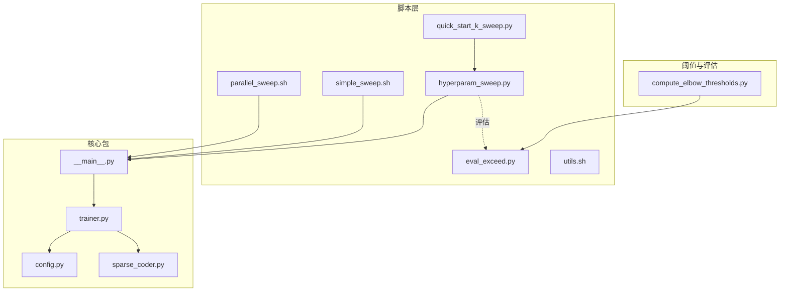
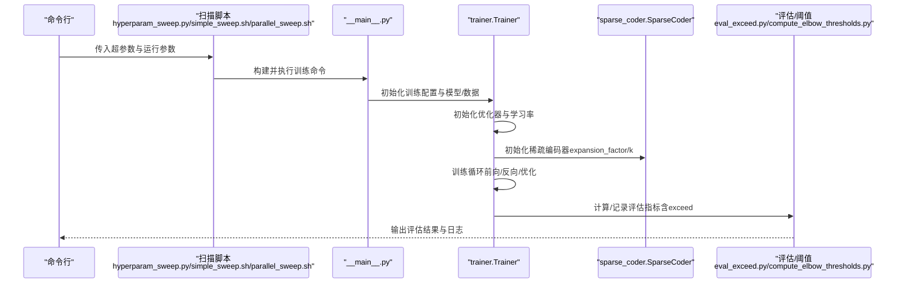
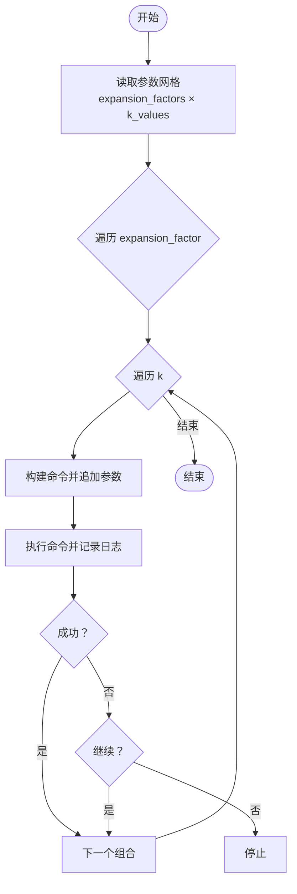
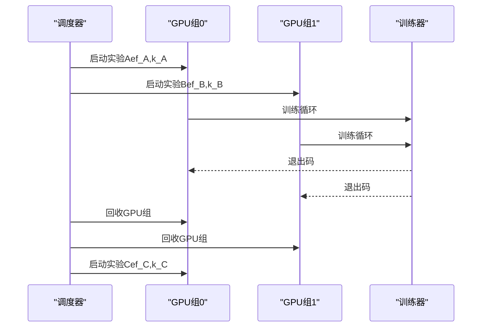
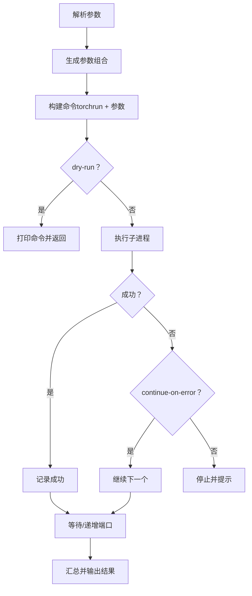
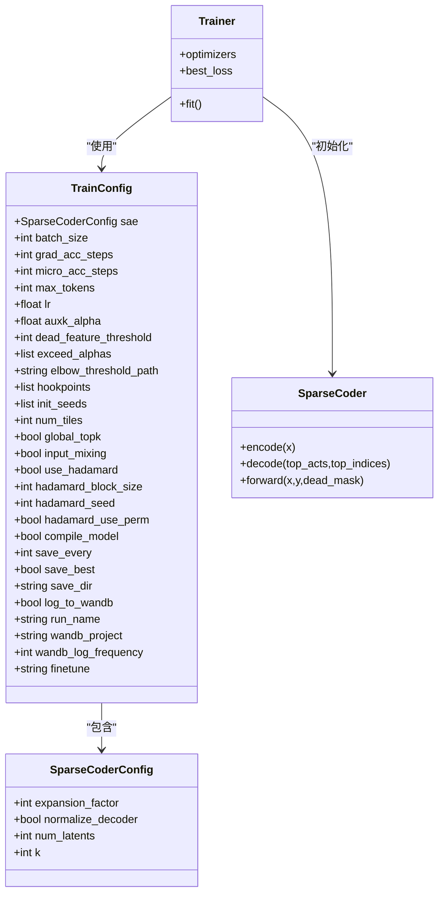
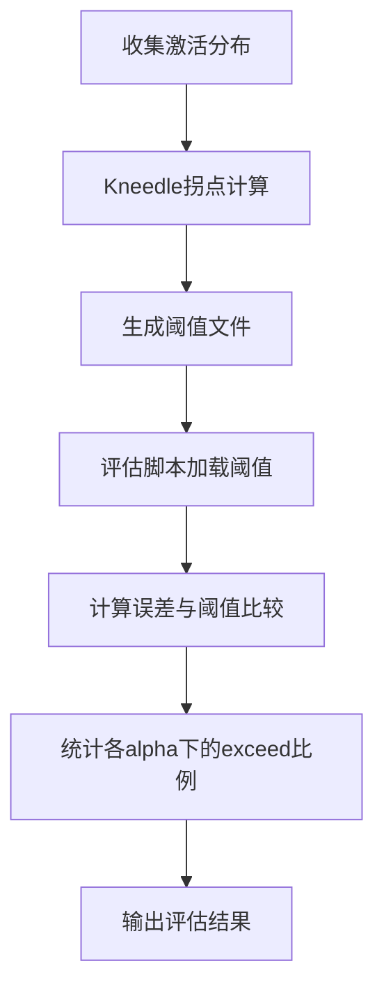
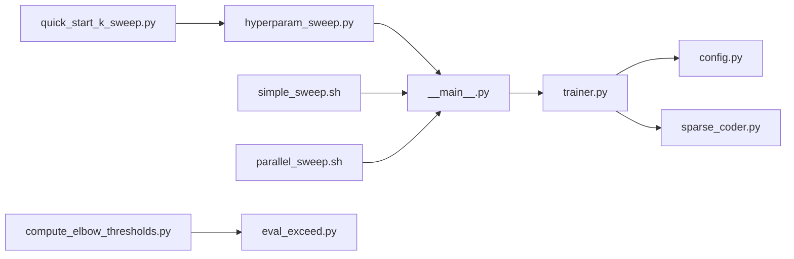

# 超参数调优

<cite>
**本文引用的文件**
- [hyperparam_sweep.py](file://scripts/hyperparam_sweep.py)
- [simple_sweep.sh](file://scripts/simple_sweep.sh)
- [parallel_sweep.sh](file://scripts/parallel_sweep.sh)
- [quick_start_k_sweep.py](file://scripts/quick_start_k_sweep.py)
- [config.py](file://sparsify/config.py)
- [trainer.py](file://sparsify/trainer.py)
- [sparse_coder.py](file://sparsify/sparse_coder.py)
- [__main__.py](file://sparsify/__main__.py)
- [compute_elbow_thresholds.py](file://compute_elbow_thresholds.py)
- [eval_exceed.py](file://scripts/eval_exceed.py)
- [utils.sh](file://scripts/utils.sh)
</cite>

## 目录
1. [简介](#简介)
2. [项目结构](#项目结构)
3. [核心组件](#核心组件)
4. [架构总览](#架构总览)
5. [详细组件分析](#详细组件分析)
6. [依赖关系分析](#依赖关系分析)
7. [性能考量](#性能考量)
8. [故障排查指南](#故障排查指南)
9. [结论](#结论)
10. [附录](#附录)

## 简介
本指南面向需要在稀疏自编码器（SAE）训练中进行系统化超参数调优的研究者与工程师。内容覆盖：
- 学习率搜索与调度策略
- 稀疏度参数（k 与 expansion_factor）优化
- 批大小与梯度累积的调优
- 简单扫描（simple_sweep）与并行扫描（parallel_sweep）的实现原理与使用场景
- 快速启动 K 值扫描工具的使用方法
- 超参数空间定义、搜索策略选择与结果评估标准
- 不同超参数对训练性能与收敛行为的影响
- 自动化调优流程与最佳实践建议

## 项目结构
该仓库围绕 sparsify 包构建，脚本层提供批量实验与扫描工具，核心训练逻辑集中在 sparsify 包内。与超参数调优直接相关的文件如下：
- 超参扫描与执行：scripts/hyperparam_sweep.py、scripts/simple_sweep.sh、scripts/parallel_sweep.sh、scripts/quick_start_k_sweep.py
- 配置与训练：sparsify/config.py、sparsify/trainer.py、sparsify/sparse_coder.py、sparsify/__main__.py
- 评估与阈值：compute_elbow_thresholds.py、scripts/eval_exceed.py
- 工具脚本：scripts/utils.sh

图表来源
- [hyperparam_sweep.py:160-273](file://scripts/hyperparam_sweep.py#L160-L273)
- [simple_sweep.sh:1-133](file://scripts/simple_sweep.sh#L1-L133)
- [parallel_sweep.sh:1-215](file://scripts/parallel_sweep.sh#L1-L215)
- [quick_start_k_sweep.py:1-48](file://scripts/quick_start_k_sweep.py#L1-L48)
- [config.py:1-149](file://sparsify/config.py#L1-L149)
- [trainer.py:1-200](file://sparsify/trainer.py#L1-L200)
- [sparse_coder.py:1-200](file://sparsify/sparse_coder.py#L1-L200)
- [__main__.py:1-211](file://sparsify/__main__.py#L1-L211)
- [compute_elbow_thresholds.py:1-660](file://compute_elbow_thresholds.py#L1-L660)
- [eval_exceed.py:1-503](file://scripts/eval_exceed.py#L1-L503)

章节来源
- [hyperparam_sweep.py:1-273](file://scripts/hyperparam_sweep.py#L1-L273)
- [simple_sweep.sh:1-133](file://scripts/simple_sweep.sh#L1-L133)
- [parallel_sweep.sh:1-215](file://scripts/parallel_sweep.sh#L1-L215)
- [quick_start_k_sweep.py:1-48](file://scripts/quick_start_k_sweep.py#L1-L48)
- [config.py:1-149](file://sparsify/config.py#L1-L149)
- [trainer.py:1-200](file://sparsify/trainer.py#L1-L200)
- [sparse_coder.py:1-200](file://sparsify/sparse_coder.py#L1-L200)
- [__main__.py:1-211](file://sparsify/__main__.py#L1-L211)
- [compute_elbow_thresholds.py:1-660](file://compute_elbow_thresholds.py#L1-L660)
- [eval_exceed.py:1-503](file://scripts/eval_exceed.py#L1-L503)

## 核心组件
- 超参数扫描器（Python）：负责生成参数组合、构建命令、串行执行与结果汇总，并支持干跑与错误继续等选项。
- 超参数扫描器（Shell）：提供简单脚本化的串行扫描与并行扫描，便于快速上手与资源受限环境。
- 快速 K 值扫描：基于现有扫描器的二次封装，聚焦于 k 的精细搜索。
- 训练配置与运行入口：统一解析命令行参数、加载模型与数据、初始化训练器与优化器。
- 训练器与编码器：实现学习率自适应、优化器（SignSGD + ScheduleFree）、稀疏编码与解码、损失与评估指标（含 exceed 指标）。
- 阈值计算与评估：通过 Kneedle 算法计算激活分布拐点，结合 alpha 系数评估重建误差超过阈值的比例。

章节来源
- [hyperparam_sweep.py:160-273](file://scripts/hyperparam_sweep.py#L160-L273)
- [simple_sweep.sh:1-133](file://scripts/simple_sweep.sh#L1-L133)
- [parallel_sweep.sh:1-215](file://scripts/parallel_sweep.sh#L1-L215)
- [quick_start_k_sweep.py:1-48](file://scripts/quick_start_k_sweep.py#L1-L48)
- [config.py:1-149](file://sparsify/config.py#L1-L149)
- [trainer.py:119-152](file://sparsify/trainer.py#L119-L152)
- [sparse_coder.py:36-200](file://sparsify/sparse_coder.py#L36-L200)
- [__main__.py:131-211](file://sparsify/__main__.py#L131-L211)
- [compute_elbow_thresholds.py:35-95](file://compute_elbow_thresholds.py#L35-L95)
- [eval_exceed.py:469-503](file://scripts/eval_exceed.py#L469-L503)

## 架构总览
下图展示从脚本到训练器再到编码器的整体流程，以及评估与阈值计算的集成方式。

图表来源
- [hyperparam_sweep.py:93-125](file://scripts/hyperparam_sweep.py#L93-L125)
- [simple_sweep.sh:17-50](file://scripts/simple_sweep.sh#L17-L50)
- [parallel_sweep.sh:22-52](file://scripts/parallel_sweep.sh#L22-L52)
- [__main__.py:131-211](file://sparsify/__main__.py#L131-L211)
- [trainer.py:119-152](file://sparsify/trainer.py#L119-L152)
- [sparse_coder.py:36-200](file://sparsify/sparse_coder.py#L36-L200)
- [eval_exceed.py:469-503](file://scripts/eval_exceed.py#L469-L503)
- [compute_elbow_thresholds.py:36-95](file://compute_elbow_thresholds.py#L36-L95)

## 详细组件分析

### 超参数空间与默认设置
- 超参数空间定义：通过扫描脚本中的参数网格或配置类中的字段定义超参数范围。
- 默认值与约束：训练配置类对关键超参数提供默认值与校验，如 expansion_factor、k、batch_size、grad_acc_steps、lr、auxk_alpha、dead_feature_threshold、exceed_alphas、elbow_threshold_path 等。
- 稀疏度参数：
  - expansion_factor：决定潜在维度与输入维度的关系。
  - k：稀疏度（每步激活的特征数）。
- 学习率：
  - 若未显式指定 lr，训练器会根据潜在维度按公式自动推导学习率。
  - 优化器采用 SignSGD，并包裹 ScheduleFreeWrapperReference。

章节来源
- [config.py:11-21](file://sparsify/config.py#L11-L21)
- [config.py:32-51](file://sparsify/config.py#L32-L51)
- [trainer.py:119-135](file://sparsify/trainer.py#L119-L135)

### 简单扫描（simple_sweep）
- 实现原理：以 Bash 脚本遍历 expansion_factor 与 k 的笛卡尔积，逐个构建命令并执行，支持中断与继续。
- 使用场景：资源有限、希望直观控制每轮实验；适合小规模网格搜索。
- 关键特性：命令模板集中、日志文件记录、失败时可选择继续或停止。

图表来源
- [simple_sweep.sh:83-122](file://scripts/simple_sweep.sh#L83-L122)

章节来源
- [simple_sweep.sh:1-133](file://scripts/simple_sweep.sh#L1-L133)

### 并行扫描（parallel_sweep）
- 实现原理：在多 GPU 环境下，将 GPU 分组并行启动多个实验，动态等待空闲 GPU 组，最大化资源利用率。
- 使用场景：拥有充足 GPU 资源且希望缩短总实验时间。
- 关键特性：GPU 组管理、CUDA_VISIBLE_DEVICES 控制、后台任务跟踪、退出码检查与汇总。

图表来源
- [parallel_sweep.sh:88-153](file://scripts/parallel_sweep.sh#L88-L153)
- [parallel_sweep.sh:155-196](file://scripts/parallel_sweep.sh#L155-L196)

章节来源
- [parallel_sweep.sh:1-215](file://scripts/parallel_sweep.sh#L1-L215)

### Python 扫描器（hyperparam_sweep.py）
- 实现原理：以 Python 为主，生成参数组合，构建 torchrun 命令，串行执行并记录结果；支持干跑、错误继续、限制示例数等。
- 使用场景：需要灵活控制与扩展、与日志系统集成（如 WandB）。
- 关键特性：命令构建器、子进程执行、异常处理、端口递增避免冲突、WandB 结果对比提示。

图表来源
- [hyperparam_sweep.py:160-273](file://scripts/hyperparam_sweep.py#L160-L273)

章节来源
- [hyperparam_sweep.py:1-273](file://scripts/hyperparam_sweep.py#L1-L273)

### 快速启动 K 值扫描（quick_start_k_sweep.py）
- 实现原理：导入主扫描器，重写 SWEEP_PARAMS 仅针对 k 的细粒度搜索，并调整训练时长。
- 使用场景：已有经验发现某 k 更优，希望进一步微调。
- 关键特性：继承主扫描器配置、快速定制网格、可切换短时长测试。

章节来源
- [quick_start_k_sweep.py:1-48](file://scripts/quick_start_k_sweep.py#L1-L48)

### 训练配置与学习率调度
- 配置类：提供 expansion_factor、k、batch_size、grad_acc_steps、lr、auxk_alpha、dead_feature_threshold、exceed_alphas、elbow_threshold_path 等字段。
- 学习率：若未显式提供 lr，训练器按潜在维度推导学习率；优化器为 SignSGD，配合 ScheduleFreeWrapperReference。
- 稀疏编码：编码器维度由 expansion_factor 决定，k 控制稀疏度；解码器可归一化权重。

图表来源
- [config.py:7-149](file://sparsify/config.py#L7-L149)
- [trainer.py:39-161](file://sparsify/trainer.py#L39-L161)
- [sparse_coder.py:36-200](file://sparsify/sparse_coder.py#L36-L200)

章节来源
- [config.py:1-149](file://sparsify/config.py#L1-L149)
- [trainer.py:119-152](file://sparsify/trainer.py#L119-L152)
- [sparse_coder.py:176-200](file://sparsify/sparse_coder.py#L176-L200)

### 评估与阈值（Exceed 指标与 Elbow 阈值）
- Elbow 阈值：通过 Kneedle 算法计算激活分布的拐点，得到 elbow_value；可按需绘制曲线。
- Exceed 指标：基于 elbow_value 与 alpha 系数计算误差超过阈值的比例，作为评估指标之一。
- 评估脚本：加载训练配置与阈值文件，遍历数据计算 exceed 比例并输出结果。

图表来源
- [compute_elbow_thresholds.py:35-95](file://compute_elbow_thresholds.py#L35-L95)
- [eval_exceed.py:469-503](file://scripts/eval_exceed.py#L469-L503)

章节来源
- [compute_elbow_thresholds.py:1-660](file://compute_elbow_thresholds.py#L1-L660)
- [eval_exceed.py:1-503](file://scripts/eval_exceed.py#L1-L503)

## 依赖关系分析
- 脚本层依赖训练入口与配置类，通过命令行参数传递超参数。
- 训练器依赖配置类与编码器模块，负责初始化优化器与学习率、训练循环与评估。
- 评估与阈值独立于训练流程，但通过配置文件与评估脚本集成。

图表来源
- [hyperparam_sweep.py:160-273](file://scripts/hyperparam_sweep.py#L160-L273)
- [simple_sweep.sh:1-133](file://scripts/simple_sweep.sh#L1-L133)
- [parallel_sweep.sh:1-215](file://scripts/parallel_sweep.sh#L1-L215)
- [quick_start_k_sweep.py:1-48](file://scripts/quick_start_k_sweep.py#L1-L48)
- [__main__.py:131-211](file://sparsify/__main__.py#L131-L211)
- [trainer.py:1-200](file://sparsify/trainer.py#L1-L200)
- [config.py:1-149](file://sparsify/config.py#L1-L149)
- [sparse_coder.py:1-200](file://sparsify/sparse_coder.py#L1-L200)
- [compute_elbow_thresholds.py:1-660](file://compute_elbow_thresholds.py#L1-L660)
- [eval_exceed.py:1-503](file://scripts/eval_exceed.py#L1-L503)

章节来源
- [hyperparam_sweep.py:1-273](file://scripts/hyperparam_sweep.py#L1-L273)
- [simple_sweep.sh:1-133](file://scripts/simple_sweep.sh#L1-L133)
- [parallel_sweep.sh:1-215](file://scripts/parallel_sweep.sh#L1-L215)
- [quick_start_k_sweep.py:1-48](file://scripts/quick_start_k_sweep.py#L1-L48)
- [__main__.py:1-211](file://sparsify/__main__.py#L1-L211)
- [trainer.py:1-200](file://sparsify/trainer.py#L1-L200)
- [config.py:1-149](file://sparsify/config.py#L1-L149)
- [sparse_coder.py:1-200](file://sparsify/sparse_coder.py#L1-L200)
- [compute_elbow_thresholds.py:1-660](file://compute_elbow_thresholds.py#L1-L660)
- [eval_exceed.py:1-503](file://scripts/eval_exceed.py#L1-L503)

## 性能考量
- 学习率与稀疏度：
  - expansion_factor 与 k 增大通常提升表达能力但增加计算与显存压力；可通过自动学习率与归一化解码器缓解不稳定。
  - k 增大导致更多死神经元风险，可结合 dead_feature_threshold 与 auxk_alpha 控制。
- 批大小与梯度累积：
  - 增大批大小可提升吞吐，但受显存限制；通过 grad_acc_steps 与 micro_acc_steps 实现有效批大小扩展。
- 并行化：
  - simple_sweep 串行，适合资源紧张；parallel_sweep 并行，适合多 GPU 环境。
- 评估指标：
  - FVU（方差未解释比例）衡量重建误差；exceed 指标结合 elbow 阈值与 alpha 系数评估误差分布。

章节来源
- [config.py:32-51](file://sparsify/config.py#L32-L51)
- [trainer.py:119-152](file://sparsify/trainer.py#L119-L152)
- [eval_exceed.py:469-503](file://scripts/eval_exceed.py#L469-L503)

## 故障排查指南
- 扫描器执行失败：
  - 查看日志文件（simple_sweep/parallel_sweep 的日志），确认命令构建与参数传递是否正确。
  - 使用 dry-run 或 --dry-run 预览命令，避免误执行。
- 资源冲突：
  - parallel_sweep 使用 master_port 递增避免端口冲突；确保 GPU 组划分合理。
- 学习率过低/过高：
  - 若未显式设置 lr，训练器会按潜在维度自动推导；必要时手动设置以适配硬件与数据规模。
- 评估阈值缺失：
  - 确保 elbow_threshold_path 指向有效阈值文件；使用 compute_elbow_thresholds.py 重新生成。

章节来源
- [hyperparam_sweep.py:139-157](file://scripts/hyperparam_sweep.py#L139-L157)
- [simple_sweep.sh:94-117](file://scripts/simple_sweep.sh#L94-L117)
- [parallel_sweep.sh:156-196](file://scripts/parallel_sweep.sh#L156-L196)
- [trainer.py:119-135](file://sparsify/trainer.py#L119-L135)
- [compute_elbow_thresholds.py:36-95](file://compute_elbow_thresholds.py#L36-L95)

## 结论
本指南提供了从脚本到训练器再到评估的完整超参数调优路径。通过 simple_sweep 与 parallel_sweep 的组合，可在不同资源条件下高效探索学习率、稀疏度与批大小等关键超参数；借助自动学习率、归一化解码器与 exceed 指标，可平衡训练稳定性与重建质量。建议以小网格起步，逐步扩大搜索范围，并结合阈值分析与可视化结果进行迭代优化。

## 附录
- 快速上手建议：
  - 先用 simple_sweep 在少量组合上验证流程与数据准备。
  - 在多 GPU 环境使用 parallel_sweep 提升效率。
  - 使用 quick_start_k_sweep 对已发现较优的 k 值进行精细搜索。
  - 通过 WandB 或日志文件对比不同组合的收敛行为与指标变化。
- 工具脚本参考：
  - 数据预处理与 LUT 转换：scripts/utils.sh

章节来源
- [utils.sh:1-17](file://scripts/utils.sh#L1-L17)