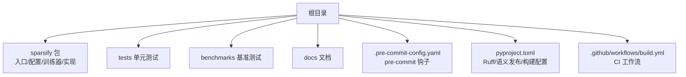
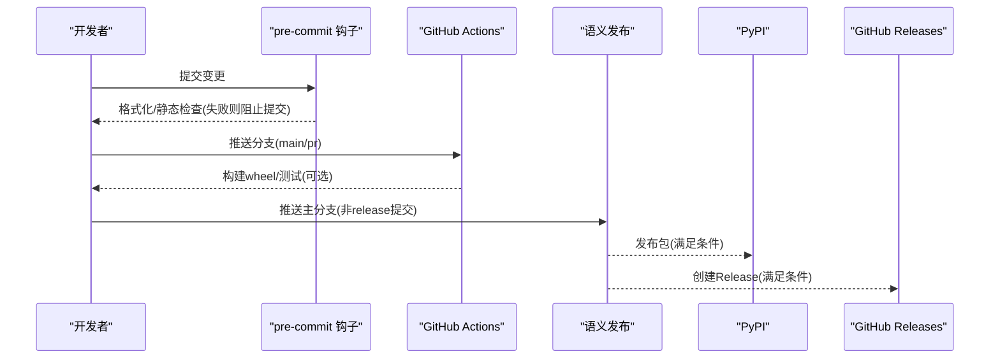
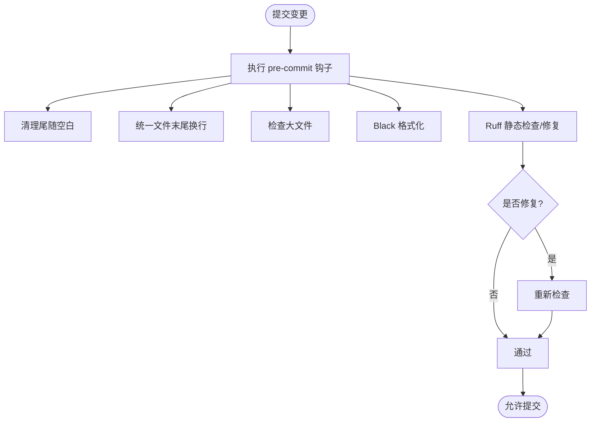
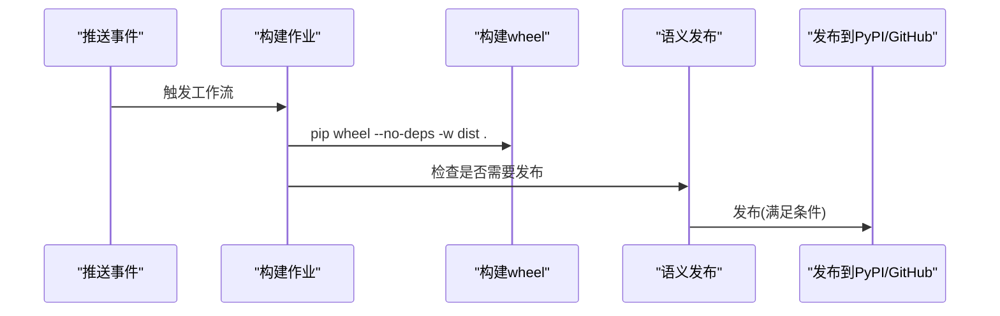
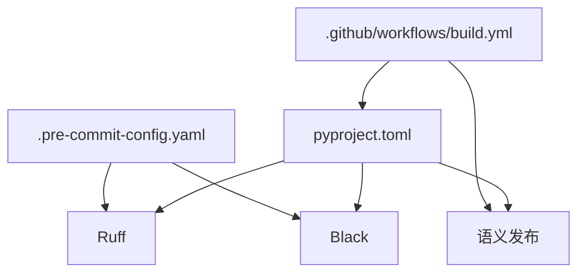

# 代码规范与质量

<cite>
**本文引用的文件**
- [.pre-commit-config.yaml](file://.pre-commit-config.yaml)
- [pyproject.toml](file://pyproject.toml)
- [.github/workflows/build.yml](file://.github/workflows/build.yml)
- [README.md](file://README.md)
- [sparsify/__main__.py](file://sparsify/__main__.py)
- [sparsify/config.py](file://sparsify/config.py)
- [sparsify/trainer.py](file://sparsify/trainer.py)
- [tests/conftest.py](file://tests/conftest.py)
- [tests/test_encode.py](file://tests/test_encode.py)
- [tests/test_decode.py](file://tests/test_decode.py)
- [benchmarks/bench_scatter.py](file://benchmarks/bench_scatter.py)
</cite>

## 目录
1. [简介](#简介)
2. [项目结构](#项目结构)
3. [核心组件](#核心组件)
4. [架构总览](#架构总览)
5. [详细组件分析](#详细组件分析)
6. [依赖关系分析](#依赖关系分析)
7. [性能考量](#性能考量)
8. [故障排查指南](#故障排查指南)
9. [结论](#结论)
10. [附录](#附录)

## 简介
本文件系统化梳理本项目的代码规范与质量保障体系，覆盖以下方面：
- 代码风格规范（Ruff 配置、行长度、导入排序等）
- 命名约定与注释标准
- pre-commit 钩子与自动化检查流程
- 代码审查流程、提交信息规范与分支管理策略
- 静态分析工具使用、单元测试与覆盖率、性能基准测试
- 自动化配置与持续集成流程
- 代码重构指导与最佳实践示例

## 项目结构
本项目采用“功能域+分层”的组织方式：
- 核心训练与导出逻辑位于 sparsify 包内，包含入口、配置、训练器、编码器/解码器实现等
- 测试位于 tests 目录，按功能模块划分
- 基准测试位于 benchmarks 目录
- 文档位于 docs 目录，提供架构、训练、导出等说明
- 质量控制通过 pyproject.toml（Ruff、语义发布）、.pre-commit-config.yaml（pre-commit 钩子）、GitHub Actions（CI）共同实现

图表来源
- [pyproject.toml:54-64](file://pyproject.toml#L54-L64)
- [.pre-commit-config.yaml:3-19](file://.pre-commit-config.yaml#L3-L19)
- [.github/workflows/build.yml:1-58](file://.github/workflows/build.yml#L1-L58)

章节来源
- [README.md:71-102](file://README.md#L71-L102)

## 核心组件
- Ruff 配置：启用 pycodestyle、Pyflakes、isort 规则，行长度 88，忽略 __init__.py 中自动移除未使用导入的行为
- pre-commit 钩子：trailing-whitespace、end-of-file-fixer、check-added-large-files、black、ruff（自动修复并失败时退出）
- 语义发布：基于 Conventional Commits 解析版本号，支持主分支发布与 GitHub Releases/PyPI 发布
- CI：Ubuntu 环境安装开发依赖，构建 wheel；满足条件时触发语义发布并发布到 PyPI/GitHub Releases

章节来源
- [pyproject.toml:54-64](file://pyproject.toml#L54-L64)
- [.pre-commit-config.yaml:3-19](file://.pre-commit-config.yaml#L3-L19)
- [.github/workflows/build.yml:25-57](file://.github/workflows/build.yml#L25-L57)

## 架构总览
下图展示代码质量控制在本地与 CI 的整体流程：

图表来源
- [.pre-commit-config.yaml:3-19](file://.pre-commit-config.yaml#L3-L19)
- [.github/workflows/build.yml:1-58](file://.github/workflows/build.yml#L1-L58)
- [pyproject.toml:65-131](file://pyproject.toml#L65-L131)

## 详细组件分析

### 代码风格规范（Ruff、Black、导入排序）
- Ruff 规则选择：启用 pycodestyle（E）、Pyflakes（F）、isort（I），统一错误与警告级别
- 行长度：88（与 Black 一致）
- 导入排序：isort 规则由 Ruff 集成，确保一致性
- __init__.py 特殊处理：忽略自动移除 __init__.py 中未使用导入，避免破坏显式导出
- 自动修复：pre-commit 使用 ruff --fix 并在修复时失败退出，保证提交前格式与规则达标

章节来源
- [pyproject.toml:54-64](file://pyproject.toml#L54-L64)
- [.pre-commit-config.yaml:14-18](file://.pre-commit-config.yaml#L14-L18)

### 命名约定与注释标准
- 类型注解与数据类：广泛使用 dataclass 与类型注解，提升可读性与静态检查友好度
- 函数与变量：采用清晰的英文命名，尽量体现职责与上下文
- 日志记录：统一使用 logging，关键路径输出 INFO 级别日志，便于调试与审计
- 注释与文档字符串：函数与类具备必要的文档字符串说明用途、参数与返回值；复杂逻辑处补充行内注释

章节来源
- [sparsify/__main__.py:31-80](file://sparsify/__main__.py#L31-L80)
- [sparsify/config.py:7-26](file://sparsify/config.py#L7-L26)
- [sparsify/trainer.py:39-160](file://sparsify/trainer.py#L39-L160)

### pre-commit 钩子配置与自动化检查流程
- 钩子清单：trailing-whitespace、end-of-file-fixer、check-added-large-files、black、ruff
- 执行时机：本地提交前自动执行，失败即中止提交
- 修复策略：ruff 启用 --fix，必要时自动修复；若修复后仍有问题，则以非零退出阻止提交

图表来源
- [.pre-commit-config.yaml:3-19](file://.pre-commit-config.yaml#L3-L19)

章节来源
- [.pre-commit-config.yaml:3-19](file://.pre-commit-config.yaml#L3-L19)

### 代码审查流程、提交信息规范与分支管理策略
- 提交信息规范：遵循 Conventional Commits，支持 feat、fix、perf、build、chore、ci、docs、style、refactor、test 等类型
- 分支策略：主分支为 main/master；发布流程与语义版本号解析联动
- 代码审查：建议在 PR 中至少一次审查，关注逻辑正确性、性能影响、可维护性与测试覆盖

章节来源
- [pyproject.toml:113-121](file://pyproject.toml#L113-L121)
- [pyproject.toml:78-81](file://pyproject.toml#L78-L81)

### 静态分析工具使用
- Ruff：统一风格与潜在问题检测，结合 Black 保证格式一致性
- pyright：类型检查（在工具配置中启用），辅助发现类型相关问题

章节来源
- [pyproject.toml:47-49](file://pyproject.toml#L47-L49)
- [pyproject.toml:54-64](file://pyproject.toml#L54-L64)

### 单元测试与覆盖率
- 测试框架：pytest
- 设备感知：根据加速器可用性动态跳过 GPU/NPU 相关测试
- 示例测试：
  - 编码器融合实现对比与梯度一致性验证
  - 解码器融合实现对比、bf16 autocast 兼容性与默认实现校验
- 覆盖率：当前未配置覆盖率门槛或报告生成，建议在 CI 中增加覆盖率统计与阈值控制

章节来源
- [tests/conftest.py:6-8](file://tests/conftest.py#L6-L8)
- [tests/test_encode.py:9-61](file://tests/test_encode.py#L9-L61)
- [tests/test_decode.py:16-84](file://tests/test_decode.py#L16-L84)

### 性能基准测试
- 基准脚本：bench_scatter.py 对比多种 scatter_add_ 替代方案在 Ascend NPU 上的性能
- 计时模式：设备事件计时、流水线计时、同步计时，覆盖真实场景下的延迟与吞吐
- 正确性校验：每种方法输出与参考实现对比，确保数值精度

章节来源
- [benchmarks/bench_scatter.py:19-176](file://benchmarks/bench_scatter.py#L19-L176)

### 自动化配置与持续集成流程
- 触发条件：推送 main 或针对 main 的 PR
- 步骤：
  - 检出代码、设置 Python 版本
  - 安装开发依赖并构建 wheel
  - 条件发布：满足条件时执行语义发布，构建包并发布到 PyPI 与 GitHub Releases

图表来源
- [.github/workflows/build.yml:1-58](file://.github/workflows/build.yml#L1-L58)

章节来源
- [.github/workflows/build.yml:1-58](file://.github/workflows/build.yml#L1-L58)

### 代码重构指导与最佳实践
- 配置驱动：训练配置集中于数据类，便于扩展与验证；建议新增参数时同步添加校验逻辑
- 模块化与职责分离：训练器负责生命周期与指标聚合，具体算子封装在独立模块，利于测试与复用
- 日志与可观测性：关键步骤输出日志，便于定位问题；在分布式场景下注意仅在 rank 0 输出
- 性能优化：优先采用融合实现与混合精度；在 NPU/CPU 场景下避免 CPU 回落路径
- 可测试性：为关键路径提供对比实现与数值校验，确保重构不引入偏差

章节来源
- [sparsify/config.py:124-149](file://sparsify/config.py#L124-L149)
- [sparsify/trainer.py:162-729](file://sparsify/trainer.py#L162-L729)
- [tests/test_encode.py:9-61](file://tests/test_encode.py#L9-L61)
- [tests/test_decode.py:16-84](file://tests/test_decode.py#L16-L84)

## 依赖关系分析
- 工具链依赖：
  - Ruff：静态检查与格式修复
  - Black：代码格式化
  - pre-commit：本地钩子执行
  - 语义发布：版本解析与发布
- 运行时依赖：torch、transformers、accelerate 等，版本在 pyproject.toml 中固定
- 测试依赖：pytest、torch、natsort、schedulefree 等

图表来源
- [pyproject.toml:54-64](file://pyproject.toml#L54-L64)
- [.pre-commit-config.yaml:3-19](file://.pre-commit-config.yaml#L3-L19)
- [.github/workflows/build.yml:1-58](file://.github/workflows/build.yml#L1-L58)

章节来源
- [pyproject.toml:12-28](file://pyproject.toml#L12-L28)
- [pyproject.toml:30-42](file://pyproject.toml#L30-L42)

## 性能考量
- 训练路径优化：使用 DDP、torch.compile（在 CUDA 上）减少小算子开销；Top-K 稀疏激活与辅助损失提升稳定性
- 指标采集：在日志频率周期内批量归约指标，降低通信开销
- 设备计时：在 CUDA/NPU 上使用事件计时，避免 CPU 同步掩盖的性能瓶颈
- 基准测试：提供多规模工作负载与多种计时模式，帮助识别 CPU 回落与流水线阻塞

章节来源
- [sparsify/trainer.py:162-729](file://sparsify/trainer.py#L162-L729)
- [benchmarks/bench_scatter.py:60-176](file://benchmarks/bench_scatter.py#L60-L176)

## 故障排查指南
- 提交被阻止：检查 pre-commit 输出，确认 Ruff 是否自动修复；若仍失败，手动修正或调整规则
- CI 失败：查看构建日志，确认依赖安装与构建步骤；若发布阶段失败，检查语义发布条件与凭据
- 测试跳过：若设备不可用，GPU/NPU 相关测试会跳过；可在具备相应硬件的环境中运行
- 训练异常：关注日志中的学习率、指标与梯度状态；在多卡场景下检查 DDP 初始化与张量分片

章节来源
- [.pre-commit-config.yaml:3-19](file://.pre-commit-config.yaml#L3-L19)
- [.github/workflows/build.yml:1-58](file://.github/workflows/build.yml#L1-L58)
- [tests/conftest.py:6-8](file://tests/conftest.py#L6-L8)

## 结论
本项目通过 pre-commit 钩子、Ruff 与 Black 的组合，配合语义发布与 CI 工作流，形成了从本地到远端的全链路质量保障。建议在现有基础上补充：
- 单元测试覆盖率门槛与报告
- 更细粒度的提交信息模板与 PR 模板
- 性能回归基线与定期基准测试

## 附录
- 关键入口与职责
  - CLI 入口：sparsify/__main__.py
  - 配置接口：sparsify/config.py
  - 训练循环：sparsify/trainer.py
- 相关文档与工作流
  - README.md：项目概览与主要路径
  - .github/workflows/build.yml：CI 工作流
  - pyproject.toml：Ruff、语义发布与构建配置

章节来源
- [README.md:71-102](file://README.md#L71-L102)
- [sparsify/__main__.py:131-211](file://sparsify/__main__.py#L131-L211)
- [sparsify/config.py:28-149](file://sparsify/config.py#L28-L149)
- [sparsify/trainer.py:39-760](file://sparsify/trainer.py#L39-L760)
- [.github/workflows/build.yml:1-58](file://.github/workflows/build.yml#L1-L58)
- [pyproject.toml:54-64](file://pyproject.toml#L54-L64)