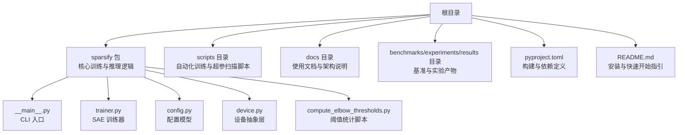
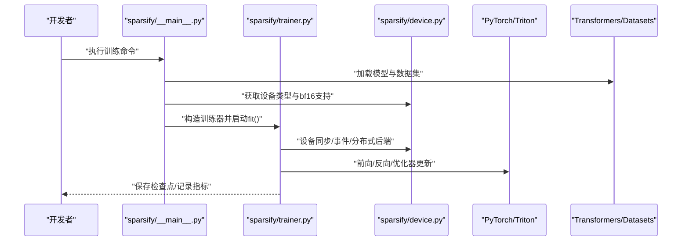
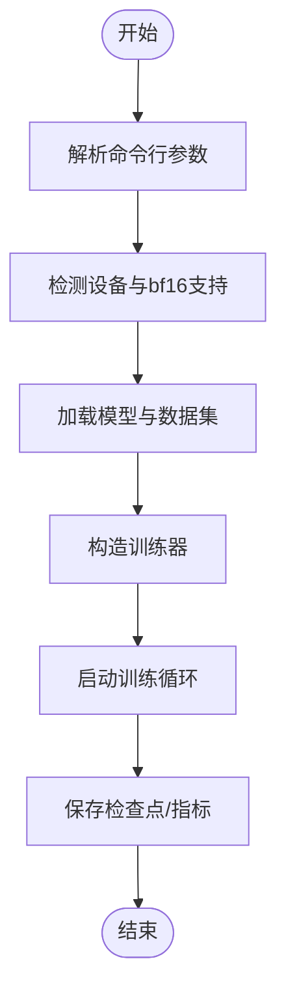
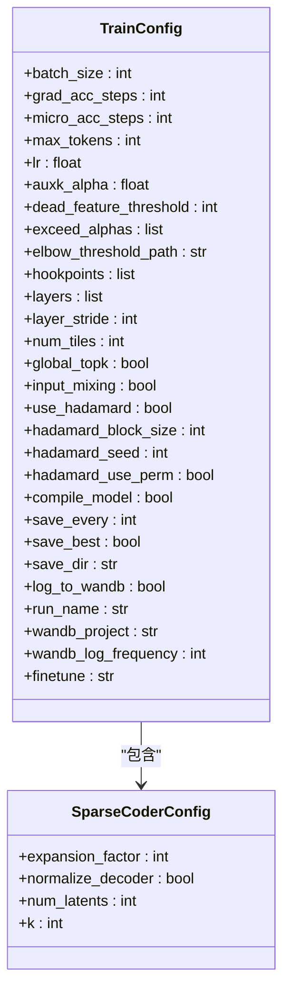
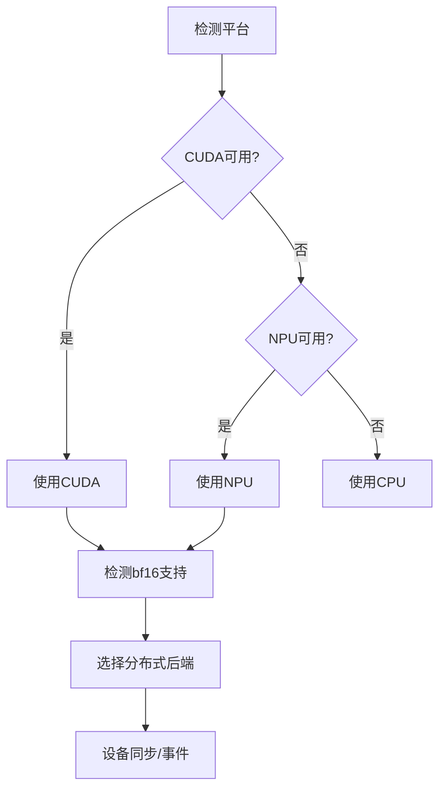
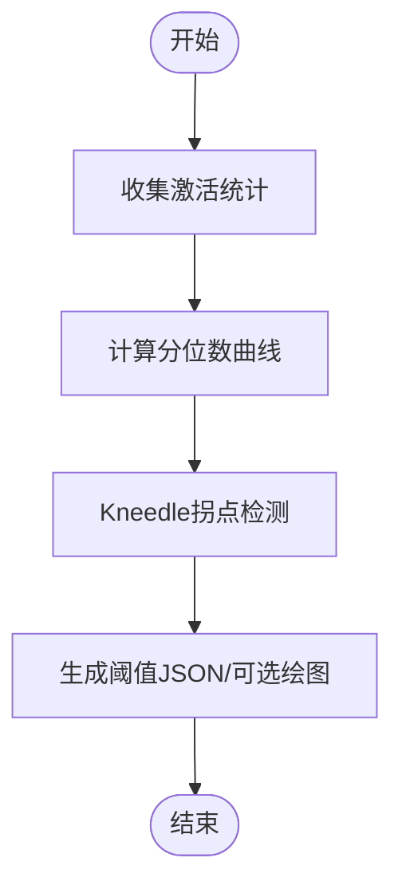

# 开发环境设置

<cite>
**本文档引用的文件**
- [pyproject.toml](file://pyproject.toml)
- [README.md](file://README.md)
- [sparsify/__main__.py](file://sparsify/__main__.py)
- [sparsify/__init__.py](file://sparsify/__init__.py)
- [sparsify/config.py](file://sparsify/config.py)
- [sparsify/device.py](file://sparsify/device.py)
- [sparsify/trainer.py](file://sparsify/trainer.py)
- [compute_elbow_thresholds.py](file://compute_elbow_thresholds.py)
- [scripts/README.md](file://scripts/README.md)
- [scripts/first_time_train/Qwen3-0.6B/script.sh](file://scripts/first_time_train/Qwen3-0.6B/script.sh)
- [scripts/first_time_train/Qwen3-4B/script.sh](file://scripts/first_time_train/Qwen3-4B/script.sh)
</cite>

## 目录
1. [简介](#简介)
2. [项目结构](#项目结构)
3. [核心组件](#核心组件)
4. [架构总览](#架构总览)
5. [详细组件分析](#详细组件分析)
6. [依赖分析](#依赖分析)
7. [性能考虑](#性能考虑)
8. [故障排除指南](#故障排除指南)
9. [结论](#结论)
10. [附录](#附录)

## 简介
本文件面向希望在本地快速搭建 Sparsify 开发环境的开发者，提供从 Python 版本要求、虚拟环境创建、依赖安装到 IDE 配置与调试工具的完整指南。同时解释核心依赖项的作用，并给出常见问题的解决方案与性能优化建议。

## 项目结构
该仓库采用以功能域划分的模块化组织方式，核心训练与导出逻辑集中在 sparsify 包内，配套脚本位于 scripts 目录，文档位于 docs 目录，基准与实验位于 benchmarks/experiments/results 目录。

图表来源
- [pyproject.toml:1-131](file://pyproject.toml#L1-L131)
- [README.md:1-154](file://README.md#L1-L154)
- [sparsify/__main__.py:1-211](file://sparsify/__main__.py#L1-L211)
- [sparsify/trainer.py:1-200](file://sparsify/trainer.py#L1-L200)
- [sparsify/config.py:1-149](file://sparsify/config.py#L1-L149)
- [sparsify/device.py:1-118](file://sparsify/device.py#L1-L118)
- [compute_elbow_thresholds.py:1-200](file://compute_elbow_thresholds.py#L1-L200)

章节来源
- [README.md:24-28](file://README.md#L24-L28)
- [pyproject.toml:5-28](file://pyproject.toml#L5-L28)

## 核心组件
- CLI 入口与分布式训练：通过入口模块解析参数、加载模型与数据集，并支持多 GPU 分布式训练。
- 训练器：负责 SAE 初始化、Hook 点选择、优化器配置、训练循环与检查点管理。
- 配置系统：集中定义 SAE 架构参数与训练超参，包含校验与默认值。
- 设备抽象层：统一 CUDA/Ascend NPU 的设备选择、bf16 支持检测与分布式后端选择。
- 阈值统计：对模型激活进行统计，生成补偿用的拐点阈值文件。

章节来源
- [sparsify/__main__.py:131-211](file://sparsify/__main__.py#L131-L211)
- [sparsify/trainer.py:39-200](file://sparsify/trainer.py#L39-L200)
- [sparsify/config.py:7-149](file://sparsify/config.py#L7-L149)
- [sparsify/device.py:34-118](file://sparsify/device.py#L34-L118)
- [compute_elbow_thresholds.py:1-200](file://compute_elbow_thresholds.py#L1-L200)

## 架构总览
下图展示了从 CLI 到训练器再到设备层的整体调用链路，以及与外部依赖的关系。

图表来源
- [sparsify/__main__.py:81-128](file://sparsify/__main__.py#L81-L128)
- [sparsify/trainer.py:162-200](file://sparsify/trainer.py#L162-L200)
- [sparsify/device.py:92-118](file://sparsify/device.py#L92-L118)

## 详细组件分析

### 组件一：CLI 入口与分布式训练
- 功能要点
  - 解析训练参数，支持从 Hugging Face Hub 加载模型与数据集。
  - 自动检测 bf16 支持并选择 dtype。
  - 支持 DDP 分布式训练，按 rank 划分数据并同步。
  - 支持从检查点恢复训练。
- 关键流程
  - 参数解析 → 设备初始化 → 模型与数据加载 → 训练器构造 → fit 启动。

图表来源
- [sparsify/__main__.py:131-211](file://sparsify/__main__.py#L131-L211)

章节来源
- [sparsify/__main__.py:31-128](file://sparsify/__main__.py#L31-L128)

### 组件二：训练器与配置系统
- 训练器职责
  - 解析 Hook 点或层列表，支持范围模式展开。
  - 初始化 SAE（标准或分块），配置优化器与学习率。
  - 管理梯度累积、微批处理与死特征阈值。
  - 支持 Hadamard 旋转与编译加速（仅 CUDA）。
- 配置系统
  - 提供 SAE 架构参数（扩展因子、k 值、归一化等）与训练超参（批次、梯度累积、日志等）。
  - 校验输入合法性，如层步长与 Hadamard 块大小约束。

图表来源
- [sparsify/config.py:28-149](file://sparsify/config.py#L28-L149)

章节来源
- [sparsify/trainer.py:39-161](file://sparsify/trainer.py#L39-L161)
- [sparsify/config.py:7-149](file://sparsify/config.py#L7-L149)

### 组件三：设备抽象层
- 统一 CUDA/Ascend NPU 的设备选择、bf16 支持检测、分布式后端选择与事件同步。
- 通过装饰器实现设备无关的 bf16 自动混合精度上下文。

图表来源
- [sparsify/device.py:34-118](file://sparsify/device.py#L34-L118)

章节来源
- [sparsify/device.py:18-118](file://sparsify/device.py#L18-L118)

### 组件四：阈值统计与导出
- 阈值统计：对激活进行分位数曲线拟合，识别拐点并生成 JSON 文件，供下游补偿逻辑使用。
- 导出：将训练好的 SAE 转换为 LUT 友好的格式，配合 LUTurbo 推理流水线。

图表来源
- [compute_elbow_thresholds.py:35-96](file://compute_elbow_thresholds.py#L35-L96)

章节来源
- [compute_elbow_thresholds.py:1-200](file://compute_elbow_thresholds.py#L1-L200)

## 依赖分析
- Python 版本要求：>=3.10
- 核心依赖
  - PyTorch 2.9.1：深度学习框架，提供张量运算与自动微分。
  - Transformers 4.57.3：模型加载与数据处理。
  - Accelerate 1.12.0：分布式训练与设备抽象。
  - Datasets 4.4.2：大规模数据集加载与缓存。
  - Tokenizers 0.22.1：文本分词。
  - NumPy 2.4.0、Pandas 2.3.3、PyArrow 22.0.0：数值计算与数据处理。
  - Triton 3.5.1：内核融合与高性能计算。
  - einops、natsort、safetensors、schedulefree、simple-parsing：张量操作、排序与序列化。
- 可选开发依赖
  - matplotlib 3.10.8、pillow 12.0.0、GitPython 3.1.45、ml_dtypes 0.5.4、modelscope 1.33.0、protobuf 6.33.2、pydantic 2.12.5、wandb 0.23.1、sentry-sdk 2.48.0、pre-commit：可视化、版本控制、监控与质量保障。

章节来源
- [pyproject.toml:9](file://pyproject.toml#L9)
- [pyproject.toml:12-28](file://pyproject.toml#L12-L28)
- [pyproject.toml:30-42](file://pyproject.toml#L30-L42)

## 性能考虑
- bf16 自动混合精度：在支持的设备上启用，提升吞吐并降低显存占用。
- Tensor Cores 精度设置：在训练开始前设置高精度矩阵乘法，减少精度损失。
- 编译加速：在 CUDA 设备上可启用 torch.compile 以融合小算子，降低内核启动开销。
- Hadamard 旋转：在输入维度较大时，通过分块 Hadamard 旋转提升稀疏编码效果。
- 分布式训练：合理设置每卡 batch size 与梯度累积步数，平衡吞吐与稳定性。
- 数据预处理并发：提高预处理进程数以缩短 I/O 等待时间。

章节来源
- [sparsify/trainer.py:162-165](file://sparsify/trainer.py#L162-L165)
- [sparsify/config.py:100-104](file://sparsify/config.py#L100-L104)
- [sparsify/device.py:58-64](file://sparsify/device.py#L58-L64)

## 故障排除指南
- CUDA OOM（显存不足）
  - 降低 batch size 或增大梯度累积步数；检查是否启用了不必要的 bf16。
  - 参考脚本中的参数调整建议。
- 端口冲突（分布式训练）
  - 脚本会自动递增端口，若仍冲突，修改起始端口。
- 数据加载慢
  - 增加数据预处理并发进程数，确保磁盘 I/O 不成为瓶颈。
- 权重与偏差（W&B）未安装
  - 若未安装 W&B，训练器会自动禁用日志并发出警告。
- 拐点检测失败
  - 检查激活分布是否异常，适当调整最大分位数与过滤策略。

章节来源
- [scripts/README.md:273-299](file://scripts/README.md#L273-L299)
- [sparsify/trainer.py:186-200](file://sparsify/trainer.py#L186-L200)
- [compute_elbow_thresholds.py:70-95](file://compute_elbow_thresholds.py#L70-L95)

## 结论
通过遵循本指南，开发者可在本地快速搭建 Sparsify 的完整开发环境，理解核心依赖的作用，并掌握分布式训练、阈值统计与导出的关键流程。遇到问题时，可依据故障排除指南快速定位与修复。

## 附录

### A. Python 版本与虚拟环境
- Python 版本要求：>=3.10
- 建议使用 venv 或 conda 创建隔离环境
  - venv：python3 -m venv .venv
  - 激活：source .venv/bin/activate（Linux/macOS）或 .venv\Scripts\Activate.ps1（Windows）
- 升级 pip：pip install --upgrade pip

章节来源
- [pyproject.toml:9](file://pyproject.toml#L9)

### B. 依赖安装步骤
- 基础依赖安装
  - pip install -e .
- 可选开发依赖安装
  - pip install -e .[dev]
- 验证安装
  - python -m sparsify --help
  - 参考 README 的快速开始示例

章节来源
- [README.md:24-28](file://README.md#L24-L28)
- [README.md:148-154](file://README.md#L148-L154)

### C. 环境变量与 IDE 设置
- 环境变量
  - WANDB_PROJECT：设置 W&B 项目名（若启用日志）
  - LOCAL_RANK：分布式训练时由 torchrun 注入，无需手动设置
  - CUDA_VISIBLE_DEVICES：在多卡环境中选择可见设备
- IDE 配置建议
  - VS Code：安装 Python 扩展与 Pylance，启用格式化与类型检查
  - PyCharm：配置解释器为虚拟环境中的 Python，启用 Ruff 与 PyTest 集成
- 调试工具
  - 断点调试：在训练器与 CLI 入口中设置断点
  - 日志：默认 INFO 级别，可通过 logging.basicConfig 调整

章节来源
- [sparsify/__main__.py:134-145](file://sparsify/__main__.py#L134-L145)
- [sparsify/trainer.py:186-200](file://sparsify/trainer.py#L186-L200)
- [pyproject.toml:47-49](file://pyproject.toml#L47-L49)

### D. 完整安装与运行流程
- 安装
  - pip install -e .[dev]
- 首次运行（以 Qwen3 为例）
  - 计算阈值：参考脚本中的阈值统计命令
  - 训练：使用 torchrun 启动多卡训练，参考脚本中的完整命令
- 导出
  - 使用转换脚本将 SAE 导出为 LUT 友好格式

章节来源
- [scripts/first_time_train/Qwen3-0.6B/script.sh:1-124](file://scripts/first_time_train/Qwen3-0.6B/script.sh#L1-L124)
- [scripts/first_time_train/Qwen3-4B/script.sh:1-124](file://scripts/first_time_train/Qwen3-4B/script.sh#L1-L124)
- [README.md:56-69](file://README.md#L56-L69)