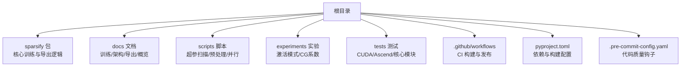
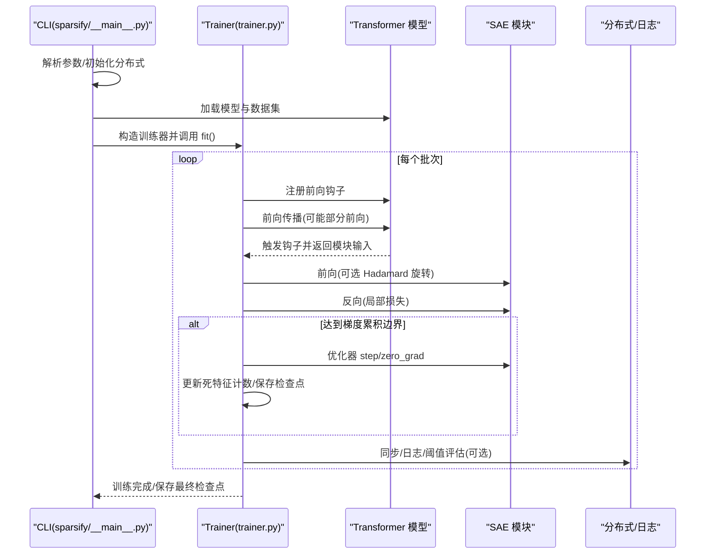
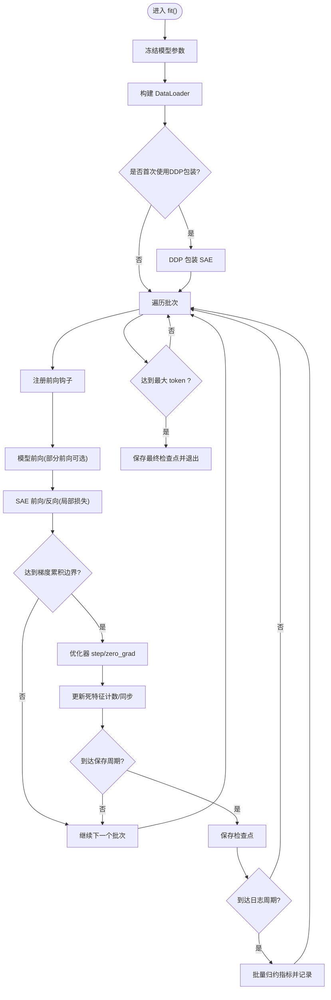
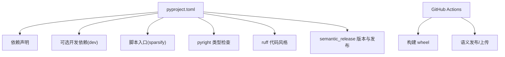

# 开发者指南

<cite>
**本文引用的文件**
- [README.md](file://README.md)
- [docs/README.md](file://docs/README.md)
- [docs/training/quickstart.md](file://docs/training/quickstart.md)
- [docs/training/config-reference.md](file://docs/training/config-reference.md)
- [docs/architecture/training-pipeline.md](file://docs/architecture/training-pipeline.md)
- [docs/export/sae-to-lut.md](file://docs/export/sae-to-lut.md)
- [pyproject.toml](file://pyproject.toml)
- [.pre-commit-config.yaml](file://.pre-commit-config.yaml)
- [.github/workflows/build.yml](file://.github/workflows/build.yml)
- [sparsify/__main__.py](file://sparsify/__main__.py)
- [sparsify/config.py](file://sparsify/config.py)
- [sparsify/trainer.py](file://sparsify/trainer.py)
- [scripts/README.md](file://scripts/README.md)
</cite>

## 目录
1. [简介](#简介)
2. [项目结构](#项目结构)
3. [核心组件](#核心组件)
4. [架构总览](#架构总览)
5. [详细组件分析](#详细组件分析)
6. [依赖分析](#依赖分析)
7. [性能考虑](#性能考虑)
8. [故障排除指南](#故障排除指南)
9. [结论](#结论)
10. [附录](#附录)

## 简介
本指南面向希望参与 Sparsify 项目开发的贡献者，覆盖开发环境设置、依赖管理与构建流程；代码与提交规范、审查流程；架构决策与技术选型、扩展机制；贡献指南、问题报告与功能请求流程；历史文档使用方法、架构演进与废弃功能处理；以及调试技巧、性能分析与故障排除最佳实践。目标是帮助新贡献者快速上手并高效开展工作。

## 项目结构
仓库采用按功能域分层的组织方式：
- 核心训练与导出逻辑位于 sparsify 包内，包含 CLI 入口、配置、训练器、编码器/解码器实现、设备抽象等。
- 文档位于 docs 目录，涵盖概览、训练快速入门、配置参考、训练流水线、导出到 LUT 等主题，并提供归档历史材料。
- 实验与脚本位于 experiments 与 scripts，提供超参扫描、阈值计算、PCA 预处理等辅助工具。
- 测试位于 tests，覆盖 CUDA/Ascend 平台与核心模块。
- CI/CD 通过 GitHub Actions 自动化构建与发布。

图示来源
- [README.md:1-154](file://README.md#L1-L154)
- [docs/README.md:1-34](file://docs/README.md#L1-L34)
- [pyproject.toml:1-131](file://pyproject.toml#L1-L131)
- [.github/workflows/build.yml:1-58](file://.github/workflows/build.yml#L1-L58)

章节来源
- [README.md:1-154](file://README.md#L1-L154)
- [docs/README.md:1-34](file://docs/README.md#L1-L34)

## 核心组件
- CLI 入口与运行配置：解析命令行参数、加载模型与数据集、初始化分布式训练、启动训练循环。
- 训练配置：统一的训练与 SAE 参数定义，含校验规则与行为约束。
- 训练器：基于前向钩子的在线训练流水线，支持 DDP、梯度累积、死特征检测、可选的 Hadamard 预处理与编译优化。
- 导出与阈值：阈值统计与 SAE 到 LUT 的转换脚本，连接下游推理管线。

章节来源
- [sparsify/__main__.py:1-211](file://sparsify/__main__.py#L1-L211)
- [sparsify/config.py:1-149](file://sparsify/config.py#L1-L149)
- [sparsify/trainer.py:1-760](file://sparsify/trainer.py#L1-L760)

## 架构总览
Sparsify 的当前主干路径围绕“在线钩子驱动”的训练流水线展开：在每个训练步中，注册前向钩子捕获模块输入作为 SAE 训练数据，立即计算局部重构损失并反传，随后在梯度累积边界执行优化器更新。该设计避免离线缓存大体量激活，降低存储与预处理成本。

图示来源
- [sparsify/__main__.py:131-211](file://sparsify/__main__.py#L131-L211)
- [sparsify/trainer.py:162-760](file://sparsify/trainer.py#L162-L760)

## 详细组件分析

### CLI 与运行配置
- 入口：通过模块入口运行，解析 RunConfig，支持本地/远程模型、Hugging Face 数据集、memmap 数据集、DDP 分布式。
- 数据加载：根据数据类型自动分词或直接使用已分词列；支持随机打乱与示例上限。
- 检查点恢复：支持按命名匹配或通配符查找最近运行目录进行恢复。
- 训练器集成：构造 Trainer 并执行 fit，支持微调权重初始化。

章节来源
- [sparsify/__main__.py:31-211](file://sparsify/__main__.py#L31-L211)
- [docs/training/quickstart.md:15-78](file://docs/training/quickstart.md#L15-L78)

### 训练配置与参数校验
- 两层配置：SparseCoderConfig（SAE 架构参数）、TrainConfig（训练/日志/数据/运行参数）。
- 校验规则：禁止同时指定 layers 与 layer_stride；校验 init_seeds 非空；exceed_alphas 必须为正；elbow 文件存在性；Hadamard block size 必须为 2 的幂；compile_model 在非 CUDA 后端自动禁用。
- 行为细节：学习率按潜维数量缩放；梯度累积控制优化器步；微批归一化影响日志分母；最大 token 数到达后保存并退出。

章节来源
- [sparsify/config.py:7-149](file://sparsify/config.py#L7-L149)
- [docs/training/config-reference.md:160-169](file://docs/training/config-reference.md#L160-L169)

### 训练器：钩子驱动的在线训练
- 钩子点解析：支持通配与范围展开，匹配模型子模块；可按层步幅采样。
- SAE 初始化：按钩子点与种子组合创建标准或分块 SAE；支持编译优化与 Hadamard 预处理。
- 梯度累积与同步：在累积边界执行优化器步；在 DDP 下使用 no_sync 与 all_reduce。
- 死特征追踪：收集每步激活的活跃潜维索引，聚合后一次性重置，避免昂贵的 per-forward scatter。
- 日志与阈值：可选 W&B 日志；按频率批量归约指标；可选 exceed 指标（基于肘部阈值）。

图示来源
- [sparsify/trainer.py:162-760](file://sparsify/trainer.py#L162-L760)

章节来源
- [sparsify/trainer.py:39-760](file://sparsify/trainer.py#L39-L760)
- [docs/architecture/training-pipeline.md:1-167](file://docs/architecture/training-pipeline.md#L1-L167)

### 导出与阈值：从 SAE 到 LUT
- 阈值统计：对选定投影家族的模块输入进行激活采样，计算 Kneedle 风格肘点，输出 JSON 文件供补偿使用。
- LUT 导出：读取 SAE 权重与配置，结合目标线性层权重，预计算 W_dec @ W_target.T 与偏置项，生成 LUT 面向的查找表产物。
- 投影家族映射：内置 qproj/o_proj/upproj/kproj/qkv/gate_up 等映射，支持融合导出。

章节来源
- [docs/export/sae-to-lut.md:1-103](file://docs/export/sae-to-lut.md#L1-L103)
- [docs/training/quickstart.md:80-134](file://docs/training/quickstart.md#L80-L134)

### 超参扫描与并行实验
- 提供 Python 与 Shell 两类脚本，支持网格搜索 expansion_factor 与 k，可 dry-run、错误继续、多 GPU 并行。
- 输出包含实验汇总与日志，便于在 W&B 中对比不同配置的 FVU、死特征比例与 l0 等指标。

章节来源
- [scripts/README.md:1-299](file://scripts/README.md#L1-L299)

## 依赖分析
- 语言与版本：Python >= 3.10。
- 核心依赖：PyTorch、Transformers、Datasets、einops、safetensors、schedulefree、simple-parsing、triton 等。
- 开发依赖：pre-commit、matplotlib、pillow、GitPython、ml_dtypes、modelscope、protobuf、pydantic、wandb、sentry-sdk 等。
- 构建与发布：setuptools 后端、semantic-release 自动化版本与发布至 PyPI/GitHub Releases。

图示来源
- [pyproject.toml:1-131](file://pyproject.toml#L1-L131)
- [.github/workflows/build.yml:1-58](file://.github/workflows/build.yml#L1-L58)

章节来源
- [pyproject.toml:54-131](file://pyproject.toml#L54-L131)
- [.github/workflows/build.yml:11-58](file://.github/workflows/build.yml#L11-L58)

## 性能考虑
- 部分前向优化：仅向前传播到包含目标钩子的最深层，减少无用计算。
- 梯度累积与微批：通过 grad_acc_steps 与 micro_acc_steps 控制有效损失规模与日志频率，平衡吞吐与稳定性。
- 编译优化：在 CUDA 上对 Transformer 层使用 torch.compile 融合小算子，降低核启动开销。
- 指标聚合：批量归约与延迟同步，减少跨设备同步次数。
- 内存与 I/O：优先使用 memmap 数据集；合理设置 data_preprocessing_num_proc；必要时启用 bf16。

章节来源
- [docs/architecture/training-pipeline.md:95-123](file://docs/architecture/training-pipeline.md#L95-L123)
- [sparsify/trainer.py:490-497](file://sparsify/trainer.py#L490-L497)
- [sparsify/config.py:100-104](file://sparsify/config.py#L100-L104)

## 故障排除指南
- CUDA OOM：减小 batch_size 或增大 grad_acc_steps；确认 bf16 支持与显存占用。
- 端口冲突：分布式训练端口由脚本自动递增，若仍冲突，调整起始端口。
- 数据加载慢：提高 data_preprocessing_num_proc；优先使用 memmap 数据集。
- W&B 初始化失败：自动降级关闭日志；检查环境变量与网络连通性。
- 恢复/微调：使用 --resume 恢复同一运行状态；使用 --finetune 从旧权重开始新训练。
- 阈值与导出不匹配：确保投影家族命名一致，阈值文件与导出映射匹配。

章节来源
- [scripts/README.md:273-299](file://scripts/README.md#L273-L299)
- [docs/training/quickstart.md:60-78](file://docs/training/quickstart.md#L60-L78)
- [docs/export/sae-to-lut.md:86-103](file://docs/export/sae-to-lut.md#L86-L103)

## 结论
本指南系统梳理了 Sparsify 的开发环境、依赖与构建、代码与提交规范、审查流程、架构决策与技术选型、扩展机制、贡献与问题处理、历史文档与演进、调试与性能优化等关键内容。建议新贡献者先阅读概览与训练快速入门，再深入配置参考与训练流水线，最后结合导出与脚本工具开展实验与生产化流程。

## 附录

### 开发环境设置与安装
- 安装开发依赖：在仓库根目录执行安装命令，获得可编辑安装与开发工具链。
- CLI 使用：通过模块入口运行，查看帮助与参数；最小示例可直接运行快速开始文档中的命令。
- 文档定位：优先阅读 docs 目录下的当前主干文档，历史材料位于 archive 子目录。

章节来源
- [README.md:24-54](file://README.md#L24-L54)
- [docs/README.md:18-33](file://docs/README.md#L18-L33)

### 依赖管理与构建流程
- 依赖声明：核心与可选开发依赖均在 pyproject.toml 中集中管理。
- 构建：使用 setuptools 后端；wheel 构建与发布由 GitHub Actions 自动化。
- 版本发布：semantic-release 基于 Conventional Commits 自动化版本号与标签，成功后构建并发布到 PyPI 与 GitHub Releases。

章节来源
- [pyproject.toml:1-131](file://pyproject.toml#L1-L131)
- [.github/workflows/build.yml:25-58](file://.github/workflows/build.yml#L25-L58)

### 代码规范与提交规范
- 代码风格：Ruff 与 Black 集成，pre-commit 自动化执行，避免多余空白与大文件。
- 类型检查：pyright 配置包含 sparsify* 包。
- 提交规范：semantic-release 使用 conventional commit 标签，支持 feat/fix/perf/build/chore/ci/docs/style/refactor/test 等类型。

章节来源
- [.pre-commit-config.yaml:1-19](file://.pre-commit-config.yaml#L1-L19)
- [pyproject.toml:47-121](file://pyproject.toml#L47-L121)

### 审查流程与质量门禁
- CI 流水线：ubuntu-latest 上安装开发依赖并构建 wheel；当主分支推送且非 release 提交时触发语义发布。
- 代码质量：pre-commit 钩子在本地强制执行格式与静态检查。
- 发布策略：版本号与标签由 semantic-release 自动维护，发布物上传至 PyPI 与 GitHub Releases。

章节来源
- [.github/workflows/build.yml:11-58](file://.github/workflows/build.yml#L11-L58)
- [.pre-commit-config.yaml:1-19](file://.pre-commit-config.yaml#L1-19)

### 架构决策记录与技术选型
- 主干路径：NVIDIA/CUDA 为主，Ascend/NPU 保留兼容路径与历史参考。
- 训练范式：在线钩子驱动，避免离线激活缓存，强调模块输入作为 SAE 训练数据。
- 优化手段：部分前向、编译融合、批量归约、延迟同步、死特征追踪与 AuxK 恢复。
- 导出桥接：SAE 权重与目标权重的预计算组合，形成 LUT 面向的查找表产物。

章节来源
- [README.md:5-23](file://README.md#L5-L23)
- [docs/architecture/training-pipeline.md:1-167](file://docs/architecture/training-pipeline.md#L1-L167)
- [docs/export/sae-to-lut.md:1-103](file://docs/export/sae-to-lut.md#L1-L103)

### 扩展机制
- 新钩子点：通过 expand_range_pattern 与模型子模块匹配，支持层步幅与多种子初始化。
- 新投影家族：在导出脚本中扩展映射，确保命名与阈值文件一致。
- 新优化器/调度：当前主干使用单一优化器路径，扩展需与现有 DDP/梯度累积/日志体系对齐。

章节来源
- [sparsify/trainer.py:39-84](file://sparsify/trainer.py#L39-L84)
- [docs/export/sae-to-lut.md:19-33](file://docs/export/sae-to-lut.md#L19-L33)

### 贡献指南与问题报告
- 贡献流程：遵循提交规范与代码风格；在 PR 中说明变更动机与影响；必要时补充测试与文档。
- 问题报告：提供最小可复现步骤、环境信息、日志与相关配置；优先使用 issue 模板。
- 功能请求：描述使用场景、期望行为与验收标准；讨论与维护者对齐后再实施。

章节来源
- [README.md:148-154](file://README.md#L148-L154)
- [docs/README.md:29-33](file://docs/README.md#L29-L33)

### 历史文档与架构演进
- 历史材料：归档于 docs/archive，包含旧的 Walkthrough、Ascend Profiling 报告与重构设计等。
- 废弃功能：当前文档不再将 Ascend 作为主平台；如需兼容性参考，请查阅 archive 目录。
- 演进方向：主干聚焦 CUDA、简化训练路径、强化导出与阈值流程。

章节来源
- [README.md:93-94](file://README.md#L93-L94)
- [docs/README.md:29-33](file://docs/README.md#L29-L33)