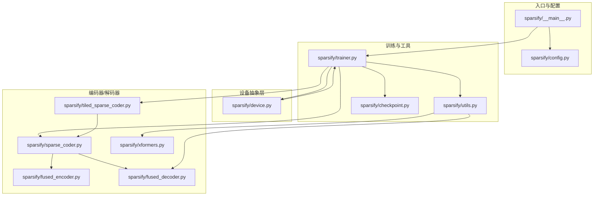
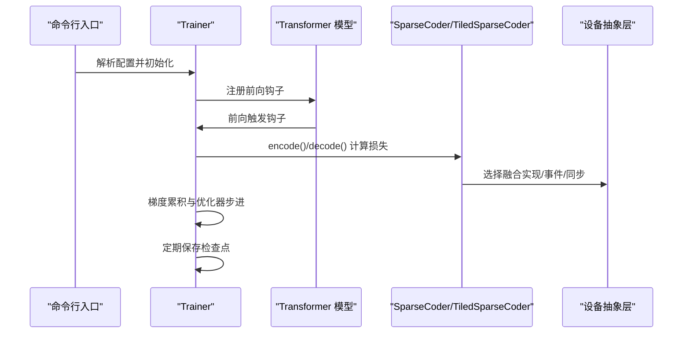
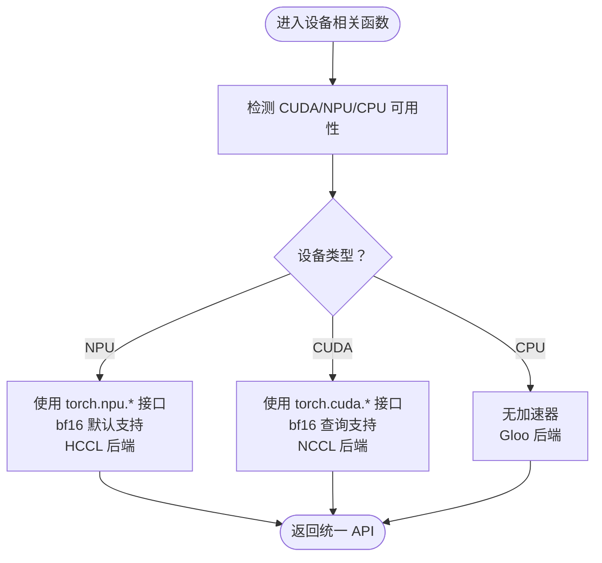
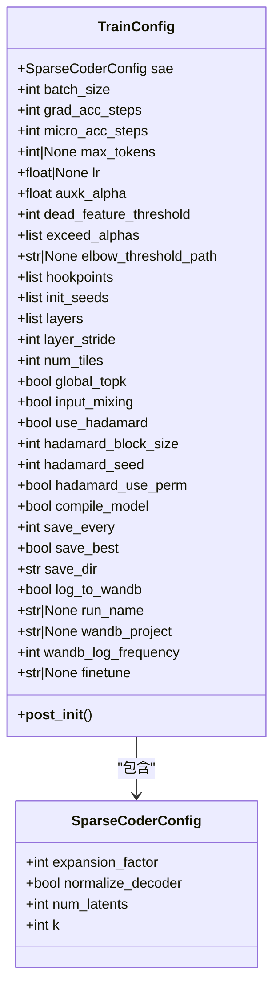
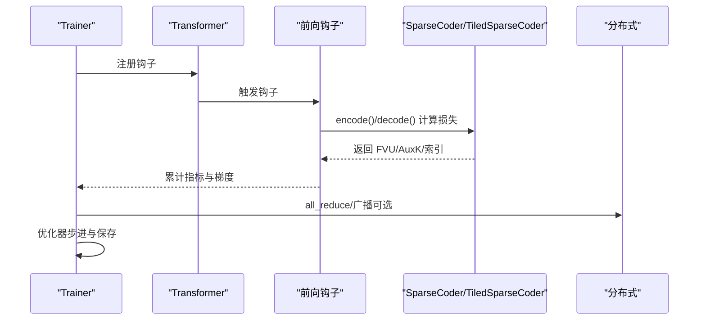
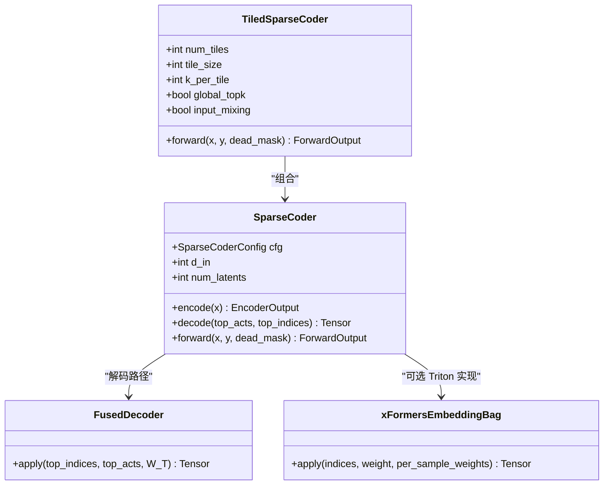
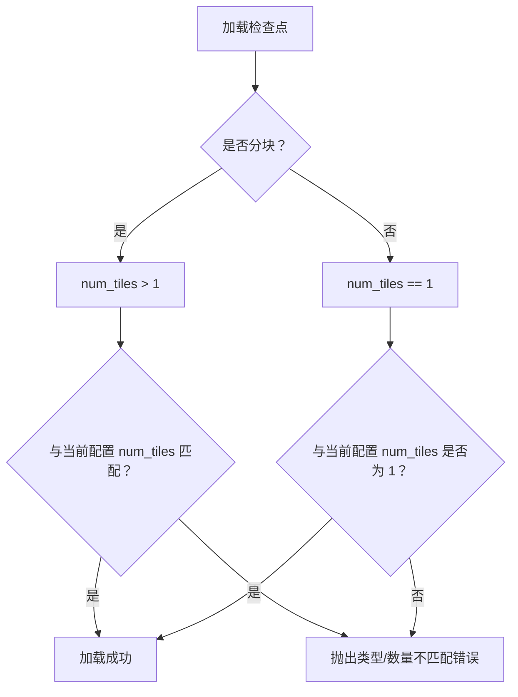
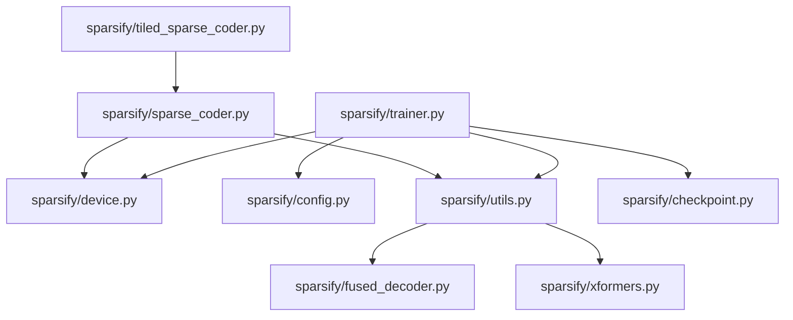

# 扩展机制与兼容性

<cite>
**本文引用的文件**
- [sparsify/__init__.py](file://sparsify/__init__.py)
- [sparsify/device.py](file://sparsify/device.py)
- [sparsify/config.py](file://sparsify/config.py)
- [sparsify/trainer.py](file://sparsify/trainer.py)
- [sparsify/utils.py](file://sparsify/utils.py)
- [sparsify/sparse_coder.py](file://sparsify/sparse_coder.py)
- [sparsify/tiled_sparse_coder.py](file://sparsify/tiled_sparse_coder.py)
- [sparsify/checkpoint.py](file://sparsify/checkpoint.py)
- [sparsify/fused_decoder.py](file://sparsify/fused_decoder.py)
- [sparsify/xformers.py](file://sparsify/xformers.py)
- [tests/conftest.py](file://tests/conftest.py)
- [tests/test_tiled_sparse_coder.py](file://tests/test_tiled_sparse_coder.py)
- [pyproject.toml](file://pyproject.toml)
- [docs/README.md](file://docs/README.md)
- [docs/architecture/core-components.md](file://docs/architecture/core-components.md)
- [docs/training/config-reference.md](file://docs/training/config-reference.md)
- [README.md](file://README.md)
</cite>

## 目录
1. [简介](#简介)
2. [项目结构](#项目结构)
3. [核心组件](#核心组件)
4. [架构总览](#架构总览)
5. [详细组件分析](#详细组件分析)
6. [依赖分析](#依赖分析)
7. [性能考虑](#性能考虑)
8. [故障排查指南](#故障排查指南)
9. [结论](#结论)
10. [附录](#附录)

## 简介
本文件系统化阐述 Sparsify 的扩展机制与兼容性策略，重点覆盖：
- 设备抽象层（CUDA/NPU/CPU）的设计与实现
- 配置系统的扩展点与参数化设计
- 插件化架构与第三方扩展接入方式
- 向后兼容性保障与版本迁移策略
- 新功能模块的集成模式与 API 扩展指南
- 扩展开发最佳实践与注意事项
- 废弃功能处理与迁移路径

## 项目结构
Sparsify 采用“按职责分层”的模块化组织方式，核心训练与推理路径由设备抽象层、配置层、训练器、编码器/解码器实现以及工具函数组成；同时提供分块稀疏编码器以支持大规模激活维度的高效训练。

图示来源
- [sparsify/__init__.py](file://sparsify/__init__.py)
- [sparsify/device.py](file://sparsify/device.py)
- [sparsify/config.py](file://sparsify/config.py)
- [sparsify/trainer.py](file://sparsify/trainer.py)
- [sparsify/utils.py](file://sparsify/utils.py)
- [sparsify/sparse_coder.py](file://sparsify/sparse_coder.py)
- [sparsify/tiled_sparse_coder.py](file://sparsify/tiled_sparse_coder.py)
- [sparsify/checkpoint.py](file://sparsify/checkpoint.py)
- [sparsify/fused_decoder.py](file://sparsify/fused_decoder.py)
- [sparsify/xformers.py](file://sparsify/xformers.py)

章节来源
- [README.md: 71–103:71-103](file://README.md#L71-L103)
- [docs/README.md: 1–34:1-34](file://docs/README.md#L1-L34)
- [docs/architecture/core-components.md: 1–128:1-128](file://docs/architecture/core-components.md#L1-L128)

## 核心组件
- 设备抽象层：统一 CUDA/NPU/CPU 能力，屏蔽底层差异，提供设备类型检测、bf16 支持判定、事件与同步、分布式后端选择等能力。
- 配置系统：以数据类定义架构与训练参数，提供默认值、校验规则与序列化/反序列化能力。
- 训练器：基于前向钩子驱动的 SAE 训练循环，支持多种子初始化、梯度累积、微批、DDP、超参指标与检查点管理。
- 编码器/解码器：标准与分块 SAE 实现，内置融合前向/反向路径以提升加速器性能；解码路径根据设备自动选择融合实现。
- 工具与检查点：宽度解析、早停、模块替换、检查点保存/加载与跨设备兼容性校验。

章节来源
- [sparsify/device.py: 1–118:1-118](file://sparsify/device.py#L1-L118)
- [sparsify/config.py: 1–149:1-149](file://sparsify/config.py#L1-L149)
- [sparsify/trainer.py: 1–760:1-760](file://sparsify/trainer.py#L1-L760)
- [sparsify/sparse_coder.py: 1–269:1-269](file://sparsify/sparse_coder.py#L1-L269)
- [sparsify/tiled_sparse_coder.py: 1–342:1-342](file://sparsify/tiled_sparse_coder.py#L1-L342)
- [sparsify/utils.py: 1–227:1-227](file://sparsify/utils.py#L1-L227)
- [sparsify/checkpoint.py: 1–302:1-302](file://sparsify/checkpoint.py#L1-L302)

## 架构总览
Sparsify 的扩展性建立在“设备抽象层 + 配置驱动 + 组件化模块 + 检查点契约”的基础上。设备抽象层确保同一套训练/推理代码在不同硬件上无缝运行；配置系统提供参数化扩展点；训练器通过钩子与模块化组件协作；检查点契约保证跨版本与跨设备的可恢复性。

图示来源
- [sparsify/trainer.py: 39–760:39-760](file://sparsify/trainer.py#L39-L760)
- [sparsify/sparse_coder.py: 176–239:176-239](file://sparsify/sparse_coder.py#L176-L239)
- [sparsify/tiled_sparse_coder.py: 102–140:102-140](file://sparsify/tiled_sparse_coder.py#L102-L140)
- [sparsify/device.py: 101–118:101-118](file://sparsify/device.py#L101-L118)

## 详细组件分析

### 设备抽象层（CUDA/NPU/CPU）
- 设备检测与选择：自动探测 CUDA 或 NPU 可用性，回退至 CPU；提供统一的设备字符串与设备对象构造。
- bf16 支持：针对不同后端返回是否支持 bf16；在 NPU 上默认支持，在 CUDA 上查询底层能力。
- 分布式后端：NPU 使用 HCCL，CUDA 使用 NCCL，CPU 使用 Gloo。
- 自动精度上下文：提供装饰器在运行时根据设备类型选择 autocast 策略。
- 事件与同步：封装事件创建与同步，避免直接调用底层 API。

图示来源
- [sparsify/device.py: 18–118:18-118](file://sparsify/device.py#L18-L118)

章节来源
- [sparsify/device.py: 1–118:1-118](file://sparsify/device.py#L1-L118)

### 配置系统（扩展点与参数化）
- SparseCoderConfig：定义 SAE 架构级参数（扩展因子、归一化、隐变量数、稀疏度等），支持序列化/反序列化。
- TrainConfig：定义训练循环参数（批大小、梯度累积、微批、最大 token 数、学习率、辅助损失权重、死特征阈值、钩子点、分块训练、Hadamard 旋转、编译开关、保存与日志、微调路径等），并在初始化时执行多项校验。
- 参数化设计：通过数据类与简单解析库组合，提供灵活的 CLI/JSON 配置入口；训练器在启动时对关键参数进行一致性校验，确保运行安全。

图示来源
- [sparsify/config.py: 7–149:7-149](file://sparsify/config.py#L7-L149)

章节来源
- [sparsify/config.py: 1–149:1-149](file://sparsify/config.py#L1-L149)
- [docs/training/config-reference.md: 1–193:1-193](file://docs/training/config-reference.md#L1-L193)

### 训练器（钩子驱动与模块化）
- 钩子点解析：支持显式钩子点或基于层列表推断；支持范围模式展开与通配匹配。
- 多种子初始化：每个钩子点可按种子列表初始化多个 SAE 实例。
- 分块训练：在多 tile 场景下，支持 per-tile 与 global-topk 两种模式；可选输入混合矩阵。
- 指标与日志：计算 FVU、AuxK、Exceed 指标；支持 W&B 日志与跨进程聚合。
- 检查点：保存/加载 SAE 权重、优化器状态、训练状态、最佳模型快照与 Hadamard 旋转状态。

图示来源
- [sparsify/trainer.py: 39–760:39-760](file://sparsify/trainer.py#L39-L760)
- [sparsify/checkpoint.py: 149–302:149-302](file://sparsify/checkpoint.py#L149-L302)

章节来源
- [sparsify/trainer.py: 1–760:1-760](file://sparsify/trainer.py#L1-L760)
- [sparsify/checkpoint.py: 1–302:1-302](file://sparsify/checkpoint.py#L1-L302)

### 编码器/解码器（融合实现与设备适配）
- 标准 SAE：线性编码器 + 可选解码器；编码阶段使用融合实现；解码阶段根据设备类型选择融合/原生实现。
- 分块 SAE：将隐藏维切分为多个 tile，每个 tile 独立训练 SAE；支持 per-tile 与 global-topk 两种前向路径；可选输入混合矩阵。
- 融合解码器：在 NPU 上提供自定义 autograd 函数，避免弱后端回退；在 CUDA 上提供 Triton 版本；CPU 回退到原生实现。
- 自动选择：工具模块根据设备类型动态选择最优解码实现。

图示来源
- [sparsify/sparse_coder.py: 36–269:36-269](file://sparsify/sparse_coder.py#L36-L269)
- [sparsify/tiled_sparse_coder.py: 17–342:17-342](file://sparsify/tiled_sparse_coder.py#L17-L342)
- [sparsify/fused_decoder.py: 27–107:27-107](file://sparsify/fused_decoder.py#L27-L107)
- [sparsify/xformers.py: 188–218:188-218](file://sparsify/xformers.py#L188-L218)

章节来源
- [sparsify/sparse_coder.py: 1–269:1-269](file://sparsify/sparse_coder.py#L1-L269)
- [sparsify/tiled_sparse_coder.py: 1–342:1-342](file://sparsify/tiled_sparse_coder.py#L1-L342)
- [sparsify/utils.py: 173–227:173-227](file://sparsify/utils.py#L173-L227)
- [sparsify/fused_decoder.py: 1–107:1-107](file://sparsify/fused_decoder.py#L1-L107)
- [sparsify/xformers.py: 1–218:1-218](file://sparsify/xformers.py#L1-L218)

### 检查点与兼容性（跨设备/跨版本）
- 检查点布局：顶层 config.json、训练状态 state.pt、优化器状态、各钩子点下的 SAE 权重与配置、可选最佳快照与 Hadamard 状态。
- 跨设备兼容：在加载时校验是否为分块/非分块格式，若不匹配则抛出明确错误；确保 num_tiles 一致。
- 版本与契约：通过 safetensors 与 JSON 配置文件记录权重与元数据，保证跨版本可读取与迁移。

图示来源
- [sparsify/checkpoint.py: 22–73:22-73](file://sparsify/checkpoint.py#L22-L73)

章节来源
- [sparsify/checkpoint.py: 1–302:1-302](file://sparsify/checkpoint.py#L1-L302)

### 插件化架构与第三方扩展接入
- 钩子点扩展：通过扩展范围语法与通配符匹配任意模块路径，训练器按名称解析并注册钩子，无需修改核心逻辑。
- 解码器实现替换：工具模块根据设备类型动态绑定解码实现，新增后端只需提供对应实现并更新选择逻辑。
- 模块替换：工具函数支持动态替换模型中的子模块，便于接入第三方模块或自定义组件。
- 配置扩展：通过数据类字段扩展训练参数，配合校验逻辑保证参数合法性。

章节来源
- [sparsify/trainer.py: 39–116:39-116](file://sparsify/trainer.py#L39-L116)
- [sparsify/utils.py: 156–171:156-171](file://sparsify/utils.py#L156-L171)
- [sparsify/config.py: 124–149:124-149](file://sparsify/config.py#L124-L149)

### 向后兼容性与版本迁移
- 文档与代码优先级：文档强调以代码为准，避免文档与实现脱节。
- 配置校验：训练配置在初始化时执行严格校验，防止非法参数导致运行时异常。
- 检查点契约：通过标准化文件名与层级结构，确保不同版本间可恢复。
- 平台策略：当前以 CUDA 为主，NPU 保留兼容路径，避免破坏既有部署。

章节来源
- [docs/README.md: 31–34:31-34](file://docs/README.md#L31-L34)
- [docs/architecture/core-components.md: 97–128:97-128](file://docs/architecture/core-components.md#L97-L128)
- [sparsify/config.py: 124–149:124-149](file://sparsify/config.py#L124-L149)

### 新功能模块集成模式与 API 扩展指南
- 新增设备后端：在设备抽象层中添加可用性检测与后端映射，确保 bf16 支持、事件与同步、分布式后端等接口一致。
- 新增训练模式：在训练器中扩展钩子行为或指标计算，保持与现有分布式与日志流程兼容。
- 新增解码实现：在工具模块中增加实现选择逻辑，确保与现有 SAE 接口签名一致。
- 新增配置项：在数据类中添加字段并补充校验逻辑，必要时在训练器中处理新参数。

章节来源
- [sparsify/device.py: 101–118:101-118](file://sparsify/device.py#L101-L118)
- [sparsify/trainer.py: 282–290:282-290](file://sparsify/trainer.py#L282-L290)
- [sparsify/utils.py: 185–197:185-197](file://sparsify/utils.py#L185-L197)
- [sparsify/config.py: 124–149:124-149](file://sparsify/config.py#L124-L149)

### 扩展开发最佳实践与注意事项
- 保持设备无关：所有硬件相关逻辑集中在设备抽象层，其他模块只依赖统一接口。
- 明确契约：检查点与配置文件遵循固定命名与层级，避免硬编码路径。
- 充分测试：利用测试夹具与设备检测标记，确保在不同后端上行为一致。
- 渐进演进：新增功能先在小规模场景验证，再逐步扩大范围。

章节来源
- [tests/conftest.py: 1–14:1-14](file://tests/conftest.py#L1-L14)
- [tests/test_tiled_sparse_coder.py: 218–280:218-280](file://tests/test_tiled_sparse_coder.py#L218-L280)

### 废弃功能处理与迁移路径
- 平台定位：文档明确当前以 CUDA 为主，NPU 保留兼容路径，避免将 NPU 作为主要目标平台。
- 配置降级：当特定后端不支持某特性（如编译开关）时，配置会在初始化时自动降级，保证运行稳定。
- 迁移建议：若需从 NPU 迁移到 CUDA，优先检查 bf16 支持与融合实现差异，确保数值稳定性与性能。

章节来源
- [docs/README.md: 3–17:3-17](file://docs/README.md#L3-L17)
- [sparsify/config.py: 138–142:138-142](file://sparsify/config.py#L138-L142)

## 依赖分析
- 依赖关系：训练器依赖设备抽象层、配置、数据与工具模块；编码器/解码器依赖设备抽象与融合实现；检查点模块依赖训练器状态与 SAE 实现。
- 外部依赖：PyTorch、Transformers、Datasets、Accelerate、Simple-Parsing、Safetensors、Triton 等。

图示来源
- [sparsify/trainer.py: 21–34:21-34](file://sparsify/trainer.py#L21-L34)
- [sparsify/sparse_coder.py: 14–17:14-17](file://sparsify/sparse_coder.py#L14-L17)
- [sparsify/utils.py: 185–197:185-197](file://sparsify/utils.py#L185-L197)

章节来源
- [pyproject.toml: 12–28:12-28](file://pyproject.toml#L12-L28)

## 性能考虑
- 融合实现：编码器/解码器采用自定义 autograd 与 Triton 内核，减少小核开销与内存带宽压力。
- 事件与同步：在加速器后端使用事件计时与同步，避免 CPU 等待；在 CPU 回退到高精度计时。
- 分块训练：通过 tile 切分与可选输入混合，平衡通信与计算，适合大模型激活维度。
- 编译优化：在 CUDA 上可对 Transformer 层进行编译以融合小算子，降低内核启动开销。

章节来源
- [sparsify/fused_decoder.py: 1–107:1-107](file://sparsify/fused_decoder.py#L1-L107)
- [sparsify/xformers.py: 1–218:1-218](file://sparsify/xformers.py#L1-L218)
- [sparsify/trainer.py: 282–290:282-290](file://sparsify/trainer.py#L282-L290)
- [sparsify/config.py: 100–104:100-104](file://sparsify/config.py#L100-L104)

## 故障排查指南
- 设备不可用：确认 CUDA/NPU 是否安装并可用；检查设备抽象层的可用性检测逻辑。
- 检查点不匹配：若出现类型或 num_tiles 不匹配错误，检查当前配置与检查点是否一致。
- 指标异常：关注 FVU/AuxK/Exceed 指标的计算边界条件与数值稳定性。
- 分布式问题：确认分布式后端与环境变量设置，确保 all_reduce 与广播行为一致。

章节来源
- [sparsify/checkpoint.py: 44–73:44-73](file://sparsify/checkpoint.py#L44-L73)
- [tests/test_tiled_sparse_coder.py: 218–280:218-280](file://tests/test_tiled_sparse_coder.py#L218-L280)

## 结论
Sparsify 的扩展机制与兼容性策略以“设备抽象层 + 配置驱动 + 组件化模块 + 检查点契约”为核心，既保证了在 CUDA/NPU/CPU 上的一致行为，又为未来扩展提供了清晰的接入点。通过严格的配置校验、标准化的检查点布局与模块化的实现，开发者可以安全地引入新功能、替换实现并进行版本迁移。

## 附录
- 推荐阅读顺序：概览 → 快速开始 → 配置参考 → 训练流水线 → 核心组件 → 性能说明 → 导出流程
- 历史材料：归档文档用于背景参考，当前以活跃代码为准

章节来源
- [docs/README.md: 18–34:18-34](file://docs/README.md#L18-L34)
- [README.md: 81–103:81-103](file://README.md#L81-L103)