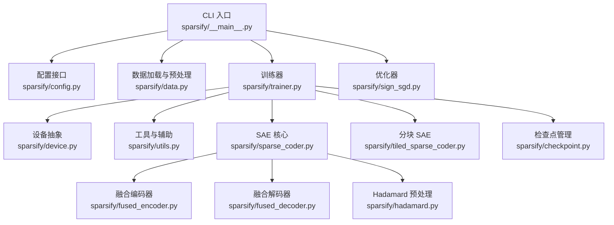
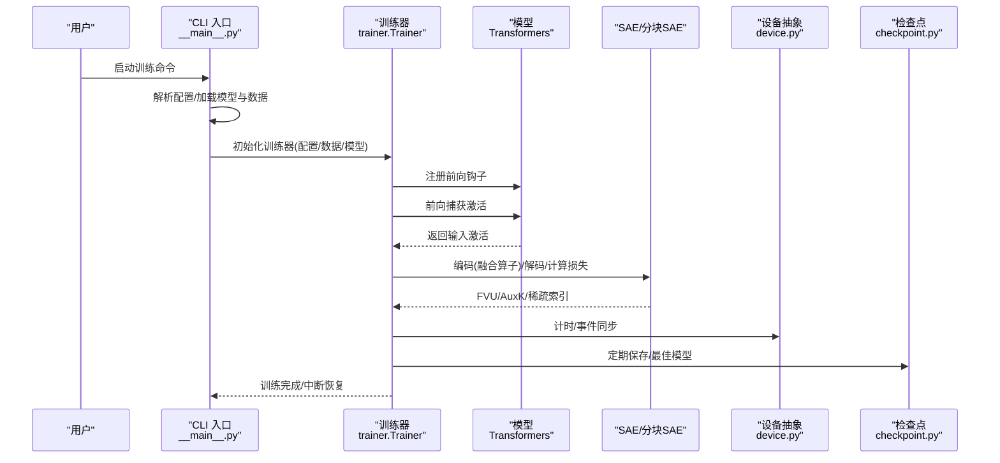
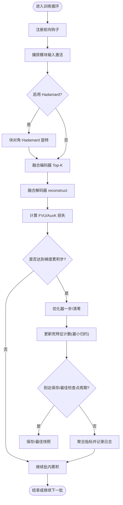
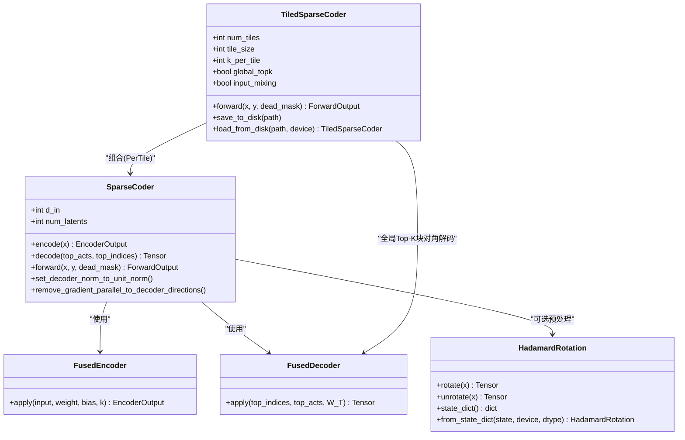
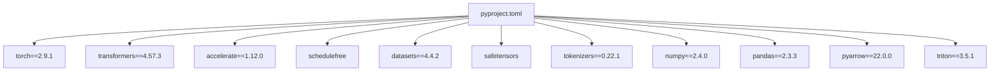

# 架构决策记录

<cite>
**本文引用的文件**
- [README.md](file://README.md)
- [docs/README.md](file://docs/README.md)
- [pyproject.toml](file://pyproject.toml)
- [sparsify/__main__.py](file://sparsify/__main__.py)
- [sparsify/config.py](file://sparsify/config.py)
- [sparsify/trainer.py](file://sparsify/trainer.py)
- [sparsify/sparse_coder.py](file://sparsify/sparse_coder.py)
- [sparsify/tiled_sparse_coder.py](file://sparsify/tiled_sparse_coder.py)
- [sparsify/fused_encoder.py](file://sparsify/fused_encoder.py)
- [sparsify/fused_decoder.py](file://sparsify/fused_decoder.py)
- [sparsify/utils.py](file://sparsify/utils.py)
- [sparsify/device.py](file://sparsify/device.py)
- [sparsify/checkpoint.py](file://sparsify/checkpoint.py)
- [sparsify/data.py](file://sparsify/data.py)
- [sparsify/sign_sgd.py](file://sparsify/sign_sgd.py)
- [sparsify/hadamard.py](file://sparsify/hadamard.py)
</cite>

## 目录
1. [引言](#引言)
2. [项目结构](#项目结构)
3. [核心组件](#核心组件)
4. [架构总览](#架构总览)
5. [详细组件分析](#详细组件分析)
6. [依赖关系分析](#依赖关系分析)
7. [性能考量](#性能考量)
8. [故障排查指南](#故障排查指南)
9. [结论](#结论)
10. [附录](#附录)

## 引言
本文件旨在系统化梳理 Sparsify 项目的架构决策与演进路径，重点覆盖以下方面：
- 技术栈选型依据（PyTorch、Transformers、Accelerate、ScheduleFree 等）
- 架构模式与系统边界定义
- 核心组件设计原理、数据流与接口设计
- 扩展机制、插件式能力与兼容性策略
- 废弃功能处理、迁移策略与向后兼容保障
- 权衡分析与未来发展方向

Sparsify 的目标是围绕 Transformer 模块输入训练稀疏自编码器（SAE），产出可用于下游 LUTurbo 推理流水线的 LUT 友好制品；当前主推 NVIDIA/CUDA 路径，Ascend/NPU 保留兼容性与历史参考。

## 项目结构
Sparsify 采用按职责分层的模块化组织：
- CLI 入口与训练编排：sparsify/__main__.py、sparsify/trainer.py
- 配置与数据：sparsify/config.py、sparsify/data.py
- 模型与算子：sparsify/sparse_coder.py、sparsify/tiled_sparse_coder.py、sparsify/fused_encoder.py、sparsify/fused_decoder.py、sparsify/hadamard.py
- 设备抽象与分布式：sparsify/device.py、sparsify/utils.py
- 检查点与导出：sparsify/checkpoint.py
- 依赖声明：pyproject.toml
- 文档与路线图：docs/README.md、README.md

图表来源
- [sparsify/__main__.py:1-211](file://sparsify/__main__.py#L1-L211)
- [sparsify/trainer.py:1-760](file://sparsify/trainer.py#L1-L760)
- [sparsify/config.py:1-149](file://sparsify/config.py#L1-L149)
- [sparsify/sparse_coder.py:1-269](file://sparsify/sparse_coder.py#L1-L269)
- [sparsify/tiled_sparse_coder.py:1-342](file://sparsify/tiled_sparse_coder.py#L1-L342)
- [sparsify/fused_encoder.py:1-107](file://sparsify/fused_encoder.py#L1-L107)
- [sparsify/fused_decoder.py:1-107](file://sparsify/fused_decoder.py#L1-L107)
- [sparsify/hadamard.py:1-259](file://sparsify/hadamard.py#L1-L259)
- [sparsify/checkpoint.py:1-302](file://sparsify/checkpoint.py#L1-L302)
- [sparsify/data.py:1-158](file://sparsify/data.py#L1-L158)
- [sparsify/device.py:1-118](file://sparsify/device.py#L1-L118)
- [sparsify/utils.py:1-227](file://sparsify/utils.py#L1-L227)
- [sparsify/sign_sgd.py:1-24](file://sparsify/sign_sgd.py#L1-L24)

章节来源
- [README.md:1-154](file://README.md#L1-L154)
- [docs/README.md:1-34](file://docs/README.md#L1-L34)

## 核心组件
- 配置体系：统一的训练与 SAE 配置对象，支持自动校验、分块训练、Hadamard 预处理、编译开关等。
- 训练器：基于前向钩子捕获激活，Top-K 稀疏化，FVU 评估，可选 AuxK 死特征恢复，DDP 支持，延迟指标聚合与日志。
- SAE 核心：线性编码器 + 解码器，融合编码/解码算子，bf16 自动混合精度加速，可选单位范数解码器。
- 分块 SAE：将输入按维度切分为多块，每块独立训练 SAE，支持全局 Top-K 与输入混洗矩阵。
- 设备抽象：统一 CUDA/NPU/CPu 能力，自动 bf16 支持检测，事件计时与分布式后端选择。
- 数据管线：HF 数据集与内存映射数据集，GPT 风格分块与分词，多进程并行处理。
- 检查点：支持常规/分块 SAE 混合格式，跨设备/类型迁移，训练状态与最佳模型快照。
- 工具函数：层列表解析、部分前向停止、维度探测、解码实现选择（CUDA/NPU/默认）。

章节来源
- [sparsify/config.py:1-149](file://sparsify/config.py#L1-L149)
- [sparsify/trainer.py:1-760](file://sparsify/trainer.py#L1-L760)
- [sparsify/sparse_coder.py:1-269](file://sparsify/sparse_coder.py#L1-L269)
- [sparsify/tiled_sparse_coder.py:1-342](file://sparsify/tiled_sparse_coder.py#L1-L342)
- [sparsify/device.py:1-118](file://sparsify/device.py#L1-L118)
- [sparsify/data.py:1-158](file://sparsify/data.py#L1-L158)
- [sparsify/checkpoint.py:1-302](file://sparsify/checkpoint.py#L1-L302)
- [sparsify/utils.py:1-227](file://sparsify/utils.py#L1-L227)

## 架构总览
Sparsify 的训练流水线以“钩子驱动的激活捕获”为核心，结合分块与预处理策略，形成高吞吐、低开销的稀疏编码训练闭环。系统边界清晰：上游为 Transformers 模型与数据集，下游为检查点与阈值统计，中间层提供设备无关的算子与分布式能力。

图表来源
- [sparsify/__main__.py:131-211](file://sparsify/__main__.py#L131-L211)
- [sparsify/trainer.py:162-729](file://sparsify/trainer.py#L162-L729)
- [sparsify/checkpoint.py:246-302](file://sparsify/checkpoint.py#L246-L302)
- [sparsify/device.py:75-99](file://sparsify/device.py#L75-L99)

## 详细组件分析

### 组件一：训练器（Trainer）
- 设计要点
  - 基于前向钩子收集各模块输入激活，支持范围/通配符模式展开与自然排序。
  - 支持分块 SAE 与全局 Top-K，以及输入混洗矩阵，提升跨子空间的信息流动。
  - 使用 ScheduleFreeWrapperReference + SignSGD，避免显式动量与学习率调度开销。
  - 指标聚合与延迟 allreduce，减少通信频次；计时事件与设备无关封装。
  - 死特征检测采用“累计 token 数 - 最近一次触发”的最小归约策略，避免昂贵的 per-forward scatter。
- 数据流
  - 输入批经模型前向，钩子回调中执行编码/解码与指标计算，累积到优化步再反向传播。
  - 指标（FVU、AuxK、Exceed）按 hookpoint 聚合，周期性 allreduce 后写入日志。
- 接口设计
  - fit() 为主流程入口；maybe_all_reduce/maybe_all_cat 提供分布式一致性；save/save_best 提供检查点策略。
- 复杂度与性能
  - 编码器融合算子在大 M/N 时切换稠密 matmul，兼顾内存与吞吐；解码器在 CUDA/NPU 上采用自定义 autograd 函数，避免回退。
- 错误处理
  - 层/stride 冲突、Hadamard block_size 校验、Elbow 阈值文件存在性校验、编译开关在非 CUDA 平台自动降级。

图表来源
- [sparsify/trainer.py:347-729](file://sparsify/trainer.py#L347-L729)
- [sparsify/sparse_coder.py:176-239](file://sparsify/sparse_coder.py#L176-L239)
- [sparsify/tiled_sparse_coder.py:102-253](file://sparsify/tiled_sparse_coder.py#L102-L253)

章节来源
- [sparsify/trainer.py:1-760](file://sparsify/trainer.py#L1-L760)
- [sparsify/config.py:28-149](file://sparsify/config.py#L28-L149)

### 组件二：SAE 与分块 SAE
- 标准 SAE
  - 线性编码器 + 可选单位范数解码器；融合编码器/解码器自定义 autograd，bf16 autocast 提升吞吐。
  - 支持 AuxK 死特征辅助损失，按死特征比例缩放。
- 分块 SAE
  - 将 d_in 均匀切分为 T 块，每块独立训练 SAE；支持 per-tile 与 global-topk 两种策略。
  - 可选输入混洗矩阵，通过 T×T 学习跨块信息融合；在 global-topk 模式下构建块对角解码器一次性解码。
- 接口与兼容
  - 统一 save_to_disk/load_from_disk；分块/非分块检查点格式兼容；支持批量加载。

图表来源
- [sparsify/sparse_coder.py:36-269](file://sparsify/sparse_coder.py#L36-L269)
- [sparsify/tiled_sparse_coder.py:17-342](file://sparsify/tiled_sparse_coder.py#L17-L342)
- [sparsify/fused_encoder.py:21-107](file://sparsify/fused_encoder.py#L21-L107)
- [sparsify/fused_decoder.py:27-107](file://sparsify/fused_decoder.py#L27-L107)
- [sparsify/hadamard.py:66-259](file://sparsify/hadamard.py#L66-L259)

章节来源
- [sparsify/sparse_coder.py:1-269](file://sparsify/sparse_coder.py#L1-L269)
- [sparsify/tiled_sparse_coder.py:1-342](file://sparsify/tiled_sparse_coder.py#L1-L342)
- [sparsify/fused_encoder.py:1-107](file://sparsify/fused_encoder.py#L1-L107)
- [sparsify/fused_decoder.py:1-107](file://sparsify/fused_decoder.py#L1-L107)
- [sparsify/hadamard.py:1-259](file://sparsify/hadamard.py#L1-L259)

### 组件三：设备抽象与分布式
- 设备抽象
  - 统一检测 CUDA/NPU/CPu，自动 bf16 支持判断，事件计时与同步，分布式后端选择（NCCL/HCCN/Gloo）。
- 分布式训练
  - DDP 包裹 SAE；无同步反向减少通信；all_reduce 聚合指标；按世界规模整除批大小避免死锁。
- 计时与性能
  - 前向与指标计算事件分离，仅在日志周期同步，降低同步成本。

章节来源
- [sparsify/device.py:1-118](file://sparsify/device.py#L1-L118)
- [sparsify/trainer.py:162-729](file://sparsify/trainer.py#L162-L729)

### 组件四：数据与预处理
- 数据源
  - HF 数据集与内存映射数据集；支持 load_from_disk 与分词；自动 EOS 拼接与固定长度分块。
- 预处理
  - chunk_and_tokenize 支持多进程并行；MemmapDataset 提供高效读取与分片。

章节来源
- [sparsify/data.py:1-158](file://sparsify/data.py#L1-L158)
- [sparsify/__main__.py:81-128](file://sparsify/__main__.py#L81-L128)

### 组件五：检查点与导出
- 检查点格式
  - 支持常规/分块 SAE；cfg.json 记录 d_in、num_tiles、k_per_tile 等元信息；权重采用 safetensors。
- 恢复与迁移
  - load_sae_checkpoint 校验 num_tiles 一致性；expand_range_pattern 支持层范围/通配符；支持从 Hub/本地加载。
- 导出
  - 结合阈值统计与导出脚本，生成 LUT 友好制品。

章节来源
- [sparsify/checkpoint.py:1-302](file://sparsify/checkpoint.py#L1-L302)
- [sparsify/sparse_coder.py:64-153](file://sparsify/sparse_coder.py#L64-L153)
- [sparsify/tiled_sparse_coder.py:278-342](file://sparsify/tiled_sparse_coder.py#L278-L342)

## 依赖关系分析
- 框架与库
  - PyTorch 2.9.1：核心张量与自动微分；torch.compile 用于层融合。
  - Transformers 4.57.3：模型加载与分词器；Accelerate 1.12.0：分布式与设备抽象。
  - ScheduleFree：无动量 SGD 优化器包装器。
  - safetensors：安全权重序列化。
  - datasets/numpy/pandas/pyarrow：数据处理与存储。
- 版本策略
  - 严格 pinning 保证稳定性；脚本入口通过 setuptools 暴露。

图表来源
- [pyproject.toml:12-28](file://pyproject.toml#L12-L28)

章节来源
- [pyproject.toml:1-131](file://pyproject.toml#L1-L131)

## 性能考量
- 算子融合
  - 编码器/解码器自定义 autograd，在 CUDA/NPU 上避免回退，阈值根据 M×N 决定稠密 vs 散射路径。
- 计时与同步
  - 前向与指标事件分离，仅在日志周期同步；指标聚合 batch allreduce，减少通信次数。
- 梯度累积与死特征检测
  - 延迟归约与最小归约策略替代 per-forward scatter，显著降低 NPU 上的 AI_CPU fallback 成本。
- 编译与融合
  - torch.compile 对 Transformer 层进行小核融合，减少内核启动开销。
- 设备无关 bf16
  - device_autocast 在 CUDA/NPU 上启用 bf16，显著提升吞吐。

章节来源
- [sparsify/fused_encoder.py:18-107](file://sparsify/fused_encoder.py#L18-L107)
- [sparsify/fused_decoder.py:24-107](file://sparsify/fused_decoder.py#L24-L107)
- [sparsify/trainer.py:282-729](file://sparsify/trainer.py#L282-L729)
- [sparsify/device.py:101-118](file://sparsify/device.py#L101-L118)

## 故障排查指南
- 常见问题
  - 层/stride 冲突：TrainConfig 校验禁止同时指定 layers 与 layer_stride。
  - Elbow 阈值文件不存在：配置校验会报错。
  - Hadamard block_size 非正或非 2 的幂：抛出异常。
  - 编译开关在非 CUDA 平台自动降级：compile_model=false。
  - 分块/非分块检查点类型不匹配：resume/finetune 时强制校验 num_tiles。
- 日志与可视化
  - WandB 可选开启；失败自动降级；分布式 rank 0 输出日志。
- 恢复与迁移
  - 支持从命名模式匹配的最近检查点恢复；支持从 Hub/本地加载单个/多个 SAE。

章节来源
- [sparsify/config.py:124-149](file://sparsify/config.py#L124-L149)
- [sparsify/checkpoint.py:44-73](file://sparsify/checkpoint.py#L44-L73)
- [sparsify/__main__.py:173-196](file://sparsify/__main__.py#L173-L196)

## 结论
Sparsify 通过“钩子驱动 + 融合算子 + 设备无关抽象 + 分布式优化”的组合拳，实现了在 NVIDIA/CUDA 主路径上的高效 SAE 训练，并为 Ascend/NPU 保留兼容性。配置即契约（配置对象含校验）、模块化组件（SAE/分块 SAE/设备/检查点）与严格的版本 pinning，共同确保了系统的可维护性与可扩展性。未来可在以下方向演进：
- 更细粒度的设备特定优化（如 NPU 算子库适配）。
- 动态分块与自适应 Top-K 策略。
- 更丰富的导出格式与下游集成接口。
- 可插拔的损失/正则项与学习率调度器。

## 附录
- 端到端工作流
  - 训练 SAE → 计算肘部阈值 → 导出 LUT 制品。
- CLI 入口与参数
  - 位置参数：模型名、数据集名；常用参数：上下文长度、批大小、梯度累积、Hookpoints、保存目录与运行名等。
- 文档与路线
  - 优先阅读 overview、quickstart、config-reference、qwen3-guide、training-pipeline、export/sae-to-lut。

章节来源
- [README.md:61-103](file://README.md#L61-L103)
- [docs/README.md:18-34](file://docs/README.md#L18-L34)
- [sparsify/__main__.py:31-80](file://sparsify/__main__.py#L31-L80)