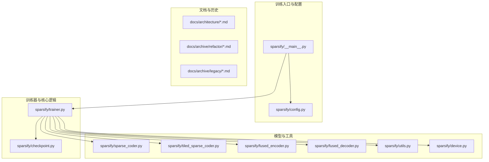
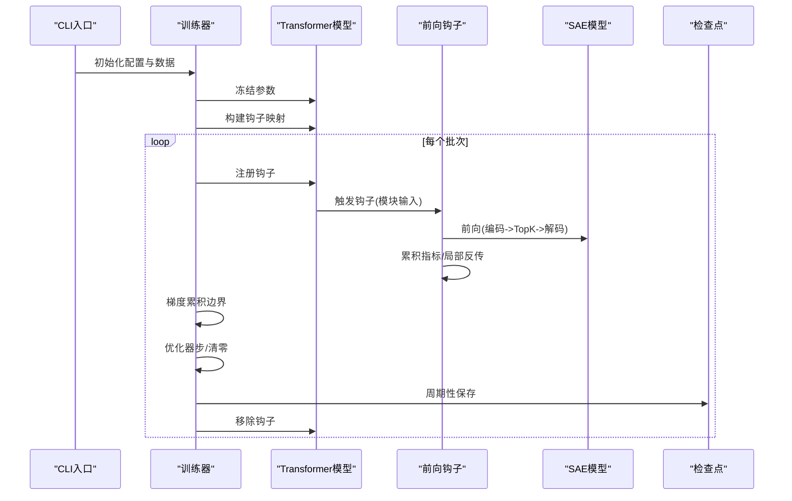
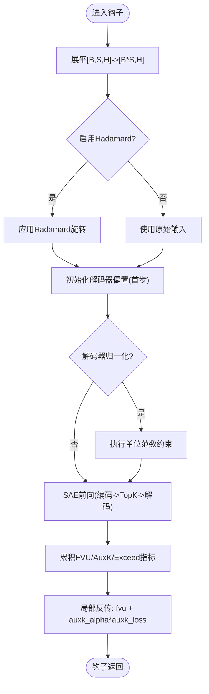
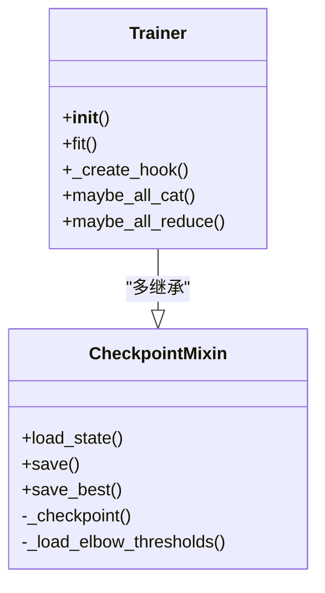
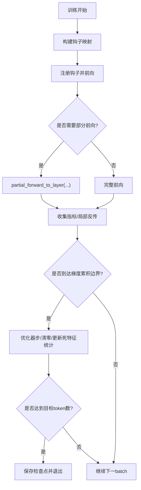
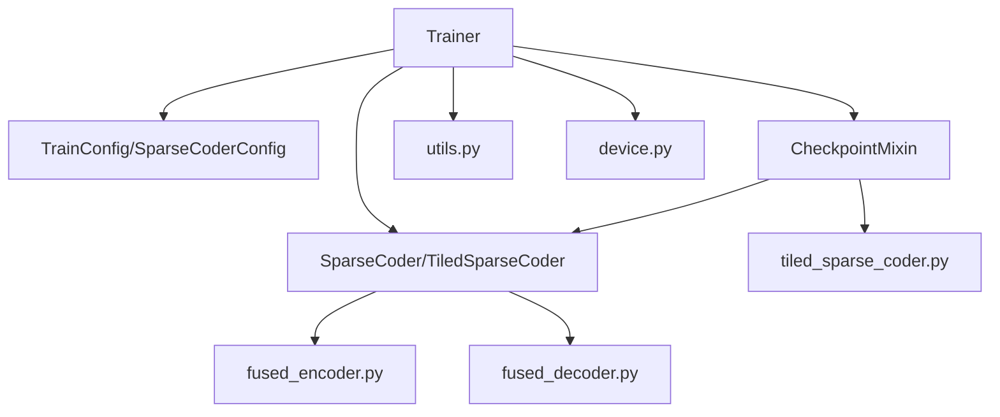

# 架构演进历程

<cite>
**本文档引用的文件**
- [README.md](file://README.md)
- [docs/architecture/core-components.md](file://docs/architecture/core-components.md)
- [docs/architecture/training-pipeline.md](file://docs/architecture/training-pipeline.md)
- [docs/architecture/performance.md](file://docs/architecture/performance.md)
- [docs/archive/refactor/refactoring_design.md](file://docs/archive/refactor/refactoring_design.md)
- [docs/archive/refactor/hook_mode_design.md](file://docs/archive/refactor/hook_mode_design.md)
- [docs/archive/legacy/code_walkthrough.md](file://docs/archive/legacy/code_walkthrough.md)
- [docs/archive/legacy/trainer_code_walkthrough.md](file://docs/archive/legacy/trainer_code_walkthrough.md)
- [docs/archive/legacy/hook_function_analysis.md](file://docs/archive/legacy/hook_function_analysis.md)
- [docs/overview.md](file://docs/overview.md)
- [docs/training/quickstart.md](file://docs/training/quickstart.md)
- [sparsify/__main__.py](file://sparsify/__main__.py)
- [sparsify/trainer.py](file://sparsify/trainer.py)
- [sparsify/config.py](file://sparsify/config.py)
- [sparsify/sparse_coder.py](file://sparsify/sparse_coder.py)
- [sparsify/checkpoint.py](file://sparsify/checkpoint.py)
</cite>

## 目录
1. [简介](#简介)
2. [项目结构](#项目结构)
3. [核心组件](#核心组件)
4. [架构总览](#架构总览)
5. [详细组件分析](#详细组件分析)
6. [依赖关系分析](#依赖关系分析)
7. [性能考量](#性能考量)
8. [故障排查指南](#故障排查指南)
9. [结论](#结论)
10. [附录](#附录)

## 简介
本文件系统性梳理 Sparsify 项目从早期版本到当前架构的演进历程，重点阐述以下方面：
- 钩子模式设计的演进：从早期支持多种 hook 模式到当前聚焦模块输入的简化路径
- 训练器重构的历史背景与改进动机：从庞大且分支复杂的训练器到精简统一的主干路径
- 从单机训练到分布式训练的架构升级：DDP 数据并行与部分前向优化
- 架构决策的时间线、版本对比与迁移路径
- 技术债处理与性能优化案例，帮助开发者理解系统设计的历史脉络与发展趋向

## 项目结构
Sparsify 当前采用以功能域为中心的组织方式，核心训练与导出流水线由 CLI 入口、配置、训练器、SAE 模型、检查点管理等模块构成。文档侧保留了历史演进资料，便于追溯早期设计。

**图表来源**
- [sparsify/__main__.py:1-211](file://sparsify/__main__.py#L1-L211)
- [sparsify/trainer.py:1-760](file://sparsify/trainer.py#L1-L760)
- [sparsify/config.py:1-149](file://sparsify/config.py#L1-L149)
- [sparsify/sparse_coder.py:1-269](file://sparsify/sparse_coder.py#L1-L269)
- [sparsify/checkpoint.py:1-302](file://sparsify/checkpoint.py#L1-L302)

**章节来源**
- [README.md:71-103](file://README.md#L71-L103)
- [docs/overview.md:1-63](file://docs/overview.md#L1-L63)

## 核心组件
当前核心组件围绕以下职责划分：
- sparsify/sparse_coder.py：标准 SAE 模型，负责编码、解码、FVU/AuxK 损失计算与检查点存取
- sparsify/trainer.py：训练协调器，负责钩子点解析、SAE 初始化、DDP 包装、钩子内局部反传、检查点与日志
- sparsify/checkpoint.py：检查点保存/加载工具，含 tiled 检查点适配与阈值加载
- sparsify/config.py：训练配置接口，集中管理超参与约束
- sparsify/fused_encoder.py / fused_decoder.py：加速的自定义 autograd 实现
- sparsify/tiled_sparse_coder.py：分块 SAE 变体，支持 per-tile/global-topk 与可选输入混合
- sparsify/utils.py / device.py：工具函数与设备抽象

**章节来源**
- [docs/architecture/core-components.md:5-128](file://docs/architecture/core-components.md#L5-L128)
- [sparsify/sparse_coder.py:36-269](file://sparsify/sparse_coder.py#L36-L269)
- [sparsify/trainer.py:39-760](file://sparsify/trainer.py#L39-L760)
- [sparsify/checkpoint.py:101-302](file://sparsify/checkpoint.py#L101-L302)
- [sparsify/config.py:7-149](file://sparsify/config.py#L7-L149)

## 架构总览
Sparsify 的训练管线采用“钩子驱动 + 在线训练”的设计：在每个训练步，模型前向触发钩子，钩子内部对模块输入执行 SAE 前向与局部反传，避免离线缓存激活。训练器负责：
- 解析钩子点与宽度，构建 SAE
- 注册钩子，按需进行 Hadamard 预处理与解码器归一化
- 在钩子内累计指标与局部反传，按梯度累积边界执行优化器步
- 周期性保存检查点与记录日志

**图表来源**
- [sparsify/__main__.py:131-211](file://sparsify/__main__.py#L131-L211)
- [sparsify/trainer.py:162-729](file://sparsify/trainer.py#L162-L729)
- [sparsify/sparse_coder.py:189-239](file://sparsify/sparse_coder.py#L189-L239)
- [sparsify/checkpoint.py:199-302](file://sparsify/checkpoint.py#L199-L302)

**章节来源**
- [docs/architecture/training-pipeline.md:1-167](file://docs/architecture/training-pipeline.md#L1-L167)

## 详细组件分析

### 钩子模式设计的演进
- 早期设计：支持 output/input/transcode 三种 hook 模式，通过 hook_mode 参数控制；分布式场景下对输入/输出进行 all_gather
- 当前设计：统一为“模块输入”模式，移除了 hook_mode 参数与相关分支，简化了钩子数据流与分布式处理逻辑
- 关键简化点：
  - 移除 hook_mode 参数与 match 分支
  - 统一以模块输入作为 SAE 训练数据
  - 分布式场景下仅在需要时收集输入/输出，避免不必要的 all_gather

**图表来源**
- [sparsify/trainer.py:347-480](file://sparsify/trainer.py#L347-L480)
- [docs/archive/refactor/hook_mode_design.md:154-186](file://docs/archive/refactor/hook_mode_design.md#L154-L186)

**章节来源**
- [docs/archive/refactor/hook_mode_design.md:4-186](file://docs/archive/refactor/hook_mode_design.md#L4-L186)
- [docs/archive/legacy/hook_function_analysis.md:53-151](file://docs/archive/legacy/hook_function_analysis.md#L53-L151)
- [sparsify/trainer.py:347-480](file://sparsify/trainer.py#L347-L480)

### 训练器重构的历史背景与改进动机
- 背景：早期 trainer.py 超过 1400 行，包含初始化、训练循环、钩子函数、检查点、日志、分布式工具等，条件分支复杂，维护困难
- 改进动机：
  - 保留实际使用功能，移除无脚本验证的分支
  - 统一损失函数为 FVU，移除 CE/KL 端到端路径
  - 简化优化器路径，固定为 SignSGD + ScheduleFree
  - 将检查点逻辑拆分为独立模块，提升内聚性与可读性
- 关键成果：
  - trainer.py 从 1439 行精简至约 700 行
  - 新增 checkpoint.py 提供检查点工具与 Trainer 的 mixin 能力
  - 移除 distribute_modules、multi_topk、outlier_clip、distill 等分支

**图表来源**
- [docs/archive/refactor/refactoring_design.md:85-143](file://docs/archive/refactor/refactoring_design.md#L85-L143)
- [sparsify/trainer.py:39-760](file://sparsify/trainer.py#L39-L760)
- [sparsify/checkpoint.py:101-302](file://sparsify/checkpoint.py#L101-L302)

**章节来源**
- [docs/archive/refactor/refactoring_design.md:1-414](file://docs/archive/refactor/refactoring_design.md#L1-L414)
- [docs/archive/legacy/trainer_code_walkthrough.md:1-538](file://docs/archive/legacy/trainer_code_walkthrough.md#L1-L538)

### 从单机到分布式训练的架构升级
- DDP 数据并行：训练器在首次使用时将 SAE 包装为 DDP，使用 LOCAL_RANK 作为 device_ids，避免旧实现中的 rank 错误
- 部分前向优化：根据钩子点的最大层索引，使用 partial_forward_to_layer 提前停止模型前向，减少无关层计算
- 指标聚合优化：在日志频率步进行批量归约，减少分布式通信次数
- 死特征统计优化：采用“累积+一次性写零”的策略替代 per-forward 的 bool-scatter，避免 NPU 上的 AI_CPU 回退

**图表来源**
- [sparsify/trainer.py:520-729](file://sparsify/trainer.py#L520-L729)
- [docs/architecture/training-pipeline.md:95-125](file://docs/architecture/training-pipeline.md#L95-L125)

**章节来源**
- [docs/architecture/training-pipeline.md:13-125](file://docs/architecture/training-pipeline.md#L13-L125)
- [sparsify/trainer.py:501-514](file://sparsify/trainer.py#L501-L514)

### SAE 模型与性能优化
- 标准 SAE：编码器与解码器权重镜像初始化，可选解码器归一化；前向返回 sae_out、latent 指数、FVU 与 AuxK 损失
- 熔合编码器/解码器：在加速路径中优先使用 scatter-plus-matmul，当稠密中间态过大时回退到 gather/bmm/index_add_
- Hadamard 预处理：可选的块对角 Hadamard 旋转，改善激活结构与异常值行为，作为精度/性能权衡
- torch.compile：在 CUDA 后端启用单层编译以融合元素级核，减少启动开销

**章节来源**
- [docs/architecture/core-components.md:5-76](file://docs/architecture/core-components.md#L5-L76)
- [docs/architecture/performance.md:11-53](file://docs/architecture/performance.md#L11-L53)
- [sparsify/sparse_coder.py:176-239](file://sparsify/sparse_coder.py#L176-L239)

### 检查点与导出流水线
- 检查点格式：包含 config.json、state.pt、优化器状态、每个钩子点的 sae.safetensors 与 cfg.json
- tiled 检查点：当 num_tiles > 1 时，每个 tile 保存独立权重，加载时严格校验 num_tiles 一致性
- 导出路径：训练完成后生成阈值统计与 LUT 导出制品，形成从激活到 LUT 的完整流水线

**章节来源**
- [docs/architecture/training-pipeline.md:126-145](file://docs/architecture/training-pipeline.md#L126-L145)
- [sparsify/checkpoint.py:22-73](file://sparsify/checkpoint.py#L22-L73)
- [README.md:137-147](file://README.md#L137-L147)

## 依赖关系分析
当前架构强调模块内聚与低耦合：
- Trainer 通过 CheckpointMixin 获得检查点能力，避免 trainer.py 与检查点逻辑交叉
- SAE 模型与工具函数解耦，通过 fused_encoder/decoder 与 utils 实现加速与通用逻辑
- 配置集中化，减少跨模块的重复校验与冲突

**图表来源**
- [sparsify/trainer.py:21-34](file://sparsify/trainer.py#L21-L34)
- [sparsify/checkpoint.py:15-17](file://sparsify/checkpoint.py#L15-L17)
- [sparsify/config.py:7-149](file://sparsify/config.py#L7-L149)

**章节来源**
- [sparsify/trainer.py:39-161](file://sparsify/trainer.py#L39-L161)
- [sparsify/checkpoint.py:101-148](file://sparsify/checkpoint.py#L101-L148)

## 性能考量
- BF16 自动混合精度：在支持后端默认开启，显著提升吞吐
- 熔合算子：编码器/解码器在稠密中间态较小情况下使用 scatter-plus-matmul，避免大矩阵运算
- 部分前向：仅运行到满足钩子点所需的最末层，避免无关层计算
- torch.compile：在 CUDA 上对单层进行编译，融合小核减少启动开销
- 指标聚合批量化：在日志频率步进行一次性 all_reduce，降低通信成本

**章节来源**
- [docs/architecture/performance.md:7-75](file://docs/architecture/performance.md#L7-L75)
- [sparsify/trainer.py:490-496](file://sparsify/trainer.py#L490-L496)

## 故障排查指南
- 分布式初始化与设备 ID：确认 LOCAL_RANK 与 device_ids 使用一致，避免 DDP 包装失败
- 梯度累积边界：确保在累积边界执行优化器步与清零，避免梯度泄漏
- 死特征统计：若出现特征长期不激活，检查 dead_feature_threshold 与 num_tokens_since_fired 的同步
- 检查点不匹配：tiled 与非 tiled 检查点不可混用，num_tiles 必须一致
- 日志与 W&B：若日志失败，检查导入与网络连通性，必要时关闭 log_to_wandb

**章节来源**
- [sparsify/trainer.py:501-514](file://sparsify/trainer.py#L501-L514)
- [sparsify/checkpoint.py:44-73](file://sparsify/checkpoint.py#L44-L73)
- [sparsify/trainer.py:577-652](file://sparsify/trainer.py#L577-L652)

## 结论
Sparsify 的架构演进体现了“去冗余、强内聚、易维护”的设计原则。通过移除历史分支、统一训练路径、强化分布式与性能优化，项目形成了简洁高效的训练流水线。钩子模式从灵活多样走向聚焦实用，训练器从庞大复杂走向精简稳定，为后续扩展（如更多评估指标、导出工具链）奠定了坚实基础。

## 附录

### 时间线与版本对比
- 早期版本（legacy）：支持多种 hook 模式、端到端 CE/KL 损失、多优化器、分布式模块规划等
- 重构版本（refactor）：移除无用分支，统一为模块输入模式与 FVU 损失，固定优化器路径，拆分检查点模块
- 当前版本（current）：聚焦 CUDA 主路径，强化性能与稳定性，保留必要的评估与导出能力

**章节来源**
- [docs/archive/legacy/code_walkthrough.md:25-35](file://docs/archive/legacy/code_walkthrough.md#L25-L35)
- [docs/archive/refactor/refactoring_design.md:8-12](file://docs/archive/refactor/refactoring_design.md#L8-L12)
- [docs/overview.md:45-63](file://docs/overview.md#L45-L63)

### 迁移路径与最佳实践
- 从旧版本迁移：移除 CE/KL、transcode、multi_topk、distribute_modules 等参数与分支；统一为模块输入与 FVU
- 配置简化：使用新的 TrainConfig/SparseCoderConfig，避免历史冗余字段
- 分布式训练：使用 LOCAL_RANK 作为 DDP device_ids，启用 partial_forward 与批量化指标归约
- 性能优化：在 CUDA 后端启用 torch.compile 与 BF16；合理设置 hadamard_block_size 与 num_tiles

**章节来源**
- [docs/training/quickstart.md:1-153](file://docs/training/quickstart.md#L1-L153)
- [sparsify/config.py:124-149](file://sparsify/config.py#L124-L149)
- [sparsify/trainer.py:501-514](file://sparsify/trainer.py#L501-L514)