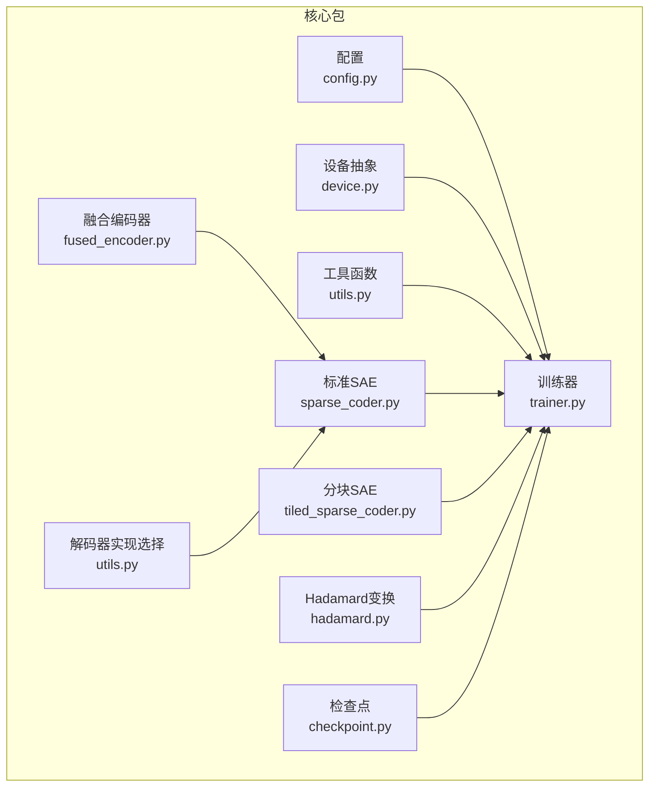
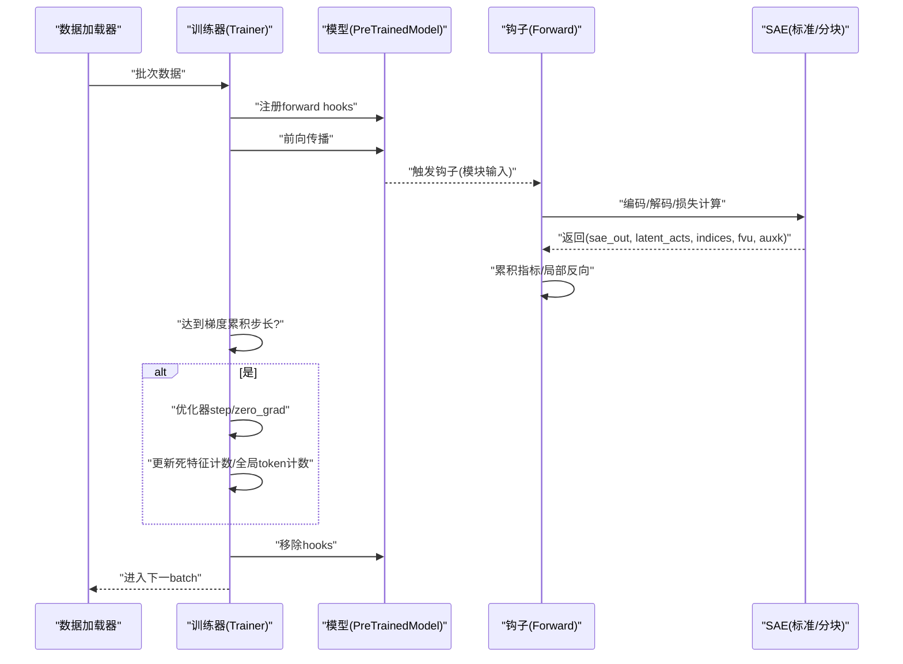
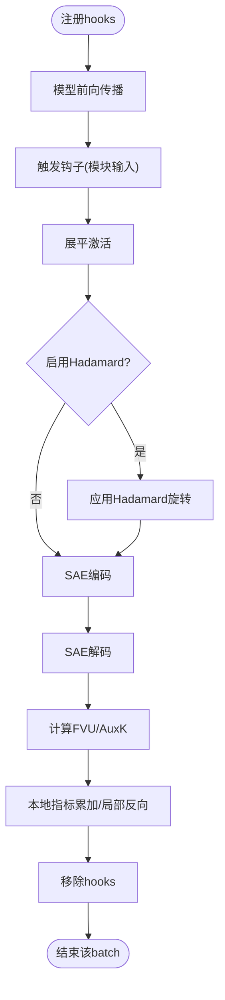
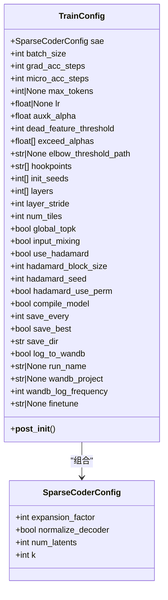
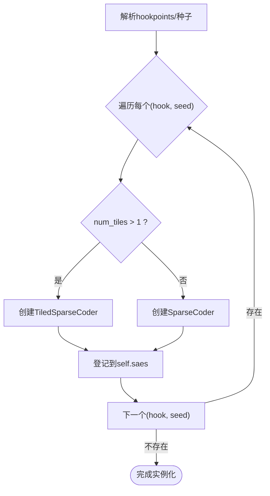
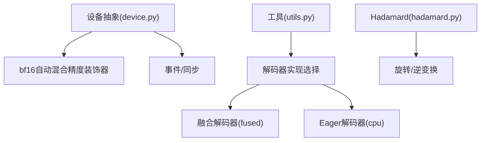
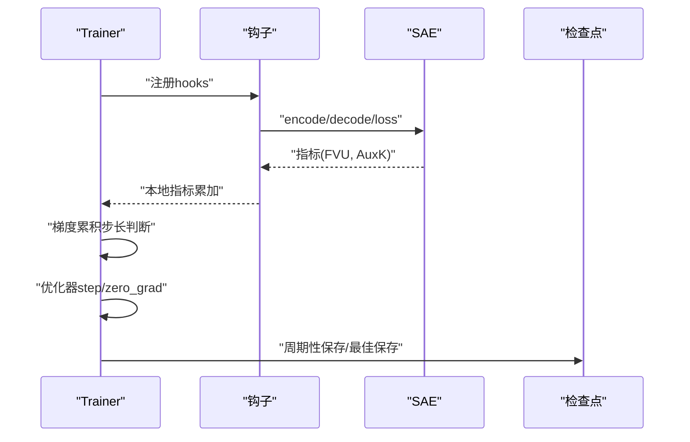
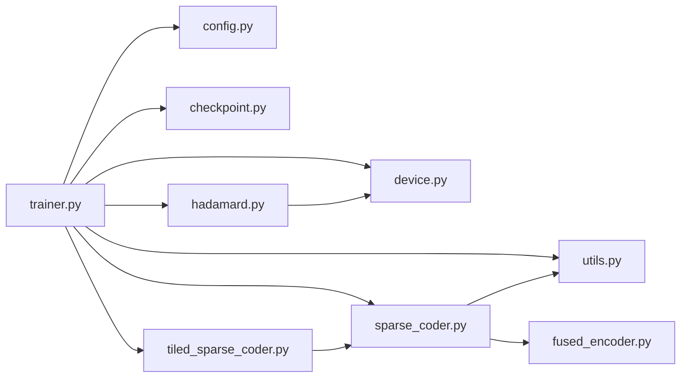

# 设计原理与模式

<cite>
**本文引用的文件**   
- [sparsify/__init__.py](file://sparsify/__init__.py)
- [sparsify/config.py](file://sparsify/config.py)
- [sparsify/trainer.py](file://sparsify/trainer.py)
- [sparsify/sparse_coder.py](file://sparsify/sparse_coder.py)
- [sparsify/fused_encoder.py](file://sparsify/fused_encoder.py)
- [sparsify/tiled_sparse_coder.py](file://sparsify/tiled_sparse_coder.py)
- [sparsify/checkpoint.py](file://sparsify/checkpoint.py)
- [sparsify/utils.py](file://sparsify/utils.py)
- [sparsify/device.py](file://sparsify/device.py)
- [sparsify/hadamard.py](file://sparsify/hadamard.py)
- [docs/architecture/core-components.md](file://docs/architecture/core-components.md)
- [docs/training/config-reference.md](file://docs/training/config-reference.md)
- [docs/README.md](file://docs/README.md)
</cite>

## 目录
1. [引言](#引言)
2. [项目结构](#项目结构)
3. [核心组件](#核心组件)
4. [架构总览](#架构总览)
5. [详细组件分析](#详细组件分析)
6. [依赖分析](#依赖分析)
7. [性能考量](#性能考量)
8. [故障排查指南](#故障排查指南)
9. [结论](#结论)
10. [附录](#附录)

## 引言
本文件面向开发者与研究者，系统阐述 Sparsify 项目的核心设计原则与架构模式，重点覆盖以下主题：
- 钩子模式：通过 forward hooks 捕获模型激活，驱动 SAE 训练与指标计算
- 配置驱动设计：以数据类配置为中心，统一参数化与校验
- 工厂模式：在 Trainer 中按配置实例化 SAE（含 Tiled 模式）
- 插件化设计：设备抽象、解码器实现选择、Hadamard 旋转等可插拔能力
- 数据流与组件交互：从模型前向到指标聚合、从优化到检查点的闭环
- 接口设计规范与最佳实践：命名、职责、错误处理与性能权衡

## 项目结构
Sparsify 采用“功能域+分层”的组织方式，核心训练与推理路径集中在 sparsify 包内，文档位于 docs 目录，实验与脚本位于 experiments 与 scripts。

**图表来源**
- [sparsify/config.py:1-149](file://sparsify/config.py#L1-L149)
- [sparsify/trainer.py:1-760](file://sparsify/trainer.py#L1-L760)
- [sparsify/sparse_coder.py:1-269](file://sparsify/sparse_coder.py#L1-L269)
- [sparsify/tiled_sparse_coder.py:1-342](file://sparsify/tiled_sparse_coder.py#L1-L342)
- [sparsify/fused_encoder.py:1-107](file://sparsify/fused_encoder.py#L1-L107)
- [sparsify/utils.py:1-227](file://sparsify/utils.py#L1-L227)
- [sparsify/device.py:1-118](file://sparsify/device.py#L1-L118)
- [sparsify/hadamard.py:1-259](file://sparsify/hadamard.py#L1-L259)
- [sparsify/checkpoint.py:1-302](file://sparsify/checkpoint.py#L1-L302)

**章节来源**
- [docs/README.md:1-34](file://docs/README.md#L1-L34)
- [docs/architecture/core-components.md:1-128](file://docs/architecture/core-components.md#L1-L128)

## 核心组件
- 配置层：以数据类承载 SAE 架构参数与训练运行参数，支持序列化与校验
- 训练器：解析钩子点、初始化 SAE、注册 forward hooks、在钩子中执行编码/解码/损失、维护死特征统计与日志
- SAE 核心：标准 SAE 与分块 SAE，提供编码、解码、损失与检查点读写
- 融合算子：自定义 Autograd 函数实现高效 top-k 编码与解码
- 设备抽象：统一 CUDA/NPU/CPU 行为，提供 bf16 自动混合精度装饰器
- 检查点：支持常规与分块 SAE 的加载/保存，以及训练状态恢复

**章节来源**
- [sparsify/config.py:1-149](file://sparsify/config.py#L1-L149)
- [sparsify/trainer.py:1-760](file://sparsify/trainer.py#L1-L760)
- [sparsify/sparse_coder.py:1-269](file://sparsify/sparse_coder.py#L1-L269)
- [sparsify/tiled_sparse_coder.py:1-342](file://sparsify/tiled_sparse_coder.py#L1-L342)
- [sparsify/fused_encoder.py:1-107](file://sparsify/fused_encoder.py#L1-L107)
- [sparsify/device.py:1-118](file://sparsify/device.py#L1-L118)
- [sparsify/checkpoint.py:1-302](file://sparsify/checkpoint.py#L1-L302)

## 架构总览
Sparsify 的训练主循环围绕“模型前向 + 钩子回调”展开：训练器在每个 batch 注册一组 forward hooks，触发模型前向时，钩子函数对激活进行 Hadamard 旋转（可选）、调用 SAE 前向计算损失与指标，并在累积梯度步长到达时执行优化器步骤。

**图表来源**
- [sparsify/trainer.py:530-574](file://sparsify/trainer.py#L530-L574)
- [sparsify/sparse_coder.py:187-239](file://sparsify/sparse_coder.py#L187-L239)
- [sparsify/tiled_sparse_coder.py:102-140](file://sparsify/tiled_sparse_coder.py#L102-L140)

## 详细组件分析

### 钩子模式：forward hooks 捕获模型激活
- 设计思想
  - 使用 PyTorch forward hooks 在不侵入模型结构的前提下，拦截模块输入/输出，完成激活采集与 SAE 前向计算
  - 钩子在训练循环中按批注册与移除，避免常驻 hook 带来的额外开销
- 实现要点
  - 训练器构建 hookpoint 到模块的映射，注册 hooks 后触发模型前向，最后统一移除
  - 钩子函数将模块输入展平为样本级激活，按需应用 Hadamard 旋转，随后调用 SAE 前向，累积指标并在同步上下文中执行局部反向
  - 支持 torch.compile 场景下禁用 Dynamo 对钩子体追踪，确保 DDP 梯度钩子正常工作
- 数据流
  - 输入激活 → 钩子 → SAE 前向 → 指标累加 → 局部反向 → 全局优化步

**图表来源**
- [sparsify/trainer.py:538-574](file://sparsify/trainer.py#L538-L574)
- [sparsify/trainer.py:347-480](file://sparsify/trainer.py#L347-L480)

**章节来源**
- [sparsify/trainer.py:39-116](file://sparsify/trainer.py#L39-L116)
- [sparsify/trainer.py:347-480](file://sparsify/trainer.py#L347-L480)
- [sparsify/utils.py:113-154](file://sparsify/utils.py#L113-L154)

### 配置驱动设计：参数化配置系统
- 设计思想
  - 使用数据类承载配置，结合序列化/反序列化与运行期校验，形成“声明即约束”的参数体系
  - 训练配置与 SAE 架构配置分离，便于在不同场景复用
- 关键点
  - SparseCoderConfig：控制扩展因子、归一化、隐变量数量、稀疏度等
  - TrainConfig：控制批大小、梯度累积、微批切分、最大 token 数、学习率、AuxK 权重、死特征阈值、钩子点、分块/全局 top-k、Hadamard 参数、编译开关、保存与日志等
  - 运行期校验：禁止互斥参数组合、校验路径存在性、校验 Hadamard 块大小合法性、在非 CUDA 平台自动降级编译选项
- 接口规范
  - 配置对象支持 to_dict/from_dict、序列化/反序列化，便于持久化与 CLI 解析

**图表来源**
- [sparsify/config.py:7-149](file://sparsify/config.py#L7-L149)

**章节来源**
- [sparsify/config.py:1-149](file://sparsify/config.py#L1-L149)
- [docs/training/config-reference.md:1-193](file://docs/training/config-reference.md#L1-L193)

### 工厂模式：SAE 实例创建
- 设计思想
  - 在 Trainer 中根据配置与钩子点动态创建 SAE 实例，支持标准 SAE 与分块 SAE 的工厂化构造
- 实现要点
  - 钩子点遍历 + 随机种子遍历，为每个组合创建一个 SAE 实例
  - 当 num_tiles > 1 时，创建 TiledSparseCoder；否则创建 SparseCoder
  - 初始化阶段设置 b_dec（来自数据均值），并可选地规范化解码器权重
- 扩展点
  - 可通过传入不同的 cfg 或 device/dtype 参数，灵活切换架构与设备

**图表来源**
- [sparsify/trainer.py:88-116](file://sparsify/trainer.py#L88-L116)
- [sparsify/tiled_sparse_coder.py:27-61](file://sparsify/tiled_sparse_coder.py#L27-L61)
- [sparsify/sparse_coder.py:36-62](file://sparsify/sparse_coder.py#L36-L62)

**章节来源**
- [sparsify/trainer.py:88-116](file://sparsify/trainer.py#L88-L116)

### 插件化设计：设备抽象与实现选择
- 设备抽象层
  - 统一检测 CUDA/NPU/CPU，暴露 get_device_type()/get_device_string()/get_dist_backend()/device_autocast()/create_event()/synchronize()
  - bf16 支持按平台判定，自动混合精度装饰器屏蔽后端差异
- 解码器实现选择
  - 根据设备类型动态选择 fused_decode 或回退到 eager_decode，避免弱后端行为
- Hadamard 旋转
  - 可选的随机置换 + 块对角 Hadamard 变换，支持缓存 dtype 对应的 Hadamard 矩阵，减少重复转换

**图表来源**
- [sparsify/device.py:1-118](file://sparsify/device.py#L1-L118)
- [sparsify/utils.py:185-197](file://sparsify/utils.py#L185-L197)
- [sparsify/hadamard.py:66-188](file://sparsify/hadamard.py#L66-L188)

**章节来源**
- [sparsify/device.py:1-118](file://sparsify/device.py#L1-L118)
- [sparsify/utils.py:185-197](file://sparsify/utils.py#L185-L197)
- [sparsify/hadamard.py:1-259](file://sparsify/hadamard.py#L1-L259)

### 数据流设计原则与组件交互
- 数据流
  - 激活采集：钩子从模块输入捕获展平后的激活张量
  - 预处理：可选的 Hadamard 旋转与目标重建的逆变换
  - 编码/解码：融合编码器与解码器实现，返回重构信号与指标
  - 指标计算：FVU、AuxK、Exceed（基于肘部阈值）
  - 优化：按梯度累积步长执行优化器步骤，零梯度，更新死特征计数与全局 token 计数
- 组件交互
  - Trainer 与 SAE：前者负责注册/移除 hooks、调度优化、聚合指标、保存检查点
  - Trainer 与设备/分布式：统一事件与同步，跨进程 all_reduce
  - Trainer 与检查点：保存/加载 SAE 权重、优化器状态、训练状态与 Hadamard 状态

**图表来源**
- [sparsify/trainer.py:575-722](file://sparsify/trainer.py#L575-L722)
- [sparsify/checkpoint.py:246-299](file://sparsify/checkpoint.py#L246-L299)

**章节来源**
- [sparsify/trainer.py:575-722](file://sparsify/trainer.py#L575-L722)
- [sparsify/checkpoint.py:199-299](file://sparsify/checkpoint.py#L199-L299)

### 接口设计规范与最佳实践
- 命名与职责
  - ForwardOutput/EncoderOutput 使用具名元组，明确返回字段，便于调用方解耦
  - SAE.forward 返回 sae_out、latent_acts、latent_indices、fvu、auxk_loss，统一指标输出
- 错误处理
  - 配置校验在 __post_init__ 中集中执行，失败即抛异常，避免隐性错误
  - 检查点加载时严格校验 num_tiles 一致性，防止不兼容恢复
- 性能权衡
  - 融合编码器/解码器在大矩阵场景采用 scatter-plus-matmul，在小矩阵场景采用 gather+bmm/index_add_ 回退
  - 死特征计数采用一次性 cat+unique 替代 per-forward scatter_，避免 NPU AI_CPU fallback
  - 可选的 torch.compile 编译 Transformer 层以融合小算子，降低核启动开销

**章节来源**
- [sparsify/sparse_coder.py:20-34](file://sparsify/sparse_coder.py#L20-L34)
- [sparsify/fused_encoder.py:18-91](file://sparsify/fused_encoder.py#L18-L91)
- [sparsify/trainer.py:586-627](file://sparsify/trainer.py#L586-L627)
- [sparsify/config.py:124-149](file://sparsify/config.py#L124-L149)
- [sparsify/checkpoint.py:44-73](file://sparsify/checkpoint.py#L44-L73)

## 依赖分析
- 组件耦合
  - Trainer 依赖配置、设备、工具函数、SAE 实现、检查点与分布式接口
  - SAE 依赖融合编码器与解码器实现选择
  - 设备抽象被广泛使用，屏蔽后端差异
- 外部依赖
  - torch、transformers、schedulefree、safetensors、natsort、datasets 等
- 循环依赖
  - 未发现直接循环依赖；模块间通过清晰的导入边界隔离

**图表来源**
- [sparsify/trainer.py:1-35](file://sparsify/trainer.py#L1-L35)
- [sparsify/sparse_coder.py:1-18](file://sparsify/sparse_coder.py#L1-L18)
- [sparsify/tiled_sparse_coder.py:1-15](file://sparsify/tiled_sparse_coder.py#L1-L15)
- [sparsify/fused_encoder.py:1-10](file://sparsify/fused_encoder.py#L1-L10)
- [sparsify/utils.py:1-227](file://sparsify/utils.py#L1-L227)
- [sparsify/device.py:1-118](file://sparsify/device.py#L1-L118)
- [sparsify/hadamard.py:1-259](file://sparsify/hadamard.py#L1-L259)
- [sparsify/checkpoint.py:1-302](file://sparsify/checkpoint.py#L1-L302)

**章节来源**
- [sparsify/trainer.py:1-35](file://sparsify/trainer.py#L1-L35)
- [sparsify/sparse_coder.py:1-18](file://sparsify/sparse_coder.py#L1-L18)
- [sparsify/tiled_sparse_coder.py:1-15](file://sparsify/tiled_sparse_coder.py#L1-L15)
- [sparsify/fused_encoder.py:1-10](file://sparsify/fused_encoder.py#L1-L10)
- [sparsify/utils.py:1-227](file://sparsify/utils.py#L1-L227)
- [sparsify/device.py:1-118](file://sparsify/device.py#L1-L118)
- [sparsify/hadamard.py:1-259](file://sparsify/hadamard.py#L1-L259)
- [sparsify/checkpoint.py:1-302](file://sparsify/checkpoint.py#L1-L302)

## 性能考量
- 计算路径优化
  - 融合编码器/解码器：在内存友好阈值内采用 scatter-plus-matmul，阈值外采用 gather/bmm/index_add_ 回退
  - 死特征计数：cat+unique 替代 per-forward scatter_，避免 NPU AI_CPU fallback
  - 可选的 torch.compile：编译 Transformer 层以融合小算子，降低核启动开销
- 指标与日志
  - 指标按 log 频率批量 all_reduce，减少通信开销
  - 时间统计在 CUDA/NPU 上使用 Event 记录，CPU 使用 perf_counter
- 设备与精度
  - device_autocast 在支持 bf16 的平台上启用，显著提升性能
  - 解码器实现按设备自动选择，避免弱后端行为

[本节为通用性能讨论，无需特定文件分析]

## 故障排查指南
- 常见配置错误
  - 同时指定 layers 与 layer_stride：触发校验异常
  - 缺少 init_seeds：必须至少提供一个随机种子
  - exceed_alphas 含非正数：触发校验异常
  - elbow_threshold_path 不存在：触发校验异常
  - hadamard_block_size 非正或非 2 的幂：触发校验异常
- 恢复与检查点
  - 分块/非分块 SAE 恢复时 num_tiles 必须匹配，否则抛出 TypeError/ValueError
  - 加载训练状态时，rank_0_state.pt 与 per-SAE 权重需对应
- 日志与可视化
  - 若 W&B 初始化失败，日志开关会自动降级并广播到各进程
  - 超过阈值比例（exceed）仅对能匹配到肘部阈值的钩子点计算

**章节来源**
- [sparsify/config.py:124-149](file://sparsify/config.py#L124-L149)
- [sparsify/checkpoint.py:44-73](file://sparsify/checkpoint.py#L44-L73)
- [sparsify/trainer.py:186-227](file://sparsify/trainer.py#L186-L227)

## 结论
Sparsify 通过“钩子驱动 + 配置中心 + 工厂化实例 + 插件化实现”的设计，实现了在不侵入模型结构的前提下，对多层/多钩子点的高效 SAE 训练。配置驱动确保了参数的一致性与可追溯性，工厂模式简化了实例化复杂度，插件化设计提升了跨平台与算法扩展能力。整体数据流清晰、组件职责明确、性能优化到位，适合在大规模语言模型中进行激活稀疏化与下游补偿的工程化落地。

[本节为总结性内容，无需特定文件分析]

## 附录
- 相关文档与参考
  - 核心组件说明：[docs/architecture/core-components.md:1-128](file://docs/architecture/core-components.md#L1-L128)
  - 训练配置参考：[docs/training/config-reference.md:1-193](file://docs/training/config-reference.md#L1-L193)
  - 项目文档总览：[docs/README.md:1-34](file://docs/README.md#L1-L34)

[本节为补充材料，无需特定文件分析]