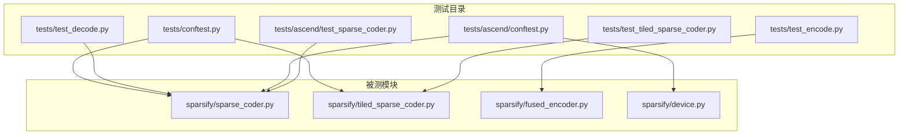
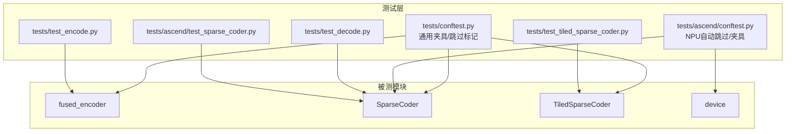
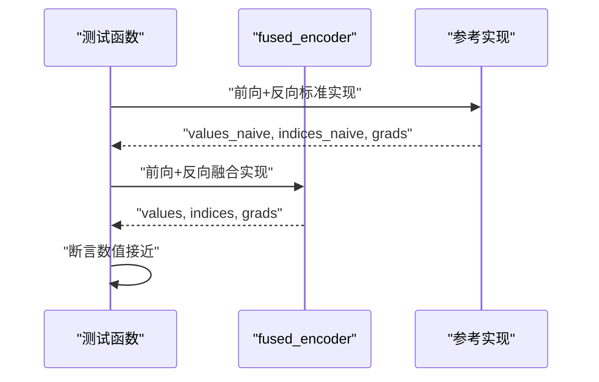
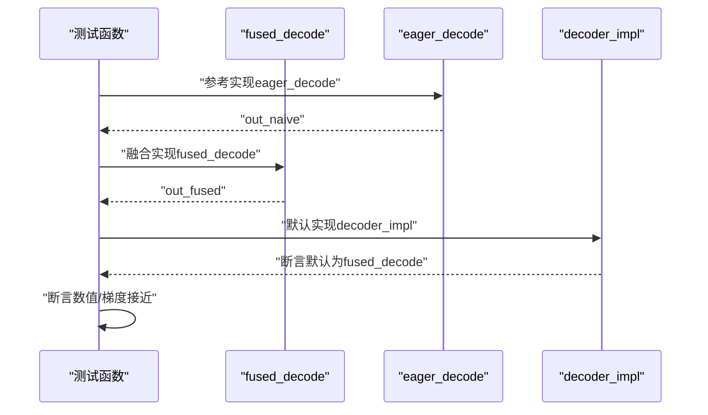
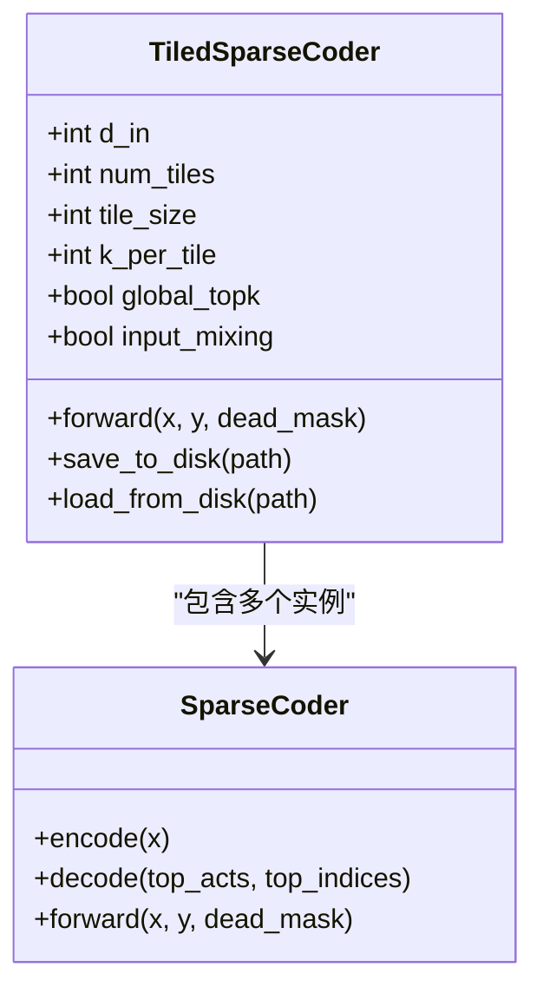
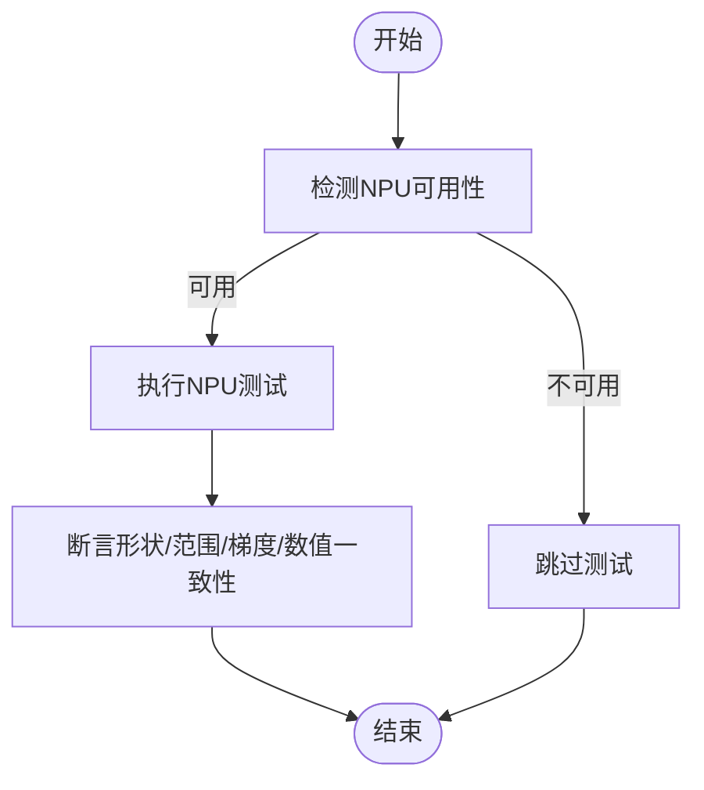
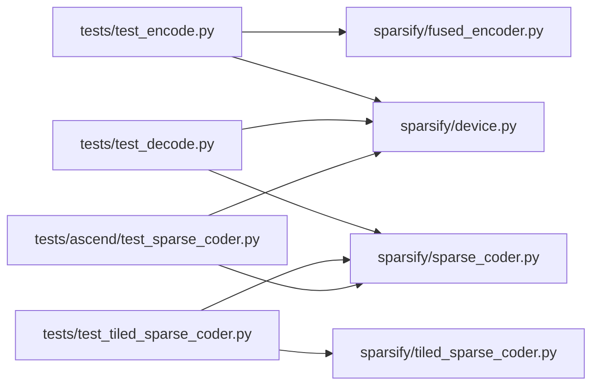

# 单元测试

<cite>
**本文引用的文件**
- [tests/conftest.py](file://tests/conftest.py)
- [tests/test_encode.py](file://tests/test_encode.py)
- [tests/test_decode.py](file://tests/test_decode.py)
- [tests/test_tiled_sparse_coder.py](file://tests/test_tiled_sparse_coder.py)
- [tests/ascend/conftest.py](file://tests/ascend/conftest.py)
- [tests/ascend/test_sparse_coder.py](file://tests/ascend/test_sparse_coder.py)
- [sparsify/sparse_coder.py](file://sparsify/sparse_coder.py)
- [sparsify/tiled_sparse_coder.py](file://sparsify/tiled_sparse_coder.py)
- [sparsify/fused_encoder.py](file://sparsify/fused_encoder.py)
- [sparsify/device.py](file://sparsify/device.py)
- [pyproject.toml](file://pyproject.toml)
</cite>

## 目录
1. [简介](#简介)
2. [项目结构](#项目结构)
3. [核心组件](#核心组件)
4. [架构总览](#架构总览)
5. [详细组件分析](#详细组件分析)
6. [依赖分析](#依赖分析)
7. [性能考虑](#性能考虑)
8. [故障排查指南](#故障排查指南)
9. [结论](#结论)
10. [附录](#附录)

## 简介
本文件面向开发者，系统化阐述本仓库的单元测试编写规范与最佳实践，覆盖以下方面：
- 测试用例设计原则、断言方法与测试数据准备
- 核心模块的单元测试策略：编码器测试、解码器测试、分块编码器测试等
- 测试夹具（fixtures）、测试环境配置与模拟对象的创建
- 测试覆盖率要求、命名约定与组织结构
- 具体测试代码示例路径与测试执行方法

目标是帮助开发者编写高质量、可维护、可移植的单元测试。

## 项目结构
测试目录采用按功能与平台分层组织：
- tests/：通用测试（CPU/CUDA/NPU通用逻辑）
  - tests/conftest.py：通用测试夹具与跳过标记
  - tests/test_encode.py：编码器（fused_encoder）对比与梯度一致性测试
  - tests/test_decode.py：解码器（fused_decode）对比与bf16混合精度测试
  - tests/test_tiled_sparse_coder.py：分块稀疏编码器（TiledSparseCoder）全量测试
- tests/ascend/：Ascend NPU专用测试
  - tests/ascend/conftest.py：自动跳过NPU不可用测试的钩子与夹具
  - tests/ascend/test_sparse_coder.py：在NPU上的端到端稀疏编码器测试与数值一致性验证

图表来源
- [tests/conftest.py:1-14](file://tests/conftest.py#L1-L14)
- [tests/test_encode.py:1-65](file://tests/test_encode.py#L1-L65)
- [tests/test_decode.py:1-85](file://tests/test_decode.py#L1-L85)
- [tests/test_tiled_sparse_coder.py:1-468](file://tests/test_tiled_sparse_coder.py#L1-L468)
- [tests/ascend/conftest.py:1-52](file://tests/ascend/conftest.py#L1-L52)
- [tests/ascend/test_sparse_coder.py:1-104](file://tests/ascend/test_sparse_coder.py#L1-L104)
- [sparsify/sparse_coder.py:1-269](file://sparsify/sparse_coder.py#L1-L269)
- [sparsify/tiled_sparse_coder.py:1-342](file://sparsify/tiled_sparse_coder.py#L1-L342)
- [sparsify/fused_encoder.py:1-107](file://sparsify/fused_encoder.py#L1-L107)
- [sparsify/device.py:1-118](file://sparsify/device.py#L1-L118)

章节来源
- [tests/conftest.py:1-14](file://tests/conftest.py#L1-L14)
- [tests/ascend/conftest.py:1-52](file://tests/ascend/conftest.py#L1-L52)

## 核心组件
- 编码器（fused_encoder）：对线性变换后ReLU再Top-K选择进行前向与反向优化，支持大矩阵场景下的高效稀疏梯度计算。
- 解码器（fused_decode）：基于索引的稀疏解码实现，提供与参考实现一致的数值结果与梯度。
- 分块编码器（TiledSparseCoder）：将输入按隐藏维度切分为多个块，每个块独立训练SAE，支持全局Top-K与输入混洗两种模式。
- 设备抽象（device）：统一CUDA/Ascend NPU设备检测、bf16支持判断、自动混合精度装饰器等。

章节来源
- [sparsify/fused_encoder.py:1-107](file://sparsify/fused_encoder.py#L1-L107)
- [sparsify/sparse_coder.py:1-269](file://sparsify/sparse_coder.py#L1-L269)
- [sparsify/tiled_sparse_coder.py:1-342](file://sparsify/tiled_sparse_coder.py#L1-L342)
- [sparsify/device.py:1-118](file://sparsify/device.py#L1-L118)

## 架构总览
下图展示测试与被测模块之间的交互关系，以及测试夹具与跳过标记的作用范围。

图表来源
- [tests/conftest.py:1-14](file://tests/conftest.py#L1-L14)
- [tests/ascend/conftest.py:1-52](file://tests/ascend/conftest.py#L1-L52)
- [tests/test_encode.py:1-65](file://tests/test_encode.py#L1-L65)
- [tests/test_decode.py:1-85](file://tests/test_decode.py#L1-L85)
- [tests/test_tiled_sparse_coder.py:1-468](file://tests/test_tiled_sparse_coder.py#L1-L468)
- [tests/ascend/test_sparse_coder.py:1-104](file://tests/ascend/test_sparse_coder.py#L1-L104)
- [sparsify/fused_encoder.py:1-107](file://sparsify/fused_encoder.py#L1-L107)
- [sparsify/sparse_coder.py:1-269](file://sparsify/sparse_coder.py#L1-L269)
- [sparsify/tiled_sparse_coder.py:1-342](file://sparsify/tiled_sparse_coder.py#L1-L342)
- [sparsify/device.py:1-118](file://sparsify/device.py#L1-L118)

## 详细组件分析

### 编码器测试（fused_encoder）
- 测试目标
  - 验证fused_encoder前向输出与标准实现一致
  - 验证fused_encoder反向梯度与标准实现一致
  - 性能对比（通过计时输出观察）
- 关键点
  - 使用设备感知的张量生成与同步
  - 断言使用数值接近比较（torch.testing.assert_close）
  - 跳过条件：仅在可用加速器上运行
- 示例路径
  - [tests/test_encode.py:test_fused_encoder:10-61](file://tests/test_encode.py#L10-L61)

图表来源
- [tests/test_encode.py:10-61](file://tests/test_encode.py#L10-L61)
- [sparsify/fused_encoder.py:21-107](file://sparsify/fused_encoder.py#L21-L107)

章节来源
- [tests/test_encode.py:1-65](file://tests/test_encode.py#L1-L65)
- [sparsify/fused_encoder.py:1-107](file://sparsify/fused_encoder.py#L1-L107)

### 解码器测试（fused_decode）
- 测试目标
  - 验证fused_decode与参考实现数值一致
  - 验证fused_decode梯度与参考实现一致
  - 验证bf16混合精度下行为正确
  - 验证默认解码器实现为fused_decode
- 关键点
  - 参数形状与设备由夹具或测试函数提供
  - 断言使用数值接近比较
  - 跳过条件：仅在可用加速器上运行
- 示例路径
  - [tests/test_decode.py:test_decode:18-31](file://tests/test_decode.py#L18-L31)
  - [tests/test_decode.py:test_fused_decode_gradient:35-55](file://tests/test_decode.py#L35-L55)
  - [tests/test_decode.py:test_fused_decode_bf16_autocast:59-76](file://tests/test_decode.py#L59-L76)
  - [tests/test_decode.py:test_fused_decode_is_default:80-84](file://tests/test_decode.py#L80-L84)

图表来源
- [tests/test_decode.py:16-84](file://tests/test_decode.py#L16-L84)
- [sparsify/sparse_coder.py:181-185](file://sparsify/sparse_coder.py#L181-L185)

章节来源
- [tests/test_decode.py:1-85](file://tests/test_decode.py#L1-L85)
- [sparsify/sparse_coder.py:176-185](file://sparsify/sparse_coder.py#L176-L185)

### 分块编码器测试（TiledSparseCoder）
- 测试目标
  - 初始化参数校验（d_in与num_tiles、k与num_tiles的整除关系）
  - 前向输出形状与索引范围
  - 死亡特征掩码、权重归一化、梯度流
  - 保存/加载、索引偏移、配置字段
  - 全局Top-K与输入混洗模式的功能与梯度
  - 与常规SAE的检查点加载兼容性校验
- 关键点
  - 多类夹具：配置、设备、NPU设备
  - 大多数测试在可用加速器上运行
  - 断言覆盖形状、范围、数值接近、梯度存在且非零
- 示例路径
  - [tests/test_tiled_sparse_coder.py:TestTiledSparseCoder.test_init:30-41](file://tests/test_tiled_sparse_coder.py#L30-L41)
  - [tests/test_tiled_sparse_coder.py:TestTiledSparseCoder.test_forward:54-69](file://tests/test_tiled_sparse_coder.py#L54-L69)
  - [tests/test_tiled_sparse_coder.py:TestTiledSparseCoder.test_save_load:118-144](file://tests/test_tiled_sparse_coder.py#L118-L144)
  - [tests/test_tiled_sparse_coder.py:TestGlobalTopK.test_forward_global_topk:303-321](file://tests/test_tiled_sparse_coder.py#L303-L321)
  - [tests/test_tiled_sparse_coder.py:TestInputMixing.test_init_input_mixing:387-396](file://tests/test_tiled_sparse_coder.py#L387-L396)

图表来源
- [sparsify/tiled_sparse_coder.py:17-342](file://sparsify/tiled_sparse_coder.py#L17-L342)
- [sparsify/sparse_coder.py:36-269](file://sparsify/sparse_coder.py#L36-L269)

章节来源
- [tests/test_tiled_sparse_coder.py:1-468](file://tests/test_tiled_sparse_coder.py#L1-L468)
- [sparsify/tiled_sparse_coder.py:1-342](file://sparsify/tiled_sparse_coder.py#L1-L342)
- [sparsify/sparse_coder.py:1-269](file://sparsify/sparse_coder.py#L1-L269)

### Ascend NPU专用测试
- 测试目标
  - 输出形状、FVU范围、反向梯度流
  - AuxK损失、解码器归一化
  - NPU与CPU数值一致性（绕过bf16自动混合精度）
  - 在NPU上训练的模型可跨设备加载
- 关键点
  - 自动跳过：未检测到NPU时所有测试跳过
  - 夹具提供“npu”和“npu:0”设备
- 示例路径
  - [tests/ascend/test_sparse_coder.py:test_forward_output_shapes:11-19](file://tests/ascend/test_sparse_coder.py#L11-L19)
  - [tests/ascend/test_sparse_coder.py:test_npu_vs_cpu_numerical:63-91](file://tests/ascend/test_sparse_coder.py#L63-L91)

图表来源
- [tests/ascend/conftest.py:31-34](file://tests/ascend/conftest.py#L31-L34)
- [tests/ascend/test_sparse_coder.py:11-104](file://tests/ascend/test_sparse_coder.py#L11-L104)
- [sparsify/device.py:53-55](file://sparsify/device.py#L53-L55)

章节来源
- [tests/ascend/conftest.py:1-52](file://tests/ascend/conftest.py#L1-L52)
- [tests/ascend/test_sparse_coder.py:1-104](file://tests/ascend/test_sparse_coder.py#L1-L104)
- [sparsify/device.py:1-118](file://sparsify/device.py#L1-L118)

## 依赖分析
- 测试对被测模块的依赖
  - 编码器测试依赖fused_encoder与设备同步
  - 解码器测试依赖SparseCoder中的decoder_impl与设备能力
  - 分块编码器测试依赖TiledSparseCoder与SparseCoder
  - Ascend测试依赖NPU检测与设备夹具
- 外部依赖
  - pytest、torch、safetensors、huggingface_hub等

图表来源
- [tests/test_encode.py:1-65](file://tests/test_encode.py#L1-L65)
- [tests/test_decode.py:1-85](file://tests/test_decode.py#L1-L85)
- [tests/test_tiled_sparse_coder.py:1-468](file://tests/test_tiled_sparse_coder.py#L1-L468)
- [tests/ascend/test_sparse_coder.py:1-104](file://tests/ascend/test_sparse_coder.py#L1-L104)
- [sparsify/fused_encoder.py:1-107](file://sparsify/fused_encoder.py#L1-L107)
- [sparsify/sparse_coder.py:1-269](file://sparsify/sparse_coder.py#L1-L269)
- [sparsify/tiled_sparse_coder.py:1-342](file://sparsify/tiled_sparse_coder.py#L1-L342)
- [sparsify/device.py:1-118](file://sparsify/device.py#L1-L118)

章节来源
- [pyproject.toml:12-28](file://pyproject.toml#L12-L28)

## 性能考虑
- 编码器融合实现
  - 在大矩阵场景下通过稀疏系数矩阵与稠密乘法或gather+bmm两种路径平衡内存与速度
  - 通过阈值控制在不同规模下切换实现以优化性能
- 测试中性能对比
  - 编码器测试包含计时输出，便于对比标准实现与融合实现的耗时差异
- 混合精度
  - 设备装饰器根据平台自动启用bf16混合精度，提升性能；解码器测试覆盖bf16路径的正确性

章节来源
- [sparsify/fused_encoder.py:18-92](file://sparsify/fused_encoder.py#L18-L92)
- [sparsify/device.py:101-118](file://sparsify/device.py#L101-L118)
- [tests/test_encode.py:22-53](file://tests/test_encode.py#L22-L53)

## 故障排查指南
- 加速器不可用导致的跳过
  - 通用测试：当CUDA/NPU不可用时，测试自动跳过
  - Ascend测试：通过集合修改钩子自动为ascend目录下所有测试添加跳过标记
- 数值不一致
  - 编码器/解码器测试使用数值接近断言，若失败需检查设备类型、混合精度与断言容差
  - NPU与CPU对比测试建议绕过自动混合精度以排除bf16影响
- 梯度缺失或为零
  - 检查输入是否设置requires_grad
  - 确认损失已反向传播且未被提前清理
- 分块编码器初始化错误
  - d_in与num_tiles、k与num_tiles必须整除，否则触发断言错误

章节来源
- [tests/conftest.py:6-8](file://tests/conftest.py#L6-L8)
- [tests/ascend/conftest.py:31-34](file://tests/ascend/conftest.py#L31-L34)
- [tests/test_decode.py:68-76](file://tests/test_decode.py#L68-L76)
- [tests/test_tiled_sparse_coder.py:42-51](file://tests/test_tiled_sparse_coder.py#L42-L51)

## 结论
本仓库的单元测试体系围绕核心稀疏编码模块构建，覆盖了编码/解码融合实现、分块稀疏编码器以及Ascend NPU平台特性。测试遵循“设备感知、数值接近断言、必要时跳过”的原则，并通过夹具与自动跳过机制保证在不同硬件环境下的稳定性与可重复性。建议在新增模块或修改现有逻辑时，参照本文档的规范补充相应测试。

## 附录

### 单元测试编写规范与最佳实践
- 测试用例设计原则
  - 每个测试聚焦单一行为或边界条件
  - 使用最小化数据集与合理断言，避免过度耦合
  - 对数值敏感路径使用数值接近断言，设置合理容差
- 断言方法
  - 形状断言：assert tensor.shape == expected_shape
  - 范围断言：assert lower <= tensor.min() 与 assert tensor.max() <= upper
  - 数值接近断言：torch.testing.assert_close(a, b, atol, rtol)
  - 存在性断言：assert tensor.grad is not None
- 测试数据准备
  - 使用固定随机种子确保可重复性
  - 根据模块需求构造合适维度的张量（batch、hidden、latents等）
  - 在需要时手动设置requires_grad与device
- 测试夹具（fixtures）
  - 通用夹具：tests/conftest.py提供设备与跳过标记
  - Ascend夹具：tests/ascend/conftest.py提供npu与npu:0设备
  - 复用夹具减少重复代码，提高可维护性
- 测试环境配置
  - 通过pytest_collection_modifyitems自动为ascend目录测试添加跳过标记
  - 使用device模块统一检测CUDA/NPU可用性与bf16支持
- 模拟对象
  - 优先使用真实模块与真实数据进行集成测试
  - 仅在必要时使用简单的模拟（如自定义autograd Function）以隔离复杂逻辑
- 测试命名约定
  - 测试函数以test_开头，描述具体行为
  - 类名以Test开头，按功能分组（如TestTiledSparseCoder）
- 组织结构
  - tests/：通用测试
  - tests/ascend/：Ascend NPU专用测试
  - 每个模块对应一个或多个测试文件，便于定位与维护
- 覆盖率要求
  - 建议核心模块（编码器、解码器、分块编码器）达到较高覆盖率
  - 对数值敏感路径与边界条件（如整除性断言）重点覆盖
- 执行方法
  - 使用pytest命令运行测试，自动发现并执行测试文件
  - 可通过标记过滤运行特定平台或功能的测试（如NPU测试）

章节来源
- [tests/conftest.py:1-14](file://tests/conftest.py#L1-L14)
- [tests/ascend/conftest.py:1-52](file://tests/ascend/conftest.py#L1-L52)
- [sparsify/device.py:53-118](file://sparsify/device.py#L53-L118)