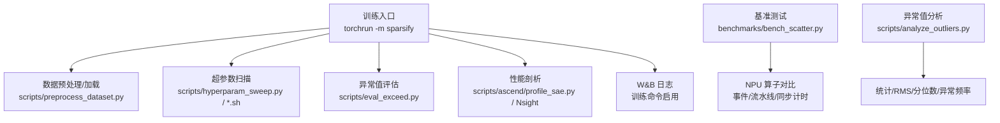
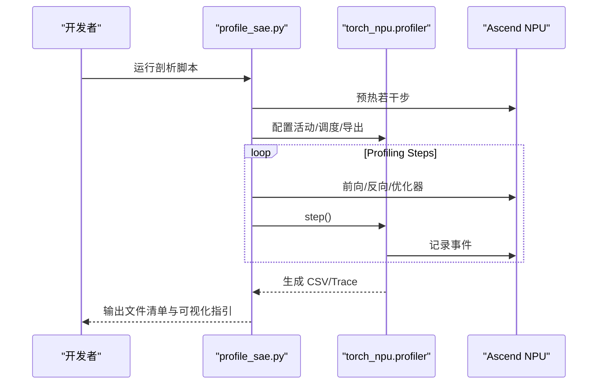
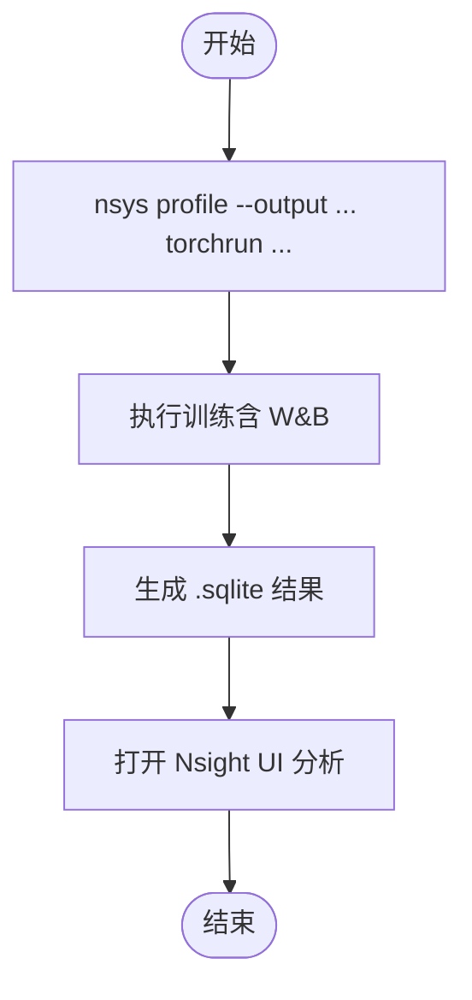
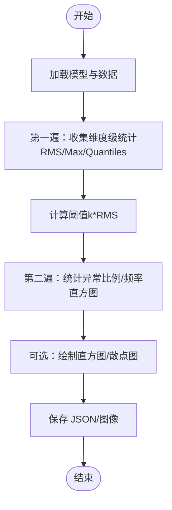
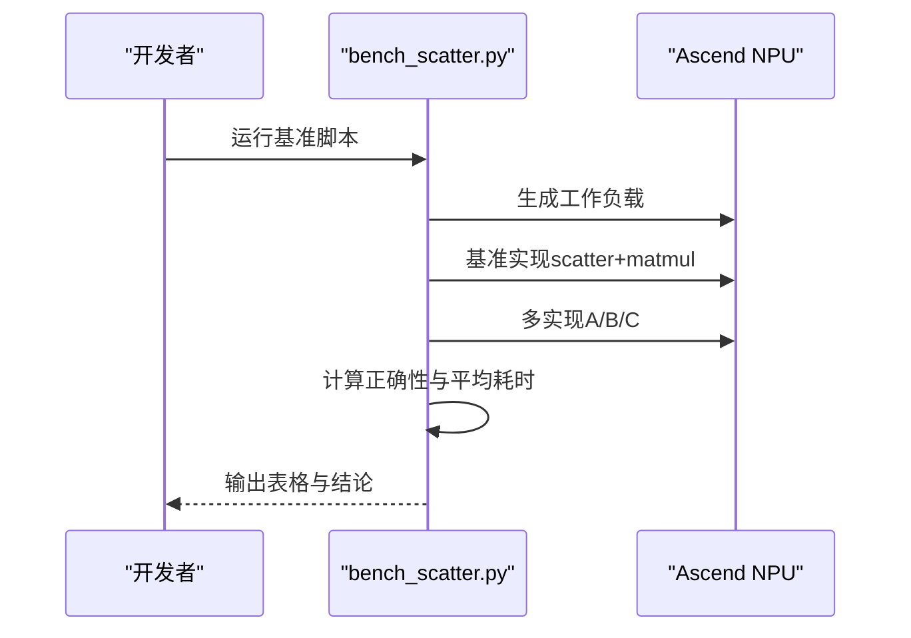
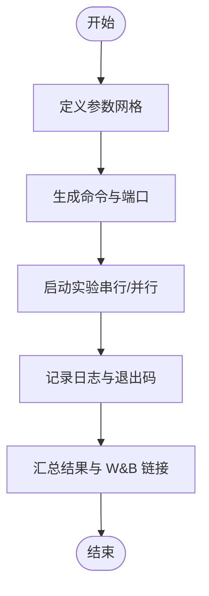
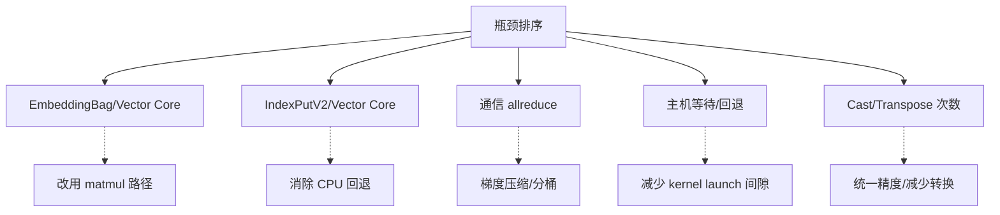
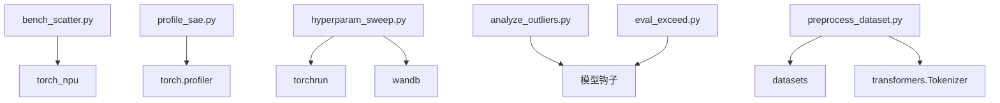

# 性能分析

<cite>
**本文引用的文件**
- [性能文档](file://docs/architecture/performance.md)
- [Ascend NPU 性能分析文档](file://docs/archive/ascend/npu_profiling_analysis.md)
- [Ascend 性能分析概览](file://docs/archive/ascend/ascend_profling.md)
- [Ascend SAE 性能剖析脚本](file://scripts/ascend/profile_sae.py)
- [NPU 基准测试脚本](file://benchmarks/bench_scatter.py)
- [异常值分析脚本](file://scripts/analyze_outliers.py)
- [超参数扫描脚本](file://scripts/hyperparam_sweep.py)
- [简单超参扫描脚本 #1](file://scripts/simple_sweep.sh)
- [简单超参扫描脚本 #2](file://scripts/simple_sweep2.sh)
- [并行超参扫描脚本](file://scripts/parallel_sweep.sh)
- [评估异常值脚本](file://scripts/eval_exceed.py)
- [数据预处理脚本](file://scripts/preprocess_dataset.py)
- [Ascend A100 性能剖析脚本](file://scripts/ascend/scriptA100.sh)
</cite>

## 目录
1. [简介](#简介)
2. [项目结构](#项目结构)
3. [核心组件](#核心组件)
4. [架构总览](#架构总览)
5. [详细组件分析](#详细组件分析)
6. [依赖分析](#依赖分析)
7. [性能考量](#性能考量)
8. [故障排查指南](#故障排查指南)
9. [结论](#结论)
10. [附录](#附录)

## 简介
本文件面向开发者，系统化梳理 Sparsify 项目中的性能分析能力与实践，覆盖以下主题：
- 工具链：PyTorch Profiler、NVIDIA Nsight Systems、W&B 性能监控
- 异常值分析：统计指标、可视化与异常检测
- 散粒噪声测试：激活分布与异常值频率
- 超参数扫描：自动化实验编排、分布式执行与结果汇总
- 性能基准测试：内存使用、GPU 利用率与训练速度测量
- 瓶颈识别与优化：基于算子级分析与执行模式
- 性能回归检测与报告解读：可重复的实验流程与指标追踪

## 项目结构
Sparsify 将性能分析相关能力分布在多个模块：
- 文档与历史归档：性能注意事项、Ascend NPU 历史分析
- 基准与剖析：NPU 基准脚本、Ascend SAE 剖析脚本
- 异常值与评估：异常值分析脚本、异常值评估脚本
- 超参数扫描：Python 脚本与 Bash 脚本，支持串行/并行
- 数据预处理：提升数据管线吞吐与稳定性
- 训练与日志：W&B 集成与分布式训练命令

```mermaid
graph TB
subgraph "文档与策略"
perf_doc["性能文档<br/>docs/architecture/performance.md"]
ascend_hist["Ascend 历史分析<br/>docs/archive/ascend/*"]
end
subgraph "基准与剖析"
bench["NPU 基准脚本<br/>benchmarks/bench_scatter.py"]
prof_ascend["Ascend SAE 剖析脚本<br/>scripts/ascend/profile_sae.py"]
nsys_cmd["Nsight Systems 命令示例<br/>scripts/ascend/scriptA100.sh"]
end
subgraph "异常值与评估"
outlier["异常值分析脚本<br/>scripts/analyze_outliers.py"]
eval_exceed["异常值评估脚本<br/>scripts/eval_exceed.py"]
end
subgraph "超参数扫描"
sweep_py["超参数扫描脚本<br/>scripts/hyperparam_sweep.py"]
sweep_sh1["简单扫描 #1<br/>scripts/simple_sweep.sh"]
sweep_sh2["简单扫描 #2<br/>scripts/simple_sweep2.sh"]
sweep_parallel["并行扫描脚本<br/>scripts/parallel_sweep.sh"]
end
subgraph "数据与训练"
prep["数据预处理脚本<br/>scripts/preprocess_dataset.py"]
wandb["W&B 日志集成<br/>训练命令中启用"]
end
perf_doc --> bench
perf_doc --> prof_ascend
perf_doc --> outlier
perf_doc --> eval_exceed
perf_doc --> sweep_py
perf_doc --> sweep_sh1
perf_doc --> sweep_sh2
perf_doc --> sweep_parallel
perf_doc --> prep
perf_doc --> nsys_cmd
perf_doc --> wandb
```

**图表来源**
- [性能文档](file://docs/architecture/performance.md)
- [NPU 基准测试脚本](file://benchmarks/bench_scatter.py)
- [Ascend SAE 性能剖析脚本](file://scripts/ascend/profile_sae.py)
- [Ascend A100 性能剖析脚本](file://scripts/ascend/scriptA100.sh)
- [异常值分析脚本](file://scripts/analyze_outliers.py)
- [评估异常值脚本](file://scripts/eval_exceed.py)
- [超参数扫描脚本](file://scripts/hyperparam_sweep.py)
- [简单超参扫描脚本 #1](file://scripts/simple_sweep.sh)
- [简单超参扫描脚本 #2](file://scripts/simple_sweep2.sh)
- [并行超参扫描脚本](file://scripts/parallel_sweep.sh)
- [数据预处理脚本](file://scripts/preprocess_dataset.py)

**章节来源**
- [性能文档](file://docs/architecture/performance.md)
- [NPU 基准测试脚本](file://benchmarks/bench_scatter.py)
- [Ascend SAE 性能剖析脚本](file://scripts/ascend/profile_sae.py)
- [Ascend A100 性能剖析脚本](file://scripts/ascend/scriptA100.sh)
- [异常值分析脚本](file://scripts/analyze_outliers.py)
- [评估异常值脚本](file://scripts/eval_exceed.py)
- [超参数扫描脚本](file://scripts/hyperparam_sweep.py)
- [简单超参扫描脚本 #1](file://scripts/simple_sweep.sh)
- [简单超参扫描脚本 #2](file://scripts/simple_sweep2.sh)
- [并行超参扫描脚本](file://scripts/parallel_sweep.sh)
- [数据预处理脚本](file://scripts/preprocess_dataset.py)

## 核心组件
- 性能文档：定义当前性能关键杠杆（BF16 自动混合精度、融合编码器/解码器、部分前向、torch.compile、Tile SAE、Hadamard 旋转）与 CUDA/NPU 定位。
- Ascend 历史分析：提供 NPU 算子级时间分解、通信与空闲分析、瓶颈排序与优化建议。
- 基准与剖析：NPU 基准脚本比较不同实现的事件/流水线/同步计时；Ascend SAE 剖析脚本生成 Chrome Trace 与 CSV 汇总。
- 异常值分析：统计激活的 RMS、最大值、分位数，两阶段统计异常比例与频率直方图。
- 超参数扫描：Python 脚本与 Bash 脚本支持组合枚举、分布式执行、端到端日志与结果汇总。
- 数据预处理：提升数据管线吞吐，减少 I/O 与 tokenization 阻塞。
- W&B 集成：通过训练命令启用日志，便于跨实验对比与回归检测。

**章节来源**
- [性能文档](file://docs/architecture/performance.md)
- [Ascend NPU 性能分析文档](file://docs/archive/ascend/npu_profiling_analysis.md)
- [Ascend 性能分析概览](file://docs/archive/ascend/ascend_profling.md)
- [NPU 基准测试脚本](file://benchmarks/bench_scatter.py)
- [Ascend SAE 性能剖析脚本](file://scripts/ascend/profile_sae.py)
- [异常值分析脚本](file://scripts/analyze_outliers.py)
- [评估异常值脚本](file://scripts/eval_exceed.py)
- [超参数扫描脚本](file://scripts/hyperparam_sweep.py)
- [简单超参扫描脚本 #1](file://scripts/simple_sweep.sh)
- [简单超参扫描脚本 #2](file://scripts/simple_sweep2.sh)
- [并行超参扫描脚本](file://scripts/parallel_sweep.sh)
- [数据预处理脚本](file://scripts/preprocess_dataset.py)
- [Ascend A100 性能剖析脚本](file://scripts/ascend/scriptA100.sh)

## 架构总览
下图展示性能分析在训练与评估流程中的位置与交互：

**图表来源**
- [性能文档](file://docs/architecture/performance.md)
- [NPU 基准测试脚本](file://benchmarks/bench_scatter.py)
- [Ascend SAE 性能剖析脚本](file://scripts/ascend/profile_sae.py)
- [异常值分析脚本](file://scripts/analyze_outliers.py)
- [评估异常值脚本](file://scripts/eval_exceed.py)
- [超参数扫描脚本](file://scripts/hyperparam_sweep.py)
- [简单超参扫描脚本 #1](file://scripts/simple_sweep.sh)
- [简单超参扫描脚本 #2](file://scripts/simple_sweep2.sh)
- [并行超参扫描脚本](file://scripts/parallel_sweep.sh)
- [数据预处理脚本](file://scripts/preprocess_dataset.py)
- [Ascend A100 性能剖析脚本](file://scripts/ascend/scriptA100.sh)

## 详细组件分析

### PyTorch Profiler（Ascend）
- 使用场景：捕获算子级时间、形状、内存与堆栈，生成 Chrome Trace 与 CSV 汇总。
- 关键流程：
  - 预热若干步以完成 JIT 编译
  - 指定活动范围（CPU/NPU）、调度周期、导出处理器
  - 同步并逐步推进剖析周期
  - 导出 Chrome Trace 或回退离线分析
- 输出与解读：
  - operator_details.csv：PyTorch 算子到 NPU Kernel 的映射与耗时
  - op_statistic*.csv：CANN Kernel 聚合统计
  - op_summary*.csv：逐调用 Kernel 详情
  - trace.json：Chrome Tracing 可视化

**图表来源**
- [Ascend SAE 性能剖析脚本](file://scripts/ascend/profile_sae.py)

**章节来源**
- [Ascend SAE 性能剖析脚本](file://scripts/ascend/profile_sae.py)

### NVIDIA Nsight Systems（A100）
- 使用场景：对训练全流程进行采样与跟踪，聚焦 CUDA/NVTX/OSRT/CUBLAS/CUDNN 等。
- 关键流程：
  - 使用 nsys profile 包裹 torchrun 命令
  - 指定输出目录、覆盖策略、跟踪类别
  - 结束后在 UI 中打开 .sqlite 文件进行分析
- 与脚本结合：脚本中已给出完整命令模板，便于一键复现实验。

**图表来源**
- [Ascend A100 性能剖析脚本](file://scripts/ascend/scriptA100.sh)

**章节来源**
- [Ascend A100 性能剖析脚本](file://scripts/ascend/scriptA100.sh)

### W&B 性能监控
- 使用场景：在训练命令中启用日志，记录指标随训练步数变化，便于跨实验对比与回归检测。
- 关键要点：
  - 训练命令中设置 log_to_wandb 与日志频率
  - 通过项目页面选择多组 run 进行对比
  - 建议记录：损失、学习率、吞吐、异常比例、Top-k 统计等

**章节来源**
- [超参数扫描脚本](file://scripts/hyperparam_sweep.py)
- [Ascend A100 性能剖析脚本](file://scripts/ascend/scriptA100.sh)

### 异常值分析（统计与可视化）
- 功能概述：
  - 计算维度级 RMS、最大值、分位数
  - 两阶段统计：第一遍收集统计量，第二遍计算异常比例与频率直方图
  - 可选绘制直方图与散点图，输出 JSON 与可选图像
- 关键参数：
  - hookpoints、hook_mode、样本数量、分位数、阈值倍数 k、直方图桶数等
- 应用价值：
  - 识别异常激活分布
  - 辅助阈值选择与异常裁剪策略设计

**图表来源**
- [异常值分析脚本](file://scripts/analyze_outliers.py)

**章节来源**
- [异常值分析脚本](file://scripts/analyze_outliers.py)

### 散粒噪声测试（激活分布与异常频率）
- 功能概述：
  - 对不同实现（如 scatter+matmul、index_put、gather+elementwise、gather+bmm）进行计时
  - 提供三种计时模式：NPU 事件计时、流水线计时、同步计时
  - 通过正确性检查与多工作负载评估性能差异
- 关键流程：
  - 生成随机索引与激活
  - 以参考实现计算基准输出
  - 依次评估各实现并记录均值耗时
  - 输出表格与正确性校验

**图表来源**
- [NPU 基准测试脚本](file://benchmarks/bench_scatter.py)

**章节来源**
- [NPU 基准测试脚本](file://benchmarks/bench_scatter.py)

### 超参数扫描（自动化实验编排）
- Python 脚本：
  - 定义基础配置与待扫参数网格
  - 自动生成运行名称、构建命令、分布式端口
  - 支持干跑预览、失败继续、日志与耗时统计
- Bash 脚本：
  - 提供串行与并行两种扫描方式
  - 并行版本管理 GPU 组与作业状态，自动回收资源
- 关键流程：
  - 枚举参数组合
  - 构建 torchrun 命令（含分布式与 W&B）
  - 执行并记录退出码与日志
  - 汇总成功/失败数量与链接到 W&B 对比

**图表来源**
- [超参数扫描脚本](file://scripts/hyperparam_sweep.py)
- [简单超参扫描脚本 #1](file://scripts/simple_sweep.sh)
- [简单超参扫描脚本 #2](file://scripts/simple_sweep2.sh)
- [并行超参扫描脚本](file://scripts/parallel_sweep.sh)

**章节来源**
- [超参数扫描脚本](file://scripts/hyperparam_sweep.py)
- [简单超参扫描脚本 #1](file://scripts/simple_sweep.sh)
- [简单超参扫描脚本 #2](file://scripts/simple_sweep2.sh)
- [并行超参扫描脚本](file://scripts/parallel_sweep.sh)

### 性能基准测试（内存、GPU 利用率、训练速度）
- 内存使用分析：
  - 通过基准脚本输出的张量大小与实现对比，估算中间激活与稠密矩阵占用
  - 结合设备显存上限评估可扩展性
- GPU 利用率监控：
  - 使用 Nsight Systems 采样与跟踪，关注 Kernel 占比、通信阻塞与主机等待
- 训练速度测量：
  - 记录每步耗时（事件/流水线/同步），结合吞吐（tokens/s）与有效计算占比

**章节来源**
- [NPU 基准测试脚本](file://benchmarks/bench_scatter.py)
- [Ascend A100 性能剖析脚本](file://scripts/ascend/scriptA100.sh)

### 瓶颈识别方法与优化建议
- 算子级分析（Ascend NPU）：
  - EmbeddingBag、IndexPutV2、TopK、MatMul 等算子的耗时与核心类型
  - 通信（allreduce）与主机等待（CPU fallback）占比
- 执行模式分析：
  - LLM 与 SAE 交织执行导致的调度与数据搬运开销
- 优化方向（基于历史分析）：
  - 将向量核心上的算子迁移到矩阵核心（如用 matmul 替代 EmbeddingBag）
  - 消除 CPU 回退（如将布尔 scatter 替换为原生 NPU 算子）
  - 减少精度转换与布局转换次数
  - 通信优化（梯度压缩、bucketing）

**图表来源**
- [Ascend NPU 性能分析文档](file://docs/archive/ascend/npu_profiling_analysis.md)
- [Ascend 性能分析概览](file://docs/archive/ascend/ascend_profling.md)

**章节来源**
- [Ascend NPU 性能分析文档](file://docs/archive/ascend/npu_profiling_analysis.md)
- [Ascend 性能分析概览](file://docs/archive/ascend/ascend_profling.md)

### 性能回归检测与报告解读
- 回归检测：
  - 通过 W&B 对比多 run 指标趋势，设定阈值告警
  - 对照基准脚本输出的平均耗时与正确性
- 报告解读：
  - 关注有效计算占比、通信阻塞、主机等待与 CPU 回退
  - 结合异常值分析与阈值选择，评估模型鲁棒性

**章节来源**
- [超参数扫描脚本](file://scripts/hyperparam_sweep.py)
- [NPU 基准测试脚本](file://benchmarks/bench_scatter.py)
- [Ascend NPU 性能分析文档](file://docs/archive/ascend/npu_profiling_analysis.md)

## 依赖分析
- 组件耦合：
  - 基准与剖析脚本依赖设备后端（NPU/CUDA）与 Profiler API
  - 异常值分析与评估脚本依赖模型钩子与数据加载
  - 超参数扫描脚本依赖分布式训练框架与 W&B SDK
- 外部依赖：
  - torch_npu、torch.profiler、nsys、W&B SDK
  - 数据集与分词器（transformers、datasets）

**图表来源**
- [NPU 基准测试脚本](file://benchmarks/bench_scatter.py)
- [Ascend SAE 性能剖析脚本](file://scripts/ascend/profile_sae.py)
- [超参数扫描脚本](file://scripts/hyperparam_sweep.py)
- [异常值分析脚本](file://scripts/analyze_outliers.py)
- [评估异常值脚本](file://scripts/eval_exceed.py)
- [数据预处理脚本](file://scripts/preprocess_dataset.py)

**章节来源**
- [NPU 基准测试脚本](file://benchmarks/bench_scatter.py)
- [Ascend SAE 性能剖析脚本](file://scripts/ascend/profile_sae.py)
- [超参数扫描脚本](file://scripts/hyperparam_sweep.py)
- [异常值分析脚本](file://scripts/analyze_outliers.py)
- [评估异常值脚本](file://scripts/eval_exceed.py)
- [数据预处理脚本](file://scripts/preprocess_dataset.py)

## 性能考量
- 默认路径与加速开关：
  - BF16 自动混合精度在支持后端上默认开启
  - 融合编码器/解码器优先使用 scatter+matmul 并在内存阈值下回退更省内存的逻辑
  - 部分前向避免无关层计算
  - torch.compile 仅在 CUDA 启用
- 设备定位：
  - CUDA 为主开发路径，推荐默认在 CUDA 上调试性能
  - NPU 兼容保留，历史材料见归档文档

**章节来源**
- [性能文档](file://docs/architecture/performance.md)

## 故障排查指南
- 常见问题与定位：
  - CPU 回退：Ascend 上出现 AI_CPU 算子（如 BitwiseXor、IndexPut），需替换为原生 NPU 实现或避免布尔 scatter
  - 通信阻塞：allreduce 在日志触发时可能长时间阻塞，需排查日志频率与聚合策略
  - 主机等待：频繁精度转换与布局转换导致主机端等待，应统一精度与减少中间转换
- 快速检查清单：
  - 确认预热步数足够以完成 JIT 编译
  - 使用同步/事件/流水线三种计时模式交叉验证
  - 在 W&B 中对比多 run 指标，识别异常波动
  - 检查数据管线是否成为瓶颈（预处理与 tokenization）

**章节来源**
- [Ascend 性能分析概览](file://docs/archive/ascend/ascend_profling.md)
- [Ascend NPU 性能分析文档](file://docs/archive/ascend/npu_profiling_analysis.md)
- [NPU 基准测试脚本](file://benchmarks/bench_scatter.py)

## 结论
通过将 PyTorch Profiler、NVIDIA Nsight、W&B 监控与基准测试、异常值分析、超参数扫描相结合，Sparsify 提供了从工具链到实验编排的完整性能分析闭环。开发者可据此快速定位瓶颈、量化优化收益，并建立可重复的性能回归检测机制。

## 附录
- 实践建议：
  - 先在 CUDA 上完成性能基线与优化，再迁移至 NPU 验证
  - 使用 W&B 对比不同实现与参数组合，形成可追溯的实验档案
  - 将异常值分析纳入日常评估，指导阈值与裁剪策略
  - 采用并行扫描脚本提高实验效率，结合日志与可视化进行快速迭代