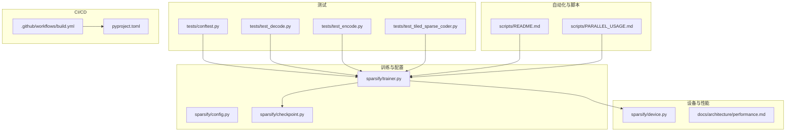
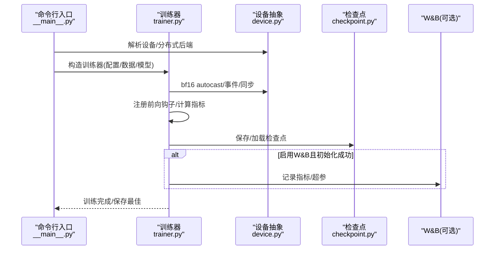
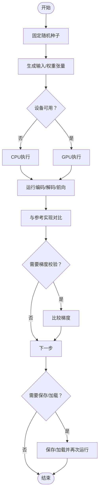
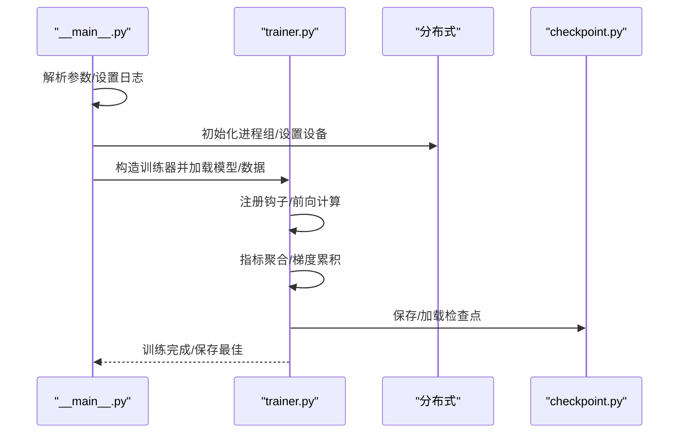
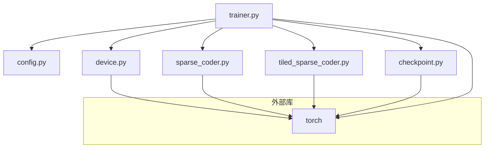

# 调试与测试

<cite>
**本文引用的文件**
- [sparsify/__main__.py](file://sparsify/__main__.py)
- [sparsify/trainer.py](file://sparsify/trainer.py)
- [sparsify/config.py](file://sparsify/config.py)
- [sparsify/device.py](file://sparsify/device.py)
- [sparsify/checkpoint.py](file://sparsify/checkpoint.py)
- [sparsify/sparse_coder.py](file://sparsify/sparse_coder.py)
- [sparsify/tiled_sparse_coder.py](file://sparsify/tiled_sparse_coder.py)
- [tests/conftest.py](file://tests/conftest.py)
- [tests/test_decode.py](file://tests/test_decode.py)
- [tests/test_encode.py](file://tests/test_encode.py)
- [tests/test_tiled_sparse_coder.py](file://tests/test_tiled_sparse_coder.py)
- [.github/workflows/build.yml](file://.github/workflows/build.yml)
- [pyproject.toml](file://pyproject.toml)
- [scripts/README.md](file://scripts/README.md)
- [scripts/PARALLEL_USAGE.md](file://scripts/PARALLEL_USAGE.md)
- [docs/architecture/performance.md](file://docs/architecture/performance.md)
</cite>

## 目录
1. [简介](#简介)
2. [项目结构](#项目结构)
3. [核心组件](#核心组件)
4. [架构总览](#架构总览)
5. [详细组件分析](#详细组件分析)
6. [依赖分析](#依赖分析)
7. [性能考虑](#性能考虑)
8. [故障排除指南](#故障排除指南)
9. [结论](#结论)
10. [附录](#附录)

## 简介
本文件面向开发者，系统化地阐述本项目的“调试与测试”实践，覆盖单元测试编写规范、测试用例设计与测试数据准备、集成测试策略、性能回归测试与分布式训练测试、调试工具与性能分析方法、异常处理与日志记录策略、错误诊断流程、测试覆盖率要求、持续集成配置与自动化测试执行，以及常见问题的调试技巧与故障排除指南。目标是帮助开发者建立完善的测试与调试能力，确保训练稳定性、性能可追踪与可回归。

## 项目结构
围绕“调试与测试”的关键目录与文件如下：
- 测试相关
  - tests/：统一的 pytest 测试套件，含设备检测、加速器可用性、编码/解码融合实现对比、分块稀疏编码器/解码器等。
  - tests/conftest.py：全局 pytest 配置，设备选择与跳过逻辑。
- 训练与配置
  - sparsify/trainer.py：训练主循环、分布式训练、日志与指标、权重与梯度管理、检查点保存与恢复。
  - sparsify/config.py：训练与稀疏编码器配置项，含超参校验与默认值。
  - sparsify/checkpoint.py：检查点保存/加载、混合器（Tiled）与常规 SAE 的兼容性校验。
- 设备抽象与性能
  - sparsify/device.py：统一的 CUDA/NPU/CPu 抽象、bf16 自动混合精度装饰器、事件与同步。
  - docs/architecture/performance.md：性能要点与建议。
- 自动化与脚本
  - scripts/README.md、scripts/PARALLEL_USAGE.md：超参扫描与并行运行脚本，支持多GPU并行、W&B 监控与结果对比。
- CI/CD
  - .github/workflows/build.yml：构建与发布流水线。
  - pyproject.toml：开发依赖（如 W&B、Sentry 等）与脚本入口。

**图表来源**
- [tests/conftest.py:1-14](file://tests/conftest.py#L1-L14)
- [tests/test_decode.py:1-85](file://tests/test_decode.py#L1-L85)
- [tests/test_encode.py:1-65](file://tests/test_encode.py#L1-L65)
- [tests/test_tiled_sparse_coder.py:1-468](file://tests/test_tiled_sparse_coder.py#L1-L468)
- [sparsify/trainer.py:1-760](file://sparsify/trainer.py#L1-L760)
- [sparsify/config.py:1-149](file://sparsify/config.py#L1-L149)
- [sparsify/checkpoint.py:1-302](file://sparsify/checkpoint.py#L1-L302)
- [sparsify/device.py:1-118](file://sparsify/device.py#L1-L118)
- [scripts/README.md:1-299](file://scripts/README.md#L1-L299)
- [scripts/PARALLEL_USAGE.md:1-166](file://scripts/PARALLEL_USAGE.md#L1-L166)
- [.github/workflows/build.yml:1-58](file://.github/workflows/build.yml#L1-L58)
- [pyproject.toml:1-131](file://pyproject.toml#L1-L131)

**章节来源**
- [tests/conftest.py:1-14](file://tests/conftest.py#L1-L14)
- [sparsify/trainer.py:1-760](file://sparsify/trainer.py#L1-L760)
- [sparsify/config.py:1-149](file://sparsify/config.py#L1-L149)
- [sparsify/device.py:1-118](file://sparsify/device.py#L1-L118)
- [scripts/README.md:1-299](file://scripts/README.md#L1-L299)
- [scripts/PARALLEL_USAGE.md:1-166](file://scripts/PARALLEL_USAGE.md#L1-L166)
- [.github/workflows/build.yml:1-58](file://.github/workflows/build.yml#L1-L58)
- [pyproject.toml:1-131](file://pyproject.toml#L1-L131)

## 核心组件
- 训练器（Trainer）
  - 负责钩子点选择、SAE 初始化、分布式封装、前向钩子、指标聚合、梯度累积与同步、检查点保存与恢复、W&B 日志。
  - 支持编译模型、Hadamard 旋转、全局 top-k 与输入混洗等高级特性。
- 配置（TrainConfig/SparseCoderConfig）
  - 超参集中定义与校验，含层选择、梯度累积、最大 token 数、死特征阈值、Tiling 参数、Hadamard 参数、编译开关、日志与保存策略等。
- 设备抽象（device.py）
  - 统一 CUDA/NPU/CPu 设备类型、bf16 支持检测、事件与同步、分布式后端选择、bf16 自动混合精度装饰器。
- 检查点（checkpoint.py）
  - 提供常规/分块 SAE 的保存/加载、Tiled 与非 Tiled 的兼容性校验、训练状态恢复、Hadamard 状态保存。
- 稀疏编码器（sparse_coder.py、tiled_sparse_coder.py）
  - 常规 SAE 与分块 SAE 的前向、编码/解码、辅助损失、归一化与梯度投影等。

**章节来源**
- [sparsify/trainer.py:1-760](file://sparsify/trainer.py#L1-L760)
- [sparsify/config.py:1-149](file://sparsify/config.py#L1-L149)
- [sparsify/device.py:1-118](file://sparsify/device.py#L1-L118)
- [sparsify/checkpoint.py:1-302](file://sparsify/checkpoint.py#L1-L302)
- [sparsify/sparse_coder.py:1-269](file://sparsify/sparse_coder.py#L1-L269)
- [sparsify/tiled_sparse_coder.py:1-342](file://sparsify/tiled_sparse_coder.py#L1-L342)

## 架构总览
下图展示训练主流程、分布式与日志/W&B 集成、设备与性能优化的关键交互。

**图表来源**
- [sparsify/__main__.py:1-211](file://sparsify/__main__.py#L1-L211)
- [sparsify/trainer.py:160-760](file://sparsify/trainer.py#L160-L760)
- [sparsify/device.py:101-118](file://sparsify/device.py#L101-L118)
- [sparsify/checkpoint.py:199-302](file://sparsify/checkpoint.py#L199-L302)

**章节来源**
- [sparsify/__main__.py:131-211](file://sparsify/__main__.py#L131-L211)
- [sparsify/trainer.py:160-760](file://sparsify/trainer.py#L160-L760)
- [sparsify/device.py:101-118](file://sparsify/device.py#L101-L118)
- [sparsify/checkpoint.py:199-302](file://sparsify/checkpoint.py#L199-L302)

## 详细组件分析

### 单元测试编写规范与用例设计
- 测试组织
  - 使用 pytest，按功能模块拆分测试文件；共享的设备检测与跳过逻辑集中在 tests/conftest.py。
  - 使用 pytest.mark.skipif 对需要加速器的测试进行条件跳过，避免在 CPU 环境误执行。
- 测试用例设计
  - 编码/解码融合实现对比：通过与“朴素实现”逐元素对比，验证数值一致性；同时验证梯度一致性与混合精度（bf16）下的数值稳定性。
  - 分块稀疏编码器/解码器：覆盖形状正确性、索引范围、死特征掩码、保存/加载、归一化、梯度传播、全局 top-k 与输入混洗等。
  - 分块 SAE（TiledSparseCoder）：覆盖初始化约束（d_in/k 可整除）、前向输出形状与索引偏移、保存/加载、归一化、梯度传播、全局 top-k 与输入混洗组合、检查点兼容性校验。
- 测试数据准备
  - 使用随机张量构造输入与权重，固定随机种子保证可重复性；在 GPU 可用时在 CUDA/NPU 上执行，否则回退到 CPU。
  - 对于耗时操作（如融合实现与基准对比），使用设备同步以消除异步影响。

**图表来源**
- [tests/test_decode.py:16-85](file://tests/test_decode.py#L16-L85)
- [tests/test_encode.py:9-65](file://tests/test_encode.py#L9-L65)
- [tests/test_tiled_sparse_coder.py:29-468](file://tests/test_tiled_sparse_coder.py#L29-L468)
- [tests/conftest.py:6-14](file://tests/conftest.py#L6-L14)

**章节来源**
- [tests/conftest.py:1-14](file://tests/conftest.py#L1-L14)
- [tests/test_decode.py:1-85](file://tests/test_decode.py#L1-L85)
- [tests/test_encode.py:1-65](file://tests/test_encode.py#L1-L65)
- [tests/test_tiled_sparse_coder.py:1-468](file://tests/test_tiled_sparse_coder.py#L1-L468)

### 集成测试策略
- 训练流水线集成
  - 通过 __main__.py 的训练入口，结合 Trainer.fit() 完整跑通一次训练循环，验证钩子注册、指标聚合、分布式同步、检查点保存与恢复。
  - 使用分布式环境变量（如 LOCAL_RANK）模拟多进程，验证分片与屏障同步。
- 数据与模型加载
  - 验证数据集加载（HF/本地磁盘）、分词与打乱、上下文长度截断、类型转换与最大样本限制。
- 日志与可视化
  - 验证日志级别设置、进度条显示、W&B 初始化与失败降级、指标广播一致性。

**图表来源**
- [sparsify/__main__.py:131-211](file://sparsify/__main__.py#L131-L211)
- [sparsify/trainer.py:160-760](file://sparsify/trainer.py#L160-L760)
- [sparsify/checkpoint.py:199-302](file://sparsify/checkpoint.py#L199-L302)

**章节来源**
- [sparsify/__main__.py:131-211](file://sparsify/__main__.py#L131-L211)
- [sparsify/trainer.py:160-760](file://sparsify/trainer.py#L160-L760)
- [sparsify/checkpoint.py:199-302](file://sparsify/checkpoint.py#L199-L302)

### 性能回归测试
- 自动化超参扫描与并行运行
  - scripts/README.md 与 scripts/PARALLEL_USAGE.md 提供了完整的超参扫描脚本与并行运行指南，支持多 GPU 并行、W&B 实时监控与结果对比。
  - 建议将关键指标（如 FVU、死特征比例、l0）纳入回归基线，定期比对不同版本的性能曲线。
- 性能文档参考
  - docs/architecture/performance.md 提供了 bf16 自动混合精度、融合编码/解码、部分前向、torch.compile 等性能要点，便于回归测试覆盖。

**章节来源**
- [scripts/README.md:1-299](file://scripts/README.md#L1-L299)
- [scripts/PARALLEL_USAGE.md:1-166](file://scripts/PARALLEL_USAGE.md#L1-L166)
- [docs/architecture/performance.md:1-75](file://docs/architecture/performance.md#L1-L75)

### 分布式训练测试
- 设备与后端
  - device.py 提供统一的设备类型判断、bf16 支持检测、事件与同步、分布式后端选择（NCCL/HCCN/Gloo）。
- 训练器分布式封装
  - trainer.py 在 DDP 环境下对 SAE 进行封装，使用 no_sync 减少通信开销，并在日志频率时进行一次性 all_reduce，降低通信次数。
- 检查点与状态恢复
  - checkpoint.py 在分布式环境下保存/加载优化器状态与训练状态，确保多进程一致性。

**章节来源**
- [sparsify/device.py:1-118](file://sparsify/device.py#L1-L118)
- [sparsify/trainer.py:338-760](file://sparsify/trainer.py#L338-L760)
- [sparsify/checkpoint.py:149-302](file://sparsify/checkpoint.py#L149-L302)

### 调试工具与性能分析方法
- PyTorch Profiler
  - 在关键路径（前向钩子、指标计算）使用 device.create_event()/synchronize() 进行高精度计时，统计平均前向时间与指标计算时间。
- NVIDIA Nsight（CUDA）
  - 在 CUDA 环境下，结合事件计时与同步，定位核函数耗时热点与同步瓶颈。
- W&B
  - 通过 Trainer 自动初始化 W&B（失败自动降级），记录指标、超参与代码快照，便于跨实验对比与回归分析。
- Sentry（可选）
  - pyproject.toml 中包含 sentry-sdk，可在生产环境捕获异常并上报。

**章节来源**
- [sparsify/trainer.py:282-719](file://sparsify/trainer.py#L282-L719)
- [sparsify/device.py:83-118](file://sparsify/device.py#L83-L118)
- [pyproject.toml:40-42](file://pyproject.toml#L40-L42)

### 异常处理机制、日志记录策略与错误诊断流程
- 异常处理
  - W&B 初始化失败时自动降级并禁用日志；检查点加载时对 Tiled 与非 Tiled 的兼容性进行显式校验并抛出清晰错误信息。
- 日志记录
  - 使用标准 logging，训练器在 rank 0 输出关键信息；__main__.py 设置基础日志格式；分布式环境下通过重定向 stdout 控制输出。
- 错误诊断流程
  - 优先检查设备可用性与 bf16 支持；确认分布式后端与进程组初始化；核对钩子点与层选择；验证检查点格式与兼容性；必要时关闭编译模式与 Hadamard 以排除额外开销。

**章节来源**
- [sparsify/trainer.py:186-227](file://sparsify/trainer.py#L186-L227)
- [sparsify/checkpoint.py:44-73](file://sparsify/checkpoint.py#L44-L73)
- [sparsify/__main__.py:131-154](file://sparsify/__main__.py#L131-L154)

## 依赖分析
- 组件耦合
  - Trainer 依赖 Config、Device、Checkpoint、SparseCoder/TiledSparseCoder；Device 为底层抽象层；Checkpoint 与 Trainer 双向协作。
- 外部依赖
  - torch、transformers、datasets、schedulefree、simple-parsing、safetensors、natsort 等；W&B、Sentry 为可选开发依赖。

**图表来源**
- [sparsify/trainer.py:1-760](file://sparsify/trainer.py#L1-L760)
- [sparsify/config.py:1-149](file://sparsify/config.py#L1-L149)
- [sparsify/device.py:1-118](file://sparsify/device.py#L1-L118)
- [sparsify/checkpoint.py:1-302](file://sparsify/checkpoint.py#L1-L302)
- [sparsify/sparse_coder.py:1-269](file://sparsify/sparse_coder.py#L1-L269)
- [sparsify/tiled_sparse_coder.py:1-342](file://sparsify/tiled_sparse_coder.py#L1-L342)

**章节来源**
- [sparsify/trainer.py:1-760](file://sparsify/trainer.py#L1-L760)
- [sparsify/config.py:1-149](file://sparsify/config.py#L1-L149)
- [sparsify/device.py:1-118](file://sparsify/device.py#L1-L118)
- [sparsify/checkpoint.py:1-302](file://sparsify/checkpoint.py#L1-L302)
- [sparsify/sparse_coder.py:1-269](file://sparsify/sparse_coder.py#L1-L269)
- [sparsify/tiled_sparse_coder.py:1-342](file://sparsify/tiled_sparse_coder.py#L1-L342)

## 性能考虑
- bf16 自动混合精度：在支持的设备上启用，显著提升吞吐与降低显存占用。
- 融合算子：编码/解码采用自定义 autograd 路径，优先使用高效实现，必要时回退到更省内存的逻辑。
- 部分前向：当钩子点位于模型前部时，提前停止前向，避免无关层的计算。
- torch.compile：在 CUDA 上编译层以减少小算子启动开销，NPU 上自动禁用。
- 分块 SAE：在大宽激活上引入结构化分解，权衡额外开销与控制力。

**章节来源**
- [docs/architecture/performance.md:1-75](file://docs/architecture/performance.md#L1-L75)
- [sparsify/device.py:101-118](file://sparsify/device.py#L101-L118)
- [sparsify/trainer.py:490-497](file://sparsify/trainer.py#L490-L497)

## 故障排除指南
- CUDA OOM
  - 降低 batch size 或提高梯度累积步数；减少 k 或扩展因子；关闭编译模式与 Hadamard。
- 端口冲突
  - 超参扫描脚本会自动递增端口，若仍冲突，请调整起始端口。
- 数据加载慢
  - 增加数据预处理并行进程数；确保数据集已分词并缓存。
- 分布式初始化失败
  - 检查 LOCAL_RANK、设备 ID 与后端（NCCL/HCCN）；确认进程组初始化与屏障同步。
- W&B 初始化失败
  - 自动降级为禁用日志；检查网络与凭据；或在 CI 环境中禁用日志。
- 检查点不兼容
  - Tiled 与非 Tiled 混用会触发类型错误；num_tiles 不匹配会触发值错误；请确保配置与检查点一致。

**章节来源**
- [scripts/README.md:273-299](file://scripts/README.md#L273-L299)
- [scripts/PARALLEL_USAGE.md:137-166](file://scripts/PARALLEL_USAGE.md#L137-L166)
- [sparsify/trainer.py:186-227](file://sparsify/trainer.py#L186-L227)
- [sparsify/checkpoint.py:44-73](file://sparsify/checkpoint.py#L44-L73)

## 结论
本项目在训练器、配置、设备抽象与检查点方面形成了清晰的职责边界，并通过 pytest 测试、超参扫描脚本与 W&B 监控实现了可重复、可观测、可回归的训练与调试闭环。建议在日常开发中坚持“先单元后集成、先本地后分布式、先 CPU 再 GPU”的调试策略，配合 bf16、融合算子与部分前向等性能优化，持续完善测试覆盖与回归基线。

## 附录
- 测试覆盖率要求（建议）
  - 单元测试：核心模块（编码/解码、前向、保存/加载）达到高覆盖率；对关键分支（bf16、DDP、Tiled、Hadamard）分别覆盖。
  - 集成测试：至少覆盖一次完整训练循环（含钩子注册、指标聚合、检查点保存/恢复）。
  - 性能回归：对关键指标（FVU、死特征比例、l0、吞吐）建立基线，定期回归。
- 持续集成配置与自动化测试执行
  - .github/workflows/build.yml 负责安装开发依赖与打包；可在其基础上扩展 pytest 与性能回归任务。
  - pyproject.toml 中的可选依赖（W&B、Sentry）可用于生产级观测与异常上报。

**章节来源**
- [.github/workflows/build.yml:1-58](file://.github/workflows/build.yml#L1-L58)
- [pyproject.toml:30-42](file://pyproject.toml#L30-L42)