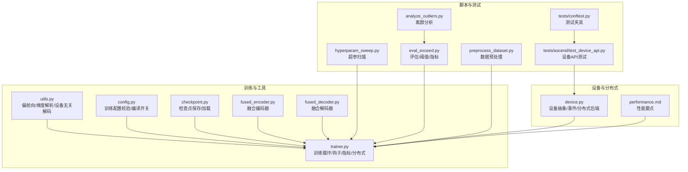
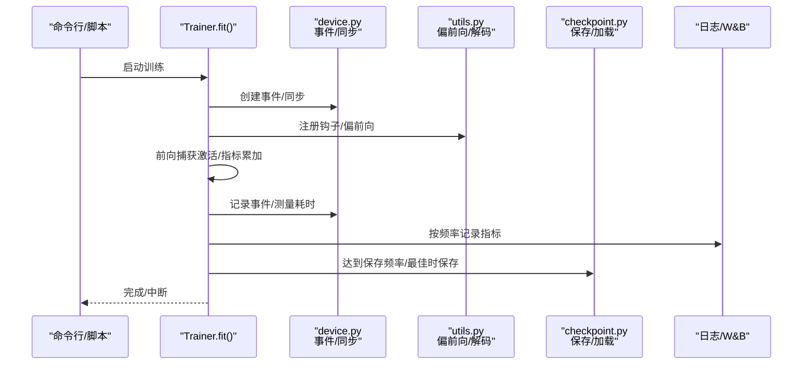
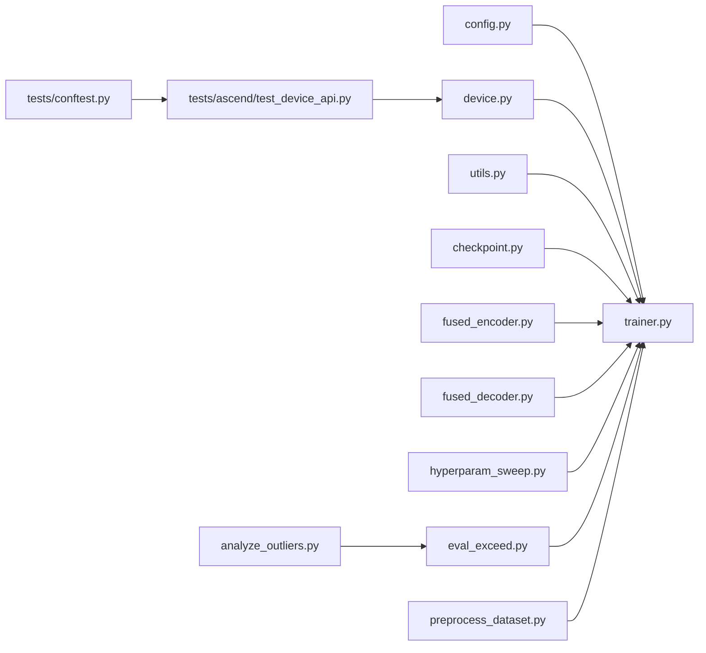

# 调试工具

<cite>
**本文引用的文件**
- [sparsify/device.py](file://sparsify/device.py)
- [sparsify/trainer.py](file://sparsify/trainer.py)
- [sparsify/utils.py](file://sparsify/utils.py)
- [sparsify/config.py](file://sparsify/config.py)
- [sparsify/checkpoint.py](file://sparsify/checkpoint.py)
- [sparsify/fused_decoder.py](file://sparsify/fused_decoder.py)
- [sparsify/fused_encoder.py](file://sparsify/fused_encoder.py)
- [scripts/analyze_outliers.py](file://scripts/analyze_outliers.py)
- [scripts/eval_exceed.py](file://scripts/eval_exceed.py)
- [scripts/hyperparam_sweep.py](file://scripts/hyperparam_sweep.py)
- [scripts/preprocess_dataset.py](file://scripts/preprocess_dataset.py)
- [tests/conftest.py](file://tests/conftest.py)
- [tests/ascend/test_device_api.py](file://tests/ascend/test_device_api.py)
- [docs/architecture/performance.md](file://docs/architecture/performance.md)
- [docs/archive/ascend/npu_profiling_analysis.md](file://docs/archive/ascend/npu_profiling_analysis.md)
</cite>

## 目录
1. [简介](#简介)
2. [项目结构](#项目结构)
3. [核心组件](#核心组件)
4. [架构总览](#架构总览)
5. [详细组件分析](#详细组件分析)
6. [依赖分析](#依赖分析)
7. [性能考量](#性能考量)
8. [故障排除指南](#故障排除指南)
9. [结论](#结论)
10. [附录](#附录)

## 简介
本文件面向开发者与研究者，系统化梳理本仓库的调试工具与方法论，覆盖以下主题：
- 设备抽象层调试与CUDA/NPU兼容性排查
- 分布式训练调试与通信瓶颈定位
- 异常处理机制、日志记录策略与错误诊断流程
- PyTorch调试技巧与分布式调试最佳实践
- 性能问题定位与优化建议（含NPU历史分析）
- 调试脚本使用指南与常见错误模式识别

目标是帮助你在不同硬件平台（CUDA/NPU）与分布式环境下，高效定位并解决问题。

## 项目结构
围绕调试与训练的关键模块如下：
- 设备抽象层：统一CUDA/NPU/CPU设备检测、bf16支持、事件计时、分布式后端等
- 训练器：封装分布式训练、钩子捕获、指标聚合、检查点保存/加载
- 工具函数：偏前向截断、维度解析、设备无关解码器实现
- 配置：训练配置校验与编译开关、Hadamard旋转等
- 脚本：超参扫描、异常分析、评估与可视化、数据预处理
- 测试：设备API一致性测试、跳过无加速器条件的测试夹具

图表来源
- [sparsify/device.py:1-118](file://sparsify/device.py#L1-L118)
- [sparsify/trainer.py:1-760](file://sparsify/trainer.py#L1-L760)
- [sparsify/utils.py:1-227](file://sparsify/utils.py#L1-L227)
- [sparsify/config.py:1-149](file://sparsify/config.py#L1-L149)
- [sparsify/checkpoint.py:1-302](file://sparsify/checkpoint.py#L1-L302)
- [sparsify/fused_encoder.py:1-107](file://sparsify/fused_encoder.py#L1-L107)
- [sparsify/fused_decoder.py:1-107](file://sparsify/fused_decoder.py#L1-L107)
- [scripts/hyperparam_sweep.py:1-273](file://scripts/hyperparam_sweep.py#L1-L273)
- [scripts/analyze_outliers.py:1-489](file://scripts/analyze_outliers.py#L1-L489)
- [scripts/eval_exceed.py:1-573](file://scripts/eval_exceed.py#L1-L573)
- [scripts/preprocess_dataset.py:1-62](file://scripts/preprocess_dataset.py#L1-L62)
- [tests/conftest.py:1-14](file://tests/conftest.py#L1-L14)
- [tests/ascend/test_device_api.py:1-70](file://tests/ascend/test_device_api.py#L1-L70)
- [docs/architecture/performance.md:1-75](file://docs/architecture/performance.md#L1-L75)

章节来源
- [sparsify/device.py:1-118](file://sparsify/device.py#L1-L118)
- [sparsify/trainer.py:1-760](file://sparsify/trainer.py#L1-L760)
- [sparsify/utils.py:1-227](file://sparsify/utils.py#L1-L227)
- [sparsify/config.py:1-149](file://sparsify/config.py#L1-L149)
- [sparsify/checkpoint.py:1-302](file://sparsify/checkpoint.py#L1-L302)
- [sparsify/fused_encoder.py:1-107](file://sparsify/fused_encoder.py#L1-L107)
- [sparsify/fused_decoder.py:1-107](file://sparsify/fused_decoder.py#L1-L107)
- [scripts/hyperparam_sweep.py:1-273](file://scripts/hyperparam_sweep.py#L1-L273)
- [scripts/analyze_outliers.py:1-489](file://scripts/analyze_outliers.py#L1-L489)
- [scripts/eval_exceed.py:1-573](file://scripts/eval_exceed.py#L1-L573)
- [scripts/preprocess_dataset.py:1-62](file://scripts/preprocess_dataset.py#L1-L62)
- [tests/conftest.py:1-14](file://tests/conftest.py#L1-L14)
- [tests/ascend/test_device_api.py:1-70](file://tests/ascend/test_device_api.py#L1-L70)
- [docs/architecture/performance.md:1-75](file://docs/architecture/performance.md#L1-L75)

## 核心组件
- 设备抽象层：提供统一的设备类型判断、bf16支持检测、事件计时、分布式后端选择、自动bf16上下文装饰器等，屏蔽CUDA/NPU差异
- 训练器：负责分布式初始化、钩子注册、指标聚合、梯度累积、检查点保存、死特征统计、超参评估指标（exceed）等
- 工具函数：提供偏前向截断（避免计算无关层）、维度解析、设备无关解码器实现（在NPU/CUDA上走融合路径）
- 配置：训练配置校验（如Hadamard块大小、编译开关在非CUDA自动禁用）、超参扫描脚本
- 脚本：超参扫描、离群分析、评估与阈值、数据预处理；测试：设备API一致性测试与跳过无加速器条件

章节来源
- [sparsify/device.py:34-118](file://sparsify/device.py#L34-L118)
- [sparsify/trainer.py:39-760](file://sparsify/trainer.py#L39-L760)
- [sparsify/utils.py:33-227](file://sparsify/utils.py#L33-L227)
- [sparsify/config.py:124-149](file://sparsify/config.py#L124-L149)
- [scripts/hyperparam_sweep.py:1-273](file://scripts/hyperparam_sweep.py#L1-L273)
- [scripts/analyze_outliers.py:1-489](file://scripts/analyze_outliers.py#L1-L489)
- [scripts/eval_exceed.py:1-573](file://scripts/eval_exceed.py#L1-L573)
- [scripts/preprocess_dataset.py:1-62](file://scripts/preprocess_dataset.py#L1-L62)
- [tests/ascend/test_device_api.py:1-70](file://tests/ascend/test_device_api.py#L1-L70)

## 架构总览
下图展示训练主循环与设备/分布式、事件计时、指标聚合之间的交互关系。

图表来源
- [sparsify/trainer.py:162-729](file://sparsify/trainer.py#L162-L729)
- [sparsify/device.py:83-98](file://sparsify/device.py#L83-L98)
- [sparsify/utils.py:113-154](file://sparsify/utils.py#L113-L154)
- [sparsify/checkpoint.py:199-302](file://sparsify/checkpoint.py#L199-L302)

## 详细组件分析

### 设备抽象层与CUDA/NPU兼容性调试
- 平台检测与bf16支持：自动检测CUDA/NPU可用性，并在NPU上强制bf16可用，在CUDA上调用原生bf16能力
- 事件计时与同步：在CUDA/NPU上分别创建Event并record/elapsed_time，CPU路径返回None
- 分布式后端：NPU使用hccl，CUDA使用nccl，CPU使用gloo
- 自动bf16上下文装饰器：在设备无关路径上启用bf16自动混合精度

调试要点
- 确认设备类型与后端匹配：通过get_device_type/get_dist_backend核对
- 事件计时仅在CUDA/NPU有效：避免在CPU上误用计时
- bf16支持：在NPU上恒为真，CUDA上通过is_bf16_supported判断

章节来源
- [sparsify/device.py:18-118](file://sparsify/device.py#L18-L118)
- [tests/ascend/test_device_api.py:1-70](file://tests/ascend/test_device_api.py#L1-L70)

### 训练器：分布式训练与指标调试
- 分布式初始化与同步：根据环境变量LOCAL_RANK包装SAE为DDP，跨进程梯度同步
- 钩子捕获与偏前向：在指定层注册forward hook，必要时通过partial_forward_to_layer提前停止，避免无关层计算
- 指标聚合与exceed评估：在启用exceed_alphas时，基于肘部阈值计算误差超过阈值的比例
- 计时与事件：在启用W&B且满足日志频率时，使用device.create_event进行forward与指标耗时统计
- 检查点保存：按频率保存，支持保存最佳模型；在多进程下使用barrier保证一致性

调试要点
- 日志频率与计时：当should_time为真时才记录事件，避免CPU路径的性能偏差
- DDP no_sync：在微批次/梯度累积场景下，使用no_sync减少不必要的梯度同步
- 死特征统计：使用MIN allreduce传播任何GPU上的“已触发”零值，避免AI_CPU fallback

章节来源
- [sparsify/trainer.py:162-729](file://sparsify/trainer.py#L162-L729)
- [sparsify/utils.py:113-154](file://sparsify/utils.py#L113-L154)
- [sparsify/checkpoint.py:199-302](file://sparsify/checkpoint.py#L199-L302)

### 设备无关解码器与融合算子
- 设备无关解码：在NPU/CUDA上使用融合解码器，避免CPU回退；在CPU上回退到标准embedding_bag
- 融合编码器/解码器：通过自定义autograd函数，优先使用scatter+matmul（在阈值内）以获得更好的NPU/CUDA利用率

调试要点
- 确认融合路径是否命中：关注阈值与内存占用，避免fallback导致的CPU回退
- 在NPU上避免index_add/scatter_add回退到CPU

章节来源
- [sparsify/utils.py:173-227](file://sparsify/utils.py#L173-L227)
- [sparsify/fused_encoder.py:1-107](file://sparsify/fused_encoder.py#L1-L107)
- [sparsify/fused_decoder.py:1-107](file://sparsify/fused_decoder.py#L1-L107)

### 配置与超参扫描
- 训练配置校验：Hadamard块大小必须为2的幂；compile_model仅在CUDA生效
- 超参扫描脚本：批量生成命令，自动端口递增，支持干跑预览、失败继续、快速测试

调试要点
- 在非CUDA平台自动禁用compile_model，避免运行时错误
- 使用干跑模式先核对命令与参数

章节来源
- [sparsify/config.py:124-149](file://sparsify/config.py#L124-L149)
- [scripts/hyperparam_sweep.py:1-273](file://scripts/hyperparam_sweep.py#L1-L273)

### 评估与离群分析
- 评估脚本：加载模型/数据/SAE，支持Hadamard旋转与离群裁剪，计算exceed指标与top-k统计
- 离群分析脚本：两阶段统计RMS/MAX/分位数，计算离群比例与直方图，支持绘图输出

调试要点
- 确保hook_mode与hookpoints正确，避免空mask导致统计无效
- 使用partial_forward减少无关层计算，提升评估效率

章节来源
- [scripts/eval_exceed.py:1-573](file://scripts/eval_exceed.py#L1-L573)
- [scripts/analyze_outliers.py:1-489](file://scripts/analyze_outliers.py#L1-L489)

### 数据预处理与测试夹具
- 数据预处理脚本：加载数据集、分词、切分并保存，支持并行进程数控制
- 测试夹具：在无加速器时跳过相关测试，确保测试稳定性

章节来源
- [scripts/preprocess_dataset.py:1-62](file://scripts/preprocess_dataset.py#L1-L62)
- [tests/conftest.py:1-14](file://tests/conftest.py#L1-L14)

## 依赖分析
- 训练器依赖设备抽象层（事件/同步/后端）、工具函数（偏前向/解码）、配置（校验/编译开关）、检查点（保存/加载）
- 脚本与训练器解耦，通过命令行参数驱动；评估/离群分析脚本独立于训练器，但共享相同的钩子与维度解析工具

图表来源
- [sparsify/config.py:1-149](file://sparsify/config.py#L1-L149)
- [sparsify/trainer.py:1-760](file://sparsify/trainer.py#L1-L760)
- [sparsify/device.py:1-118](file://sparsify/device.py#L1-L118)
- [sparsify/utils.py:1-227](file://sparsify/utils.py#L1-L227)
- [sparsify/checkpoint.py:1-302](file://sparsify/checkpoint.py#L1-L302)
- [sparsify/fused_encoder.py:1-107](file://sparsify/fused_encoder.py#L1-L107)
- [sparsify/fused_decoder.py:1-107](file://sparsify/fused_decoder.py#L1-L107)
- [scripts/hyperparam_sweep.py:1-273](file://scripts/hyperparam_sweep.py#L1-L273)
- [scripts/eval_exceed.py:1-573](file://scripts/eval_exceed.py#L1-L573)
- [scripts/analyze_outliers.py:1-489](file://scripts/analyze_outliers.py#L1-L489)
- [scripts/preprocess_dataset.py:1-62](file://scripts/preprocess_dataset.py#L1-L62)
- [tests/conftest.py:1-14](file://tests/conftest.py#L1-L14)
- [tests/ascend/test_device_api.py:1-70](file://tests/ascend/test_device_api.py#L1-L70)

## 性能考量
- BF16自动混合精度：在支持的后端默认开启，显著降低显存与带宽压力
- 融合算子：编码器/解码器在阈值内使用scatter+matmul，避免NPU上的vector core回退
- 偏前向：仅计算到最大层索引，减少无关层计算
- torch.compile：仅在CUDA启用，减少kernel launch开销
- NPU历史分析：EmbeddingBag与IndexPut在vector core上运行，成为主要瓶颈；可通过融合路径替代

章节来源
- [docs/architecture/performance.md:1-75](file://docs/architecture/performance.md#L1-L75)
- [docs/archive/ascend/npu_profiling_analysis.md:1-248](file://docs/archive/ascend/npu_profiling_analysis.md#L1-L248)
- [sparsify/fused_decoder.py:1-107](file://sparsify/fused_decoder.py#L1-L107)
- [sparsify/fused_encoder.py:1-107](file://sparsify/fused_encoder.py#L1-L107)

## 故障排除指南

### 设备与分布式问题
- 症状：设备类型检测错误或bf16不可用
  - 排查：确认CUDA/NPU驱动与torch版本，检查device.py中的可用性检测逻辑
  - 参考：[sparsify/device.py:18-64](file://sparsify/device.py#L18-L64)
- 症状：事件计时无效或报错
  - 排查：仅在CUDA/NPU上创建事件；CPU路径返回None
  - 参考：[sparsify/device.py:83-89](file://sparsify/device.py#L83-L89)
- 症状：DDP通信阻塞或端口冲突
  - 排查：使用脚本自动递增master_port；检查网络与NCCL/HCCM环境
  - 参考：[scripts/hyperparam_sweep.py:76-78](file://scripts/hyperparam_sweep.py#L76-L78)

### 训练与指标问题
- 症状：exceed指标为空或全零
  - 排查：确认hook_mode与hookpoints正确；确保存在肘部阈值文件且匹配hookpoint
  - 参考：[sparsify/trainer.py:428-478](file://sparsify/trainer.py#L428-L478)
- 症状：死特征比例异常高
  - 排查：检查dead_feature_threshold设置与num_tokens_since_fired更新逻辑
  - 参考：[sparsify/trainer.py:586-616](file://sparsify/trainer.py#L586-L616)
- 症状：计时统计缺失
  - 排查：should_time与log_to_wandb条件是否满足；事件记录与同步是否在CUDA/NPU路径
  - 参考：[sparsify/trainer.py:524-567](file://sparsify/trainer.py#L524-L567)

### 融合算子与NPU兼容性
- 症状：NPU上出现CPU回退（IndexPut/EmbeddingBag在vector core）
  - 排查：确认融合解码器阈值与内存占用；避免fallback路径
  - 参考：[sparsify/fused_decoder.py:24-51](file://sparsify/fused_decoder.py#L24-L51)
- 症状：Hadamard旋转导致额外开销
  - 排查：评估是否值得的精度/稳定性权衡；必要时关闭
  - 参考：[docs/architecture/performance.md:50-53](file://docs/architecture/performance.md#L50-L53)

### 超参扫描与数据问题
- 症状：超参扫描中断或端口冲突
  - 排查：使用--continue-on-error继续；修改MASTER_PORT
  - 参考：[scripts/hyperparam_sweep.py:162-167](file://scripts/hyperparam_sweep.py#L162-L167)
- 症状：数据加载慢或OOM
  - 排查：提高data_preprocessing_num_proc；减小batch_size或增大grad_acc_steps
  - 参考：[scripts/hyperparam_sweep.py:24-68](file://scripts/hyperparam_sweep.py#L24-L68)

### 测试与设备API
- 症状：无加速器时测试被跳过
  - 排查：确认环境变量与设备可用性；使用测试夹具控制跳过行为
  - 参考：[tests/conftest.py:1-14](file://tests/conftest.py#L1-L14)

章节来源
- [sparsify/device.py:18-118](file://sparsify/device.py#L18-L118)
- [sparsify/trainer.py:428-616](file://sparsify/trainer.py#L428-L616)
- [sparsify/fused_decoder.py:24-51](file://sparsify/fused_decoder.py#L24-L51)
- [scripts/hyperparam_sweep.py:162-167](file://scripts/hyperparam_sweep.py#L162-L167)
- [tests/conftest.py:1-14](file://tests/conftest.py#L1-L14)

## 结论
本仓库提供了完善的设备抽象层、分布式训练与指标体系、融合算子与性能优化策略，以及配套的调试脚本与测试夹具。遵循本文档的调试流程与最佳实践，可在CUDA/NPU平台上高效定位与解决训练过程中的异常与性能瓶颈。

## 附录

### 调试脚本使用指南
- 超参扫描：先使用--dry-run预览命令，再逐步放开参数；遇到失败可用--continue-on-error继续
  - 参考：[scripts/hyperparam_sweep.py:160-273](file://scripts/hyperparam_sweep.py#L160-L273)
- 离群分析：设置hookpoints与hook_mode，两阶段统计RMS/MAX/分位数与离群比例，可选绘图输出
  - 参考：[scripts/analyze_outliers.py:279-489](file://scripts/analyze_outliers.py#L279-L489)
- 评估与阈值：加载SAE与模型，计算exceed指标与top-k统计，支持Hadamard旋转与离群裁剪
  - 参考：[scripts/eval_exceed.py:266-573](file://scripts/eval_exceed.py#L266-L573)
- 数据预处理：并行分词与切分，保存至磁盘
  - 参考：[scripts/preprocess_dataset.py:35-62](file://scripts/preprocess_dataset.py#L35-L62)

### 常见错误模式与解决方案
- 错误模式：Hadamard块大小非2的幂
  - 解决：调整为2的幂
  - 参考：[sparsify/config.py:144-148](file://sparsify/config.py#L144-L148)
- 错误模式：compile_model在非CUDA启用
  - 解决：自动禁用
  - 参考：[sparsify/config.py:138-142](file://sparsify/config.py#L138-L142)
- 错误模式：NPU上IndexPut回退到CPU
  - 解决：使用融合解码器路径
  - 参考：[sparsify/fused_decoder.py:24-51](file://sparsify/fused_decoder.py#L24-L51)
- 错误模式：DDP端口冲突
  - 解决：脚本自动递增端口或手动修改
  - 参考：[scripts/hyperparam_sweep.py:76-78](file://scripts/hyperparam_sweep.py#L76-L78)