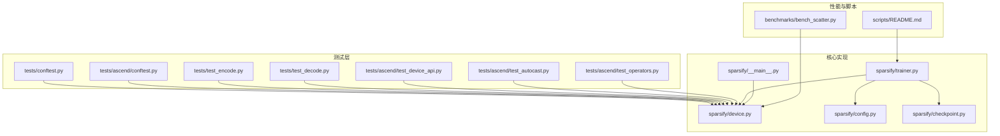
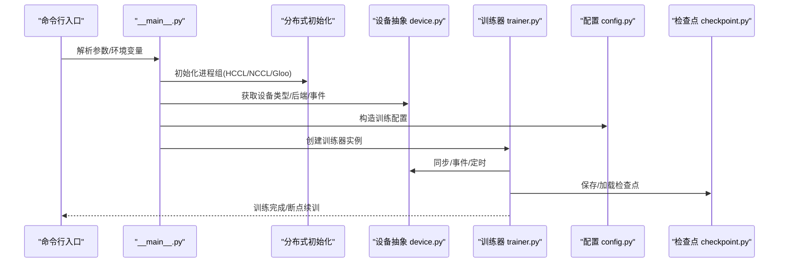
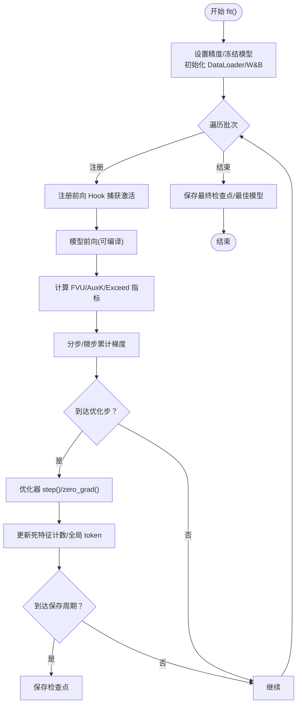
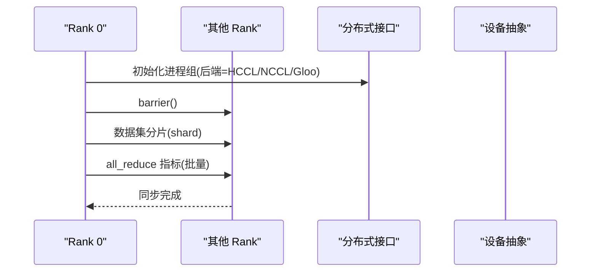
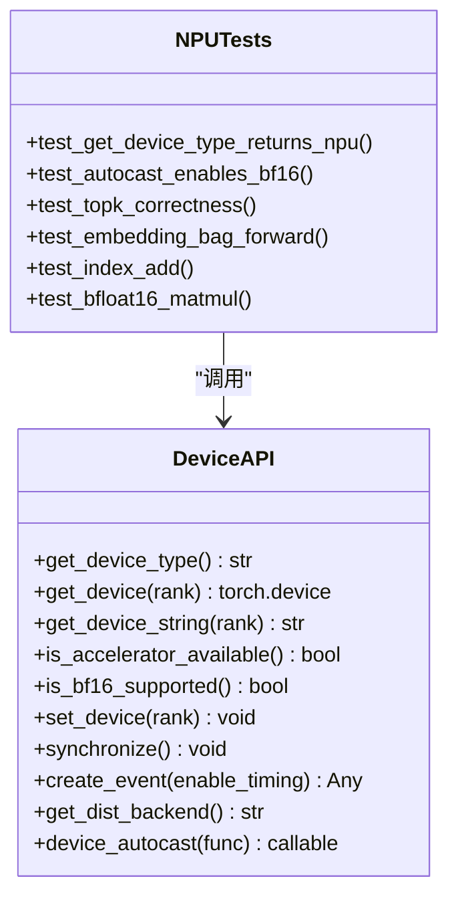
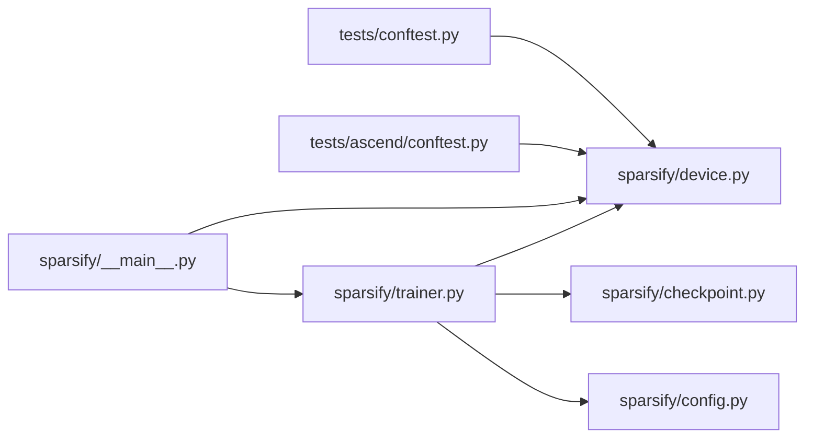

# 集成测试

<cite>
**本文引用的文件**   
- [tests/conftest.py](file://tests/conftest.py)
- [tests/ascend/conftest.py](file://tests/ascend/conftest.py)
- [sparsify/device.py](file://sparsify/device.py)
- [sparsify/trainer.py](file://sparsify/trainer.py)
- [sparsify/config.py](file://sparsify/config.py)
- [sparsify/checkpoint.py](file://sparsify/checkpoint.py)
- [sparsify/__main__.py](file://sparsify/__main__.py)
- [tests/test_encode.py](file://tests/test_encode.py)
- [tests/test_decode.py](file://tests/test_decode.py)
- [tests/ascend/test_device_api.py](file://tests/ascend/test_device_api.py)
- [tests/ascend/test_autocast.py](file://tests/ascend/test_autocast.py)
- [tests/ascend/test_operators.py](file://tests/ascend/test_operators.py)
- [benchmarks/bench_scatter.py](file://benchmarks/bench_scatter.py)
- [scripts/README.md](file://scripts/README.md)
</cite>

## 目录
1. [简介](#简介)
2. [项目结构](#项目结构)
3. [核心组件](#核心组件)
4. [架构总览](#架构总览)
5. [详细组件分析](#详细组件分析)
6. [依赖分析](#依赖分析)
7. [性能考虑](#性能考虑)
8. [故障排查指南](#故障排查指南)
9. [结论](#结论)
10. [附录](#附录)

## 简介
本文件面向系统级集成测试，覆盖端到端训练流程、分布式训练与设备兼容性，重点阐述 Ascend NPU 测试的特殊配置与要求，包括设备 API、自动混合精度（bf16 自动降采样）与关键算子验证。文档同时给出测试环境搭建、测试数据准备、执行流程、性能回归方法、内存泄漏检测与资源清理策略，并提供编写指南与执行脚本。

## 项目结构
围绕集成测试的关键目录与文件如下：
- 测试配置与夹具：tests/conftest.py、tests/ascend/conftest.py
- 设备抽象与自动精度：sparsify/device.py
- 训练器与分布式：sparsify/trainer.py、sparsify/__main__.py
- 配置与检查点：sparsify/config.py、sparsify/checkpoint.py
- 端到端与算子测试：tests/test_encode.py、tests/test_decode.py、tests/ascend/test_device_api.py、tests/ascend/test_autocast.py、tests/ascend/test_operators.py
- 性能基准：benchmarks/bench_scatter.py
- 超参扫描与批量实验：scripts/README.md

**图表来源**
- [tests/conftest.py:1-14](file://tests/conftest.py#L1-L14)
- [tests/ascend/conftest.py:1-52](file://tests/ascend/conftest.py#L1-L52)
- [sparsify/device.py:1-118](file://sparsify/device.py#L1-L118)
- [sparsify/trainer.py:1-760](file://sparsify/trainer.py#L1-L760)
- [sparsify/config.py:1-149](file://sparsify/config.py#L1-L149)
- [sparsify/checkpoint.py:1-302](file://sparsify/checkpoint.py#L1-L302)
- [sparsify/__main__.py:128-171](file://sparsify/__main__.py#L128-L171)
- [benchmarks/bench_scatter.py:1-176](file://benchmarks/bench_scatter.py#L1-L176)
- [scripts/README.md:1-299](file://scripts/README.md#L1-L299)

**章节来源**
- [tests/conftest.py:1-14](file://tests/conftest.py#L1-L14)
- [tests/ascend/conftest.py:1-52](file://tests/ascend/conftest.py#L1-L52)
- [sparsify/device.py:1-118](file://sparsify/device.py#L1-L118)
- [sparsify/trainer.py:1-760](file://sparsify/trainer.py#L1-L760)
- [sparsify/config.py:1-149](file://sparsify/config.py#L1-L149)
- [sparsify/checkpoint.py:1-302](file://sparsify/checkpoint.py#L1-L302)
- [sparsify/__main__.py:128-171](file://sparsify/__main__.py#L128-L171)
- [benchmarks/bench_scatter.py:1-176](file://benchmarks/bench_scatter.py#L1-L176)
- [scripts/README.md:1-299](file://scripts/README.md#L1-L299)

## 核心组件
- 设备抽象层：统一 CUDA/NPU/CPU 的设备检测、事件、同步、bf16 支持与分布式后端选择。
- 训练器：端到端训练流程、Hook 注入、分布式 DDP 包装、梯度累积、指标聚合与日志记录。
- 配置与检查点：训练配置、超参、断点续训、权重序列化与恢复。
- Ascend NPU 测试夹具：自动跳过无硬件时的测试，提供 npu/npu:0 设备夹具。
- 端到端与算子测试：编码器融合、解码器融合、bf16 自动降采样、关键算子正确性与梯度一致性。

**章节来源**
- [sparsify/device.py:34-118](file://sparsify/device.py#L34-L118)
- [sparsify/trainer.py:39-760](file://sparsify/trainer.py#L39-L760)
- [sparsify/config.py:28-149](file://sparsify/config.py#L28-L149)
- [sparsify/checkpoint.py:101-302](file://sparsify/checkpoint.py#L101-L302)
- [tests/ascend/conftest.py:31-52](file://tests/ascend/conftest.py#L31-L52)
- [tests/test_encode.py:9-65](file://tests/test_encode.py#L9-L65)
- [tests/test_decode.py:16-85](file://tests/test_decode.py#L16-L85)
- [tests/ascend/test_device_api.py:18-70](file://tests/ascend/test_device_api.py#L18-L70)
- [tests/ascend/test_autocast.py:8-47](file://tests/ascend/test_autocast.py#L8-L47)
- [tests/ascend/test_operators.py:15-174](file://tests/ascend/test_operators.py#L15-L174)

## 架构总览
下图展示了从命令入口到训练器再到分布式与设备抽象的整体流程，以及 Ascend NPU 特殊路径。

**图表来源**
- [sparsify/__main__.py:134-171](file://sparsify/__main__.py#L134-L171)
- [sparsify/device.py:92-118](file://sparsify/device.py#L92-L118)
- [sparsify/trainer.py:162-729](file://sparsify/trainer.py#L162-L729)
- [sparsify/config.py:28-149](file://sparsify/config.py#L28-L149)
- [sparsify/checkpoint.py:149-302](file://sparsify/checkpoint.py#L149-L302)

## 详细组件分析

### 训练流程测试（端到端）
- 目标：验证从模型加载、Hook 注入、前向/反向、指标计算到断点保存的完整链路。
- 关键点：
  - 训练器在初始化时解析 hookpoints、构建 SAE、设置优化器与学习率。
  - 主循环按批处理输入，注册 Hook 捕获激活，延迟归约与日志，周期性保存。
  - 断点续训通过检查点加载训练状态与权重。
- 验证内容：
  - 训练器构造与配置校验。
  - Hook 注入与前向捕获、指标聚合与日志频率控制。
  - 断点保存与恢复的一致性。

**图表来源**
- [sparsify/trainer.py:162-729](file://sparsify/trainer.py#L162-L729)
- [sparsify/checkpoint.py:199-302](file://sparsify/checkpoint.py#L199-L302)

**章节来源**
- [sparsify/trainer.py:162-729](file://sparsify/trainer.py#L162-L729)
- [sparsify/checkpoint.py:149-302](file://sparsify/checkpoint.py#L149-L302)

### 分布式训练测试
- 目标：验证多进程/多卡场景下的初始化、数据分片、同步与指标归约。
- 关键点：
  - 进程组初始化使用设备抽象返回的后端名称（NPU=HCCL，CUDA=NCCL，否则Gloo）。
  - 数据集按世界规模分片，丢弃不能整除的样本避免死锁。
  - 指标归约采用批量 all_reduce，降低通信开销。
- 验证内容：
  - 进程组初始化成功且设备 ID 正确。
  - 数据分片与屏障同步行为。
  - 指标归约结果一致性。

**图表来源**
- [sparsify/__main__.py:138-171](file://sparsify/__main__.py#L138-L171)
- [sparsify/device.py:92-98](file://sparsify/device.py#L92-L98)
- [sparsify/trainer.py:294-333](file://sparsify/trainer.py#L294-L333)

**章节来源**
- [sparsify/__main__.py:138-171](file://sparsify/__main__.py#L138-L171)
- [sparsify/device.py:92-98](file://sparsify/device.py#L92-L98)
- [sparsify/trainer.py:294-333](file://sparsify/trainer.py#L294-L333)

### 设备兼容性测试（Ascend NPU）
- 目标：验证设备 API、bf16 自动降采样、关键算子在 NPU 上的行为与数值一致性。
- 关键点：
  - 自动跳过：无 NPU 环境时自动跳过 Ascend 目录下测试。
  - 设备 API：设备类型、设备字符串、设备设置、同步、事件创建与耗时测量。
  - 自动混合精度：device_autocast 装饰器与上下文管理器在 NPU 上启用 bf16。
  - 算子正确性：topk、embedding_bag、index_add_、linear、relu、bf16 matmul 等。
- 验证内容：
  - get_device_type 返回 "npu"，get_dist_backend 返回 "hccl"。
  - autocast 下输出 dtype 为 bfloat16，梯度可回传。
  - 关键算子前向/反向数值与 CPU 对齐，索引语义一致。

**图表来源**
- [sparsify/device.py:34-118](file://sparsify/device.py#L34-L118)
- [tests/ascend/test_device_api.py:18-70](file://tests/ascend/test_device_api.py#L18-L70)
- [tests/ascend/test_autocast.py:8-47](file://tests/ascend/test_autocast.py#L8-L47)
- [tests/ascend/test_operators.py:15-174](file://tests/ascend/test_operators.py#L15-L174)

**章节来源**
- [tests/ascend/conftest.py:31-52](file://tests/ascend/conftest.py#L31-L52)
- [tests/ascend/test_device_api.py:18-70](file://tests/ascend/test_device_api.py#L18-L70)
- [tests/ascend/test_autocast.py:8-47](file://tests/ascend/test_autocast.py#L8-L47)
- [tests/ascend/test_operators.py:15-174](file://tests/ascend/test_operators.py#L15-L174)
- [sparsify/device.py:34-118](file://sparsify/device.py#L34-L118)

### 端到端编码/解码测试
- 目标：验证编码器融合与解码器融合的正确性与梯度一致性。
- 关键点：
  - 编码器融合：topk 与线性层/ReLU 组合，结果与逐算子实现一致。
  - 解码器融合：embedding_bag 与 eager 实现一致；bf16 autocast 下梯度稳定。
- 验证内容：
  - 数值对齐（atol/rtol）、梯度一致性、默认实现为融合实现。

**章节来源**
- [tests/test_encode.py:9-65](file://tests/test_encode.py#L9-L65)
- [tests/test_decode.py:16-85](file://tests/test_decode.py#L16-L85)

### 性能回归与基准
- 目标：识别 NPU 上的性能退化与热点。
- 方法：
  - 事件计时（NPU Event）、流水线计时（queue ops 后统一 sync）、同步计时（每轮 sync）。
  - 对比不同实现（scatter_add_ vs index_put_ vs gather+sum/bmm）。
- 建议：
  - 在 CI 中固定工作负载，记录平均耗时与标准差，建立阈值告警。
  - 将关键路径纳入回归矩阵（如解码器融合、指标归约）。

**章节来源**
- [benchmarks/bench_scatter.py:60-176](file://benchmarks/bench_scatter.py#L60-L176)
- [sparsify/trainer.py:294-333](file://sparsify/trainer.py#L294-L333)

## 依赖分析
- 测试夹具与设备抽象：
  - tests/conftest.py 与 tests/ascend/conftest.py 通过 is_accelerator_available 与 NPU 检测决定跳过策略。
  - sparsify/device.py 提供统一的设备 API 与 bf16 支持。
- 训练器与分布式：
  - sparsify/trainer.py 依赖 device.py 进行事件/同步/后端选择；__main__.py 负责分布式初始化与数据分片。
- 配置与检查点：
  - sparsify/config.py 校验超参；sparsify/checkpoint.py 负责权重与状态的序列化/反序列化。

**图表来源**
- [tests/conftest.py:1-14](file://tests/conftest.py#L1-L14)
- [tests/ascend/conftest.py:15-35](file://tests/ascend/conftest.py#L15-L35)
- [sparsify/device.py:18-118](file://sparsify/device.py#L18-L118)
- [sparsify/trainer.py:24-34](file://sparsify/trainer.py#L24-L34)
- [sparsify/checkpoint.py:101-302](file://sparsify/checkpoint.py#L101-L302)
- [sparsify/config.py:28-149](file://sparsify/config.py#L28-L149)
- [sparsify/__main__.py:138-171](file://sparsify/__main__.py#L138-L171)

**章节来源**
- [tests/conftest.py:1-14](file://tests/conftest.py#L1-L14)
- [tests/ascend/conftest.py:15-35](file://tests/ascend/conftest.py#L15-L35)
- [sparsify/device.py:18-118](file://sparsify/device.py#L18-L118)
- [sparsify/trainer.py:24-34](file://sparsify/trainer.py#L24-L34)
- [sparsify/checkpoint.py:101-302](file://sparsify/checkpoint.py#L101-L302)
- [sparsify/config.py:28-149](file://sparsify/config.py#L28-L149)
- [sparsify/__main__.py:138-171](file://sparsify/__main__.py#L138-L171)

## 性能考虑
- 计时模式：
  - NPU Event：设备侧耗时，避免 CPU 同步掩盖的管道停顿。
  - Pipeline：队列多个操作后一次性同步，更贴近真实吞吐。
  - Sync：每轮同步，易掩盖性能差异。
- 指标归约：
  - 批量 all_reduce 减少通信次数，提升吞吐。
- 算子路径：
  - 优先使用融合实现（如解码器融合），减少中间张量与调度开销。

**章节来源**
- [benchmarks/bench_scatter.py:60-110](file://benchmarks/bench_scatter.py#L60-L110)
- [sparsify/trainer.py:294-333](file://sparsify/trainer.py#L294-L333)

## 故障排查指南
- NPU 环境缺失：
  - Ascend 目录测试自动跳过，确认 torch_npu 可导入与 torch.npu.is_available()。
- bf16 混合精度：
  - device_autocast 在 NPU 上启用 bf16；若出现 NaN，检查输入 dtype 与缩放。
- 分布式死锁：
  - 确保数据集长度可被世界规模整除；使用 barrier 与分片逻辑。
- 指标异常：
  - 检查归约操作与日志频率；确认 rank 0 写入日志。
- 检查点不匹配：
  - tiled 与非 tiled 混用会触发类型/维度错误；确保 num_tiles 一致。

**章节来源**
- [tests/ascend/conftest.py:15-35](file://tests/ascend/conftest.py#L15-L35)
- [sparsify/device.py:58-118](file://sparsify/device.py#L58-L118)
- [sparsify/__main__.py:161-169](file://sparsify/__main__.py#L161-L169)
- [sparsify/trainer.py:654-720](file://sparsify/trainer.py#L654-L720)
- [sparsify/checkpoint.py:44-73](file://sparsify/checkpoint.py#L44-L73)

## 结论
本集成测试体系以设备抽象为核心，贯通端到端训练、分布式与 Ascend NPU 特性验证。通过自动跳过机制、统一 API 与严格的数值/梯度一致性校验，确保在多平台与多设备上的稳定性与性能一致性。建议在 CI 中引入性能回归与资源清理检查，持续保障系统级功能的完整验证。

## 附录

### 测试环境搭建
- 硬件与驱动：确保 Ascend NPU 驱动与 torch_npu 可用；CUDA 环境用于对比与 bf16 autocast 验证。
- Python 依赖：pytest、torch、transformers、schedulefree、safetensors、datasets 等。
- 环境变量：LOCAL_RANK、MASTER_PORT（分布式）、WANDB_PROJECT/WANDB_ENTITY（日志）。

**章节来源**
- [tests/ascend/conftest.py:15-24](file://tests/ascend/conftest.py#L15-L24)
- [sparsify/__main__.py:138-145](file://sparsify/__main__.py#L138-L145)

### 测试数据准备
- 数据集：使用 HuggingFace Dataset，支持切片与分片；确保可整除世界规模。
- 阈值文件：用于 exceed 指标评估的肘部阈值 JSON。
- 权重：检查点目录包含 cfg.json、sae.safetensors、optimizer_*.pt、state.pt 等。

**章节来源**
- [sparsify/trainer.py:244-248](file://sparsify/trainer.py#L244-L248)
- [sparsify/checkpoint.py:104-198](file://sparsify/checkpoint.py#L104-L198)

### 测试执行流程
- 单机单卡：pytest tests/ 或 pytest tests/ascend/（无 NPU 自动跳过）。
- 分布式：torchrun --nproc_per_node=N python -m pytest tests/ascend/（按 LOCAL_RANK 初始化）。
- 超参扫描：参考 scripts/README.md 的 sweep 脚本，批量运行多配置实验。

**章节来源**
- [scripts/README.md:17-32](file://scripts/README.md#L17-L32)
- [sparsify/__main__.py:138-171](file://sparsify/__main__.py#L138-L171)

### 性能回归测试方法
- 基准脚本：bench_scatter.py 提供多种计时模式与实现对比，建议在 CI 中固定工作负载并记录均值/方差。
- 指标：forward_time、metrics_time、exceed 指标、死特征比例等。

**章节来源**
- [benchmarks/bench_scatter.py:129-176](file://benchmarks/bench_scatter.py#L129-L176)
- [sparsify/trainer.py:667-720](file://sparsify/trainer.py#L667-L720)

### 内存泄漏检测与资源清理
- 事件与同步：使用 device.create_event 与 synchronize，避免悬空事件。
- 分布式：退出前销毁进程组，确保 barrier 完成。
- 检查点：保存/加载后及时删除临时中间文件，避免磁盘占用。

**章节来源**
- [sparsify/device.py:83-90](file://sparsify/device.py#L83-L90)
- [sparsify/trainer.py:640-642](file://sparsify/trainer.py#L640-L642)
- [sparsify/checkpoint.py:246-302](file://sparsify/checkpoint.py#L246-L302)

### 编写指南与最佳实践
- 标记与夹具：使用 requires_accelerator 或 Ascend 自动跳过标记；在 Ascend 测试中使用 npu/npu_device 夹具。
- 数值与梯度：优先使用 torch.testing.assert_close，设定合理 atol/rtol。
- 分布式：在测试中模拟多进程，或使用单机多卡；确保数据分片与同步。
- 日志与可视化：结合 W&B 与本地日志，记录关键指标与耗时。

**章节来源**
- [tests/conftest.py:6-13](file://tests/conftest.py#L6-L13)
- [tests/ascend/conftest.py:31-52](file://tests/ascend/conftest.py#L31-L52)
- [tests/test_decode.py:58-77](file://tests/test_decode.py#L58-L77)
- [sparsify/trainer.py:186-227](file://sparsify/trainer.py#L186-L227)