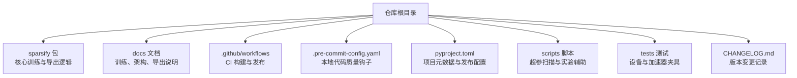
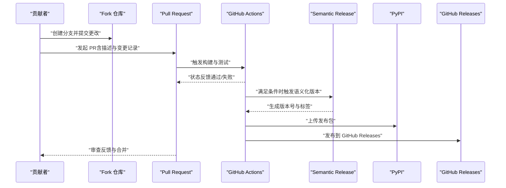
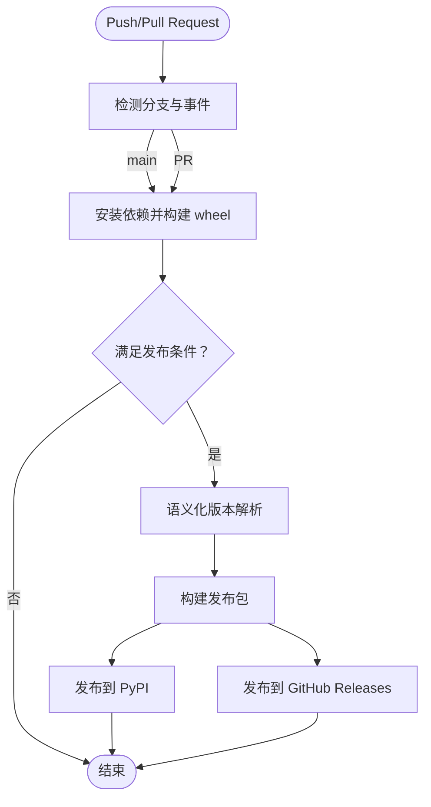
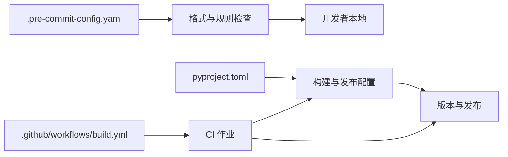

# 贡献流程

<cite>
**本文引用的文件**
- [README.md](file://README.md)
- [CLAUDE.md](file://CLAUDE.md)
- [.github/workflows/build.yml](file://.github/workflows/build.yml)
- [.pre-commit-config.yaml](file://.pre-commit-config.yaml)
- [pyproject.toml](file://pyproject.toml)
- [docs/README.md](file://docs/README.md)
- [docs/overview.md](file://docs/overview.md)
- [docs/training/quickstart.md](file://docs/training/quickstart.md)
- [CHANGELOG.md](file://CHANGELOG.md)
- [scripts/README.md](file://scripts/README.md)
- [tests/conftest.py](file://tests/conftest.py)
</cite>

## 目录
1. [简介](#简介)
2. [项目结构](#项目结构)
3. [核心组件](#核心组件)
4. [架构总览](#架构总览)
5. [详细组件分析](#详细组件分析)
6. [依赖分析](#依赖分析)
7. [性能考虑](#性能考虑)
8. [故障排查指南](#故障排查指南)
9. [结论](#结论)
10. [附录](#附录)

## 简介
本文件旨在为贡献者提供从 fork 仓库到提交 Pull Request 的完整流程说明，涵盖 Issue 创建规范、功能请求与 Bug 报告模板、分支命名约定、提交信息格式、合并策略、代码审查流程、CI/CD 自动化检查与发布流程、贡献者协议与许可证要求、知识产权说明，以及新贡献者的入门指导与常见问题解答。目标是使贡献流程清晰透明，降低协作门槛。

## 项目结构
本仓库围绕“稀疏自编码器（SAE）训练与导出”这一核心目标组织，主要代码位于 sparsify 包，配套文档位于 docs 目录，自动化构建与发布由 GitHub Actions 与 semantic-release 驱动，本地开发与质量保障通过 pre-commit 与测试夹具支持。

图表来源
- [README.md:1-154](file://README.md#L1-L154)
- [docs/README.md:1-34](file://docs/README.md#L1-L34)
- [.github/workflows/build.yml:1-58](file://.github/workflows/build.yml#L1-L58)
- [.pre-commit-config.yaml:1-19](file://.pre-commit-config.yaml#L1-L19)
- [pyproject.toml:1-131](file://pyproject.toml#L1-L131)
- [scripts/README.md:1-299](file://scripts/README.md#L1-L299)
- [tests/conftest.py:1-14](file://tests/conftest.py#L1-L14)

章节来源
- [README.md:1-154](file://README.md#L1-L154)
- [docs/README.md:1-34](file://docs/README.md#L1-L34)

## 核心组件
- 训练与导出主流程：通过 CLI 入口训练 SAE 检查点，计算肘部阈值，导出 LUT 友好制品。
- 文档体系：概览、训练快速开始、配置参考、架构与导出说明等，按主题分层组织。
- CI/CD：GitHub Actions 负责构建 wheel、语义化版本发布与 PyPI/GitHub Releases 发布。
- 本地质量：pre-commit 钩子负责空白字符清理、文件结尾修复、大文件检查、Black、Ruff 格式与规则检查。
- 版本与变更：pyproject.toml 中 semantic-release 配置与 CHANGELOG.md 记录版本变更。

章节来源
- [docs/overview.md:1-63](file://docs/overview.md#L1-L63)
- [docs/training/quickstart.md:1-153](file://docs/training/quickstart.md#L1-L153)
- [.github/workflows/build.yml:1-58](file://.github/workflows/build.yml#L1-L58)
- [.pre-commit-config.yaml:1-19](file://.pre-commit-config.yaml#L1-L19)
- [pyproject.toml:65-131](file://pyproject.toml#L65-L131)
- [CHANGELOG.md:1-99](file://CHANGELOG.md#L1-L99)

## 架构总览
下图展示贡献者从 fork 到 PR 提交、CI 自动化与发布的关键交互：

图表来源
- [.github/workflows/build.yml:1-58](file://.github/workflows/build.yml#L1-L58)
- [pyproject.toml:65-131](file://pyproject.toml#L65-L131)

## 详细组件分析

### 从 fork 到提交 PR 的完整流程
- fork 仓库：在 GitHub 上 fork 主仓库，获得个人副本。
- 本地克隆与开发环境：
  - 安装开发依赖：参考安装与快速开始文档。
  - 运行测试：确保本地环境满足加速器要求。
- 分支管理：
  - 建议采用功能分支或修复分支，遵循统一命名约定。
  - 同步上游：定期 rebase 或 merge upstream/main，保持分支整洁。
- 提交与推送：
  - 使用符合约定的提交信息格式，便于语义化版本解析。
  - 推送至远程分支，准备发起 PR。
- 发起 PR：
  - 填写 PR 描述，关联 Issue（如适用），并附上变更记录摘要。
  - 确保 CI 通过，响应审查意见，必要时补充测试或文档。

章节来源
- [docs/training/quickstart.md:7-153](file://docs/training/quickstart.md#L7-L153)
- [tests/conftest.py:1-14](file://tests/conftest.py#L1-L14)

### Issue 创建规范、功能请求与 Bug 报告模板
- 功能请求（Feature）：
  - 清晰描述需求背景、预期行为与验收标准。
  - 说明与现有功能的关系及对用户的价值。
- Bug 报告（Bug）：
  - 环境信息：Python 版本、依赖版本、平台（CUDA/NPU）、硬件。
  - 复现步骤：最小可复现实例与命令行参数。
  - 期望与实际结果：明确差异。
  - 日志与截图：便于定位问题。
- 通用建议：
  - 搜索已有 Issue，避免重复。
  - 使用清晰标题与标签，便于追踪。

[本节为通用规范说明，不直接分析具体文件]

### 分支命名约定
- 功能分支：feature/主题或 feat/主题
- 修复分支：fix/主题或 hotfix/主题
- 文档分支：docs/主题
- 重构分支：refactor/主题
- 验证分支：test/主题或 experiment/主题

[本节为通用规范说明，不直接分析具体文件]

### 提交信息格式
- 类型限定：feat、fix、docs、style、refactor、test、build、ci、chore、perf
- 格式：类型(作用域): 概述
- 说明：正文与脚注可选，遵循 Conventional Commits 解析规则，以便语义化版本自动识别。

章节来源
- [pyproject.toml:113-121](file://pyproject.toml#L113-L121)

### 合并策略
- 代码审查：至少一名维护者批准。
- CI 通过：构建、测试与质量检查均需通过。
- 变更记录：PR 描述中包含对应变更记录摘要，便于更新 CHANGELOG。
- 合并方式：squash 合并以保持提交历史整洁；rebase 亦可按团队约定。

[本节为通用规范说明，不直接分析具体文件]

### 代码审查流程
- 自检：提交前运行本地质量钩子与测试。
- 审查要点：功能正确性、边界条件、性能影响、可维护性、文档与注释。
- 反馈处理：及时响应评论，补充说明或修改，必要时追加测试。

章节来源
- [.pre-commit-config.yaml:1-19](file://.pre-commit-config.yaml#L1-L19)
- [tests/conftest.py:1-14](file://tests/conftest.py#L1-L14)

### CI/CD 自动化检查与发布流程
- 触发条件：针对 main 分支的 push 与 pull_request。
- 步骤：
  - 检出代码、设置 Python 版本、安装依赖（含开发依赖）。
  - 构建 wheel。
  - 语义化版本：根据提交信息自动识别版本与变更类型。
  - 构建发布包并发布到 PyPI 与 GitHub Releases。
- 并发控制：发布作业受并发锁保护，避免重复发布。

图表来源
- [.github/workflows/build.yml:1-58](file://.github/workflows/build.yml#L1-L58)
- [pyproject.toml:65-131](file://pyproject.toml#L65-L131)

章节来源
- [.github/workflows/build.yml:1-58](file://.github/workflows/build.yml#L1-L58)
- [pyproject.toml:65-131](file://pyproject.toml#L65-L131)

### 贡献者协议、许可证与知识产权
- 许可证：项目采用 MIT 许可证，详见项目元数据配置。
- 贡献者协议：本仓库未提供单独的CLA文件；贡献即默认同意以项目许可证开源。
- 知识产权：贡献者保留其原创版权，许可范围以项目许可证为准；第三方依赖的版权与许可请遵从相应条款。

章节来源
- [pyproject.toml:11](file://pyproject.toml#L11)

### 新贡献者入门指导
- 环境准备：安装开发依赖，确保加速器可用（CUDA/NPU）。
- 文档阅读：从概览与训练快速开始入手，理解端到端工作流。
- 本地验证：运行测试与示例命令，确认环境正常。
- 贡献实践：从文档改进或小修复入手，逐步参与核心功能。

章节来源
- [docs/overview.md:1-63](file://docs/overview.md#L1-L63)
- [docs/training/quickstart.md:1-153](file://docs/training/quickstart.md#L1-L153)
- [tests/conftest.py:1-14](file://tests/conftest.py#L1-L14)

## 依赖分析
- 本地质量依赖：pre-commit 钩子链路保证代码风格与基础检查。
- 构建与发布依赖：pyproject.toml 定义构建系统、依赖与语义化发布配置。
- CI 依赖：GitHub Actions 作业定义了构建、发布与版本策略。

图表来源
- [.pre-commit-config.yaml:1-19](file://.pre-commit-config.yaml#L1-L19)
- [pyproject.toml:1-131](file://pyproject.toml#L1-L131)
- [.github/workflows/build.yml:1-58](file://.github/workflows/build.yml#L1-L58)

章节来源
- [.pre-commit-config.yaml:1-19](file://.pre-commit-config.yaml#L1-L19)
- [pyproject.toml:1-131](file://pyproject.toml#L1-L131)
- [.github/workflows/build.yml:1-58](file://.github/workflows/build.yml#L1-L58)

## 性能考虑
- 本地质量检查：pre-commit 钩子在提交前拦截问题，减少 CI 失败概率。
- CI 并发与缓存：合理规划 PR 提交时机，避免频繁触发不必要的构建。
- 语义化版本：遵循提交信息类型与消息规范，确保版本发布节奏稳定。

[本节提供一般性建议，不直接分析具体文件]

## 故障排查指南
- 本地质量失败：
  - 检查空白字符、文件结尾与大文件；运行 pre-commit 自动修复。
  - 参考 Ruff 与 Black 的规则提示，修正代码风格。
- CI 失败：
  - 查看构建日志，确认依赖安装与 Python 版本。
  - 确认语义化版本解析是否符合提交信息格式。
- 测试失败：
  - 确认加速器可用性与设备夹具配置。
  - 参考测试夹具中的跳过逻辑与设备选择。

章节来源
- [.pre-commit-config.yaml:1-19](file://.pre-commit-config.yaml#L1-L19)
- [.github/workflows/build.yml:1-58](file://.github/workflows/build.yml#L1-L58)
- [tests/conftest.py:1-14](file://tests/conftest.py#L1-L14)

## 结论
本贡献流程文档以仓库现有配置与文档为基础，结合 CI/CD 与本地质量工具，明确了从 fork 到 PR、从代码审查到发布的全链路规范。建议贡献者在提交前完成本地自检与测试，遵循提交信息与分支命名约定，确保 PR 能顺利通过 CI 并被及时审查与合并。

[本节为总结性内容，不直接分析具体文件]

## 附录

### 常见问题解答（FAQ）
- 如何开始本地开发？
  - 安装开发依赖，运行示例命令与测试，确保环境可用。
- 为什么我的 PR 一直失败？
  - 检查 pre-commit 是否通过、CI 日志是否有依赖或版本问题、提交信息是否符合约定。
- 如何参与文档改进？
  - 从概览与快速开始入手，确认文档与代码一致后再提交 PR。
- 如何避免发布冲突？
  - 遵循语义化版本约定，避免在非 main 分支直接推送导致意外发布。

章节来源
- [docs/training/quickstart.md:1-153](file://docs/training/quickstart.md#L1-L153)
- [.github/workflows/build.yml:1-58](file://.github/workflows/build.yml#L1-L58)
- [pyproject.toml:65-131](file://pyproject.toml#L65-L131)