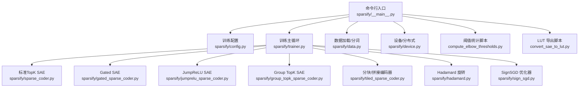
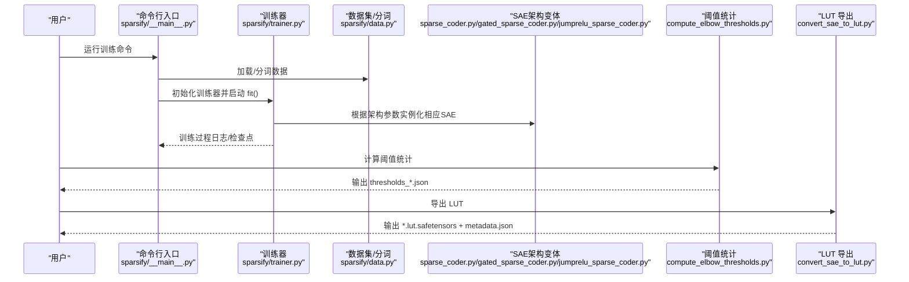
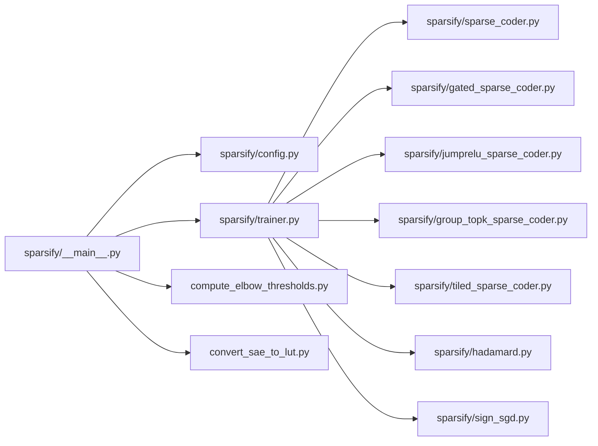

# 快速开始

<cite>
**本文引用的文件列表**
- [README.md](file://README.md)
- [docs/training/quickstart.md](file://docs/training/quickstart.md)
- [docs/training/qwen3-guide.md](file://docs/training/qwen3-guide.md)
- [docs/training/config-reference.md](file://docs/training/config-reference.md)
- [sparsify/__main__.py](file://sparsify/__main__.py)
- [sparsify/config.py](file://sparsify/config.py)
- [sparsify/trainer.py](file://sparsify/trainer.py)
- [sparsify/gated_sparse_coder.py](file://sparsify/gated_sparse_coder.py)
- [sparsify/jumprelu_sparse_coder.py](file://sparsify/jumprelu_sparse_coder.py)
- [sparsify/group_topk_sparse_coder.py](file://sparsify/group_topk_sparse_coder.py)
- [compute_elbow_thresholds.py](file://compute_elbow_thresholds.py)
- [convert_sae_to_lut.py](file://convert_sae_to_lut.py)
- [scripts/first_time_train/Qwen3-0.6B/script.sh](file://scripts/first_time_train/Qwen3-0.6B/script.sh)
- [pyproject.toml](file://pyproject.toml)
- [scripts/README.md](file://scripts/README.md)
- [LUTurbo-doc/experiments/20260319-sae-architecture.md](file://LUTurbo-doc/experiments/20260319-sae-architecture.md)
- [LUTurbo-doc/ideas/sae-improvement.md](file://LUTurbo-doc/ideas/sae-improvement.md)
</cite>

## 更新摘要
**变更内容**
- 新增多种SAE架构变体的实践示例，包括标准TopK SAE、Gated SAE和JumpReLU SAE的具体参数配置
- 新增残差SAE训练的Level 2 SAE示例和级联训练流程
- 完善了配置参考文档，增加了架构选择参数和训练变体说明
- 增强了故障排除指南，提供了不同架构变体的特定问题解决方案

## 目录
1. [简介](#简介)
2. [项目结构](#项目结构)
3. [核心组件](#核心组件)
4. [架构总览](#架构总览)
5. [详细组件解析](#详细组件解析)
6. [SAE架构变体实践](#sae架构变体实践)
7. [依赖关系分析](#依赖关系分析)
8. [性能与资源建议](#性能与资源建议)
9. [故障排除指南](#故障排除指南)
10. [结论](#结论)
11. [附录](#附录)

## 简介
本快速开始面向首次接触 Sparsify 的用户，目标是在最短时间内完成一次从 Qwen3 模型到 SAE 训练、阈值统计与 LUT 导出的完整流程。文档覆盖环境准备、安装、最小可行示例、常用命令行参数与配置项说明，并提供常见问题排查建议与预期输出指引，帮助你在本地或集群上顺利跑通第一个训练任务。

**更新** 新版本整合了更清晰的工作流指导，从安装到导出的每个步骤都有明确的说明和示例，并新增了多种SAE架构变体的实践指导。

## 项目结构
Sparsify 是围绕"在 Transformer 模块输入上训练稀疏自编码器（SAE）"而构建的工具链，主要入口与核心模块如下：
- 命令行入口：`sparsify/__main__.py`
- 训练配置：`sparsify/config.py`
- 训练主循环：`sparsify/trainer.py`
- 标准TopK SAE实现：`sparsify/sparse_coder.py`
- Gated SAE实现：`sparsify/gated_sparse_coder.py`
- JumpReLU SAE实现：`sparsify/jumprelu_sparse_coder.py`
- Group TopK SAE实现：`sparsify/group_topk_sparse_coder.py`
- 阈值统计：`compute_elbow_thresholds.py`
- LUT 导出：`convert_sae_to_lut.py`
- 文档与示例脚本：`docs/`、`scripts/`



**图表来源**
- [sparsify/__main__.py](file://sparsify/__main__.py)
- [sparsify/config.py](file://sparsify/config.py)
- [sparsify/trainer.py](file://sparsify/trainer.py)
- [sparsify/gated_sparse_coder.py](file://sparsify/gated_sparse_coder.py)
- [sparsify/jumprelu_sparse_coder.py](file://sparsify/jumprelu_sparse_coder.py)
- [sparsify/group_topk_sparse_coder.py](file://sparsify/group_topk_sparse_coder.py)

**章节来源**
- [README.md:1-154](file://README.md#L1-L154)
- [docs/training/quickstart.md:1-153](file://docs/training/quickstart.md#L1-L153)

## 核心组件
- 命令行入口与参数解析：负责加载模型、数据集、分词、分布式初始化、训练器实例化与启动。
- 训练配置：统一管理 SAE 架构参数、训练超参、钩子点、编译/分块/Hadamard 等选项。
- 训练主循环：基于 forward 钩子采集模块输入作为激活，执行 Top-K 稀疏编码与 FVU 重构损失，结合 AuxK 与梯度累积等机制。
- SAE架构变体：
  - 标准TopK SAE：使用全局Top-K选择机制
  - Gated SAE：分离选择分支和幅度分支，参数量翻倍但字典质量可能更优
  - JumpReLU SAE：每特征独立阈值，训练时可变K，部署时固定K
  - Group TopK SAE：分组路由机制，减少搜索空间
- 阈值统计：在推理模式下对指定模块输入收集激活分布，计算 Kneedle 拐点并导出 JSON。
- LUT 导出：读取 SAE 权重与目标层权重，预计算 W_dec @ W_target.T 与偏置项，保存为 LUT 文件并生成元数据。

**章节来源**
- [sparsify/__main__.py:1-211](file://sparsify/__main__.py#L1-L211)
- [sparsify/config.py:1-220](file://sparsify/config.py#L1-L220)
- [sparsify/trainer.py:1-200](file://sparsify/trainer.py#L1-L200)
- [sparsify/gated_sparse_coder.py:1-77](file://sparsify/gated_sparse_coder.py#L1-L77)
- [sparsify/jumprelu_sparse_coder.py:1-69](file://sparsify/jumprelu_sparse_coder.py#L1-L69)
- [sparsify/group_topk_sparse_coder.py:1-68](file://sparsify/group_topk_sparse_coder.py#L1-L68)
- [compute_elbow_thresholds.py:1-660](file://compute_elbow_thresholds.py#L1-L660)
- [convert_sae_to_lut.py:1-783](file://convert_sae_to_lut.py#L1-L783)

## 架构总览
以下序列图展示了从命令行到训练、阈值统计与 LUT 导出的端到端流程。



**图表来源**
- [sparsify/__main__.py:131-211](file://sparsify/__main__.py#L131-L211)
- [sparsify/trainer.py:162-200](file://sparsify/trainer.py#L162-L200)
- [compute_elbow_thresholds.py:364-660](file://compute_elbow_thresholds.py#L364-L660)
- [convert_sae_to_lut.py:604-783](file://convert_sae_to_lut.py#L604-L783)

## 详细组件解析

### 安装与环境准备
- Python 版本要求：>=3.10
- 推荐平台：NVIDIA/CUDA（当前主推路径），可选 Ascend/NPU 作为兼容路径
- 依赖安装方式：
  - 本地开发安装：在仓库根目录执行安装命令
  - PyPI 安装：可直接从 PyPI 安装发布包
- 可选依赖：开发工具、可视化与日志（如 W&B）

**更新** 安装说明更加简洁明了，直接指向仓库根目录的安装命令。

**章节来源**
- [pyproject.toml:9,12-28,30-42](file://pyproject.toml#L9,L12-L28,L30-L42)
- [README.md:24-34](file://README.md#L24-L34)

### 最小可行训练示例（Qwen3）
- 目标：在 Qwen3-0.6B 上训练 SAE，针对注意力输出投影（o_proj）的模块输入进行稀疏编码
- 建议参数组合（来自官方最小示例与指南）：
  - 数据集：HuggingFaceFW/fineweb（可使用 sample-10BT 子集）
  - 文本列：text
  - 钩子点：layers.[7,14].self_attn.o_proj
  - 上下文长度：2048
  - 批大小：1
  - 梯度累积步数：8
  - SAE 扩张因子：8
  - SAE 活跃数：128
  - 保存目录：checkpoints
  - 运行名：qwen3-oproj-demo
- 命令参考（请在仓库根目录执行）：
  - 参考路径：[docs/training/quickstart.md:21-33](file://docs/training/quickstart.md#L21-L33)
  - 官方最小示例：[README.md:40-52](file://README.md#L40-L52)

**更新** 最小示例更加简洁，直接提供完整的命令行示例，便于用户快速复制使用。

预期输出（检查点目录结构）：
- 运行名目录：checkpoints/<run_name>_dp1_bs1_ga8_ef8_k128_<timestamp>/
- 典型文件：
  - config.json：训练配置
  - state.pt：全局步数与 token 总数
  - optimizer_0.pt：优化器状态
  - <hookpoint>/cfg.json：SAE 配置
  - <hookpoint>/sae.safetensors：SAE 权重

**章节来源**
- [docs/training/quickstart.md:42-58](file://docs/training/quickstart.md#L42-L58)
- [README.md:36-52](file://README.md#L36-L52)

### 常用命令行参数与配置项
- 运行参数（RunConfig）：
  - model、dataset、split、ctx_len、hf_token、revision、max_examples、resume、text_column、shuffle_seed、data_preprocessing_num_proc、data_args
- SAE 参数（SparseCoderConfig）：
  - sae.expansion_factor、sae.normalize_decoder、sae.num_latents、sae.k、sae.architecture
  - sae.jumprelu_init_threshold、sae.jumprelu_bandwidth（仅当architecture="jumprelu"）
  - sae.num_groups、sae.active_groups（仅当architecture="group_topk"）
- 训练参数（TrainConfig）：
  - batch_size、grad_acc_steps、micro_acc_steps、max_tokens、lr、auxk_alpha、dead_feature_threshold、exceed_alphas、elbow_threshold_path、hookpoints、init_seeds、layers、layer_stride、num_tiles、global_topk、input_mixing、use_hadamard、hadamard_block_size、hadamard_seed、hadamard_use_perm、compile_model、save_every、save_best、save_dir、log_to_wandb、run_name、wandb_project、wandb_log_frequency、finetune
  - residual_from（用于Level 2 SAE训练）
- 行为要点：
  - 钩子点支持范围展开语法，训练使用模块输入作为激活
  - 若未提供数据集列名，CLI 将在线分词
  - DDP 模式下会按世界规模裁剪数据并分片
  - resume 支持精确路径或自动匹配命名后缀
  - compile_model 仅在 CUDA 生效
  - architecture 参数决定实例化的SAE实现类型

**更新** 配置参考文档更加详细，包含了每个参数的含义、行为说明和验证规则，新增了架构变体相关参数。

**章节来源**
- [docs/training/config-reference.md:12-217](file://docs/training/config-reference.md#L12-L217)
- [sparsify/config.py:29,124-220](file://sparsify/config.py#L29,L124-L220)
- [sparsify/__main__.py:31-128](file://sparsify/__main__.py#L31-L128)

### 阈值统计与 LUT 导出
- 阈值统计：
  - 输入：模型、数据集、钩子点集合、目标 token 数、上下文长度、输出文件、最大分位数、可选绘图目录
  - 流程：加载模型与数据，注册钩子收集激活，计算 Kneedle 拐点，输出 JSON
  - 参考路径：[docs/training/quickstart.md:80-104](file://docs/training/quickstart.md#L80-L104)
- LUT 导出：
  - 输入：基础模型路径、检查点基目录、输出目录、投影类型（qproj/oproj/upproj/qkv/gate_up）、层范围、阈值目录、输出 dtype、设备、批量计算开关
  - 流程：定位检查点，加载 SAE 权重，提取目标层权重，计算预计算矩阵与偏置项，保存 LUT 文件与元数据
  - 参考路径：[docs/training/quickstart.md:106-134](file://docs/training/quickstart.md#L106-L134)

**更新** 阈值统计和 LUT 导出的说明更加详细，包含了具体的使用场景和参数配置。

**章节来源**
- [compute_elbow_thresholds.py:364-660](file://compute_elbow_thresholds.py#L364-L660)
- [convert_sae_to_lut.py:604-783](file://convert_sae_to_lut.py#L604-L783)

### 分布式与设备
- DDP 初始化与屏障同步
- 设备选择与 bf16 支持探测
- compile_model 仅在 CUDA 生效，其他后端会自动禁用
- 可通过脚本示例了解多卡训练与端口分配

**更新** 平台说明更加明确，强调了 CUDA 作为默认选项的重要性。

**章节来源**
- [sparsify/__main__.py:131-211](file://sparsify/__main__.py#L131-L211)
- [docs/training/quickstart.md:148-153](file://docs/training/quickstart.md#L148-L153)
- [scripts/first_time_train/Qwen3-0.6B/script.sh:11-85](file://scripts/first_time_train/Qwen3-0.6B/script.sh#L11-L85)

## SAE架构变体实践

### 标准TopK SAE
标准TopK SAE是最基础的稀疏编码器实现，使用全局Top-K选择机制：

- **核心特点**：
  - 使用全局Top-K选择激活的特征
  - 参数量相对较少，训练稳定
  - 适合大多数基础实验和基准测试

- **推荐配置**：
  - sae.architecture = "topk"
  - sae.k = 128（Qwen3-0.6B推荐）
  - sae.expansion_factor = 8
  - sae.normalize_decoder = True

- **适用场景**：
  - 基线实验和性能对比
  - 需要稳定训练的场景
  - 资源受限的环境

**章节来源**
- [sparsify/config.py:23-25](file://sparsify/config.py#L23-L25)
- [sparsify/sparse_coder.py:1-28](file://sparsify/sparse_coder.py#L1-L28)

### Gated SAE
Gated SAE将选择和幅度计算分离为两个独立分支，参数量翻倍但可能获得更好的字典质量：

- **核心特点**：
  - 独立的gate分支：sigmoid评分 + Top-K选择
  - 独立的magnitude分支：ReLU系数计算
  - 解码器共享，保持与标准SAE的兼容性
  - 训练时观察字典质量而非直接推理使用

- **参数配置**：
  - sae.architecture = "gated"
  - sae.k = 32/64/128（根据实验1最优值）
  - 需要更大的内存和计算资源

- **训练流程**：
  ```bash
  # Gated SAE训练示例
  python -m sparsify $MODEL $DATASET \
      --sae.k 64 --sae.gated \
      --sae.expansion_factor 8 \
      --hookpoints "layers.[0-30].self_attn.o_proj" \
      --save_dir checkpoints/gated_k64
  ```

- **优势**：
  - gate网络可能更容易低秩化
  - 训练信号更清洁，字典质量可能更高
  - gate网络参数量相对较小

**章节来源**
- [sparsify/gated_sparse_coder.py:12-77](file://sparsify/gated_sparse_coder.py#L12-L77)
- [LUTurbo-doc/experiments/20260319-sae-architecture.md:24-56](file://LUTurbo-doc/experiments/20260319-sae-architecture.md#L24-L56)

### JumpReLU SAE
JumpReLU SAE使用每特征独立的可学习阈值，训练时可变K，部署时固定K：

- **核心特点**：
  - 每个特征有独立阈值θ_i
  - 训练时使用STE（Straight-Through Estimator）近似
  - 输出仍保持固定K，保持与标准SAE的接口兼容
  - K由输入动态决定，简单输入激活较少特征

- **参数配置**：
  - sae.architecture = "jumprelu"
  - sae.jumprelu_init_threshold = 0.001（默认）
  - sae.jumprelu_bandwidth = 0.001（控制STE锐度）
  - 通过调整初始阈值控制平均K≈128

- **训练流程**：
  ```bash
  # JumpReLU SAE训练示例
  python -m sparsify $MODEL $DATASET \
      --sae.activation jumprelu \
      --sae.expansion_factor 8 \
      --hookpoints "layers.[0-30].self_attn.o_proj" \
      --save_dir checkpoints/jumprelu
  ```

- **评估方式**：
  - 观察K的分布（均值、标准差、P99）
  - 用JumpReLU字典 + TopK=32/64/128部署评估
  - 对比基线：标准TopK=32/64/128的FVU

**章节来源**
- [sparsify/jumprelu_sparse_coder.py:12-69](file://sparsify/jumprelu_sparse_coder.py#L12-L69)
- [LUTurbo-doc/experiments/20260319-sae-architecture.md:57-87](file://LUTurbo-doc/experiments/20260319-sae-architecture.md#L57-L87)

### Group TopK SAE
Group TopK SAE通过分组路由机制减少搜索空间，提高训练效率：

- **核心特点**：
  - 独立的组路由器（G×d_in）
  - 每个输入选择g个组
  - 在选中组的特征并集上做全局Top-K
  - 训练期原型实现，推理期优化

- **参数配置**：
  - sae.architecture = "group_topk"
  - sae.num_groups = 16/32/64（必须能整除num_latents）
  - sae.active_groups = 2/4/8（每个输入选择的组数）
  - num_latents必须能被num_groups整除

- **优势**：
  - 减少搜索空间，提高训练效率
  - 更好的结构化特性
  - 适合大规模SAE训练

**章节来源**
- [sparsify/group_topk_sparse_coder.py:39-68](file://sparsify/group_topk_sparse_coder.py#L39-L68)
- [LUTurbo-doc/experiments/20260319-sae-structured.md:35-73](file://LUTurbo-doc/experiments/20260319-sae-structured.md#L35-L73)

### 残差/多级SAE（Level 2 SAE）
残差SAE将重构分为两级，第一级捕捉主导结构，第二级修正残差：

- **核心原理**：
  ```
  Level 1: z1 = TopK(E1·x + b1, K1),   x̂1 = D1[S1]^T · α1
  Level 2: r = x - x̂1,                z2 = TopK(E2·r + b2, K2)
  Total:   x̂ = x̂1 + r̂
  ```

- **训练方式**：
  - **级联训练**：先训练Level 1到收敛，冻结后训练Level 2
  - **联合训练**：两级端到端训练，总损失=||x-x̂1-r̂||²

- **参数配置**：
  - Level 1：--sae.k 32/64，保存到checkpoints/residual_L1
  - Level 2：--sae.k 16/32/48，--residual_from checkpoints/residual_L1

- **训练流程**：
  ```bash
  # Phase 1: 训练Level 1 SAE
  python -m sparsify $MODEL $DATASET \
      --sae.k 32 \
      --hookpoints "layers.[0-30].self_attn.o_proj" \
      --save_dir checkpoints/residual_L1
  
  # Phase 2: 冻结Level 1，训练Level 2
  python -m sparsify $MODEL $DATASET \
      --sae.k 32 \
      --residual_from checkpoints/residual_L1 \
      --hookpoints "layers.[0-30].self_attn.o_proj" \
      --save_dir checkpoints/residual_L2
  ```

- **优势**：
  - Level 1可能只需少量基向量（K1=16-32）
  - Level 2在残差上操作，可能更低维
  - 每级选择问题结构不同

**章节来源**
- [LUTurbo-doc/experiments/20260319-sae-architecture.md:88-117](file://LUTurbo-doc/experiments/20260319-sae-architecture.md#L88-L117)
- [LUTurbo-doc/ideas/sae-improvement.md:293-314](file://LUTurbo-doc/ideas/sae-improvement.md#L293-L314)
- [sparsify/trainer.py:166-178](file://sparsify/trainer.py#L166-L178)

## 依赖关系分析
- 命令行入口依赖训练配置、数据加载、设备与分布式模块
- 训练器依赖 SAE 核心与分块实现、Hadamard 旋转、优化器包装器
- SAE架构变体继承自基础SparseCoder，提供不同的编码实现
- 阈值统计与 LUT 导出分别独立运行，前者依赖模型与数据加载，后者依赖 SAE 检查点与目标模型权重



**图表来源**
- [sparsify/__main__.py:1-211](file://sparsify/__main__.py#L1-L211)
- [sparsify/trainer.py:1-200](file://sparsify/trainer.py#L1-L200)
- [sparsify/gated_sparse_coder.py:1-77](file://sparsify/gated_sparse_coder.py#L1-L77)
- [sparsify/jumprelu_sparse_coder.py:1-69](file://sparsify/jumprelu_sparse_coder.py#L1-L69)
- [sparsify/group_topk_sparse_coder.py:1-68](file://sparsify/group_topk_sparse_coder.py#L1-L68)

**章节来源**
- [sparsify/__main__.py:1-211](file://sparsify/__main__.py#L1-L211)
- [sparsify/trainer.py:1-200](file://sparsify/trainer.py#L1-L200)

## 性能与资源建议
- CUDA 为首选平台；compile_model 仅在 CUDA 生效
- 对于较小模型（如 Qwen3-0.6B），建议从较小 batch_size 与较大 grad_acc_steps 组合起步，逐步提升
- 不同SAE架构的资源需求：
  - 标准TopK SAE：最低资源需求
  - Gated SAE：参数量翻倍，需要更多内存
  - JumpReLU SAE：训练稳定，资源需求适中
  - Group TopK SAE：需要满足分组整除条件
  - 残差SAE：两级训练，总资源需求更高
- 使用多卡训练时，确保每卡显存足够容纳 SAE 参数与中间张量
- 如需大规模超参扫描，可参考脚本文档与 sweep 脚本

**更新** 性能建议更加实用，提供了不同SAE架构变体的具体参数调整策略和资源需求对比。

**章节来源**
- [docs/training/quickstart.md:148-153](file://docs/training/quickstart.md#L148-L153)
- [scripts/README.md:1-299](file://scripts/README.md#L1-L299)

## 故障排除指南
- 无法找到检查点或命名不匹配
  - 现象：resume 模式提示找不到匹配的检查点
  - 处理：确认 save_dir/run_name 或使用完整路径；自动匹配会查找带时间戳的后缀
  - 参考路径：[sparsify/__main__.py:173-195](file://sparsify/__main__.py#L173-L195)
- 钩子点未匹配
  - 现象：未匹配任何模块名
  - 处理：检查范围语法与模型实际模块名；可先打印匹配列表验证
  - 参考路径：[sparsify/trainer.py:49-73](file://sparsify/trainer.py#L49-L73)
- CUDA 内存不足（OOM）
  - 现象：训练报 OOM
  - 处理：降低 batch_size 或提高 grad_acc_steps；必要时启用 batch_compute（导出时）
  - 参考路径：[scripts/README.md:275-299](file://scripts/README.md#L275-L299)
- 端口冲突（多卡训练）
  - 现象：torchrun 报端口占用
  - 处理：脚本会自动递增端口；若仍冲突，调整起始端口
  - 参考路径：[scripts/first_time_train/Qwen3-0.6B/script.sh:11-85](file://scripts/first_time_train/Qwen3-0.6B/script.sh#L11-L85)
- 阈值统计失败
  - 现象：Kneedle 未找到明显拐点
  - 处理：增大 max_percentile 或增加采样 token 数；检查数据分布
  - 参考路径：[compute_elbow_thresholds.py:35-95](file://compute_elbow_thresholds.py#L35-L95)
- 导出维度不匹配
  - 现象：SAE d_in 与目标层权重 in_features 不一致
  - 处理：确认使用的钩子点与投影类型一致；检查 SAE 配置与模型结构
  - 参考路径：[convert_sae_to_lut.py:498-504](file://convert_sae_to_lut.py#L498-L504)
- SAE架构参数错误
  - 现象：Unknown architecture错误或参数不匹配
  - 处理：确认sae.architecture参数值正确；Group TopK需要满足整除条件；Gated SAE需要足够的内存
  - 参考路径：[sparsify/config.py:191-197](file://sparsify/config.py#L191-L197)
- 残差SAE训练问题
  - 现象：Level 1和Level 2检查点不匹配
  - 处理：确保Level 1和Level 2使用相同的钩子点；检查residual_from路径正确性
  - 参考路径：[sparsify/trainer.py:172-176](file://sparsify/trainer.py#L172-L176)

**更新** 故障排除指南更加系统化，提供了不同SAE架构变体的特定问题解决方案。

**章节来源**
- [sparsify/__main__.py:173-195](file://sparsify/__main__.py#L173-L195)
- [sparsify/trainer.py:49-73](file://sparsify/trainer.py#L49-L73)
- [scripts/README.md:275-299](file://scripts/README.md#L275-L299)
- [compute_elbow_thresholds.py:35-95](file://compute_elbow_thresholds.py#L35-L95)
- [convert_sae_to_lut.py:498-504](file://convert_sae_to_lut.py#L498-L504)
- [sparsify/config.py:191-197](file://sparsify/config.py#L191-L197)
- [sparsify/trainer.py:172-176](file://sparsify/trainer.py#L172-L176)

## 结论
通过本快速开始，你已掌握 Sparsify 的安装、最小可行训练示例、关键参数与配置项、以及从训练到阈值统计再到 LUT 导出的完整工作流。新版本还介绍了多种先进的SAE架构变体，包括Gated SAE、JumpReLU SAE和残差SAE等，为不同需求和资源条件提供了更多选择。建议在熟悉上述流程后，逐步尝试不同钩子点、扩大层范围与 token 预算，并结合阈值统计与导出脚本，形成稳定的端到端管线。

**更新** 结论部分更加鼓励用户进行进一步探索，提供了具体的进阶建议和多种SAE架构变体的实践指导。

## 附录

### 常用命令速查
- 安装（本地开发）
  - pip install -e .[dev]
- 安装（PyPI）
  - pip install eai-sparsify
- 最小训练示例（Qwen3）
  - 参考路径：[docs/training/quickstart.md:21-33](file://docs/training/quickstart.md#L21-L33)
- 生成阈值统计
  - 参考路径：[docs/training/quickstart.md:86-94](file://docs/training/quickstart.md#L86-L94)
- 导出 LUT
  - 参考路径：[docs/training/quickstart.md:112-118](file://docs/training/quickstart.md#L112-L118)

**更新** 命令速查更加简洁实用，直接指向相关文档的参考路径。

### SAE架构变体配置速查
- **标准TopK SAE**：
  - --sae.architecture topk
  - --sae.k 128
  - --sae.expansion_factor 8
- **Gated SAE**：
  - --sae.architecture gated
  - --sae.k 32/64/128
  - 需要更多内存资源
- **JumpReLU SAE**：
  - --sae.architecture jumprelu
  - --sae.jumprelu_init_threshold 0.001
  - --sae.jumprelu_bandwidth 0.001
- **Group TopK SAE**：
  - --sae.architecture group_topk
  - --sae.num_groups 16/32/64
  - --sae.active_groups 2/4/8
- **残差SAE（Level 2）**：
  - --residual_from checkpoints/residual_L1
  - --sae.k 16/32/48

**章节来源**
- [sparsify/config.py:23-39](file://sparsify/config.py#L23-L39)
- [LUTurbo-doc/experiments/20260319-sae-architecture.md:125-142](file://LUTurbo-doc/experiments/20260319-sae-architecture.md#L125-L142)

### Qwen3 钩子点与建议配置
- 推荐钩子点（LUT 相关）：
  - layers.X.self_attn.o_proj
  - layers.X.self_attn.q_proj
  - layers.X.mlp.up_proj
- 建议起点配置（Qwen3-0.6B）：
  - sae.expansion_factor = 8
  - sae.k = 128
  - batch_size = 1
  - grad_acc_steps = 8
  - ctx_len = 2048
- 参考路径：[docs/training/qwen3-guide.md:19-27](file://docs/training/qwen3-guide.md#L19-L27)

**更新** Qwen3 指南提供了更详细的钩子点选择建议和配置参数说明。