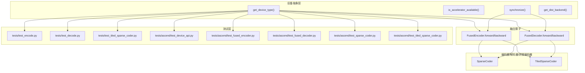
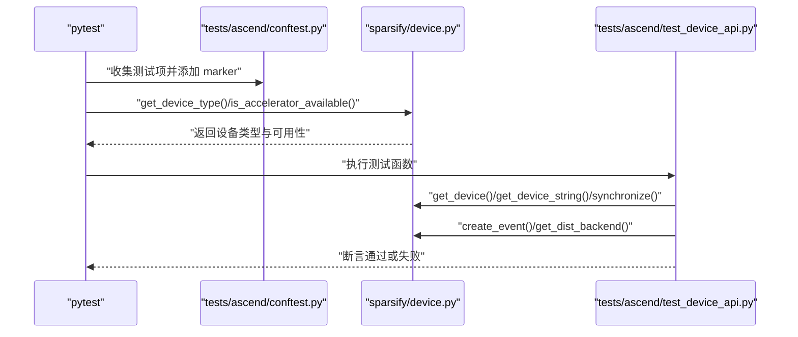
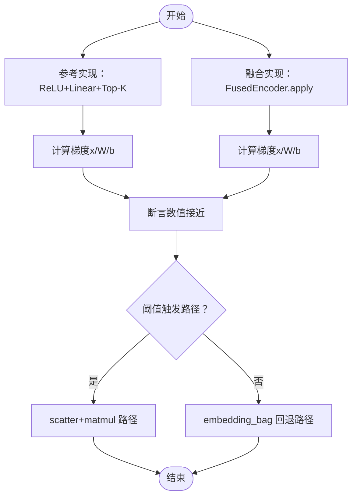
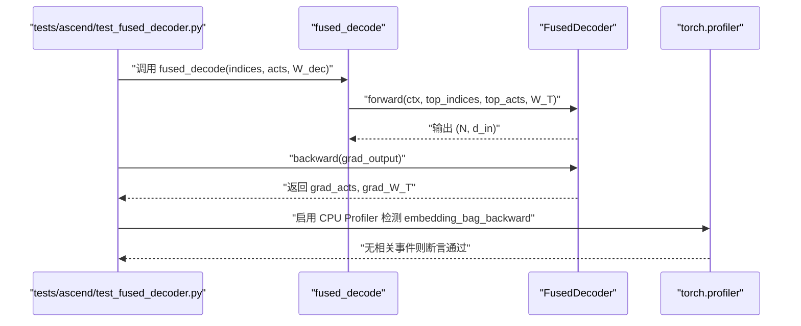
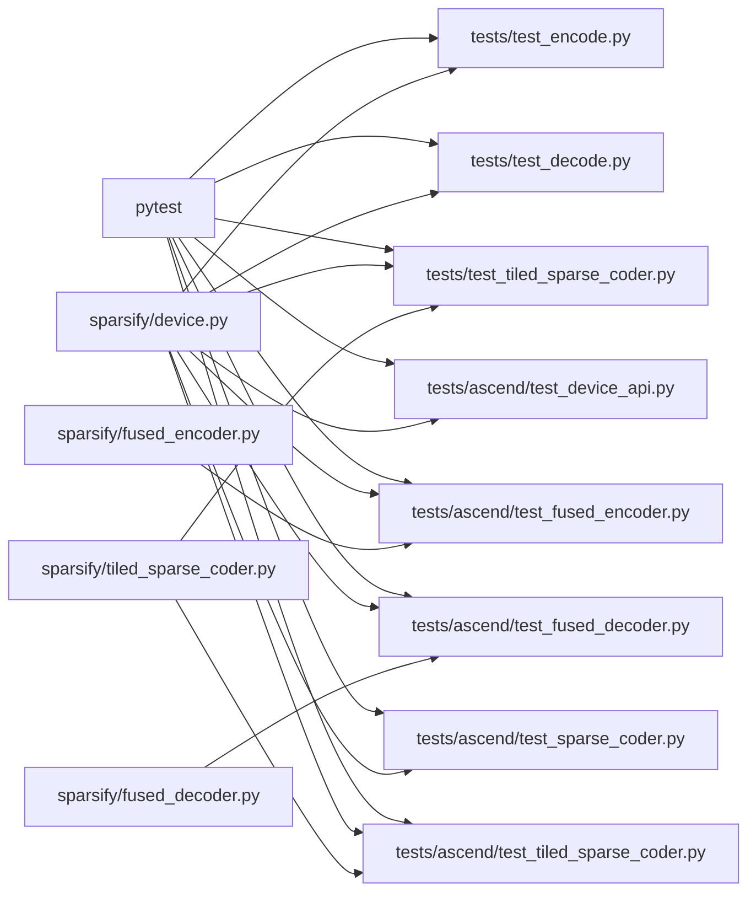

# 测试框架

<cite>
**本文引用的文件**
- [tests/conftest.py](file://tests/conftest.py)
- [tests/ascend/conftest.py](file://tests/ascend/conftest.py)
- [tests/test_encode.py](file://tests/test_encode.py)
- [tests/test_decode.py](file://tests/test_decode.py)
- [tests/test_tiled_sparse_coder.py](file://tests/test_tiled_sparse_coder.py)
- [tests/ascend/test_sparse_coder.py](file://tests/ascend/test_sparse_coder.py)
- [tests/ascend/test_tiled_sparse_coder.py](file://tests/ascend/test_tiled_sparse_coder.py)
- [tests/ascend/test_device_api.py](file://tests/ascend/test_device_api.py)
- [tests/ascend/test_fused_encoder.py](file://tests/ascend/test_fused_encoder.py)
- [tests/ascend/test_fused_decoder.py](file://tests/ascend/test_fused_decoder.py)
- [.github/workflows/build.yml](file://.github/workflows/build.yml)
- [pyproject.toml](file://pyproject.toml)
- [sparsify/device.py](file://sparsify/device.py)
- [sparsify/fused_encoder.py](file://sparsify/fused_encoder.py)
- [sparsify/fused_decoder.py](file://sparsify/fused_decoder.py)
- [sparsify/tiled_sparse_coder.py](file://sparsify/tiled_sparse_coder.py)
</cite>

## 目录
1. [简介](#简介)
2. [项目结构](#项目结构)
3. [核心组件](#核心组件)
4. [架构总览](#架构总览)
5. [详细组件分析](#详细组件分析)
6. [依赖分析](#依赖分析)
7. [性能考虑](#性能考虑)
8. [故障排查指南](#故障排查指南)
9. [结论](#结论)
10. [附录](#附录)

## 简介
本文件系统化梳理了该仓库的测试框架与实践，覆盖单元测试、集成测试与端到端测试的设计与实现；阐述测试用例的组织结构、测试数据准备与断言方法；说明分布式训练测试、性能回归测试与兼容性测试的执行方式；并提供测试环境搭建、测试运行与结果分析的指导。同时给出测试覆盖率要求、持续集成配置与自动化测试流程建议，帮助开发者高效维护与扩展测试套件。

## 项目结构
测试相关文件主要分布在以下位置：
- tests：通用测试（CPU/CUDA），包含编码器、解码器、拼接稀疏编码器等测试
- tests/ascend：Ascend NPU 专用测试，覆盖设备 API、融合算子、端到端训练等
- .github/workflows：CI 工作流定义
- pyproject.toml：开发依赖与工具配置

```mermaid
graph TB
A["tests/"] --> A1["tests/conftest.py"]
A --> A2["tests/test_encode.py"]
A --> A3["tests/test_decode.py"]
A --> A4["tests/test_tiled_sparse_coder.py"]
B["tests/ascend/"] --> B1["tests/ascend/conftest.py"]
B --> B2["tests/ascend/test_device_api.py"]
B --> B3["tests/ascend/test_fused_encoder.py"]
B --> B4["tests/ascend/test_fused_decoder.py"]
B --> B5["tests/ascend/test_sparse_coder.py"]
B --> B6["tests/ascend/test_tiled_sparse_coder.py"]
CI[".github/workflows/build.yml"] --> CI2["安装依赖与打包"]
CFG["pyproject.toml"] --> CFG2["开发依赖与工具配置"]
```

**图表来源**
- [tests/conftest.py:1-14](file://tests/conftest.py#L1-L14)
- [tests/ascend/conftest.py:1-52](file://tests/ascend/conftest.py#L1-L52)
- [.github/workflows/build.yml:1-58](file://.github/workflows/build.yml#L1-L58)
- [pyproject.toml:1-131](file://pyproject.toml#L1-L131)

**章节来源**
- [tests/conftest.py:1-14](file://tests/conftest.py#L1-L14)
- [tests/ascend/conftest.py:1-52](file://tests/ascend/conftest.py#L1-L52)
- [.github/workflows/build.yml:1-58](file://.github/workflows/build.yml#L1-L58)
- [pyproject.toml:1-131](file://pyproject.toml#L1-L131)

## 核心组件
- 设备抽象层：统一 CUDA/Ascend NPU 的设备检测、事件、同步、分布式后端等能力，避免在业务代码中直接调用平台特定 API
- 融合算子：自定义 Autograd Function 实现的融合前向与反向，针对 NPU 的内存阈值切换不同路径，保证数值一致性与性能
- 拼接稀疏编码器：将输入按隐藏维度切分为多个块，每个块独立训练 SAE，并支持全局 top-k 与输入混合等高级特性

关键测试覆盖点：
- 单元测试：验证融合算子的数值正确性、梯度一致性、边界条件与非连续张量处理
- 集成测试：验证拼接稀疏编码器的初始化、保存加载、权重分布、梯度传播与索引偏移
- 端到端测试：在 Ascend NPU 上进行完整训练回归，验证损失收敛与设备间数值一致性

**章节来源**
- [sparsify/device.py:1-118](file://sparsify/device.py#L1-L118)
- [sparsify/fused_encoder.py:1-107](file://sparsify/fused_encoder.py#L1-L107)
- [sparsify/fused_decoder.py:1-107](file://sparsify/fused_decoder.py#L1-L107)
- [sparsify/tiled_sparse_coder.py:1-200](file://sparsify/tiled_sparse_coder.py#L1-L200)

## 架构总览
测试体系围绕“设备抽象层 → 融合算子 → 编码器/解码器/拼接编码器”的层次展开，Ascend NPU 专用测试通过自动跳过机制与设备标记确保仅在具备硬件时运行。

**图表来源**
- [sparsify/device.py:34-118](file://sparsify/device.py#L34-L118)
- [sparsify/fused_encoder.py:21-107](file://sparsify/fused_encoder.py#L21-L107)
- [sparsify/fused_decoder.py:27-107](file://sparsify/fused_decoder.py#L27-L107)
- [sparsify/tiled_sparse_coder.py:17-200](file://sparsify/tiled_sparse_coder.py#L17-L200)
- [tests/test_encode.py:1-65](file://tests/test_encode.py#L1-L65)
- [tests/test_decode.py:1-85](file://tests/test_decode.py#L1-L85)
- [tests/test_tiled_sparse_coder.py:1-468](file://tests/test_tiled_sparse_coder.py#L1-L468)
- [tests/ascend/test_device_api.py:1-70](file://tests/ascend/test_device_api.py#L1-L70)
- [tests/ascend/test_fused_encoder.py:1-141](file://tests/ascend/test_fused_encoder.py#L1-L141)
- [tests/ascend/test_fused_decoder.py:1-467](file://tests/ascend/test_fused_decoder.py#L1-L467)
- [tests/ascend/test_sparse_coder.py:1-104](file://tests/ascend/test_sparse_coder.py#L1-L104)
- [tests/ascend/test_tiled_sparse_coder.py:1-53](file://tests/ascend/test_tiled_sparse_coder.py#L1-L53)

## 详细组件分析

### 设备抽象层测试（Ascend NPU）
- 目标：验证设备类型识别、bf16 支持、事件与同步、分布式后端等 API 在真实硬件上的行为
- 关键断言：设备字符串、设备对象、是否可用、是否支持 bf16、事件记录与耗时、HCCL 后端名称
- 自动跳过：通过目录级 conftest 注入 marker，未检测到 NPU 时自动跳过所有 Ascend 目录下的测试

**图表来源**
- [tests/ascend/conftest.py:31-35](file://tests/ascend/conftest.py#L31-L35)
- [sparsify/device.py:34-118](file://sparsify/device.py#L34-L118)
- [tests/ascend/test_device_api.py:18-70](file://tests/ascend/test_device_api.py#L18-L70)

**章节来源**
- [tests/ascend/conftest.py:1-52](file://tests/ascend/conftest.py#L1-L52)
- [sparsify/device.py:1-118](file://sparsify/device.py#L1-L118)
- [tests/ascend/test_device_api.py:1-70](file://tests/ascend/test_device_api.py#L1-L70)

### 融合编码器测试（Ascend NPU）
- 目标：验证融合编码器在 NPU 上的前向形状、梯度与数值一致性；对比不同路径（scatter+matmul 与 embedding_bag fallback）；跨设备（CPU/NPU）一致性
- 关键断言：输出形状、梯度一致性、大批次稳定性、非连续张量处理、路径选择与性能回归
- 方法：构造参考实现（逐步操作）与融合实现，比较前向输出与各参数梯度；通过阈值切换强制走不同路径

**图表来源**
- [tests/ascend/test_fused_encoder.py:22-141](file://tests/ascend/test_fused_encoder.py#L22-L141)
- [sparsify/fused_encoder.py:21-107](file://sparsify/fused_encoder.py#L21-L107)

**章节来源**
- [tests/ascend/test_fused_encoder.py:1-141](file://tests/ascend/test_fused_encoder.py#L1-L141)
- [sparsify/fused_encoder.py:1-107](file://sparsify/fused_encoder.py#L1-L107)

### 融合解码器测试（Ascend NPU）
- 目标：验证融合解码器在 NPU 上的前向与梯度一致性、dtype 组合、重复索引、边界 k 值、非连续张量、大规模压力测试、端到端训练回归
- 关键断言：输出形状、梯度一致性、无 CPU 回退警告、profiler 排查、内存峰值统计、训练损失收敛
- 方法：与参考实现（gather+加权求和）对比；对 embedding_bag 回退路径进行探测；使用 profiler 检测是否存在回退事件

**图表来源**
- [tests/ascend/test_fused_decoder.py:34-467](file://tests/ascend/test_fused_decoder.py#L34-L467)
- [sparsify/fused_decoder.py:27-107](file://sparsify/fused_decoder.py#L27-L107)

**章节来源**
- [tests/ascend/test_fused_decoder.py:1-467](file://tests/ascend/test_fused_decoder.py#L1-L467)
- [sparsify/fused_decoder.py:1-107](file://sparsify/fused_decoder.py#L1-L107)

### 普通编码/解码测试（CPU/CUDA）
- 目标：验证基础编码器/解码器在 CPU/CUDA 上的形状、梯度与混合精度（bf16 autocast）行为
- 关键断言：输出形状、数值接近度、梯度一致性、bf16 autocast 下的数值稳定性
- 方法：构造参考实现与融合实现，断言输出与梯度一致；在 CUDA 上启用 bf16 autocast

**章节来源**
- [tests/test_encode.py:1-65](file://tests/test_encode.py#L1-L65)
- [tests/test_decode.py:1-85](file://tests/test_decode.py#L1-L85)

### 拼接稀疏编码器测试（CPU/CUDA/NPU）
- 目标：验证初始化约束、保存/加载、权重分布、单位归一化、梯度传播、索引偏移、全局 top-k、输入混合、端到端训练
- 关键断言：形状一致性、断言异常（非法分块）、权重一致性、索引范围、混合矩阵梯度、全局 top-k 跨块选择
- 方法：使用临时目录保存/加载；对不同模式（per-tile/global_topk/input_mixing）分别断言

**章节来源**
- [tests/test_tiled_sparse_coder.py:1-468](file://tests/test_tiled_sparse_coder.py#L1-L468)
- [tests/ascend/test_tiled_sparse_coder.py:1-53](file://tests/ascend/test_tiled_sparse_coder.py#L1-L53)
- [sparsify/tiled_sparse_coder.py:1-200](file://sparsify/tiled_sparse_coder.py#L1-L200)

## 依赖分析
- 测试依赖：pytest、torch、可选 torch_npu（Ascend）
- 设备抽象层：统一设备检测与 API，屏蔽 CUDA/Ascend 差异
- 融合算子：基于阈值在不同路径间切换，确保在受限内存下仍能工作
- 拼接编码器：模块化设计，支持多种高级功能组合

**图表来源**
- [tests/conftest.py:1-14](file://tests/conftest.py#L1-L14)
- [tests/ascend/conftest.py:1-52](file://tests/ascend/conftest.py#L1-L52)
- [sparsify/device.py:1-118](file://sparsify/device.py#L1-L118)
- [sparsify/fused_encoder.py:1-107](file://sparsify/fused_encoder.py#L1-L107)
- [sparsify/fused_decoder.py:1-107](file://sparsify/fused_decoder.py#L1-L107)
- [sparsify/tiled_sparse_coder.py:1-200](file://sparsify/tiled_sparse_coder.py#L1-L200)

**章节来源**
- [tests/conftest.py:1-14](file://tests/conftest.py#L1-L14)
- [tests/ascend/conftest.py:1-52](file://tests/ascend/conftest.py#L1-L52)
- [sparsify/device.py:1-118](file://sparsify/device.py#L1-L118)
- [sparsify/fused_encoder.py:1-107](file://sparsify/fused_encoder.py#L1-L107)
- [sparsify/fused_decoder.py:1-107](file://sparsify/fused_decoder.py#L1-L107)
- [sparsify/tiled_sparse_coder.py:1-200](file://sparsify/tiled_sparse_coder.py#L1-L200)

## 性能考虑
- 路径阈值：融合算子根据 N×M×元素大小与阈值比较选择更优路径（scatter+matmul 或 embedding_bag），以平衡吞吐与内存占用
- 同步开销：在计时前后使用设备同步，确保测量准确
- 大规模压力：提供多组大规模参数组合的回归测试，监控峰值显存与形状一致性
- Profiler 探测：通过 CPU Profiler 检测是否存在 embedding_bag 回退，避免不必要的 CPU 执行

**章节来源**
- [sparsify/fused_encoder.py:18-107](file://sparsify/fused_encoder.py#L18-L107)
- [sparsify/fused_decoder.py:24-107](file://sparsify/fused_decoder.py#L24-L107)
- [tests/ascend/test_fused_decoder.py:146-170](file://tests/ascend/test_fused_decoder.py#L146-L170)
- [tests/ascend/test_fused_decoder.py:353-388](file://tests/ascend/test_fused_decoder.py#L353-L388)

## 故障排查指南
- Ascend NPU 不可用：Ascend 目录测试会自动跳过；可通过设备 API 测试确认硬件状态
- 设备同步：若计时不准确，检查是否在计时前后调用同步
- dtype 支持：部分 dtype 在 NPU 上可能不支持 embedding_bag，需跳过或降级
- 回退检测：若出现 CPU 回退警告或事件，应检查阈值设置与输入形状
- 权重加载：跨设备保存/加载需注意设备与 dtype 设置，确保数值一致

**章节来源**
- [tests/ascend/conftest.py:31-35](file://tests/ascend/conftest.py#L31-L35)
- [tests/ascend/test_device_api.py:44-66](file://tests/ascend/test_device_api.py#L44-L66)
- [tests/ascend/test_fused_decoder.py:268-298](file://tests/ascend/test_fused_decoder.py#L268-L298)
- [tests/ascend/test_sparse_coder.py:94-104](file://tests/ascend/test_sparse_coder.py#L94-L104)

## 结论
该测试框架通过设备抽象层屏蔽平台差异，结合融合算子与拼接编码器的全面测试，实现了从单元到端到端的多层次验证。Ascend NPU 专用测试确保了数值正确性、路径选择与性能稳定性；CPU/CUDA 测试保障了跨平台一致性。配合 CI 工作流与工具链配置，形成了可维护、可扩展的自动化测试体系。

## 附录

### 测试用例组织与断言方法
- 组织结构：tests 与 tests/ascend 分离，前者面向通用平台，后者面向 Ascend NPU
- 断言方法：使用数值接近断言、形状断言、梯度存在性与非零断言、设备/后端断言、异常断言
- 参数化：对 dtype、k 值、批量与维度组合进行参数化测试

**章节来源**
- [tests/test_decode.py:17-31](file://tests/test_decode.py#L17-L31)
- [tests/ascend/test_fused_decoder.py:268-298](file://tests/ascend/test_fused_decoder.py#L268-L298)
- [tests/test_tiled_sparse_coder.py:282-373](file://tests/test_tiled_sparse_coder.py#L282-L373)

### 分布式训练测试与性能回归测试
- 分布式后端：设备抽象层返回 HCCL（Ascend）或 NCCL（CUDA），用于分布式训练场景
- 性能回归：通过阈值控制路径、Profiler 探测回退、大规模压力测试与峰值内存统计

**章节来源**
- [sparsify/device.py:92-98](file://sparsify/device.py#L92-L98)
- [tests/ascend/test_fused_decoder.py:436-467](file://tests/ascend/test_fused_decoder.py#L436-L467)

### 兼容性测试执行方式
- 设备检测：通过 is_accelerator_available 与 get_device_type 判断当前平台
- 自动跳过：Ascend 目录通过 pytest_collection_modifyitems 注入 marker，未检测到 NPU 时自动跳过
- 数值一致性：在 CPU 与 NPU 上对相同权重与输入进行编码/解码路径对比

**章节来源**
- [tests/ascend/conftest.py:31-35](file://tests/ascend/conftest.py#L31-L35)
- [sparsify/device.py:53-64](file://sparsify/device.py#L53-L64)
- [tests/ascend/test_sparse_coder.py:63-91](file://tests/ascend/test_sparse_coder.py#L63-L91)

### 测试环境搭建与运行
- 安装开发依赖：使用项目提供的可选开发依赖与工具配置
- 运行测试：pytest 默认发现 tests 与 tests/ascend 下的测试；Ascend 目录在无硬件时自动跳过
- CI 配置：GitHub Actions 在推送与拉取请求时执行构建与发布流程

**章节来源**
- [pyproject.toml:30-42](file://pyproject.toml#L30-L42)
- [.github/workflows/build.yml:12-24](file://.github/workflows/build.yml#L12-L24)

### 测试覆盖率要求与持续集成
- 覆盖率：建议对关键模块（设备抽象、融合算子、拼接编码器）达到较高覆盖率，并对 Ascend 特定路径单独统计
- CI：工作流包含安装依赖与打包步骤，可扩展为包含测试与覆盖率上报
- 发布：通过语义化版本与发布流程管理包发布

**章节来源**
- [.github/workflows/build.yml:1-58](file://.github/workflows/build.yml#L1-L58)
- [pyproject.toml:65-131](file://pyproject.toml#L65-L131)